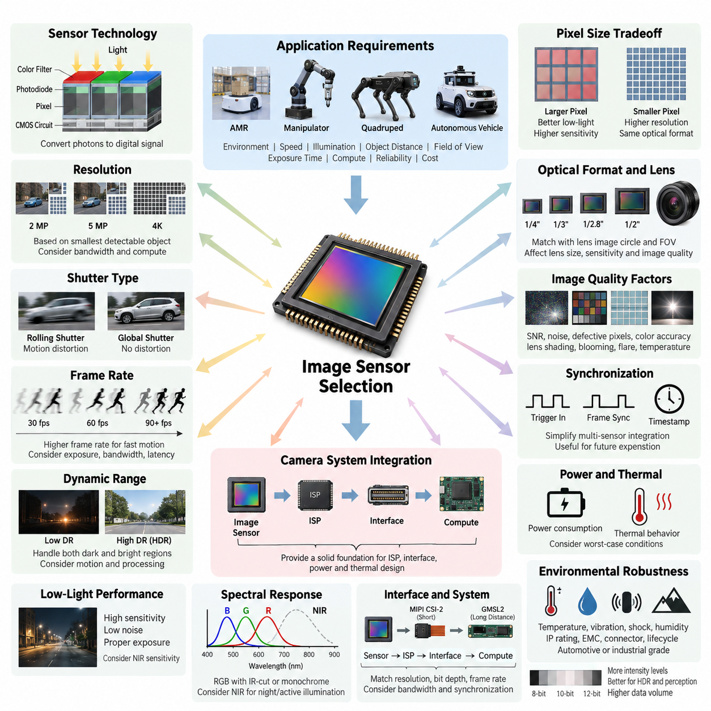
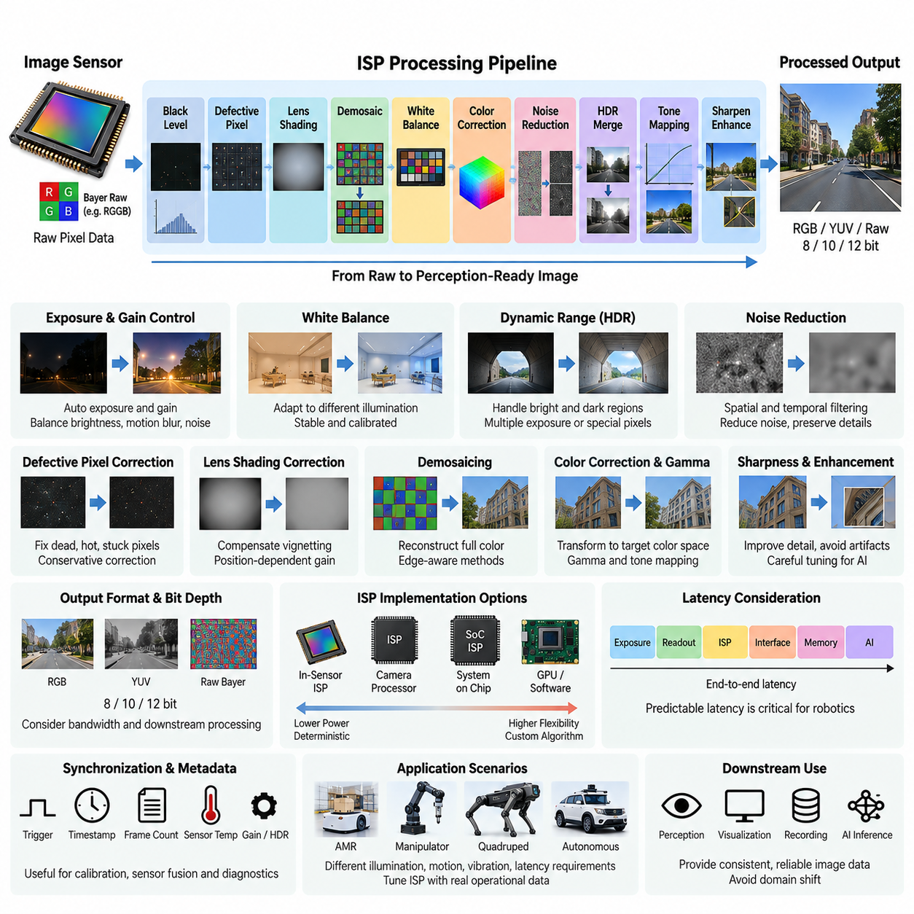
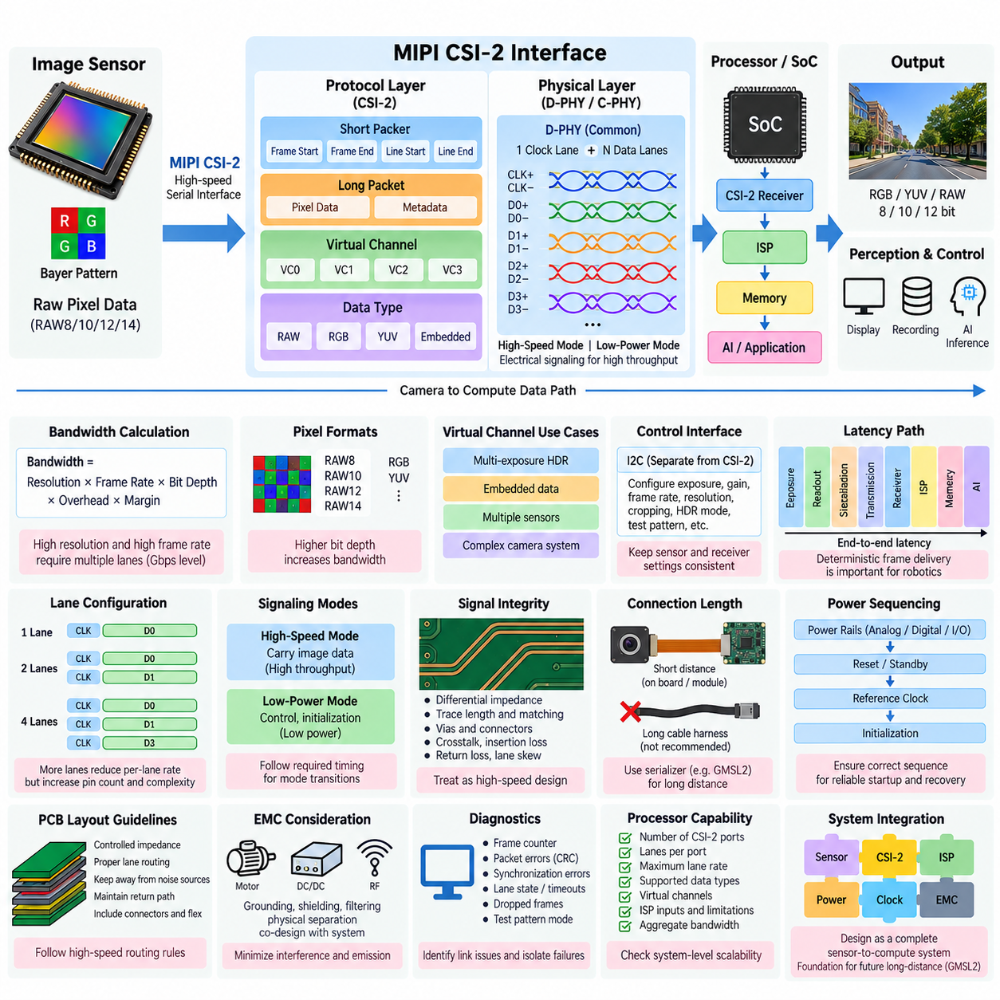
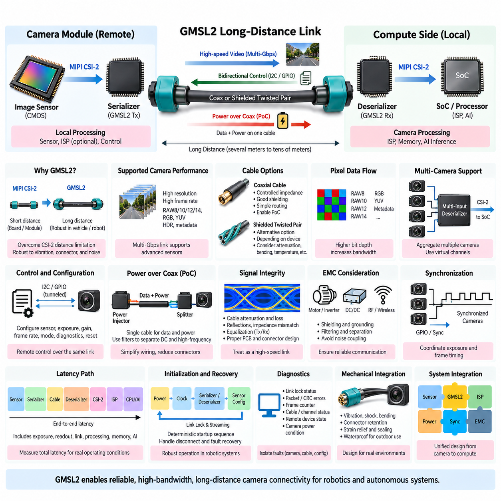
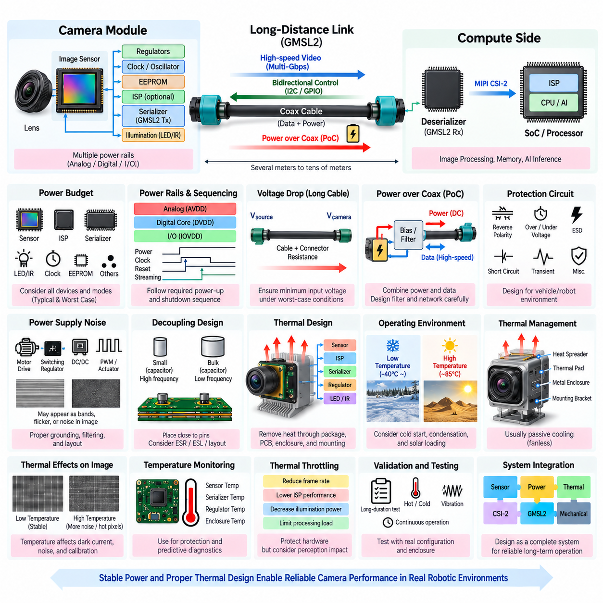

**Volume 15 Perception and Sensor Architecture**


# Chapter 01. Mono Camera

##  

## 01.01. Image Sensor Selection

{width="7.268055555555556in" height="7.268055555555556in"}

Image sensor selection is the first architectural decision in a monocular camera system because it determines the fundamental limits of spatial resolution, temporal response, dynamic range, sensitivity, noise, and downstream perception quality. In robotics, the sensor should not be selected only by megapixel count. The operating environment, robot velocity, illumination range, object distance, required field of view, exposure time, interface bandwidth, processing capability, and reliability requirements must be evaluated together.

A CMOS image sensor converts incident photons into electrical charge at each pixel and then transforms that charge into digital image information. Pixel size strongly influences this process. Larger pixels generally collect more photons during a given exposure and therefore provide better signal-to-noise performance in low-light conditions, while smaller pixels allow higher spatial resolution within the same optical format. Robotics applications must balance these characteristics rather than assuming that smaller pixels or higher resolution always produce better perception.

Resolution should be derived from the smallest object or feature that the perception system must reliably detect at the required distance. A 4K sensor may provide excellent spatial detail, but it also increases interface bandwidth, memory traffic, ISP workload, GPU processing, storage requirements, and system power. For an AMR performing navigation and obstacle detection, a carefully selected 2 MP or 5 MP sensor can sometimes provide more useful system performance than a higher-resolution sensor whose frames cannot be processed at the required rate.

Sensor optical format must be matched to the lens image circle and the desired field of view. Common formats such as 1/4-inch, 1/3-inch, 1/2.8-inch, 1/2-inch, and larger formats influence lens size, focal-length selection, packaging, sensitivity, and achievable image quality. A mismatch between sensor and lens can cause vignetting, reduced corner resolution, excessive distortion, or unnecessary optical cost. Sensor selection must therefore be performed together with lens and mechanical packaging design rather than as an isolated electronics decision.

Rolling shutter and global shutter represent an especially important tradeoff for mobile robots. A rolling-shutter sensor exposes image rows at slightly different times, which can produce geometric distortion when the robot, camera, or observed object moves rapidly. Global-shutter sensors expose the entire image simultaneously and are therefore advantageous for visual odometry, SLAM, high-speed navigation, manipulation, and machine vision. Rolling shutter remains attractive where cost, resolution, sensitivity, or availability has higher priority and motion artifacts can be tolerated or compensated.

Frame rate defines how frequently the perception system receives visual observations. Thirty frames per second is adequate for many indoor navigation and monitoring applications, while faster robots, manipulators, visual servo systems, and high-dynamic-motion applications may require 60, 90, or more frames per second. Higher frame rate also shortens the available exposure interval and increases data throughput. The selected frame rate must consequently be evaluated together with illumination, shutter speed, motion blur, interface capacity, ISP latency, and AI inference frequency.

Dynamic range determines how effectively the camera preserves information when dark and bright regions appear simultaneously. This is critical for outdoor AMRs moving between sunlight and shadow, indoor robots facing windows or entrances, and platforms operating under headlights or artificial lighting. High-dynamic-range techniques can combine multiple exposures or use specialized pixel structures, but they may introduce motion artifacts, additional latency, or processing complexity. The required HDR capability should therefore be derived from actual operational lighting scenarios.

Low-light performance depends on quantum efficiency, pixel area, read noise, dark current, analog gain characteristics, lens aperture, exposure time, and ISP processing. Increasing gain can brighten an image but also amplifies noise, while increasing exposure improves photon collection but increases motion blur. A sensor intended for autonomous robots should therefore be evaluated with moving targets and moving platforms under realistic illumination rather than judged from static laboratory images. Near-infrared sensitivity may also be important for nighttime or active-illumination systems.

Spectral response determines which wavelengths contribute to the captured image. Standard RGB cameras normally use an infrared-cut filter to maintain natural color reproduction, while robotic perception may intentionally exploit near-infrared information. Day/night systems can use removable IR filters or dedicated monochrome sensors when color is unnecessary. Monochrome sensors can provide higher effective sensitivity because they avoid color filter array losses, making them attractive for localization, feature tracking, inspection, and low-light machine-vision applications.

The sensor interface must support the required resolution, bit depth, frame rate, and number of cameras without exceeding the compute platform\'s input capacity. MIPI CSI-2 is well suited to compact camera modules and short internal connections, while later architectural stages may extend camera links through serializer/deserializer technologies such as GMSL2. Sensor selection must therefore anticipate the complete camera data path, including ISP processing, interface lanes, memory bandwidth, hardware synchronization, cabling, and edge-compute connectivity.

Bit depth affects the number of intensity levels available before image processing. Eight-bit output may be sufficient for display-oriented applications, whereas 10-bit, 12-bit, or higher raw data can preserve substantially more information for HDR imaging, low-light processing, calibration, and machine perception. However, additional bit depth increases data volume and processing requirements. The useful criterion is not maximum numerical precision but whether the complete sensor-to-perception pipeline preserves enough information for reliable algorithmic decisions.

Image quality must be considered as a collection of interacting parameters rather than a single specification. Signal-to-noise ratio, fixed-pattern noise, dark-current behavior, defective pixels, color accuracy, lens shading, temporal noise, blooming, flare sensitivity, and temperature dependence can all influence AI perception. A sensor that produces visually attractive images is not automatically the best sensor for neural-network inference. Feature stability, object-detection consistency, localization accuracy, and robustness across environmental conditions are often more meaningful engineering metrics.

Synchronization capability becomes important when a monocular camera later participates in a multi-sensor architecture. Hardware trigger inputs, frame-sync outputs, timestamp support, and deterministic exposure timing can simplify integration with stereo cameras, LiDAR, radar, IMU, and GNSS. Even when the initial design uses only one camera, selecting a sensor and camera module with synchronization capability can reduce redesign effort when the platform evolves toward sensor fusion or multi-camera perception. The volume structure explicitly treats multi-camera and sensor-compute synchronization as subsequent architectural topics.

Power consumption and thermal behavior also affect sensor performance. The image sensor, clock circuitry, ISP, serializer, memory, and supporting regulators generate heat inside a compact camera enclosure. Rising junction temperature can increase dark current and noise and may reduce long-term reliability. Outdoor robots additionally experience wide ambient-temperature variation and solar heating. Sensor evaluation should therefore include worst-case thermal conditions, continuous streaming, maximum frame rate, and enclosure constraints rather than relying only on room-temperature electrical specifications.

Environmental robustness is particularly important when a camera becomes part of an outdoor AMR, inspection robot, quadruped, humanoid, or autonomous vehicle. Temperature range, vibration, shock, humidity, ingress protection, electromagnetic compatibility, connector retention, and component lifecycle should influence the selection. Automotive-grade sensors may offer stronger qualification and long-term availability, while industrial sensors may provide specialized triggering or machine-vision features. The appropriate grade depends on the platform\'s operational and safety requirements.

The image sensor must ultimately be selected as part of the complete perception architecture. Resolution, pixel size, shutter type, frame rate, dynamic range, spectral sensitivity, optical format, interface bandwidth, synchronization, power, thermal behavior, reliability, availability, and cost should be evaluated against measurable mission requirements. This system-level approach establishes a stable foundation for the subsequent ISP, MIPI CSI-2, GMSL2, power, and thermal design stages defined within the monocular-camera architecture.

이미지 센서 선택(Image Sensor Selection)은 단안 카메라 시스템(Monocular Camera System)의 공간 해상도(Spatial Resolution), 시간 응답(Temporal Response), 동적 범위(Dynamic Range), 감도(Sensitivity), 노이즈(Noise), 그리고 후단 인지(Perception) 성능의 기본적인 한계를 결정하기 때문에 가장 먼저 이루어져야 하는 아키텍처 설계 결정이다. 로보틱스(Robotics)에서는 단순히 메가픽셀(Megapixel) 수만으로 센서를 선택해서는 안 된다. 운용 환경, 로봇 속도, 조도 범위, 객체 거리, 요구 시야각(Field of View), 노출 시간(Exposure Time), 인터페이스 대역폭(Interface Bandwidth), 연산 능력, 신뢰성 요구사항을 함께 평가해야 한다.

CMOS 이미지 센서(CMOS Image Sensor)는 각 픽셀(Pixel)에 입사되는 광자(Photon)를 전하로 변환한 다음 이를 디지털 영상 정보로 변환한다. 픽셀 크기(Pixel Size)는 이 과정에 큰 영향을 미친다. 일반적으로 큰 픽셀은 동일한 노출 시간 동안 더 많은 광자를 수집하므로 저조도(Low-Light) 환경에서 우수한 신호 대 잡음비(Signal-to-Noise Ratio)를 제공하며, 작은 픽셀은 동일한 광학 포맷(Optical Format)에서 더 높은 공간 해상도를 구현할 수 있다. 따라서 로봇 응용에서는 작은 픽셀이나 높은 해상도가 항상 더 좋은 인지 성능을 제공한다고 가정하지 말고 이러한 특성 사이의 균형을 고려해야 한다.

해상도(Resolution)는 인지 시스템(Perception System)이 요구 거리에서 안정적으로 검출해야 하는 가장 작은 객체나 특징(Feature)을 기준으로 결정해야 한다. 4K 센서는 뛰어난 공간 세부 정보를 제공할 수 있지만 인터페이스 대역폭, 메모리 트래픽(Memory Traffic), ISP 처리 부하, GPU 연산량, 저장 공간, 시스템 전력 소비도 증가시킨다. 자율이동로봇(AMR)이 주행과 장애물 검출을 수행하는 경우, 요구 프레임을 안정적으로 처리할 수 없는 고해상도 센서보다 적절하게 선정된 2 MP 또는 5 MP 센서가 시스템 관점에서 더 우수한 성능을 제공할 수도 있다.

센서 광학 포맷(Sensor Optical Format)은 렌즈 이미지 서클(Lens Image Circle) 및 요구 시야각(Field of View)과 일치하도록 설계해야 한다. 1/4인치, 1/3인치, 1/2.8인치, 1/2인치 및 그 이상의 일반적인 포맷은 렌즈 크기, 초점거리(Focal Length) 선정, 패키징(Packaging), 감도, 구현 가능한 영상 품질에 영향을 준다. 센서와 렌즈가 적절하게 일치하지 않으면 비네팅(Vignetting), 주변부 해상도 저하, 과도한 왜곡(Distortion), 불필요한 광학 비용이 발생할 수 있다. 따라서 센서 선택은 독립적인 전자 설계 항목이 아니라 렌즈 및 기구 패키징(Mechanical Packaging) 설계와 함께 수행해야 한다.

롤링 셔터(Rolling Shutter)와 글로벌 셔터(Global Shutter)의 선택은 이동 로봇에서 특히 중요한 절충 요소이다. 롤링 셔터 센서는 영상의 각 행(Row)을 서로 약간 다른 시점에 노출하기 때문에 로봇이나 카메라 또는 관측 객체가 빠르게 움직이면 기하학적 왜곡(Geometric Distortion)이 발생할 수 있다. 글로벌 셔터 센서는 전체 영상을 동시에 노출하므로 시각 주행거리계(Visual Odometry), 동시적 위치추정 및 지도작성(SLAM), 고속 주행, 매니퓰레이션(Manipulation), 머신 비전(Machine Vision)에 유리하다. 반면 비용, 해상도, 감도 또는 부품 공급성이 더 중요하고 움직임 왜곡을 허용하거나 보상할 수 있는 경우에는 롤링 셔터가 여전히 유용하다.

프레임률(Frame Rate)은 인지 시스템이 시각적 관측 정보를 얼마나 자주 획득하는지를 결정한다. 초당 30프레임(30 fps)은 많은 실내 주행 및 모니터링 응용에서 충분하지만, 고속 로봇, 매니퓰레이터(Manipulator), 비주얼 서보 시스템(Visual Servo System), 높은 동적 움직임을 갖는 응용에서는 60, 90 fps 또는 그 이상의 속도가 필요할 수 있다. 높은 프레임률은 사용 가능한 노출 시간을 단축시키면서 데이터 처리량을 증가시킨다. 따라서 프레임률은 조명, 셔터 속도(Shutter Speed), 모션 블러(Motion Blur), 인터페이스 용량, ISP 지연시간(Latency), AI 추론 주기와 함께 평가해야 한다.

동적 범위(Dynamic Range)는 어두운 영역과 밝은 영역이 동시에 존재할 때 카메라가 얼마나 효과적으로 정보를 보존할 수 있는지를 나타낸다. 이는 햇빛과 그늘 사이를 이동하는 실외 자율이동로봇(Outdoor AMR), 창문이나 출입구를 바라보는 실내 로봇, 헤드라이트 또는 인공조명 환경에서 동작하는 플랫폼에서 매우 중요하다. 고동적 범위(High Dynamic Range, HDR) 기술은 여러 노출 영상을 결합하거나 특수한 픽셀 구조를 사용할 수 있지만, 움직임 왜곡, 추가적인 지연시간 또는 처리 복잡성을 발생시킬 수 있다. 따라서 필요한 HDR 성능은 실제 운용 조명 시나리오를 기준으로 결정해야 한다.

저조도 성능(Low-Light Performance)은 양자 효율(Quantum Efficiency), 픽셀 면적, 읽기 노이즈(Read Noise), 암전류(Dark Current), 아날로그 이득(Analog Gain) 특성, 렌즈 조리개(Lens Aperture), 노출 시간, ISP 처리에 의해 결정된다. 이득을 증가시키면 영상은 밝아지지만 노이즈 역시 증폭되며, 노출 시간을 증가시키면 광자 수집량은 증가하지만 모션 블러가 커진다. 따라서 자율 로봇용 센서는 정적인 실험실 영상만으로 평가하지 말고 실제 조명 환경에서 움직이는 객체와 이동 플랫폼을 이용하여 평가해야 한다. 야간 또는 능동 조명(Active Illumination) 시스템에서는 근적외선 감도(Near-Infrared Sensitivity) 역시 중요한 요소가 될 수 있다.

분광 응답(Spectral Response)은 어떤 파장(Wavelength)의 빛이 영상 형성에 기여하는지를 결정한다. 일반적인 RGB 카메라는 자연스러운 색 재현을 위해 적외선 차단 필터(IR-Cut Filter)를 사용하지만, 로봇 인지에서는 의도적으로 근적외선(Near-Infrared) 정보를 활용할 수도 있다. 주야간 시스템(Day/Night System)은 탈착식 IR 필터 또는 색상 정보가 필요하지 않은 경우 전용 흑백 센서(Monochrome Sensor)를 사용할 수 있다. 흑백 센서는 컬러 필터 배열(Color Filter Array)에 의한 광 손실을 피할 수 있어 더 높은 유효 감도를 제공하며 위치추정, 특징 추적(Feature Tracking), 검사, 저조도 머신 비전 응용에 적합하다.

센서 인터페이스(Sensor Interface)는 연산 플랫폼(Compute Platform)의 입력 용량을 초과하지 않으면서 요구 해상도, 비트 깊이(Bit Depth), 프레임률, 카메라 수를 지원해야 한다. MIPI CSI-2는 소형 카메라 모듈과 짧은 내부 연결에 적합하며, 이후의 아키텍처 단계에서는 GMSL2와 같은 직렬화기/역직렬화기(Serializer/Deserializer) 기술을 이용하여 카메라 연결 거리를 확장할 수 있다. 따라서 센서 선택 단계에서 ISP 처리, 인터페이스 레인(Interface Lane), 메모리 대역폭, 하드웨어 동기화(Hardware Synchronization), 케이블링(Cabling), 엣지 컴퓨팅(Edge Computing) 연결을 포함한 전체 카메라 데이터 경로를 고려해야 한다.

비트 깊이(Bit Depth)는 영상 처리 이전 단계에서 표현할 수 있는 밝기 단계의 수에 영향을 준다. 8비트 출력은 디스플레이 중심 응용에서 충분할 수 있지만, 10비트, 12비트 또는 그 이상의 원시 데이터(Raw Data)는 HDR 영상, 저조도 처리, 보정(Calibration), 머신 인지(Machine Perception)를 위해 훨씬 많은 정보를 보존할 수 있다. 그러나 비트 깊이가 증가하면 데이터 용량과 처리 요구량도 증가한다. 따라서 최대 수치 정밀도 자체보다 센서에서 인지 시스템까지 이어지는 전체 파이프라인이 신뢰성 있는 알고리즘 판단에 충분한 정보를 유지하는지가 더 중요한 선정 기준이다.

영상 품질(Image Quality)은 하나의 사양이 아니라 서로 상호작용하는 여러 파라미터의 집합으로 평가해야 한다. 신호 대 잡음비(Signal-to-Noise Ratio), 고정 패턴 노이즈(Fixed-Pattern Noise), 암전류 특성, 불량 픽셀(Defective Pixel), 색 정확도(Color Accuracy), 렌즈 셰이딩(Lens Shading), 시간적 노이즈(Temporal Noise), 블루밍(Blooming), 플레어 민감도(Flare Sensitivity), 온도 의존성 등이 AI 인지 성능에 영향을 줄 수 있다. 시각적으로 아름다운 영상을 생성하는 센서가 반드시 신경망 추론(Neural-Network Inference)에 가장 적합한 센서는 아니며, 특징 안정성, 객체 검출 일관성, 위치추정 정확도, 환경 변화에 대한 강건성(Robustness)이 더욱 의미 있는 엔지니어링 평가 지표가 될 수 있다.

동기화 기능(Synchronization Capability)은 단안 카메라가 향후 다중 센서 아키텍처(Multi-Sensor Architecture)에 통합될 때 중요해진다. 하드웨어 트리거 입력(Hardware Trigger Input), 프레임 동기 출력(Frame-Sync Output), 타임스탬프(Timestamp) 지원, 결정론적 노출 타이밍(Deterministic Exposure Timing)은 스테레오 카메라, LiDAR, 레이더(Radar), 관성측정장치(IMU), 위성항법시스템(GNSS)과의 통합을 단순화한다. 초기 설계가 단일 카메라만 사용하더라도 동기화 기능을 지원하는 센서와 카메라 모듈을 선택하면 향후 센서 융합(Sensor Fusion)이나 다중 카메라 인지 시스템으로 확장할 때 재설계 부담을 줄일 수 있다.

전력 소비(Power Consumption)와 열적 거동(Thermal Behavior) 역시 센서 성능에 영향을 준다. 이미지 센서, 클록 회로(Clock Circuitry), ISP, 직렬화기(Serializer), 메모리, 전원 레귤레이터(Power Regulator)는 소형 카메라 인클로저(Enclosure) 내부에서 열을 발생시킨다. 접합부 온도(Junction Temperature)가 상승하면 암전류와 노이즈가 증가하고 장기 신뢰성이 저하될 수 있다. 실외 로봇은 넓은 주변 온도 변화와 태양 복사열에도 노출되므로 센서 평가는 실온의 전기적 사양에만 의존하지 말고 최대 프레임률의 연속 스트리밍, 최악 조건의 온도, 인클로저의 방열 제약까지 포함해야 한다.

환경 강건성(Environmental Robustness)은 카메라가 실외 자율이동로봇, 검사 로봇, 사족보행 로봇(Quadruped), 휴머노이드(Humanoid), 자율주행 차량의 일부가 될 경우 특히 중요하다. 동작 온도 범위, 진동(Vibration), 충격(Shock), 습도, 방진·방수(Ingress Protection), 전자기 적합성(Electromagnetic Compatibility), 커넥터 유지력(Connector Retention), 부품 수명주기(Component Lifecycle)를 센서 선정 과정에서 고려해야 한다. 자동차 등급 센서(Automotive-Grade Sensor)는 보다 강력한 품질 인증과 장기 공급성을 제공할 수 있으며, 산업용 센서(Industrial Sensor)는 특수 트리거 기능이나 머신 비전 기능을 제공할 수 있다. 적절한 등급은 플랫폼의 운용 조건과 안전 요구사항에 따라 결정해야 한다.

이미지 센서는 궁극적으로 전체 인지 아키텍처(Perception Architecture)의 일부로서 선정해야 한다. 해상도, 픽셀 크기, 셔터 방식, 프레임률, 동적 범위, 분광 감도, 광학 포맷, 인터페이스 대역폭, 동기화, 전력, 열적 특성, 신뢰성, 공급 가능성, 비용을 측정 가능한 임무 요구사항(Mission Requirements)에 대해 종합적으로 평가해야 한다. 이러한 시스템 수준 접근법(System-Level Approach)은 단안 카메라 아키텍처에서 이후 진행되는 ISP, MIPI CSI-2, GMSL2, 전원 및 열 설계 단계의 안정적인 기술적 기반을 제공한다.

##  

## 01.02. ISP Design

{width="7.268055555555556in" height="7.268055555555556in"}

An Image Signal Processor (ISP) transforms raw pixel measurements from an image sensor into structured image data suitable for perception, visualization, recording, or AI inference. Within a monocular camera architecture, the ISP forms the processing bridge between the selected CMOS sensor and downstream computing. Its design determines how effectively sensor information is preserved, corrected, enhanced, and delivered while controlling latency, bandwidth, power consumption, and image consistency.

The ISP pipeline begins with raw sensor data, commonly represented through a Bayer color filter array such as RGGB, BGGR, GRBG, or GBRG. Each photosite measures only a limited spectral component, so the raw frame is not yet a conventional RGB image. Before higher-level perception can use it, the ISP must compensate for sensor imperfections and reconstruct useful color and intensity information while avoiding unnecessary destruction of features that may be valuable to machine-vision algorithms.

Black-level correction removes the electrical offset that remains when a pixel receives little or no light. Without this correction, dark regions may contain artificial brightness, color imbalance, or temperature-dependent bias. The correction value can vary with sensor operating mode, analog gain, exposure, and temperature. Accurate black-level processing establishes a stable reference for subsequent operations such as gain adjustment, demosaicing, color correction, noise reduction, and high-dynamic-range processing.

Defective-pixel correction identifies pixels whose responses differ abnormally from neighboring pixels because of manufacturing variation, aging, radiation, temperature, or electrical defects. Dead, stuck, hot, or excessively noisy pixels can generate false features that interfere with computer vision. An ISP can replace these measurements using neighboring spatial information while preserving real edges. For robotic perception, correction should remain conservative because aggressive filtering may remove small but legitimate visual features required for localization or inspection.

Lens-shading correction compensates for brightness and color variation across the image caused by optical characteristics, sensor geometry, and chief-ray angle. Image corners commonly receive less illumination than the center, producing vignetting and nonuniform color response. Calibration tables or mathematical models can apply position-dependent gains to restore uniformity. The correction must be coordinated with the selected sensor and lens because changing the lens, aperture, sensor format, or mechanical alignment can alter the required compensation.

Demosaicing reconstructs full-color information from the color filter array by estimating missing color components at each pixel. Simple interpolation requires little computation but may create zipper artifacts, false colors, or reduced edge quality. More advanced edge-aware methods preserve boundaries and fine structures more effectively at greater computational cost. In robotics, demosaicing should be evaluated not only by visual appearance but also by its influence on feature detection, optical flow, segmentation, recognition, and neural-network inference.

White-balance processing adjusts the relative red, green, and blue gains so that objects maintain useful color representation under different illumination sources. Automatic white balance may respond continuously to daylight, fluorescent lighting, LEDs, shadows, or mixed illumination. Rapid or unstable adjustments, however, can cause frame-to-frame color variation that is undesirable for perception. Robotic camera systems may therefore favor controlled, slowly varying, calibrated, or application-specific white-balance strategies over display-oriented behavior.

Color correction transforms the sensor\'s native spectral response into a desired color space using a color correction matrix and associated calibration parameters. The sensor, lens, IR-cut filter, illumination, and ISP configuration all influence the resulting color. Gamma correction and tone mapping subsequently transform intensity values into representations appropriate for display or processing. For AI perception, these transformations should remain deterministic because differences between training images and deployed-camera processing can create domain shifts that reduce model accuracy.

Noise reduction becomes increasingly important under low illumination or high analog gain. Spatial filtering suppresses noise within an individual frame, while temporal filtering combines information across consecutive frames to achieve stronger noise reduction. Excessive filtering can erase texture, thin edges, small objects, or transient events, whereas insufficient filtering increases false features and degrades compression or inference. Mobile robots require particular caution with temporal filtering because camera and scene motion can create ghosting or delayed visual responses.

High-dynamic-range processing is required when a scene contains both very bright and very dark regions. Depending on the sensor, HDR may combine short and long exposures, use staggered exposure sequences, or process specialized high-dynamic-range pixel outputs. The ISP must merge these measurements while controlling saturation, noise, motion artifacts, and temporal inconsistency. Outdoor AMRs and autonomous platforms particularly benefit from HDR when moving between sunlight, shadow, tunnels, entrances, reflective surfaces, and artificial lighting.

Exposure control determines how long the sensor integrates incoming light, while gain control determines how strongly the resulting signal is amplified. Automatic exposure algorithms must balance brightness against motion blur, noise, saturation, and frame-rate constraints. A stationary surveillance camera can tolerate relatively long exposure, but a moving robot may require short exposure to preserve geometric features. Consequently, robotics-oriented auto-exposure should consider platform velocity and perception requirements rather than optimizing average image brightness alone.

Sharpness and edge enhancement can improve apparent image detail, but aggressive enhancement may create artificial contours or ringing that machine-perception algorithms interpret as real structure. Local contrast enhancement and tone mapping present similar tradeoffs. ISP tuning for robotics should therefore prioritize repeatable physical information over visually impressive output. An image that appears slightly less vivid to a human observer may provide more stable features and better neural-network performance across changing environmental conditions.

The ISP output format should be selected according to downstream processing requirements. RGB and BGR formats are convenient for many vision algorithms, while YUV formats can reduce bandwidth or support video pipelines. Raw Bayer output preserves more sensor information and allows processing on the edge computer or GPU but requires substantially greater downstream responsibility. Bit depth, chroma subsampling, compression, resolution, and frame rate collectively determine memory bandwidth and communication requirements.

ISP implementation can reside inside the image sensor, within a dedicated camera processor, in a system-on-chip, or as part of an edge-computing platform. Hardware ISP blocks provide deterministic high-throughput processing with relatively low power, whereas GPU or software processing offers greater flexibility for experimental algorithms and specialized perception. The appropriate partition depends on camera count, latency requirements, compute resources, thermal limits, interface bandwidth, development flexibility, and the need for deterministic real-time behavior.

Latency must be treated as an architectural parameter rather than merely a processing benchmark. Sensor exposure, frame readout, buffering, ISP stages, interface transfer, memory movement, and AI inference collectively determine perception latency. Excessive buffering or multi-frame processing can produce high-quality images while delaying the robot\'s understanding of the environment. For autonomous navigation and visual control, predictable end-to-end latency can be more important than maximizing individual image-quality metrics.

The ISP must also support synchronization and metadata propagation when cameras participate in larger sensor architectures. Exposure timestamps, frame counters, gain values, sensor temperature, HDR state, and trigger information can be valuable for calibration, diagnostics, sensor fusion, and dataset generation. Maintaining a reliable relationship between processed frames and their acquisition time becomes increasingly important when camera information is fused with LiDAR, radar, IMU, GNSS, or additional cameras.

ISP tuning should ultimately be performed using representative operational data rather than generic consumer-camera preferences. Indoor AMRs, outdoor robots, manipulators, quadrupeds, and autonomous vehicles experience different illumination, motion, vibration, object scale, and latency requirements. The final ISP configuration should therefore be validated against downstream perception metrics as well as conventional image-quality measurements. This creates the processing foundation for the subsequent MIPI CSI-2 interface, GMSL2 long-distance link, and camera power and thermal architecture defined in the monocular-camera structure.

이미지 신호 프로세서(Image Signal Processor, ISP)는 이미지 센서(Image Sensor)에서 생성된 원시 픽셀 측정값(Raw Pixel Measurements)을 인지(Perception), 시각화(Visualization), 기록(Recording), 또는 AI 추론(AI Inference)에 적합한 구조화된 영상 데이터로 변환한다. 단안 카메라 아키텍처(Monocular Camera Architecture)에서 ISP는 선택된 CMOS 센서와 후단 연산 시스템(Downstream Computing)을 연결하는 처리 계층이다. ISP 설계는 센서 정보가 얼마나 효과적으로 보존, 보정, 향상 및 전달되는지를 결정하며, 동시에 지연시간(Latency), 대역폭(Bandwidth), 전력 소비(Power Consumption), 영상 일관성(Image Consistency)을 제어한다.

ISP 파이프라인(ISP Pipeline)은 일반적으로 RGGB, BGGR, GRBG 또는 GBRG와 같은 베이어 컬러 필터 배열(Bayer Color Filter Array) 형태로 표현되는 원시 센서 데이터(Raw Sensor Data)에서 시작된다. 각 포토사이트(Photosite)는 제한된 분광 성분(Spectral Component)만을 측정하므로 원시 프레임(Raw Frame)은 아직 일반적인 RGB 영상이 아니다. 상위 수준 인지 시스템이 이를 사용하기 전에 ISP는 센서의 불완전성을 보상하고 유용한 색상 및 밝기 정보를 복원하면서 머신 비전(Machine Vision) 알고리즘에 필요한 특징이 불필요하게 손실되지 않도록 해야 한다.

블랙 레벨 보정(Black-Level Correction)은 픽셀이 빛을 거의 또는 전혀 받지 않을 때에도 남아 있는 전기적 오프셋(Electrical Offset)을 제거한다. 이 보정이 없으면 어두운 영역에 인위적인 밝기, 색상 불균형(Color Imbalance), 온도에 따른 바이어스(Bias)가 나타날 수 있다. 보정값은 센서 동작 모드, 아날로그 이득(Analog Gain), 노출(Exposure), 온도에 따라 달라질 수 있다. 정확한 블랙 레벨 처리는 이후의 이득 조정, 디모자이킹(Demosaicing), 색상 보정(Color Correction), 노이즈 감소(Noise Reduction), 고동적 범위(High Dynamic Range) 처리에 안정적인 기준을 제공한다.

불량 픽셀 보정(Defective-Pixel Correction)은 제조 편차, 노화(Aging), 방사선(Radiation), 온도 또는 전기적 결함으로 인해 주변 픽셀과 비정상적으로 다른 응답을 보이는 픽셀을 식별한다. 데드 픽셀(Dead Pixel), 고정 픽셀(Stuck Pixel), 핫 픽셀(Hot Pixel), 과도한 노이즈 픽셀은 컴퓨터 비전(Computer Vision)에 영향을 주는 잘못된 특징을 생성할 수 있다. ISP는 실제 경계를 보존하면서 주변 공간 정보를 이용하여 이러한 측정값을 대체할 수 있다. 로봇 인지에서는 과도한 필터링이 위치추정이나 검사에 필요한 작지만 실제 존재하는 시각적 특징을 제거할 수 있으므로 보수적인 보정이 중요하다.

렌즈 셰이딩 보정(Lens-Shading Correction)은 광학 특성, 센서 형상, 주광선 각도(Chief-Ray Angle)로 인해 영상 전체에 발생하는 밝기와 색상의 편차를 보상한다. 일반적으로 영상의 모서리는 중앙보다 적은 빛을 받아 비네팅(Vignetting)과 불균일한 색상 응답이 발생할 수 있다. 보정 테이블(Calibration Table) 또는 수학적 모델을 이용하여 위치에 따른 이득(Position-Dependent Gain)을 적용하면 이러한 불균일성을 보정할 수 있다. 렌즈, 조리개(Aperture), 센서 포맷 또는 기계적 정렬(Mechanical Alignment)이 변경되면 필요한 보정값도 달라질 수 있으므로 센서와 렌즈를 함께 고려해야 한다.

디모자이킹(Demosaicing)은 컬러 필터 배열(Color Filter Array)에서 각 픽셀에 존재하지 않는 색상 성분을 추정하여 완전한 컬러 정보를 복원한다. 단순 보간(Simple Interpolation)은 연산량이 적지만 지퍼 아티팩트(Zipper Artifact), 잘못된 색상(False Color), 경계 품질 저하를 발생시킬 수 있다. 보다 발전된 경계 인식 방식(Edge-Aware Method)은 더 많은 연산을 요구하지만 경계와 미세 구조를 효과적으로 보존한다. 로보틱스에서는 디모자이킹을 시각적 품질뿐 아니라 특징 검출(Feature Detection), 광류(Optical Flow), 분할(Segmentation), 인식(Recognition), 신경망 추론(Neural-Network Inference)에 미치는 영향까지 고려하여 평가해야 한다.

화이트 밸런스 처리(White-Balance Processing)는 다양한 광원 아래에서도 객체의 색상이 유용하게 표현되도록 적색, 녹색, 청색의 상대적인 이득을 조정한다. 자동 화이트 밸런스(Automatic White Balance)는 주광(Daylight), 형광등, LED, 그림자 또는 혼합 조명에 따라 지속적으로 변화할 수 있다. 그러나 지나치게 빠르거나 불안정한 조정은 프레임 간 색상 변화(Frame-to-Frame Color Variation)를 발생시켜 인지 시스템에 불리할 수 있다. 따라서 로봇 카메라는 디스플레이 중심의 동작보다 제어된 방식, 완만하게 변화하는 방식, 보정된 방식 또는 응용 분야에 특화된 화이트 밸런스 전략을 사용할 수 있다.

색상 보정(Color Correction)은 색상 보정 행렬(Color Correction Matrix)과 관련 보정 파라미터를 사용하여 센서 고유의 분광 응답(Spectral Response)을 원하는 색 공간(Color Space)으로 변환한다. 센서, 렌즈, 적외선 차단 필터(IR-Cut Filter), 조명, ISP 설정은 모두 최종 색상에 영향을 준다. 이후 감마 보정(Gamma Correction)과 톤 매핑(Tone Mapping)은 밝기 값을 디스플레이 또는 처리에 적합한 형태로 변환한다. AI 인지에서는 학습 영상과 실제 배치된 카메라의 처리 방식 차이가 모델 정확도를 저하시키는 도메인 시프트(Domain Shift)를 발생시킬 수 있으므로 이러한 변환의 결정론적 특성(Deterministic Behavior)이 중요하다.

노이즈 감소(Noise Reduction)는 저조도 또는 높은 아날로그 이득 환경에서 더욱 중요해진다. 공간 필터링(Spatial Filtering)은 하나의 프레임 내부에서 노이즈를 억제하고, 시간 필터링(Temporal Filtering)은 연속된 여러 프레임의 정보를 결합하여 보다 강한 노이즈 감소 효과를 제공한다. 과도한 필터링은 텍스처(Texture), 얇은 경계, 작은 객체 또는 순간적인 사건을 제거할 수 있으며, 반대로 필터링이 부족하면 잘못된 특징이 증가하고 압축 또는 추론 성능이 저하된다. 이동 로봇에서는 카메라와 장면의 움직임으로 인해 고스팅(Ghosting)이나 지연된 시각 응답이 발생할 수 있으므로 시간 필터링에 특히 주의해야 한다.

고동적 범위 처리(High-Dynamic-Range Processing)는 하나의 장면에 매우 밝은 영역과 매우 어두운 영역이 동시에 존재할 때 필요하다. 센서에 따라 HDR은 짧은 노출과 긴 노출을 결합하거나, 스태거드 노출 시퀀스(Staggered Exposure Sequence)를 사용하거나, 특수한 고동적 범위 픽셀 출력을 처리할 수 있다. ISP는 포화(Saturation), 노이즈, 움직임 아티팩트(Motion Artifact), 시간적 불일치(Temporal Inconsistency)를 제어하면서 이러한 측정값을 통합해야 한다. 실외 자율이동로봇(Outdoor AMR)과 자율 플랫폼은 햇빛, 그림자, 터널, 출입구, 반사 표면, 인공조명 사이를 이동할 때 특히 HDR의 이점을 얻을 수 있다.

노출 제어(Exposure Control)는 센서가 입사광을 적분하는 시간을 결정하며, 이득 제어(Gain Control)는 생성된 신호를 얼마나 증폭할지를 결정한다. 자동 노출(Automatic Exposure) 알고리즘은 밝기와 모션 블러(Motion Blur), 노이즈, 포화, 프레임률 제약 사이의 균형을 유지해야 한다. 고정된 감시 카메라는 비교적 긴 노출 시간을 허용할 수 있지만 이동 로봇은 기하학적 특징을 보존하기 위해 짧은 노출 시간이 필요할 수 있다. 따라서 로보틱스용 자동 노출은 평균 영상 밝기만을 최적화하기보다 플랫폼 속도와 인지 요구사항을 함께 고려해야 한다.

선명도(Sharpness)와 경계 향상(Edge Enhancement)은 영상의 세부 정보가 더 뚜렷하게 보이도록 할 수 있지만, 과도한 향상은 머신 인지 알고리즘이 실제 구조로 잘못 해석할 수 있는 인위적인 윤곽선이나 링잉(Ringing)을 생성할 수 있다. 국부 대비 향상(Local Contrast Enhancement)과 톤 매핑에서도 유사한 절충 관계가 존재한다. 따라서 로보틱스용 ISP 튜닝(ISP Tuning)은 시각적으로 화려한 영상보다 반복 가능한 물리적 정보의 보존을 우선해야 한다. 사람에게 다소 덜 선명하게 보이는 영상이라도 변화하는 환경에서 더 안정적인 특징과 우수한 신경망 성능을 제공할 수 있다.

ISP 출력 포맷(ISP Output Format)은 후단 처리 요구사항에 따라 선택해야 한다. RGB와 BGR 포맷은 많은 비전 알고리즘에 편리하며, YUV 포맷은 대역폭을 줄이거나 비디오 파이프라인(Video Pipeline)을 지원하는 데 유용하다. 원시 베이어 출력(Raw Bayer Output)은 더 많은 센서 정보를 보존하고 엣지 컴퓨터(Edge Computer) 또는 GPU에서 직접 처리할 수 있게 하지만 후단 시스템에 훨씬 많은 처리 책임을 요구한다. 비트 깊이(Bit Depth), 크로마 서브샘플링(Chroma Subsampling), 압축(Compression), 해상도, 프레임률은 전체 메모리 대역폭과 통신 요구량을 결정한다.

ISP는 이미지 센서 내부, 전용 카메라 프로세서(Dedicated Camera Processor), 시스템 온 칩(System-on-Chip, SoC), 또는 엣지 컴퓨팅 플랫폼(Edge-Computing Platform)에 구현할 수 있다. 하드웨어 ISP(Hardware ISP)는 비교적 낮은 전력으로 결정론적이고 높은 처리량을 제공하는 반면, GPU 또는 소프트웨어 기반 처리는 실험적 알고리즘과 특수한 인지 기능을 위한 높은 유연성을 제공한다. 적절한 기능 분할(Partitioning)은 카메라 수, 지연시간 요구사항, 연산 자원, 열적 한계, 인터페이스 대역폭, 개발 유연성, 결정론적 실시간 동작(Deterministic Real-Time Behavior)의 필요성에 따라 결정된다.

지연시간(Latency)은 단순한 처리 성능 지표가 아니라 아키텍처 파라미터(Architectural Parameter)로 다루어야 한다. 센서 노출, 프레임 판독(Frame Readout), 버퍼링(Buffering), ISP 처리 단계, 인터페이스 전송, 메모리 이동, AI 추론이 결합되어 전체 인지 지연시간(Perception Latency)을 결정한다. 과도한 버퍼링이나 다중 프레임 처리는 높은 영상 품질을 제공하면서도 로봇이 환경을 인식하는 시점을 지연시킬 수 있다. 자율주행과 시각 제어(Visual Control)에서는 개별 영상 품질 지표를 극대화하는 것보다 예측 가능한 종단간 지연시간(End-to-End Latency)을 확보하는 것이 더 중요할 수 있다.

카메라가 더 큰 센서 아키텍처(Sensor Architecture)에 참여하는 경우 ISP는 동기화(Synchronization)와 메타데이터 전달(Metadata Propagation)도 지원해야 한다. 노출 타임스탬프(Exposure Timestamp), 프레임 카운터(Frame Counter), 이득값, 센서 온도, HDR 상태, 트리거 정보(Trigger Information)는 보정(Calibration), 진단(Diagnostics), 센서 융합(Sensor Fusion), 데이터셋 생성(Dataset Generation)에 유용하다. 처리된 프레임과 실제 영상 획득 시점 사이의 신뢰성 있는 관계를 유지하는 것은 카메라 정보를 LiDAR, 레이더(Radar), 관성측정장치(IMU), 위성항법시스템(GNSS), 또는 추가 카메라와 융합할 때 더욱 중요해진다.

ISP 튜닝(ISP Tuning)은 일반적인 소비자 카메라의 선호도보다 실제 운용 환경을 대표하는 데이터를 이용하여 수행해야 한다. 실내 자율이동로봇(Indoor AMR), 실외 로봇, 매니퓰레이터(Manipulator), 사족보행 로봇(Quadruped), 자율주행 차량(Autonomous Vehicle)은 서로 다른 조명, 움직임, 진동, 객체 크기, 지연시간 요구조건을 가진다. 따라서 최종 ISP 설정은 기존의 영상 품질 측정뿐 아니라 후단 인지 성능 지표(Downstream Perception Metrics)를 기준으로 검증해야 한다. 이러한 설계는 단안 카메라 구조에서 이후 다루어지는 MIPI CSI-2 인터페이스, GMSL2 장거리 링크(Long-Distance Link), 카메라 전원 및 열 아키텍처(Camera Power and Thermal Architecture)를 위한 처리 기반을 형성한다.

##  

## 01.03. MIPI CSI-2 Interface

{width="7.268055555555556in" height="7.268055555555556in"}

MIPI CSI-2 (Mobile Industry Processor Interface Camera Serial Interface 2) is a high-speed serial interface widely used to connect image sensors and camera modules to processors, SoCs, and embedded computing platforms. Within a monocular camera architecture, it provides the primary transport path between the image sensor or camera-side processing circuitry and downstream computing. Its design directly affects achievable resolution, frame rate, latency, wiring complexity, power consumption, and signal integrity.

CSI-2 separates the camera protocol from the physical signaling layer. The protocol defines how image pixels, synchronization information, metadata, and control-related information are organized into packets, while a physical layer such as MIPI D-PHY or C-PHY transports those packets electrically. This separation allows camera architectures to evolve toward higher data rates while maintaining a standardized logical interface between sensors, processors, and supporting devices.

A typical D-PHY camera connection contains one differential clock lane and one or more differential data lanes. Depending on sensor capability and required bandwidth, one, two, four, or additional lanes may be used. Increasing the lane count distributes the image stream across more physical channels and reduces the required data rate per lane, but it also increases pin count, PCB routing complexity, connector requirements, and physical design constraints.

Required CSI-2 bandwidth should be calculated from image resolution, frame rate, pixel format, bit depth, protocol overhead, and operating margin. A camera producing millions of pixels at 30 or 60 frames per second can generate several gigabits per second of raw traffic before processing or compression. Selecting a CSI-2 configuration without an explicit bandwidth budget can result in dropped frames, reduced operating modes, or an inability to use the sensor\'s intended resolution and frame rate simultaneously.

CSI-2 transports information using short and long packets. Short packets commonly convey synchronization events such as frame start, frame end, line start, or line end, while long packets carry pixel payloads and other larger data structures. Packet headers identify the data type and virtual channel, allowing the receiver to interpret the incoming stream correctly. Error-detection mechanisms help identify corrupted headers or payloads before invalid information propagates into the ISP or perception pipeline.

Virtual channels allow multiple logical image streams to share a CSI-2 link. This capability can support multi-exposure HDR, embedded data, multiple sensor streams, or more complex camera architectures when the connected devices support the required configuration. The receiver must correctly associate each virtual channel and data type with the intended processing path. Incorrect configuration can cause frames to be mixed, ignored, or interpreted with the wrong pixel format.

Pixel data may be transported in formats such as RAW8, RAW10, RAW12, RAW14, RGB, or YUV depending on the sensor and camera architecture. Raw Bayer formats preserve sensor-level information and are commonly delivered to an ISP for subsequent processing. Higher bit depth improves available intensity precision but directly increases interface bandwidth. Pixel format selection should therefore be coordinated with ISP capability, memory bandwidth, AI requirements, and the desired image-quality pipeline.

The D-PHY physical layer supports high-speed and low-power signaling modes. High-speed operation carries image data at high throughput, while low-power states support control, initialization, and reduced energy consumption when continuous high-speed transmission is unnecessary. Transitions between these modes must follow the required timing behavior. Reliable initialization is particularly important in robotics, where cameras may experience repeated power cycles, software restarts, or recovery operations during long-duration deployment.

Signal integrity becomes increasingly difficult as CSI-2 lane rates rise. Differential impedance, trace length, pair matching, via structures, connectors, reference planes, crosstalk, insertion loss, and return loss all influence link quality. PCB routing should maintain controlled impedance and minimize discontinuities. Excessive skew between the positive and negative traces of a differential pair, or between related lanes, can reduce timing margin and cause intermittent errors that may only appear at high temperature or maximum data rate.

CSI-2 is primarily intended for relatively short connections inside electronic assemblies. The interface can work effectively between a nearby sensor module and processing board, but direct extension through long robot cable harnesses is generally undesirable. Cable length, connectors, electromagnetic interference, mechanical movement, and environmental exposure can degrade high-speed signaling. This limitation is one reason camera architectures often combine local MIPI CSI-2 connections with serializer/deserializer technologies for longer-distance transport.

Clock architecture must be considered together with CSI-2 communication. The image sensor normally requires a reference clock, while internal timing determines exposure, line readout, frame timing, and serialized output. Clock quality, jitter, startup sequence, and frequency accuracy can affect stable operation. Multi-camera systems additionally require careful synchronization if images must represent the same physical instant, particularly for stereo vision, sensor fusion, visual odometry, and autonomous navigation.

PCB layout for MIPI CSI-2 should be treated as high-speed interface engineering rather than ordinary digital routing. Lane pairs should follow consistent routing rules, maintain suitable separation from switching power nodes, motors, clocks, and other strong noise sources, and preserve continuous return-current paths. Connector transitions and flex cables must also be included in the channel analysis. A design that operates on an evaluation board may fail after integration into a robot if the final interconnect environment is substantially different.

Electromagnetic compatibility is especially important in robotic platforms containing motor drives, DC/DC converters, high-current battery wiring, Ethernet, LiDAR, and wireless communication systems. Fast switching edges can couple noise into sensitive camera links, while the CSI-2 interface itself can contribute high-frequency emissions. Grounding, layer-stack design, shielding, filtering, physical separation, and careful power distribution must therefore be coordinated with the broader electrical architecture rather than optimized only at the camera PCB level.

Power sequencing can directly influence successful CSI-2 initialization. Image sensors often require multiple voltage rails for analog, digital-core, and I/O domains, together with reset, standby, reference-clock, and configuration sequences. If the processor enables the CSI-2 receiver before the sensor reaches a valid operating state, initialization may fail or produce unstable frames. Robust robotics designs should define deterministic startup, shutdown, reset, fault recovery, and camera reconnection behavior.

Camera configuration is normally performed through a separate control interface such as I2C, while CSI-2 carries the high-bandwidth image stream. The control path programs exposure, gain, frame rate, resolution, cropping, HDR mode, test patterns, and other sensor registers. Software must maintain consistency between sensor configuration and CSI-2 receiver settings. A mismatch in lane count, pixel format, frame dimensions, timing, or data type can prevent correct image acquisition even when the electrical link is functioning normally.

Latency through a CSI-2 camera path includes exposure time, sensor readout, serialization, packet transport, receiver handling, buffering, ISP processing, and memory transfer. The serial link itself may contribute only a portion of total camera latency, but its configuration can influence buffering and throughput. For visual control and autonomous navigation, deterministic frame delivery is often more valuable than maximizing theoretical link utilization because variable delay directly affects the relationship between perception and physical motion.

Diagnostics should distinguish physical-link problems from sensor, configuration, ISP, and application-level failures. Useful indicators include frame counters, packet errors, CRC failures, synchronization errors, lane-state information, receiver timeouts, and dropped-frame statistics. Test-pattern modes generated by the sensor can help isolate optical and ISP issues from transmission problems. Robust diagnostics become particularly valuable when a robot contains several cameras and intermittent failures must be identified during field operation.

The processor or SoC must provide sufficient CSI-2 receiver capability for the intended camera architecture. Engineers should verify the number of supported camera ports, lanes per port, maximum lane rate, supported data types, virtual channels, ISP inputs, and simultaneous-stream limitations. A processor may advertise multiple CSI-2 interfaces while still imposing aggregate bandwidth or ISP restrictions. Camera scalability must therefore be evaluated at system level rather than by counting physical connectors alone.

MIPI CSI-2 should ultimately be designed as part of the complete sensor-to-compute data path. Sensor resolution, bit depth, frame rate, lane configuration, physical-layer capability, PCB routing, clocking, synchronization, power sequencing, ISP compatibility, processor bandwidth, diagnostics, and EMC behavior must operate as one coordinated system. In the monocular-camera architecture, this short-distance interface provides the foundation from which longer camera connections can subsequently be extended through technologies such as GMSL2.

MIPI CSI-2(Mobile Industry Processor Interface Camera Serial Interface 2)는 이미지 센서(Image Sensor)와 카메라 모듈(Camera Module)을 프로세서(Processor), 시스템 온 칩(System-on-Chip, SoC), 임베디드 컴퓨팅 플랫폼(Embedded Computing Platform)에 연결하기 위해 널리 사용되는 고속 직렬 인터페이스(High-Speed Serial Interface)이다. 단안 카메라 아키텍처(Monocular Camera Architecture)에서는 이미지 센서 또는 카메라 측 처리 회로와 후단 연산 시스템(Downstream Computing) 사이의 주요 데이터 전송 경로를 제공한다. 이러한 인터페이스 설계는 구현 가능한 해상도, 프레임률(Frame Rate), 지연시간(Latency), 배선 복잡성, 전력 소비, 신호 무결성(Signal Integrity)에 직접적인 영향을 준다.

CSI-2는 카메라 프로토콜(Camera Protocol)과 물리적 신호 계층(Physical Signaling Layer)을 분리한다. 프로토콜은 영상 픽셀, 동기화 정보(Synchronization Information), 메타데이터(Metadata), 제어 관련 정보가 패킷(Packet)으로 구성되는 방법을 정의하며, MIPI D-PHY 또는 C-PHY와 같은 물리 계층(Physical Layer)은 이러한 패킷을 전기적으로 전송한다. 이러한 계층 분리를 통해 센서, 프로세서, 지원 장치 사이의 표준화된 논리 인터페이스(Logical Interface)를 유지하면서 카메라 아키텍처를 더 높은 데이터 전송률로 발전시킬 수 있다.

일반적인 D-PHY 카메라 연결은 하나의 차동 클록 레인(Differential Clock Lane)과 하나 이상의 차동 데이터 레인(Differential Data Lane)으로 구성된다. 센서의 기능과 요구 대역폭에 따라 하나, 두 개, 네 개 또는 그 이상의 레인을 사용할 수 있다. 레인 수를 증가시키면 영상 스트림(Image Stream)을 더 많은 물리 채널에 분산하여 각 레인에 필요한 데이터 전송률을 낮출 수 있지만, 핀 수(Pin Count), PCB 배선 복잡성, 커넥터 요구사항, 물리적 설계 제약도 증가한다.

필요한 CSI-2 대역폭은 영상 해상도, 프레임률, 픽셀 포맷(Pixel Format), 비트 깊이(Bit Depth), 프로토콜 오버헤드(Protocol Overhead), 동작 여유도(Operating Margin)를 기반으로 계산해야 한다. 초당 30 또는 60프레임으로 수백만 개의 픽셀을 생성하는 카메라는 처리 또는 압축 이전에 초당 수 기가비트(Gbps)의 원시 데이터 트래픽을 발생시킬 수 있다. 명확한 대역폭 예산(Bandwidth Budget) 없이 CSI-2 구성을 선택하면 프레임 손실(Dropped Frame), 동작 모드 제한, 또는 센서가 의도한 해상도와 프레임률을 동시에 사용할 수 없는 문제가 발생할 수 있다.

CSI-2는 단축 패킷(Short Packet)과 장축 패킷(Long Packet)을 사용하여 정보를 전송한다. 단축 패킷은 일반적으로 프레임 시작(Frame Start), 프레임 종료(Frame End), 라인 시작(Line Start), 라인 종료(Line End)와 같은 동기화 이벤트를 전달하며, 장축 패킷은 픽셀 페이로드(Pixel Payload)와 기타 대용량 데이터 구조를 전달한다. 패킷 헤더(Packet Header)는 데이터 유형(Data Type)과 가상 채널(Virtual Channel)을 식별하여 수신기가 입력 스트림을 올바르게 해석할 수 있도록 한다. 오류 검출 메커니즘(Error-Detection Mechanism)은 손상된 헤더나 페이로드가 ISP 또는 인지 파이프라인(Perception Pipeline)으로 전달되기 전에 이를 식별하는 데 도움을 준다.

가상 채널(Virtual Channel)은 여러 개의 논리적 영상 스트림(Logical Image Stream)이 하나의 CSI-2 링크를 공유할 수 있도록 한다. 연결된 장치가 필요한 구성을 지원하는 경우 이러한 기능은 다중 노출 HDR(Multi-Exposure HDR), 임베디드 데이터(Embedded Data), 다중 센서 스트림(Multiple Sensor Stream), 또는 보다 복잡한 카메라 아키텍처를 지원할 수 있다. 수신기는 각 가상 채널과 데이터 유형을 의도된 처리 경로와 정확하게 연결해야 한다. 구성이 잘못되면 프레임이 혼합되거나 무시되거나 잘못된 픽셀 포맷으로 해석될 수 있다.

픽셀 데이터는 센서 및 카메라 아키텍처에 따라 RAW8, RAW10, RAW12, RAW14, RGB 또는 YUV와 같은 포맷으로 전송될 수 있다. 원시 베이어 포맷(Raw Bayer Format)은 센서 수준의 정보를 보존하며 일반적으로 후속 처리를 위해 ISP로 전달된다. 높은 비트 깊이는 사용할 수 있는 밝기 정밀도(Intensity Precision)를 향상시키지만 인터페이스 대역폭을 직접적으로 증가시킨다. 따라서 픽셀 포맷은 ISP 처리 능력, 메모리 대역폭, AI 요구사항, 원하는 영상 품질 파이프라인(Image-Quality Pipeline)과 연계하여 선택해야 한다.

D-PHY 물리 계층은 고속 모드(High-Speed Mode)와 저전력 신호 모드(Low-Power Signaling Mode)를 지원한다. 고속 동작은 높은 처리량으로 영상 데이터를 전달하며, 저전력 상태는 지속적인 고속 전송이 필요하지 않을 때 제어, 초기화, 전력 소비 감소를 지원한다. 이러한 모드 사이의 전환은 요구되는 타이밍 동작(Timing Behavior)을 따라야 한다. 장시간 운용 중 반복적인 전원 사이클(Power Cycle), 소프트웨어 재시작, 복구 동작이 발생할 수 있는 로보틱스 시스템에서는 신뢰성 있는 초기화가 특히 중요하다.

CSI-2 레인 전송률이 증가할수록 신호 무결성(Signal Integrity)을 확보하기가 어려워진다. 차동 임피던스(Differential Impedance), 배선 길이(Trace Length), 차동 쌍 정합(Pair Matching), 비아 구조(Via Structure), 커넥터, 기준면(Reference Plane), 누화(Crosstalk), 삽입 손실(Insertion Loss), 반사 손실(Return Loss)이 모두 링크 품질에 영향을 준다. PCB 배선은 제어 임피던스(Controlled Impedance)를 유지하면서 불연속성을 최소화해야 한다. 차동 쌍의 양극과 음극 배선 사이 또는 관련 레인 사이의 과도한 스큐(Skew)는 타이밍 여유도를 감소시키고 고온이나 최대 데이터 전송률에서만 나타나는 간헐적인 오류를 발생시킬 수 있다.

CSI-2는 기본적으로 전자 장치 내부의 비교적 짧은 연결을 목적으로 설계되었다. 가까운 센서 모듈과 처리 보드 사이에서는 효과적으로 사용할 수 있지만 로봇의 긴 케이블 하니스(Cable Harness)를 통해 직접 연장하는 것은 일반적으로 바람직하지 않다. 케이블 길이, 커넥터, 전자기 간섭(Electromagnetic Interference), 기계적 움직임, 환경 노출은 고속 신호 품질을 저하시킬 수 있다. 이러한 한계 때문에 카메라 아키텍처에서는 짧은 구간에 MIPI CSI-2를 사용하고 장거리 전송에는 직렬화기/역직렬화기(Serializer/Deserializer) 기술을 결합하는 경우가 많다.

클록 아키텍처(Clock Architecture)는 CSI-2 통신과 함께 고려해야 한다. 이미지 센서는 일반적으로 기준 클록(Reference Clock)을 필요로 하며 내부 타이밍은 노출, 라인 판독(Line Readout), 프레임 타이밍(Frame Timing), 직렬화 출력(Serialized Output)을 결정한다. 클록 품질, 지터(Jitter), 시작 순서(Startup Sequence), 주파수 정확도는 안정적인 동작에 영향을 줄 수 있다. 다중 카메라 시스템에서는 특히 스테레오 비전(Stereo Vision), 센서 융합(Sensor Fusion), 시각 주행거리계(Visual Odometry), 자율주행을 위해 영상이 동일한 물리적 시점을 나타내야 하는 경우 정밀한 동기화가 추가로 필요하다.

MIPI CSI-2의 PCB 레이아웃(PCB Layout)은 일반적인 디지털 배선이 아니라 고속 인터페이스 엔지니어링(High-Speed Interface Engineering)으로 다루어야 한다. 레인 쌍은 일관된 배선 규칙을 적용하고 스위칭 전원 노드, 모터, 클록 및 기타 강한 노이즈 발생원으로부터 적절한 간격을 유지하며 연속적인 귀환 전류 경로(Return-Current Path)를 확보해야 한다. 커넥터 전이부(Connector Transition)와 플렉시블 케이블(Flex Cable) 역시 채널 분석(Channel Analysis)에 포함해야 한다. 평가 보드에서 정상적으로 동작하는 설계라도 최종 로봇의 상호 연결 환경이 크게 달라지면 문제가 발생할 수 있다.

전자기 적합성(Electromagnetic Compatibility, EMC)은 모터 드라이브(Motor Drive), DC/DC 컨버터(DC/DC Converter), 대전류 배터리 배선, 이더넷(Ethernet), LiDAR, 무선 통신 시스템을 포함하는 로봇 플랫폼에서 특히 중요하다. 빠른 스위칭 에지는 민감한 카메라 링크에 노이즈를 결합시킬 수 있으며 CSI-2 인터페이스 자체도 고주파 방사(High-Frequency Emission)를 발생시킬 수 있다. 따라서 접지(Grounding), PCB 적층 구조(Layer Stack), 차폐(Shielding), 필터링(Filtering), 물리적 분리, 전력 분배(Power Distribution)는 카메라 PCB 수준에서만 최적화하지 말고 전체 전기 아키텍처와 연계하여 설계해야 한다.

전원 시퀀싱(Power Sequencing)은 CSI-2 초기화 성공 여부에 직접적인 영향을 줄 수 있다. 이미지 센서는 일반적으로 아날로그, 디지털 코어(Digital Core), 입출력(I/O) 영역을 위한 여러 전압 레일(Voltage Rail)과 함께 리셋(Reset), 대기(Standby), 기준 클록, 설정 순서를 필요로 한다. 센서가 정상 동작 상태에 도달하기 전에 프로세서가 CSI-2 수신기를 활성화하면 초기화에 실패하거나 불안정한 프레임이 생성될 수 있다. 신뢰성 높은 로봇 설계에서는 결정론적인 시작, 종료, 리셋, 고장 복구(Fault Recovery), 카메라 재연결 동작을 정의해야 한다.

카메라 설정(Camera Configuration)은 일반적으로 I2C와 같은 별도의 제어 인터페이스(Control Interface)를 통해 수행하며 CSI-2는 고대역폭 영상 스트림을 전달한다. 제어 경로에서는 노출, 이득, 프레임률, 해상도, 크로핑(Cropping), HDR 모드, 테스트 패턴(Test Pattern) 및 기타 센서 레지스터를 설정한다. 소프트웨어는 센서 설정과 CSI-2 수신기 설정 사이의 일관성을 유지해야 한다. 레인 수, 픽셀 포맷, 프레임 크기, 타이밍 또는 데이터 유형이 서로 일치하지 않으면 전기적 링크가 정상적으로 동작하더라도 영상을 올바르게 획득하지 못할 수 있다.

CSI-2 카메라 경로의 지연시간(Latency)은 노출 시간, 센서 판독, 직렬화(Serialization), 패킷 전송, 수신기 처리, 버퍼링(Buffering), ISP 처리, 메모리 전송으로 구성된다. 직렬 링크 자체는 전체 카메라 지연시간의 일부만 차지할 수 있지만 링크 구성은 버퍼링과 처리량에 영향을 줄 수 있다. 시각 제어(Visual Control)와 자율주행에서는 가변적인 지연이 인지와 실제 물리적 움직임 사이의 관계에 직접 영향을 주므로 이론적인 최대 링크 활용률보다 결정론적인 프레임 전달(Deterministic Frame Delivery)이 더 중요할 수 있다.

진단(Diagnostics)은 물리적 링크 문제를 센서, 설정, ISP, 응용 계층의 문제와 구분할 수 있어야 한다. 유용한 진단 정보에는 프레임 카운터(Frame Counter), 패킷 오류(Packet Error), 순환 중복 검사 실패(CRC Failure), 동기화 오류(Synchronization Error), 레인 상태(Lane State), 수신기 타임아웃(Receiver Timeout), 프레임 손실 통계(Dropped-Frame Statistics)가 포함된다. 센서에서 생성하는 테스트 패턴 모드는 광학 및 ISP 문제를 전송 문제와 분리하는 데 도움을 준다. 여러 카메라를 사용하는 로봇에서는 현장 운용 중 간헐적인 고장을 식별하기 위해 강력한 진단 기능이 특히 중요하다.

프로세서 또는 시스템 온 칩(SoC)은 계획된 카메라 아키텍처를 지원할 수 있는 충분한 CSI-2 수신 기능을 제공해야 한다. 엔지니어는 지원되는 카메라 포트 수, 포트당 레인 수, 최대 레인 전송률, 지원 데이터 유형, 가상 채널, ISP 입력, 동시 스트림 제한을 확인해야 한다. 프로세서가 여러 CSI-2 인터페이스를 제공한다고 명시되어 있더라도 전체 대역폭(Aggregate Bandwidth)이나 ISP 처리 능력에 제한이 존재할 수 있다. 따라서 카메라 확장성(Camera Scalability)은 단순히 물리적 커넥터 수를 계산하는 것이 아니라 시스템 수준에서 평가해야 한다.

MIPI CSI-2는 궁극적으로 센서에서 연산 시스템까지 이어지는 전체 데이터 경로(Sensor-to-Compute Data Path)의 일부로 설계해야 한다. 센서 해상도, 비트 깊이, 프레임률, 레인 구성, 물리 계층 성능, PCB 배선, 클록, 동기화, 전원 시퀀싱, ISP 호환성, 프로세서 대역폭, 진단 기능, EMC 특성이 하나의 통합된 시스템으로 동작해야 한다. 단안 카메라 아키텍처에서 이러한 단거리 인터페이스(Short-Distance Interface)는 이후 GMSL2와 같은 기술을 이용하여 더 긴 카메라 연결로 확장하기 위한 기반을 제공한다.

##  

## 01.04. GMSL2 Long Distance

{width="7.268055555555556in" height="7.268055555555556in"}

GMSL2 (Gigabit Multimedia Serial Link 2) is a high-speed serializer/deserializer communication technology designed to transport camera and sensor data over substantially longer distances than direct MIPI CSI-2 connections. In robotic systems, it allows a camera to be mounted remotely from the central processor while maintaining high-bandwidth image transmission, making it particularly useful for AMRs, autonomous vehicles, mobile manipulators, quadrupeds, and other distributed perception platforms.

A typical GMSL2 camera architecture places a serializer close to the image sensor or camera module and a deserializer near the processor or edge computer. The camera-side serializer converts parallel or MIPI CSI-2 image information into a high-speed serial stream suitable for cable transmission. At the receiving side, the deserializer reconstructs the data and commonly outputs MIPI CSI-2 toward the SoC or ISP, creating a transparent bridge between remote cameras and local computing resources.

This architecture addresses one of the major physical limitations of MIPI CSI-2. CSI-2 is highly effective for short board-level or module-level connections but becomes difficult to maintain across long harnesses exposed to vibration, connectors, electromagnetic noise, and mechanical routing constraints. GMSL2 extends the camera data path through automotive-style coaxial or shielded twisted-pair cabling, allowing the sensitive native camera interface to remain localized near the sensor and processor endpoints.

GMSL2 supports multi-gigabit-per-second transmission rates suitable for high-resolution and high-frame-rate cameras. The required link capacity depends on resolution, frame rate, pixel bit depth, HDR mode, embedded metadata, and protocol overhead. Engineers should calculate the complete camera bandwidth before selecting serializer and deserializer devices because theoretical link speed does not automatically guarantee that every sensor operating mode can be transported simultaneously with adequate engineering margin.

Coaxial cable is frequently attractive for camera installations because it provides controlled impedance, effective shielding, relatively simple routing, and the possibility of combining data and power functions. Shielded twisted pair can provide another implementation option depending on the selected transceiver family and system requirements. Cable selection should consider attenuation, insertion loss, return loss, bending radius, connector type, temperature range, vibration resistance, shielding effectiveness, weight, and expected service life.

One important advantage of a serializer/deserializer architecture is the ability to carry bidirectional control information in addition to the high-bandwidth forward video stream. The processor can remotely configure image sensors, serializers, and camera-related devices through tunneled control interfaces such as I2C or GPIO. This allows exposure, gain, frame rate, operating mode, diagnostics, and reset functions to be managed from the central compute platform without requiring separate long-distance control wiring for every camera.

Power over coaxial cable, commonly implemented as Power over Coax (PoC), can further simplify distributed camera wiring by carrying electrical power and high-speed communication over the same physical cable. Appropriate filtering networks separate DC power from high-frequency communication signals at both ends. This approach can reduce connector count and harness mass, but power budget, voltage drop, startup current, filter characteristics, grounding, fault protection, and EMC behavior must be carefully engineered.

PoC design becomes more demanding as cable length and camera power increase. The remote camera must receive sufficient voltage under worst-case battery voltage, cable resistance, connector resistance, temperature, and transient load conditions. Camera startup can create temporary current peaks that interact with PoC filters and upstream power converters. Engineers should therefore evaluate steady-state voltage drop, transient response, short-circuit protection, reverse polarity, overvoltage behavior, and recovery after temporary communication or power faults.

Signal integrity remains a fundamental design requirement even though GMSL2 is intended for robust long-distance communication. Cable attenuation increases with frequency and length, while connectors, PCB transitions, stubs, impedance discontinuities, and poor termination can create reflections. Serializer and deserializer equalization functions can compensate for part of the channel loss, but they cannot replace sound physical design. The complete channel from transmitter PCB through cable and connectors to receiver PCB should be treated as one high-speed transmission system.

Electromagnetic compatibility is particularly important because robotic platforms combine sensitive camera links with motors, inverters, DC/DC converters, batteries, Ethernet networks, wireless radios, LiDAR, and other switching electronics. Cable shielding and connector shield termination should provide a controlled high-frequency return path. Grounding strategy, common-mode behavior, filtering, cable routing, enclosure bonding, and physical separation should be coordinated to prevent motor switching noise or other disturbances from corrupting camera communication.

GMSL2 architectures can support multiple remote cameras through multi-input deserializers. Several serialized camera links may terminate at one deserializer, which then aggregates or maps their streams onto one or more MIPI CSI-2 outputs connected to the processor. This reduces compute-side connector complexity and enables centralized camera processing. However, aggregate CSI-2 bandwidth, virtual-channel mapping, receiver lane capacity, ISP resources, and simultaneous camera operating modes must all be verified.

Synchronization is a major requirement when multiple cameras participate in stereo vision, surround perception, visual odometry, or sensor fusion. Serializer/deserializer devices can distribute synchronization signals or provide GPIO mechanisms that help coordinate sensor exposure and frame timing. The design should distinguish communication synchronization from actual image exposure synchronization. A frame arriving correctly at the processor does not necessarily mean that multiple sensors captured their images at the same physical instant.

Latency should be evaluated across the entire remote-camera pipeline rather than attributed only to the GMSL2 link. Total delay includes sensor exposure, readout, serializer processing, cable transmission, deserializer processing, CSI-2 output, ISP processing, buffering, memory transfer, and AI inference. Serializer/deserializer transport is generally designed for low latency, but buffering or format conversion elsewhere can dominate the result. Autonomous control therefore requires end-to-end timing measurement using realistic operating configurations.

Link initialization must follow a deterministic startup sequence. Power rails, serializer, deserializer, reference clocks, camera reset, control-channel configuration, sensor registers, CSI-2 output, and processor receiver settings must reach compatible states before stable image streaming begins. Distributed robots should also support recovery when a camera is disconnected, a cable is damaged, communication lock is temporarily lost, or the camera is power-cycled independently of the main compute platform.

Diagnostics are especially valuable in long-distance camera systems because faults can originate from the sensor, serializer, cable, connector, deserializer, CSI-2 interface, ISP, or software configuration. Useful diagnostic information includes link-lock status, packet and transmission errors, CRC-related indicators, cable or channel status, frame counters, remote-device communication state, and camera power condition. Fault isolation should enable maintenance personnel to distinguish a damaged harness from a failed camera or configuration problem.

Mechanical integration directly affects electrical reliability. Camera cables routed through mobile robots experience bending, vibration, shock, abrasion, temperature cycling, and repeated maintenance handling. Connector retention, strain relief, minimum bending radius, shield continuity, sealing, and harness attachment should therefore be included in the electrical architecture. Outdoor systems may additionally require waterproof connectors and environmental sealing appropriate to rain, dust, condensation, cleaning operations, and temperature variation.

The serializer and deserializer should be selected together with the image sensor, ISP, and compute platform rather than as independent communication components. Compatibility must be verified for CSI-2 lane count, pixel data type, maximum throughput, virtual channels, synchronization, control tunneling, GPIO functions, PoC architecture, diagnostics, and processor receiver capability. A link that is electrically functional may still be unusable if its video mapping or aggregate bandwidth does not match the target SoC architecture.

A robust GMSL2 design therefore extends the camera architecture from a local electronic interface into a distributed sensor network. Image sensor, MIPI CSI-2, serializer, long-distance cable, power delivery, deserializer, ISP, processor, synchronization, diagnostics, EMC, and mechanical harness design must operate as one coordinated chain. Within the monocular-camera structure, this long-distance architecture naturally follows MIPI CSI-2 and provides the connectivity foundation for remote camera placement before camera power and thermal engineering are addressed in the subsequent design stage.

GMSL2(Gigabit Multimedia Serial Link 2)는 직접적인 MIPI CSI-2 연결보다 훨씬 긴 거리에서 카메라 및 센서 데이터를 전송하도록 설계된 고속 직렬화기/역직렬화기(Serializer/Deserializer) 통신 기술이다. 로봇 시스템에서는 중앙 프로세서(Central Processor)에서 멀리 떨어진 위치에 카메라를 장착하면서도 고대역폭 영상 전송을 유지할 수 있어 자율이동로봇(AMR), 자율주행 차량(Autonomous Vehicle), 모바일 매니퓰레이터(Mobile Manipulator), 사족보행 로봇(Quadruped) 및 기타 분산형 인지 플랫폼(Distributed Perception Platform)에 특히 유용하다.

일반적인 GMSL2 카메라 아키텍처(Camera Architecture)는 이미지 센서(Image Sensor) 또는 카메라 모듈 가까이에 직렬화기(Serializer)를 배치하고, 프로세서 또는 엣지 컴퓨터(Edge Computer) 가까이에 역직렬화기(Deserializer)를 배치한다. 카메라 측 직렬화기는 병렬 또는 MIPI CSI-2 영상 정보를 케이블 전송에 적합한 고속 직렬 스트림(High-Speed Serial Stream)으로 변환한다. 수신 측에서는 역직렬화기가 데이터를 복원하고 일반적으로 시스템 온 칩(SoC) 또는 ISP를 향해 MIPI CSI-2로 출력함으로써 원격 카메라(Remote Camera)와 로컬 연산 자원(Local Computing Resource) 사이에 투명한 브리지(Transparent Bridge)를 형성한다.

이러한 아키텍처는 MIPI CSI-2가 갖는 주요 물리적 한계 중 하나를 해결한다. CSI-2는 짧은 보드 수준(Board-Level) 또는 모듈 수준(Module-Level)의 연결에는 매우 효과적이지만 진동, 커넥터, 전자기 노이즈(Electromagnetic Noise), 기계적 배선 제약에 노출되는 긴 하니스(Harness)에서는 안정적인 신호를 유지하기 어려워진다. GMSL2는 자동차용 동축 케이블(Coaxial Cable) 또는 차폐 연선(Shielded Twisted Pair)을 통해 카메라 데이터 경로를 확장하여 민감한 기본 카메라 인터페이스를 센서와 프로세서의 각 종단 근처에 유지할 수 있도록 한다.

GMSL2는 고해상도 및 높은 프레임률(High Frame Rate) 카메라에 적합한 초당 수 기가비트(Gbps)의 전송 속도를 지원한다. 필요한 링크 용량(Link Capacity)은 해상도, 프레임률, 픽셀 비트 깊이(Pixel Bit Depth), HDR 모드, 임베디드 메타데이터(Embedded Metadata), 프로토콜 오버헤드(Protocol Overhead)에 따라 달라진다. 이론적인 링크 속도가 모든 센서 동작 모드를 충분한 엔지니어링 여유도(Engineering Margin)와 함께 동시에 전송할 수 있음을 자동으로 보장하지 않으므로 직렬화기와 역직렬화기를 선정하기 전에 전체 카메라 대역폭을 계산해야 한다.

동축 케이블(Coaxial Cable)은 제어된 임피던스(Controlled Impedance), 효과적인 차폐, 비교적 간단한 배선, 데이터와 전원 기능의 통합 가능성을 제공하기 때문에 카메라 설치에 자주 사용된다. 선택한 송수신기 제품군과 시스템 요구사항에 따라 차폐 연선(Shielded Twisted Pair)도 사용할 수 있다. 케이블 선정 시에는 감쇠(Attenuation), 삽입 손실(Insertion Loss), 반사 손실(Return Loss), 최소 굽힘 반경(Bending Radius), 커넥터 유형, 온도 범위, 내진동성, 차폐 효과(Shielding Effectiveness), 무게, 예상 사용 수명을 함께 고려해야 한다.

직렬화기/역직렬화기 아키텍처의 중요한 장점 중 하나는 고대역폭 순방향 영상 스트림(Forward Video Stream)뿐만 아니라 양방향 제어 정보(Bidirectional Control Information)도 전달할 수 있다는 것이다. 프로세서는 I2C 또는 GPIO와 같은 터널링 제어 인터페이스(Tunneled Control Interface)를 통해 이미지 센서, 직렬화기 및 카메라 관련 장치를 원격으로 설정할 수 있다. 이를 통해 각 카메라마다 별도의 장거리 제어 배선을 추가하지 않고도 중앙 연산 플랫폼에서 노출, 이득, 프레임률, 동작 모드, 진단(Diagnostics), 리셋 기능을 관리할 수 있다.

일반적으로 동축 전원 공급(Power over Coax, PoC)으로 구현되는 동축 케이블 전원 공급은 동일한 물리적 케이블을 통해 전력과 고속 통신을 함께 전달하여 분산형 카메라의 배선을 더욱 단순화할 수 있다. 양쪽 종단에 배치된 적절한 필터 네트워크(Filter Network)는 직류 전원과 고주파 통신 신호를 분리한다. 이 방식은 커넥터 수와 하니스 무게를 줄일 수 있지만 전력 예산(Power Budget), 전압 강하(Voltage Drop), 기동 전류(Startup Current), 필터 특성, 접지(Grounding), 고장 보호(Fault Protection), 전자기 적합성(EMC)을 신중하게 설계해야 한다.

케이블 길이와 카메라 소비전력이 증가할수록 PoC 설계는 더욱 까다로워진다. 원격 카메라는 최악 조건의 배터리 전압, 케이블 저항, 커넥터 저항, 온도 및 과도 부하(Transient Load) 조건에서도 충분한 전압을 공급받아야 한다. 카메라 기동 시에는 일시적인 전류 피크(Current Peak)가 발생하여 PoC 필터와 상위 전력 변환기(Power Converter)에 영향을 줄 수 있다. 따라서 정상 상태 전압 강하, 과도 응답(Transient Response), 단락 보호(Short-Circuit Protection), 역극성(Reverse Polarity), 과전압 동작, 일시적인 통신 또는 전원 고장 이후의 복구를 평가해야 한다.

GMSL2가 견고한 장거리 통신을 위해 설계되었더라도 신호 무결성(Signal Integrity)은 여전히 기본적인 설계 요구사항이다. 케이블 감쇠는 주파수와 길이에 따라 증가하며 커넥터, PCB 전이부(PCB Transition), 스텁(Stub), 임피던스 불연속(Impedance Discontinuity), 부적절한 종단 처리는 반사(Reflection)를 발생시킬 수 있다. 직렬화기와 역직렬화기의 등화(Equalization) 기능은 채널 손실 일부를 보상할 수 있지만 올바른 물리적 설계를 대신할 수는 없다. 송신기 PCB에서 케이블과 커넥터를 거쳐 수신기 PCB까지 이어지는 전체 채널을 하나의 고속 전송 시스템으로 다루어야 한다.

전자기 적합성(Electromagnetic Compatibility, EMC)은 로봇 플랫폼이 민감한 카메라 링크와 함께 모터, 인버터(Inverter), DC/DC 컨버터(DC/DC Converter), 배터리, 이더넷(Ethernet) 네트워크, 무선 통신 장치, LiDAR 및 기타 스위칭 전자장치를 포함하기 때문에 특히 중요하다. 케이블 차폐와 커넥터 차폐 종단(Shield Termination)은 제어된 고주파 귀환 경로(High-Frequency Return Path)를 제공해야 한다. 모터 스위칭 노이즈나 기타 외란이 카메라 통신을 손상시키지 않도록 접지 전략, 공통 모드(Common Mode) 특성, 필터링, 케이블 배선, 인클로저 본딩(Enclosure Bonding), 물리적 분리를 함께 설계해야 한다.

GMSL2 아키텍처는 다중 입력 역직렬화기(Multi-Input Deserializer)를 이용하여 여러 원격 카메라를 지원할 수 있다. 여러 직렬화된 카메라 링크가 하나의 역직렬화기에 연결되고, 역직렬화기는 해당 스트림을 집계(Aggregation)하거나 매핑하여 프로세서에 연결된 하나 이상의 MIPI CSI-2 출력으로 전달할 수 있다. 이를 통해 연산 장치 측의 커넥터 복잡성을 줄이고 중앙집중식 카메라 처리(Centralized Camera Processing)를 구현할 수 있다. 그러나 전체 CSI-2 대역폭, 가상 채널(Virtual Channel) 매핑, 수신기 레인 용량, ISP 자원, 동시 카메라 동작 모드를 모두 검증해야 한다.

여러 카메라가 스테레오 비전(Stereo Vision), 서라운드 인지(Surround Perception), 시각 주행거리계(Visual Odometry), 센서 융합(Sensor Fusion)에 참여할 경우 동기화(Synchronization)는 핵심 요구사항이 된다. 직렬화기/역직렬화기는 동기화 신호를 분배하거나 센서 노출 및 프레임 타이밍을 조정하기 위한 GPIO 기능을 제공할 수 있다. 설계에서는 통신 동기화(Communication Synchronization)와 실제 영상 노출 동기화(Image Exposure Synchronization)를 구분해야 한다. 프레임이 프로세서에 정상적으로 도착했다고 해서 여러 센서가 동일한 물리적 시점에 영상을 촬영했다는 의미는 아니다.

지연시간(Latency)은 GMSL2 링크 자체에만 한정하지 말고 전체 원격 카메라 파이프라인(Remote-Camera Pipeline)을 기준으로 평가해야 한다. 전체 지연에는 센서 노출, 판독(Readout), 직렬화기 처리, 케이블 전송, 역직렬화기 처리, CSI-2 출력, ISP 처리, 버퍼링(Buffering), 메모리 전송, AI 추론이 포함된다. 직렬화기/역직렬화기 전송은 일반적으로 낮은 지연시간을 목표로 하지만 다른 단계의 버퍼링이나 포맷 변환이 전체 지연을 지배할 수 있다. 따라서 자율 제어에서는 실제 동작 구성을 사용하여 종단간 타이밍(End-to-End Timing)을 측정해야 한다.

링크 초기화(Link Initialization)는 결정론적인 시작 순서(Deterministic Startup Sequence)를 따라야 한다. 전원 레일(Power Rail), 직렬화기, 역직렬화기, 기준 클록(Reference Clock), 카메라 리셋, 제어 채널 설정, 센서 레지스터, CSI-2 출력, 프로세서 수신기 설정이 안정적인 영상 스트리밍이 시작되기 전에 서로 호환되는 상태에 도달해야 한다. 분산형 로봇은 카메라 분리, 케이블 손상, 일시적인 통신 잠금 손실(Loss of Lock), 또는 메인 연산 플랫폼과 독립적인 카메라 전원 재시작이 발생했을 때의 복구 기능도 지원해야 한다.

장거리 카메라 시스템에서는 센서, 직렬화기, 케이블, 커넥터, 역직렬화기, CSI-2 인터페이스, ISP 또는 소프트웨어 설정 등 다양한 위치에서 고장이 발생할 수 있기 때문에 진단(Diagnostics)이 특히 중요하다. 유용한 진단 정보에는 링크 잠금 상태(Link-Lock Status), 패킷 및 전송 오류, 순환 중복 검사(CRC) 관련 지표, 케이블 또는 채널 상태, 프레임 카운터(Frame Counter), 원격 장치 통신 상태, 카메라 전원 상태가 포함된다. 고장 분리(Fault Isolation) 기능은 유지보수 담당자가 손상된 하니스와 카메라 고장 또는 설정 문제를 구분할 수 있도록 해야 한다.

기계적 통합(Mechanical Integration)은 전기적 신뢰성에 직접적인 영향을 준다. 이동 로봇 내부에 배선된 카메라 케이블은 굽힘, 진동, 충격, 마모, 온도 사이클(Temperature Cycling), 반복적인 유지보수 작업에 노출된다. 따라서 커넥터 유지력(Connector Retention), 스트레인 릴리프(Strain Relief), 최소 굽힘 반경, 차폐 연속성(Shield Continuity), 밀봉(Sealing), 하니스 고정 방법을 전기 아키텍처에 포함해야 한다. 실외 시스템에서는 비, 먼지, 결로, 세척 작업, 온도 변화에 적합한 방수 커넥터와 환경 밀봉(Environmental Sealing)이 추가로 필요할 수 있다.

직렬화기와 역직렬화기는 독립적인 통신 부품으로 선택하기보다 이미지 센서, ISP, 연산 플랫폼(Compute Platform)과 함께 선정해야 한다. CSI-2 레인 수, 픽셀 데이터 유형, 최대 처리량, 가상 채널, 동기화, 제어 터널링(Control Tunneling), GPIO 기능, PoC 아키텍처, 진단 기능, 프로세서 수신 능력에 대한 호환성을 검증해야 한다. 링크가 전기적으로 정상 동작하더라도 영상 매핑(Video Mapping)이나 전체 대역폭이 목표 시스템 온 칩(SoC) 아키텍처와 일치하지 않으면 실제 시스템에서 사용할 수 없을 수 있다.

따라서 견고한 GMSL2 설계는 카메라 아키텍처를 로컬 전자 인터페이스(Local Electronic Interface)에서 분산형 센서 네트워크(Distributed Sensor Network)로 확장한다. 이미지 센서, MIPI CSI-2, 직렬화기, 장거리 케이블, 전력 공급, 역직렬화기, ISP, 프로세서, 동기화, 진단, EMC, 기계적 하니스 설계가 하나의 통합된 체인으로 동작해야 한다. 단안 카메라 구조(Monocular-Camera Structure)에서 이러한 장거리 아키텍처는 MIPI CSI-2 이후에 자연스럽게 이어지며, 다음 설계 단계에서 카메라 전원 및 열 엔지니어링(Camera Power and Thermal Engineering)을 다루기 전에 원격 카메라 배치를 위한 연결 기반을 제공한다.

##  

## 01.05. Camera Power and Thermal

{width="7.268055555555556in" height="7.268055555555556in"}

Camera power and thermal design determines whether an imaging system can maintain stable perception performance throughout continuous robotic operation. A camera is not only an image sensor; it may contain regulators, oscillators, memory, ISP circuitry, serializers, illumination drivers, and communication interfaces. Their combined electrical and thermal behavior must be considered from the beginning because unstable power or excessive temperature can directly degrade image quality, communication reliability, and component lifetime.

The camera power budget should be constructed from every active device and every operating mode rather than from the nominal sensor consumption alone. Image sensor, ISP, serializer, clock generator, EEPROM, regulators, LEDs or infrared illumination, and auxiliary circuitry can contribute to total demand. Startup, HDR operation, maximum frame rate, high-speed communication, and low-temperature initialization may produce different loads, so both typical and worst-case consumption must be evaluated.

Image sensors commonly require several regulated voltage domains, including analog supply, digital-core supply, and I/O supply. Each rail has different voltage accuracy, current capability, ripple, noise, and sequencing requirements. The analog rail is particularly sensitive because supply disturbances can appear directly as image noise or pattern artifacts. Low-noise regulators, suitable filtering, local decoupling capacitors, and carefully separated current paths are therefore fundamental parts of camera electrical design.

Power sequencing must follow the requirements of the sensor and supporting devices. Core, analog, I/O, reference clock, reset, standby, serializer, and control interfaces may need to become active in a defined order before image streaming begins. Incorrect sequencing can cause excessive current, incomplete register initialization, CSI-2 communication failure, or unpredictable sensor behavior. The shutdown and restart sequences should receive equal attention because robots frequently require controlled recovery after communication or software faults.

Voltage drop becomes important when cameras are remotely installed through long wiring harnesses. Cable resistance, connector resistance, fuse elements, protection devices, and temperature can reduce the voltage available at the camera. The design should verify minimum camera input voltage under maximum current and minimum system supply conditions. Supplying a higher distribution voltage followed by local point-of-load conversion can reduce harness current and voltage loss compared with distributing low-voltage, high-current power directly over long distances.

For GMSL2 remote cameras, Power over Coax (PoC) can combine high-speed communication and DC power on the same cable. Biasing and filtering networks separate the power path from the serial data path while maintaining the required high-frequency impedance. PoC simplifies the harness and reduces connector count, but the filter, cable, serializer, deserializer, and regulator must be designed as one network because inappropriate component values can degrade either power stability or communication signal integrity.

Camera power inputs should include appropriate protection against electrical faults and vehicle or robot power disturbances. Reverse polarity, overvoltage, undervoltage, short circuit, electrostatic discharge, transient pulses, and abnormal ground conditions should be considered according to the intended platform. Protection components must be selected carefully because additional series resistance, capacitance, or leakage can interfere with startup, PoC operation, or high-speed communication when placed incorrectly.

Power-supply noise can become visible in the image even when the camera remains functionally operational. Switching regulators, motor drives, PWM-controlled actuators, DC/DC converters, and digital processors can introduce conducted or radiated disturbances. These disturbances may appear as horizontal bands, temporal flicker, fixed patterns, or increased sensor noise. Power architecture, PCB layout, grounding, filtering, shielding, and regulator switching frequency should therefore be evaluated together with actual image output.

Local decoupling provides the short-duration current required when internal sensor and digital circuits switch rapidly. Small ceramic capacitors should be located close to relevant power pins, while larger bulk capacitance supports slower load changes. Effective decoupling depends not only on capacitance value but also on equivalent series resistance, equivalent series inductance, mounting geometry, PCB vias, and return paths. Poor placement can make theoretically adequate capacitance ineffective at high frequencies.

Thermal design begins with an accurate understanding of where electrical power is converted into heat. The image sensor, ISP, serializer, regulators, and illumination circuitry can create localized hot spots even when total camera power appears modest. Heat must travel through the package, PCB, thermal interface materials, enclosure, mounting structure, and surrounding air before reaching the environment. Each section contributes thermal resistance and influences the final semiconductor junction temperature.

Image sensor temperature can influence dark current, noise, pixel response, calibration stability, and long-exposure performance. As temperature increases, dark-current-related artifacts generally become more significant, especially in low-light operation. Temperature changes may also alter optical alignment indirectly through mechanical expansion. Consequently, thermal design is not only a reliability issue; it can become part of perception accuracy and calibration stability when robots operate across wide environmental temperature ranges.

Junction temperature should be estimated from component power dissipation, package thermal characteristics, board conditions, and ambient temperature rather than inferred from enclosure surface temperature alone. A camera housing that feels moderately warm can still contain a significantly hotter semiconductor junction. Thermal simulation or resistance-network analysis can identify critical paths, while thermocouples, onboard temperature sensors, and infrared measurements can verify the physical prototype under realistic operating conditions.

Passive cooling is generally preferred for robotic camera modules because it avoids fans, moving parts, acoustic noise, dust ingestion, and additional failure modes. Heat spreaders, thermal pads, conductive enclosures, metal mounting brackets, copper PCB areas, and thermal vias can transfer heat away from high-power components. The mechanical mounting structure itself may become part of the heat path, particularly when a sealed outdoor camera cannot rely on significant internal airflow.

Sealed camera enclosures create an important conflict between environmental protection and heat dissipation. Increasing ingress protection can reduce natural airflow, while sunlight can raise enclosure temperature substantially above ambient conditions. Outdoor cameras must therefore be evaluated under solar loading, high ambient temperature, continuous streaming, maximum processing load, and limited convection. A design that operates reliably on an open laboratory bench may overheat after installation inside a compact waterproof housing.

Low-temperature operation introduces a different set of challenges. Semiconductor startup behavior, oscillator stability, regulator characteristics, capacitor performance, cable flexibility, lens condensation, and heater requirements may become relevant. If a camera uses a heater or window defogging element, its consumption must be included in the worst-case power budget. Thermal architecture should therefore address both heat removal at high temperature and controlled warm-up or condensation prevention at low temperature.

Thermal throttling may protect components but can conflict with perception requirements. Reducing sensor frame rate, ISP performance, illumination power, or processing load lowers temperature, yet it can simultaneously reduce detection performance or increase control latency. If throttling is necessary, the robot should understand the resulting degraded operating mode. Thermal protection should therefore be coordinated with diagnostics, system health monitoring, and higher-level safety or mission management.

Temperature sensing provides valuable information for both protection and predictive diagnostics. Sensor-die temperature, serializer temperature, regulator temperature, or enclosure temperature can be monitored depending on available hardware. Software can establish warning, derating, and shutdown thresholds and record temperature history for maintenance analysis. Correlating thermal information with image noise, communication errors, and power consumption can also help identify gradual degradation before complete camera failure occurs.

Camera power and thermal validation should reproduce the actual mission rather than rely only on nominal bench measurements. Testing should include maximum resolution and frame rate, HDR, continuous operation, worst-case communication load, minimum and maximum supply voltage, high and low ambient temperature, vibration, and representative enclosure installation. Long-duration testing is especially valuable because thermal equilibrium may require substantial time and intermittent faults may appear only after repeated heating and cooling cycles.

Camera power and thermal engineering ultimately connects the entire monocular-camera architecture. Image sensor selection defines electrical and thermal characteristics; ISP processing changes computational load; MIPI CSI-2 determines local high-speed connectivity; and GMSL2 can extend both communication and power toward remote camera locations. Treating power delivery, thermal paths, signal integrity, mechanical packaging, diagnostics, and perception performance as one coordinated design produces a camera subsystem capable of reliable long-duration operation in practical robotic environments.

카메라 전원 및 열 설계(Camera Power and Thermal Design)는 영상 시스템이 로봇의 연속적인 운용 과정에서 안정적인 인지 성능(Perception Performance)을 유지할 수 있는지를 결정한다. 카메라는 단순한 이미지 센서(Image Sensor)가 아니라 레귤레이터(Regulator), 발진기(Oscillator), 메모리, ISP 회로, 직렬화기(Serializer), 조명 구동기(Illumination Driver), 통신 인터페이스를 포함할 수 있다. 이러한 구성요소의 전기적 및 열적 거동을 설계 초기부터 함께 고려해야 하며, 불안정한 전원이나 과도한 온도는 영상 품질, 통신 신뢰성, 부품 수명을 직접적으로 저하시킬 수 있다.

카메라 전력 예산(Camera Power Budget)은 센서의 공칭 소비전력만을 기준으로 하지 말고 모든 활성 장치와 각각의 동작 모드를 기반으로 산정해야 한다. 이미지 센서, ISP, 직렬화기, 클록 발생기(Clock Generator), EEPROM, 레귤레이터, LED 또는 적외선 조명(Infrared Illumination), 보조 회로가 전체 전력 요구량에 기여할 수 있다. 기동, HDR 동작, 최대 프레임률, 고속 통신, 저온 초기화에서는 서로 다른 부하가 발생할 수 있으므로 일반적인 소비전력과 최악 조건의 소비전력을 모두 평가해야 한다.

이미지 센서는 일반적으로 아날로그 전원(Analog Supply), 디지털 코어 전원(Digital-Core Supply), 입출력 전원(I/O Supply)을 포함한 여러 개의 안정화된 전압 영역(Regulated Voltage Domain)을 필요로 한다. 각 전원 레일(Power Rail)은 서로 다른 전압 정확도, 전류 용량, 리플(Ripple), 노이즈, 시퀀싱(Sequencing) 요구사항을 가진다. 특히 아날로그 전원은 전원 외란이 영상 노이즈나 패턴 아티팩트(Pattern Artifact)로 직접 나타날 수 있으므로 민감하다. 따라서 저노이즈 레귤레이터(Low-Noise Regulator), 적절한 필터링, 로컬 디커플링 커패시터(Local Decoupling Capacitor), 신중하게 분리된 전류 경로가 카메라 전기 설계의 기본 요소가 된다.

전원 시퀀싱(Power Sequencing)은 센서와 지원 장치가 요구하는 순서를 따라야 한다. 코어 전원, 아날로그 전원, 입출력 전원, 기준 클록(Reference Clock), 리셋(Reset), 대기 모드(Standby), 직렬화기, 제어 인터페이스가 영상 스트리밍을 시작하기 전에 정의된 순서에 따라 활성화되어야 할 수 있다. 잘못된 시퀀싱은 과도한 전류, 불완전한 레지스터 초기화(Register Initialization), CSI-2 통신 실패 또는 예측할 수 없는 센서 동작을 유발할 수 있다. 로봇은 통신이나 소프트웨어 고장 이후 제어된 복구가 자주 필요하므로 종료 및 재시작 시퀀스에도 동일한 수준의 주의를 기울여야 한다.

카메라가 긴 배선 하니스(Wiring Harness)를 통해 원격으로 설치되는 경우 전압 강하(Voltage Drop)가 중요해진다. 케이블 저항, 커넥터 저항, 퓨즈 소자, 보호 장치, 온도는 카메라에 실제 공급되는 전압을 감소시킬 수 있다. 설계에서는 최대 전류와 최소 시스템 공급전압 조건에서 카메라의 최소 입력전압이 확보되는지 검증해야 한다. 장거리에서 낮은 전압과 높은 전류를 직접 공급하는 방식보다 높은 배전 전압(Distribution Voltage)을 전달한 후 카메라 근처에서 부하점 변환(Point-of-Load Conversion)을 수행하면 하니스 전류와 전압 손실을 줄일 수 있다.

GMSL2 원격 카메라(Remote Camera)에서는 동축 전원 공급(Power over Coax, PoC)을 이용하여 고속 통신과 직류 전원을 하나의 케이블에 통합할 수 있다. 바이어싱 및 필터링 네트워크(Biasing and Filtering Network)는 요구되는 고주파 임피던스를 유지하면서 전원 경로와 직렬 데이터 경로를 분리한다. PoC는 하니스를 단순화하고 커넥터 수를 줄일 수 있지만 부적절한 부품 값은 전원 안정성 또는 통신 신호 무결성(Signal Integrity)을 저하시킬 수 있으므로 필터, 케이블, 직렬화기, 역직렬화기(Deserializer), 레귤레이터를 하나의 네트워크로 설계해야 한다.

카메라 전원 입력(Camera Power Input)은 전기적 고장과 차량 또는 로봇 전원의 외란에 대응하기 위한 적절한 보호 기능을 포함해야 한다. 역극성(Reverse Polarity), 과전압(Overvoltage), 저전압(Undervoltage), 단락(Short Circuit), 정전기 방전(Electrostatic Discharge, ESD), 과도 펄스(Transient Pulse), 비정상적인 접지 조건을 목표 플랫폼에 따라 고려해야 한다. 보호 부품은 잘못된 위치에 적용될 경우 추가적인 직렬 저항, 정전용량 또는 누설 전류로 인해 기동, PoC 동작 또는 고속 통신에 영향을 줄 수 있으므로 신중하게 선정해야 한다.

카메라가 기능적으로 정상 동작하더라도 전원 노이즈(Power-Supply Noise)가 영상에 나타날 수 있다. 스위칭 레귤레이터(Switching Regulator), 모터 드라이브(Motor Drive), PWM 제어 액추에이터(PWM-Controlled Actuator), DC/DC 컨버터(DC/DC Converter), 디지털 프로세서는 전도성 또는 방사성 외란(Conducted or Radiated Disturbance)을 발생시킬 수 있다. 이러한 외란은 수평 밴드(Horizontal Band), 시간적 플리커(Temporal Flicker), 고정 패턴(Fixed Pattern), 센서 노이즈 증가로 나타날 수 있다. 따라서 전원 아키텍처, PCB 레이아웃, 접지(Grounding), 필터링, 차폐(Shielding), 레귤레이터 스위칭 주파수를 실제 영상 출력과 함께 평가해야 한다.

로컬 디커플링(Local Decoupling)은 센서와 디지털 회로 내부가 빠르게 스위칭될 때 필요한 단시간 전류를 공급한다. 작은 세라믹 커패시터(Ceramic Capacitor)는 관련 전원 핀 가까이에 배치하고, 보다 큰 벌크 커패시턴스(Bulk Capacitance)는 느린 부하 변화를 지원하도록 구성한다. 효과적인 디커플링은 단순한 정전용량 값뿐만 아니라 등가 직렬 저항(Equivalent Series Resistance, ESR), 등가 직렬 인덕턴스(Equivalent Series Inductance, ESL), 실장 형상, PCB 비아, 귀환 경로(Return Path)에 의해 결정된다. 부적절한 배치는 이론적으로 충분한 정전용량이 있더라도 고주파 영역에서 효과를 크게 감소시킬 수 있다.

열 설계(Thermal Design)는 전기 에너지가 어느 위치에서 열로 변환되는지를 정확하게 파악하는 것에서 시작한다. 이미지 센서, ISP, 직렬화기, 레귤레이터, 조명 회로는 전체 카메라 소비전력이 크지 않더라도 국부적인 핫스폿(Hot Spot)을 생성할 수 있다. 발생한 열은 패키지, PCB, 열 인터페이스 재료(Thermal Interface Material), 인클로저(Enclosure), 장착 구조물, 주변 공기를 통해 외부 환경으로 전달되어야 한다. 각각의 구간은 열저항(Thermal Resistance)을 형성하며 최종적인 반도체 접합부 온도(Junction Temperature)에 영향을 준다.

이미지 센서 온도(Image Sensor Temperature)는 암전류(Dark Current), 노이즈, 픽셀 응답, 보정 안정성(Calibration Stability), 장시간 노출 성능에 영향을 줄 수 있다. 온도가 증가하면 특히 저조도 환경에서 암전류와 관련된 아티팩트가 일반적으로 증가한다. 또한 온도 변화는 기계적 열팽창(Mechanical Thermal Expansion)을 통해 광학 정렬(Optical Alignment)에 간접적인 영향을 줄 수 있다. 따라서 넓은 환경 온도 범위에서 동작하는 로봇에서는 열 설계가 단순한 신뢰성 문제가 아니라 인지 정확도와 보정 안정성의 일부가 될 수 있다.

접합부 온도(Junction Temperature)는 인클로저 표면 온도만으로 추정해서는 안 되며 부품의 소비전력, 패키지 열 특성, 보드 조건, 주변 온도를 기반으로 평가해야 한다. 카메라 하우징(Camera Housing)의 표면이 적당히 따뜻하게 느껴지더라도 내부 반도체의 접합부 온도는 훨씬 높을 수 있다. 열 시뮬레이션(Thermal Simulation)이나 열저항 네트워크 분석(Thermal Resistance-Network Analysis)을 통해 주요 열 전달 경로를 파악할 수 있으며, 열전대(Thermocouple), 내장 온도 센서, 적외선 측정(Infrared Measurement)을 이용하여 실제 운용 조건에서 시제품을 검증할 수 있다.

수동 냉각(Passive Cooling)은 팬, 가동 부품, 음향 노이즈, 먼지 유입, 추가적인 고장 모드를 방지할 수 있기 때문에 일반적으로 로봇 카메라 모듈에서 선호된다. 히트 스프레더(Heat Spreader), 열전도 패드(Thermal Pad), 전도성 인클로저(Conductive Enclosure), 금속 장착 브래킷(Metal Mounting Bracket), PCB 구리 영역, 열 비아(Thermal Via)를 이용하여 고발열 부품에서 열을 외부로 전달할 수 있다. 특히 밀폐형 실외 카메라는 충분한 내부 공기 흐름을 이용할 수 없기 때문에 기계적 장착 구조물 자체가 주요 열 전달 경로의 일부가 될 수 있다.

밀폐형 카메라 인클로저(Sealed Camera Enclosure)는 환경 보호와 방열 사이에 중요한 상충 관계(Tradeoff)를 발생시킨다. 방진·방수 등급(Ingress Protection)을 높이면 자연적인 공기 흐름이 감소할 수 있으며, 태양광은 인클로저 온도를 주변 온도보다 크게 상승시킬 수 있다. 따라서 실외 카메라는 태양 복사 부하(Solar Loading), 높은 주변 온도, 연속 스트리밍, 최대 처리 부하, 제한된 대류(Convection) 조건에서 평가해야 한다. 개방된 실험실 벤치에서 안정적으로 동작하는 설계도 소형 방수 하우징 내부에 설치하면 과열될 수 있다.

저온 동작(Low-Temperature Operation)은 다른 종류의 설계 문제를 발생시킨다. 반도체 기동 특성, 발진기 안정성, 레귤레이터 특성, 커패시터 성능, 케이블 유연성, 렌즈 결로(Lens Condensation), 히터 요구사항이 중요해질 수 있다. 카메라가 히터 또는 윈도 디포깅 요소(Window Defogging Element)를 사용하는 경우 해당 소비전력도 최악 조건의 전력 예산에 포함해야 한다. 따라서 열 아키텍처(Thermal Architecture)는 고온에서의 열 제거뿐만 아니라 저온에서의 제어된 예열(Warm-Up)과 결로 방지도 함께 다루어야 한다.

열 스로틀링(Thermal Throttling)은 부품을 보호할 수 있지만 인지 요구사항과 충돌할 수 있다. 센서 프레임률, ISP 성능, 조명 전력 또는 처리 부하를 낮추면 온도를 감소시킬 수 있지만 동시에 검출 성능을 저하시키거나 제어 지연시간을 증가시킬 수 있다. 스로틀링이 필요한 경우 로봇 시스템은 이로 인해 발생하는 성능 저하 운용 모드(Degraded Operating Mode)를 인식할 수 있어야 한다. 따라서 열 보호 기능은 진단, 시스템 상태 모니터링(System Health Monitoring), 상위 수준의 안전 또는 임무 관리(Mission Management)와 연계해야 한다.

온도 감지(Temperature Sensing)는 보호뿐만 아니라 예측 진단(Predictive Diagnostics)을 위해서도 유용한 정보를 제공한다. 사용 가능한 하드웨어에 따라 센서 다이 온도(Sensor-Die Temperature), 직렬화기 온도, 레귤레이터 온도 또는 인클로저 온도를 모니터링할 수 있다. 소프트웨어는 경고(Warning), 디레이팅(Derating), 종료(Shutdown) 임계값을 설정하고 유지보수 분석을 위해 온도 이력을 기록할 수 있다. 열 정보와 영상 노이즈, 통신 오류, 전력 소비 사이의 상관관계를 분석하면 카메라가 완전히 고장 나기 전에 점진적인 성능 저하를 식별하는 데에도 도움이 된다.

카메라 전원 및 열 검증(Camera Power and Thermal Validation)은 공칭 조건의 벤치 측정에만 의존하지 말고 실제 임무 환경을 재현해야 한다. 시험에는 최대 해상도와 프레임률, HDR, 연속 운전, 최악 조건의 통신 부하, 최소 및 최대 공급전압, 고온 및 저온 환경, 진동, 실제 인클로저 설치 조건을 포함해야 한다. 열평형(Thermal Equilibrium)에 도달하기까지 상당한 시간이 필요할 수 있고 반복적인 가열 및 냉각 사이클 이후에만 간헐적 고장이 나타날 수 있으므로 장시간 시험(Long-Duration Testing)이 특히 중요하다.

카메라 전원 및 열 엔지니어링(Camera Power and Thermal Engineering)은 궁극적으로 전체 단안 카메라 아키텍처(Monocular-Camera Architecture)를 연결한다. 이미지 센서 선택(Image Sensor Selection)은 전기적 및 열적 특성을 결정하고, ISP 처리는 연산 부하를 변화시키며, MIPI CSI-2는 로컬 고속 연결(Local High-Speed Connectivity)을 결정하고, GMSL2는 통신과 전력을 원격 카메라 위치까지 확장할 수 있다. 전력 공급, 열 전달 경로, 신호 무결성, 기계적 패키징(Mechanical Packaging), 진단, 인지 성능을 하나의 통합된 설계로 다루어야 실제 로봇 환경에서 장시간 안정적으로 동작할 수 있는 카메라 서브시스템(Camera Subsystem)을 구현할 수 있다.
