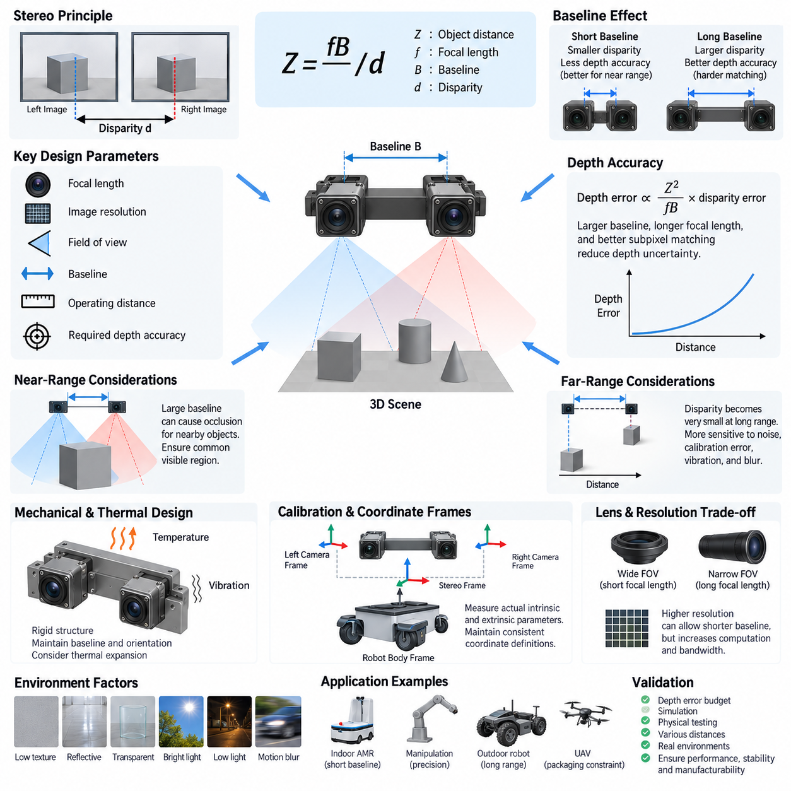
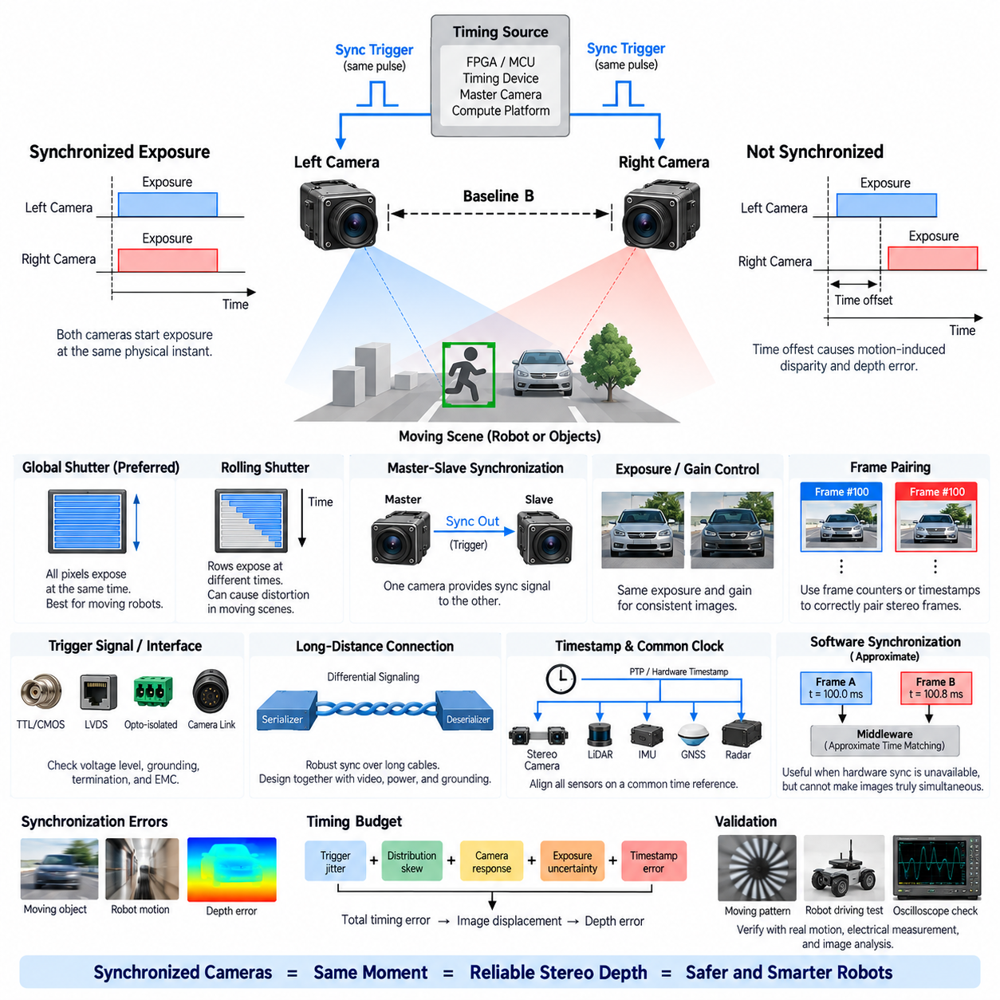
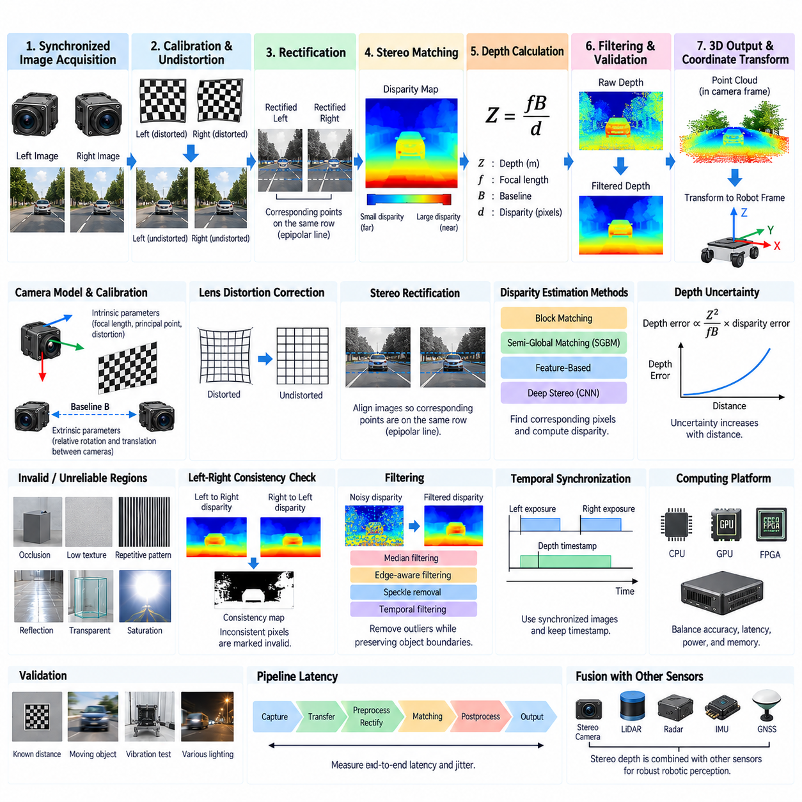
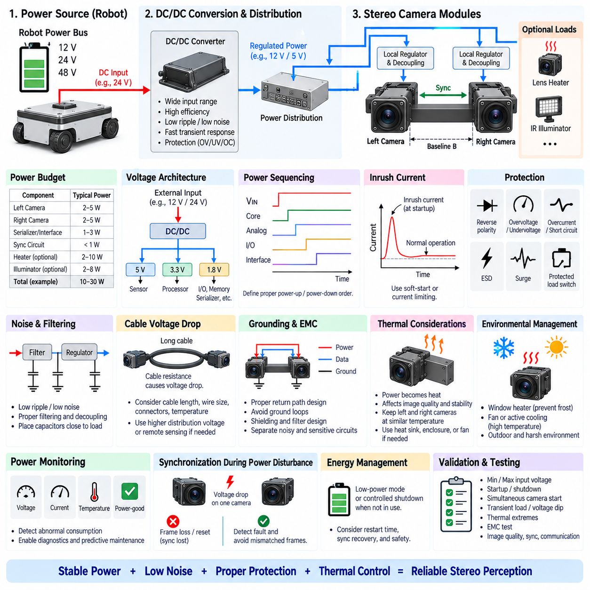
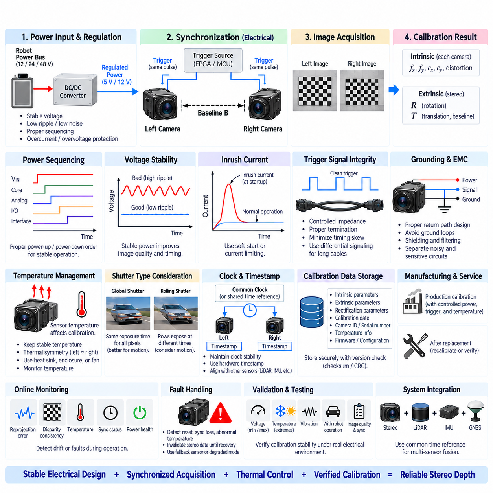

**Volume 15 Perception and Sensor Architecture**

# Chapter 02. Stereo Camera

## 02.01. Stereo Baseline Design

{width="7.268055555555556in" height="7.268055555555556in"}

스테레오 베이스라인 설계(Stereo Baseline Design)는 스테레오 카메라(Stereo Camera)의 좌측 및 우측 광학 중심(Optical Center) 사이의 물리적 간격을 정의하며, 깊이 인식(Depth Perception) 성능을 결정하는 가장 중요한 하드웨어 파라미터(Hardware Parameter) 중 하나이다. 베이스라인(Baseline)은 초점거리(Focal Length), 영상 해상도(Image Resolution), 예상 동작 거리(Operating Distance), 시야각(Field of View), 요구 깊이 정확도(Depth Accuracy)와 함께 결정해야 한다. 따라서 단순한 카메라 장착 치수가 아니라 시스템 수준(System-Level)의 기구 및 광학 설계 변수이다.

스테레오 비전(Stereo Vision)은 두 영상에서 동일한 장면 지점(Scene Point)이 서로 다른 위치에 나타나는 변위를 이용하여 깊이를 추정한다. 정류된 스테레오 영상(Rectified Stereo Pair)의 경우 깊이는 Z = fB/d로 근사할 수 있다. 여기서 Z는 물체 거리(Object Distance), f는 시차 좌표와 일관된 단위로 표현된 초점거리(Focal Length), B는 스테레오 베이스라인(Stereo Baseline), d는 시차(Disparity)를 의미한다. 베이스라인이 증가하면 동일한 거리에 있는 물체의 시차가 증가하여 깊이 추정의 기하학적 민감도가 향상된다.

동일한 관계식은 베이스라인을 독립적으로 최적화할 수 없는 이유도 설명한다. 지나치게 짧은 베이스라인은 중거리 및 장거리에서 작은 시차를 발생시키므로 깊이 추정값이 픽셀 수준(Pixel-Level)의 정합 오차에 더욱 민감해진다. 반대로 긴 베이스라인은 원거리 깊이 구분 능력을 향상시키지만 두 카메라 사이의 시점 차이(Viewpoint Difference)를 증가시켜, 특히 물체 경계와 가느다란 구조물, 입체적인 장면에서 대응점 정합(Correspondence Matching)을 어렵게 만들 수 있다.

물체가 스테레오 카메라에서 멀어질수록 시차가 감소하기 때문에 깊이 불확실성(Depth Uncertainty)은 거리에 따라 빠르게 증가한다. 일차 근사 관계에서 깊이 오차(Depth Error)는 Z²/(fB)에 시차 오차(Disparity Error)를 곱한 값에 비례한다. 따라서 다른 조건이 동일하다면 베이스라인을 두 배로 증가시킬 경우 특정 시차 오차로 인한 깊이 불확실성을 대략 절반으로 줄일 수 있다. 더 긴 초점거리와 정확한 서브픽셀 대응(Subpixel Correspondence)도 유사한 기하학적 이점을 제공한다.

단거리 로봇 인식(Short-Range Robotic Perception)에서는 반대되는 제약조건이 발생한다. 베이스라인이 지나치게 길어지면 가까운 물체가 두 카메라에서 크게 다른 형태로 나타날 수 있으며, 장면의 일부 영역은 한쪽 카메라에서만 관측될 수 있다. 이러한 스테레오 가림(Stereo Occlusion)은 안정적인 정합에 필요한 공통 관측 영역(Common Observable Region)을 감소시킨다. 따라서 모바일 매니퓰레이터(Mobile Manipulator), 실내 자율이동로봇(Indoor AMR), 벽이나 사람 가까이에서 동작하는 로봇은 원거리 인식을 중심으로 설계된 시스템보다 상대적으로 짧은 베이스라인을 요구하는 경우가 많다.

따라서 최소 동작 거리(Minimum Operating Distance)는 베이스라인 설계의 일부로 평가되어야 한다. 중요한 물체가 양쪽 카메라의 시야각(Field of View) 내부에 유지되고, 사용하려는 스테레오 알고리즘(Stereo Algorithm)이 처리할 수 있는 범위의 시차를 생성하는지 확인해야 한다. 이론적인 삼각측량(Triangulation) 관계식에서 유효한 깊이가 계산되더라도 최대 지원 시차(Maximum Supported Disparity), 영상 폭(Image Width), 정류 기하(Rectification Geometry), 렌즈 왜곡(Lens Distortion), 정합 윈도우(Matching Window)의 특성에 의해 실제 동작 범위가 제한될 수 있다.

최대 유효 감지 거리(Maximum Useful Sensing Distance)는 또 다른 설계 경계를 형성한다. 장거리에서는 시차가 몇 픽셀 또는 픽셀의 일부 수준까지 감소할 수 있으므로 깊이 값은 캘리브레이션 오차(Calibration Error), 영상 노이즈(Image Noise), 진동(Vibration), 동기화 오차(Synchronization Error), 모션 블러(Motion Blur), 불완전한 특징점 정합(Feature Matching)의 영향을 크게 받는다. 따라서 베이스라인은 특정 기준 거리 하나가 아니라 전체 동작 범위에서 요구되는 깊이 오차 범위(Depth-Error Envelope)를 기준으로 선정해야 한다.

기구적 구현(Mechanical Implementation)은 광학 기하(Optical Geometry)와 분리하여 고려할 수 없다. 카메라 모듈(Camera Module)은 진동, 가속도, 온도 변화 및 장기간의 운용 조건에서도 상대적인 병진(Translation)과 회전(Rotation) 관계를 유지할 수 있는 강성이 높은 구조물을 필요로 한다. 미세한 각도 변화도 상당한 대응점 및 깊이 오차를 발생시킬 수 있다. 따라서 명목상의 베이스라인 치수가 정확하더라도 로봇이 움직일 때 휘어지는 브래킷(Bracket)은 스테레오 성능을 저하시킬 수 있다.

스테레오 어셈블리(Stereo Assembly)의 물리적 길이가 상대적으로 길다면 열팽창(Thermal Expansion)도 중요하게 고려해야 한다. 섀시(Chassis), 브래킷(Bracket), 카메라 하우징(Camera Housing), 인쇄회로기판(PCB), 체결부품(Fastener)의 서로 다른 열팽창계수(Coefficient of Thermal Expansion)는 온도 변화에 따라 유효 베이스라인(Effective Baseline)과 상대적인 카메라 방향을 변화시킬 수 있다. 따라서 넓은 환경 온도 범위에서 안정적인 거리 깊이가 필요한 경우 재료 선정, 구조적 대칭성, 체결 방식, 열 전달 경로(Thermal Path)를 캘리브레이션 요구사항과 함께 고려해야 한다.

베이스라인 공차(Baseline Tolerance)는 일반적인 기계 제조 공차만을 기준으로 설정하기보다 인식 성능(Perception Performance)에 따라 규정해야 한다. 설계에서는 광학 중심의 위치, 카메라 방향, 장착 반복성(Mounting Repeatability), 구조 변형(Structural Deformation)을 관리해야 한다. 명목상의 캐드(CAD) 치수만으로는 충분하지 않으며 실제 유효 베이스라인은 캘리브레이션된 카메라 기하(Camera Geometry)에 의해 결정된다. 따라서 생산 캘리브레이션(Production Calibration)을 통해 조립된 스테레오 장치의 실제 내부 및 외부 파라미터(Intrinsic and Extrinsic Parameters)를 측정해야 한다.

스테레오 어셈블리는 명확한 좌표계 정의(Coordinate Definition)도 필요로 한다. 좌측 및 우측 카메라 좌표계(Camera Frame), 스테레오 기준 좌표계(Stereo Reference Frame), 로봇 본체 좌표계(Robot Body Frame), 다른 센서 좌표계 사이의 변환 관계를 명시적으로 정의해야 한다. 정류(Rectification)를 단순화하기 위해 베이스라인 방향은 일반적으로 영상의 수평축과 최대한 일치시키지만, 잔여 병진 및 회전 오차는 외부 파라미터 캘리브레이션(Extrinsic Calibration)을 통해 표현한다. 일관된 좌표계 규칙은 이후 인식 소프트웨어에서 발생할 수 있는 부호, 축 및 좌표 변환 오류를 방지한다.

수평 베이스라인(Horizontal Baseline)은 기존 스테레오 처리 방식에 자연스럽게 대응하는 좌우 시차(Left-Right Disparity)를 제공하기 때문에 일반적으로 사용된다. 그러나 좁은 자율이동로봇(AMR), 휴머노이드 헤드(Humanoid Head), 매니퓰레이터(Manipulator), 무인항공기(UAV), 센서 마스트(Sensor Mast)에서는 물리적인 로봇 구조가 카메라 배치를 제한할 수 있다. 패키징(Packaging)으로 인해 강성이 저하되거나 심각한 시야 방해가 발생한다면 이상적인 기하 구조만을 강제로 적용해서는 안 된다. 광학 성능, 구조 안정성, 가시성, 정비성(Serviceability), 케이블 라우팅(Cable Routing)을 하나의 어셈블리 관점에서 함께 최적화해야 한다.

카메라 해상도(Camera Resolution)는 시차가 영상 좌표에서 측정되기 때문에 베이스라인의 실질적인 의미에도 영향을 준다. 높은 공간 해상도(Spatial Resolution)는 보다 세밀한 시차 정보를 제공할 수 있으며, 영상 품질과 대응점 정확도가 충분하다면 동일한 깊이 요구사항을 만족하면서 더 짧은 물리적 베이스라인을 사용할 수도 있다. 반대로 적절한 광학계, 노출 제어(Exposure Control), 동기화, 캘리브레이션이 확보되지 않은 상태에서 해상도만 높이는 것은 거리 깊이를 자동으로 향상시키지 않으며 연산량과 인터페이스 대역폭(Interface Bandwidth)을 크게 증가시킬 수 있다.

렌즈 선정(Lens Selection)은 베이스라인과 강하게 상호작용한다. 넓은 시야각 렌즈(Wide Field-of-View Lens)는 넓은 환경 인식과 근거리 장애물 감지에 유리하지만, 일반적으로 짧은 유효 초점거리(Effective Focal Length)로 인해 원거리 물체에 대한 시차 민감도가 감소한다. 좁은 시야각은 원거리 기하학적 해상도를 향상시킬 수 있지만 관측 범위를 감소시킨다. 따라서 스테레오 아키텍처(Stereo Architecture)는 로봇이 요구하는 수평 관측 범위, 동작 거리, 깊이 정밀도에 맞추어 베이스라인과 초점거리 사이의 균형을 결정해야 한다.

베이스라인 설계에서는 대상 환경(Target Environment)의 특성도 고려해야 한다. 텍스처가 부족한 벽(Texture-Poor Wall), 반복적인 패턴, 반사 표면, 투명 물체, 강한 태양광, 저조도 환경, 모션 블러는 이상적인 기하 구조가 확보되어 있더라도 스테레오 성능을 지배할 수 있다. 베이스라인 증가는 삼각측량 민감도를 향상시킬 수 있지만 대응점 모호성(Correspondence Ambiguity)을 제거할 수는 없다. 따라서 하드웨어 설계는 완벽한 스테레오 정합을 가정하기보다 영상 품질을 유지하면서 충분한 기하학적 여유(Geometric Margin)를 확보해야 한다.

자율이동로봇(Autonomous Mobile Robot)의 베이스라인 선정은 궁극적으로 임무 요구사항(Mission Requirements)에서 도출되어야 한다. 실내 주행은 가까운 장애물, 출입문, 사람, 도킹 영역(Docking Area), 좁은 통로의 인식이 중요하지만 실외 로봇은 훨씬 먼 거리까지 유효한 깊이 정보를 요구할 수 있다. 매니퓰레이션(Manipulation)은 정밀한 단거리 기하 정보를 요구하는 반면 순찰 및 검사 플랫폼(Patrol and Inspection Platform)은 원거리 구조물 인식을 우선할 수 있다. 따라서 하나의 베이스라인이 모든 로봇 응용 분야에 최적이 되는 경우는 드물다.

최종 설계는 베이스라인 공차, 초점거리 불확실성(Focal-Length Uncertainty), 시차 오차, 캘리브레이션 잔차(Calibration Residual), 동기화 영향, 구조 변형, 진동, 열 드리프트(Thermal Drift)를 포함하는 깊이 오차 예산(Depth-Error Budget)을 통해 검증해야 한다. 시뮬레이션(Simulation)을 이용하여 초기 베이스라인을 결정할 수 있지만 실제 운용 거리를 포함한 대표적인 환경 조건에서 물리적인 시험이 필수적이다. 견고한 스테레오 베이스라인 설계란 단순히 가장 긴 간격을 선택하는 것이 아니라, 기계적 안정성과 제조 가능성(Manufacturability)을 유지하면서 로봇의 실제 운용 영역 전체에서 유효한 깊이 정확도를 지속적으로 확보하는 설계이다.

## 02.02. Hardware Synchronization

{width="7.268055555555556in" height="7.268055555555556in"}

하드웨어 동기화(Hardware Synchronization)는 스테레오 비전 시스템(Stereo Vision System)의 좌측 및 우측 카메라가 동일한 물리적 순간에 서로 대응하는 영상을 촬영하도록 보장한다. 이러한 요구사항은 관측되는 장면이나 로봇 자체가 움직이는 모든 상황에서 필수적이다. 동기화가 이루어지지 않으면 각 카메라는 시간적으로 약간 다른 장면 상태를 기록하게 되고, 이러한 움직임은 겉보기 기하학적 시차(Apparent Geometric Disparity)로 변환되어 일반적인 스테레오 캘리브레이션(Stereo Calibration)만으로는 안정적으로 보정할 수 없는 깊이 오차(Depth Error)를 발생시킨다.

완전히 정적인 장면(Static Scene)에서는 스테레오 카메라 사이의 작은 시간 오프셋(Timing Offset)이 눈에 띄는 영향을 거의 주지 않을 수 있다. 그러나 로봇 환경에는 움직이는 사람, 회전하는 바퀴, 매니퓰레이터(Manipulator), 차량뿐만 아니라 로봇의 움직임으로 인해 지속적으로 변화하는 시점(Viewpoint)이 존재한다. 상대 속도가 높으면 밀리초 단위의 오프셋도 측정 가능한 영상 변위를 발생시킬 수 있다. 따라서 로봇 속도, 물체 속도, 초점거리(Focal Length), 영상 해상도(Image Resolution), 요구 깊이 정밀도가 증가할수록 하드웨어 동기화의 중요성도 커진다.

스테레오 동기화(Stereo Synchronization)에서는 프레임률 일치(Frame-Rate Agreement)와 실제 노출 동기화(True Exposure Synchronization)를 구분해야 한다. 두 카메라가 모두 초당 30프레임(30 FPS)으로 동작하더라도 각각의 노출 구간(Exposure Period)은 수 밀리초 정도 어긋날 수 있다. 명목상의 프레임률만 일치시키는 것은 반복 주기가 유사하다는 것을 의미할 뿐 동시 관측을 보장하지 않는다. 견고한 스테레오 아키텍처(Stereo Architecture)는 실제 노출 시작 시점, 노출 구간 또는 명확하게 정의된 다른 영상 획득 이벤트(Image Acquisition Event)를 두 카메라 사이에서 정렬한다.

일반적인 구현 방식은 좌측 및 우측 카메라에 공통 하드웨어 트리거 신호(Hardware Trigger Signal)를 분배하는 것이다. 마스터 타이밍 소스(Master Timing Source)가 주기적인 전기 펄스(Electrical Pulse)를 생성하면 두 카메라 센서는 동일한 트리거 에지(Trigger Edge)에 응답하여 노출을 시작한다. 이러한 구조는 독립적인 소프트웨어 명령에서 발생하는 비결정적 지연(Nondeterministic Delay)을 상당 부분 제거한다. 트리거 주파수(Trigger Frequency)는 일반적으로 요구 프레임률에 대응하며, 펄스 특성은 각 카메라 또는 이미지 센서(Image Sensor)의 전기적 타이밍 사양을 만족해야 한다.

트리거 분배(Trigger Distribution)는 단순한 논리적 연결이 아니라 전기공학적 문제(Electrical Engineering Problem)로 다루어야 한다. 서로 다른 케이블 길이, 전파 지연(Propagation Delay), 전압 임계값(Voltage Threshold), 버퍼 회로(Buffering Circuit), 커넥터 특성, 신호 무결성(Signal Integrity)은 카메라 트리거 입력 사이에 스큐(Skew)를 발생시킬 수 있다. 일반적으로 전기 신호 전파는 영상 획득 타이밍보다 훨씬 빠르지만 고정밀 시스템에서는 최대 트리거 스큐(Maximum Trigger Skew)를 정의하고 실제 배선 및 환경 조건에서 카메라 인터페이스를 기준으로 검증해야 한다.

트리거 소스(Trigger Source)는 FPGA(Field-Programmable Gate Array), 마이크로컨트롤러(Microcontroller), 전용 타이밍 장치(Dedicated Timing Device), 카메라 마스터 모듈(Camera Master Module), 또는 동기화 기능을 지원하는 컴퓨팅 플랫폼(Compute Platform)을 통해 생성할 수 있다. 선택은 요구되는 타이밍 정확도, 채널 수, 설정 가능성, 진단 기능 및 시스템 아키텍처에 따라 결정된다. FPGA 기반 타이밍은 높은 결정성을 가진 다채널 제어(Multi-Channel Control)를 제공할 수 있으며, 비교적 단순한 로봇 시스템에서는 동기화 정확도가 인식 요구사항을 충족하는 경우 MCU 타이머 또는 마스터 카메라 출력을 사용할 수 있다.

마스터-슬레이브 동기화(Master-Slave Synchronization) 역시 실용적인 아키텍처이다. 한 카메라가 타이밍 마스터(Timing Master)로 동작하면서 두 번째 카메라의 노출 타이밍을 제어하는 동기화 출력을 제공한다. 이를 통해 별도의 타이밍 생성기가 필요하지 않을 수 있지만 마스터 카메라 고장, 출력 타이밍 특성, 시작 동작(Startup Behavior), 카메라 모듈 사이의 호환성을 고려해야 한다. 더 높은 신뢰성이 요구되는 시스템에서는 독립적인 공통 타이밍 소스(Common Timing Source)를 사용하여 보다 대칭적인 제어 구조를 구성할 수 있다.

노출 동기화(Exposure Synchronization)는 센서 판독 아키텍처(Sensor Readout Architecture)도 고려해야 한다. 글로벌 셔터 센서(Global-Shutter Sensor)는 전체 영상 배열을 거의 동일한 순간에 노출하므로 움직이는 로봇 플랫폼과 스테레오 기하(Stereo Geometry)에 특히 적합하다. 반면 롤링 셔터 센서(Rolling-Shutter Sensor)는 영상의 각 행을 서로 다른 시간에 노출하므로 프레임 트리거가 동시에 발생하더라도 모든 대응 픽셀 쌍이 정확히 동일한 순간을 나타낸다고 보장할 수 없다. 그 결과 움직임에 의해 공간 왜곡(Spatial Distortion)과 스테레오 정합 오차(Stereo Matching Error)가 발생할 수 있다.

롤링 셔터 카메라를 피할 수 없는 경우에는 행 타이밍(Row Timing), 판독 방향(Readout Direction), 노출 시간(Exposure Duration), 프레임 타이밍(Frame Timing)을 명확하게 이해해야 한다. 동일한 센서 설정을 사용하면 체계적인 차이를 줄일 수 있지만 움직임으로 인한 왜곡을 제거할 수는 없다. 높은 동적 특성을 가진 로봇 응용에서는 일반적으로 글로벌 셔터 스테레오 카메라(Global-Shutter Stereo Camera)가 선호된다. 이는 시간적 대응 관계가 트리거 이벤트와 보다 직접적으로 연결되어 제어, 특성화 및 검증이 용이하기 때문이다.

노출 시간(Exposure Time)은 추가적인 동기화 고려사항을 만든다. 두 카메라가 동시에 노출을 시작하더라도 노출 시간이 서로 다르면 모션 블러(Motion Blur), 밝기(Brightness), 유효 시간 적분(Effective Temporal Integration)이 일치하지 않을 수 있다. 각 카메라에서 자동 노출 알고리즘(Automatic Exposure Algorithm)이 독립적으로 동작하면 서로 다른 노출값을 선택할 수 있다. 따라서 정확한 대응점 정합(Correspondence Matching)이 개별 영상의 최적 밝기보다 중요한 경우 스테레오 시스템은 가능한 한 노출 설정을 서로 연동해야 한다.

게인(Gain)과 영상 처리 동작(Image-Processing Behavior)도 두 스테레오 채널 사이에서 충분한 일관성을 유지해야 한다. 하드웨어 동기화 자체가 광도 일관성(Photometric Consistency)을 보장하지는 않지만 자동 게인 제어(Automatic Gain Control), 하이다이내믹레인지 처리(High-Dynamic-Range Processing), 영상 신호 프로세서(Image Signal Processor)의 동작으로 두 영상이 크게 달라지면 동기화된 영상 획득의 효과가 저하될 수 있다. 따라서 스테레오 하드웨어와 소프트웨어는 타이밍뿐만 아니라 관련 영상 파라미터도 통합된 획득 아키텍처(Unified Acquisition Architecture)의 일부로 조정해야 한다.

동기화 신호(Synchronization Signal)는 적절한 전기 인터페이스(Electrical Interface)를 필요로 한다. 카메라 하드웨어에 따라 트리거 입력에는 CMOS 또는 TTL 레벨 신호, 저전압 차동 신호(LVDS), 광절연 산업용 인터페이스(Opto-Isolated Industrial Interface), 또는 특수 카메라 링크에 내장된 동기화 채널이 사용될 수 있다. 전압 호환성, 입력 임계값, 에지 속도(Edge Rate), 접지(Grounding), 절연(Isolation), 종단(Termination), 전자기 적합성(EMC)을 검토해야 한다. 호환되지 않는 트리거 인터페이스를 직접 연결하면 동기화가 불안정해지거나 카메라 전자회로가 손상될 가능성이 있다.

장거리 카메라 연결(Long-Distance Camera Connection)은 추가적인 복잡성을 발생시킨다. 대형 자율이동로봇(AMR), 검사 차량(Inspection Vehicle), 매니퓰레이터, 무인항공기(UAV) 구조에서는 카메라가 중앙 컴퓨팅 장치에서 수 미터 떨어져 배치될 수 있다. 이러한 경우 차동 신호(Differential Signaling)와 직렬화기-역직렬화기 아키텍처(Serializer-Deserializer Architecture)를 이용하여 전자기 간섭(EMI)에 대한 강건성을 향상시킬 수 있다. 동기화 경로는 사후에 추가하기보다 영상 전송, 전원 분배, 접지, 차폐(Shielding), 케이블 하네스 설계(Cable Harness Design)와 함께 설계해야 한다.

하드웨어 동기화와 타임스탬프 동기화(Timestamp Synchronization)는 서로 관련되어 있지만 다른 문제를 해결한다. 하드웨어 트리거는 실제 영상 획득 시점을 정렬하는 반면 타임스탬프(Timestamp)는 획득된 데이터가 공통 시스템 시간축(Common System Timeline)의 어느 시점에 해당하는지를 나타낸다. 정밀 스테레오 시스템에서는 두 기능이 모두 필요한 경우가 많다. 프레임에는 명확하게 정의된 획득 이벤트와 연결된 타임스탬프를 부여해야 하며, 프레임이 드라이버, 운영체제, 미들웨어 또는 응용 프로세스에 도착한 이후의 시점보다 하드웨어 기반 타이밍(Hardware-Derived Timing)을 사용하는 것이 바람직하다.

공통 클록(Common Clock)을 사용하면 전체 인식 시스템의 시간적 일관성(Temporal Consistency)을 더욱 향상시킬 수 있다. 스테레오 카메라 쌍은 최종적으로 라이다(LiDAR), 관성측정장치(IMU), 위성항법시스템(GNSS), 레이더(Radar), 다른 카메라와 시간적으로 정렬되어야 할 수 있다. 하드웨어 타임스탬프(Hardware Timestamp)와 정밀 시간 프로토콜(Precision Time Protocol, PTP) 같은 기술은 공유 시간 기준(Shared Time Reference)을 제공하며, 트리거 신호는 결정적인 영상 획득 이벤트를 제공한다. 적절한 아키텍처는 각 센서가 외부 트리거, 클록 동기화, 타임스탬프 또는 이들의 조합을 지원하는지에 따라 결정된다.

정밀한 스테레오 깊이(Precise Stereo Depth)가 요구되는 경우 소프트웨어 동기화(Software Synchronization)를 동등한 대체 수단으로 간주해서는 안 된다. 미들웨어(Middleware)는 타임스탬프가 가까운 프레임을 서로 짝지을 수 있지만 독립적으로 촬영된 두 영상을 실제로 동시에 만들어 줄 수는 없다. 근사 시간 정합(Approximate-Time Matching)은 하드웨어 동기화를 사용할 수 없거나 요구조건이 낮은 경우 유용하지만 잔여 시간 오프셋은 영상 자체에 그대로 남아 있다. 따라서 소프트웨어는 근본적으로 제어되지 않은 획득 타이밍을 보상하기보다 동기화 상태를 검증하고 관리하는 역할을 수행해야 한다.

프레임 식별(Frame Identification)도 중요하다. 동기화된 카메라에서도 프레임 누락(Dropped Frame), 지연(Delayed Frame), 중복 프레임(Duplicated Frame)이 발생할 수 있다. 각각의 스테레오 영상 쌍은 프레임 카운터(Frame Counter), 트리거 시퀀스 번호(Trigger Sequence Number), 타임스탬프 또는 이에 상응하는 메타데이터를 통해 서로 연결되어야 한다. 한쪽 카메라에서 프레임이 손실된 경우 반대쪽 카메라의 다음 프레임과 잘못 결합되지 않도록 해야 한다. 이러한 불일치는 겉보기에는 정상적인 것처럼 보이면서도 심각한 깊이 아티팩트(Depth Artifact)를 발생시켜 후단에서 진단하기 어렵게 만들 수 있다.

시작 및 복구 동작(Startup and Recovery Behavior)도 명확하게 정의해야 한다. 카메라마다 초기화 시간이 다를 수 있으며 통신 오류, 전원 교란, 열적 이벤트(Thermal Event), 드라이버 복구 등으로 인해 한쪽 센서가 일시적으로 동기화를 잃을 수 있다. 시스템은 동기화 손실(Synchronization Loss)을 감지하고 영향을 받은 스테레오 영상 쌍을 무효화한 후, 깊이 처리를 다시 시작하기 전에 정상적인 동기화 상태를 복구해야 한다. 진단 기능(Diagnostics)은 시스템 시작 이후 동기화가 계속 유지된다고 가정하기보다 실제 타이밍 상태를 외부에 제공해야 한다.

동기화 성능은 최종적으로 공학적인 타이밍 예산(Timing Budget)으로 표현해야 한다. 이 예산에는 트리거 생성기 지터(Trigger-Generator Jitter), 분배 스큐(Distribution Skew), 카메라 입력 응답 편차, 센서 노출 불확실성(Sensor Exposure Uncertainty), 타임스탬프 오차, 프레임 쌍 연결 허용오차(Frame-Pair Association Tolerance)가 포함될 수 있다. 이러한 요소를 로봇의 예상 움직임에서 허용 가능한 영상 변위와 그로 인해 발생하는 깊이 오차에 연결해야 한다. 이를 통해 단순한 "동기화된 카메라"라는 추상적인 요구사항을 측정 가능한 전기 및 인식 사양(Electrical and Perception Specification)으로 변환할 수 있다.

검증(Validation)은 정지된 캘리브레이션 타깃만을 사용하기보다 실제 움직임 조건에서 수행해야 한다. 회전 패턴(Rotating Pattern), 움직이는 에지(Moving Edge), 진동 테이블(Vibration Table), 로봇 주행 시험, 정밀하게 타이밍이 제어된 광학 이벤트(Optical Event)를 이용하여 두 채널 사이의 시간적 불일치를 확인할 수 있다. 오실로스코프(Oscilloscope) 또는 로직 분석기(Logic Analyzer)를 이용한 전기적 측정은 트리거 타이밍을 검증하며, 영상 수준 분석(Image-Level Analysis)은 실제 노출 관계를 확인한다. 올바른 트리거 펄스가 반드시 동기화된 광학 영상 획득을 의미하는 것은 아니므로 두 종류의 검증이 모두 필요하다.

견고한 스테레오 하드웨어 동기화 아키텍처(Robust Stereo Hardware Synchronization Architecture)는 타이밍 소스, 트리거 분배, 센서 셔터 동작, 노출 제어, 전기 인터페이스, 타임스탬프 생성, 프레임 연결, 진단 및 복구 메커니즘을 하나의 시스템으로 통합한다. 목표는 단순히 두 카메라를 동일한 프레임률로 동작시키는 것이 아니라, 모든 유효한 스테레오 영상 쌍이 신뢰성 높은 로봇 깊이 인식(Robotic Depth Perception)에 적합하도록 정의된 시간 허용오차(Temporal Tolerance) 이내에서 동일한 물리적 장면 상태를 표현하도록 보장하는 것이다.

## 02.03. Depth Calculation Pipeline

{width="7.268055555555556in" height="7.268055555555556in"}

스테레오 깊이 계산 파이프라인(Stereo Depth Calculation Pipeline)은 동기화된 두 카메라 영상을 장면의 기하 구조를 나타내는 미터 단위 표현(Metric Representation)으로 변환한다. 이 과정은 좌측 및 우측 영상 획득에서 시작하여 캘리브레이션 보정(Calibration Correction), 정류(Rectification), 대응점 탐색(Correspondence Search), 시차 추정(Disparity Estimation), 깊이 변환(Depth Conversion), 필터링(Filtering), 좌표 변환(Coordinate Transformation)으로 이어진다. 각 단계에서 불확실성이 발생하므로 신뢰성 높은 로봇 깊이 인식(Robotic Depth Perception)을 위해서는 전체 파이프라인을 하나의 통합 센싱 시스템(Integrated Sensing System)으로 다루어야 한다.

이 파이프라인은 스테레오 카메라(Stereo Camera)의 내부 및 외부 파라미터(Intrinsic and Extrinsic Parameters)가 알려져 있다는 것을 전제로 한다. 내부 파라미터(Intrinsic Parameters)는 각 카메라의 초점거리(Focal Length), 주점(Principal Point), 렌즈 왜곡(Lens Distortion)을 나타내며, 외부 파라미터(Extrinsic Parameters)는 두 광학 좌표계(Optical Frame) 사이의 상대적인 회전(Rotation)과 병진(Translation)을 나타낸다. 이러한 값은 일반적으로 스테레오 캘리브레이션(Stereo Calibration)을 통해 얻으며 픽셀 대응점을 물리적으로 의미 있는 3차원 측정값으로 변환하기 위한 기하학적 기반을 제공한다.

원시 영상(Raw Image)은 일반적으로 스테레오 정합(Stereo Matching)을 수행하기 전에 기하학적 보정(Geometric Correction)이 필요하다. 렌즈 왜곡은 관측된 픽셀이 이상적인 핀홀 카메라 모델(Pinhole-Camera Model)에서 벗어나도록 하며, 특히 영상 경계와 광각 광학계(Wide-Angle Optics)에서 그 영향이 커진다. 왜곡 보정(Undistortion)은 캘리브레이션된 렌즈 파라미터를 사용하여 방사 왜곡(Radial Distortion)과 접선 왜곡(Tangential Distortion)을 보상한다. 작은 잔여 기하 오차도 대응 특징점을 이동시켜 장거리에서 상당한 깊이 오차로 확대될 수 있으므로 정확한 보정이 중요하다.

스테레오 정류(Stereo Rectification)는 좌측 및 우측 영상에서 동일한 장면 지점이 대략 동일한 수평 영상 행(Horizontal Image Row)에 위치하도록 영상을 변환한다. 이를 통해 대응점 탐색을 2차원 문제에서 에피폴라 선(Epipolar Line)을 따라 수행되는 주로 1차원적인 탐색 문제로 축소할 수 있다. 따라서 정류는 연산 효율과 정합 강건성(Matching Robustness)을 향상시킨다. 정류 품질은 정확한 캘리브레이션과 두 카메라 사이의 물리적 베이스라인(Baseline)이 기계적으로 안정적으로 유지되는지에 직접적으로 의존한다.

정류가 완료되면 시스템은 좌측 및 우측 영상 사이에서 서로 대응하는 픽셀 또는 영상 영역을 탐색한다. 두 영상에서 대응 관측점 사이의 수평 변위를 시차(Disparity)라고 한다. 일반적으로 가까운 물체는 큰 시차를 생성하고 먼 물체는 작은 시차를 생성한다. 시차 맵(Disparity Map)은 많은 영상 위치에 이러한 변위를 할당하며, 이후 스테레오 깊이를 계산하기 위한 중간 기하 표현(Intermediate Geometric Representation)이 된다.

대응점(Correspondence)은 지역 블록 정합(Local Block Matching), 준전역 방식(Semi-Global Approach), 특징 기반 기법(Feature-Based Technique), 또는 학습 기반 스테레오 네트워크(Learned Stereo Network)를 이용하여 추정할 수 있다. 전통적인 알고리즘은 후보 시차 사이에서 밝기 또는 디스크립터 유사도(Descriptor Similarity)를 비교하는 반면 현대적인 신경망 방식은 어려운 텍스처와 복잡한 환경에 대해 더 강력한 표현을 학습할 수 있다. 알고리즘 선택은 정확도, 지연시간(Latency), 메모리 사용량, GPU 활용도, 결정적 동작(Deterministic Behavior), 조명 변화 및 약한 텍스처 환경에서의 동작 능력에 영향을 준다.

시차 탐색 범위(Disparity Search Range)는 목표 동작 거리와 스테레오 기하 구조를 반영해야 한다. 큰 최대 시차(Maximum Disparity)를 설정하면 더 가까운 물체를 지원할 수 있지만 연산량과 메모리 요구량이 증가한다. 탐색 범위를 제한하면 효율을 높일 수 있지만 설정된 깊이 범위를 벗어나는 유효한 장면의 재구성이 불가능할 수 있다. 따라서 시차 설정을 결정할 때 베이스라인, 초점거리, 영상 해상도, 최소 감지 거리(Minimum Sensing Distance), 사용 가능한 연산 자원을 함께 고려해야 한다.

시차가 계산되면 Z = fB/d의 스테레오 삼각측량 관계(Stereo Triangulation Relationship)를 통해 미터 단위 깊이를 구할 수 있다. 여기서 Z는 깊이(Depth), f는 적절한 영상 좌표 단위로 표현된 초점거리, B는 캘리브레이션된 스테레오 베이스라인(Calibrated Stereo Baseline), d는 시차를 나타낸다. 이 관계식은 깊이가 시차에 반비례함을 보여준다. 큰 시차는 가까운 기하 구조에 대응하고 매우 작은 시차는 먼 물체에 대응하며, 거리가 증가할수록 깊이 추정값의 민감도도 높아진다.

대응점은 정확한 정수 픽셀 위치에만 존재하지 않으므로 서브픽셀 시차 추정(Subpixel Disparity Estimation)이 중요하다. 시차를 소수 픽셀 단위의 정밀도로 추정하면 특히 시차가 작아지는 중거리 및 장거리에서 깊이 해상도(Depth Resolution)를 크게 향상시킬 수 있다. 그러나 서브픽셀 정밀도가 물리적인 정확도를 보장하는 것은 아니다. 캘리브레이션 잔차, 영상 노이즈, 블러(Blur), 동기화 오차, 광학 품질, 정합 모호성(Matching Ambiguity)이 최종 깊이 불확실성을 지배할 수 있다.

유효하지 않거나 신뢰성이 낮은 시차는 깊이 맵(Depth Map)이 로봇의 판단에 사용되기 전에 검출해야 한다. 가려진 영역(Occluded Region), 반복적인 텍스처, 균일한 표면, 반사체, 투명 물체, 포화 픽셀(Saturated Pixel), 영상 경계에서는 모호한 정합이 자주 발생한다. 신뢰도 점수(Confidence Score), 정합 비용(Matching Cost), 좌우 일관성 검사(Left-Right Consistency Check), 유일성 기준(Uniqueness Criterion), 유효성 마스크(Validity Mask)를 이용하여 의심스러운 추정값을 식별할 수 있다. 조밀하지만 기하학적으로 잘못된 측정값을 제공하는 것보다 불확실한 깊이를 제거하는 것이 더 안전한 경우가 많다.

좌우 일관성 검사(Left-Right Consistency Check)는 좌측 영상에서 우측 영상 방향으로 계산한 시차와 반대 방향으로 계산한 대응 시차를 비교한다. 두 결과가 정의된 허용오차 이상으로 일치하지 않으면 해당 픽셀을 유효하지 않거나 낮은 신뢰도로 표시할 수 있다. 이 방법은 특히 가림 경계(Occlusion Boundary)와 잘못 정합된 구조를 검출하는 데 유용하다. 추가적인 연산이 필요하지만 스테레오 깊이가 내비게이션(Navigation), 매핑(Mapping), 매니퓰레이션(Manipulation), 장애물 감지 기능으로 전달되기 전에 중요한 무결성 검증 수단을 제공한다.

필터링(Filtering)은 의미 있는 기하학적 경계를 보존하면서 고립된 시차 오류를 억제하기 위해 일반적으로 적용된다. 구현 방식에 따라 중앙값 필터링(Median Filtering), 에지 인식 필터링(Edge-Aware Filtering), 스페클 제거(Speckle Removal), 시간 필터링(Temporal Filtering), 신뢰도 기반 개선(Confidence-Guided Refinement)을 사용할 수 있다. 과도한 평활화(Smoothing)는 가느다란 장애물, 물체 경계, 단차, 케이블 또는 안전과 관련된 구조물을 제거할 수 있으므로 피해야 한다. 따라서 필터 파라미터는 로봇의 실제 인식 요구조건을 기준으로 검증해야 한다.

깊이 값은 조밀 깊이 영상(Dense Depth Image), 구조화 포인트 클라우드(Organized Point Cloud), 비구조화 포인트 클라우드(Unorganized Point Cloud), 점유 표현(Occupancy Representation) 또는 다른 기하학적 구조로 표현할 수 있다. 재투영(Reprojection)은 영상 픽셀과 시차를 캘리브레이션된 스테레오 기하를 이용하여 3차원 좌표로 변환한다. 생성된 포인트는 처음에는 카메라 관련 좌표계로 표현되며 상위 기능에서 사용하기 전에 로봇 본체, 내비게이션, 매니퓰레이터 또는 월드 좌표계(World Frame)로 변환해야 한다.

좌표 변환(Coordinate Transformation)을 위해서는 스테레오 카메라와 로봇 사이의 정확한 외부 캘리브레이션(Extrinsic Calibration)이 필요하다. 카메라 좌표계에서 기하학적으로 정확한 깊이 포인트라도 카메라-로봇 변환(Camera-to-Robot Transformation)이 부정확하면 내비게이션에서는 잘못된 위치로 표현될 수 있다. 장착 각도, 센서 높이, 기계적 변형, 진동, 정비 과정의 센서 교체가 이러한 관계에 영향을 줄 수 있다. 따라서 인식 아키텍처는 캘리브레이션 메타데이터(Calibration Metadata)를 유지하고 명확하게 정의된 좌표계를 통해 변환을 적용해야 한다.

계산된 깊이에는 시간 정보(Temporal Information)가 함께 제공되어야 한다. 좌측 및 우측 영상은 동일하게 동기화된 획득 이벤트에서 생성되어야 하며 결과 시차 및 깊이 데이터에도 적절한 타임스탬프(Timestamp)가 유지되어야 한다. 로봇이 움직이는 경우 기하학적으로 정확한 포인트 클라우드도 시간이 지나면 현재 상태와 달라진다. 따라서 스테레오 깊이를 관성측정장치(IMU), 라이다(LiDAR), 휠 오도메트리(Wheel Odometry), 위성항법시스템(GNSS), 또는 움직임 추정값과 융합할 때 타임스탬프 무결성(Timestamp Integrity)이 필수적이다.

파이프라인 지연시간(Pipeline Latency) 역시 중요한 공학적 파라미터이다. 영상 전송, 전처리(Preprocessing), 정류, 스테레오 정합, 후처리(Post-Processing), 재투영, 미들웨어 전송에는 모두 시간이 소요된다. 정적인 환경에서 매우 정확한 깊이 맵이라도 지나치게 늦게 도착한다면 빠른 로봇 제어에는 적합하지 않을 수 있다. 따라서 물리적인 영상 노출 시점부터 검증된 깊이 데이터가 이를 사용하는 인식 또는 제어 프로세스에 도달할 때까지의 종단간 지연시간(End-to-End Latency)과 지터(Jitter)를 측정해야 한다.

컴퓨팅 아키텍처(Computational Architecture)는 달성 가능한 스테레오 성능에 큰 영향을 미친다. 정류 및 기존 정합 알고리즘은 CPU, GPU, FPGA, 전용 비전 가속기(Dedicated Vision Accelerator), 또는 이러한 장치의 이기종 조합(Heterogeneous Combination)에서 실행할 수 있다. 딥 스테레오 네트워크(Deep Stereo Network)는 일반적으로 GPU 가속의 이점을 얻지만 상당한 메모리 대역폭과 전력을 소비할 수 있다. 임베디드 로봇 플랫폼(Embedded Robotic Platform)은 깊이 품질, 영상 해상도, 프레임률, 열적 한계, 에너지 소비, 동일한 컴퓨팅 하드웨어에서 실행되는 다른 AI 워크로드 사이의 균형을 유지해야 한다.

파이프라인 전체에서 오차 전파(Error Propagation)를 이해해야 한다. 특정 시차 불확실성에 대해 깊이 불확실성은 대략 거리의 제곱에 비례하여 증가하고 초점거리와 베이스라인이 증가할수록 감소한다. 따라서 스테레오 깊이는 모든 거리에서 균일한 정확도를 제공하기보다 설계된 동작 범위 내에서 강력한 기하 정보를 제공하는 특성을 가진다. 후단 알고리즘이 신뢰할 수 있는 기하 정보와 한계 영역의 측정값을 구분해야 하는 경우 파이프라인은 가능한 한 신뢰도 또는 불확실성 정보(Confidence or Uncertainty Information)를 제공해야 한다.

환경 조건(Environmental Conditions)은 여러 파이프라인 단계에 동시에 영향을 줄 수 있다. 낮은 텍스처는 대응점 탐색을 약화시키고, 낮은 조도는 영상 노이즈를 증가시키며, 강한 태양광은 대비를 감소시킬 수 있다. 반사 또는 투명 표면은 일반적인 영상 외관 가정을 위반하고 모션 블러는 특징 위치 추정 정확도를 감소시킨다. 견고한 파이프라인은 근본적으로 부족한 영상 정보를 후처리만으로 복구하려 하기보다 적절한 카메라 하드웨어, 노출 제어, 동기화, 스테레오 기하, 정합 알고리즘, 유효성 평가를 통합한다.

로봇 시스템은 운용 중 파이프라인 상태(Pipeline Health)를 지속적으로 감시해야 한다. 유용한 진단 정보에는 카메라 프레임 카운터, 동기화 상태, 정류 유효성, 시차 커버리지(Disparity Coverage), 무효 픽셀 비율(Invalid-Pixel Ratio), 신뢰도 분포, 처리 지연시간, 프레임 손실, 온도, 컴퓨팅 부하가 포함된다. 이러한 지표의 갑작스러운 변화는 더 큰 자율 시스템 장애로 이어지기 전에 카메라 가림, 캘리브레이션 이동, 통신 문제, 타이밍 고장, 환경 악화 또는 연산 과부하를 발견하는 데 활용할 수 있다.

검증(Validation)은 광자(Photon)가 카메라에 입력되는 단계부터 미터 단위 기하 정보가 생성되는 전체 경로를 대상으로 수행해야 한다. 알려진 거리의 타깃을 이용하여 깊이 정확도를 측정하고, 움직이는 물체를 통해 동기화 민감도를 평가하며, 텍스처가 풍부하거나 부족한 표면을 이용하여 정합 강건성을 시험할 수 있다. 또한 온도 및 진동 시험을 통해 캘리브레이션 드리프트(Calibration Drift)를 확인해야 한다. 성능은 하나의 명목상 깊이 정확도 값으로 표현하기보다 거리, 조명, 로봇 속도, 물체 움직임, 연산 부하에 걸쳐 특성화해야 한다.

최종적으로 생성되는 깊이 데이터(Depth Product)는 환경에 대한 완전무결한 표현이 아니라 더 광범위한 센서 융합(Sensor Fusion)에 사용되는 하나의 입력으로 간주해야 한다. 스테레오 카메라는 풍부한 기하 정보와 시각적 맥락(Visual Context)을 제공하며 라이다, 레이더(Radar), 관성측정장치, 위성항법시스템, 오도메트리는 상호 보완적인 센싱 특성을 제공한다. 따라서 잘 설계된 깊이 계산 파이프라인은 깊이 값뿐만 아니라 더 넓은 로봇 인식 아키텍처에서 요구되는 타임스탬프, 좌표 정보, 유효성 마스크, 신뢰도 추정값 및 진단 상태까지 함께 제공해야 한다.

## 02.04. Stereo Camera Power

{width="7.268055555555556in" height="7.268055555555556in"}

스테레오 카메라 전원 아키텍처(Stereo Camera Power Architecture)는 좌측 및 우측 카메라 사이의 일치된 동작을 유지하면서 두 영상 채널에 안정적이고 저잡음이며 적절하게 보호된 전력을 공급해야 한다. 전원 설계(Power Design)는 영상 품질, 동기화 안정성, 열적 거동, 통신 신뢰성, 장기적인 캘리브레이션 안정성에 영향을 준다. 따라서 스테레오 카메라는 편리한 전원 레일에 연결된 두 개의 독립 부하가 아니라 서로 조정되어 동작하는 하나의 센싱 서브시스템(Sensing Subsystem)으로 다루어야 한다.

첫 번째 설계 단계는 스테레오 어셈블리(Stereo Assembly)에 대한 완전한 전력 예산(Power Budget)을 수립하는 것이다. 여기에는 두 카메라 모듈, 이미지 센서(Image Sensor), 영상 신호 프로세서(Image Signal Processor), 직렬화기(Serializer), 동기화 회로, 로컬 레귤레이터(Local Regulator), 필요한 경우 히터, 상태 전자회로, 보조 조명 등이 포함된다. 정상 상태의 소비전력만으로는 충분하지 않으며 기동, 노출 전환, 처리 부하 변화, 통신 인터페이스 동작 과정에서 정상 상태보다 상당히 큰 과도 부하(Transient Load)가 발생할 수 있다.

카메라의 전원 요구조건은 선택된 아키텍처에 따라 크게 달라진다. 소형 임베디드 스테레오 모듈(Embedded Stereo Module)은 5 V 또는 다른 안정화된 저전압 레일에서 동작할 수 있지만, 산업용 또는 자동차용 카메라 어셈블리는 12 V 이상의 입력 전압을 받아 내부에서 전압을 변환할 수 있다. 시스템 설계자는 외부 입력 전압과 이미지 센서, 프로세서, 메모리, 직렬화기, 발진기(Oscillator), 인터페이스 회로에서 요구하는 내부 전원 레일을 구분해야 한다.

로봇은 일반적으로 12 V, 24 V 또는 48 V 전력을 분배하지만 민감한 카메라 전자회로는 훨씬 낮은 전압에서 동작한다. 따라서 로봇 전원 버스와 스테레오 카메라 사이에는 직류-직류 변환(DC/DC Conversion)이 필요한 경우가 많다. 컨버터(Converter)를 선정할 때는 입력 전압 범위, 효율, 과도 응답(Transient Response), 출력 리플(Output Ripple), 스위칭 주파수, 전자기 간섭(EMI), 열 방출, 보호 동작, 배터리 전압 변화에서도 안정적인 출력을 유지할 수 있는 능력을 고려해야 한다.

두 카메라에 공통 상위 전원(Common Upstream Source)을 사용하면 전기적 대칭성을 향상시킬 수 있지만 각 채널에는 제어된 로컬 전원 분배와 디커플링(Decoupling)이 필요하다. 개별 분기 보호(Branch Protection), 필터링, 모니터링을 적용하면 한쪽 카메라의 고장이 전체 스테레오 서브시스템을 정지시키는 것을 방지할 수 있다. 동시에 서로 다른 전압 강하, 레귤레이터 특성, 접지 조건으로 인해 동일한 카메라 사이에서 서로 다른 동작이 발생하지 않도록 과도한 전기적 비대칭도 피해야 한다.

전압 안정화 품질(Voltage Regulation Quality)은 카메라 동작에 직접적인 영향을 미친다. 과도한 리플, 스위칭 노이즈 또는 공급전압 강하는 아날로그 센서 회로, 클록 안정성, 직렬화기 성능 및 영상 품질에 영향을 줄 수 있다. 민감한 전원 레일에는 적절한 필터와 디커플링 커패시터(Decoupling Capacitor)를 부하 장치 가까이에 배치해야 한다. 일부 아키텍처에서는 스위칭 레귤레이터(Switching Regulator)를 이용하여 효율적인 1차 전압 변환을 수행하고, 특히 잡음에 민감한 2차 전원 레일은 저강하 레귤레이터(Low-Dropout Regulator, LDO)를 통해 생성한다.

스테레오 카메라에 여러 전압 도메인(Voltage Domain)이 존재하는 경우 전원 시퀀싱(Power-Supply Sequencing)이 중요할 수 있다. 이미지 센서와 처리 장치는 코어(Core), 아날로그(Analog), 입출력(I/O), 인터페이스 전원 레일이 정해진 순서로 상승하거나 하강하도록 요구할 수 있다. 잘못된 시퀀싱은 불안정한 기동, 과도 전류, 통신 실패 또는 정의되지 않은 내부 상태를 발생시킬 수 있다. 따라서 카메라 제조사의 전기적 요구조건을 전원 인에이블 로직(Power-Enable Logic)과 시스템 기동 절차에 반영해야 한다.

돌입 전류(Inrush Current)는 정상 동작 전류와 별도로 고려해야 한다. 입력 커패시터, 로컬 컨버터, 직렬화기, 프로세서, 조명 회로는 전원이 처음 인가될 때 상당한 순간 전류를 소비할 수 있다. 두 스테레오 카메라가 동시에 기동하면 합산된 돌입 전류로 인해 버스 전압 강하(Bus Voltage Sag)가 발생하거나 상위 보호회로가 동작할 수 있다. 소프트 스타트(Soft-Start), 제어된 인에이블 타이밍, 전류 제한(Current Limiting), 충분한 용량의 컨버터를 이용하여 이러한 위험을 줄일 수 있다.

전원 인가 동기화(Power-On Synchronization)를 영상 동기화(Image Synchronization)와 혼동해서는 안 된다. 두 카메라에 동시에 전원을 공급하더라도 부팅, 설정, 센서 초기화가 완료되는 시간은 서로 다를 수 있다. 시스템은 동기화된 영상 획득을 시작하기 전에 두 장치가 모두 정상적으로 동작하고 필요한 설정이 완료되었는지 확인해야 한다. 카메라 준비 신호(Camera-Ready Signal), 드라이버 상태, 프레임 카운터 또는 진단 통신을 이용하여 불완전하게 초기화된 스테레오 쌍으로 깊이 처리가 시작되는 것을 방지할 수 있다.

보호 아키텍처(Protection Architecture)는 로봇의 전기적 운용 환경을 반영해야 한다. 역극성(Reverse Polarity), 과전압(Overvoltage), 저전압(Undervoltage), 단락(Short Circuit), 과전류(Overcurrent), 정전기 방전(ESD), 서지(Surge), 부하 과도현상(Load Transient)을 실제 배치 환경에 따라 고려해야 한다. 실험실용 스테레오 카메라는 비교적 단순한 보호회로로 충분할 수 있지만 실외 자율이동로봇(Outdoor AMR), 검사 로봇 또는 차량 탑재 시스템은 훨씬 가혹한 전원 교란과 배선 조건에 노출될 수 있다.

분기 보호(Branch Protection)는 케이블의 허용 전류와 상위 전원 분배 시스템에 맞추어 협조 설계되어야 한다. 정비 요구사항과 고장 대응 전략에 따라 퓨즈(Fuse), 복귀형 보호소자(Resettable Protection Device), 전자 퓨즈(E-Fuse), 보호 기능을 가진 로드 스위치(Protected Load Switch)를 사용할 수 있다. 보호회로는 비정상 부하를 격리하면서 정상 상태에서 과도한 전압 강하를 발생시키지 않아야 한다. 또한 정상적인 카메라 기동 전류로 인해 보호회로가 반복적으로 동작하지 않도록 트립 특성(Trip Behavior)을 선정해야 한다.

스테레오 카메라가 중앙 전원 분배 장치에서 멀리 떨어져 있는 경우 케이블 전압 강하(Cable Voltage Drop)가 중요해진다. 긴 케이블과 작은 도체 단면적은 저항을 증가시켜 높은 전류가 흐를 때 카메라 입력 전압을 감소시킨다. 설계에서는 최악 조건의 공급전압, 케이블 저항, 커넥터 저항, 온도, 과도 전류, 귀환 경로 저항(Return-Path Resistance)을 평가해야 한다. 장거리 설치에서는 원격 감지(Remote Sensing) 또는 더 높은 분배 전압에서 로컬 전압 변환을 수행하는 방식으로 전압 안정성을 향상시킬 수 있다.

카메라 전원과 고속 데이터 인터페이스(High-Speed Data Interface)가 동일한 센싱 서브시스템에 존재하기 때문에 접지(Grounding)는 특히 중요하다. 부적절한 귀환 경로 설계는 모터 전류, DC/DC 스위칭 전류 또는 다른 로봇 부하에 의해 카메라의 접지 기준이 변동하도록 만들 수 있다. 또한 카메라가 기계적 및 전기적으로 여러 경로를 통해 연결되면 접지 루프(Ground Loop)가 형성될 수 있다. 따라서 전원 귀환, 섀시 연결, 실드 종단(Shield Termination), 데이터 인터페이스 접지를 하나의 전자기 적합성 전략(EMC Strategy)으로 설계해야 한다.

전자기 적합성(Electromagnetic Compatibility, EMC)은 전원 아키텍처와 밀접하게 연결된다. 스위칭 컨버터는 이미지 센서, 동기화 신호선, GMSL 계열 링크, 이더넷(Ethernet) 인터페이스 또는 인접한 인식 센서에 전도성 및 방사성 잡음을 유입시킬 수 있다. 입력 필터, 출력 필터, 제어된 스위칭 노드 레이아웃, 차폐, 접지, 민감한 회로와의 물리적 분리를 통해 간섭을 줄일 수 있다. 필터 설계에서는 컨버터 안정성을 저해하는 공진(Resonance)이 발생하지 않도록 해야 한다.

스테레오 시스템에서는 전원 교란이 발생할 때 동기화 회로(Synchronization Circuitry)에 특별한 주의를 기울여야 한다. 한쪽 카메라에만 순간적인 전압 강하가 발생하면 다른 카메라는 계속 동작하는 동안 프레임 손실, 센서 리셋, 타임스탬프 불연속(Timestamp Discontinuity), 동기화 손실이 발생할 수 있다. 인식 시스템은 이러한 상황에서 서로 관계없는 프레임을 스테레오 쌍으로 결합해서는 안 된다. 따라서 전원 정상 신호(Power-Good Signal)와 카메라 상태 정보(Camera Health Information)는 스테레오 데이터 무결성(Data Integrity)에 직접적으로 기여할 수 있다.

소비되는 전기 에너지의 대부분은 최종적으로 열로 변환되므로 열 설계(Thermal Design)는 전원 설계와 분리할 수 없다. 이미지 센서, 프로세서, 직렬화기, 레귤레이터는 소형 카메라 하우징 내부에서 집중적인 열원을 형성할 수 있다. 온도는 영상 노이즈, 암전류(Dark Current), 발진기 동작, 부품 신뢰성, 잠재적으로는 기계적 캘리브레이션에도 영향을 준다. 따라서 전력 예산은 예상되는 최악의 주변 온도 조건에서 실제적인 열 방출 요구사항(Thermal Dissipation Requirement)으로 변환하여 평가해야 한다.

두 카메라 사이의 열적 대칭성(Thermal Symmetry)도 중요할 수 있다. 한쪽 카메라가 인접한 컴퓨팅 장치, 태양광, 모터 또는 부적절하게 배치된 레귤레이터에 의해 가열되고 다른 카메라는 상대적으로 낮은 온도를 유지한다면 센서 특성과 기계 구조가 서로 다르게 변화할 수 있다. 높은 거리 깊이 정확도와 장기적인 캘리브레이션 안정성이 요구되는 경우 스테레오 장착 구조와 인클로저(Enclosure)는 두 카메라가 가능한 한 유사한 열적 조건을 유지하도록 설계해야 한다.

실외 스테레오 카메라는 환경 관리를 위해 추가적인 전력이 필요할 수 있다. 렌즈 또는 윈도우 히터(Window Heater)는 결로, 서리, 얼음을 방지할 수 있으며 고온의 밀폐형 하우징에서는 팬 또는 능동 냉각(Active Cooling)이 필요할 수 있다. 특정 동작 조건에서는 이러한 보조 부하가 영상 전자회로 자체의 소비전력보다 클 수 있다. 따라서 전력 예산에서는 지속적인 카메라 소비전력과 온도에 따라 변화하는 최대 환경 부하(Peak Environmental Load)를 구분해야 한다.

카메라 인터페이스가 지원하는 경우 데이터와 전력을 함께 전달하는 방식(Power-over-Data)은 로봇 하네스 아키텍처를 단순화할 수 있다. 자동차용 직렬화기-역직렬화기 시스템(Serializer-Deserializer System)은 영상 통신, 제어, 동기화, 원격 전원을 소형 케이블 구조에 통합할 수 있으며, 이더넷 기반 카메라는 적절한 경우 이더넷 전원 공급(Power over Ethernet, PoE)을 사용할 수 있다. 이러한 방식은 케이블 수를 줄일 수 있지만 전력 용량, 전압 강하, 고장 격리, 접지, 커넥터 정격, EMC 특성을 면밀하게 분석해야 한다.

전원 모니터링(Power Monitoring)은 진단성과 예방 정비(Predictive Maintenance)를 향상시킨다. 분기 전압, 전류, 전원 정상 상태, 필요한 경우 카메라 온도를 측정하면 완전한 고장이 발생하기 전에 비정상적인 소비전력을 감지할 수 있다. 증가하는 전류는 케이블 손상, 수분 유입, 레귤레이터 열화 또는 내부 전자회로 문제를 나타낼 수 있으며 예상보다 낮은 소비전력은 연결 해제 또는 부분적으로만 전원이 공급되는 하드웨어를 나타낼 수 있다. 이러한 신호를 로봇 상태 모니터링(Robot Health Monitoring)에 통합할 수 있다.

장시간 동작하는 배터리 기반 로봇(Battery-Powered Robot)에서는 에너지 관리(Energy Management)도 중요해진다. 스테레오 카메라 자체는 전체 로봇 전력의 일부만 소비할 수 있지만 여러 카메라, 히터, 조명, 처리 하드웨어가 함께 동작하면 전체 소비전력에서 상당한 비중을 차지할 수 있다. 인식 기능이 일시적으로 필요하지 않은 경우 저전력 모드(Low-Power Mode) 또는 제어된 종료를 사용할 수 있지만 재기동 시간, 동기화 복구, 캘리브레이션 안정성 및 안전 요구조건을 함께 고려해야 한다.

전원 아키텍처는 정비성(Serviceability)도 지원해야 한다. 커넥터는 우발적인 역극성 연결을 방지하고 예상되는 결합 횟수(Mating Cycle)를 견딜 수 있어야 하며, 정비 기술자가 전체 센서 어셈블리를 분해하지 않고도 입력 전압과 분기 전류를 확인할 수 있도록 진단 접근성을 제공해야 한다. 한쪽 카메라를 교체하더라도 전원 또는 접지 구성이 통제되지 않은 상태로 변경되어서는 안 된다. 일관된 하네스와 명확하게 정의된 전기 인터페이스는 생산 및 현장 유지보수성을 향상시킨다.

검증(Validation)은 정상 상태뿐만 아니라 비정상 동작 조건도 재현해야 한다. 최소 및 최대 입력 전압, 기동과 종료, 두 카메라의 동시 활성화, 과도 부하, 순간적인 전압 강하, 케이블 전압 강하, 극한 온도, 대표적인 전자기 교란 조건을 시험해야 한다. 전기적 문제가 명확한 전원 고장이 아니라 인식 이상(Perception Anomaly)으로 먼저 나타날 수 있으므로 영상 품질, 프레임 연속성, 동기화, 통신 무결성 및 복구 동작을 함께 관찰해야 한다.

견고한 스테레오 카메라 전원 시스템(Robust Stereo Camera Power System)은 전력 예산, 전압 변환, 필터링, 시퀀싱, 돌입 전류 관리, 회로 보호, 접지, 전자기 적합성, 열 설계, 진단 및 고장 복구를 하나의 시스템으로 통합한다. 목표는 단순히 두 카메라에 전원을 공급하는 것이 아니라 로봇의 전체 동작 영역에서 동기화되고 기하학적으로 일관된 영상 획득을 유지하면서 신뢰성, 안전성, 유지보수성 및 예측 가능한 인식 성능(Perception Performance)을 확보하는 것이다.

## 02.05. Stereo Calibration (Electrical)

{width="7.268055555555556in" height="7.268055555555556in"}

스테레오 캘리브레이션 전기 설계(Stereo Calibration Electrical Design)는 스테레오 카메라 캘리브레이션 과정에서 설정된 기하학적 관계를 유지하기 위해 필요한 하드웨어 조건을 다룬다. 캘리브레이션은 카메라의 내부 및 외부 파라미터(Intrinsic and Extrinsic Parameters)를 수학적으로 추정하지만, 이러한 파라미터는 스테레오 어셈블리의 전기적, 시간적, 열적, 기계적 조건이 충분히 안정적으로 유지되는 경우에만 유효하다. 따라서 전기 아키텍처(Electrical Architecture)는 운용 전반에서 캘리브레이션 무결성(Calibration Integrity)을 유지하는 중요한 요소이다.

내부 캘리브레이션(Intrinsic Calibration)은 각 카메라의 초점거리(Focal Length), 주점(Principal Point), 렌즈 왜곡(Lens Distortion) 등의 파라미터를 정의하며, 스테레오 외부 캘리브레이션(Stereo Extrinsic Calibration)은 좌측 및 우측 광학 좌표계 사이의 상대적인 회전(Rotation)과 병진(Translation)을 결정한다. 이러한 값은 기하학적 파라미터이지만 실제 안정성은 센서 온도, 공급전압 변화, 클록 동작, 영상 처리, 동기화, 운용 상태의 영향을 받을 수 있다. 따라서 캘리브레이션은 단순히 소프트웨어가 생성하는 파라미터 집합이 아니라 시스템 특성(System Property)으로 간주해야 한다.

두 카메라 채널은 캘리브레이션과 정상 운용 과정에서 전기적으로 일관된 조건에서 동작해야 한다. 공급전압, 레귤레이터 동작, 접지, 센서 설정 또는 열적 상태에서 큰 차이가 발생하면 두 채널의 영상 특성이 서로 달라질 수 있다. 전기적 대칭성(Electrical Symmetry)이 기하학적 정확도를 직접 보장하는 것은 아니지만 채널 사이의 불필요한 차이를 줄이고, 실험실 캘리브레이션에서 실제 로봇 운용으로 전환될 때 캘리브레이션 결과의 반복성(Repeatability)을 향상시킨다.

이미지 센서(Image Sensor), 발진기(Oscillator), 직렬화기(Serializer), 프로세서 및 아날로그 회로는 안정적인 전원 레일에 의존하므로 안정적인 전압 조정(Stable Power Regulation)이 중요하다. 과도한 리플, 전압 강하 또는 과도현상은 영상 노이즈, 타이밍 불안정, 프레임 손실 또는 일시적인 카메라 리셋을 발생시킬 수 있다. 깨끗한 실험실 전원에서 수행한 캘리브레이션은 실제 로봇에서 스테레오 카메라가 크게 다른 전기적 조건에 노출된다면 현장 동작을 정확하게 대표하지 못할 수 있다.

여러 내부 전압 도메인(Voltage Domain)이 존재하는 경우 전원 시퀀싱(Power Sequencing) 역시 결정적으로 동작해야 한다. 서로 다른 기동 상태는 센서 초기화, 클록 설정, 노출 제어 또는 인터페이스 동작에 영향을 줄 수 있다. 캘리브레이션 영상이나 실제 스테레오 프레임을 사용하기 전에 두 카메라가 모두 알려진 정상 동작 상태에 도달해야 한다. 전원 정상 정보(Power-Good Information)와 카메라 준비 상태(Camera-Ready Status)를 이용하면 한쪽 채널이 부분적으로만 초기화된 상태에서 캘리브레이션이나 깊이 처리가 시작되는 것을 방지할 수 있다.

하드웨어 동기화(Hardware Synchronization)는 움직이는 카메라 또는 타깃을 사용하는 스테레오 캘리브레이션의 기본적인 전기적 요구조건이다. 좌측 및 우측 영상은 동일한 물리적 장면 상태에 대응해야 한다. 공통 트리거 소스(Common Trigger Source), 마스터-슬레이브 동기화(Master-Slave Synchronization) 또는 다른 결정적 하드웨어 타이밍 메커니즘을 사용하여 노출 이벤트를 정렬할 수 있다. 이러한 정렬이 없으면 시간적 변위가 기하학적 변위로 해석되어 추정된 스테레오 관계를 오염시키거나 잘못된 검증 결과를 생성할 수 있다.

동기화 정확도(Synchronization Accuracy)는 전기적 수준과 광학적 수준 모두에서 검증해야 한다. 오실로스코프(Oscilloscope) 또는 로직 분석기(Logic Analyzer)를 사용하여 트리거 에지를 측정하면 인터페이스의 신호 타이밍을 확인할 수 있지만 이것만으로 이미지 센서가 실제로 동시에 노출된다는 것을 증명할 수는 없다. 센서 응답 지연, 셔터 아키텍처, 내부 처리, 펌웨어 동작으로 추가적인 오프셋이 발생할 수 있다. 따라서 캘리브레이션 검증은 전기적 타이밍 측정과 제어된 움직임 또는 시간 제어 광학 이벤트(Timed Optical Event)를 사용하는 영상 기반 시험을 함께 수행해야 한다.

글로벌 셔터 센서(Global-Shutter Sensor)는 대응하는 픽셀이 거의 동일한 시간 구간에 노출되므로 움직임이 존재하는 환경에서 캘리브레이션을 단순화한다. 롤링 셔터 센서(Rolling-Shutter Sensor)는 각각의 영상 행이 서로 다른 시점에 획득되기 때문에 추가적인 주의가 필요하다. 두 센서가 공통 트리거를 수신하더라도 카메라 또는 타깃이 움직이면 캘리브레이션 패턴이 각 영상에서 서로 다르게 왜곡될 수 있다. 따라서 롤링 셔터 하드웨어를 사용하는 경우 캘리브레이션 과정에서 움직임을 최소화하거나 셔터 타이밍을 명시적으로 고려해야 한다.

스테레오 카메라가 장시간 동기화 상태를 유지해야 하는 경우 클록 안정성(Clock Stability)이 더욱 중요해진다. 독립적인 발진기는 주기적인 동기화가 이루어지지 않으면 상대적인 위상 오차(Relative Phase Error)가 누적될 수 있다. 공유 기준 클록(Shared Reference Clock), 하드웨어 트리거 또는 동기화된 타이밍 아키텍처를 사용하여 드리프트(Drift)를 줄일 수 있다. 스테레오 데이터를 라이다(LiDAR), 관성측정장치(IMU), 레이더(Radar), 위성항법시스템(GNSS)과 정렬해야 하는 경우 공통 시스템 시간 기준(Common System Time Reference)과 하드웨어 타임스탬프(Hardware Timestamp)를 사용하면 전체 인식 아키텍처의 일관성을 향상시킬 수 있다.

타임스탬프 무결성(Timestamp Integrity)은 노출 동기화와 함께 유지되어야 한다. 영상이 운영체제나 미들웨어에 도착했을 때 생성되는 타임스탬프에는 통신 및 처리 과정에서 발생하는 가변적인 지연이 포함될 수 있으므로 실제 물리적인 노출 시간을 정확하게 나타내지 못할 수 있다. 트리거 또는 센서 획득 이벤트와 연결된 하드웨어 기반 타임스탬프(Hardware-Derived Timestamp)는 캘리브레이션 검증, 다중 센서 정렬(Multi-Sensor Alignment), 프레임 페어링(Frame Pairing), 타이밍 관련 기하 오차 진단을 위한 보다 신뢰성 높은 기준을 제공한다.

전기적 트리거 분배(Electrical Trigger Distribution)에는 제어된 신호 무결성(Signal Integrity)이 필요하다. 케이블 길이, 임피던스, 종단(Termination), 논리 임계값(Logic Threshold), 전파 지연, 접지, 버퍼링(Buffering), 전자기 간섭(EMI)은 타이밍 스큐(Timing Skew) 또는 불안정한 에지를 발생시킬 수 있다. 소형 스테레오 모듈에서는 이러한 영향이 작을 수 있지만 대형 자율이동로봇(AMR), 차량, 무인항공기(UAV), 매니퓰레이터에 분산 배치된 카메라는 긴 하네스를 필요로 할 수 있다. 차동 신호(Differential Signaling) 또는 적절한 버퍼링을 사용하면 원거리 동기화 경로의 강건성을 향상시킬 수 있다.

접지 아키텍처(Grounding Architecture)는 영상 및 동기화 회로에 영향을 미침으로써 간접적으로 캘리브레이션 안정성에 영향을 줄 수 있다. 접지 오프셋(Ground Offset) 또는 접지 루프(Ground Loop)는 모터 노이즈, 컨버터 스위칭 노이즈 또는 과도 전류를 카메라 전자회로에 유입시킬 수 있다. 이로 인해 손상된 프레임, 불안정한 트리거 임계값, 통신 오류 또는 간헐적인 리셋이 발생할 수 있다. 따라서 카메라 전원 귀환, 섀시 접지, 케이블 실드, 동기화 신호 귀환 및 고속 데이터 인터페이스를 하나의 통합된 전자기 적합성 구조(EMC Structure)로 설계해야 한다.

전자기 적합성(Electromagnetic Compatibility, EMC)은 캘리브레이션이 정지된 시험 환경뿐만 아니라 실제 운용 중인 로봇에서도 유효하게 유지되어야 하는 경우 특히 중요하다. 모터, 인버터(Inverter), 직류-직류 컨버터(DC/DC Converter), 무선 송신기, 컴퓨팅 시스템, 고속 통신 링크는 전자기 교란을 발생시킨다. 다른 부하가 비활성화된 상태에서는 정상적으로 캘리브레이션되는 스테레오 시스템도 주행이나 매니퓰레이션 중에는 다르게 동작할 수 있다. 따라서 캘리브레이션 검증에는 실제 로봇의 대표적인 전기적 동작 조건을 포함해야 한다.

온도(Temperature)는 전기 설계와 기하학적 캘리브레이션을 연결하는 가장 중요한 요소 중 하나이다. 센서 전자회로와 로컬 레귤레이터는 열을 발생시키며 소비전력은 처리 부하, 프레임률, 노출, 통신 동작 및 환경 제어에 따라 변화한다. 온도 변화는 렌즈 특성, 센서 패키지 기하, 장착 구조, 베이스라인 치수를 변화시킬 수 있다. 따라서 전기 및 열 설계(Electrical and Thermal Design)는 예측 가능한 온도 조건을 유지하거나 측정 가능한 열 드리프트(Thermal Drift)를 보상할 수 있도록 구성해야 한다.

좌측 및 우측 카메라 사이의 열적 대칭성(Thermal Symmetry)은 캘리브레이션 반복성을 향상시킨다. 한쪽 카메라가 인접한 전자장치, 태양광, 케이블 발열 또는 비대칭적인 냉각으로 인해 다른 카메라보다 훨씬 높은 온도에서 동작하면 두 광학 시스템에서 서로 다른 치수 변화나 초점 변화가 발생할 수 있다. 각 카메라 근처의 온도 센서는 유용한 진단 정보를 제공하며, 캘리브레이션 데이터를 동작 온도와 연계하고 비정상적인 열적 불균형을 감지하는 데 활용할 수 있다.

캘리브레이션 데이터(Calibration Data)는 통제되고 추적 가능한 형태로 저장해야 한다. 내부 파라미터 행렬(Intrinsic Matrix), 왜곡 계수(Distortion Coefficient), 스테레오 회전, 병진, 정류 파라미터(Rectification Parameter), 캘리브레이션 날짜, 하드웨어 식별 정보 및 관련 설정 정보는 실제 카메라 쌍과 지속적으로 연결되어야 한다. 한쪽 카메라, 렌즈, 브래킷 또는 스테레오 어셈블리를 교체하면 기존 캘리브레이션이 더 이상 유효하지 않을 수 있다. 전기적 식별 메커니즘(Electrical Identification Mechanism)을 이용하면 잘못된 캘리브레이션 파일이 적용되는 것을 방지할 수 있다.

카메라 모듈, 스테레오 컨트롤러, 비휘발성 메모리(Nonvolatile Memory), EEPROM 또는 시스템 저장장치에 캘리브레이션 파라미터와 하드웨어 식별자를 저장할 수 있다. 아키텍처에서는 어떤 장치가 기준 캘리브레이션 데이터(Authoritative Calibration Data)를 보유하는지 정의하고 소프트웨어가 시스템 기동 과정에서 호환성을 확인하는 방법을 결정해야 한다. 스테레오 처리를 시작하기 전에 일련번호, 모듈 식별자, 펌웨어 버전, 센서 설정, 캘리브레이션 리비전(Calibration Revision)을 확인하면 제조 또는 정비 이후의 설정 불일치 위험을 줄일 수 있다.

캘리브레이션 데이터 무결성(Calibration Data Integrity)은 우발적인 손상으로부터 보호되어야 한다. 시스템 중요도에 따라 체크섬(Checksum), 순환 중복 검사(Cyclic Redundancy Check, CRC), 버전 관리, 중복 저장(Redundant Storage), 서명된 설정 패키지(Signed Configuration Package)를 사용할 수 있다. 손상된 베이스라인 또는 정류 파라미터는 외관상 정상처럼 보이지만 실제로는 잘못된 깊이 데이터를 생성할 수 있다. 따라서 시스템은 유효하지 않은 캘리브레이션 정보를 검출하고 검증되지 않은 기하 파라미터로 정상적인 깊이 처리를 수행하지 않도록 해야 한다.

여러 스테레오 어셈블리를 일관되게 캘리브레이션해야 하므로 제조(Manufacturing) 단계에서는 추가적인 전기적 요구조건이 발생한다. 생산용 지그(Production Fixture)는 반복 가능한 전원, 트리거, 통신, 온도 조건을 제공하면서 하드웨어 식별 정보와 캘리브레이션 결과를 기록해야 한다. 자동 캘리브레이션 스테이션(Automated Calibration Station)은 영상 획득, 타깃 제시, 파라미터 계산, 합격 기준(Acceptance Criteria), 데이터베이스 저장을 제어할 수 있다. 일관된 전기 인터페이스는 엔지니어링 시제품과 양산 제품 사이의 편차를 줄인다.

서비스 교체(Service Replacement)에는 명확한 재캘리브레이션 전략(Recalibration Strategy)이 필요하다. 전기적으로 동일한 카메라를 분리한 후 다시 연결하더라도 광학적 위치가 동일하게 유지된다고 보장할 수 없다. 카메라 모듈, 렌즈, 브래킷 또는 구조 부품을 교체하면 내부 또는 외부 기하가 변경될 수 있다. 따라서 로봇은 정비 이력을 추적하고 스테레오 깊이를 신뢰하기 전에 공장 캘리브레이션(Factory Calibration), 현장 재캘리브레이션(Field Recalibration) 또는 검증이 필요한지 판단해야 한다.

온라인 캘리브레이션 모니터링(Online Calibration Monitoring)을 이용하면 배치 이후 발생하는 변화를 감지할 수 있다. 재투영 오차(Reprojection Error), 에피폴라 정렬(Epipolar Alignment), 시차 일관성(Disparity Consistency), 동기화 상태, 온도, 프레임 카운터, 전기적 상태 지표를 이용하여 점진적인 드리프트 또는 갑작스러운 고장을 확인할 수 있다. 온라인 모니터링이 통제된 기하학적 재캘리브레이션을 반드시 대체하는 것은 아니지만 저장된 캘리브레이션과 실제 카메라 동작 사이의 불일치가 증가하는 시점을 감지하여 정비 또는 성능 저하 운용 전략(Degraded-Operation Strategy)을 시작할 수 있다.

고장 처리(Fault Handling)는 전기적 교란으로 인해 스테레오 기하가 조용히 무효화되는 것을 방지해야 한다. 한쪽 카메라가 리셋되거나 동기화를 잃거나 동작 모드가 변경되거나 비정상적인 온도를 보고하면 정상 상태가 복구될 때까지 영향을 받은 스테레오 영상 쌍을 무효화해야 한다. 응용 분야에 따라 로봇은 다른 센서 모달리티(Sensor Modality)를 사용하여 계속 동작하거나 속도를 줄이고, 성능 저하 인식 모드(Degraded Perception Mode)로 전환하거나, 불확실한 스테레오 깊이를 신뢰하는 대신 정비를 요청할 수 있다.

캘리브레이션 검증(Calibration Verification)에는 일반적인 기하학적 타깃 시험뿐만 아니라 전원 및 타이밍 한계 조건(Power and Timing Corner Case)도 포함해야 한다. 최소 및 최대 동작 전압, 서로 다른 온도, 기동 조건, 진동, 높은 컴퓨팅 부하, 모터 활성화 상태 및 대표적인 EMC 환경에서 시험하면 일반적인 캘리브레이션 절차에서는 발견하기 어려운 의존성을 확인할 수 있다. 목표는 캘리브레이션된 기하 구조가 전체 전기적 및 환경적 동작 범위에서 충분한 안정성을 유지하는지 입증하는 것이다.

견고한 스테레오 캘리브레이션 전기 아키텍처(Robust Stereo Calibration Electrical Architecture)는 안정적인 전원, 결정적 기동(Deterministic Startup), 동기화된 노출(Synchronized Exposure), 신뢰성 높은 클록과 타임스탬프, 제어된 접지, EMC 보호, 열 모니터링, 캘리브레이션 데이터 저장, 하드웨어 식별, 진단 및 고장 복구를 하나의 시스템으로 통합한다. 시스템이 기하 파라미터가 유효하게 유지되는 조건을 지속적으로 보존하고 검증할 수 있을 때 캘리브레이션의 신뢰성을 확보할 수 있으며, 이를 통해 생산 단계의 캘리브레이션부터 장기간의 로봇 운용까지 일관된 스테레오 깊이(Consistent Stereo Depth)를 유지할 수 있다.
