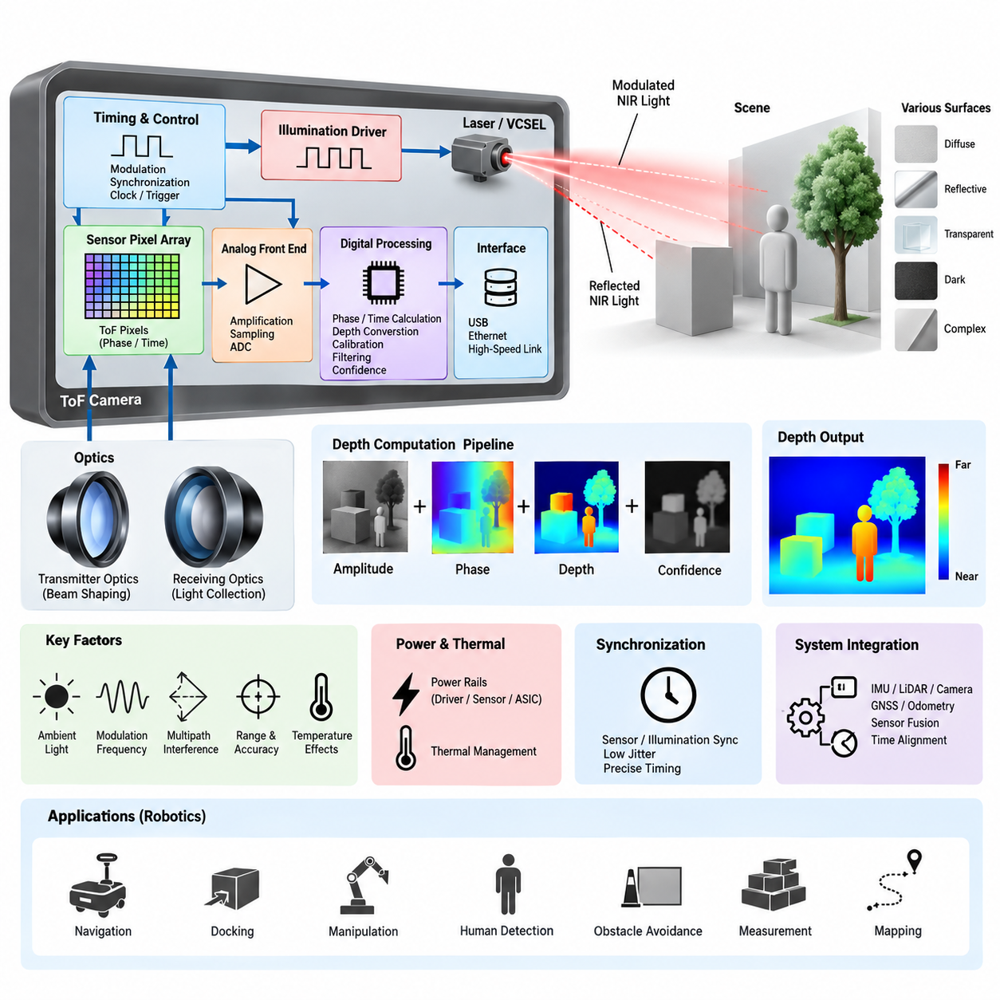
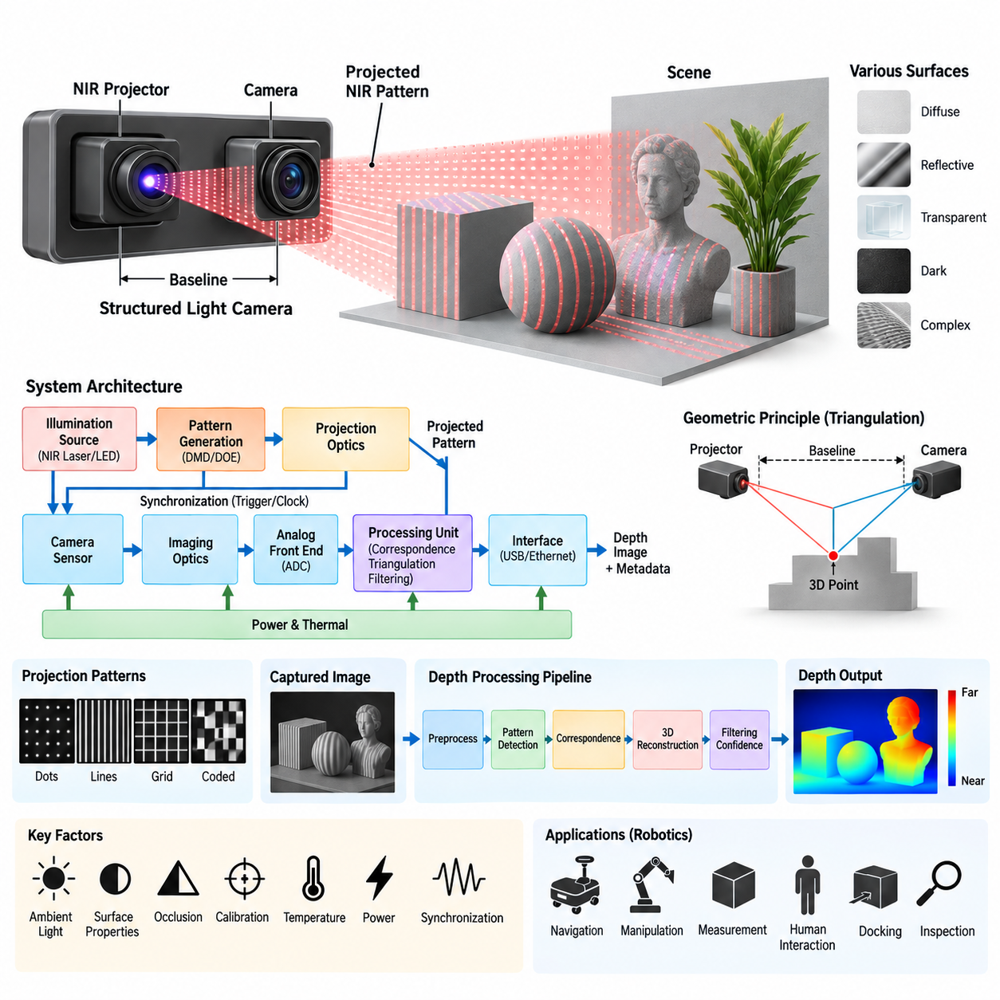
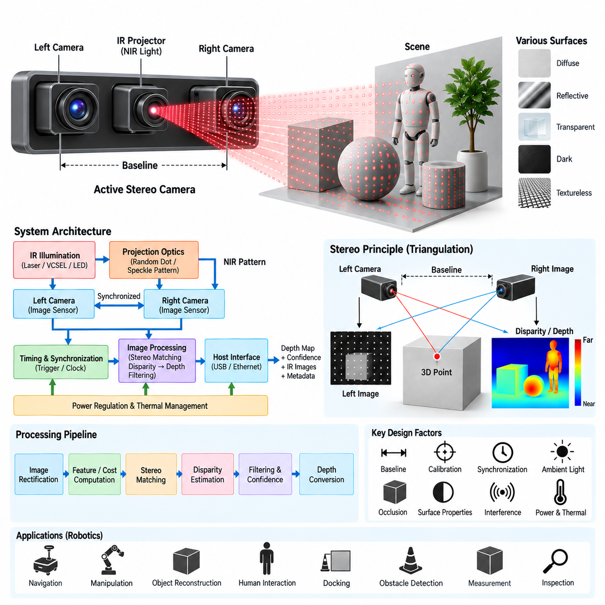
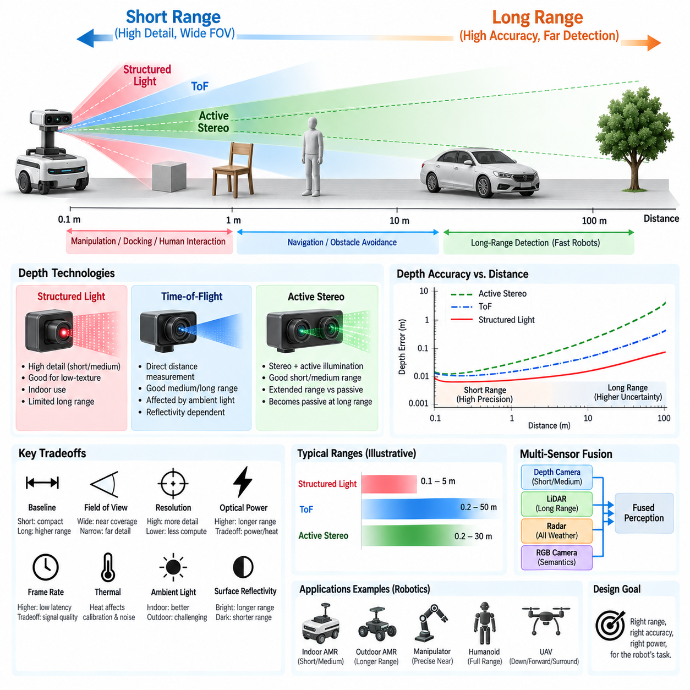
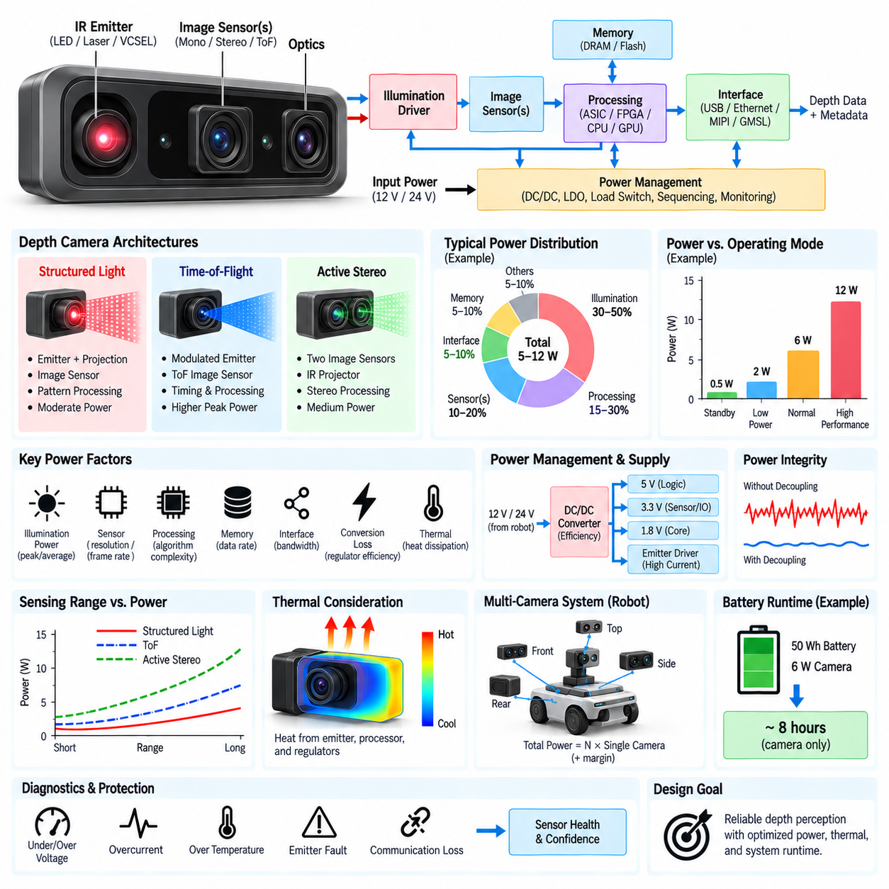

**Volume 15 Perception and Sensor Architecture**

# Chapter 03. Depth Camera

## 03.01. ToF Sensor Architecture

{width="7.268055555555556in" height="7.268055555555556in"}

Time-of-Flight sensing is an active depth-measurement architecture in which the sensor estimates distance by measuring the propagation behavior of emitted light. Unlike passive stereo vision, which infers depth from geometric disparity between two cameras, a ToF system actively illuminates the environment and observes the returned optical signal. This allows depth to be measured directly for many pixels simultaneously and makes ToF attractive for robotic perception in environments where ordinary visual texture is insufficient.

A typical ToF sensor architecture consists of an illumination subsystem, optical transmitter, scene interaction path, receiving optics, photosensitive pixel array, timing or phase-measurement circuitry, analog front end, digital processing logic, and communication interface. These elements operate as a tightly coordinated measurement chain. The quality of the resulting depth image therefore depends not only on the image sensor itself but also on optical power, timing precision, synchronization, signal processing, thermal stability, and electrical noise.

The illumination subsystem usually employs near-infrared light generated by laser diodes or vertical-cavity surface-emitting lasers, commonly called VCSELs. The emitted optical energy is distributed across the required field of view through dedicated illumination optics. Because depth accuracy depends on detecting the returned energy reliably, transmitter power, pulse shape or modulation waveform, beam uniformity, optical efficiency, and eye-safety constraints must be considered together rather than treating the illuminator as an independent light source.

Two major measurement principles are commonly associated with ToF architectures. Direct ToF measures the elapsed time between transmission of an optical pulse and detection of its reflection, relating propagation time directly to distance. Indirect ToF instead emits periodically modulated light and estimates distance from the phase relationship between transmitted and received signals. Indirect architectures are particularly suitable for dense depth imaging because phase-sensitive pixels can perform parallel measurements across a two-dimensional sensor array.

In an indirect ToF pixel, the returned optical signal is sampled at controlled phase positions relative to the illumination modulation. Charge accumulated in different measurement windows represents the correlation between the received light and the reference waveform. The processing circuitry uses these measurements to estimate phase shift, amplitude, confidence, and ultimately distance. Consequently, the pixel array is simultaneously an imaging device and a distributed measurement system whose timing behavior is fundamental to depth accuracy.

The electrical architecture must maintain close synchronization between the illumination driver and the sensor timing circuitry. Even small timing deviations can appear as systematic range errors because the distance estimate is derived from propagation delay or phase. A timing generator therefore coordinates modulation, exposure, pixel sampling, frame sequencing, and readout. Clock quality, jitter, propagation delay, PCB routing, power integrity, and temperature-dependent timing variation become important engineering parameters when designing a stable ToF camera.

Returned optical energy is generally much weaker than the transmitted signal because only a fraction of the illumination is reflected back toward the receiver. The receiving optics collect this light and project it onto the ToF pixel array, where the optical signal is converted into electrical charge. Lens aperture, field of view, optical transmission, sensor quantum efficiency, target reflectivity, distance, and illumination power collectively determine the available signal-to-noise ratio and therefore the practical operating range.

Ambient illumination introduces an important challenge because the receiver cannot assume that every detected photon originated from the ToF transmitter. Sunlight, artificial lighting, reflections, and other active infrared devices can contribute unwanted energy. Modulation and correlation techniques help distinguish the desired signal, while optical band-pass filters can suppress wavelengths outside the transmitter band. Nevertheless, strong ambient infrared radiation can reduce measurement confidence, shorten usable range, or saturate parts of the receiver.

Depth computation normally extends beyond a simple conversion from phase or delay into distance. Raw measurements may contain offset errors, phase nonlinearity, temperature drift, multipath interference, low-amplitude regions, saturated pixels, and edge artifacts. The processing pipeline can therefore include calibration compensation, amplitude evaluation, confidence estimation, invalid-pixel detection, filtering, and depth conversion. Some implementations perform much of this processing inside the sensor or dedicated ASIC, reducing the computational burden placed on the host processor.

Multipath interference occurs when emitted light reaches a pixel through several reflection paths rather than a single direct path. A wall corner, glossy floor, nearby structure, or reflective object can produce delayed optical components that are combined by the receiver. The resulting phase may represent a mixture of propagation distances rather than the true surface range. This illustrates why ToF depth should be interpreted as an optical measurement affected by scene geometry rather than as an inherently perfect geometric observation.

The unambiguous measurement range is closely related to the modulation architecture. In phase-based ToF, periodic modulation can cause different physical distances to produce equivalent measured phases after the phase wraps around. Modulation frequency therefore influences both depth sensitivity and unambiguous range. Multi-frequency techniques can combine measurements obtained at different modulation frequencies to resolve ambiguity while retaining useful precision, although this increases timing, processing, calibration, and potentially power-management complexity.

Power architecture is especially important because the illumination subsystem can create substantial transient current demand. The laser or VCSEL driver, ToF sensor, timing circuitry, processing ASIC, memory, and interface electronics may have different voltage rails and noise sensitivities. Local regulators and decoupling networks must prevent illumination switching currents from disturbing sensitive analog and timing circuits. PCB partitioning and return-current control are therefore closely connected to depth quality, not merely to conventional electrical reliability.

Thermal behavior also influences the architecture because transmitter efficiency, optical output, sensor characteristics, timing behavior, and calibration parameters can vary with temperature. Continuous depth operation may generate heat in the illuminator, driver, sensor, processor, and power-conversion stages. Temperature sensing and compensation can be incorporated into the calibration pipeline, while mechanical and PCB design must provide suitable thermal paths. Stable depth performance consequently requires electrical, optical, mechanical, and thermal design to be treated as one system.

The host interface transports depth frames and associated information such as infrared intensity, amplitude, confidence, timestamps, calibration data, and sensor status. Depending on the implementation, internal sensor interfaces may use high-speed serial links while complete depth-camera modules commonly expose USB, Ethernet, or other system-level connections. For robotic platforms, timestamp integrity and deterministic association with IMU, LiDAR, RGB camera, odometry, and control data can be as important as raw interface bandwidth.

ToF cameras are particularly useful for short- and medium-range robotic perception because they produce dense metric depth without requiring highly textured surfaces for stereo correspondence. They can support obstacle detection, human detection, docking, manipulation, navigation, free-space estimation, object dimension measurement, and near-field safety functions. However, highly reflective, transparent, dark, absorptive, or geometrically complex surfaces may still degrade measurements, so system design should characterize failure modes rather than assuming uniform performance.

In a mobile robot, the ToF subsystem should be considered part of the broader perception and sensor architecture rather than an isolated depth source. The provided volume structure places ToF within the Depth Camera chapter alongside Structured Light, Active Stereo, range tradeoffs, and depth-camera power budgeting, while subsequent chapters address LiDAR, radar, IMU, GNSS, sensor fusion, and time synchronization. This organization reflects the engineering need to evaluate ToF as one complementary sensing modality within a multi-sensor perception system.

A robust ToF architecture therefore emerges from coordinated design across illumination, optics, sensing pixels, timing electronics, analog signal acquisition, digital depth processing, calibration, power delivery, thermal control, synchronization, and communication. Depth accuracy cannot be assigned to a single component because every stage contributes uncertainty or disturbance. For robotics and Physical AI platforms, successful ToF integration depends on converting this complete electro-optical measurement chain into stable, timestamped, calibrated depth information that higher-level perception and decision systems can trust.

## 03.02. Structured Light System

{width="7.268055555555556in" height="7.268055555555556in"}

Structured light is an active depth-sensing technique in which a known optical pattern is projected onto a scene and observed by one or more cameras. Depth is estimated from the geometric deformation or displacement of the projected pattern after it interacts with object surfaces. Within the depth-camera architecture, structured light provides an alternative to Time-of-Flight sensing and active stereo while retaining the advantage of generating depth information through controlled illumination.

A structured-light system typically consists of an illumination source, pattern-generation element, projection optics, receiving camera, imaging optics, synchronization circuitry, processing unit, power subsystem, and host interface. The projector creates a predetermined spatial pattern and directs it toward the environment. The camera observes the resulting pattern, while processing algorithms determine how the observed pattern differs from its calibrated reference geometry and convert those differences into depth measurements.

The illumination source commonly operates in the near-infrared spectrum so that projected patterns can remain largely invisible to human users while being detected efficiently by the imaging sensor. Laser diodes or other infrared emitters can provide the optical energy required by the projector. The selected wavelength must be coordinated with camera sensitivity, optical filters, environmental illumination, required operating range, projector efficiency, and applicable optical safety requirements.

Pattern generation is the defining element of structured-light sensing. The projected field may contain dots, lines, grids, stripes, coded structures, or other spatial patterns whose geometry is known before projection. When this pattern falls on three-dimensional surfaces, its appearance changes according to surface distance and orientation. The camera records these changes, allowing the processing system to establish geometric relationships between projector coordinates, camera coordinates, and points in the observed scene.

The projector and camera form a calibrated geometric pair similar in principle to a stereo vision system. Instead of relying entirely on naturally occurring visual features to establish correspondence between two cameras, structured light introduces artificial features through controlled projection. The projector can therefore be treated conceptually as an inverse camera whose known rays intersect camera observation rays. Triangulation between these rays provides the geometric basis for estimating three-dimensional position.

Baseline geometry strongly influences measurement performance. The physical separation between the projector and receiving camera creates the triangulation baseline, while focal length, field of view, sensor resolution, and working distance determine how pattern displacement corresponds to depth. A larger baseline can improve depth sensitivity but may increase occlusion and packaging difficulty. A smaller baseline enables a compact module but can reduce triangulation accuracy, particularly as the measurement distance increases.

Correspondence estimation is essential because the processing system must determine which observed pattern element corresponds to which projected element. Coded patterns can simplify this association by assigning recognizable spatial characteristics to different projector regions. Once correspondence has been established, calibrated projector and camera parameters are used to reconstruct three-dimensional coordinates. Incorrect correspondence can generate severe depth errors, so confidence evaluation and rejection of ambiguous measurements are important parts of the processing pipeline.

Calibration establishes the intrinsic and extrinsic relationships required for accurate reconstruction. Camera focal parameters, lens distortion, projector geometry, relative rotation, relative translation, and baseline must be characterized with sufficient precision. Manufacturing tolerances or mechanical displacement can change these relationships after calibration. For this reason, rigid mechanical mounting and stable optical alignment are fundamental parts of the electrical and sensor architecture rather than merely packaging considerations.

The receiving camera generally includes an image sensor optimized for the projected wavelength, suitable imaging optics, and an optical band-pass filter. The filter suppresses unwanted wavelengths and improves the visibility of the structured pattern relative to ambient illumination. Sensor exposure and gain must also be controlled carefully because insufficient signal makes pattern detection unreliable, while excessive optical energy can saturate pixels and eliminate information needed for correspondence and depth reconstruction.

Ambient light can significantly influence structured-light performance. Strong sunlight contains substantial infrared energy and can reduce the contrast between the projected pattern and background illumination. Indoor environments are therefore often more favorable for infrared structured-light systems than bright outdoor environments. Increasing projector power can improve pattern visibility, but this approach is constrained by power consumption, thermal generation, eye safety, emitter lifetime, and the possibility of saturating nearby surfaces.

Surface characteristics also affect measurement reliability. Dark materials may absorb much of the projected energy, while highly reflective surfaces can create intense highlights or indirect reflections. Transparent and translucent materials can refract, transmit, or scatter the projected pattern, producing incorrect correspondence. Fine edges and depth discontinuities may create mixed or partially occluded patterns. Depth confidence should therefore reflect optical measurement quality rather than assuming that every reconstructed pixel represents an equally reliable surface observation.

Occlusion is a characteristic geometric limitation of projector-camera systems. A surface may be visible to the camera while being hidden from the projector, or it may receive projected illumination that cannot be observed from the camera position. These regions cannot provide valid structured-light correspondence. Increasing the projector-camera baseline may improve triangulation sensitivity but can also increase occlusion, creating an important tradeoff between accuracy, coverage, module size, and operating distance.

The depth-processing pipeline normally begins with captured pattern imagery and proceeds through preprocessing, pattern detection, correspondence estimation, geometric reconstruction, calibration compensation, validity testing, and filtering. The result is typically a dense or semi-dense depth map accompanied by intensity or confidence information. Dedicated processors, ASICs, embedded CPUs, GPUs, or edge AI processors may perform these functions depending on required frame rate, resolution, latency, power consumption, and system integration constraints.

Electrical synchronization between projection and image acquisition becomes especially important when the projector operates intermittently or when multiple pattern states are used. Trigger signals can coordinate pattern emission, camera exposure, frame capture, and processing intervals. Timing errors may cause the camera to capture an incomplete or incorrect projected state. Stable clocks, deterministic triggering, appropriate exposure timing, and accurate timestamps therefore contribute directly to measurement quality and multi-sensor integration.

Power design must account for the different characteristics of the projector, camera sensor, processor, memory, and communication circuitry. The infrared projector may create relatively large and rapidly changing current demands, whereas image-sensor and analog circuits can be sensitive to supply noise. Separate regulation, local decoupling, controlled grounding, and careful PCB current-return design can prevent illumination switching from degrading image quality or timing stability.

Thermal management is closely connected to optical and geometric stability. Projector output, emitter wavelength, image-sensor noise, processor behavior, and mechanical alignment can vary with temperature. Heat generated by the illumination source and processing electronics can also create temperature gradients across a compact camera module. Thermal paths, temperature monitoring, compensation parameters, and mechanically stable materials are therefore important for maintaining consistent depth performance during continuous operation.

The host system may receive depth images together with infrared imagery, confidence values, calibration parameters, timestamps, and diagnostic information. USB, Ethernet, or other high-speed interfaces can transport these data to an embedded computer or robotic perception processor. When structured-light depth is fused with RGB cameras, IMUs, LiDAR, odometry, or other sensors, accurate timestamps and known sensor coordinate transformations are necessary to preserve spatial and temporal consistency.

For robotics, structured-light cameras are particularly useful in indoor navigation, manipulation, object measurement, docking, human interaction, inspection, and near-field obstacle perception. Their artificial texture can provide useful geometric information on surfaces that would otherwise be difficult for passive stereo correspondence. However, operating range, ambient-light sensitivity, surface characteristics, occlusion, projector power, and thermal constraints must be evaluated against the intended robotic environment rather than considering depth resolution alone.

Within the broader perception architecture, structured light should be evaluated together with ToF sensing, active stereo, short-range versus long-range requirements, and the complete depth-camera power budget. The supplied architecture places these technologies within the same Depth Camera chapter before progressing to LiDAR, radar, IMU, GNSS, sensor fusion, and time synchronization. This structure emphasizes that no single depth technology is optimal for every robotic operating condition.

A robust structured-light system ultimately depends on coordinated optical, geometric, electrical, computational, thermal, and mechanical design. Projected pattern quality alone does not guarantee accurate depth; projector-camera calibration, synchronization, signal contrast, correspondence reliability, power integrity, thermal stability, and environmental robustness all influence the final measurement. For robotics and Physical AI systems, the objective is to transform controlled optical projection into reliable, calibrated, timestamped three-dimensional information that can support perception, planning, and autonomous interaction.

## 03.03. Active Stereo Design

{width="7.268055555555556in" height="7.268055555555556in"}

Active stereo is an active depth-sensing architecture that combines conventional stereo vision with controlled illumination to improve correspondence between two cameras. A left and right camera observe the same scene from different viewpoints, while an infrared projector introduces artificial texture onto surfaces that may otherwise contain insufficient visual detail. Depth is then estimated from binocular disparity rather than directly from optical propagation time, distinguishing active stereo from Time-of-Flight sensing.

The basic architecture consists of two synchronized image sensors separated by a known baseline, matched imaging optics, an active infrared illumination source, projection optics, timing and synchronization circuitry, image-processing hardware, power regulation, and a host communication interface. The cameras provide the geometric observations required for triangulation, while the projector improves the availability and reliability of image features used during stereo correspondence.

Active illumination commonly uses near-infrared light so that artificial texture can be introduced without significantly disturbing normal visible-light operation. An infrared laser, VCSEL, or LED source can illuminate the scene with a random-dot, pseudo-random, speckle, or other textured pattern. Unlike structured-light systems that may explicitly decode a predetermined pattern geometry, active stereo primarily uses the projected texture to strengthen stereo matching between the left and right camera images.

The stereo baseline is one of the most important physical design parameters. It represents the distance between the optical centers of the left and right cameras and determines how strongly object depth produces image disparity. A larger baseline generally increases depth sensitivity at longer ranges, but it also enlarges the sensor assembly and increases differences in viewpoint, occlusion, and correspondence difficulty. A shorter baseline enables compact packaging and better near-field overlap but reduces depth resolution as range increases.

Depth is derived from the relationship between focal length, baseline, and measured disparity. For a rectified stereo pair, corresponding scene points appear primarily displaced along the horizontal image direction. Larger disparity generally represents nearby objects, while smaller disparity represents distant objects. Because depth becomes increasingly sensitive to small disparity errors at longer range, sensor resolution, focal length, baseline accuracy, calibration quality, and matching precision collectively determine practical depth performance.

Stereo calibration establishes the intrinsic and extrinsic parameters required for geometric reconstruction. Intrinsic parameters describe focal length, principal point, and lens distortion for each camera, while extrinsic parameters describe the relative rotation and translation between them. Calibration data are used to rectify the two images so that corresponding points lie along predictable epipolar lines, substantially reducing the search space required by the stereo correspondence algorithm.

Mechanical stability is therefore inseparable from active stereo accuracy. Movement of either camera relative to the calibrated baseline changes the extrinsic geometry and introduces systematic depth errors. The camera carrier, PCB, housing, lens mounts, and mechanical interfaces should maintain alignment across vibration, shock, assembly variation, and temperature changes. For robotic systems exposed to continuous motion, calibration retention can be as important as the initial laboratory calibration accuracy.

Hardware synchronization ensures that the left and right cameras observe the scene at effectively the same instant. This becomes particularly important when robots, people, vehicles, manipulators, or other objects are moving. Unsynchronized exposure can cause an object\'s apparent position to differ between images because of motion rather than viewpoint. Shared triggers, synchronized clocks, controlled exposure timing, and accurate timestamps therefore reduce temporal disparity and improve correspondence reliability.

The active projector must also be coordinated with camera exposure. Illumination can operate continuously or be synchronized to specific exposure intervals depending on optical power, thermal constraints, interference requirements, and system architecture. Synchronized projection can improve energy efficiency and reduce unnecessary illumination, but it requires deterministic timing between projector activation and image acquisition. Incorrect timing can weaken projected texture or produce inconsistent stereo frames.

The image-processing pipeline begins with synchronized left and right images and typically includes correction of sensor and lens effects, stereo rectification, feature or cost computation, correspondence search, disparity estimation, consistency checking, filtering, and depth conversion. Modern implementations may use block matching, semi-global techniques, neural stereo models, or hybrid approaches. The resulting disparity map is converted into metric depth using calibrated camera geometry.

Confidence estimation is important because not every image region supports reliable stereo matching. Repetitive textures can produce ambiguous correspondence, while occluded areas may be visible to only one camera. Reflective, transparent, dark, or low-signal surfaces can also reduce matching quality. Active illumination improves low-texture regions but does not eliminate these fundamental stereo limitations. Invalid or low-confidence measurements should therefore be identified before depth information is consumed by robotic perception.

Occlusion arises naturally from the spatial separation of the two cameras. A scene region visible from the left camera may be hidden from the right camera, preventing valid binocular correspondence. Increasing the baseline can improve geometric depth sensitivity while simultaneously increasing occlusion differences. Active stereo design therefore requires a balance among baseline, operating distance, field-of-view overlap, module dimensions, depth precision, and the expected geometry of the robot\'s operating environment.

Ambient illumination affects active stereo primarily by changing the visibility of the projected infrared texture. Strong sunlight can overwhelm the active pattern and cause the system to behave increasingly like passive stereo. Optical band-pass filtering, suitable emitter wavelength, exposure control, sensor sensitivity, and projector power can improve robustness. Nevertheless, indoor and controlled-light environments generally allow active illumination to contribute more strongly than high-intensity outdoor environments.

Multiple active depth sensors can interfere with one another when their projected infrared patterns overlap. A camera may observe texture generated by another robot or sensor and treat it as part of its own illumination pattern. Temporal modulation, projector scheduling, wavelength separation, exposure coordination, or algorithmic rejection can reduce such interference. This issue becomes increasingly relevant in fleets of AMRs or robotic workcells containing several active stereo devices.

The electrical architecture must isolate sensitive camera and timing circuits from the relatively dynamic current requirements of the illumination subsystem. Dedicated voltage regulation, local decoupling, controlled grounding, and appropriate PCB return-current paths help maintain image quality and synchronization stability. The projector, cameras, processing device, memory, and communication interface should therefore be considered as interacting electrical loads rather than independent components.

Thermal design influences both optical performance and geometric calibration. Heat from the projector, image sensors, processing hardware, and regulators can alter sensor noise, emitter output, lens behavior, and mechanical dimensions. Differential thermal expansion across the stereo baseline can modify relative camera alignment. Temperature monitoring, compensation, stable mechanical materials, controlled heat paths, and appropriate operating limits help preserve depth accuracy during continuous robotic operation.

The processing platform may be an embedded CPU, GPU, FPGA, dedicated vision ASIC, or edge AI processor depending on resolution, frame rate, stereo algorithm complexity, power consumption, and latency requirements. Stereo correspondence can be computationally demanding because candidate matches must be evaluated across large image regions. Hardware acceleration becomes particularly valuable when dense depth must be generated at high frame rates for real-time navigation or manipulation.

The host interface can provide rectified images, disparity maps, metric depth, infrared intensity, confidence information, calibration parameters, timestamps, and diagnostic status. USB, Ethernet, or other high-speed interfaces may connect the active stereo module to the robot\'s main compute platform. Accurate coordinate transformations and timestamps allow the depth data to be combined with RGB cameras, IMUs, LiDAR, wheel odometry, and other sensing modalities within a sensor-fusion architecture.

For robotics, active stereo is well suited to indoor navigation, obstacle detection, manipulation, docking, object reconstruction, human interaction, and near-field environmental perception. It combines the geometric foundation of stereo vision with artificial texture that improves operation on visually uniform surfaces. Its effectiveness nevertheless depends on baseline selection, calibration stability, synchronization, projected-pattern visibility, surface properties, ambient illumination, processing capability, and required operating range.

Within the supplied perception architecture, Active Stereo Design is positioned in the Depth Camera chapter after ToF Sensor Architecture and Structured Light System, followed by Short Range Long Range Tradeoff and Depth Camera Power Budget. This organization places active stereo as one of three principal active depth approaches that should be compared at system level before selecting a sensing architecture for a particular robotic platform.

A robust active stereo design therefore requires coordinated optical, mechanical, electrical, timing, computational, and calibration engineering. The projector must provide usable artificial texture, the stereo pair must preserve its calibrated geometry, exposures must remain synchronized, and the processing pipeline must distinguish reliable correspondence from ambiguous measurements. For robotics and Physical AI systems, the final objective is stable, calibrated, timestamped three-dimensional perception that can support real-time localization, planning, manipulation, and autonomous interaction.

## 03.04. Short Range/Long Range Tradeoff

{width="7.268055555555556in" height="7.268055555555556in"}

Short-range and long-range depth sensing represent fundamentally different optimization targets within a robotic perception architecture. A sensor optimized for nearby objects must prioritize minimum measurable distance, wide field of view, fine spatial detail, and low-latency response, while a long-range sensor must preserve depth accuracy as distance increases. Designing a depth-camera system therefore requires balancing range, precision, resolution, optical power, baseline geometry, computation, and environmental robustness.

The required sensing range should be derived from the robot\'s operational behavior rather than from the maximum specification of an individual sensor. Manipulation, docking, human interaction, and near-field obstacle avoidance may require reliable depth measurements from tens of centimeters to several meters. Faster mobile robots require perception farther ahead so that detection, localization, planning, braking, and control can be completed before the robot reaches an obstacle.

Short-range sensing benefits from geometries and optical configurations that provide dense measurements over a relatively wide angular region. Large image disparity, strong returned illumination, and high pixel coverage of nearby objects can produce detailed surface information. However, extremely close objects may exceed the optical overlap between cameras and projectors, fall outside the calibrated depth region, become defocused, or saturate active illumination, creating a practical minimum operating distance.

Long-range sensing introduces a different set of limitations because depth uncertainty generally increases with distance. In stereo-based systems, disparity becomes progressively smaller as an object moves farther from the cameras, making depth increasingly sensitive to subpixel correspondence errors. Higher image resolution, longer focal length, larger baseline, and more accurate matching can extend useful range, but each introduces consequences for field of view, packaging, processing load, calibration stability, or cost.

Baseline selection is therefore a central tradeoff for stereo and active-stereo architectures. A short baseline provides compact packaging, strong field-of-view overlap, and favorable near-range operation, but distant objects generate very small disparity. A longer baseline improves long-range triangulation sensitivity, yet increases module dimensions, viewpoint differences, occlusion, and calibration sensitivity. A single baseline rarely provides optimal performance across both very short and very long distances.

Field of view creates another important relationship between near-range coverage and long-range observation. Wide-angle optics provide extensive surrounding coverage and are useful for detecting nearby obstacles around a robot, but distribute available image resolution across a large angular region. Narrower optics concentrate pixels over a smaller angular range and can improve distant-object detail. Sensor architecture must therefore balance angular coverage against spatial resolution at the target distance.

Time-of-Flight sensing exhibits a different range tradeoff because its depth measurement depends on active optical transmission and detection rather than binocular disparity. At short distances, strong returned signals can provide dense and stable depth, although highly reflective nearby targets may cause saturation. At longer distances, optical energy spreads and returned signal strength decreases, increasing sensitivity to target reflectivity, ambient illumination, receiver noise, modulation characteristics, and transmitter power.

Structured-light systems are generally advantageous where detailed depth information is required within a controlled short- or medium-range workspace. Projected patterns can provide strong geometric cues on surfaces lacking natural texture, supporting manipulation, object measurement, docking, and indoor interaction. As distance increases, however, projected pattern density and contrast decrease, while ambient illumination and surface properties make pattern detection progressively more difficult.

Active stereo can extend useful operation beyond purely passive stereo in texture-poor environments by projecting artificial infrared features. At short and medium ranges, these features improve correspondence reliability substantially. At greater distances, the projected texture becomes weaker and less distinguishable, eventually leaving the cameras dependent primarily on naturally occurring scene texture. The architecture may therefore transition gradually from active-assisted stereo to effectively passive stereo as distance increases.

Optical power cannot simply be increased without limit to extend active sensing range. Higher emitter power increases electrical consumption, thermal load, and potential eye-safety concerns while also creating stronger reflections and possible saturation at short range. Illumination optics can concentrate energy toward distant targets, but narrower projection reduces coverage. The required range must consequently be considered together with field of view, emitter duty cycle, thermal capacity, and safety constraints.

Ambient light creates an especially important distinction between laboratory range and practical operating range. Indoor depth cameras can benefit from controlled lighting and relatively low infrared background levels, whereas outdoor sunlight can substantially reduce the signal-to-background ratio of active infrared systems. A sensor advertised for a particular maximum distance may therefore provide significantly different usable depth quality depending on whether the robot operates indoors, outdoors, in darkness, or under direct sunlight.

Surface reflectivity also causes usable range to vary across objects within the same scene. Bright diffuse surfaces may provide strong returns at relatively long distances, whereas dark materials can become unreliable much earlier. Reflective, transparent, and translucent objects can generate invalid or misleading depth regardless of nominal range. A practical range specification should therefore describe confidence and accuracy across representative materials rather than relying only on a single maximum-distance value.

Depth resolution and depth accuracy should not be confused with image resolution. A depth camera may output a large number of pixels while still producing substantial range uncertainty at long distance. The meaningful system metric is whether each depth sample provides sufficient spatial and distance accuracy for the robotic task. Manipulation may demand millimeter-scale local geometry, whereas navigation can sometimes tolerate larger depth uncertainty if obstacles and free space remain reliably distinguishable.

Frame rate and latency also participate in the range tradeoff. Increasing exposure time or accumulating multiple measurements can improve signal quality, particularly for weak long-range returns, but may reduce frame rate or increase latency. A moving robot cannot evaluate sensor range independently from its velocity because additional sensing distance provides value only when measurements arrive early enough for perception, planning, and control to react safely.

Processing requirements can increase when the architecture attempts to preserve high resolution across a broad range. Stereo matching at large image resolutions, multi-frequency ToF processing, confidence estimation, temporal filtering, and neural depth refinement can consume significant computational resources. Reducing resolution may lower power and latency but sacrifice distant detail. Edge-compute capability must therefore be included when defining the practical sensing envelope rather than treating depth-camera performance as purely optical.

Power budgeting creates a direct system-level constraint. Long-range active illumination can require greater optical output, while higher-resolution sensors and more sophisticated processing increase electrical consumption. These loads also generate additional heat that may influence calibration and sensor noise. For battery-powered AMRs, manipulators, quadrupeds, humanoids, and UAVs, additional sensing range must justify its impact on energy consumption, thermal design, runtime, mass, and packaging.

Sensor placement can compensate for some limitations of a single depth camera. Near-field cameras may be positioned to cover blind zones around the chassis, manipulator, or docking interface, while forward-facing sensors can prioritize longer detection distance. Overlapping fields of view allow transitions between sensing regions and support cross-validation. This distributed architecture can be more effective than forcing one optical configuration to satisfy every distance requirement.

Multi-sensor fusion provides an additional method for resolving the short-range and long-range conflict. Depth cameras can provide dense local geometry, while LiDAR can extend reliable geometric perception over greater distances. Radar can contribute long-range detection and velocity information under environmental conditions that challenge optical sensors, while RGB cameras provide semantic information. The appropriate solution is therefore often complementary sensing rather than selection of a universally superior depth technology.

The transition between sensing regions should be treated as an architectural problem. Near, intermediate, and far observations may differ in resolution, uncertainty, update rate, and sensor modality. Perception software must understand these characteristics so that confidence does not change abruptly when an object moves between sensing zones. Calibration, coordinate transformation, timestamps, uncertainty models, and sensor-fusion logic are required to create a coherent spatial representation across the complete operating envelope.

For an indoor AMR, short- and medium-range dense depth may dominate because navigation speeds are moderate and interaction with people, furniture, doors, elevators, and docking stations occurs nearby. Outdoor AMRs may require substantially longer perception distance because of higher speed and larger open spaces. Manipulators emphasize precise near-field geometry, while UAVs may require different combinations of downward, forward, and surrounding sensing according to altitude and flight velocity.

The supplied architecture places Short Range Long Range Tradeoff after ToF Sensor Architecture, Structured Light System, and Active Stereo Design, and immediately before Depth Camera Power Budget. This sequence reflects an important engineering progression: first understand the available depth-sensing principles, then determine how their performance changes with operating distance, and finally translate the selected sensing envelope into electrical and power requirements for the complete robotic platform.

A robust depth-camera architecture therefore does not seek maximum range as an isolated objective. It defines the distance over which measurements remain sufficiently accurate, dense, timely, and reliable for specific robotic functions. Short-range precision, long-range awareness, field of view, baseline, illumination, ambient-light tolerance, processing latency, power, thermal behavior, and sensor fusion must be optimized together to create a practical perception envelope for robotics and Physical AI systems.

## 03.05. Depth Camera Power Budget

{width="7.268055555555556in" height="7.268055555555556in"}

A depth camera power budget defines how electrical energy is allocated across the sensing, illumination, processing, communication, and supporting circuits required to generate reliable three-dimensional measurements. Unlike a passive camera, many depth cameras contain active optical emitters and substantial real-time processing hardware. Power design must therefore consider average consumption, transient demand, peak current, conversion losses, thermal dissipation, operating modes, and the effect of supply quality on measurement accuracy.

The architecture of a depth camera determines its power profile. Time-of-Flight systems require an illumination source, optical driver, ToF sensor, timing circuitry, depth-processing logic, memory, and communication interface. Structured-light cameras add pattern projection and image acquisition, while active stereo typically combines two image sensors with an infrared projector and stereo-processing hardware. Each architecture distributes electrical power differently even when the resulting depth resolution and operating range appear similar.

The first step in power budgeting is to identify every electrical load and its operating state. Typical loads include image sensors, laser or VCSEL emitters, LEDs, illumination drivers, processors, ASICs, FPGAs, memory devices, oscillators, interface transceivers, regulators, temperature sensors, and auxiliary control circuits. Each component should be characterized under startup, idle, normal acquisition, maximum illumination, high-rate processing, communication, calibration, and fault conditions rather than assigning only a single nominal power value.

Active illumination can represent one of the largest and most dynamic loads in a depth-camera module. ToF, structured-light, and active-stereo systems may use infrared LEDs, laser diodes, or VCSEL arrays that operate continuously or with controlled duty cycles. Their instantaneous electrical power can be considerably higher than their average power. The supply network must therefore support peak current without excessive voltage droop while also satisfying optical output, range, thermal, efficiency, and eye-safety requirements.

Duty-cycle control provides an important mechanism for balancing sensing performance against power consumption. An emitter that operates only during camera exposure or specific measurement intervals can reduce average energy consumption and heat generation while maintaining sufficient instantaneous optical power. However, aggressive duty cycling requires precise synchronization between illumination, exposure, timing circuitry, and processing. The power budget should therefore distinguish peak emitter power from time-averaged illumination power.

Image sensors create relatively continuous electrical loads associated with pixel operation, analog circuitry, ADC conversion, clock generation, and data transmission. Their consumption varies with resolution, frame rate, exposure architecture, interface speed, and enabled sensor functions. Stereo systems must account for two synchronized sensors, while some depth modules also provide RGB or auxiliary infrared streams. Increasing resolution or frame rate can therefore increase both sensor power and downstream processing and interface consumption.

Depth processing can consume as much power as the sensing hardware itself. ToF phase processing, structured-light correspondence, stereo disparity estimation, filtering, confidence calculation, and depth conversion require substantial computational throughput. Processing may occur in a dedicated ASIC, FPGA, embedded CPU, GPU, or external edge computer. The system power budget should clearly define whether quoted camera power includes depth computation or only raw sensor acquisition, because architectural boundaries can otherwise hide significant electrical demand.

Memory and data movement are additional contributors that are often underestimated. High-resolution depth pipelines may repeatedly transfer image frames, disparity data, confidence maps, calibration tables, and intermediate buffers between sensors, processors, and memory. Dynamic memory access and high-speed serial interfaces consume power even when arithmetic computation is efficient. Reducing unnecessary copies, selecting suitable data formats, and performing processing close to the sensor can therefore improve total energy efficiency.

Communication interfaces must also be included in the budget. USB, Ethernet, MIPI, GMSL, or other high-speed links require physical-layer circuitry, clocks, buffers, and sometimes additional bridge devices. Their consumption depends on data rate and link configuration. A camera transmitting depth, infrared, RGB, confidence, and metadata simultaneously may require substantially more interface bandwidth than one transmitting only a depth map, increasing both camera-side and host-side power consumption.

Voltage conversion losses separate source power from the power actually consumed by individual circuits. A robot may provide 12 V, 24 V, or another system rail while the depth module requires several lower rails for logic, sensors, memory, analog circuitry, and emitters. Buck converters, low-dropout regulators, load switches, and filtering networks introduce losses. The input power budget must therefore include regulator efficiency rather than simply adding the nominal power values of downstream components.

Power-rail partitioning is important because depth-camera loads have different noise characteristics. High-current illumination drivers and digital processors can create switching disturbances, while analog sensor circuits, timing references, and clock networks may be sensitive to supply noise. Separate regulation or filtering can prevent emitter pulses and processor activity from degrading depth measurements. Power integrity is therefore not only a reliability concern; inadequate rail design can directly appear as image noise, timing error, or unstable depth output.

Transient analysis is particularly important for active depth cameras. Illumination pulses, processor workload changes, interface bursts, and startup events can generate rapid current transitions that are not visible in average-power specifications. Local bulk capacitance and high-frequency decoupling must provide energy during these events while regulators respond. PCB impedance, connector resistance, cable voltage drop, and source impedance should be included when evaluating the minimum voltage available at the camera during peak demand.

Startup power deserves separate consideration because multiple internal rails may be enabled in sequence and large capacitors may draw significant inrush current. If several depth cameras start simultaneously on a robot, combined inrush can temporarily exceed the capacity of a shared DC/DC converter or protection device. Controlled sequencing, soft-start functions, load switches, staggered initialization, and suitable fuse or electronic protection characteristics can prevent startup behavior from destabilizing the robot\'s electrical system.

Thermal design is directly connected to the electrical power budget because nearly all consumed electrical energy eventually becomes heat inside or near the camera module. Emitters, processors, regulators, and high-speed interfaces can create concentrated thermal sources. Higher temperature can alter image-sensor noise, emitter efficiency, optical wavelength, calibration parameters, and mechanical alignment. The acceptable power budget must therefore be determined together with enclosure thermal resistance, airflow, conduction paths, and environmental temperature.

Operating modes can significantly reduce energy consumption when maximum sensing performance is unnecessary. A depth camera may support standby, reduced-frame-rate, low-resolution, passive-only, reduced-illumination, triggered acquisition, or full-performance modes. A stationary robot may lower sensing activity, while motion or proximity events can restore full operation. Such state-based power management is particularly useful for battery-powered robots because perception demand changes considerably throughout a mission.

Power budgeting should also consider the relationship between sensing range and energy consumption. Extending the range of active optical sensing often requires stronger illumination, longer integration, more sophisticated processing, or higher-resolution imaging. Each can increase power or latency. The preceding short-range versus long-range tradeoff therefore translates directly into electrical requirements: maximum sensing distance should be justified by the robot\'s operational needs rather than pursued without regard to energy and thermal cost.

Multiple depth cameras can create a substantial platform-level load. An AMR may use forward, rear, side, upper, or docking cameras to eliminate blind regions, while a humanoid or mobile manipulator may distribute cameras across the head, torso, arms, or base. The electrical architecture must multiply not only nominal camera consumption but also simultaneous peak currents, startup behavior, communication loads, and thermal effects when estimating the complete perception-system power demand.

The robot-level power budget should include margin for component variation, temperature, aging, supply tolerance, future software modes, and temporary peak operation. Designing the power distribution unit or DC/DC converter exactly at calculated nominal consumption leaves insufficient robustness for real operation. Engineering margin should be assigned systematically while avoiding excessive oversizing that increases converter mass, volume, cost, and low-load inefficiency.

Monitoring provides a way to validate assumptions after integration. Current and voltage measurement at the camera rail or individual subsystem rails can reveal actual consumption during startup, idle, navigation, manipulation, maximum illumination, and high-compute operation. Temperature telemetry can then connect electrical load to thermal behavior. Comparing measured data with the original power model allows discrepancies to be identified before they become field reliability or runtime problems.

Power faults should be integrated with diagnostic and protection architecture. Undervoltage, overcurrent, excessive temperature, emitter-driver faults, communication loss, or unstable rails can invalidate depth information even when the camera continues producing frames. A robust system should therefore associate electrical health with sensor confidence and diagnostic status. Higher-level perception software should be able to distinguish trustworthy depth data from measurements generated while the sensor is operating outside its validated electrical conditions.

For battery-powered robotics, camera consumption must ultimately be translated into mission energy. A seemingly modest continuous load becomes significant when several sensors operate for many hours. The relevant quantity is therefore not only watts but watt-hours over the expected duty cycle. Sensor energy should be evaluated together with compute, communication, actuators, cooling, and auxiliary systems so that perception capability can be balanced against required operating duration.

The supplied architecture places Depth Camera Power Budget after ToF Sensor Architecture, Structured Light System, Active Stereo Design, and Short Range Long Range Tradeoff. This sequence reflects the system-engineering relationship among sensing principle, required operating envelope, and electrical implementation. Once depth technology and practical range have been selected, their illumination, computation, interface, thermal, and transient requirements can be translated into a complete power architecture.

A robust depth-camera power budget therefore extends beyond adding component wattages. It models operating states, peak currents, duty cycles, conversion efficiency, startup behavior, communication, processing, power integrity, thermal dissipation, diagnostic coverage, and mission energy. For robotics and Physical AI platforms, the objective is to provide sufficient electrical resources for dependable three-dimensional perception while minimizing unnecessary energy consumption, thermal stress, electrical noise, and impact on total system runtime.
