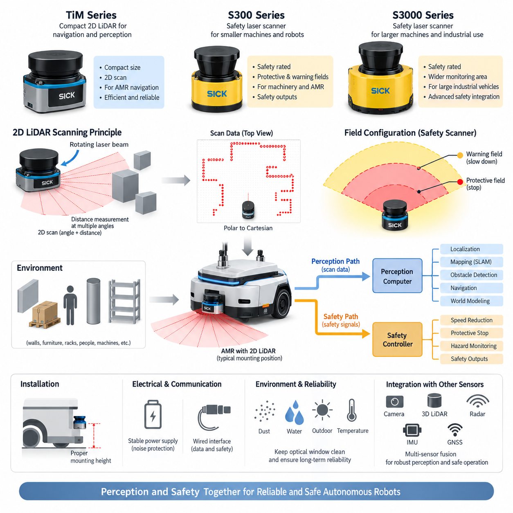
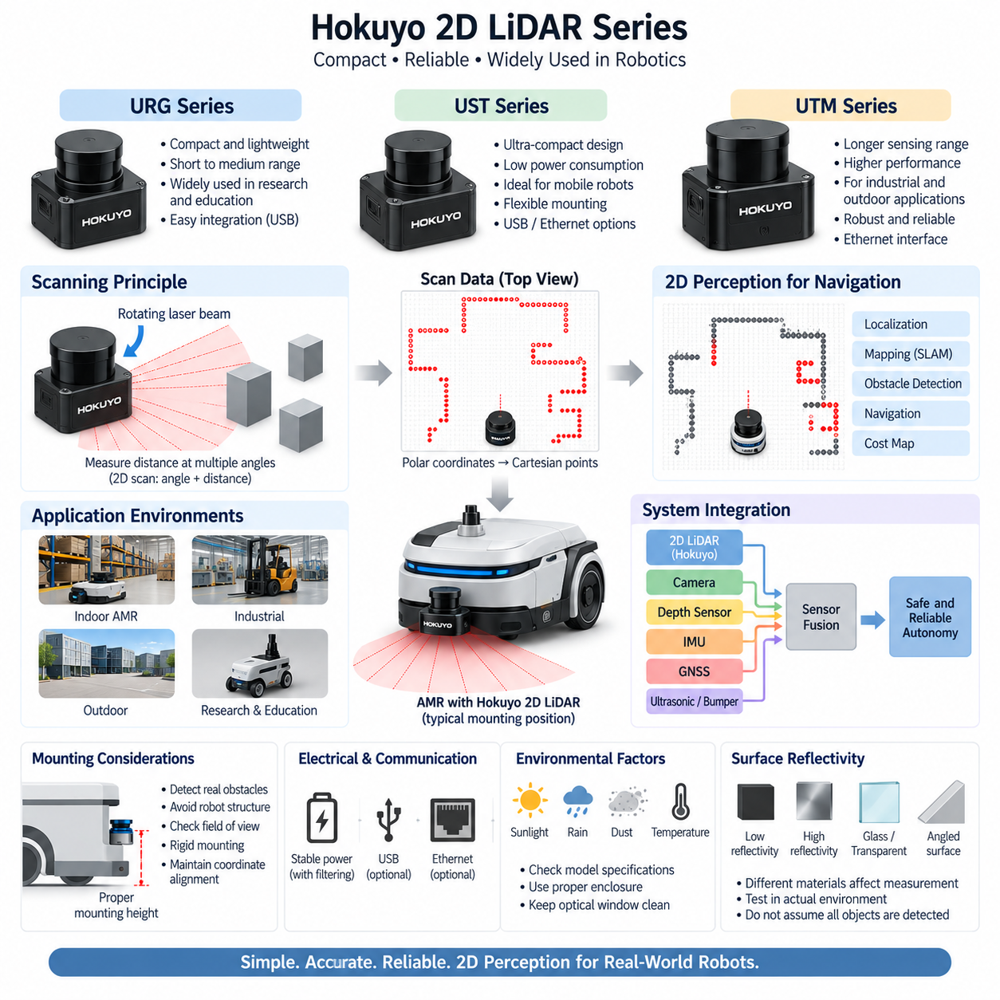
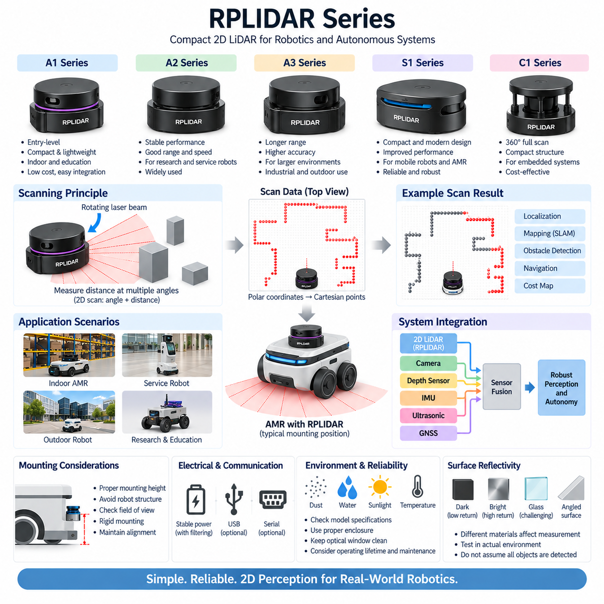
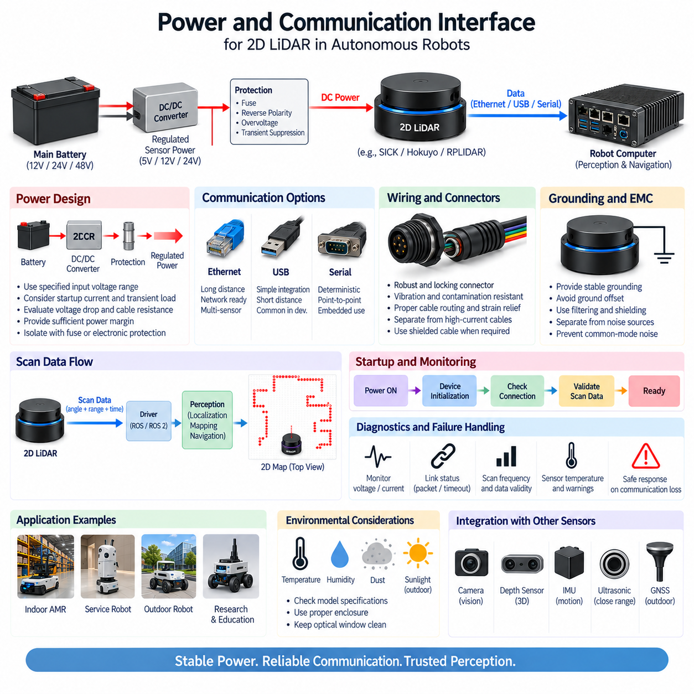
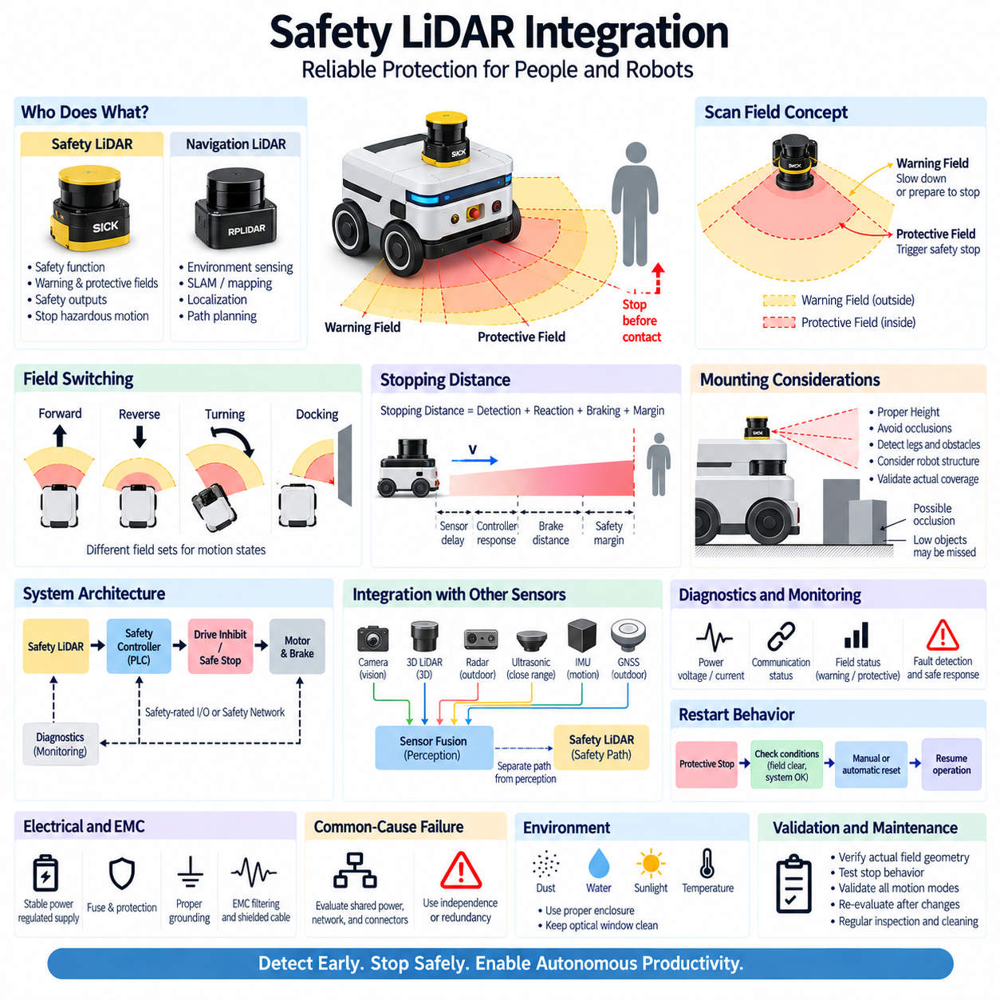

**Volume 15 Perception and Sensor Architecture**

# Chapter 04. 2D LiDAR

## 04.01. SICK TIM/S300/S3000

{width="7.268055555555556in" height="7.268055555555556in"}

SICK TiM, S300 및 S3000 제품군은 산업 자동화(Industrial Automation)와 이동 로봇(Mobile Robotics)에 사용되는 2차원 레이저 스캐닝(2D Laser Scanning) 기술의 중요한 세대와 응용 범주를 대표한다. 인지 및 센서 아키텍처(Perception and Sensor Architecture) 관점에서 이들은 소형 내비게이션 중심 라이다(Navigation-Oriented LiDAR)에서 안전 등급 보호용 레이저 스캐너(Safety-Rated Protective Laser Scanner)로 발전하는 흐름을 보여준다. 세 제품군 모두 수평 평면에서 레이저 빔을 주사하지만 목적, 인터페이스, 진단 개념 및 안전 책임에는 상당한 차이가 있다.

2D 라이다(2D LiDAR)는 스캐닝 평면(Scanning Plane) 내의 여러 각도 방향에서 거리를 반복 측정하여 장애물의 기하학적 형상(Geometry)을 파악한다. 회전하거나 광학적으로 편향되는 레이저 빔이 주변 물체를 조사하고, 반사된 광 에너지가 검출되어 거리 측정값으로 변환된다. 연속적인 측정 결과는 각도와 거리로 구성된 극좌표 표현(Polar Representation)을 형성하며, 로봇 소프트웨어는 이를 직교좌표(Cartesian Coordinates)로 변환하여 위치추정, 지도작성, 장애물 감지, 내비게이션 또는 보호 영역 감시에 활용한다.

SICK TiM 시리즈는 비교적 작은 기계적 크기와 실용적인 스캐닝 기능을 결합하고 있어 소형 자율이동로봇(Autonomous Mobile Robot)에 특히 적합하다. TiM 센서는 로봇 주변의 벽, 가구, 랙, 기계, 사람 및 기타 장애물을 평면 형태로 표현할 수 있다. 고밀도의 3차원 기하 정보를 생성하는 대신 효율적인 2차원 스캔 데이터를 제공하므로 비교적 제한된 컴퓨팅 자원에서도 처리할 수 있으며, 예측 가능한 지연시간(Latency)으로 지속 동작해야 하는 내비게이션 계층에 적합하다.

AMR에서 TiM급 스캐너는 일반적으로 스캔 평면이 차량의 주행을 방해하는 장애물과 교차하도록 섀시(Chassis)의 낮은 외곽 부분에 설치된다. 장착 높이는 휠 형상, 범퍼 높이, 예상 장애물 크기, 바닥 불규칙성 및 적재 구조를 고려하여 결정해야 한다. 스캐너가 너무 높으면 낮은 장애물을 감지하지 못할 수 있으며, 지나치게 낮으면 바닥 단차, 경사로, 반사, 먼지 또는 로봇 자체 구조물에 의한 불필요한 검출이 증가할 수 있다.

S300은 일반적인 인지 기능보다 안전 레이저 스캐닝(Safety Laser Scanning)을 중심으로 설계되었다는 점에서 다른 범주에 속한다. 안전 스캐너(Safety Scanner)는 기계 또는 이동 플랫폼 주변의 설정 가능한 영역을 감시하고, 물체가 정의된 보호 영역(Protective Field)에 진입하면 안전 관련 출력을 생성할 수 있다. 따라서 단순히 내비게이션 소프트웨어에 환경 데이터를 제공하는 것을 넘어 제어 감속, 보호 정지, 작업자 보호 및 위험 영역 감시와 같은 기능에 직접 참여할 수 있다.

보호 영역(Protective Field)과 경고 영역(Warning Field)은 안전 스캐너 통합의 핵심 개념이다. 경고 영역에서는 물체가 위험 영역에 도달하기 전에 로봇 제어기가 속도를 낮추거나 정지를 준비하도록 할 수 있다. 보호 영역은 설정된 안전 개념에 따라 위험한 움직임을 더 이상 허용할 수 없는 영역을 의미한다. 따라서 영역의 형상은 단순한 장애물 거리뿐만 아니라 차량 속도, 제동 성능, 제어기 응답시간, 스캐너 응답 특성, 위치 불확실성 및 필요한 안전 여유(Safety Margin)를 고려하여 결정해야 한다.

S3000은 이러한 안전 스캐닝 철학을 더 큰 기계와 보다 넓은 감시 기능 및 복잡한 안전 통합이 필요한 응용으로 확장한다. 역사적으로 산업용 차량, 무인운반시스템(Automated Guided System), 제조 장비 및 보호 생산구역 등에 사용되어 왔다. 아키텍처 관점에서 중요한 점은 S3000급 장치를 단순히 성능이 높은 내비게이션 라이다로 이해해서는 안 된다는 것이다. 핵심적인 공학적 가치는 신뢰성 있는 보호 감시와 안전 제어 체인(Safety Control Chain)으로의 통합에 있다.

이러한 차이는 로봇 내부에 두 개의 병렬적인 정보 경로를 형성한다. 인지 경로(Perception Path)는 스캔 데이터를 산업용 PC, 엣지 컴퓨터(Edge Computer), 위치추정 모듈, SLAM 시스템 또는 장애물 처리 소프트웨어로 전달할 수 있다. 반면 안전 경로(Safety Path)는 보호 감지 결과를 안전 등급 로직(Safety-Rated Logic)과 연결하고 궁극적으로 로봇의 움직임을 제한하는 하드웨어에 전달한다. 따라서 AI 인지 컴퓨터가 이러한 독립적인 안전 경로를 자동으로 대체할 수 있다고 가정해서는 안 된다.

전기적 통합(Electrical Integration)은 정확한 스캐너 모델과 제조사 요구조건에 적합한 안정적인 전원 공급에서 시작한다. 라이다 전원은 과도한 전압 강하, 역접속, 과도현상(Transient Disturbance), 전도성 노이즈(Conducted Noise), 모터 또는 스위칭 컨버터에서 발생하는 전기적 교란으로부터 보호되어야 한다. 민감한 센서 배선은 가능한 경우 고전류 모터 배선과 분리해야 하며, 커넥터 고정, 차폐(Shielding), 접지, 외함 보호 및 정비 접근성 역시 시스템 신뢰성에 중요한 요소가 된다.

통신 아키텍처(Communication Architecture)는 제품 세대와 구성에 따라 달라진다. 인지 목적으로 사용하는 스캔 데이터는 선택된 장치가 지원하는 인터페이스를 통해 전송될 수 있으며, 안전 관련 상태는 전용 안전 출력이나 적절한 안전 통신 구조를 사용할 수 있다. 따라서 엔지니어는 일반 측정 데이터, 설정 통신(Configuration Communication), 진단 정보(Diagnostic Information), 안전 신호(Safety Signal)를 명확하게 구분해야 한다. 이들을 하나의 일반적인 \'LiDAR 인터페이스\'로 취급하면 고장 모드 분석과 시스템 수준 검증이 어려워질 수 있다.

기계적 설치(Mechanical Installation)는 전기적 통합만큼 측정 품질에 큰 영향을 미친다. 스캐너는 섀시에 견고하게 고정되어야 하며, 진동, 브래킷 변형, 충돌 손상 또는 장착 각도 오차는 스캔 평면과 로봇 좌표계(Robot Coordinate Frame)의 관계를 변화시킨다. 필요한 시야각(Field of View) 전체에서 광학 창이 가려지지 않아야 하므로 커버, 범퍼, 적재 구조물, 케이블, 외장 패널 및 인접 센서와의 간섭을 최종 장착 위치 확정 전에 CAD 패키징(CAD Packaging) 단계에서 검토해야 한다.

오염(Contamination) 역시 실제 시스템에서 중요한 고려사항이다. 광학 표면의 먼지, 물방울, 결로, 유막, 긁힘 및 이물질 축적은 반사 신호를 저하시키거나 비정상적인 측정값을 발생시킬 수 있다. 실외 및 반실외 로봇은 통제된 공장 환경보다 훨씬 심한 환경에 노출될 수 있으므로 특별한 주의가 필요하다. 센서 진단(Sensor Diagnostics)은 정기적인 검사 및 유지보수 절차와 결합하여 광학 상태의 열화가 지속적인 내비게이션 또는 안전 문제로 발전하기 전에 감지할 수 있어야 한다.

내비게이션 관점에서 2D 라이다는 평면 기하 정보가 점유 격자(Occupancy Grid), 스캔 정합(Scan Matching), 위치추정(Localization), 장애물 지도와 매우 잘 결합되기 때문에 여전히 중요한 센서이다. 벽, 기둥, 랙 및 기타 고정 구조물은 시각적 외관이 변하더라도 안정적인 기하학적 특징을 제공할 수 있다. 따라서 로봇은 TiM급 스캐너를 휠 오도메트리(Wheel Odometry), 관성측정장치(IMU), 카메라 또는 깊이 센서(Depth Sensor)와 결합하여 사용할 수 있다.

안전 스캐너는 일반적인 인지 센서와 다른 검증 철학(Validation Philosophy)이 필요하다. 보호 영역의 크기는 단순한 스캐너 감지 거리보다 전체 정지 과정(Stopping Process)을 고려하여 결정해야 한다. 시스템은 센싱 및 평가 시간, 통신 또는 출력 지연, 안전 제어기 처리시간, 액추에이터 응답, 브레이크 작동, 기계적 정지거리, 차량 속도, 적재 조건, 타이어와 바닥 사이의 마찰 및 각종 불확실성을 고려해야 한다. 따라서 로봇 속도가 증가하면 일반적으로 더 큰 보호 영역이나 적절한 영역 전환 전략(Field-Switching Strategy)이 필요하다.

이동 로봇은 운행 상태에 따라 여러 개의 영역 설정(Field Set)을 사용할 수 있다. 전진 시에는 길게 확장된 전방 보호 영역을 활성화할 수 있으며, 후진 시에는 적절한 후방 감시가 필요하다. 회전 중에는 조향 기하학(Steering Geometry)에 따라 로봇의 점유 궤적(Swept Volume)이 변하기 때문에 비대칭적인 감시 영역이 필요할 수 있다. 저속 도킹(Docking)에서는 정상 주행과 다른 영역 구성을 적용할 수 있으며, 활성화된 영역은 실제 차량 운동 상태와 일치해야 하고 전환 과정에서 일시적인 비보호 상태가 발생하지 않아야 한다.

따라서 TiM, S300 및 S3000의 비교를 단순히 측정 거리, 각도 분해능(Angular Resolution), 스캔 주파수(Scan Frequency)의 차이로 한정해서는 안 된다. TiM은 인지와 내비게이션에 적합한 소형 2D 센싱 플랫폼으로 이해할 수 있으며, S300과 S3000은 정의된 보호 조건에서 위험한 움직임을 감시하도록 설계된 안전 스캐닝 아키텍처(Safety Scanning Architecture)로 이해해야 한다. 세부 기능은 모델과 세대에 따라 달라지므로 실제 적용 시에는 해당 부품 번호의 데이터시트를 기준으로 전기적 제한, 인터페이스, 영역 구성, 환경 등급 및 안전 파라미터를 확인해야 한다.

현대적인 피지컬 AI 로봇(Physical AI Robot)에서는 이러한 스캐너를 카메라, 스테레오 시스템(Stereo System), 깊이 카메라(Depth Camera), 3D 라이다(3D LiDAR), 레이더(Radar), 관성측정장치(IMU), 위성항법시스템(GNSS)과 함께 사용할 수 있다. 2D 스캐너는 계산 효율이 높고 결정론적인(Deterministic) 환경의 기하학적 단면을 제공한다는 점에서 여전히 유용하다. 고급 센서가 의미론적 이해와 3차원 환경 인식을 향상시키더라도 차량 주변의 신뢰성 높은 장애물 형상을 확보하기 위한 전용 평면 스캐너의 가치는 유지된다.

결과적으로 로봇 아키텍처에서는 인지 라이다(Perception LiDAR)와 안전 라이다(Safety LiDAR)를 서로 관련되어 있지만 구별되는 서브시스템(Subsystem)으로 다루어야 한다. 인지 데이터는 위치추정, 경로계획(Planning), 월드 모델링(World Modeling), 자율 의사결정(Autonomous Decision-Making)을 지원하는 반면, 안전 센싱은 위험한 움직임이 허용될 수 있는지를 독립적으로 감독한다. 이러한 분리를 유지하면 고도화된 AI 기능을 도입하면서도 독립적인 보호 메커니즘을 약화시키지 않을 수 있으며, TiM, S300 및 S3000 제품군은 2D 라이다의 발전과 AMR 센서 아키텍처에서의 지속적인 역할을 이해하는 대표적인 기준이 된다.

## 04.02. Hokuyo Series

{width="7.268055555555556in" height="7.268055555555556in"}

Hokuyo Electric은 로보틱스(Robotics), 자율이동로봇(Autonomous Mobile Robot), 무인운반차량(Automated Guided Vehicle), 연구용 플랫폼(Research Platform), 산업 자동화(Industrial Automation)에 사용되는 소형 2차원 레이저 거리 센서(2D Laser Range Sensor)로 널리 알려져 있다. 2D 라이다 아키텍처(2D LiDAR Architecture)에서 Hokuyo 센서는 비교적 작은 크기, 낮은 전력 요구량, 간단한 디지털 인터페이스(Digital Interface), 성숙한 스캐닝 기술을 결합한다는 점에서 중요하다. 이러한 특성으로 인해 위치추정, 지도작성, 장애물 감지 및 내비게이션에 실용적으로 활용할 수 있다.

Hokuyo 2D 라이다(2D LiDAR)는 수평 스캐닝 평면(Scanning Plane)을 따라 레이저 광을 방출하고 여러 각도 위치에서 물체로부터 반사되는 신호를 검출하여 주변의 기하학적 구조를 측정한다. 각각의 측정값은 스캔 각도와 계산된 거리를 연결하여 일련의 극좌표(Polar Coordinates)를 생성한다. 로봇 소프트웨어는 이를 직교좌표(Cartesian Points)로 변환하고 벽, 기둥, 가구, 랙, 기계, 사람 및 스캐닝 평면과 교차하는 기타 물체의 2차원 표현을 구성한다.

Hokuyo 제품군(Portfolio)은 서로 다른 측정 거리, 환경 조건, 인터페이스 및 로봇 응용을 위해 개발된 다양한 센서 제품군으로 구성된다. 소형 모델은 일반적으로 실내 이동 로봇과 연구실 시스템에 사용되며, 더 긴 측정 거리와 높은 환경 내구성을 갖춘 모델은 산업 및 실외 응용을 지원할 수 있다. 따라서 Hokuyo 시리즈(Series)는 하나의 전기적 또는 광학적 사양이 아니라 제품군(Product Family)으로 이해해야 하며, 정확한 특성은 선택한 모델을 기준으로 확인해야 한다.

URG 시리즈(URG Series)는 비교적 작은 하드웨어에서 평면 거리 측정값을 쉽게 얻을 수 있는 방법을 제공하면서 이동 로봇 분야에서 특히 널리 알려졌다. 연구용 로봇, 교육용 플랫폼, 서비스 로봇 및 실험용 자율 시스템에서 폭넓게 활용되어 왔다. 개별 사양뿐만 아니라 광범위한 로보틱스 소프트웨어 지원을 통해 2D 레이저 스캔(2D Laser Scan)이 위치추정, 동시적 위치추정 및 지도작성(SLAM), 내비게이션 및 장애물 처리 파이프라인의 표준적인 인지 데이터 표현으로 자리 잡는 데 기여했다.

UST 시리즈(UST Series)는 Hokuyo의 또 다른 중요한 소형 스캐너 계열이다. 패키징(Packaging)과 스캐닝 특성으로 인해 설치 공간과 센서 질량이 제한되는 이동 플랫폼에 적합하다. AMR에서는 UST급 센서를 섀시(Chassis)의 낮은 외곽에 배치하여 차량 주변의 장애물을 감지할 수 있다. 요구되는 감시 범위에 따라 하나의 스캐너로 주요 주행 방향을 감시하거나 여러 개의 스캐너를 배치하여 플랫폼 주변의 사각지대(Blind Region)를 줄일 수 있다.

UTM 시리즈(UTM Series)는 일반적으로 매우 작은 단거리 장치보다 높은 감지 성능이 필요한 응용과 연관된다. 더 긴 유효 측정 거리(Usable Range)는 환경 구조물을 보다 일찍 감지할 수 있게 하고, 로봇이 주변 물체에 접근하기 전에 위치추정 알고리즘에 기하학적 정보를 제공할 수 있다. 이러한 특성은 대형 실내 공간, 복도, 창고, 산업 시설 및 일부 실외 환경에서 내비게이션 시스템이 보다 넓은 영역의 구조적 특징을 활용해야 할 때 유용하다.

Hokuyo 스캐너의 기본 데이터 출력은 스캔 각도에 따라 순서대로 배열된 일련의 거리 측정값(Range Measurements)이다. 이러한 표현은 고밀도 3차원 포인트 클라우드(Dense 3D Point Cloud)에 비해 계산 효율이 높아 임베디드 컴퓨터(Embedded Computer)나 산업용 PC(Industrial PC)에서 빠르게 처리할 수 있다. 스캔 정합 알고리즘(Scan Matching Algorithm)은 연속된 측정값을 비교하여 상대적인 움직임을 추정하고, SLAM 알고리즘은 반복되는 스캔을 오도메트리(Odometry) 또는 다른 센서 정보와 결합하여 지도를 생성하고 그 안에서 로봇 자세(Pose)를 추정한다.

위치추정(Localization)에서는 안정적인 기하학적 구조가 특히 중요하다. 벽, 기둥, 랙, 기계 경계 및 건축 구조물은 조명 조건이나 시각적 질감이 변화하더라도 공간적으로 일정하게 유지되는 경우가 많다. 따라서 2D 라이다는 시각적 질감에 대한 의존도가 낮은 직접적인 기하 측정값을 제공함으로써 카메라 기반 인지(Camera-Based Perception)를 보완할 수 있다. 그러나 스캐너는 스캔 평면과 교차하는 물체만 관측하므로 평면 위나 아래의 물체는 추가적인 센서가 수직 방향을 감시하지 않는 경우 감지되지 않을 수 있다.

따라서 장착 높이(Mounting Height)는 가장 중요한 기계 설계 결정 중 하나이다. 스캔 평면은 실제로 로봇의 이동을 방해할 수 있는 장애물과 교차해야 하며, 동시에 로봇 섀시 자체로 인한 과도한 간섭은 피해야 한다. 지나치게 낮게 설치하면 바닥의 불규칙성이나 구조 부품의 영향을 많이 받을 수 있고, 너무 높게 설치하면 낮은 장애물이 레이저 평면 아래를 통과할 수 있다. 기계 CAD 분석(Mechanical CAD Analysis)을 통해 전체 시야각(Field of View), 범퍼 형상, 휠 영역, 적재 구조 및 잠재적인 가림(Occlusion)을 검토해야 한다.

견고한 장착(Rigid Mounting)도 필수적이다. 스캐너 좌표계(Scanner Coordinate Frame)는 로봇 베이스 좌표계(Robot Base Frame)와 일정하고 정확한 관계를 유지해야 한다. 브래킷 변형, 진동, 충돌에 의한 위치 변화 또는 잘못된 설치 각도는 위치추정 및 장애물 좌표에 체계적인 오차(Systematic Error)를 발생시킬 수 있다. 설치 후에는 라이다와 로봇 좌표계 사이의 변환 관계를 정확하게 정의해야 하며, 다중 센서 로봇에서는 카메라, 관성측정장치(IMU), 깊이 센서(Depth Sensor) 등 다른 인지 센서 좌표계와의 외부 파라미터 관계(Extrinsic Relationship)도 일관되게 유지해야 한다.

전기 아키텍처(Electrical Architecture)는 선택한 Hokuyo 모델의 요구조건을 기준으로 설계해야 한다. 센서 전원은 기동, 정상 주행, 가속, 제동, 충전 상태 전환 및 기타 전기적 교란 상황에서도 규정된 동작 범위 내에서 유지되어야 한다. 모터 드라이버(Motor Driver)와 DC/DC 컨버터(DC/DC Converter)는 전도성 또는 방사성 노이즈를 발생시킬 수 있으므로 센서 전원 분배에서는 필터링, 접지, 케이블 배치, 커넥터 품질 및 전압 강하 여유를 고려해야 한다. 안정적인 전원 공급은 신뢰성 높은 스캔 데이터 획득에 직접적으로 기여한다.

통신 인터페이스(Communication Interface)는 Hokuyo 제품 세대와 모델에 따라 달라지며, 전체 제품군에서는 USB 및 이더넷 기반 연결(Ethernet-Based Connectivity)이 대표적으로 사용된다. USB는 소형 연구 시스템의 통합을 단순화할 수 있는 반면, 이더넷은 더 긴 케이블 배선과 일반적인 네트워크 인프라를 지원하므로 분산형 로봇 아키텍처(Distributed Robot Architecture)에 적합하다. 그러나 전체 시리즈가 동일한 호환성을 가진다고 가정해서는 안 되며, 특정 장치의 커넥터 핀 배열, 프로토콜 동작, 네트워크 설정, 케이블 요구조건 및 기동 특성을 확인해야 한다.

ROS 또는 ROS 2 아키텍처에서 Hokuyo의 스캔 측정값은 일반적으로 각도 한계, 각도 증가량, 거리값 및 시간 정보를 포함하는 평면 레이저 스캔 데이터 스트림(Planar Laser-Scan Data Stream)으로 표현된다. 내비게이션 소프트웨어는 로봇 좌표계 계층(Coordinate-Frame Hierarchy)을 통해 이 데이터를 변환하고 위치추정, 비용 지도 생성(Cost-Map Generation), 장애물 회피, SLAM 등에 활용할 수 있다. 이러한 데이터 표현의 단순성과 효율성은 카메라와 3차원 인지 센서의 활용이 증가하는 상황에서도 2D 스캐너가 계속 효과적으로 사용되는 중요한 이유이다.

완전한 하나의 스캔은 수학적으로 동일한 순간에 획득되는 것이 아니라 일정한 시간 간격에 걸쳐 생성되므로 시간 처리(Timing)도 신중하게 고려해야 한다. 스캐닝 중 로봇이 빠르게 병진하거나 회전하면 각각의 측정값은 조금씩 다른 플랫폼 자세에서 획득된다. 저속 실내 AMR에서는 이러한 영향이 제한적일 수 있지만, 고속 또는 고정밀 응용에서는 정확한 기하 정렬을 유지하기 위해 보다 정밀한 타임스탬프 처리(Timestamp Handling), 움직임 보상(Motion Compensation), 오도메트리 또는 IMU 정보와의 동기화(Synchronization)가 필요할 수 있다.

환경 성능(Environmental Performance)은 선택한 Hokuyo 모델에 크게 좌우된다. 실내용 센서는 통제된 조명과 비교적 청결한 환경에서 안정적으로 동작할 수 있지만 비, 직사광선, 먼지, 결로 또는 심한 온도 변화에 자동으로 적합하다고 가정해서는 안 된다. 실외 적용에서는 광학 성능, 외함 보호 등급(Enclosure Protection), 동작 온도, 진동 내성 및 환경적 제한을 확인해야 한다. 기계적 커버를 사용하여 보호할 수 있지만 레이저 스캐닝 개구부(Scanning Aperture)를 가리거나 불필요한 반사를 발생시켜서는 안 된다.

반사율(Reflectivity)과 표면 형상(Surface Geometry)은 레이저 거리 측정 특성에 영향을 미친다. 어두운 재료는 상대적으로 약한 광학 반사 신호를 생성할 수 있으며, 반사율이 매우 높은 표면에서는 비정상적인 응답이 발생할 수 있다. 유리 또는 투명 구조물도 측정을 어렵게 만들 수 있으며, 기울어진 표면은 반사광을 수신기와 다른 방향으로 보낼 수 있다. 따라서 모든 물리적 장애물이 동일한 수준으로 안정적인 거리 데이터를 생성한다고 가정해서는 안 되며, 시스템 시험 과정에서 실제 운용 환경의 대표적인 재질을 대상으로 검증해야 한다.

하나의 Hokuyo 2D 라이다는 뛰어난 평면 인지(Planar Awareness)를 제공할 수 있지만 3차원 위험 요소를 완전하게 표현할 수는 없다. 테이블 상판, 지게차 포크, 매달린 물체, 돌출된 선반, 경사로, 구멍 및 스캔 평면 밖에 위치한 장애물은 깊이 카메라, 추가 라이다, 초음파 센서(Ultrasonic Sensor), 범퍼 또는 3D 인지 시스템을 필요로 할 수 있다. 따라서 센서 융합(Sensor Fusion)은 단순히 동일한 측정값을 중복하는 것이 아니라 감시 범위를 확장하여 효율적인 평면 기하 정보와 풍부한 공간 및 의미 정보를 결합하는 역할을 한다.

Hokuyo 스캐너는 계층형 AMR 인지 아키텍처(Layered AMR Perception Architecture)의 구성요소로 특히 유용하다. 2D 라이다는 위치추정과 근거리 장애물 지도에 안정적인 기하 정보를 제공하고, 카메라는 외관과 의미 정보(Semantic Information)를 제공하며, 깊이 카메라는 국부적인 3차원 구조를 제공한다. IMU는 움직임 추정을 향상시키며, 실외 플랫폼에서는 위성항법시스템(GNSS)과 추가적인 장거리 센서를 결합하여 아키텍처를 확장할 수 있다. 각 센싱 방식은 하나의 범용 센서가 되기 위해 경쟁하는 것이 아니라 서로 다른 불확실성을 보완한다.

전용 안전 레이저 스캐너(Dedicated Safety Laser Scanner)와 달리 내비게이션 중심의 Hokuyo 장치를 안전 관련 정지 기능(Safety-Related Stopping Function)을 담당하는 독립적인 보호 장치로 자동 간주해서는 안 된다. 인지(Perception)와 기능 안전(Functional Safety)은 서로 다른 설계 및 검증 요구조건을 가진다. 로봇은 Hokuyo 스캔 데이터를 내비게이션과 일반적인 장애물 회피에 사용하면서 별도의 안전 등급 센싱 및 제어 체인(Safety-Rated Sensing and Control Chain)을 통해 위험한 움직임을 감독할 수 있다. 이러한 아키텍처적 구분을 유지하면 고수준 자율 기능과 인증된 보호 메커니즘을 혼동하는 것을 방지할 수 있다.

따라서 Hokuyo 시리즈는 로보틱스에서 소형이며 효율적인 2D 인지(2D Perception)를 구현하기 위한 유용한 참조 아키텍처(Reference Architecture)를 제공한다. 핵심적인 공학적 가치는 주변의 평면 기하 정보를 단순하고 빠르게 처리할 수 있는 거리 데이터로 변환하여 위치추정, SLAM, 내비게이션 및 장애물 감지와 자연스럽게 통합하는 데 있다. 적절한 모델 선정, 장착, 전원 설계, 통신, 시간 처리, 환경 검증 및 다중 센서 통합(Multi-Sensor Integration)은 겉보기에는 단순한 이 센서가 현대적인 AMR 인지 시스템의 신뢰성 높은 구성요소가 될 수 있는지를 결정한다.

## 04.03. RPLIDAR Series

{width="7.268055555555556in" height="7.268055555555556in"}

RPLIDAR는 로보틱스(Robotics), 자율이동로봇(Autonomous Mobile Robot), 서비스 로봇(Service Robot), 매핑 플랫폼(Mapping Platform), 교육, 연구 및 임베디드 인지 시스템(Embedded Perception System)을 위해 개발된 소형 2차원 레이저 스캐너(2D Laser Scanner) 제품군이다. 2D 라이다 아키텍처(2D LiDAR Architecture)에서 RPLIDAR 시리즈는 비교적 접근하기 쉬운 하드웨어와 연속적인 평면 스캐닝(Planar Scanning), 소형 패키징 및 위치추정, SLAM, 장애물 감지, 자율 내비게이션에 적합한 소프트웨어 통합성을 결합한다는 점에서 중요하다.

RPLIDAR의 기본 동작 원리는 다른 회전형 2D 레이저 스캐너(Rotating 2D Laser Scanner)와 유사하다. 레이저 거리 측정 모듈(Laser Ranging Module)이 주변 환경을 회전하면서 거리를 측정한다. 각각의 측정값은 각도 위치와 이에 대응하는 거리값으로 구성되어 주변 기하 구조의 극좌표 표현(Polar Representation)을 생성한다. 소프트웨어는 이 샘플들을 직교좌표(Cartesian Points)로 변환하여 스캐닝 평면과 교차하는 벽, 가구, 랙, 사람, 장비 및 기타 물체를 표현한다.

주로 영상의 밝기와 외관 정보를 측정하는 카메라와 달리 2D 라이다(2D LiDAR)는 직접적인 기하학적 거리 정보(Geometric Range Information)를 생성한다. 따라서 RPLIDAR는 고밀도 영상 데이터를 처리하지 않고도 로봇이 자유 공간(Free Space)과 장애물 경계를 경량화된 형태로 표현해야 할 때 유용하다. 생성된 스캔 데이터는 비교적 낮은 계산 요구량을 유지하면서 점유 격자(Occupancy Grid), 로컬 비용 지도(Local Cost Map), 스캔 정합 알고리즘(Scan-Matching Algorithm), 위치추정 시스템 및 SLAM 파이프라인에 통합할 수 있다.

RPLIDAR 제품군(Portfolio)은 하나의 표준화된 센서 사양이 아니라 여러 세대와 성능 등급으로 구성된다. 모델별로 측정 거리, 스캔 속도, 각도 샘플링(Angular Sampling), 광학 성능, 기계 구조, 통신 인터페이스 및 환경 대응 능력의 조합이 다르다. 따라서 엔지니어링 관점의 센서 선정은 특정 RPLIDAR 모델의 사양을 전체 제품군에 동일하게 적용하기보다 실제 응용 요구사항(Application Requirements)을 기준으로 시작해야 한다.

보급형 RPLIDAR 모델은 교육용 로봇, 연구용 시제품, 실내 서비스 로봇 및 저비용 자율 플랫폼에 특히 유용하다. 개발자는 초기 단계부터 고가의 산업용 라이다 하드웨어를 채택하지 않고도 실용적인 매핑 및 내비게이션 시스템을 구성할 수 있다. 이러한 접근성은 알고리즘 개발에도 유용하며, 엔지니어는 실제 거리 데이터를 이용하여 스캔 처리, 위치추정, 점유 지도(Occupancy Mapping), 경로계획(Path Planning), 장애물 회피 등을 연구할 수 있다.

고성능 RPLIDAR 제품군은 이러한 개념을 보다 넓은 환경과 요구조건이 높은 이동 로봇 응용으로 확장한다. 더 긴 유효 측정 거리, 향상된 샘플링 특성, 빠른 스캐닝 또는 개선된 기계 설계는 위치추정과 내비게이션에 더 많은 환경 정보를 제공할 수 있다. 이러한 특성은 창고, 복도, 상업용 건물, 물류 시설 등에서 안정적인 기하학적 구조를 더 먼 거리에서 관측해야 하는 경우에 유용하다.

SLAM에서는 로봇이 이동하는 동안 스캐너가 주변의 기하학적 특징(Geometric Feature)을 반복적으로 관측한다. 연속된 스캔을 비교하여 위치와 방향의 변화를 추정할 수 있으며, 휠 오도메트리(Wheel Odometry)와 관성측정장치(IMU)의 측정값을 추가적인 운동 정보로 사용할 수 있다. SLAM 시스템은 이러한 관측값을 결합하여 지도를 생성하고 그 안에서 로봇 자세(Robot Pose)를 추정하며, 벽, 모서리, 기둥, 랙 등의 지속적인 구조물이 유용한 기하학적 제약조건을 제공한다.

평면 라이다(Planar LiDAR)의 주요 장점은 데이터 구조가 간결하다는 것이다. 고용량 3차원 포인트 클라우드(3D Point Cloud)를 생성하는 대신 스캐너는 환경의 하나의 수평 단면을 나타내는 각도별 거리 샘플을 출력한다. 이를 통해 내비게이션 알고리즘은 지도와 장애물 계층(Obstacle Layer)을 효율적으로 갱신할 수 있다. 주로 평탄한 바닥에서 이동하는 많은 실내 AMR에서는 이러한 평면 표현만으로도 내비게이션 파이프라인의 상당 부분에 필요한 기하 정보를 제공할 수 있다.

그러나 동일한 평면 구조는 중요한 한계도 만든다. RPLIDAR는 레이저 스캐닝 평면과 교차하는 물체만 감지할 수 있다. 낮은 물체는 스캔 평면 아래에 존재할 수 있으며, 테이블 상판, 선반, 돌출 구조물 또는 매달린 장애물은 그 위에 위치할 수 있다. 계단이나 구멍과 같은 음의 장애물(Negative Obstacle)도 별도의 고려가 필요하다. 따라서 복잡한 환경에서 운용되는 로봇은 3차원 위험 영역 감시가 필요한 경우 평면 라이다와 보완 센서를 결합해야 한다.

센서 장착 높이(Mounting Height)는 로봇의 물리적 형상과 운용 환경을 기준으로 결정해야 한다. 레이저 평면은 대표적인 장애물과 교차하면서도 휠, 범퍼, 차체 패널, 케이블 등 로봇 자체의 구성요소를 피해야 한다. 지나치게 높은 장착은 낮은 장애물에 취약할 수 있으며, 바닥에 너무 가깝게 설치하면 바닥 불규칙성에 의한 불필요한 측정이 증가할 수 있다. CAD 패키징(CAD Packaging)을 통해 필요한 각도 영역에서 방해받지 않는 스캐닝이 가능한지 검증해야 한다.

기계적 강성(Mechanical Rigidity) 역시 중요하다. 위치추정 알고리즘은 라이다가 로봇 베이스(Robot Base)에 대해 일정한 변환 관계를 유지한다고 가정하기 때문이다. 진동, 브래킷 유연성, 우발적인 충격 또는 장착 위치 변화는 이러한 관계를 변경하여 지도와 장애물 위치에 체계적인 오차(Systematic Error)를 발생시킬 수 있다. 따라서 라이다 좌표계(LiDAR Coordinate Frame)를 정확히 정의하고 로봇, 카메라, 깊이 센서 및 IMU 좌표계와의 외부 파라미터 관계(Extrinsic Relationship)를 기계적으로 안정되게 유지해야 한다.

많은 2D 스캐너는 동작 중 지속적인 기계적 회전(Continuous Mechanical Rotation)에 의존하므로 회전 메커니즘(Rotating Mechanism)도 엔지니어링 관점에서 고려해야 한다. 스캔 품질은 회전 안정성, 기계적 마모, 오염, 진동 및 운용 조건의 영향을 받을 수 있다. 따라서 장기간 운용되는 AMR에서는 초기 거리 측정 성능뿐만 아니라 동작 수명과 유지보수성도 검토해야 하며, 진단 기능(Diagnostics)을 통해 성능 열화가 지속적인 위치추정 또는 장애물 감지 문제로 발전하기 전에 비정상적인 스캔 동작을 감지해야 한다.

전기적 통합(Electrical Integration)은 선택한 RPLIDAR 모델의 요구조건을 만족하는 안정화된 전원(Regulated Supply)에서 시작한다. 센서는 로봇 기동, 모터 가속, 제동, 배터리 전압 변화 및 DC/DC 컨버터 스위칭 상황에서도 안정적으로 동작해야 한다. 구동 모터와 모터 드라이버에서 발생하는 노이즈는 전원 및 접지 경로를 통해 전달될 수 있으므로 필터링, 케이블 배치, 접지, 커넥터 고정 및 전압 강하 분석을 전체 센서 전기 아키텍처의 일부로 고려해야 한다.

데이터 연결 방식(Data Connectivity)은 특정 RPLIDAR 모델과 통합 하드웨어에 따라 달라진다. 일반적인 로봇 구현에서는 직렬 통신(Serial Communication) 또는 USB 관련 인터페이스를 통해 스캔 정보를 전송하며, 다른 제품이나 시스템 구성에서는 별도의 통신 방식을 제공할 수 있다. 인터페이스 선택은 케이블 길이, 대역폭(Bandwidth), 커넥터 견고성, 프로세서 호환성 및 정비성에 영향을 미치므로 정확한 전기 및 통신 요구조건은 선택한 장치의 문서를 기준으로 확인해야 한다.

ROS 또는 ROS 2 환경에서는 RPLIDAR 측정값을 로봇 내비게이션 소프트웨어에서 널리 사용하는 표준 평면 레이저 스캔 구조(Standard Planar Laser-Scan Structure)로 표현할 수 있다. 스캔 데이터에는 각도 정보, 거리 측정값 및 시간 관련 파라미터가 포함되며, 하위 모듈은 이를 로봇 좌표계로 변환할 수 있다. 이를 통해 센서는 전체 소프트웨어 스택에서 독자적인 인지 표현을 요구하지 않고도 매핑, 위치추정, 내비게이션, 장애물 계층, 시각화 및 진단 모듈과 자연스럽게 연동될 수 있다.

로봇의 속도가 증가할수록 시간 처리(Timing)의 중요성도 증가한다. 회전형 스캐너는 모든 방향을 동시에 측정하지 않고 한 번의 회전 동안 각각의 포인트를 순차적으로 획득한다. 이 시간 동안 로봇이 크게 이동하면 생성된 스캔에 운동 왜곡(Motion Distortion)이 포함될 수 있다. 높은 기하학적 정확도가 필요한 응용에서는 정확한 타임스탬프(Timestamp), 오도메트리 및 IMU 정보를 이용하여 상위 처리 계층에서 플랫폼 움직임을 보상할 수 있다.

표면 특성(Surface Properties)도 측정 신뢰성에 영향을 미칠 수 있다. 어둡거나 반사율이 낮은 재질은 약한 반사 에너지를 생성할 수 있으며, 반사율이 매우 높은 표면, 투명한 표면 또는 기울어진 표면에서는 측정이 어렵거나 일관되지 않을 수 있다. 특히 유리벽(Glass Wall)은 불투명한 벽과 다른 광학 특성을 가지므로 서비스 및 상업 환경에서 중요하게 고려해야 한다. 따라서 시스템 검증에서는 이상적인 실험실 표적뿐만 아니라 실제 운용 환경의 대표적인 재료와 조명 조건을 포함해야 한다.

환경 적합성(Environmental Suitability)은 각 모델별로 독립적으로 평가해야 한다. 실내 연구 로봇에서 효과적으로 동작하는 스캐너가 비, 먼지, 결로, 강한 햇빛, 진동 또는 넓은 온도 변화에도 자동으로 적합하다고 가정해서는 안 된다. 실외 및 산업용 AMR에서는 외함 보호(Enclosure Protection), 광학적 한계, 기계적 견고성, 동작 온도 및 오염 노출 조건을 세밀하게 검토해야 한다. 보호 커버는 필요한 시야각을 유지하면서 광학적 간섭을 발생시키지 않아야 한다.

RPLIDAR는 보다 넓은 다중 센서 인지 아키텍처(Multi-Sensor Perception Architecture)의 하나의 계층을 구성할 수 있다. 2D 스캐너는 효율적인 평면 기하 정보를 제공하고, 카메라는 시각 및 의미 정보(Semantic Information)를 제공하며, 깊이 카메라는 국부적인 3차원 구조를 제공한다. IMU는 움직임 추정을 지원하고, 추가적인 초음파 센서(Ultrasonic Sensor)나 범퍼는 근거리 감시를 향상시킬 수 있다. 실외 로봇에서는 3D 라이다, 레이더(Radar), 위성항법시스템(GNSS)을 추가하여 서로 다른 환경적 불확실성을 보완할 수 있다.

내비게이션 센싱(Navigation Sensing)은 안전 등급 보호 센싱(Safety-Rated Protective Sensing)과도 구분해야 한다. SLAM 또는 일반적인 장애물 회피에 사용되는 RPLIDAR를 인증된 안전 레이저 스캐너(Certified Safety Laser Scanner)와 동일한 것으로 간주해서는 안 된다. 안전 관련 정지(Safety-Related Stopping)에는 적절한 센서, 안전 로직(Safety Logic), 응답시간 분석, 보호 영역 설계 및 시스템 수준 검증이 필요하다. 자율 인지 기능과 독립적인 안전 체인을 분리하면 내비게이션 소프트웨어가 발전하더라도 위험 움직임을 보호하는 메커니즘이 약화되는 것을 방지할 수 있다.

따라서 RPLIDAR 시리즈는 현대 로보틱스를 위한 접근성 높은 2D 인지 하드웨어(2D Perception Hardware)의 중요한 범주를 대표한다. 실질적인 가치는 주변의 기하 구조를 간결한 평면 거리 데이터로 변환하여 매핑, 위치추정, 내비게이션 및 장애물 감지에 효율적으로 활용할 수 있다는 데 있다. 신뢰성 높은 시스템 구현 여부는 적절한 모델 선정과 함께 장착, 전원, 통신, 시간 처리, 환경 보호, 캘리브레이션(Calibration), 소프트웨어 통합 및 보완 센서와의 관계를 얼마나 올바르게 설계하는지에 의해 결정된다.

## 04.04. Power and Communication Interface

{width="7.268055555555556in" height="7.268055555555556in"}

2D 라이다(2D LiDAR)의 전원 및 통신 인터페이스(Power and Communication Interface)는 센싱 장치와 로봇의 전원, 컴퓨팅 및 제어 아키텍처 사이의 전기적 경계(Electrical Boundary)를 형성한다. 광학 서브시스템(Optical Subsystem)이 거리 측정을 수행하지만 신뢰성 높은 인지 기능은 안정적인 전원과 결정론적인 데이터 전송(Deterministic Data Transfer)에 동일하게 의존한다. 따라서 전원 무결성(Power Integrity), 접지, 커넥터, 통신 프로토콜, 케이블 배선, 기동 동작 및 진단 기능을 하나의 통합된 센서 인터페이스로 설계해야 한다.

이동 로봇(Mobile Robot)은 일반적으로 메인 배터리의 전력을 하나 이상의 DC/DC 컨버터(DC/DC Converter)를 통해 변환한 후 센서에 공급한다. 따라서 2D 라이다는 구동용 배터리에 직접 연결하기보다 안정화된 센서 전원 레일(Regulated Sensor Rail)에서 동작할 수 있다. 필요한 전압은 선택된 스캐너에 따라 달라지므로 제조사가 규정한 입력 범위를 적용하고 허용오차, 기동 전류, 케이블 손실, 커넥터 저항, 보호 장치 및 로봇 운용 조건 변화에 따른 컨버터 전압 조정 특성을 고려해야 한다.

전력 예산(Power Budgeting)은 라이다의 정격 소비전력만 고려해서는 안 된다. 기동 특성, 회전형 스캐너 내부 모터 동작, 온도에 따른 부하 변화, 인터페이스 전자회로 및 과도 전류(Transient Current)가 필요한 전원 용량에 영향을 줄 수 있다. 전력분배장치(Power Distribution Unit)는 과도한 용량 증가를 피하면서 충분한 연속 및 과도 부하 여유를 제공해야 한다. 여러 센서가 동일한 전원 레일을 공유한다면 동시 기동이 정상상태 계산보다 큰 전압 변동을 발생시킬 수 있으므로 함께 평가해야 한다.

스캐너가 중앙 전력분배장치에서 멀리 설치되는 경우 전압 강하(Voltage Drop)가 중요해진다. 와이어 하네스(Wire Harness) 저항, 커넥터 접점, 퓨즈 저항 및 중간 단자는 센서에 실제 공급되는 전압을 감소시킬 수 있다. 따라서 최악 조건의 전류와 온도에서 라이다 커넥터에 도달하는 전압을 계산해야 한다. 충분한 도체 단면적(Conductor Cross-Section)을 확보하고 불필요한 연결 지점을 최소화하면 안정적인 전원 공급과 장기적인 시스템 신뢰성을 향상시킬 수 있다.

보호 회로(Protection Circuitry)는 로봇의 다른 부분에서 발생한 고장으로부터 라이다 전원 분기를 격리할 수 있어야 한다. 퓨즈(Fuse), 복귀형 보호 장치(Resettable Protection Device) 또는 전자식 제어 전원 채널(Electronically Controlled Power Channel)을 사용하여 단락이나 배선 고장에 의한 손상을 제한할 수 있다. 플랫폼에 따라 역극성 보호, 과전압 보호 및 과도현상 억제(Transient Suppression)도 적용할 수 있으며, 정상 기동 시 오동작하지 않으면서 실제 전기적 고장은 안전하게 차단하도록 보호 임계값을 조정해야 한다.

모터 드라이브(Motor Drive), 스위칭 컨버터(Switching Converter), 릴레이, 컨택터 및 고전류 배선은 센서 전원에 전자기 간섭(Electromagnetic Interference)을 유입할 수 있다. 전도성 교란(Conducted Disturbance)은 공유 전원이나 접지 경로를 따라 전달될 수 있고, 방사성 간섭(Radiated Interference)은 인접 케이블에 결합될 수 있다. 따라서 라이다 전원 아키텍처에서는 필터링, 접지 토폴로지(Grounding Topology), 케이블 분리, 차폐 및 커넥터 종단을 고려해야 하며, 민감한 통신 배선을 구동 모터 상선이나 강한 노이즈원과 불필요하게 나란히 배치해서는 안 된다.

접지(Grounding)는 전원 리턴 경로(Power Return Path)와 통신 기준 경로(Communication Reference Path)가 서로 영향을 줄 수 있으므로 특별한 주의가 필요하다. 부적절한 접지는 공통 모드 교란(Common-Mode Disturbance), 접지 전위차, 간헐적인 통신 장애 또는 측정 데이터 손상을 발생시킬 수 있다. 적절한 토폴로지는 스캐너 인터페이스와 전체 로봇 전기 아키텍처에 따라 달라지지만, 제어된 리턴 경로를 제공하고 통신 차폐선이나 신호 기준선을 통한 의도하지 않은 전류 흐름을 방지하는 것이 핵심이다.

통신 인터페이스(Communication Interface)는 스캐너에서 로봇 컴퓨터로 측정 거리, 각도 정보, 타임스탬프(Timestamp), 상태 정보, 설정 데이터 및 진단 정보를 전달한다. 서로 다른 2D 라이다 제품군은 이더넷(Ethernet), USB, 직렬 통신(Serial Communication) 또는 제조사 고유 인터페이스를 사용할 수 있다. 따라서 인터페이스 선정에서는 단순한 대역폭뿐만 아니라 케이블 길이, 지연시간(Latency), 전기적 견고성, 커넥터 고정, 소프트웨어 지원, 네트워크 토폴로지, 유지보수 요구조건 및 로봇의 환경 조건을 함께 고려해야 한다.

이더넷(Ethernet)은 분산형 센서 아키텍처(Distributed Sensor Architecture)를 지원하고 여러 네트워크 장치를 스위치를 통해 연결할 수 있기 때문에 현대적인 AMR에서 유용하다. 라이다는 전용 포트를 통해 엣지 컴퓨터(Edge Computer)와 통신하거나 공유 센서 네트워크(Shared Sensor Network)를 사용할 수 있다. 네트워크 설계에서는 주소 체계, 링크 속도, 패킷 흐름, 스위치 용량 및 고장 시 동작을 정의해야 하며, 여러 카메라와 라이다가 네트워크를 공유한다면 개별 센서가 아니라 전체 트래픽을 기준으로 평가해야 한다.

USB는 소형 로봇, 개발 플랫폼 및 호스트 컴퓨터와 가까운 위치에 설치된 센서를 편리하게 통합할 수 있게 한다. 장치에 따라 전원 또는 통신 기능이 밀접하게 결합될 수 있어 초기 설정을 단순화할 수 있다. 그러나 양산 로봇에서는 USB 케이블 길이, 커넥터 고정, 진동 내구성, 토폴로지, 호스트 컨트롤러 동작 및 전자기적 민감성을 고려해야 한다. 실험실 환경에서 안정적으로 동작하는 연결 방식도 지속적인 현장 운용을 위해서는 추가적인 기계 및 전기 설계가 필요할 수 있다.

직렬 인터페이스(Serial Interface)는 대역폭 요구량이 높지 않고 단순한 점대점 통신(Point-to-Point Communication)이 필요한 경우 여전히 유용하다. 결정론적인 구조는 임베디드 시스템에서 편리할 수 있지만 전송 속도(Baud Rate), 케이블 길이, 전압 레벨, 접지 및 오류 처리 방식이 선택된 하드웨어와 일치해야 한다. 동일한 커넥터 형태나 직렬 통신이라는 명칭이 서로 다른 라이다 제품 간의 전기적 또는 소프트웨어적 호환성을 보장하지 않으므로 물리적 전기 인터페이스와 그 위에서 동작하는 프로토콜을 구분해야 한다.

커넥터(Connector)는 단순한 부속품이 아니라 센서 아키텍처의 일부이다. 양산 AMR의 커넥터는 진동, 반복적인 정비, 케이블 하중, 오염 및 우발적인 외력을 견뎌야 한다. 잠금 메커니즘(Locking Mechanism), 키잉(Keying), 핀 전류 정격, 접촉 저항, 차폐 연속성, 환경 밀봉(Environmental Sealing) 및 정비 접근성을 고려해야 한다. 또한 차량의 진동과 케이블 움직임이 센서 커넥터에 지속적으로 전달되지 않도록 스캐너 주변의 하네스에 적절한 변형 방지(Strain Relief)를 제공해야 한다.

전원 및 데이터 케이블은 기계적 보호와 전자기 적합성(Electromagnetic Compatibility)을 동시에 고려하여 배선해야 한다. 급격한 굽힘, 반복적인 휨, 마찰 지점, 고온 표면, 움직이는 기구 및 고전류 도체를 피해야 한다. 노이즈원과 충분한 거리를 확보하기 어려운 경우 적절한 차폐와 배선 형상이 더욱 중요해진다. 정비용 여유 배선(Service Loop)은 접근성을 높일 수 있지만 과도한 케이블 길이는 전압 강하, 전자기 결합, 패키징 복잡성 및 커넥터 연결 오류 가능성을 증가시킬 수 있다.

기동 순서(Startup Sequencing)는 시스템 신뢰성에 영향을 줄 수 있다. 로봇 컴퓨터, 이더넷 스위치, DC/DC 컨버터 및 라이다는 전원 인가 후 서로 다른 초기화 시간을 요구할 수 있다. 내비게이션 소프트웨어는 메인 제어기가 부팅되자마자 유효한 스캔 데이터가 존재한다고 가정해서는 안 된다. 견고한 시스템은 관련 기능을 활성화하기 전에 장치 가용성(Device Availability), 통신 상태 및 스캔 유효성을 확인하며, 시스템 아키텍처가 지원하는 경우 제어된 센서 전원 재인가(Power Cycling)를 복구 수단으로 활용할 수 있다.

통신 손실(Communication Loss)은 예상하지 못한 소프트웨어 예외가 아니라 명확하게 정의된 시스템 상태로 처리해야 한다. 인지 시스템은 메시지 수신, 타임스탬프, 스캔 주파수, 데이터 유효성 및 장치 상태를 감시해야 한다. 라이다가 데이터 전송을 중단하거나 오래된 데이터(Stale Data)를 제공하면 하위 내비게이션 모듈이 정의된 타임아웃(Timeout) 내에 이를 감지해야 한다. 이후 영향을 받는 기능, 운용 위험도, 중복성 및 독립적인 안전 센서의 가용성을 기준으로 적절한 로봇 대응을 선택할 수 있다.

데이터 지연시간(Data Latency) 역시 중요한 인터페이스 특성이다. 하나의 스캔은 센서에서 생성되고 내부적으로 처리된 후 통신 링크를 통해 전송되며, 운영체제에서 수신된 다음 최종적으로 인지 소프트웨어에서 사용된다. 각 단계에서 지연과 지터(Jitter)가 발생한다. 저속 실내 로봇에서는 전체 지연에 대한 허용 범위가 비교적 넓을 수 있지만, 고속 AMR에서는 오래된 장애물 좌표가 위치추정 및 운동계획(Motion Planning)의 정확도를 직접 저하시킬 수 있으므로 명확한 지연시간 예산(Latency Budget)이 필요하다.

라이다 데이터를 휠 오도메트리(Wheel Odometry), IMU, 카메라 또는 다른 센서와 융합할 때는 타임스탬프 품질(Timestamp Quality)이 특히 중요하다. 서로 다른 물리적 시점을 나타내는 측정값을 시간적 관계를 고려하지 않고 동시에 발생한 데이터로 처리해서는 안 된다. 센서 기능에 따라 호스트 타임스탬프(Host Timestamp), 장치 타임스탬프(Device Timestamp), 트리거 메커니즘 또는 네트워크 기반 동기화를 사용할 수 있다. 정확한 시간 처리는 로봇 이동 중 발생하는 공간적 정렬 오차를 감소시키고 다중 센서 추정의 일관성을 향상시킨다.

공유 이더넷 센서 네트워크(Shared Ethernet Sensor Network)는 추가적인 아키텍처 설계 규율이 필요하다. 카메라는 2D 라이다보다 훨씬 많은 트래픽을 생성할 수 있으며 여러 센서가 동시에 데이터를 전송할 수도 있다. 따라서 스위치 포트 용량, 업링크 대역폭(Uplink Bandwidth), 버퍼링, 패킷 손실, 서비스 품질(Quality of Service) 요구조건 및 컴퓨팅 인터페이스 용량을 시스템 수준에서 검토해야 한다. 인지 트래픽을 일반 로봇 통신이나 플릿 연결(Fleet Connectivity)로부터 분리해야 하는 경우 네트워크 분할(Network Segmentation)이나 전용 센서 링크를 적용할 수 있다.

진단(Diagnostics)은 전기 및 통신 영역을 모두 포함해야 한다. 유용한 감시 항목에는 공급 전압, 비정상 전류, 링크 상태, 패킷 수신 상태, 스캔 주파수, 센서 내부 경고, 온도 상태 및 지원되는 경우 통신 오류 카운터가 포함된다. 이러한 신호를 로봇 상태 감시(Robot Health Monitoring)에 통합하면 센서가 완전히 고장 나기 전에 성능 저하를 발견할 수 있다. 플릿 시스템(Fleet System)은 진단 이력을 활용하여 일회성 센서 고장과 반복적으로 발생하는 하네스, 전원 또는 네트워크 문제를 구분할 수 있다.

인터페이스 설계는 유지보수성(Maintainability)도 지원해야 한다. 정비 담당자는 과도한 분해 작업 없이 라이다 전원 분기, 커넥터, 네트워크 주소, 통신 포트, 퓨즈 또는 전자식 보호 채널 및 진단 상태를 확인할 수 있어야 한다. 명확한 하네스 라벨링과 일관된 커넥터 규칙은 정비 오류를 줄여준다. 교체 센서에 설정 작업이 필요한 경우 유지보수 절차에는 파라미터 복원, 네트워크 설정, 좌표계 검증(Coordinate-Frame Verification) 및 로봇 재투입 전 기능 시험이 포함되어야 한다.

로봇이 내비게이션 라이다(Navigation LiDAR)와 안전 등급 스캐너(Safety-Rated Scanner)를 함께 사용하는 경우 인지 인터페이스와 안전 인터페이스를 개념적으로 분리해야 한다. 일반적인 스캔 데이터는 위치추정과 장애물 처리를 위해 인지 컴퓨터로 전달될 수 있지만 안전 신호는 독립적으로 설계된 안전 경로(Safety Path)를 따라야 한다. 공통 원인 고장(Common-Cause Failure)을 분석하지 않고 전원 인프라, 네트워크 장비 또는 제어 로직을 공유하면 이러한 분리가 약화될 수 있으므로 안전 아키텍처에서 공유 가능한 자원과 독립적으로 유지해야 할 자원을 결정해야 한다.

견고한 2D 라이다 인터페이스는 궁극적으로 단순히 전원선 두 개와 데이터 케이블 하나를 연결하는 작업이 아니라 시스템 수준 설계(System-Level Design)의 결과이다. 안정적인 전압, 조정된 보호 기능, 제어된 접지, 전자기 적합성을 고려한 하네스 배선, 신뢰성 높은 커넥터, 적절한 통신 기술, 시간 관리, 진단 및 고장 처리가 결합되어야 실제 로봇 운용 중에도 스캔 정보를 신뢰할 수 있다. 이러한 전기적 기반은 전체 인지 아키텍처(Perception Architecture) 내의 2D 라이다 계층이 신뢰성 높은 위치추정, 지도작성, 내비게이션 및 장애물 감지를 지원할 수 있도록 한다.

## 04.05. Safety LiDAR Integration

{width="7.268055555555556in" height="7.268055555555556in"}

안전 라이다 통합(Safety LiDAR Integration)은 안전 등급 레이저 스캐너(Safety-Rated Laser Scanner)를 자율이동로봇(Autonomous Mobile Robot), 무인운반차량(Automated Guided Vehicle) 또는 산업용 기계의 보호 제어 아키텍처(Protective Control Architecture)에 통합하는 과정이다. 주로 환경 측정 데이터를 인지 소프트웨어에 제공하는 내비게이션 라이다(Navigation LiDAR)와 달리 안전 라이다(Safety LiDAR)는 위험한 움직임을 방지하는 기능에 직접 참여한다. 따라서 감지 영역, 안전 출력, 응답시간, 제어기 인터페이스, 제동 동작 및 진단 메커니즘을 하나의 안전 기능(Safety Function)을 구성하는 요소로 함께 설계해야 한다.

안전 레이저 스캐너(Safety Laser Scanner)는 로봇 주변에 정의된 2차원 평면을 지속적으로 감시하고 물체가 설정된 감시 영역(Monitoring Region)에 진입하는지를 평가한다. 이러한 영역은 일반적으로 요구되는 운용 전략에 따라 경고 영역(Warning Field)과 보호 영역(Protective Field)으로 구분된다. 스캐너는 단순히 장애물의 존재를 보고하는 것이 아니라 미리 정의된 안전 영역으로의 침입을 평가하고, 안전 제어 시스템이 위험한 차량 움직임을 감소시키거나 차단할 수 있도록 출력을 제공한다.

경고 영역(Warning Field)은 일반적으로 보호 영역 외부에 배치되며 사람이나 장애물이 위험 영역에 도달하기 전에 비상 상황이 아닌 선제적인 대응을 시작하는 데 사용할 수 있다. AMR은 이 영역이 점유되면 속도를 감소시키거나 경로를 변경하거나 정지를 준비할 수 있다. 보호 영역(Protective Field)은 위험한 움직임을 더 이상 허용할 수 없는 영역을 의미하며, 이 영역에 물체가 진입하면 안전 아키텍처가 제어 정지 또는 안전 관련 정지(Safety-Related Stop)를 포함한 적절한 보호 동작을 명령한다.

보호 영역의 크기는 스캐너와 로봇 전면 사이의 물리적 거리만을 기준으로 결정할 수 없다. 전체 정지 과정(Stopping Process)을 고려해야 한다. 스캐너의 감지 및 평가 시간, 통신 또는 출력 지연, 안전 제어기 처리시간, 구동 시스템 응답, 브레이크 작동, 기계적 정지거리, 로봇 속도, 적재량, 타이어와 바닥 사이의 마찰 및 공학적 안전 여유(Engineering Margin)가 모두 위험 영역과의 접촉을 방지하기 위해 필요한 거리에 영향을 준다.

정지거리(Stopping Distance) 개념은 차량 속도와 안전 영역 형상(Safety-Field Geometry) 사이에 직접적인 관계를 형성한다. 저속으로 이동하는 로봇은 일반적으로 동일한 플랫폼이 고속으로 이동할 때보다 짧은 보호 거리를 사용할 수 있다. 속도가 증가하면 침입을 감지하고 이벤트를 처리하며 구동 토크를 제거하거나 감소시키고 브레이크를 작동하여 안전 상태(Safe State)에 도달하기까지 더 많은 거리가 필요하다. 따라서 보호 영역 설계는 검증된 차량의 운동 범위(Motion Envelope)와 연계되어야 한다.

동적 영역 전환(Dynamic Field Switching)을 사용하면 이동 로봇이 현재의 운동 상태에 맞추어 보호 범위를 조정할 수 있다. 전진, 후진, 회전, 도킹(Docking), 좁은 통로 또는 서로 다른 속도 범위에 따라 별도의 영역 세트(Field Set)를 선택할 수 있다. 선택된 영역은 실제 이동 방향과 예상되는 로봇 점유 궤적(Swept Volume)에 대응해야 한다. 또한 플랫폼이 계속 이동하는 동안 영역 전환 과정에서 일시적인 비보호 영역이 발생하지 않도록 전환 로직을 설계해야 한다.

회전 시에는 AMR의 점유 궤적(Swept Volume)이 정지 상태의 외곽 형상과 동일하지 않기 때문에 특별한 주의가 필요하다. 로봇이 회전하면 섀시 모서리, 적재 구조 또는 부착물이 측면 방향으로 이동할 수 있다. 따라서 직선 주행에서 충분한 직사각형 전방 영역도 급회전 시에는 부족할 수 있다. 보호 영역 형상은 조향 구성, 회전 반경, 차체 오버행(Body Overhang), 필요한 경우 위치 불확실성 및 회전 중 실제로 점유되는 물리적 영역을 고려해야 한다.

스캐너 배치(Scanner Placement)는 확보 가능한 안전 감시 범위에 큰 영향을 미친다. 낮은 위치에 장착하면 사람의 다리와 많은 바닥 수준 장애물을 감지할 수 있지만 섀시 구조, 휠, 범퍼 또는 적재 지지대가 가림 영역(Occluded Region)을 만들 수 있다. 높은 위치에 설치하면 일부 시야는 개선되지만 낮은 장애물이 스캔 평면 아래를 통과할 수 있다. 따라서 단순히 기계적 패키징이 편리한 높이를 선택하는 것이 아니라 실제 응용에서 정의된 위험 요소를 기준으로 설치 위치를 평가해야 한다.

하나의 장치로 차량 전체 주변을 충분히 감시할 수 없는 경우 여러 개의 안전 스캐너가 필요할 수 있다. 전방 및 후방 스캐너는 양방향 주행을 지원할 수 있으며, 측면 영역이나 복잡한 차량 형상을 보호하기 위해 추가 장치 또는 적절하게 배치된 보호 영역이 필요할 수 있다. 중첩 감시(Overlapping Coverage)는 사각지대를 감소시킬 수 있지만 센서 배치는 기하학적으로 검증해야 한다. 스캔 평면이 구조물에 의해 가려진다면 단순히 스캐너 수를 늘리는 것만으로 완전한 보호를 보장할 수 없다.

안전 라이다는 주 자율주행 컴퓨터(Main Autonomy Computer)에만 의존하지 않고 적절한 안전 제어 계층(Safety Control Layer)에 연결되어야 한다. 아키텍처에 따라 이 계층은 안전 등급 입력, 전용 안전 출력, 안전 PLC(Safety PLC), 안전 제어기(Safety Controller) 또는 지원되는 안전 통신 네트워크(Safety Communication Network)를 포함할 수 있다. 결과적으로 장애물 감지에서 안전 로직을 거쳐 구동 차단 또는 제동까지 연결되는 경로가 형성되며, 각각의 구성요소가 전체 보호 기능의 무결성과 응답 특성에 영향을 준다.

동일한 로봇에 내비게이션 스캐너와 안전 스캐너가 함께 설치되더라도 인지 경로(Perception Path)와 안전 경로(Safety Path)는 개념적으로 구분되어야 한다. 내비게이션 라이다 데이터는 ROS 2, SLAM, 비용 지도(Cost Map), 위치추정 및 경로계획(Path Planning) 소프트웨어에서 처리될 수 있다. 반면 안전 감지 정보는 독립적으로 설계된 경로를 따라 안전 로직과 모션 제어(Motion Control)로 전달되어야 한다. AI 또는 인지 컴퓨터가 자율 기능을 향상시킬 수 있지만 일반 인지 소프트웨어가 작업자 보호를 담당하는 유일한 메커니즘이 되어서는 안 된다.

안전 스캐너의 전원(Electrical Power)은 안전 신호 경로와 동일한 수준의 엄격성을 가지고 설계해야 한다. 공급 전압은 기동, 가속, 제동, 충전 상태 전환 및 전기적 교란 상황에서도 규정된 범위 내에서 유지되어야 한다. 보호 장치, 도체 크기, 커넥터 저항, 접지, 전자기 적합성 필터링(EMC Filtering) 및 하네스 배선이 시스템 가용성에 영향을 줄 수 있다. 부적절하게 설계된 센서 전원 분기로 인해 스캐너가 전원을 잃으면 기대되는 보호 기능을 제공할 수 없다.

안전 장비와 일반 인지 장비가 인프라를 공유하는 경우 공통 원인 고장(Common-Cause Failure)을 특별히 고려해야 한다. 하나의 DC/DC 컨버터, 퓨즈, 네트워크 스위치, 커넥터, 접지 고장 또는 하네스 손상이 여러 센서를 동시에 비활성화할 가능성이 있다. 따라서 아키텍처 검토 과정에서 공유되는 의존성을 식별하고 독립성(Independence), 중복성(Redundancy), 감시 또는 다른 완화 대책이 필요한지를 판단해야 한다. 핵심 전기 자원이 공유된다면 물리적인 분리만으로 기능적 독립성을 확보할 수 없다.

통신 및 출력 감시(Communication and Output Monitoring)는 신호가 없다는 것을 안전한 환경으로 간주하지 않고 고장 상태를 감지할 수 있어야 한다. 단선, 커넥터 분리, 스캐너 전원 손실, 통신 장애, 장치 내부 고장 및 잘못된 영역 선택은 명확하게 정의된 진단 동작을 발생시켜야 한다. 안전 로직은 정상적인 영역 비점유 정보와 사용할 수 없거나 손상된 정보를 구별해야 한다. 안전 대응(Safe Response)은 설계된 안전 기능에 따라 결정되며 소프트웨어 구현 전에 정의되어야 한다.

재시작 동작(Restart Behavior) 역시 중요한 통합 요소이다. 보호 정지 후 보호 영역이 다시 비었다는 이유만으로 로봇이 위험한 움직임을 즉시 재개해서는 안 된다. 필요한 재시작 로직(Restart Logic)은 응용과 위험성 평가(Risk Assessment)에 따라 달라지지만 시스템은 안전 상태에서 정상 상태로 복귀하기 위한 조건을 정의해야 한다. 동작을 다시 허용하기 전에 스캐너 상태, 안전 제어기 상태, 구동 시스템 준비 상태, 보호 영역 유효성 및 주변 환경 조건 등을 확인해야 할 수 있다.

제동 성능(Braking Performance)은 모터의 정격 사양만으로 가정하지 않고 실제 최악 조건(Worst-Case Condition)에서 측정해야 한다. 적재 질량, 배터리 상태, 타이어 마모, 바닥 재질, 경사도, 온도, 브레이크 특성 및 차량 속도는 모두 정지거리를 변화시킬 수 있다. 낙관적인 실험실 측정값을 기준으로 보호 영역을 설정하면 실제 운용 환경에서는 부족할 수 있다. 따라서 검증 과정에서는 배치 환경에서 예상되는 조건 조합을 대표하는 보수적인 정지 범위(Conservative Stopping Envelope)를 설정해야 한다.

안전 라이다 통합은 로봇의 모션 제어기(Motion Controller)와도 상호작용한다. 정상적인 내비게이션은 물체가 보호 영역에 진입하기 전에 장애물을 회피하여 부드러운 감속과 경로 재계획(Path Replanning)이 가능하도록 해야 한다. 일반 자율 시스템이 충분한 이격거리를 유지하지 못하는 경우 안전 시스템이 독립적인 보호 계층으로 동작한다. 이러한 계층형 아키텍처(Layered Architecture)는 내비게이션이 정상적인 환경 상호작용을 처리하고 안전 로직이 위험한 동작을 제한함으로써 생산성과 보호 성능을 함께 향상시킨다.

진단 시스템(Diagnostics)은 스캐너 가용성, 활성 영역 세트(Active Field Set), 보호 영역 상태, 경고 영역 상태, 통신 상태, 내부 고장 및 관련 안전 제어기 상태를 지속적으로 감시해야 한다. 이러한 신호는 유지보수 및 플릿 관리(Fleet Supervision)를 위해 로봇 상태 관리 시스템(Robot Health-Management System)에도 전달할 수 있다. 그러나 진단 정보를 시각화하는 것과 실제 안전 기능을 수행하는 것은 구분해야 한다. 대시보드는 로봇이 정지한 원인을 설명할 수 있지만 실제 보호 동작은 검증된 안전 제어 체인(Safety Control Chain) 내부에서 수행되어야 한다.

시운전(Commissioning) 단계에서는 스캐너가 기계적으로 설치된 후 실제 보호 영역 형상을 검증해야 한다. CAD 정의와 설정 파일만으로는 충분하지 않으며 장착 공차, 브래킷 정렬, 섀시 구조 및 설정 오류가 실제 감시 범위를 변화시킬 수 있다. 대표적인 위치에 시험 물체(Test Object)를 배치하여 감지 경계, 영역 전환, 정지 동작, 재시작 조건, 진단 반응 및 차량의 다양한 운용 모드와의 상호작용을 검증해야 한다.

로봇 하드웨어나 소프트웨어의 변경은 새로운 안전 평가(Safety Evaluation)를 필요로 할 수 있다. 최대 속도 증가, 적재 형상 변경, 타이어 교체, 제동 파라미터 변경, 스캐너 위치 변경, 보호 영역 설정 수정 또는 안전 제어기 로직 변경은 보호 거리 설정에 사용된 기존 가정을 변화시킬 수 있다. 따라서 안전 설정(Safety Configuration)은 일반적인 내비게이션 튜닝 과정에서 독립적으로 변경할 수 있는 단순한 파라미터가 아니라 통제된 엔지니어링 변경 절차(Engineering Change Procedure)에 따라 관리해야 한다.

먼지, 오염, 결로, 물, 반사 표면, 진동, 온도 및 광학적 가림과 같은 환경 조건(Environmental Conditions)도 스캐너 동작에 영향을 줄 수 있으므로 고려해야 한다. 선택된 장치, 장착 방식, 보호 구조 및 유지보수 계획은 실제 운용 환경과 일치해야 한다. 보호 커버는 필요한 스캐닝 평면을 방해해서는 안 되며, 유지보수 절차를 통해 광학 창(Optical Window)의 상태를 시스템 검증 과정에서 설정한 조건과 일치하도록 유지해야 한다.

카메라, 3D 라이다(3D LiDAR), 레이더(Radar), 깊이 센서(Depth Sensor), 초음파 센서(Ultrasonic Sensor) 및 AI 인지(AI Perception)와의 통합은 환경 이해 능력을 크게 향상시킬 수 있지만 이러한 센서가 안전 스캐너의 안전 무결성(Safety Integrity)을 자동으로 획득하는 것은 아니다. 이들 센서는 의미론적 인식(Semantic Recognition), 예측, 내비게이션 및 운용 상황 인식을 지원할 수 있으며, 안전 라이다는 별도의 전용 보호 기능을 유지한다. 이러한 분리를 통해 고도화된 피지컬 AI 인지(Physical AI Perception)를 발전시키면서 위험한 움직임에 대한 독립적인 보호 경계를 유지할 수 있다.

따라서 안전 라이다 통합(Safety LiDAR Integration)은 단순한 센서 설치 작업이 아니라 근본적으로 시스템 아키텍처(System Architecture)의 문제이다. 스캐너, 보호 영역, 차량 동역학(Vehicle Dynamics), 제동 시스템, 전원 공급, 안전 제어기, 구동 인터페이스, 진단, 장착 형상, 소프트웨어 상태 및 검증 절차가 하나의 조정된 보호 체인(Coordinated Protective Chain)으로 동작해야 한다. 이러한 요소를 함께 설계하면 2D 안전 라이다는 현대적인 AMR과 자율 로봇 플랫폼에서 환경 감지와 신뢰성 높은 모션 보호(Motion Protection)를 연결하는 효과적인 안전 계층으로 기능할 수 있다.
