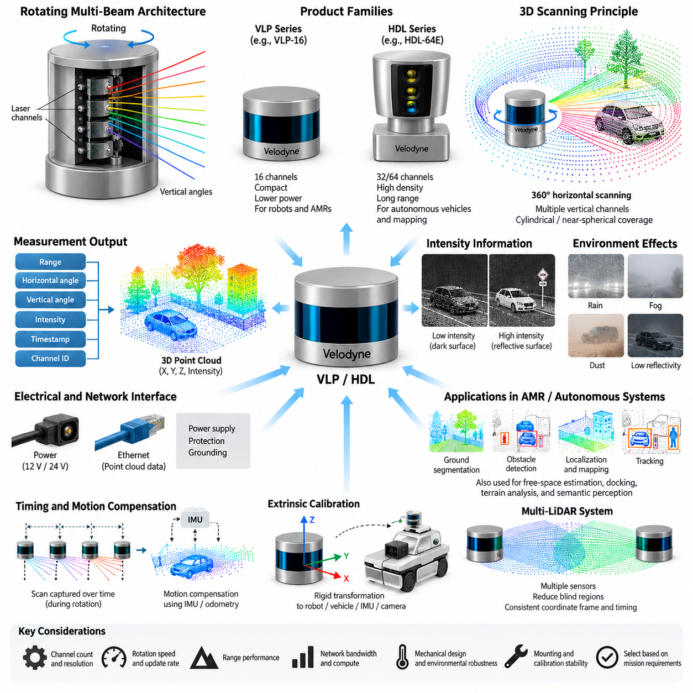
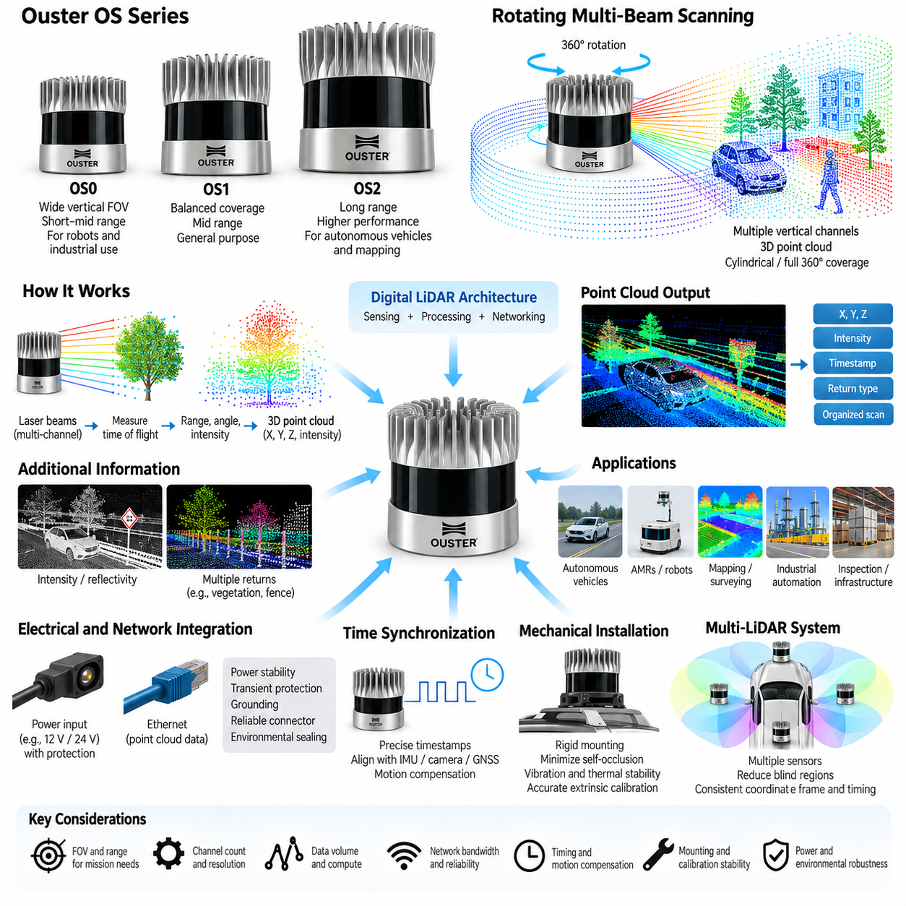
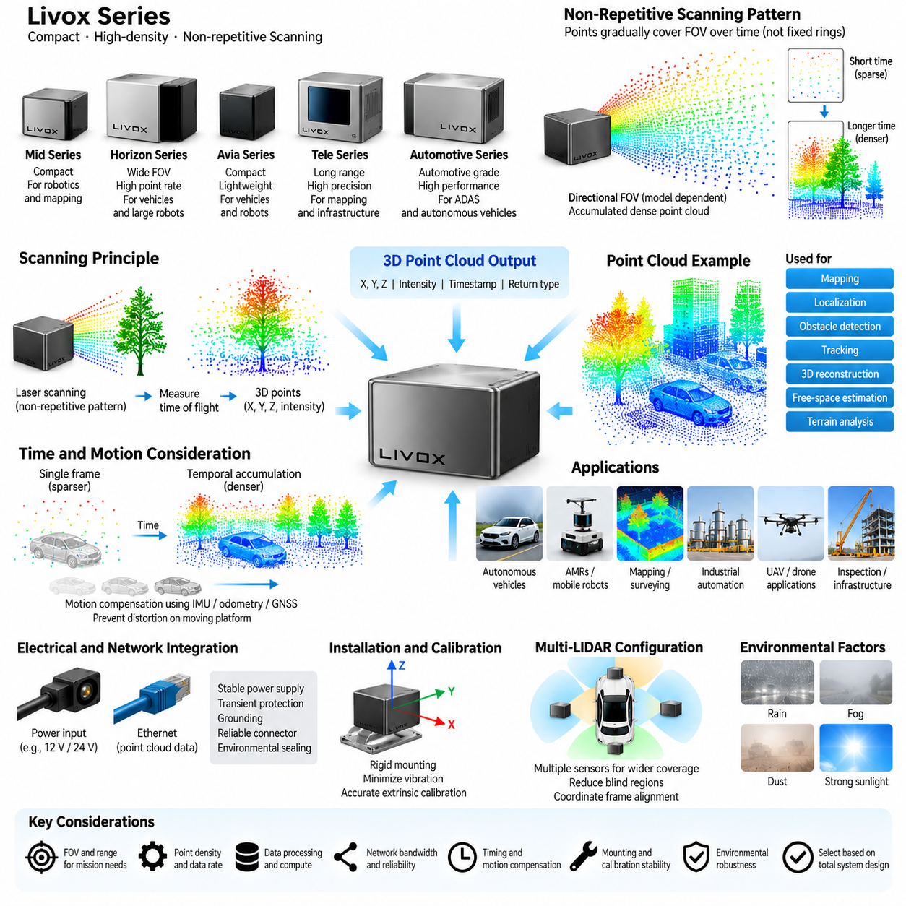
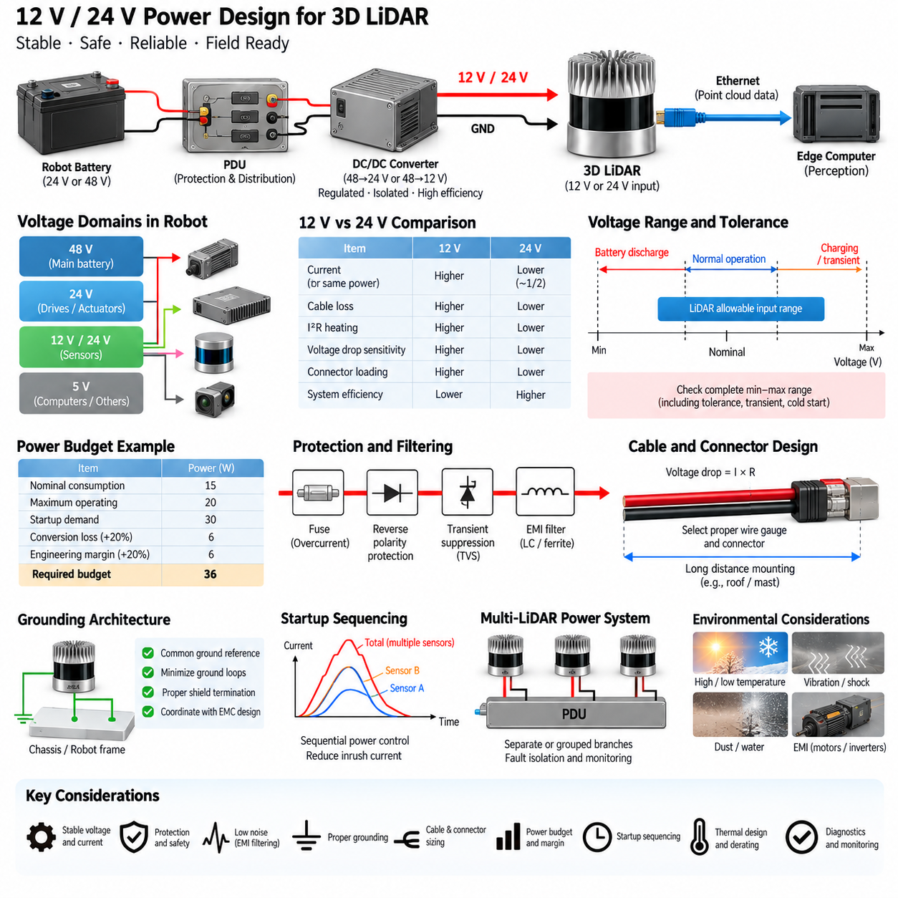
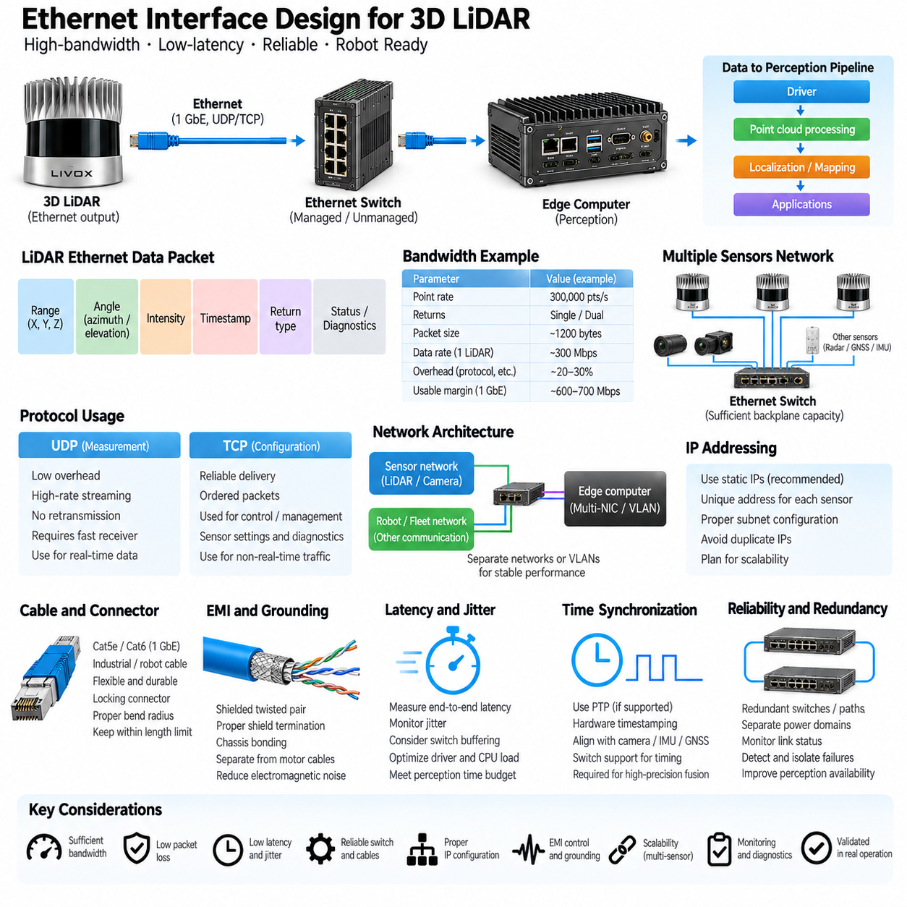

**Volume 15 Perception and Sensor Architecture**

# Chapter 05. 3D LiDAR

## 05.01. Velodyne VLP/HDL Series

{width="7.268055555555556in" height="7.268055555555556in"}

Velodyne's VLP and HDL product families represent one of the most influential generations of mechanically scanning three-dimensional LiDAR systems used in autonomous vehicles, mobile robots, mapping platforms, and early Physical AI perception systems. Within a perception architecture, these sensors provide geometrically accurate measurements of surrounding surfaces by repeatedly emitting laser pulses, measuring their time of flight, and converting the measurements into three-dimensional point clouds. Their rotating multi-beam architecture established many of the engineering principles that remain relevant to modern 3D LiDAR integration.

The fundamental architecture combines multiple vertically arranged laser channels with continuous azimuth scanning. Each channel observes a different vertical angle while rotation sweeps those channels around the sensor, producing a cylindrical or near-spherical representation of the environment. Every valid return can be expressed as range, horizontal angle, vertical angle, and reflected intensity, from which Cartesian coordinates are calculated. This organization differs fundamentally from 2D LiDAR because a single revolution generates measurements across both horizontal and vertical dimensions.

The HDL family established the classic high-channel-count rotating LiDAR architecture. Systems such as HDL-32E and HDL-64E used multiple fixed laser-detector pairs arranged to provide predefined vertical fields of view. Increasing the number of channels improves vertical sampling density and allows objects, road surfaces, vegetation, vehicles, and structural features to be represented by more measurement points. The HDL-64E became particularly important in early autonomous-driving research because its dense three-dimensional measurements supported localization, obstacle detection, mapping, and object perception.

The VLP family extended the rotating multi-beam concept toward smaller, lighter, and more practical platforms. The VLP-16, commonly known as Puck, became especially significant for robotics because sixteen laser channels could provide full 360-degree horizontal scanning in a compact package. Compared with larger HDL sensors, this reduced mechanical size, power demand, mass, and integration complexity. These characteristics made the VLP architecture suitable for AMRs, unmanned ground vehicles, research vehicles, mapping systems, and other platforms where installation volume and electrical power are constrained.

A key engineering characteristic of VLP and HDL sensors is the relationship between channel count and spatial resolution. More channels do not simply create a larger number of points; they reduce the vertical gaps between observations and increase the probability that relatively small or distant objects intersect several laser beams. A low-channel-count sensor may observe a pedestrian, curb, cable, branch, or low obstacle with only a few points, whereas a higher-density sensor can preserve more geometric structure for classification and tracking. Sensor selection must therefore consider the required perception task rather than channel count alone.

Horizontal sampling is produced by the rotational mechanism and depends on rotational speed, firing sequence, and data acquisition configuration. A slower rotation can provide greater angular sampling density per revolution, while faster rotation reduces the time required to refresh the surrounding scene. Robotics engineers must balance spatial density against temporal responsiveness. A mapping vehicle moving slowly may benefit from dense scans, whereas an outdoor autonomous robot operating around moving vehicles or pedestrians may prioritize faster scene updates to reduce effective perception latency.

Range performance is equally dependent on environmental and target characteristics. Maximum specified range should not be interpreted as a guaranteed detection distance for every object. Received optical energy varies with surface reflectivity, incidence angle, atmospheric attenuation, contamination of the optical window, and ambient illumination. Dark materials or surfaces viewed at shallow angles can generate weaker returns than highly reflective targets. Rain, fog, dust, and airborne particles may additionally create attenuation or unwanted returns, making practical outdoor performance different from laboratory specifications.

Intensity information provides another useful measurement dimension. In addition to geometric range, Velodyne sensors report a representation of returned optical strength that can assist with recognizing lane markings, reflective signs, retroreflectors, structural boundaries, and other surfaces having distinctive reflectance characteristics. Intensity values should nevertheless be treated carefully because they depend on range, target material, incidence geometry, sensor characteristics, and internal processing. They are valuable perception features but should not automatically be interpreted as calibrated material reflectivity.

From an electrical architecture perspective, a 3D LiDAR must be treated as both a precision optical instrument and a networked computing device. Stable supply voltage, appropriate current capacity, startup behavior, transient protection, grounding, shielding, connector integrity, and environmental sealing all influence system reliability. The rotating mechanism and internal electronics introduce operating conditions different from passive cameras or simple sensors. Power architecture should therefore include suitable protection and margin rather than sizing the circuit only from nominal steady-state consumption.

Velodyne VLP and HDL sensors commonly transfer point-cloud-related measurement packets over Ethernet, making network architecture a central part of integration. The host computer receives streams containing distance, intensity, channel, azimuth, and timing information and reconstructs organized measurements or Cartesian point clouds through the appropriate driver. Ethernet bandwidth, packet handling, receive-buffer configuration, processor scheduling, and driver efficiency can influence whether all measurements reach the perception pipeline without loss. A mechanically healthy LiDAR can still produce degraded perception if its network path is poorly engineered.

Timestamp integrity is particularly important when the robot moves during acquisition. A complete revolution is not captured at one instantaneous moment; measurements are generated sequentially while the sensor rotates. Consequently, translation, steering, pitch, roll, and vibration can distort the apparent geometry of a scan. Accurate timestamps allow software to compensate for platform motion using IMU, odometry, or localization information. This process, often called motion compensation or deskewing, becomes increasingly important for fast vehicles, rough-terrain robots, and high-precision mapping applications.

Extrinsic calibration defines the rigid transformation between the LiDAR coordinate frame and the robot, vehicle, IMU, camera, or other sensor frames. Small angular errors can create substantial positional discrepancies at long distance, so mechanical mounting accuracy and calibration stability are critical. A rigid bracket should control translation and orientation while resisting vibration, shock, thermal deformation, and accidental movement. Calibration must therefore be considered an electromechanical system property rather than a one-time software parameter entered during prototype development.

Multi-LiDAR systems require additional architectural discipline. Two or more VLP or HDL sensors may be installed to reduce blind regions, improve vertical coverage, observe front and rear zones independently, or provide redundancy. Their point clouds must share consistent coordinate frames and sufficiently accurate timing before fusion. Overlapping sensing regions can improve geometric confidence, but they also increase network traffic, compute demand, calibration complexity, and mounting constraints. Sensor placement should consequently be determined from coverage analysis and mission requirements rather than simply maximizing the number of LiDAR units.

For an AMR, the 3D LiDAR usually participates in several perception functions simultaneously. Ground segmentation distinguishes traversable surfaces from elevated structures, clustering identifies candidate obstacles, localization compares measured geometry with a previously constructed map, and tracking estimates the motion of surrounding objects. The same point cloud may also support free-space estimation, docking, terrain analysis, digital-twin registration, and semantic perception. This multifunctional role explains why LiDAR availability and calibration quality can influence several autonomous functions at the same time.

The VLP and HDL generations also illustrate important limitations of mechanical LiDAR. Rotating assemblies contain moving components, packaging height can complicate installation, optical windows require contamination management, and point density decreases as distance increases. Vertical sampling remains discrete rather than continuous, producing characteristic scan-line patterns. These limitations contributed to the development of higher-resolution mechanical sensors and later solid-state approaches, including MEMS, flash, and optical phased-array architectures. Nevertheless, the rotating Velodyne architecture remains an important reference model for understanding 3D perception engineering.

Selection between VLP- and HDL-class architectures should ultimately be driven by the operational design domain. Compact robots may prioritize size, mass, electrical consumption, and sufficient obstacle coverage, while large autonomous vehicles or mapping platforms may prioritize point density and long-range geometric representation. Engineers should evaluate detection distance, vertical field of view, angular resolution, update rate, environmental robustness, network load, compute requirements, calibration strategy, mounting position, and lifecycle support as one integrated system problem rather than selecting a sensor from a single headline specification.

Within the attached Volume 15 structure, this topic forms the entry point to Chapter 05 on 3D LiDAR and naturally precedes comparison with Ouster and Livox architectures, followed by dedicated treatment of 12 V/24 V power design and Ethernet interface engineering. Understanding the VLP/HDL architecture therefore establishes the mechanical scanning, point-cloud, timing, calibration, power, and networking concepts required for the subsequent engineering sections without duplicating their more detailed electrical-interface analysis.

## 05.02. Ouster OS Series

{width="7.268055555555556in" height="7.268055555555556in"}

Ouster's OS series represents a modern generation of digital spinning 3D LiDAR designed for robotics, autonomous vehicles, industrial automation, mapping, and infrastructure applications. Within the attached perception architecture, it follows the Velodyne VLP/HDL family as another major 3D LiDAR platform and precedes the Livox series, power design, and Ethernet interface topics. The OS architecture combines 360-degree scanning, multi-channel vertical sensing, digital signal processing, and network-based point-cloud delivery in a compact sensor package.

The OS family is commonly organized around models such as OS0, OS1, and OS2, which address different combinations of field of view, range, and spatial coverage. Rather than viewing these devices simply as different maximum-range products, their selection should be related to the geometry of the perception problem. Short-range robots may require broad vertical visibility around the platform, while autonomous vehicles and mapping systems may place greater importance on longer-distance observation and forward environmental structure.

A fundamental characteristic of the OS architecture is its rotating multi-beam scanning principle. Multiple vertically distributed sensing channels observe different elevation angles while the internal scanning mechanism sweeps them through a complete horizontal revolution. The resulting measurements form structured three-dimensional observations of surrounding surfaces. Each return contains geometric information that can be transformed into Cartesian coordinates and subsequently processed as an organized scan or conventional 3D point cloud by the host perception computer.

Channel configuration directly affects vertical sampling density and the amount of geometric detail available to downstream algorithms. Higher vertical resolution allows surfaces and objects to be represented by more measurement points, improving the visibility of features such as pedestrians, poles, curbs, vegetation, walls, vehicles, and irregular terrain. However, increasing measurement density also increases data volume and processing requirements. The appropriate configuration therefore depends on the relationship among detection requirements, computational capacity, network bandwidth, vehicle speed, and operating environment.

The OS0 configuration is particularly associated with wide vertical coverage and is therefore useful when nearby three-dimensional geometry must be observed over a large elevation range. Such coverage can be advantageous for mobile robots operating near buildings, loading areas, ramps, vegetation, machinery, or other structures that extend both above and below the nominal sensor horizon. A broad vertical field of view also reduces dependence on perfectly level installation when robots experience pitch changes caused by slopes, acceleration, braking, or uneven terrain.

The OS1 occupies a more general-purpose position within the family and can support autonomous robots, research vehicles, industrial platforms, and mapping applications requiring balanced coverage. Its role illustrates an important sensor-selection principle: the most useful LiDAR is not necessarily the device with the widest field of view or longest possible range. A balanced sensor can provide sufficient geometric density while remaining compatible with the platform's size, power, network, compute, and mounting constraints, producing a more efficient overall perception architecture.

The OS2 class emphasizes longer-range perception and is consequently more relevant when objects and environmental structures must be detected substantially ahead of the moving platform. Longer sensing distance can provide additional time for localization, trajectory planning, collision assessment, and vehicle control. Nevertheless, usable range depends strongly on target reflectivity, atmospheric conditions, incidence angle, optical cleanliness, and required detection confidence. Maximum specified range should therefore not be treated as the guaranteed operational range for every object or environment.

One distinguishing concept of the Ouster architecture is its digital approach to LiDAR sensing and signal processing. Digital integration enables large amounts of measurement information to be generated, organized, calibrated, and delivered through a standardized computational interface. For robotics engineers, this shifts part of the integration problem from purely optical and mechanical considerations toward data architecture. Sensor configuration, packet processing, timestamp handling, coordinate conversion, calibration metadata, driver implementation, and host-computer performance become essential elements of practical LiDAR performance.

The point cloud generated by an OS sensor provides three-dimensional geometry that can support several perception functions simultaneously. Ground segmentation can identify traversable surfaces, clustering can isolate potential obstacles, scan matching can contribute to localization, and mapping algorithms can construct persistent environmental representations. The same measurements can support object detection, tracking, terrain analysis, free-space estimation, docking, inspection, and digital-twin registration. Consequently, degradation of the LiDAR data stream can affect multiple autonomous functions rather than only one perception algorithm.

Ouster sensors can also provide additional measurement information associated with returned optical signals. Reflectivity-related and return-strength information can help distinguish environmental structures that have similar geometry but different optical characteristics. Road markings, signs, retroreflective materials, walls, vegetation, and dark surfaces may produce different return behavior. Such measurements can enrich perception pipelines, although they remain dependent on distance, surface properties, incidence geometry, environmental conditions, and internal sensor processing and should not be interpreted as direct material identification.

An important practical feature of modern 3D LiDAR is the ability to handle multiple returns or complex return conditions. A laser pulse may encounter vegetation, fencing, airborne particles, or partially transparent spatial structures before reaching a more distant surface. Representing more than one meaningful return can provide additional environmental information in these situations. The perception software must nevertheless determine which returns are relevant to navigation, obstacle detection, mapping, or environmental interpretation rather than treating every measured point with identical significance.

Ethernet connectivity is a fundamental part of OS-series system integration. High-density 3D measurements generate continuous network traffic between the LiDAR and the edge computer, so Ethernet configuration must be engineered as part of the perception system rather than treated as a simple cable connection. Packet rate, network bandwidth, receive buffers, switch capacity, operating-system networking behavior, driver efficiency, and CPU scheduling can influence data integrity. Packet loss or processing delays may create incomplete scans even when the optical sensor itself is functioning correctly.

Time synchronization is equally important because rotating LiDAR does not capture an entire 360-degree scene at one instant. Individual measurements are acquired sequentially while the sensor and robot may both be moving. Accurate timestamps allow LiDAR observations to be aligned with IMU, camera, GNSS, wheel odometry, and other measurements. Motion compensation can then reduce geometric distortion caused by vehicle translation and rotation during a scan, which becomes particularly important for outdoor AMRs, autonomous vehicles, mapping platforms, and robots operating over uneven terrain.

Mechanical installation determines whether the theoretical sensing performance can be preserved on the actual robot. The mounting location should provide the required horizontal and vertical visibility while minimizing self-occlusion from the vehicle body, payload, antennas, manipulators, or protective structures. The bracket must maintain stable orientation under vibration, shock, acceleration, and thermal variation. Since a small angular mounting error produces increasing positional displacement with distance, mechanical stiffness and extrinsic calibration stability are directly connected to long-range perception accuracy.

Electrical integration must similarly consider the LiDAR as a precision networked sensor rather than an isolated accessory. Power distribution should provide appropriate voltage stability, current margin, transient protection, grounding, connector retention, and environmental protection. Power disturbances can interrupt measurement streams or force sensor resets, while poor grounding or network installation can produce intermittent communication problems that are difficult to distinguish from software faults. Reliable perception therefore depends on coordinated power, mechanical, communication, and computing design.

For multi-LiDAR architectures, OS sensors can be positioned to improve coverage around large AMRs, autonomous vehicles, inspection platforms, or other machines with significant blind regions. Front, rear, side, or elevated sensors may provide complementary views, but their measurements must be transformed into a common coordinate frame and aligned in time. Adding sensors increases coverage and potentially redundancy, while simultaneously increasing Ethernet traffic, processing load, power consumption, calibration effort, and packaging complexity. Multi-LiDAR design should therefore begin with mission coverage analysis.

The Ouster OS series demonstrates the transition of 3D LiDAR from a standalone ranging instrument toward an integrated digital perception subsystem. Effective deployment requires coordinated consideration of field of view, channel density, range, scan rate, return characteristics, Ethernet throughput, timestamps, calibration, mounting, power, and computational resources. Within an AMR or Physical AI system, these factors determine not only point-cloud quality but also the reliability of localization, mapping, obstacle detection, tracking, terrain understanding, and autonomous decision-making.

Within the supplied Volume 15 organization, this section serves as the second technology-specific topic in Chapter 05_3D_LiDAR, following 05_01_Velodyne_VLP_HDL_Series and leading into 05_03_Livox_Series, 05_04_12V_24V_Power_Design, and 05_05_Ethernet_Interface_Design. This placement allows the OS series to be understood primarily from the sensor architecture and application perspective, while detailed electrical power and Ethernet engineering can be developed separately in the subsequent sections.

## 05.03. Livox Series

{width="7.268055555555556in" height="7.268055555555556in"}

Livox LiDAR represents a distinctive approach to three-dimensional perception that differs from conventional mechanically rotating multi-beam sensors. Within the 3D LiDAR chapter, the Livox series provides an important architectural alternative to the Velodyne VLP/HDL and Ouster OS families. Livox sensors combine compact optical-mechanical scanning, high-density point generation, Ethernet-based data communication, and relatively flexible installation characteristics for robotics, autonomous vehicles, mapping, and industrial perception applications.

A defining characteristic of many Livox products is the use of non-repetitive or specialized scanning patterns rather than conventional horizontal rings produced by continuously rotating multi-channel LiDAR. Laser measurements progressively cover the sensor field of view as acquisition time increases. Consequently, the spatial distribution of points changes with observation duration, allowing a relatively compact optical architecture to accumulate dense geometric information without requiring the traditional large rotating sensor structure.

This scanning principle creates an important relationship between integration time and point-cloud density. During a short observation interval, the sensor provides a relatively sparse representation of the environment, while continued scanning fills additional portions of the field of view. Static mapping and slowly changing scenes can therefore benefit from accumulated measurements. Dynamic robotics applications require more careful consideration because perception algorithms must operate on data collected within a limited time window rather than assuming that long-term accumulated density represents instantaneous scene resolution.

Livox has developed several sensor families addressing different perception requirements, including compact units intended for robotics and mapping as well as automotive-oriented products designed for vehicle integration. Models such as Mid-series devices became widely recognized for their compact architecture and characteristic scanning behavior, while later products such as Horizon, Avia, Tele-series, and automotive-oriented units extended the design toward different fields of view, ranges, point rates, and application domains. Product selection should therefore begin from mission geometry rather than model naming alone.

Field of view is especially important when integrating Livox sensors because many configurations do not provide the same native 360-degree horizontal coverage associated with spinning Velodyne or Ouster architectures. A directional field of view can be advantageous when the perception task is concentrated in front of a vehicle, around a manipulator, or toward a specific inspection region. Conversely, an AMR requiring complete surrounding awareness may need multiple sensors, complementary 2D LiDAR, cameras, radar, or another 360-degree sensing device to eliminate blind regions.

The point cloud generated by a Livox sensor provides three-dimensional position information from measured range and beam direction, together with additional measurement attributes depending on the device and operating mode. These points can be transformed into the robot coordinate frame and processed by conventional perception pipelines. Ground segmentation, obstacle extraction, clustering, localization, mapping, object detection, free-space estimation, terrain analysis, and three-dimensional reconstruction can therefore use Livox measurements in much the same functional manner as other LiDAR point clouds.

The non-repetitive scanning characteristic, however, influences algorithm design. Algorithms developed around organized ring structures from conventional rotating LiDAR may assume fixed channel indices, predictable elevation angles, or regular azimuth progression. Livox data can require different preprocessing or spatial organization because the sampling pattern does not necessarily follow those assumptions. Voxelization, spatial indexing, temporal accumulation, motion compensation, and learning-based point-cloud processing can provide more sensor-independent representations for downstream perception.

Temporal accumulation must be carefully controlled on a moving platform. Combining measurements over a longer interval increases spatial density, but the robot and surrounding objects may move during that interval. Without compensation, accumulated points from a wall, vehicle, pedestrian, or terrain feature may appear geometrically distorted or duplicated. Accurate timestamps combined with IMU, wheel odometry, GNSS, or localization estimates allow measurements to be transformed according to platform motion before they are combined into a common spatial representation.

This timing requirement becomes especially important for outdoor AMRs and autonomous vehicles operating at higher speed. The perception system must distinguish between measurement density obtained through temporal accumulation and true instantaneous spatial resolution. A dense map constructed from several successive measurements may be excellent for localization or environmental reconstruction while being inappropriate for immediate collision avoidance if moving objects have changed position. Different software functions may therefore use different accumulation windows from the same LiDAR stream.

Reflectivity or return-intensity information provides another dimension for environmental interpretation. Surface material, distance, incidence angle, atmospheric conditions, and sensor processing influence the returned optical signal. Reflective signs, road markings, structural surfaces, vegetation, dark objects, and metallic infrastructure can therefore exhibit different response characteristics. Such information may supplement geometric perception, but intensity should not be interpreted as an absolute material property without considering sensor-specific calibration and environmental effects.

Environmental performance must also be evaluated according to the intended operational design domain. Rain, fog, dust, snow, direct sunlight, contamination, and low-reflectivity surfaces can influence optical ranging performance. Water droplets or airborne particles may generate unwanted returns, while contamination on the optical window can attenuate transmitted and received light. Outdoor robot design should therefore combine sensor capability with appropriate mounting, protective structures, cleaning strategy, diagnostics, and perception-level filtering rather than relying solely on nominal range specifications.

From an electrical architecture perspective, Livox LiDAR should be integrated as a precision networked sensor. Stable power, adequate current capacity, transient protection, grounding, connector reliability, and environmental sealing are necessary for dependable operation. The power distribution system should consider startup behavior and operating margin in addition to nominal consumption. Intermittent voltage disturbances can reset the sensor or interrupt data communication, creating perception faults that may initially appear to originate from networking or software.

Ethernet provides the principal high-bandwidth connection between many Livox sensors and the perception computer. Point measurements, timestamps, status information, and related sensor data must be transported continuously without excessive packet loss or latency. Network switches, cable quality, connector design, receive buffers, operating-system configuration, CPU load, and driver implementation can all affect data integrity. For multi-sensor robots, LiDAR traffic should be included in the complete Ethernet bandwidth budget together with cameras, radar, control computers, and other networked devices.

Time synchronization is critical for sensor fusion. LiDAR measurements must be aligned with camera frames, IMU samples, GNSS observations, wheel odometry, and other perception inputs before accurate geometric fusion can occur. Even a precisely calibrated sensor pair can produce spatial disagreement when their measurements correspond to different physical times. Timestamp architecture, synchronization sources, trigger relationships, and software handling should therefore be designed together with the sensor network rather than added only after perception algorithms are implemented.

Extrinsic calibration defines the geometric relationship between the Livox sensor and the robot base, vehicle frame, camera, IMU, or other reference coordinate systems. Because angular errors produce increasingly large positional errors at distance, the mounting bracket must remain mechanically stable under vibration, shock, thermal expansion, and repeated operation. Calibration quality is consequently linked directly to mechanical engineering. A sensor that shifts slightly after field operation can degrade mapping and fusion even when its internal ranging performance remains unchanged.

Directional Livox sensors can be combined into multi-LiDAR configurations when wider coverage is required. Sensors may be oriented toward the front, sides, rear, ground, or specific inspection regions depending on the mission. Overlapping fields of view can reduce blind zones and improve geometric confidence, but every additional sensor increases power consumption, Ethernet traffic, compute demand, mounting complexity, and calibration effort. Coverage simulation should therefore precede physical installation so that each LiDAR contributes a clearly defined perception benefit.

Livox architectures can be particularly attractive for AMRs, unmanned ground vehicles, mapping systems, inspection robots, and other Physical AI platforms where compact packaging and directional high-density sensing are valuable. Their different sampling behavior also demonstrates why 3D LiDAR should not be evaluated only through channel count. Field of view, point rate, scan pattern, accumulation behavior, range, timing accuracy, motion sensitivity, interface architecture, environmental robustness, and algorithm compatibility together determine effective perception performance.

Within the supplied Volume 15 structure, 05_03_Livox_Series completes the sequence of major 3D LiDAR technology families following 05_01_Velodyne_VLP_HDL_Series and 05_02_Ouster_OS_Series. It is followed by 05_04_12V_24V_Power_Design and 05_05_Ethernet_Interface_Design, which separate sensor-family characteristics from detailed electrical integration. This organization establishes the sensor-level foundation before examining how 3D LiDAR devices are powered, protected, networked, synchronized, and integrated into a complete robotic perception architecture.

## 05.04. 12V/24V Power Design

{width="7.268055555555556in" height="7.268055555555556in"}

The 12 V and 24 V power design for 3D LiDAR is a critical part of the perception and sensor architecture because measurement reliability depends directly on electrical power quality. A LiDAR should not be treated as a simple low-power accessory connected arbitrarily to the robot battery. Its supply path must be engineered to provide stable voltage, adequate current, protection, grounding, filtering, and predictable startup behavior under all operating conditions.

Many robotic platforms contain several voltage domains because batteries, motor drives, computers, sensors, and communication devices have different electrical requirements. A mobile robot may use a 24 V or 48 V main battery while individual sensors require 12 V or 24 V inputs. In such systems, regulated DC/DC converters create the sensor power rails. The converter must maintain the LiDAR input voltage within the permitted operating range despite battery state-of-charge changes and load transients.

The choice between 12 V and 24 V distribution affects current, cable loss, connector loading, converter architecture, and overall system efficiency. For the same electrical power, a 24 V supply requires approximately half the current of a 12 V supply. Lower current reduces resistive voltage drop and I²R heating in the harness, which becomes increasingly important when the LiDAR is mounted far from the power distribution unit or when several sensors share a common distribution branch.

Voltage compatibility must always be verified from the specific LiDAR electrical specification rather than inferred from a product family or connector appearance. Some sensors support relatively wide input ranges, while others require more restricted operating conditions. Nominal system voltage alone is insufficient because the actual rail can experience charging voltage, converter tolerance, transient overshoot, cold-start behavior, and battery discharge. The complete minimum-to-maximum voltage envelope should therefore be compared with the sensor's allowable input range.

Power budgeting should include nominal consumption, maximum operating consumption, startup demand, conversion losses, and engineering margin. A LiDAR containing optical emitters, signal-processing electronics, networking circuitry, heaters, or mechanical scanning components may not behave as a constant resistive load. Designing only around an average wattage value can produce unstable startup or unexpected voltage sag. The power branch should instead be sized according to credible worst-case operating conditions.

DC/DC converter selection is particularly important when the robot battery voltage differs substantially from the required LiDAR voltage. A 48 V battery platform, for example, may require a regulated 48-to-24 V or 48-to-12 V conversion stage. Converter continuous rating, peak capability, efficiency, thermal derating, input range, output regulation, isolation requirements, electromagnetic compatibility, and fault behavior should all be evaluated as part of the perception power architecture rather than independently.

Voltage drop through the wiring harness must be included in the design calculation. Cable resistance, connector contact resistance, fuse resistance, switching elements, and distribution paths all contribute to the difference between PDU output voltage and the voltage actually reaching the LiDAR. Because current increases when equivalent power is distributed at lower voltage, a 12 V architecture is generally more sensitive to harness voltage drop than a comparable 24 V architecture.

Wire gauge should therefore be selected from both current-carrying capacity and allowable voltage drop. A conductor that is thermally capable of carrying the LiDAR current may still produce excessive voltage loss over a long cable run. Outdoor AMRs and autonomous vehicles often mount LiDAR sensors on roofs, masts, corners, or elevated structures, increasing harness length. Cable length, conductor cross-section, connector resistance, temperature, and expected current must consequently be evaluated together.

Circuit protection should isolate a LiDAR power fault without unnecessarily disabling unrelated perception devices. Individual or logically grouped sensor branches can be protected using appropriately selected fuses, electronic protection devices, or protected PDU channels. The protection rating must tolerate normal startup and operating current while interrupting abnormal overload or short-circuit conditions. Oversized protection may fail to protect wiring, whereas undersized protection can produce nuisance trips and intermittent sensor loss.

Reverse-polarity protection is valuable where installation, maintenance, or field replacement creates a realistic possibility of incorrect connection. Depending on system requirements, this protection may use a diode, MOSFET-based circuit, protected power switch, or an upstream intelligent PDU. The protection method should minimize unnecessary voltage drop and thermal loss while ensuring that accidental polarity reversal does not damage an expensive LiDAR or propagate a fault into the vehicle electrical system.

Transient protection is particularly important on mobile robotic platforms containing motors, contactors, relays, pumps, actuators, and switching converters. Rapid load changes and inductive switching can generate disturbances on shared power rails. Appropriate transient-voltage suppression, filtering, converter design, and distribution separation can prevent these events from resetting or damaging the LiDAR. Protection components should be selected from the actual expected electrical environment rather than added generically.

Power filtering must also consider electromagnetic interference generated by traction inverters, motor drivers, DC/DC converters, switching power supplies, and high-current wiring. Conducted noise can enter the LiDAR through its supply or ground connection and may also affect Ethernet communication. Input capacitors, common-mode filtering, ferrites, cable routing, shielding, and proper grounding can reduce interference, but filtering should be engineered without creating unstable interactions with the upstream converter.

Grounding architecture determines the electrical reference shared among the LiDAR, power system, chassis, Ethernet interface, and edge computer. Poor grounding can produce ground loops, common-mode noise, communication instability, or unexpected current paths through cable shields. Sensor power return should follow a deliberate architecture rather than relying on mechanical chassis connections. Shield termination and chassis bonding should be coordinated with the complete robot electromagnetic compatibility strategy.

Power and Ethernet paths should also be considered together during harness design. A 3D LiDAR normally requires both a power connection and a high-bandwidth communication path, and these cables often travel through the same robot structure. Routing near motor phase cables, inverter outputs, contactors, or high-current battery conductors can expose the sensor interface to electromagnetic noise. Physical separation, controlled crossing geometry, shielding, and connector placement help preserve both power integrity and communication reliability.

Startup sequencing becomes important when several LiDAR sensors, cameras, edge computers, and network switches are powered simultaneously. The combined inrush or startup demand can temporarily overload a DC/DC converter even when steady-state consumption is well below its rating. Sequential power control through an intelligent PDU can distribute startup loads over time. It can also allow the system controller to reset an individual LiDAR remotely without cycling power to the entire perception subsystem.

Diagnostics should make the sensor power network observable rather than treating power as an invisible infrastructure layer. Voltage, current, converter status, fuse condition, PDU channel state, temperature, and reset events can provide valuable information for fault isolation. If a LiDAR disappears from the Ethernet network, diagnostic software should be able to distinguish loss of power from network failure, sensor malfunction, or host-computer problems. This greatly reduces troubleshooting time in field-deployed robots.

Thermal design is closely connected to power conversion. DC/DC converters, protection devices, connectors, and wiring dissipate heat according to load and efficiency. Components located inside sealed outdoor enclosures can experience significantly higher temperatures than the surrounding air. Converter and protection ratings should therefore be evaluated using realistic enclosure temperatures and thermal derating. Adequate electrical margin at room temperature does not guarantee reliable operation during prolonged outdoor deployment.

A robust 12 V or 24 V LiDAR branch can therefore be viewed as a complete energy-delivery chain consisting of the source battery, PDU, protection stage, DC/DC conversion, filtering, harness, connectors, grounding, and the sensor itself. Reliability depends on the weakest element in this chain. Power design should be validated under startup, maximum load, low battery, charging, motor switching, thermal stress, vibration, and fault conditions rather than only through stationary laboratory operation.

For multi-LiDAR robots, power architecture should scale systematically instead of duplicating an individual sensor circuit without analysis. Total continuous power, simultaneous startup current, converter capacity, PDU channel loading, fuse coordination, harness routing, and thermal dissipation must be recalculated for the complete sensor suite. Separate branches can improve fault isolation and serviceability, while centralized monitoring enables the autonomous controller to detect and respond to individual sensor power failures.

Within the supplied Volume 15 structure, 05_04_12V_24V_Power_Design follows the Velodyne, Ouster, and Livox sensor-family sections and precedes 05_05_Ethernet_Interface_Design. This organization separates sensor technology from the common electrical infrastructure required to operate 3D LiDAR reliably, establishing power integrity as a foundation for the subsequent communication architecture and for dependable perception in AMRs, autonomous vehicles, and Physical AI systems.

## 05.05. Ethernet Interface Design

{width="7.268055555555556in" height="7.268055555555556in"}

Ethernet interface design is a fundamental part of 3D LiDAR integration because modern sensors continuously generate high-rate point-cloud data that must reach the perception computer with predictable latency and minimal loss. Within the 3D LiDAR architecture, Ethernet connects the sensing hardware to edge computing and therefore forms the primary data path for measurements, timestamps, configuration commands, diagnostics, and synchronization-related information.

A typical LiDAR Ethernet path consists of the sensor network interface, cable and connectors, an optional Ethernet switch, and the network interface controller of the edge computer. The physical connection alone does not guarantee reliable operation. Link speed, packet rate, protocol behavior, switch capacity, buffering, operating-system configuration, and application processing must work together so that the complete data stream can be received continuously under realistic robot operating conditions.

Three-dimensional LiDAR commonly transfers measurements as Ethernet packets containing range-related data, angular information, intensity or reflectivity information, timestamps, return information, and sensor status. A host driver interprets these packets and reconstructs point clouds in the required coordinate representation. Packet processing is therefore part of the perception pipeline itself. Missing, delayed, reordered, or incorrectly timestamped packets can directly reduce geometric completeness and sensor-fusion accuracy.

Bandwidth design should begin with the actual output configuration of each LiDAR rather than the nominal Ethernet link speed alone. Point rate, number of returns, measurement fields, packet overhead, scan frequency, and diagnostic traffic determine the effective data rate. A 1 GbE interface may provide substantial theoretical capacity, but usable system margin is lower after protocol overhead and traffic from other devices are considered. Network utilization should therefore be calculated for normal and worst-case operating modes.

Multiple sensors can rapidly increase aggregate bandwidth requirements. A robot may contain several 3D LiDARs together with high-resolution cameras, radar, GNSS, IMU, and other Ethernet devices. If these streams share one switch or uplink, the architecture must consider simultaneous traffic rather than evaluating each sensor independently. Oversubscribed uplinks or insufficient switch backplane capacity can create packet loss even though every individual sensor-to-switch connection operates at its expected link speed.

Dedicated sensor networks are often advantageous for perception-intensive robots. Separating high-bandwidth LiDAR and camera traffic from fleet communication, diagnostics, remote access, and general computing traffic reduces unpredictable interference. The edge computer may use multiple network interfaces or virtual network segmentation to maintain controlled traffic domains. The objective is not merely connectivity but deterministic enough behavior that perception performance remains stable when other robot communication activities increase.

UDP is frequently used for high-rate LiDAR measurement delivery because it introduces relatively little transport overhead and does not pause the stream while waiting for retransmission. This characteristic is appropriate for real-time sensing, but it places responsibility on the receiving system to process packets quickly enough. Lost UDP packets are normally not recovered automatically. Adequate receive buffers, efficient drivers, appropriate socket configuration, and sufficient CPU resources are therefore essential.

TCP may be used for configuration, management, or other transactions where reliable ordered delivery is more important than continuous real-time streaming. The distinction between measurement traffic and control traffic is architecturally useful. High-rate sensor data benefits from low-latency streaming behavior, while configuration commands require correctness and reliable completion. Engineers should understand which protocols a particular LiDAR uses rather than assuming that all communication on an Ethernet connector behaves identically.

IP addressing should be planned systematically, especially when multiple LiDAR sensors are installed. Static addresses are often convenient for embedded robotic systems because sensor identities and network routes remain predictable after startup. Each device must have a unique address within the intended subnet, and the host interface must be configured compatibly. Duplicate addresses, incorrect subnet masks, or unexpected DHCP behavior can create intermittent faults that may initially appear to be sensor failures.

Ethernet switch selection should consider more than the number of available ports. Required link speeds, aggregate switching capacity, forwarding performance, buffering, environmental temperature, input voltage, power consumption, mechanical robustness, electromagnetic compatibility, and management capabilities all affect suitability for robotics. An office-grade switch may operate successfully during laboratory development yet become unreliable under vibration, thermal stress, electrical noise, or sustained high-rate sensor traffic in a deployed AMR.

Managed switches can provide valuable observability and control in complex perception networks. Port statistics, packet error counters, link-state information, VLAN configuration, traffic prioritization, multicast handling, and diagnostic functions help identify communication problems. These capabilities are particularly useful when several sensors share network infrastructure. Network diagnostics can distinguish a failing cable or congested port from a LiDAR, driver, or perception-software problem and significantly reduce field troubleshooting time.

Cable selection and routing strongly influence physical-layer reliability. The cable must support the required Ethernet category and data rate while also tolerating robot motion, vibration, bending, temperature, moisture, and mechanical abrasion. Industrial or robotic cables may require flexible conductors, durable jackets, shielding, and locking connectors. Cable length must remain within the limits of the selected Ethernet physical layer, while unnecessary excess length should be avoided in compact robot harnesses.

Shielding and grounding must be designed together rather than independently. Ethernet uses differential signaling that provides substantial noise immunity, but strong electromagnetic interference from motor drives, inverters, DC/DC converters, contactors, and high-current wiring can still degrade communication. Shielded twisted-pair cable, correct shield termination, chassis bonding, physical separation, and appropriate connector construction help control common-mode interference without creating undesirable ground-current paths.

Power and Ethernet cables often follow similar routes between an elevated LiDAR and the robot body. Harness layout should maintain suitable separation from motor phase conductors and other high-noise circuits. Where crossings are unavoidable, controlled crossing geometry can reduce coupling. Routing, clamping, bend radius, strain relief, connector orientation, and service loops should be considered during mechanical design because communication reliability depends on the complete physical installation rather than the Ethernet electronics alone.

Packet loss should be treated as a measurable engineering parameter. A perception system may continue operating despite occasional missing packets, making communication degradation difficult to notice visually. Monitoring packet sequence information, interface error counters, dropped-packet statistics, point counts, and scan completeness can reveal developing faults. Diagnostic thresholds can then identify abnormal degradation before the LiDAR data becomes unusable for localization, mapping, or obstacle detection.

Latency and jitter are equally important because sensor data must arrive within the time budget of the perception pipeline. Network transmission delay is usually only one component of total latency; switch buffering, kernel networking, driver execution, CPU scheduling, point-cloud conversion, and application queues also contribute. A high-bandwidth link can therefore still exhibit poor real-time behavior. End-to-end latency should be measured from sensor acquisition through availability of processed data to the perception application.

Time synchronization interacts directly with Ethernet architecture. LiDAR measurements are generated over time rather than captured as a single instantaneous 3D frame, so accurate timestamps are required for alignment with cameras, IMU, GNSS, and odometry. Network-based synchronization such as Precision Time Protocol can distribute a common time reference when supported by the system. Hardware timestamping can further reduce uncertainty introduced by software and operating-system scheduling.

The Ethernet switch can become an important component of synchronization accuracy when Precision Time Protocol is used. Switches supporting appropriate timestamping or timing-aware functions can preserve higher-quality synchronization across the network, whereas uncontrolled network delays may reduce timing precision. The required architecture depends on the robot's motion speed, sensor-fusion accuracy, and perception latency requirements. High-precision mapping and fast autonomous platforms generally require tighter timing control.

Redundancy may be introduced when perception availability requirements justify additional network complexity. Multiple network interfaces, separate switches, independent power domains, or alternative communication paths can prevent a single network component from disabling all perception sensors. However, redundancy must be designed with clear failure assumptions because duplicated hardware alone does not guarantee fault tolerance. Common power, grounding, software, or physical routing can still create shared failure modes.

A robust LiDAR Ethernet architecture should therefore be validated under sustained maximum sensor traffic, simultaneous multi-sensor operation, CPU loading, startup and reconnection events, cable disturbances, electromagnetic noise, temperature variation, and extended operation. Validation should measure bandwidth, packet loss, latency, jitter, link stability, and synchronization behavior. This converts Ethernet from an assumed communication utility into a verified part of the perception system.

Within the supplied Volume 15 structure, 05_05_Ethernet_Interface_Design completes Chapter 05_3D_LiDAR after the Velodyne, Ouster, Livox, and 12V/24V power-design sections. Together, these sections connect sensor technology with the electrical and communication infrastructure required for deployment, establishing a complete foundation for reliable 3D LiDAR integration in AMRs, autonomous vehicles, inspection robots, and Physical AI platforms.
