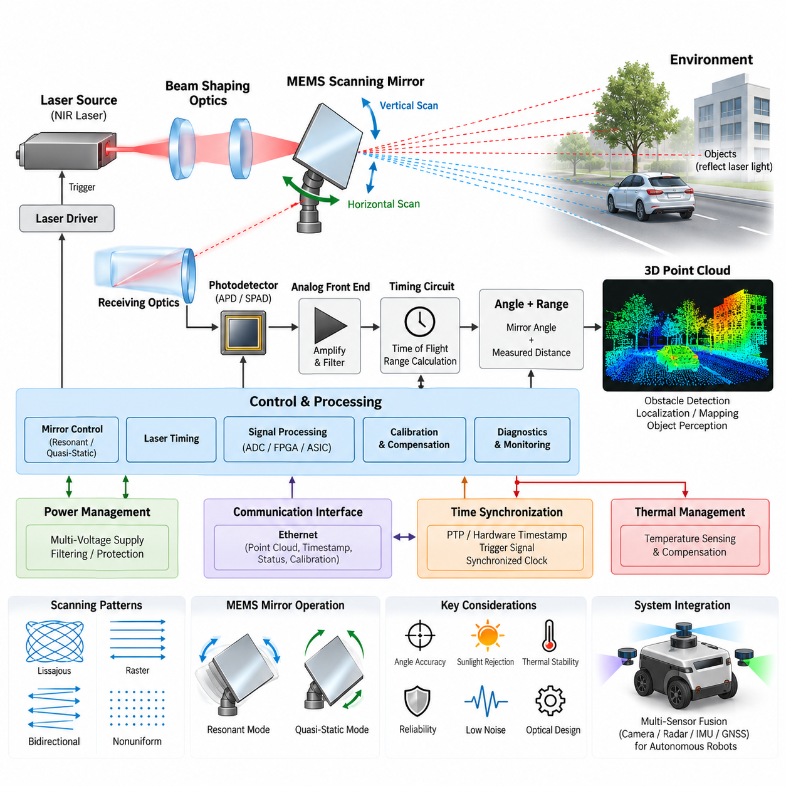
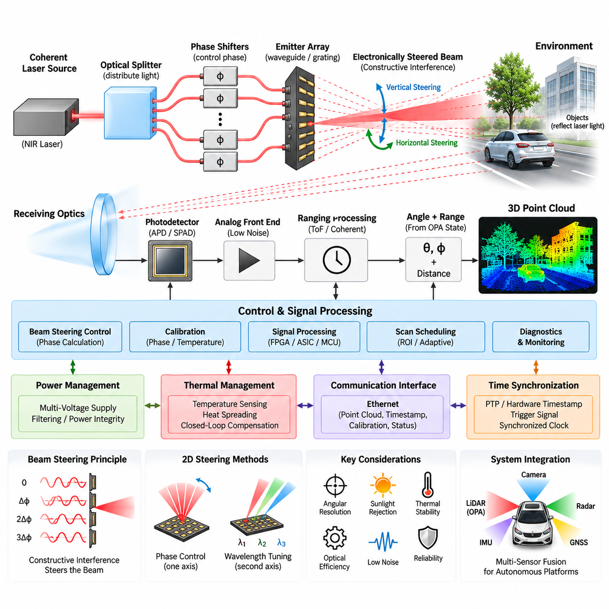
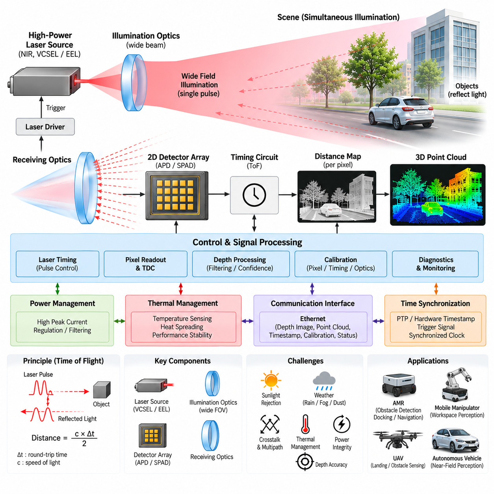
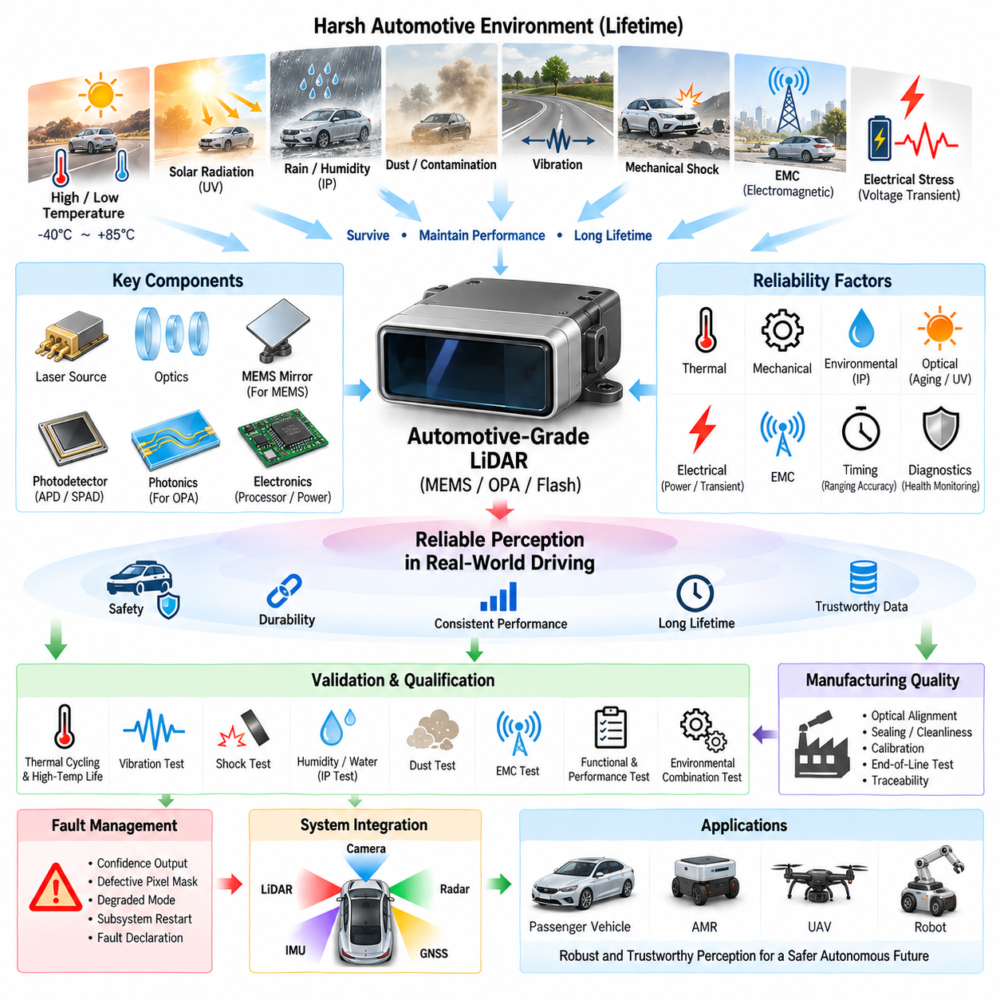
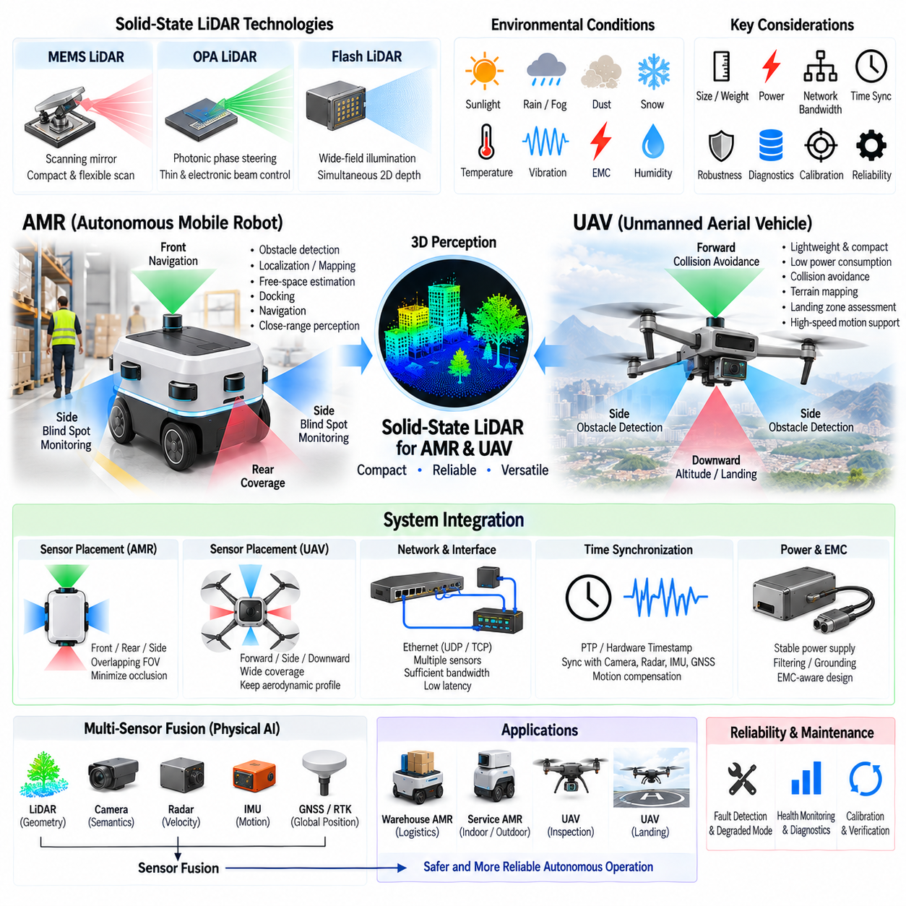

**Volume 15 Perception and Sensor Architecture**

# Chapter 06. Solid State LiDAR

## 06.01. MEMS LiDAR Architecture

{width="7.268055555555556in" height="7.268055555555556in"}

MEMS LiDAR uses a micro-electromechanical system scanning mirror to steer laser energy across a scene without relying on the large rotating assemblies found in conventional mechanical 3D LiDAR. Within the solid-state LiDAR family, this architecture occupies an intermediate position: the optical beam is still physically redirected, but the moving element is microscopic and integrated into a compact package. This enables smaller dimensions, lower mass, reduced mechanical complexity, and flexible field-of-view design for robotics and autonomous platforms.

A typical MEMS LiDAR architecture begins with a laser transmitter, commonly using near-infrared semiconductor emitters, followed by beam-shaping optics and a MEMS scanning mirror. The mirror changes its angular orientation under electrostatic, electromagnetic, piezoelectric, or thermal actuation. By coordinating mirror motion with laser pulse timing, the system projects optical energy toward known horizontal and vertical directions and progressively constructs a spatial sampling pattern across the required field of view.

The transmitted laser pulse propagates through the environment and is partially reflected by objects back toward the sensor. Receiving optics collect this weak return energy and focus it onto a photodetector such as an avalanche photodiode, single-photon avalanche diode, or another high-sensitivity detector structure. Receiver electronics amplify and condition the signal before timing circuitry estimates the propagation delay between transmission and reception, allowing range to be calculated from the measured time of flight.

Three-dimensional coordinates are generated by combining measured distance with the instantaneous angular state of the MEMS mirror. Each valid return therefore contains range and directional information that can be transformed into Cartesian coordinates. Repeating this process over thousands or millions of angular positions produces a point cloud representing surrounding surfaces. The resulting spatial data can support obstacle detection, localization, mapping, free-space estimation, object perception, and autonomous navigation.

MEMS scanning may operate in resonant or quasi-static modes. Resonant scanning drives the mirror close to its mechanical resonance and can achieve high angular velocity with relatively low actuation energy, while quasi-static operation provides greater freedom in selecting instantaneous scan positions. Some architectures combine resonant motion on one axis with controlled motion on another. The selected approach influences frame rate, field of view, point distribution, optical efficiency, control complexity, and susceptibility to mechanical variation.

Unlike rotating multi-channel LiDAR, MEMS LiDAR does not necessarily generate uniformly spaced scan lines. Lissajous trajectories, raster patterns, bidirectional sweeps, or application-specific nonuniform patterns may be used. This creates an important architectural advantage: sensing density can potentially be concentrated in regions that matter most to the autonomous system. A forward-driving robot, for example, may allocate greater angular resolution to the central region while maintaining lower-density coverage toward peripheral areas.

The MEMS mirror is only one element of the complete sensing architecture. Laser driver electronics must generate accurately timed optical pulses, while mirror-control electronics must maintain predictable angular trajectories. Receiver circuits require high gain and low noise because reflected optical power can be extremely small. Timing logic, analog-to-digital conversion, FPGA or ASIC processing, temperature monitoring, diagnostics, communication interfaces, and power regulation must operate as a tightly synchronized electrical and optical system.

Mirror position accuracy is particularly important because angular error becomes increasing spatial error as target distance grows. The controller therefore requires a reliable relationship between commanded actuation and actual beam direction. Manufacturing tolerances, package stress, temperature, aging, vibration, and actuator nonlinearities can alter this relationship. Calibration tables, position sensing, closed-loop control, or temperature compensation may consequently be incorporated to maintain the angular accuracy required by perception and localization algorithms.

Optical design must simultaneously consider transmitter divergence, receiver aperture, detector sensitivity, scan angle, wavelength, eye safety, and environmental interference. A narrow beam can improve angular selectivity but places stronger requirements on alignment and mirror accuracy. A larger receiving aperture improves return collection but increases package constraints. The optical path must also minimize internal reflections and stray light that could create false returns, saturation, or reduced sensitivity to low-reflectivity objects.

Sunlight is a major challenge for outdoor MEMS LiDAR because solar radiation introduces substantial background optical energy into the receiver. Narrow optical filters, controlled receiver bandwidth, coded or precisely timed emissions, signal thresholding, and digital filtering can improve rejection of unwanted energy. Rain, fog, dust, snow, wet surfaces, and highly reflective materials can further modify return characteristics, requiring the perception system to distinguish physically meaningful targets from noise, multipath effects, and atmospheric scattering.

Thermal behavior directly influences MEMS LiDAR performance. Laser output, detector sensitivity, analog gain, oscillator characteristics, and MEMS mechanical resonance may all vary with temperature. Compact packaging also concentrates heat generated by laser drivers, processing electronics, communication devices, and voltage regulators. Temperature sensing and compensation should therefore be considered part of the measurement architecture rather than only a protective function, especially when consistent range and angular performance are required over wide operating conditions.

From an electrical architecture perspective, MEMS LiDAR generally requires multiple internal voltage domains derived from the robot or vehicle supply. Sensitive analog receiver circuits should be protected from switching noise generated by DC/DC converters, processors, and laser drivers. Grounding, filtering, shielding, PCB partitioning, and controlled return-current paths are therefore essential. Power sequencing and transient protection also become important when the sensor is connected to mobile robotic platforms containing motors, inverters, relays, and other electrically noisy loads.

The communication interface transfers point clouds, timestamps, status information, calibration data, and diagnostic messages to the perception computer. Ethernet is particularly suitable when high point rates and rich metadata must be transmitted continuously. The interface architecture must account not only for nominal bandwidth but also for packet latency, buffering, timestamp accuracy, synchronization, and data loss. These properties become critical when MEMS LiDAR information is fused with cameras, radar, IMU, or GNSS measurements.

Time synchronization determines whether a geometrically accurate LiDAR measurement can be associated with the correct robot pose. During vehicle motion, even a small timestamp error can transform into noticeable spatial displacement. Hardware timestamping, Precision Time Protocol, trigger signals, or synchronized clocks may therefore be incorporated into the sensor network. Because a MEMS frame is acquired over a finite scanning interval rather than at one instantaneous moment, downstream processing may additionally compensate for motion during the scan.

Reliability assessment differs from conventional rotating LiDAR because the macroscopic bearing and motor assembly is eliminated, but mechanical behavior has not disappeared entirely. The microscopic mirror still experiences cyclic stress and must maintain its scanning characteristics over very large numbers of operating cycles. Shock, vibration, thermal cycling, contamination, package deformation, and optical alignment stability therefore remain important engineering concerns. MEMS technology reduces certain failure mechanisms while introducing its own device-level qualification requirements.

For autonomous mobile robots, the compact form factor of MEMS LiDAR can simplify sensor placement on the front, sides, or corners of the platform. Multiple units can provide overlapping fields of view without the packaging volume associated with large rotating sensors. This is especially useful when the robot body must remain low-profile or when perception sensors must be integrated behind protective windows. However, sensor placement must still prevent self-occlusion and preserve adequate coverage near the vehicle.

MEMS LiDAR also supports architectures in which perception coverage is distributed rather than centered around a single roof-mounted rotating sensor. Several directional sensors can collectively create wide-area coverage while allowing each unit to optimize its field of view for a particular region. Such distributed sensing can improve packaging flexibility and potentially provide redundancy, although it increases calibration, synchronization, networking, power distribution, and sensor-fusion requirements at the complete system level.

Compared with optical phased array and flash LiDAR, which appear alongside MEMS LiDAR within the solid-state LiDAR chapter structure, MEMS technology retains explicit beam steering through a physical micro-mirror. Optical phased arrays steer beams through controlled optical phase relationships, while flash architectures illuminate a broad scene without sequential mechanical scanning. These differences influence achievable field of view, optical power distribution, resolution, receiver architecture, manufacturing complexity, and integration strategy.

The practical value of MEMS LiDAR is therefore not determined by the mirror alone. Successful implementation depends on coordinated optical transmission, micro-mirror control, sensitive reception, precise timing, calibration, thermal compensation, power integrity, networking, synchronization, and perception processing. In a Physical AI platform, these elements form a measurement chain that converts controlled optical emission into temporally and geometrically consistent environmental information suitable for real-time autonomous decision making.

Within the broader perception and sensor architecture, MEMS LiDAR should ultimately be treated as one complementary sensing modality rather than an isolated ranging device. Camera systems contribute rich appearance information, radar offers robust velocity and adverse-weather characteristics, IMUs provide rapid motion estimates, and GNSS can supply global positioning outdoors. Properly synchronized MEMS LiDAR contributes accurate geometric structure to this multisensor environment, strengthening the perception foundation required by AMRs, autonomous vehicles, and other intelligent robotic systems.

## 06.02. OPA LiDAR Architecture

{width="7.268055555555556in" height="7.268055555555556in"}

Optical Phased Array LiDAR uses a solid-state beam-steering architecture in which the direction of emitted laser light is controlled by manipulating the relative optical phase of many closely spaced emitters. Unlike mechanical or MEMS LiDAR, an OPA system can steer its transmitted beam without physically rotating a mirror. This principle makes OPA attractive for compact, low-profile perception modules intended for autonomous vehicles, AMRs, UAVs, and other Physical AI platforms.

The fundamental OPA structure consists of a coherent laser source, optical distribution network, phase-control elements, and an array of optical emitters. Laser energy is divided among multiple parallel optical paths, and each path introduces a precisely controlled phase shift before radiation leaves the array. When these optical waves combine in free space, constructive and destructive interference produces a directional beam whose propagation angle depends on the relative phase relationship among neighboring emitters.

Beam steering is therefore performed electronically by modifying phase rather than mechanically changing the orientation of an optical component. If a progressive phase difference is applied across the emitter array, the direction of maximum constructive interference shifts accordingly. Rapidly changing this phase profile allows the LiDAR to scan different angular positions. The absence of a macroscopic scanning mechanism can reduce mechanical wear, simplify packaging, and potentially enable extremely fast beam-position changes.

An OPA LiDAR transmitter generally begins with a highly coherent semiconductor laser because stable phase relationships must be maintained throughout the optical network. The optical signal is routed through waveguides and divided using integrated optical splitters. Phase shifters located along individual channels modify the optical phase before the signals reach antennas or grating emitters. These components can be fabricated using photonic integrated circuit technologies, allowing substantial portions of the transmitter to be implemented on a compact chip.

Phase shifting may be achieved through thermo-optic, electro-optic, carrier-based, or other integrated photonic mechanisms. Thermo-optic phase shifters modify refractive index through controlled heating and can provide practical phase control, although their response speed and power consumption must be considered. Faster electrical mechanisms can support more rapid steering but may introduce different fabrication, voltage, loss, and linearity constraints. The phase-control technology consequently affects scanning speed, efficiency, thermal behavior, and system complexity.

The emitter spacing is a critical parameter because an optical phased array follows interference principles similar to phased-array antennas used at radio frequencies. If neighboring optical emitters are spaced too widely relative to wavelength, unwanted grating lobes can appear and direct significant optical power toward unintended angles. Closely spaced emitters can increase the usable steering range, but photonic routing, coupling, fabrication tolerances, and thermal interaction become progressively more difficult as array density increases.

The achievable beam width is strongly related to the effective optical aperture of the array. A larger aperture can generate a narrower beam, improving angular selectivity and potentially increasing spatial resolution at long distance. Increasing aperture size, however, normally requires more emitters or greater physical dimensions. Designers must therefore balance angular resolution, steering range, emitter count, optical loss, chip area, control-channel complexity, manufacturing yield, and total system cost.

Many practical OPA implementations face different steering characteristics along two spatial axes. One axis may be controlled directly through the phase relationship between parallel emitters, while the second axis may use wavelength-dependent steering from grating structures. Changing laser wavelength can then alter the emission angle in that direction. Such architectures combine phase control and wavelength tuning to produce two-dimensional scanning without using a conventional mechanical scanner.

After the beam leaves the transmitter, the ranging process follows the general LiDAR measurement chain. Optical energy propagates toward surrounding objects, and a small fraction of the reflected light returns to the sensor. Receiver optics collect this energy and direct it toward photodetectors. The system then estimates distance using an appropriate ranging principle, while the known OPA steering state identifies the direction associated with each measurement and allows three-dimensional environmental coordinates to be reconstructed.

OPA beam steering and the ranging method are conceptually separate architectural functions. The phased array determines where optical energy is transmitted, while time-of-flight or coherent measurement techniques determine target distance. Consequently, OPA technology can be combined with different ranging architectures depending on the required range, velocity information, optical power, detector design, and signal-processing strategy. The complete sensor architecture must therefore coordinate photonic beam steering with the selected ranging electronics.

Accurate phase control is essential because phase errors distort the intended optical wavefront. Fabrication variation, waveguide dimensional error, temperature gradients, electrical noise, optical coupling variation, and aging can cause individual channels to deviate from their desired phase. The resulting beam may broaden, shift, or develop unwanted side lobes. Calibration and compensation mechanisms are therefore important for maintaining beam direction and optical quality throughout manufacturing variation and changing operating conditions.

Thermal management has particular importance in OPA architectures because refractive index and optical phase are temperature dependent. Dense photonic circuits can contain lasers, phase shifters, drivers, processing electronics, and other heat-generating components within a small area. Local temperature gradients may produce different phase errors across the array. Temperature sensing, thermal modeling, controlled heat spreading, calibration tables, and closed-loop phase compensation can therefore become integral elements of the beam-steering architecture.

Optical efficiency determines how much laser energy ultimately contributes to useful illumination of the target. Losses occur during laser coupling, splitting, propagation through waveguides, phase shifting, and emission from the array. Additional energy can be distributed into side lobes instead of the desired main beam. Because eye-safety constraints limit permissible transmitted optical power, minimizing these losses is important for achieving useful detection range while maintaining acceptable power consumption and thermal loading.

The receiving subsystem must detect extremely weak return signals while rejecting sunlight, internal optical leakage, and other interference. Narrow optical filtering, low-noise analog front ends, sensitive photodetectors, controlled detection bandwidth, and digital signal processing can improve signal quality. Outdoor operation additionally introduces rain, fog, dust, snow, reflective surfaces, and variable target reflectivity, requiring the complete perception chain to distinguish valid geometric returns from environmental noise and optical artifacts.

From an electrical perspective, OPA LiDAR integrates photonic devices with high-speed control and signal-processing electronics. Stable power rails are required for lasers, phase-control circuits, detectors, analog front ends, digital processors, and communication interfaces. Switching noise and ground disturbances can influence sensitive receiver circuits or phase-control accuracy. Power integrity, grounding, filtering, PCB partitioning, electromagnetic compatibility, and thermal design must therefore be coordinated with the photonic architecture rather than treated independently.

Digital control electronics calculate the phase profile required for each desired beam direction and apply corresponding commands to the array. Calibration coefficients may compensate for individual channel variation, temperature, nonlinear response, and fabrication tolerances. FPGA, ASIC, MCU, or dedicated photonic-control hardware can manage beam scheduling, ranging sequences, signal acquisition, diagnostics, and data formatting. Efficient control becomes increasingly important as the number of independently adjustable optical channels grows.

OPA technology also enables flexible scan scheduling because the beam does not necessarily need to traverse every angular position sequentially. A perception system can potentially direct measurements toward selected regions of interest, revisit important objects more frequently, or allocate sensing density according to driving conditions. This capability supports adaptive sensing concepts in which perception software influences where future measurements are acquired, linking sensor operation more closely with autonomous decision-making.

Communication and synchronization remain essential at the system level. Ethernet or another high-bandwidth interface can transport point clouds, detection information, timestamps, calibration parameters, and diagnostic status to the perception computer. Hardware timestamps, Precision Time Protocol, synchronized clocks, or trigger mechanisms can align OPA LiDAR measurements with camera, radar, IMU, and GNSS data. Accurate temporal alignment is particularly important when the robotic platform or surrounding objects are moving rapidly.

Compared with MEMS LiDAR, OPA LiDAR eliminates the physical scanning mirror and performs beam steering through optical phase manipulation. Compared with Flash LiDAR, it concentrates optical energy into a steerable beam instead of illuminating a broad field simultaneously. These distinctions lead to different tradeoffs in optical power density, scanning flexibility, field of view, angular resolution, receiver architecture, thermal behavior, manufacturing complexity, and long-term reliability within the solid-state LiDAR family.

For AMRs and UAVs, OPA technology offers the possibility of thin and lightweight perception modules that can be distributed around the platform. Multiple directional sensors could provide complementary coverage while avoiding large rotating assemblies. Such integration, however, requires careful consideration of protective windows, optical contamination, vibration, temperature, power distribution, networking, calibration, synchronization, and overlapping fields of view so that individual sensors operate as a coordinated perception system.

The architectural significance of OPA LiDAR extends beyond replacing mechanical scanning components. Photonic integration creates the possibility of combining laser distribution, phase control, beam formation, and potentially portions of receiving functionality within increasingly integrated semiconductor-scale devices. This can ultimately change how LiDAR modules are packaged, manufactured, calibrated, and deployed, although achieving high optical efficiency, wide steering angles, narrow beams, thermal stability, and economical production remains a demanding engineering challenge.

Within a broader perception architecture, OPA LiDAR contributes precise geometric measurements that complement other sensor modalities. Cameras provide appearance and semantic information, radar provides velocity and robust sensing under difficult environmental conditions, IMUs measure rapid platform motion, and GNSS supplies global position outdoors. When accurately calibrated and synchronized, OPA LiDAR can become one component of the multi-sensor perception foundation required for autonomous robots, vehicles, UAVs, and advanced Physical AI systems.

## 06.03. Flash LiDAR Architecture

{width="7.268055555555556in" height="7.268055555555556in"}

Flash LiDAR uses a solid-state ranging architecture that illuminates a broad field of view with a single optical pulse or short illumination event and measures reflected light across a two-dimensional detector array. Unlike mechanical, MEMS, or optical phased array LiDAR, it does not steer a narrow laser beam sequentially across the scene. Instead, the architecture captures depth information in a camera-like manner, enabling simultaneous spatial measurements without a scanning mechanism.

The basic Flash LiDAR architecture consists of a high-power optical transmitter, illumination optics, receiving optics, a two-dimensional photodetector array, timing electronics, and digital processing. The transmitter generates optical energy that is expanded to cover the required field of view. Objects within this illuminated region reflect a portion of the light toward the sensor, where the receiver forms the returned optical energy onto an array containing many independent sensing pixels.

Because the entire scene is illuminated simultaneously, each detector pixel corresponds to a particular angular region of the environment. The ranging electronics estimate the distance associated with each valid pixel by measuring the propagation behavior of the returned light. Combining pixel position with measured range produces three-dimensional coordinates. Repeating this operation at successive frames creates a depth image or organized point cloud representing the geometry of the surrounding environment.

Direct time-of-flight measurement is commonly associated with Flash LiDAR. A short optical pulse is transmitted, and the elapsed time before reflected photons arrive at each detector location is measured. Since light travels at a known velocity, distance can be derived from this round-trip propagation time. High-resolution timing circuitry is required because very small timing differences correspond to meaningful changes in distance, particularly when centimeter-level or finer depth discrimination is desired.

The illumination subsystem represents one of the defining engineering challenges of Flash LiDAR. A scanning LiDAR concentrates laser energy into a relatively narrow beam, whereas Flash LiDAR distributes available optical power across a much wider angular region. The transmitter must therefore provide sufficient illumination intensity across the complete field of view while satisfying eye-safety limits, electrical power constraints, thermal requirements, and semiconductor reliability limits.

Vertical-cavity surface-emitting lasers, edge-emitting lasers, or other near-infrared sources may be used depending on wavelength, peak power, pulse duration, efficiency, packaging, and cost requirements. Illumination optics shape the emitted energy into the desired angular distribution. Uniform illumination is desirable in many applications, although application-specific designs can allocate more optical energy to selected regions where longer detection distance or higher measurement confidence is required.

The receiving architecture resembles a specialized depth camera but must resolve extremely weak and rapidly arriving optical signals. Receiver lenses collect reflected energy and project it onto a detector array. Avalanche photodiodes, single-photon avalanche diodes, or related high-sensitivity detector technologies can be used. Each pixel or pixel group requires appropriate detection and timing capability, making detector integration and readout architecture central to Flash LiDAR performance.

Single-photon avalanche diode arrays are particularly attractive when very low return-light levels must be measured. SPAD devices can detect individual photon events and can be integrated with timing and counting electronics. However, dark counts, afterpulsing, crosstalk, detector dead time, background illumination, and pixel-to-pixel variation must be managed. These effects influence detection probability, depth accuracy, maximum range, and the reliability of measurements in outdoor environments.

Flash LiDAR spatial resolution is determined largely by detector-array resolution and receiver optics rather than by the number of sequential scan positions. Increasing pixel count can produce denser depth images, but it also increases readout bandwidth, timing resources, processing load, memory requirements, power consumption, and thermal density. Sensor designers therefore balance spatial resolution against achievable range, frame rate, optical power, semiconductor area, and system cost.

One major advantage of simultaneous acquisition is the absence of geometric distortion caused by sequential beam scanning across a moving scene. Ideally, the pixels of a Flash LiDAR frame represent nearly the same observation interval. This can simplify perception of moving objects and reduce certain motion-induced artifacts. The characteristic is particularly valuable for fast-moving robots, UAVs, manipulators, and autonomous vehicles where platform or target motion can become significant during a conventional scan.

Simultaneous acquisition does not eliminate the need for precise timing. The optical pulse, detector exposure, time-to-digital conversion, readout process, and system timestamp must remain accurately coordinated. Hardware timestamping and synchronized clocks can associate each depth frame with measurements from cameras, radar, IMU, and other sensors. Precision Time Protocol or external trigger mechanisms may additionally be used when Flash LiDAR participates in a distributed multi-sensor architecture.

Ambient sunlight is a significant challenge because every receiver pixel can collect background photons from the environment. Narrowband optical filters centered on the transmitter wavelength reduce unwanted optical energy, while short integration windows, temporal filtering, photon statistics, and confidence estimation help separate active illumination from background radiation. Strong sunlight can still reduce effective range, particularly for dark or low-reflectivity targets at long distances.

Atmospheric and surface conditions also affect Flash LiDAR measurements. Rain, snow, fog, dust, aerosols, transparent materials, retroreflective surfaces, and wet objects can generate attenuation, scattering, saturation, or multipath returns. Because a broad region is illuminated simultaneously, environmental scattering can influence many pixels within the same frame. Signal-processing algorithms must therefore evaluate return intensity, temporal distribution, neighborhood consistency, and measurement confidence before depth data are used for autonomous decisions.

Optical crosstalk and multipath effects require particular attention in compact Flash LiDAR modules. Light can reflect from protective covers, internal optical surfaces, vehicle body structures, or nearby objects before reaching the detector. These unintended paths may create false depth values. Optical baffling, anti-reflection coatings, careful mechanical geometry, calibration, signal gating, and digital filtering can reduce such artifacts and improve the integrity of the resulting depth image.

The electrical power architecture must support short-duration, high-current transmitter pulses while maintaining stable supply conditions for sensitive receiver and timing electronics. Energy-storage capacitors, local regulators, controlled power distribution, filtering, and appropriate grounding can isolate transmitter switching disturbances from low-noise analog circuits. Power integrity is particularly important when the LiDAR shares a robot electrical system with motors, inverters, DC/DC converters, computers, and communication equipment.

Thermal management is closely connected to transmitter performance and detector behavior. Repeated high-power optical pulses generate heat in laser devices and driver electronics, while dense detector arrays and processing circuits contribute additional thermal load. Temperature changes can influence laser output, detector sensitivity, timing characteristics, noise, and calibration. Temperature sensing, heat spreading, thermal interfaces, compensation algorithms, and protective derating may therefore be incorporated into the architecture.

Digital processing converts raw photon detections or timing measurements into usable depth information. Processing may include histogram generation, peak detection, background subtraction, confidence calculation, invalid-pixel rejection, spatial filtering, temporal filtering, calibration correction, and point-cloud generation. FPGA, ASIC, dedicated depth-processing hardware, or embedded processors can perform these operations while managing the substantial data throughput generated by high-resolution detector arrays.

Calibration establishes the relationship between detector pixels, optical direction, measured timing, and physical distance. Pixel-dependent timing offsets, lens distortion, detector sensitivity variation, illumination nonuniformity, temperature effects, and mechanical tolerances may require compensation. Factory calibration data can be stored within the sensor and applied during operation, while selected parameters may be continuously adjusted using internal temperature or diagnostic measurements.

The communication interface transfers depth images, point clouds, intensity values, confidence information, timestamps, calibration parameters, and diagnostic status to the perception computer. Ethernet is suitable for high-data-rate implementations, particularly when the sensor generates dense depth frames. System designers must consider sustained bandwidth, packetization, buffering, latency, timestamp preservation, and packet loss rather than evaluating only the nominal physical-link data rate.

Compared with MEMS LiDAR, Flash LiDAR eliminates the microscopic scanning mirror and acquires the field through parallel spatial detection. Compared with OPA LiDAR, it does not electronically steer a narrow beam through controlled optical phase relationships. The tradeoff is that optical energy must be distributed across a broad region, which can limit long-range performance for a given eye-safe optical power while providing architectural simplicity and instantaneous scene acquisition.

Flash LiDAR is particularly attractive for short- and medium-range perception where wide coverage, compact packaging, and rapid acquisition are important. AMRs can use it for near-field obstacle detection, docking, navigation, or blind-zone coverage. Mobile manipulators can apply dense depth measurements to workspace perception, while UAVs can use lightweight Flash LiDAR modules for landing-zone assessment, obstacle sensing, and altitude-related perception when suitable range and environmental performance are available.

Multiple Flash LiDAR modules can be distributed around a robotic platform to create complementary fields of view. Such an architecture removes the need for one centrally located rotating sensor but increases requirements for extrinsic calibration, synchronized acquisition, network bandwidth, power distribution, thermal management, and overlapping-field processing. Protective windows must also preserve optical transmission while resisting contamination, moisture, impact, and environmental degradation.

At the Physical AI system level, Flash LiDAR should be considered a geometric sensing component within a broader perception architecture. Cameras contribute texture, color, and semantic information; radar contributes velocity and robust sensing under adverse conditions; IMUs measure rapid platform motion; and GNSS provides global positioning outdoors. Sensor fusion can combine these complementary properties with Flash LiDAR depth information to produce a more complete and reliable representation of the operational environment.

The architectural value of Flash LiDAR ultimately comes from replacing sequential spatial scanning with parallel optical illumination and detection. This shifts engineering complexity toward high-power illumination, dense detector arrays, precise timing, optical filtering, signal processing, thermal control, and high-bandwidth readout. When these elements are properly integrated, Flash LiDAR provides a compact solid-state path to real-time three-dimensional perception for autonomous robots, vehicles, UAVs, and other intelligent physical systems.

## 06.04. Automotive Grade Reliability

{width="7.268055555555556in" height="7.268055555555556in"}

Automotive-grade reliability for solid-state LiDAR is the engineering discipline of ensuring that a sensor continues to provide dependable perception data throughout its intended vehicle lifetime under severe electrical, thermal, mechanical, optical, and environmental conditions. For MEMS, OPA, and Flash LiDAR, eliminating a conventional rotating assembly can reduce some wear mechanisms, but it does not eliminate reliability challenges within lasers, photonics, detectors, electronics, packaging, and optical interfaces.

Reliability begins at the architectural level rather than at final qualification testing. The LiDAR must be designed so that critical components operate with adequate electrical, thermal, optical, and mechanical margins throughout their expected lifetime. Laser sources, photodetectors, processors, power devices, optical elements, connectors, and package materials should therefore be selected with operating limits that exceed normal system requirements and account for manufacturing variation, aging, and environmental stress.

Temperature is one of the dominant reliability stresses in automotive and outdoor robotic environments. A LiDAR mounted near a windshield, roof, bumper, or external body panel can experience large temperature variations caused by ambient conditions, solar loading, internal heat generation, and rapid transitions between operating environments. Semiconductor characteristics, laser efficiency, detector noise, optical alignment, MEMS resonance, and photonic phase behavior may all change as temperature varies.

Thermal cycling introduces a different reliability problem because materials within the sensor have different coefficients of thermal expansion. Repeated heating and cooling can stress solder joints, wire bonds, adhesives, optical mounts, printed circuit boards, semiconductor packages, and sealing interfaces. Even when electrical continuity is maintained, microscopic mechanical movement can alter optical alignment or calibration. Thermal reliability must therefore consider both catastrophic failures and gradual degradation of measurement accuracy.

High-temperature operating life testing is commonly used to accelerate temperature-dependent aging mechanisms in semiconductor and electronic components. Elevated temperature can accelerate diffusion, material degradation, interconnect aging, and other failure processes. The purpose is not merely to demonstrate that the sensor survives a hot environment, but to establish confidence that critical devices retain adequate performance margins after extended operation equivalent to the expected service life.

Mechanical vibration is another major concern because LiDAR modules are continuously exposed to excitation from roads, motors, suspension systems, vehicle structures, fans, and other equipment. Vibration can affect connectors, solder joints, optical mounts, PCB assemblies, and internal structures. MEMS LiDAR additionally contains a microscopic scanning mechanism whose dynamic characteristics must remain stable. Resonance interactions between the sensor housing and internal components should be identified during mechanical design.

Mechanical shock represents short-duration, high-acceleration events caused by potholes, curb impacts, transportation, installation, collision events, or accidental handling. A sensor may remain electrically operational after such an event while experiencing a small shift in optical alignment. Reliability verification should therefore examine not only whether the unit powers on after shock exposure, but also whether range accuracy, angular accuracy, field of view, calibration, and point-cloud quality remain within specification.

Ingress protection is essential when LiDAR is installed outside a protected cabin. Water, humidity, dust, road contamination, salt, and cleaning processes can attack electrical contacts, optical surfaces, seals, and enclosure materials. Housing design requires appropriate gaskets, vents, adhesives, connector sealing, and drainage concepts. The optical window presents an additional challenge because it must maintain optical transmission while simultaneously providing environmental protection throughout the product lifetime.

Humidity can cause corrosion, insulation degradation, condensation, optical fogging, and changes in adhesive or polymer properties. Condensation on internal optical surfaces is particularly problematic because the LiDAR may remain electrically functional while perception performance deteriorates significantly. Material selection, sealing strategy, pressure equalization, moisture management, and thermal design must therefore work together to prevent environmental exposure from becoming an optical measurement failure.

Solar radiation affects more than immediate detection performance. Long-term ultraviolet exposure and thermal loading can degrade polymer housings, coatings, adhesives, seals, and protective optical windows. Optical transmission may gradually change even when the window appears mechanically intact. Automotive-grade reliability therefore requires consideration of aging in optical materials and coatings, because a small transmission loss can reduce the received signal margin and ultimately decrease effective detection range.

The laser transmitter is a lifetime-critical component because its optical output can change with temperature, operating current, duty cycle, and accumulated operating time. Reliability design must maintain the laser within safe electrical and thermal operating conditions while ensuring adequate optical performance. Monitoring of laser current, voltage, temperature, and potentially emitted optical power can provide diagnostic information that helps identify degradation before it develops into an unacceptable perception failure.

Photodetectors and analog receiver circuits also require lifetime margin. Detector sensitivity, dark noise, gain, timing response, and pixel characteristics may vary with temperature and aging. In Flash LiDAR, large detector arrays introduce the additional possibility of individual defective or degraded pixels. The architecture should distinguish isolated pixel faults from system-level degradation and use calibration, invalid-pixel management, confidence estimation, or diagnostic thresholds where appropriate.

MEMS LiDAR introduces reliability considerations associated with repeated micro-mirror motion. Although the moving mass is extremely small compared with a rotating mechanical LiDAR, the mirror and actuator can experience enormous numbers of operating cycles. Mechanical fatigue, package stress, contamination, resonance variation, and actuator degradation must therefore be evaluated. Mirror position monitoring and calibration can help detect changes that would otherwise appear as angular errors in the generated point cloud.

OPA LiDAR removes the scanning mirror but introduces strong dependence on photonic stability and phase accuracy. Temperature gradients, waveguide variation, phase-shifter aging, optical coupling changes, and laser wavelength drift can alter beam direction or beam quality. Automotive reliability therefore includes the ability of calibration and compensation functions to preserve the intended phase relationships across environmental conditions and over the lifetime of the photonic integrated circuit.

Flash LiDAR shifts significant reliability emphasis toward high-peak-power illumination and dense detector electronics. Repetitive laser pulses stress the optical source and driver circuitry, while high-current switching creates electrical and thermal loading. Detector arrays and time-to-digital conversion circuitry must maintain consistent timing characteristics across temperature and lifetime. Reliability margins must therefore be established for both the transmitter pulse path and the parallel receiver architecture.

Power-supply robustness is critical because vehicle electrical systems contain transients, voltage variation, switching disturbances, and electromagnetic noise. The LiDAR power interface should tolerate expected supply conditions without permanent damage, unintended reset, corrupted measurements, or excessive performance degradation. Input protection, filtering, reverse-polarity protection where required, controlled power sequencing, local regulation, grounding, and energy storage form part of the overall reliability architecture.

Electromagnetic compatibility is closely connected to functional reliability. External electromagnetic disturbances can influence sensitive analog receivers, timing circuits, communication interfaces, or digital processors, while the LiDAR itself contains fast switching electronics and laser drivers that can generate emissions. Shielding, filtering, PCB layout, cable design, grounding, connector selection, and enclosure architecture should minimize both susceptibility and emissions while preserving signal integrity and measurement performance.

Communication reliability must be considered alongside optical measurement reliability. A perfectly functioning ranging subsystem provides little value if point-cloud packets, timestamps, calibration data, or diagnostic information cannot reliably reach the perception computer. Ethernet links and associated interfaces should therefore be evaluated for packet integrity, latency, connector robustness, electromagnetic susceptibility, link recovery, and behavior during temporary disturbances or power transitions.

Diagnostics transform reliability from passive durability into observable system health. Internal monitoring can track supply voltages, current, temperature, laser operation, detector status, communication health, timing synchronization, processing faults, and calibration validity. The objective is to distinguish healthy operation, degraded operation, and conditions in which sensor data should no longer be trusted. Diagnostic coverage becomes particularly important when LiDAR contributes to safety-related autonomous functions.

A reliable LiDAR should also provide defined behavior when faults occur. Depending on the architecture, the sensor may report reduced confidence, mask defective pixels, limit its operating range, enter a degraded mode, restart selected subsystems, or declare its output invalid. The perception computer must be able to recognize these states rather than treating all received point-cloud data as equally trustworthy. Reliability engineering therefore extends from component durability into system-level fault management.

Manufacturing quality has a direct relationship with field reliability. Optical alignment, adhesive curing, solder quality, cleanliness, sealing, connector assembly, calibration, and final inspection must be controlled consistently across production units. Photonic and optical systems can be particularly sensitive to small manufacturing variations. End-of-line testing should therefore verify electrical operation together with range, angular performance, optical response, calibration parameters, communication, and diagnostic behavior.

Qualification testing should combine thermal, vibration, shock, humidity, electrical, electromagnetic, and optical stresses rather than viewing each mechanism in isolation. Real products experience combinations of these conditions over time. A temperature cycle may change mechanical stress, which alters optical alignment, while vibration may affect an already aged interconnect. Reliability programs therefore benefit from mission-profile-based testing that reflects the actual installation and expected operating environment.

Automotive-grade reliability also requires traceability between requirements, design margins, component qualification, verification results, manufacturing controls, and field data. A sensor that passes a laboratory test once is not automatically reliable throughout mass production and long-term operation. Changes in suppliers, materials, firmware, optical components, manufacturing processes, or calibration methods should be evaluated for their potential effect on previously established reliability assumptions.

For AMRs, outdoor autonomous vehicles, and UAVs, many automotive reliability principles remain valuable even when formal automotive qualification is not required. These platforms encounter vibration, temperature variation, contamination, electrical disturbances, and long operating hours while depending heavily on perception availability. Applying automotive-grade design discipline can therefore improve robustness, maintainability, diagnostic coverage, and confidence in long-duration autonomous operation.

Ultimately, automotive-grade LiDAR reliability is achieved by preserving trustworthy perception rather than merely preventing complete hardware failure. The sensor must maintain optical output, detection sensitivity, geometric calibration, timing accuracy, communication integrity, and diagnostic visibility throughout environmental stress and aging. For MEMS, OPA, and Flash architectures, this requires coordinated reliability engineering across optics, photonics, electronics, mechanics, thermal design, software, calibration, manufacturing, and vehicle-level integration.

## 06.05. Solid State LiDAR in AMR/UAV

{width="7.268055555555556in" height="7.268055555555556in"}

Solid-state LiDAR provides three-dimensional environmental perception without the large continuously rotating mechanisms traditionally associated with mechanical LiDAR. Within the sensor architecture, MEMS, optical phased array, and Flash LiDAR represent different approaches to beam steering or scene illumination. Their compact form factor, reduced mechanical complexity, and flexible packaging make them particularly relevant to autonomous mobile robots and unmanned aerial vehicles.

For an autonomous mobile robot, solid-state LiDAR can provide geometric information for obstacle detection, localization, mapping, free-space estimation, docking, and navigation. AMRs frequently operate close to people, walls, shelves, vehicles, machinery, and infrastructure, so reliable near- and medium-range perception is important. Directional solid-state sensors can be positioned around the robot body to cover regions that would otherwise become perception blind spots.

A distributed LiDAR architecture can place sensors at the front, rear, sides, or corners of an AMR rather than relying exclusively on one centrally mounted rotating unit. Each sensor can be assigned a field of view appropriate to its installation location. Overlapping coverage can improve environmental observability and provide additional information when one viewing direction becomes partially occluded by payloads, robot structures, surrounding objects, or temporary obstacles.

MEMS LiDAR is attractive for AMR applications because a microscopic scanning mirror can generate directional three-dimensional measurements within a relatively compact package. The scan pattern can potentially emphasize regions important to navigation, such as the forward driving corridor or near-field obstacle zone. Integration must nevertheless consider mirror calibration, vibration, temperature variation, optical-window contamination, synchronization, power quality, and long-term scanning stability.

OPA LiDAR offers a different integration path by steering optical energy through controlled phase relationships rather than a mechanically moving mirror. This creates the possibility of thin photonic sensing modules and rapid electronic beam positioning. For an AMR, adaptive beam steering could potentially concentrate measurements on selected regions of interest, although optical efficiency, thermal phase stability, steering range, calibration, and photonic manufacturing remain important engineering considerations.

Flash LiDAR is especially useful when simultaneous wide-field depth acquisition is more important than concentrating optical power into a narrow long-range beam. Near-field obstacle sensing, docking, pallet interaction, manipulator workspace perception, and blind-zone monitoring can benefit from dense depth images acquired without sequential scanning. Its primary tradeoff is that available optical energy is distributed across the illuminated field, affecting achievable range under eye-safe operating conditions.

Sensor placement on an AMR should be determined from required perception coverage rather than mechanical convenience alone. The vehicle body, wheels, bumpers, payload, manipulator, protective structures, and accessories can create occlusion zones. Installation height and orientation determine how effectively the LiDAR observes low obstacles, pedestrians, overhanging structures, ramps, curbs, and nearby surfaces. Coverage analysis should therefore be performed using the complete robot geometry.

Protective optical windows are important when solid-state LiDAR modules are integrated into the body of an AMR. A window protects the optical system from dust, water, impact, cleaning chemicals, and accidental contact, but it can also introduce reflection, attenuation, distortion, and contamination-related degradation. Window material, coating, inclination, thickness, sealing, and cleaning strategy should be designed together with the LiDAR optical characteristics.

Outdoor AMRs impose additional environmental requirements. Direct sunlight increases optical background noise, while rain, fog, snow, dust, and wet surfaces can alter return signals. Temperature variation can affect laser output, detector sensitivity, MEMS behavior, or OPA phase relationships. Solid-state packaging reduces some mechanical vulnerabilities, but environmental protection, thermal compensation, calibration stability, diagnostics, and perception-level confidence management remain essential.

The role of solid-state LiDAR in UAVs is influenced strongly by mass, volume, electrical power, and aerodynamic constraints. A UAV must carry every sensor together with its power supply, compute hardware, communication equipment, and supporting structure. Reducing LiDAR size and mass can therefore increase payload margin or flight endurance. Compact sensors can also be integrated into the fuselage or landing structure with less aerodynamic and mechanical penalty than large rotating units.

A downward-facing solid-state LiDAR can support altitude estimation, terrain profiling, landing-zone assessment, and obstacle detection beneath a UAV. Forward- or side-facing sensors can provide geometric information for collision avoidance and navigation around buildings, vegetation, infrastructure, or other obstacles. Multiple directional sensors can extend coverage, although every additional unit increases mass, electrical load, network traffic, calibration requirements, and computational demand.

Flash LiDAR can be attractive for UAV landing applications because an entire depth field can be acquired within approximately the same observation interval. This reduces certain motion distortions associated with sequential scanning while the aircraft is translating, rotating, or vibrating. Dense depth information can help characterize local terrain geometry, but useful operating altitude remains constrained by illumination power, detector sensitivity, target reflectivity, sunlight, and atmospheric conditions.

MEMS LiDAR can provide UAVs with a compact scanning solution when greater directional range or controlled spatial sampling is required. The relationship between mirror angle and measured direction must remain accurate despite airframe vibration and temperature changes. Mechanical isolation cannot be considered independently because excessive flexibility may introduce sensor motion relative to the aircraft frame. Mounting design must therefore balance vibration exposure with stable extrinsic calibration.

OPA LiDAR potentially offers particularly thin and lightweight beam-steering hardware because optical direction can be controlled without a moving scanning mirror. Electronic steering may also support rapid selection of regions of interest during flight. However, UAV integration must account for thermal gradients, photonic calibration, optical efficiency, power consumption, sunlight rejection, and the practical field of view required for obstacle avoidance or landing perception.

Vibration is a common challenge for both AMRs and UAVs but arises from different sources. AMRs experience road texture, wheel impacts, motors, suspension motion, and structural resonance, while UAVs experience propulsion vibration from motors, propellers, rotors, and aerodynamic loading. These disturbances can influence optical alignment, connectors, electronics, calibration, and measurement stability even when the solid-state LiDAR contains no large rotating mechanism.

Electrical integration must account for the sensor\'s supply voltage, transient current, startup behavior, grounding, filtering, and electromagnetic environment. AMRs may contain traction motors, motor drivers, contactors, DC/DC converters, and large batteries, while UAVs contain propulsion inverters and rapidly changing power loads. Dedicated filtering, appropriate cable routing, stable local regulation, and controlled grounding help prevent power-system disturbances from degrading LiDAR measurements or communication.

Ethernet is suitable for solid-state LiDARs that generate dense point clouds, depth images, timestamps, confidence values, and diagnostic information. In a multi-sensor AMR, several LiDARs may share a switch with cameras, radar, GNSS, and compute nodes. UAV implementations may require stronger optimization of cable mass and network hardware. In both cases, aggregate bandwidth, packet loss, latency, buffering, connector robustness, and physical-layer reliability should be evaluated.

Time synchronization is essential because LiDAR measurements must correspond to the correct platform pose. AMRs can move and rotate significantly during perception processing, while UAVs may experience rapid six-degree-of-freedom motion. Hardware timestamps, synchronized clocks, Precision Time Protocol, or trigger mechanisms can align LiDAR data with cameras, radar, IMU, and GNSS. Accurate timing enables downstream algorithms to compensate for platform motion and perform consistent sensor fusion.

IMU integration is particularly important for UAV LiDAR because aircraft attitude can change rapidly. A geometrically correct LiDAR measurement in the sensor coordinate frame becomes inaccurate in the world frame if roll, pitch, yaw, and position are not known at the corresponding acquisition time. Combining synchronized LiDAR and inertial measurements therefore supports motion compensation, mapping, terrain reconstruction, localization, and obstacle perception during dynamic flight.

GNSS and RTK positioning can complement solid-state LiDAR for outdoor AMRs and UAVs by providing global position while LiDAR supplies local environmental geometry. LiDAR can remain useful near structures or during temporary GNSS degradation, while GNSS constrains long-term global position. The combination of LiDAR, IMU, GNSS, cameras, and radar creates a perception architecture in which different sensing modalities compensate for one another\'s limitations.

Calibration must include both the internal sensor characteristics and the external relationship between the LiDAR and platform coordinate frames. Multiple solid-state sensors require accurate extrinsic calibration so that their point clouds can be combined consistently. Mechanical service, sensor replacement, impact, structural deformation, or temperature variation may change alignment. Calibration verification should therefore be incorporated into commissioning, maintenance, diagnostics, and field-validation procedures.

Fault management becomes more important as autonomous platforms depend increasingly on distributed perception. A contaminated window, overheated laser, degraded detector, synchronization failure, packet loss, or calibration shift may not cause a complete sensor shutdown but can reduce measurement quality. LiDAR diagnostics and perception software should therefore expose confidence, health, timing validity, and degraded states so that the autonomy system can respond appropriately.

Redundancy does not necessarily require identical sensors observing exactly the same region. An AMR or UAV can combine partially overlapping solid-state LiDARs with cameras and radar to create complementary perception coverage. The system architecture should determine which faults can be tolerated, which sensing regions are safety-critical, and how operation changes after sensor degradation. Redundancy must therefore be designed around functional coverage rather than simple sensor count.

Thermal design differs between ground and aerial platforms. An AMR may have more available enclosure volume and heat-spreading mass, whereas a UAV must minimize weight and may experience changing airflow during flight. Laser sources, detectors, processing electronics, and OPA phase-control elements remain temperature sensitive in either platform. Temperature monitoring, thermal interfaces, compensation, and operating limits should be incorporated into sensor and vehicle-level design.

Solid-state LiDAR selection should consequently be based on mission requirements rather than on technology labels alone. MEMS may offer useful scanning flexibility, OPA may enable electronically controlled photonic beam steering, and Flash LiDAR may provide simultaneous dense depth acquisition. Required range, field of view, resolution, frame rate, sunlight performance, environmental robustness, power, mass, interface bandwidth, reliability, and cost determine which architecture best fits an AMR or UAV.

Within the broader perception architecture, solid-state LiDAR is therefore best treated as one coordinated component of a multi-sensor Physical AI system. Its geometric measurements become most valuable when synchronized with camera semantics, radar velocity, IMU motion, and GNSS position. Proper integration across optics, power, networking, timing, calibration, diagnostics, mechanical packaging, and sensor fusion enables compact LiDAR technology to support dependable autonomous operation on both ground and aerial robotic platforms.
