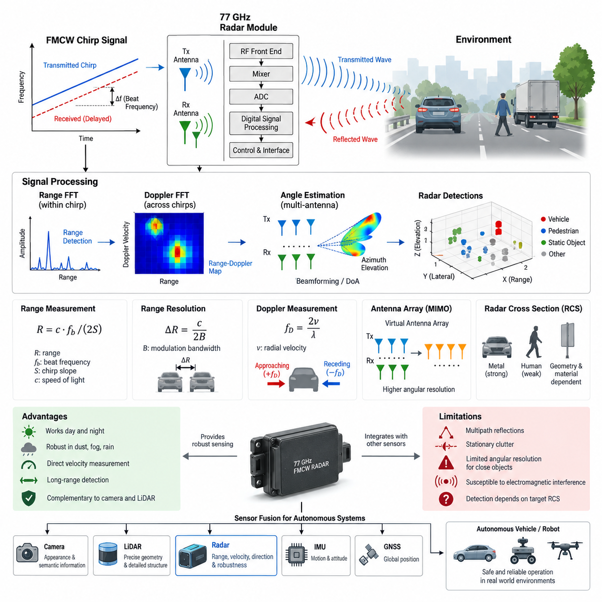
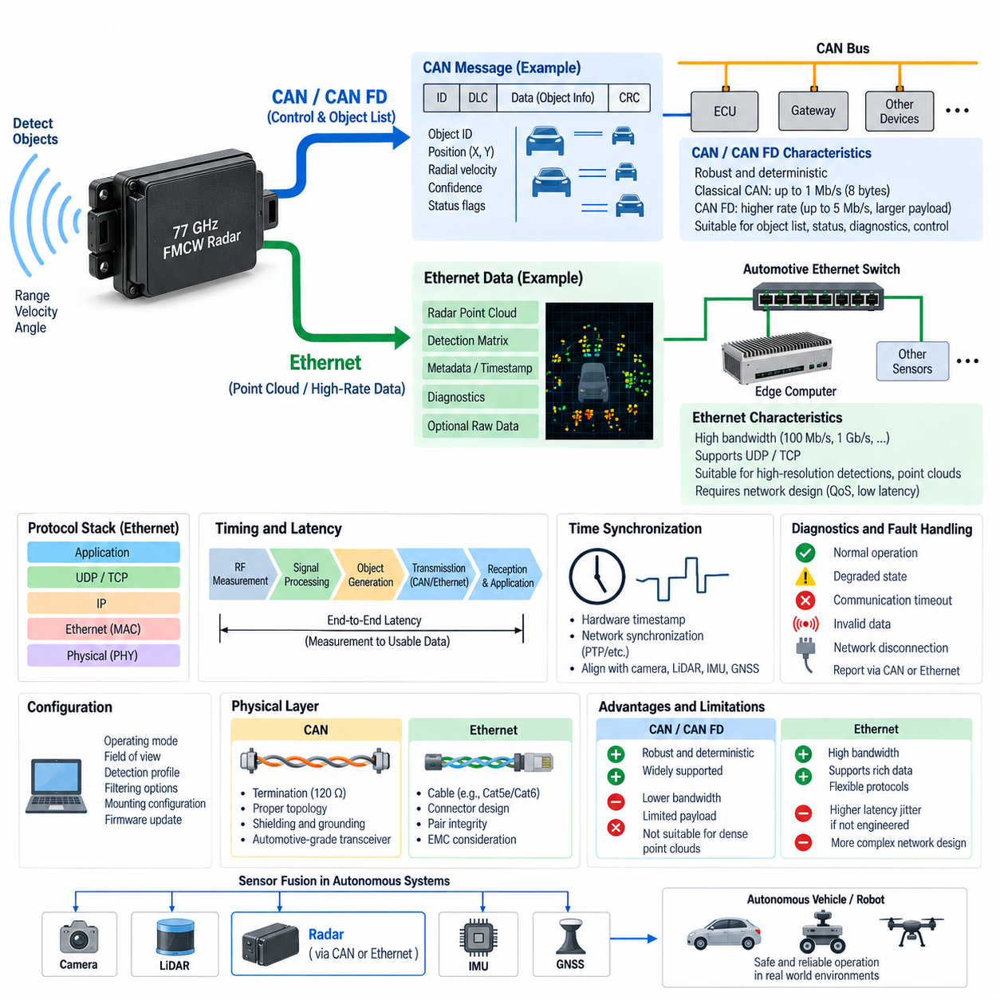
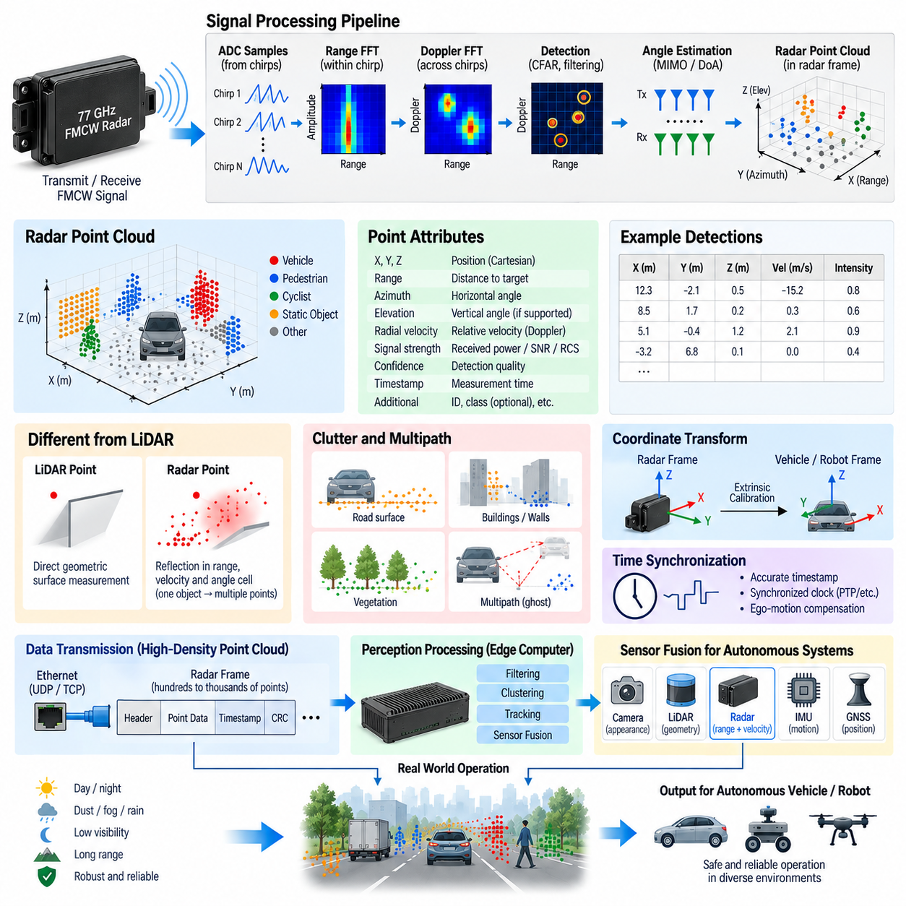
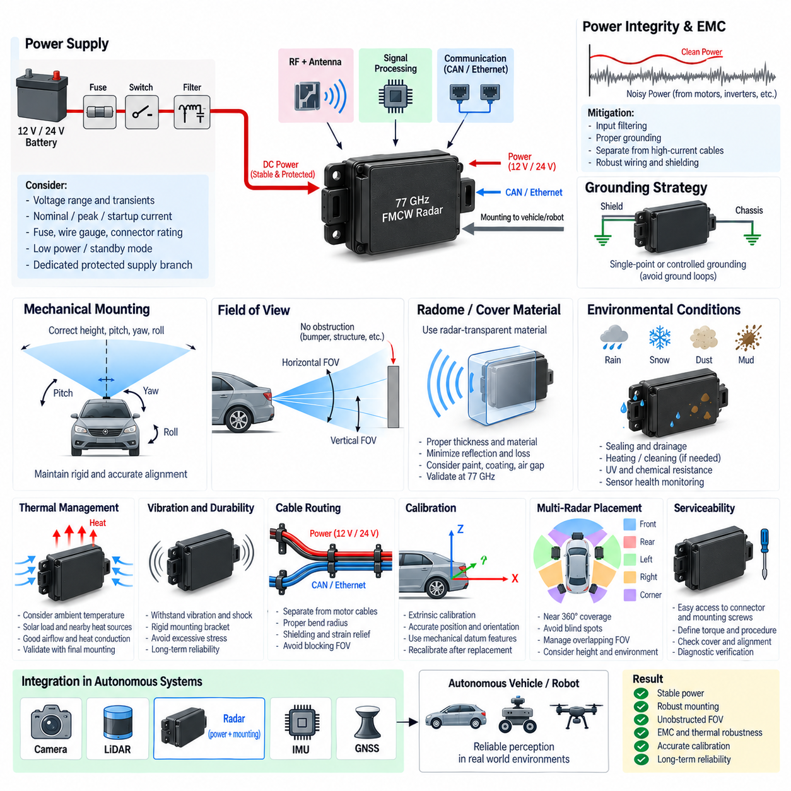
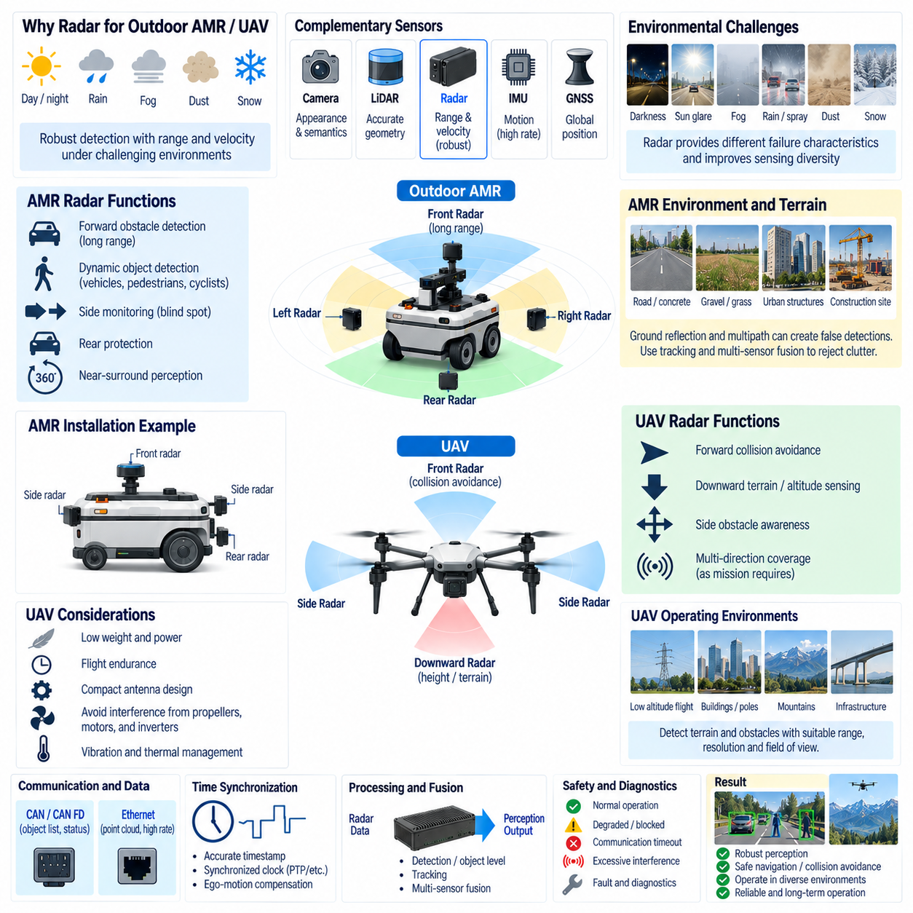

**Volume 15 Perception and Sensor Architecture**

# Chapter 07. Radar

## 07.01. 77GHz FMCW Radar Basics

{width="7.268055555555556in" height="7.268055555555556in"}

77 GHz 주파수 변조 연속파 레이더(Frequency-Modulated Continuous-Wave Radar, FMCW Radar)는 시간에 따라 주파수가 제어된 방식으로 변화하는 연속 전자기파(Electromagnetic Wave)를 송신하여 주변 환경을 측정한다. 짧은 송신 펄스(Transmit Pulse)의 왕복 시간을 주로 이용하여 거리를 추정하는 펄스 레이더(Pulse Radar)와 달리, FMCW 레이더는 송신 파형(Transmitted Waveform)과 수신된 반사파(Received Reflection)를 지속적으로 비교한다. 두 신호 사이의 주파수 차이인 비트 주파수(Beat Frequency)에는 반사 물체의 거리와 움직임에 관한 정보가 포함된다.

77 GHz 대역은 짧은 파장(Wavelength)을 이용하여 소형 안테나 구조, 비교적 좁은 빔(Narrow Beam), 그리고 안테나 배열(Antenna Array)과 결합했을 때 높은 각도 분해능(Angular Resolution)을 구현할 수 있기 때문에 자동차 및 로봇 인지(Robotic Perception)에 널리 사용된다. 77 GHz의 주파수는 자유 공간(Free Space)에서 약 3.9 mm의 파장에 해당한다. 이러한 밀리미터파(Millimeter-Wave) 특성을 이용하면 여러 송신 및 수신 안테나 소자를 비교적 작은 레이더 모듈에 집적하여 차량, 실외 자율이동로봇(Outdoor AMR), 이동 로봇(Mobile Robot), 자율 플랫폼(Autonomous Platform)에 적용할 수 있다.

일반적인 FMCW 레이더에서는 처프(Chirp)라고 하는 시간 구간 동안 송신 주파수가 선형적으로 증가한다. 송신된 신호가 물체에 도달하면 전자기 에너지의 일부가 레이더 방향으로 반사된다. 반사 신호는 물체까지 이동한 후 다시 레이더로 돌아오는 경로를 거치기 때문에 전파 지연(Propagation Delay)을 가지고 도착한다. 이 지연 시간 동안 송신기의 주파수는 계속 변화하므로 현재 송신 신호와 지연되어 도착한 수신 신호 사이에 측정 가능한 주파수 차이가 발생한다.

레이더 수신기(Radar Receiver)는 송신 신호와 수신된 반사 신호를 혼합(Mixing)하여 비트 신호(Beat Signal)를 생성한다. 정지 표적(Stationary Target)의 경우 비트 주파수는 왕복 전파 지연(Round-Trip Propagation Delay)에 대략 비례하며, 따라서 표적 거리(Target Range)와도 비례한다. 처프 기울기(Chirp Slope)가 송신 대역폭(Transmit Bandwidth)을 처프 지속시간(Chirp Duration)으로 나눈 값으로 정의될 경우, 비트 주파수와 빛의 속도(Speed of Light), 처프 기울기를 이용하여 거리를 계산할 수 있다. 이러한 변환이 FMCW 레이더 거리 측정(Ranging)의 기본 원리를 구성한다.

거리 분해능(Range Resolution)은 반송파 주파수(Carrier Frequency) 자체보다는 주로 변조 대역폭(Modulation Bandwidth)에 의해 결정된다. 이상적인 FMCW 시스템에서 거리 분해능은 ΔR = c/(2B)로 근사할 수 있으며, 여기서 c는 빛의 속도이고 B는 주파수 스윕 대역폭(Frequency Sweep Bandwidth)이다. 따라서 대역폭이 증가할수록 거리 방향에서 서로 가까이 위치한 두 물체를 더 효과적으로 구분할 수 있다. 이러한 관계는 차량, 벽, 보행자, 식생, 기반시설 또는 기타 장애물 근처에서 운용되는 로봇용 레이더 하드웨어를 선정할 때 중요하다.

움직이는 물체는 도플러 효과(Doppler Effect)에 의해 추가적인 주파수 편이(Frequency Shift)를 발생시킨다. 표적이 레이더에 접근하면 반사 파형은 멀어지는 표적과 다른 도플러 편이(Doppler Shift)를 나타낸다. 실제 FMCW 시스템은 여러 개의 처프를 연속적으로 송신하고 처프 간 변화를 분석하여 거리와 관련된 비트 주파수와 움직임에 따른 도플러 주파수(Doppler Frequency)를 구분한다. 결과적으로 레이더는 연속적인 수신 측정을 통해 표적 거리와 방사 방향 속도(Radial Velocity)를 모두 추정할 수 있다.

디지털 레이더 처리(Digital Radar Processing)는 일반적으로 샘플을 두 개의 차원으로 구성한다. 각 처프 내부에서 수집된 샘플에는 고속 푸리에 변환(Fast Fourier Transform, FFT)을 적용하여 거리를 추정하고, 여러 처프에 걸쳐 대응되는 샘플에는 또 다른 FFT를 적용하여 도플러 속도(Doppler Velocity)를 추정한다. 이렇게 생성된 거리-도플러 표현(Range-Doppler Representation)은 검출된 에너지를 거리와 방사 방향 운동에 따라 분리한다. 이후 검출 알고리즘(Detection Algorithm)은 열 잡음(Thermal Noise), 간섭(Interference), 불필요한 배경 반사(Background Reflection)를 억제하면서 잠재적인 물체를 나타내는 피크(Peak)를 식별한다.

각도 정보(Angular Information)는 알려진 공간 간격으로 배치된 여러 수신 안테나(Receiving Antenna)를 이용하여 얻는다. 반사파는 각 안테나 소자의 물리적 위치가 서로 다르기 때문에 개별 안테나에 약간씩 다른 위상(Phase)으로 도달한다. 레이더 프로세서(Radar Processor)는 이러한 위상 관계를 측정하여 반사 신호가 도달한 방향을 추정할 수 있다. 디지털 빔포밍(Digital Beamforming), 각도 FFT(Angle FFT), 그리고 보다 발전된 도래각 추정(Direction-of-Arrival, DoA) 알고리즘을 이용하면 이러한 위상 차이를 방위각(Azimuth)으로 변환할 수 있으며, 적절한 안테나 형상을 사용할 경우 고도각(Elevation)도 추정할 수 있다.

현대의 레이더 장치는 동일한 수의 물리적 수신 채널을 크게 증가시키지 않으면서 유효 개구(Effective Aperture)를 확대하기 위해 다중입력 다중출력(Multiple-Input Multiple-Output, MIMO) 안테나 구조를 사용하는 경우가 많다. 여러 송신 안테나는 정의된 송신 방식에 따라 환경을 조사하고, 여러 수신 안테나는 반사 신호를 수집한다. 이러한 송수신 조합은 가상 안테나 배열(Virtual Antenna Array)을 형성한다. 가상 개구(Virtual Aperture)는 각도 구분 성능을 향상시키며 자율 시스템의 인지에 사용할 수 있는 더욱 조밀한 레이더 검출(Radar Detection)을 가능하게 한다.

따라서 레이더의 기본 측정 원리는 서로 연결된 네 가지 영역으로 이해할 수 있다. 송신 처프(Transmitted Chirp)는 변조 구조(Modulation Structure)를 형성하고, 전파 지연은 거리 정보를 제공하며, 도플러 변화는 방사 방향 속도를 제공하고, 안테나 배열의 위상 차이는 방향 정보를 제공한다. 신호 처리(Signal Processing)는 이러한 측정값을 결합하여 거리, 속도, 방위각, 지원되는 경우 고도각, 신호 강도(Signal Strength), 신뢰도(Confidence) 등의 매개변수를 포함하는 레이더 검출 정보를 생성한다. 이후 이러한 검출 정보는 물체 목록(Object List) 또는 레이더 포인트 클라우드(Radar Point Cloud)로 변환될 수 있다.

레이더 단면적(Radar Cross Section, RCS)은 물체가 전자기 에너지를 얼마나 강하게 레이더 방향으로 반사하는지를 나타내며, 단순히 물체의 물리적 크기에 의해서만 결정되지 않는다. 재료 특성(Material Properties), 형상(Geometry), 방향(Orientation), 표면 구조(Surface Structure), 편파(Polarization), 관측 각도(Viewing Angle) 등이 반사 전력(Returned Power)에 큰 영향을 미칠 수 있다. 대형 금속 구조물은 강한 반사를 발생시킬 수 있지만 일부 물체는 훨씬 약한 신호를 반환할 수 있다. 따라서 레이더 검출 성능은 단순한 거리 사양만으로 판단하기보다 대표적인 표적과 실제 운용 환경을 이용하여 평가해야 한다.

밀리미터파 레이더(Millimeter-Wave Radar)는 실외 자율 시스템(Outdoor Autonomous System)에서 중요한 환경적 장점을 제공한다. 가시광 조명(Visible Illumination)에 의존하지 않으므로 별도의 외부 조명 없이 주간과 야간 모두 운용할 수 있다. 또한 먼지, 안개, 물보라, 중간 수준의 강수, 눈부심, 낮은 대비 환경 등 광학 센서(Optical Sensor)의 성능을 저하시키는 조건에서도 유용한 정보를 제공할 수 있다. 방사 방향 속도를 직접 측정하는 특성은 접근 차량, 이동 장비, 보행자 및 기타 동적 장애물(Dynamic Obstacle)을 검출하는 데 특히 유용하다.

그러나 레이더에는 인지 아키텍처(Perception Architecture) 설계에서 고려해야 할 한계도 존재한다. 다중경로 반사(Multipath Reflection)는 실제 물체 위치와 직접적으로 일치하지 않는 검출 결과를 만들 수 있으며, 반사율이 높은 표면은 복잡한 반사 신호를 발생시킬 수 있다. 거리와 속도가 유사한 물체들은 각도 분해능이 충분하지 않을 경우 서로 구분하기 어려울 수 있다. 일부 환경에서는 정적 클러터(Stationary Clutter)가 지배적으로 나타날 수 있으며, 다른 레이더 시스템에서 발생하는 전자기 간섭(Electromagnetic Interference)도 적절한 파형 설계와 간섭 완화(Interference Mitigation)가 적용되지 않으면 측정 성능을 저하시킬 수 있다.

따라서 검출 처리(Detection Processing)는 단순한 FFT 계산을 넘어선다. 실제 레이더 시스템은 배경 잡음(Background Noise)을 추정하고, 통계적으로 유의미한 신호 피크를 식별하며, 관련 검출 결과를 그룹화하고, 의미 있는 물체를 나타낼 가능성이 낮은 측정값을 제거한다. 일정 오경보율(Constant False Alarm Rate, CFAR) 처리는 주변 신호 조건에 따라 검출 임계값(Detection Threshold)을 적응적으로 조절하기 위해 널리 사용된다. 이후 군집화(Clustering)와 추적(Tracking) 단계에서는 시간에 따른 개별 레이더 검출을 결합하여 물체의 위치, 속도 및 궤적(Trajectory)을 보다 안정적으로 추정할 수 있다.

로봇 인지(Robotic Perception)에서 레이더는 일반적으로 카메라(Camera)나 라이다(LiDAR)를 완전히 대체하는 센서가 아니라 상호 보완적인 센서(Complementary Sensor)로 사용된다. 카메라는 풍부한 외관 및 의미 정보(Semantic Information)를 제공하고, 라이다는 정밀한 기하학적 측정(Geometric Measurement)과 상세한 공간 구조를 제공할 수 있다. 레이더는 견고한 거리 측정, 방사 방향 속도의 직접 측정, 장거리 검출 능력, 어려운 환경 조건에서의 높은 강건성(Robustness)을 제공한다. 센서 융합(Sensor Fusion)은 서로 다른 물리적 센싱 원리를 활용하여 특정 단일 센서 모달리티(Sensor Modality)에 대한 의존도를 줄일 수 있다.

77 GHz 레이더의 전기 아키텍처(Electrical Architecture)는 무선주파수 프런트엔드(Radio-Frequency Front End)만으로 구성되지 않는다. 실제 레이더 모듈에는 송수신 안테나 구조, RF 생성 및 믹싱 회로(RF Generation and Mixing Circuitry), 아날로그 신호 조절(Analog Signal Conditioning), 아날로그-디지털 변환(Analog-to-Digital Conversion), 디지털 신호 처리(Digital Signal Processing), 임베디드 제어(Embedded Control), 전원 조절(Power Regulation), 시간 동기 기능(Timing Function), 외부 통신 인터페이스(External Communication Interface)가 포함된다. 시스템 요구사항에 따라 처리된 검출 데이터는 CAN, CAN FD, 자동차 이더넷(Automotive Ethernet) 등의 인터페이스를 통해 엣지 컴퓨터(Edge Computer) 또는 인지 제어기(Perception Controller)로 전달될 수 있다.

설치 형상(Installation Geometry)은 실제로 사용할 수 있는 레이더 정보에 직접적인 영향을 미친다. 장착 높이(Mounting Height), 피치(Pitch), 요(Yaw), 시야각(Field of View), 안테나 방향, 인접 금속 구조물, 로봇 차체 패널, 센서 커버 등은 전파 특성을 변화시키거나 불필요한 반사를 발생시킬 수 있다. 따라서 실외 자율이동로봇(Outdoor AMR)에 장착되는 레이더는 전체 전자기 및 기계 시스템(Electromagnetic and Mechanical System)의 일부로 다루어야 한다. 캘리브레이션(Calibration)은 레이더 좌표계(Radar Coordinate Frame)와 로봇 좌표계(Robot Coordinate Frame)의 관계를 설정하여 레이더 측정값이 다른 센서 정보와 정확하게 융합될 수 있도록 한다.

자율 로봇(Autonomous Robot)에서 77 GHz FMCW 레이더의 가장 큰 가치는 물리적 측정 원리, 안테나 설계(Antenna Design), 디지털 신호 처리, 기계적 통합(Mechanical Integration), 통신(Communication), 캘리브레이션, 센서 융합을 하나의 시스템 관점에서 함께 고려할 때 나타난다. 레이더는 단순한 거리 센서(Distance Sensor)가 아니라 거리, 방사 방향 운동, 방향, 반사 신호 특성을 동시에 관측할 수 있는 다차원 인지 장치(Multidimensional Perception Device)이다. 이러한 특성으로 인해 77 GHz FMCW 레이더는 강건한 실외 AMR 및 자율 시스템 인지 아키텍처를 구성하는 중요한 센싱 모달리티(Sensing Modality)가 된다.

## 07.02. CAN/Ethernet Radar Interface

{width="7.268055555555556in" height="7.268055555555556in"}

레이더 인터페이스(Radar Interface)는 검출 정보(Detection Information), 진단 상태(Diagnostic Status), 설정 데이터(Configuration Data), 시간 정보(Timing Information), 그리고 원시 또는 처리된 측정 데이터(Raw or Processed Measurements)가 레이더 센서(Radar Sensor)와 차량 또는 로봇 컴퓨팅 아키텍처(Computing Architecture) 사이에서 어떻게 전달되는지를 정의한다. 77 GHz 레이더 시스템에서 CAN과 이더넷(Ethernet)은 근본적으로 서로 다른 두 가지 통신 방식을 나타낸다. CAN은 결정론적 제어 중심 통신(Deterministic Control-Oriented Communication)과 높은 강건성(Robustness)을 중시하는 반면, 이더넷은 데이터 집약적인 인지 작업(Perception Workload)을 위한 훨씬 높은 대역폭(Bandwidth)을 제공한다.

CAN은 레이더가 추적 물체 목록(Tracked-Object List), 검출 물체 속성(Detected-Object Attribute), 센서 상태(Sensor Health), 동작 상태(Operating State), 진단 메시지(Diagnostic Message)와 같은 비교적 압축된 정보를 출력할 때 널리 사용된다. 센서 내부의 모든 레이더 측정값을 전송하는 대신 레이더 자체에서 상당한 수준의 신호 처리를 수행한 후 선택된 결과만 전송한다. 하나의 메시지에는 물체 식별자(Object Identifier), 종방향 및 횡방향 위치(Longitudinal and Lateral Position), 방사 방향 속도(Radial Velocity), 신뢰도(Confidence), 상태 플래그(Status Flag) 등의 매개변수가 미리 정의된 CAN 프레임(CAN Frame)에 인코딩될 수 있다.

클래식 CAN(Classical CAN)은 높은 강건성과 예측 가능한 중재 동작(Arbitration Behavior)을 제공하지만 제한된 페이로드(Payload)와 통신 속도로 인해 전송할 수 있는 레이더 정보량이 제한된다. 일반적인 물체 목록 레이더(Object-List Radar)에서는 수십 개의 추적 물체를 여러 개의 압축된 메시지로 표현할 수 있으므로 이러한 특성이 충분할 수 있다. 그러나 레이더 검출 데이터가 더욱 조밀해지고 고해상도 포인트 클라우드(High-Resolution Point Cloud)와 첨단 이미징 레이더(Imaging Radar) 출력이 증가하면 클래식 CAN의 실질적인 전송 용량을 초과할 수 있다.

CAN FD는 하나의 프레임에서 더 큰 데이터 필드(Data Field)를 사용할 수 있고 페이로드 구간에서 더 높은 데이터 속도를 지원함으로써 CAN 아키텍처를 확장한다. 따라서 기존 CAN 생태계(CAN Ecosystem)의 많은 특성을 유지하면서 클래식 CAN보다 많은 정보를 효율적으로 전송해야 하는 레이더 시스템에 유용하다. 하지만 CAN FD 역시 지속적인 대용량 레이더 측정 스트림(Measurement Stream)보다는 제어(Control), 진단(Diagnostics), 상태 정보(Status Information), 그리고 중간 규모의 검출 데이터 출력에 보다 적합하다.

CAN을 통해 연결되는 레이더는 일반적으로 전자제어장치(Electronic Control Unit, ECU), 게이트웨이(Gateway), 엣지 제어기(Edge Controller), 또는 다른 임베디드 장치(Embedded Device)와 하나의 버스를 공유한다. CAN 식별자(CAN Identifier)는 메시지 우선순위를 결정하며, 수신기는 정의된 통신 데이터베이스 또는 인터페이스 사양(Interface Specification)에 따라 레이더 정보를 복원한다. 신호 스케일링(Signal Scaling), 오프셋(Offset), 부호 표현(Signed Representation), 바이트 순서(Byte Order), 갱신 주기(Update Rate), 타임아웃 동작(Timeout Behavior), 무효값(Invalid Value), 고장 상태(Fault State)를 정확하게 정의해야 하며, 잘못된 해석은 오류가 있는 인지 정보를 생성할 수 있다.

레이더의 분해능(Resolution)과 출력 밀도(Output Density)가 증가할수록 이더넷의 중요성도 높아진다. 하나의 측정 주기(Measurement Cycle)마다 수백 또는 수천 개의 검출 결과를 생성하는 레이더는 기존의 물체 목록 센서보다 훨씬 높은 대역폭을 필요로 한다. 이더넷을 사용하면 더욱 풍부한 레이더 포인트 클라우드(Radar Point Cloud), 검출 행렬(Detection Matrix), 메타데이터(Metadata), 진단 정보, 그리고 일부 아키텍처에서는 중간 처리 결과(Intermediate Processing Result)를 엣지 컴퓨터(Edge Computer)로 전송할 수 있으며, 여기에서 인지 알고리즘이 군집화(Clustering), 추적(Tracking), 분류(Classification), 센서 융합(Sensor Fusion)을 수행할 수 있다.

자동차 이더넷(Automotive Ethernet)은 높은 통신 용량과 임베디드 환경에 적합한 배선 방식을 결합하므로 이동형 플랫폼(Mobile Platform)에 특히 유용한 물리적 네트워크 기술(Physical Network Technology)을 제공한다. 레이더와 시스템 아키텍처에 따라 링크(Link)는 100 Mb/s, 1 Gb/s 또는 그 이상의 속도로 동작할 수 있다. 필요한 링크 용량(Link Capacity)은 단순히 센서의 명목 갱신 주기만을 기준으로 결정해서는 안 되며, 실제 레이더 출력 크기, 측정 주파수(Measurement Frequency), 프로토콜 오버헤드(Protocol Overhead), 진단 트래픽(Diagnostic Traffic), 동기화 요구사항(Synchronization Requirement), 그리고 설계 여유(Engineering Margin)를 종합적으로 고려해야 한다.

이더넷 레이더 통신(Ethernet Radar Communication)은 일반적으로 물리적 링크 위에 프로토콜 스택(Protocol Stack)을 사용한다. UDP는 상대적으로 낮은 전송 오버헤드(Transport Overhead)를 가지며 손실된 모든 패킷을 재전송할 필요가 없기 때문에 고속 인지 데이터(High-Rate Perception Data)에 적합한 경우가 많다. TCP는 최소 지연시간보다 신뢰성 있는 순차 전달(Reliable Ordered Delivery)이 중요한 경우에 유용하며, 특히 설정(Configuration), 파일 전송(File Transfer), 소프트웨어 유지보수(Software Maintenance), 일부 진단 기능에 적합하다. 따라서 프로토콜 선택은 각각의 레이더 데이터 스트림이 갖는 의미와 요구 특성에 따라 결정되어야 한다.

실시간 인지(Real-Time Perception)에서는 이미 시간적으로 의미가 없어진 과거 측정 데이터를 재전송하는 것보다 일부 오래된 측정값이 손실되는 것이 더 바람직할 수 있다. 이러한 특성으로 인해 UDP는 주기적인 레이더 검출 데이터와 포인트 클라우드 스트림(Point-Cloud Stream)에 적합하다. 그러나 UDP 자체는 전달 보장(Delivery Guarantee), 순서 보장(Ordering), 중복 제거(Duplicate Suppression)를 제공하지 않으므로 응용 계층(Application Layer)에서 시퀀스 카운터(Sequence Counter), 타임스탬프(Timestamp), 패킷 식별자(Packet Identifier), 페이로드 길이 검증(Payload-Length Validation) 등의 무결성 메커니즘(Integrity Mechanism)을 제공하여 누락되거나 손상된 레이더 데이터를 검출해야 한다.

레이더 출력이 하나의 이더넷 패킷(Ethernet Packet)이 실질적으로 수용할 수 있는 페이로드를 초과하면 패킷화(Packetization)가 중요한 설계 요소가 된다. 하나의 레이더 프레임(Radar Frame)을 여러 패킷으로 나누어 전송한 후 수신 컴퓨터에서 다시 재구성해야 할 수 있다. 각 패킷은 정확한 레이더 측정 주기와 연결되어야 하며, 불완전한 프레임(Incomplete Frame)을 처리하는 방법도 명확하게 정의되어야 한다. 패킷 관리가 적절하지 않으면 물리적인 이더넷 연결 자체가 정상적으로 동작하더라도 서로 다른 측정 데이터가 혼합되거나 오래된 검출 데이터, 가변 지연시간(Variable Latency), 손상된 포인트 클라우드가 발생할 수 있다.

지연시간(Latency)은 단순히 CAN 또는 이더넷을 통한 전송 시간만을 의미하지 않는다. 종단간 레이더 지연시간(End-to-End Radar Latency)에는 전자기 측정(Electromagnetic Measurement), 처프 획득(Chirp Acquisition), ADC 샘플링(ADC Sampling), 내부 FFT 처리, 검출 처리(Detection Processing), 물체 생성(Object Generation), 인터페이스 버퍼링(Interface Buffering), 네트워크 전송(Network Transmission), 수신 스택 처리(Receiving-Stack Processing), 응용 프로그램 스케줄링(Application Scheduling)이 포함된다. 따라서 자율 로봇에서 중요한 공학적 지표는 실제 환경이 물리적으로 관측된 시점부터 인지 또는 제어 알고리즘이 사용할 수 있는 레이더 정보가 준비되는 시점까지의 전체 시간이다.

CAN은 버스 부하(Bus Loading)와 메시지 우선순위가 적절하게 설계된 경우 매우 예측 가능한 동작을 제공할 수 있지만, 버스 사용률(Bus Utilization)이 증가하면 중재 지연(Arbitration Delay)이 증가하고 타이밍 여유(Timing Margin)가 감소한다. 따라서 레이더 메시지는 독립적으로 추가하기보다는 전체 CAN 통신 예산(Communication Budget)에 포함하여 설계해야 한다. 중요한 상태 또는 물체 메시지에는 높은 우선순위 식별자를 할당하고, 설정 및 진단 트래픽에는 낮은 우선순위의 통신 경로를 사용하여 시간 민감형 인지 정보(Time-Sensitive Perception Information)에 대한 간섭을 방지할 수 있다.

이더넷은 훨씬 높은 대역폭을 제공하지만 높은 대역폭 자체가 결정론적 지연시간(Deterministic Latency)을 보장하는 것은 아니다. 스위치 큐(Switch Queue), 운영체제 스케줄링(Operating-System Scheduling), 소켓 버퍼링(Socket Buffering), 경쟁 네트워크 트래픽(Competing Network Traffic), 패킷 버스트(Packet Burst), 소프트웨어 처리 과정에서 지터(Jitter)가 발생할 수 있다. 따라서 인지 네트워크(Perception Network)는 종단간 시스템(End-to-End System)의 관점에서 설계해야 한다. 타이밍 정확도가 중요한 경우 트래픽 분리(Traffic Separation), 서비스 품질(Quality of Service, QoS), 적절한 스위치 아키텍처(Switch Architecture), 네트워크 사용률 제어, 하드웨어 타임스탬핑(Hardware Timestamping), 실시간 소프트웨어 기법(Real-Time Software Technique)이 필요할 수 있다.

레이더 정보를 카메라(Camera), 라이다(LiDAR), 관성측정장치(Inertial Measurement Unit, IMU), 위성항법시스템(Global Navigation Satellite System, GNSS) 측정값과 융합할 경우 시간 동기화(Time Synchronization)는 특히 중요하다. 각 레이더 측정값은 패킷이 엣지 컴퓨터에 도착한 시간만을 나타내는 것이 아니라 실제 관측 시점(Observation Time)을 명확하게 나타내야 한다. 이더넷 아키텍처는 정밀한 네트워크 기반 동기화(Network-Based Synchronization)와 하드웨어 타임스탬핑을 지원할 수 있으며, CAN 기반 아키텍처에서는 시스템 요구사항에 따라 동기화된 클록(Synchronized Clock), 주기적인 시간 기준(Periodic Time Reference), 게이트웨이 보조 타이밍(Gateway-Assisted Timing) 전략을 사용할 수 있다.

타임스탬프(Timestamp)는 가능한 한 실제 레이더 측정 시점(Measurement Epoch)에 가깝게 대응해야 한다. 소프트웨어가 데이터 수신 이후에만 타임스탬프를 할당하면 가변적인 처리 지연과 네트워크 지연이 측정 시간에 포함된다. 이는 차량이나 로봇이 움직이는 동안 공간적 오차(Spatial Error)를 발생시킬 수 있다. 플랫폼의 속도가 높거나 빠른 회전 운동이 발생하는 경우, 또는 레이더 속도 정보를 기하학적으로 정밀한 라이다 및 카메라 측정값과 결합하는 경우 이러한 문제는 더욱 중요해진다.

레이더 인터페이스 설계(Radar Interface Design)는 진단(Diagnostics)과 고장 처리(Fault Handling)도 포함해야 한다. 수신 제어기는 통신 타임아웃(Communication Timeout), 카운터 불일치(Counter Mismatch), 잘못된 페이로드(Invalid Payload), 레이더 초기화 실패(Radar Initialization Failure), 센서 성능 저하 상태(Degraded Sensor State), 동기화 손실(Synchronization Loss), 네트워크 단절(Network Disconnection)을 검출할 수 있어야 한다. CAN 시스템은 일반적으로 상태 프레임(Status Frame)과 진단 서비스(Diagnostic Service)를 통해 이러한 상태를 전달하며, 이더넷 시스템은 주기적인 상태 메시지와 네트워크 감시(Network Supervision), 응용 계층 진단(Application-Level Diagnostics)을 결합할 수 있다. 레이더 데이터 스트림이 사라진 상태를 장애물이 없는 빈 환경으로 잘못 해석해서는 안 된다.

설정 통신(Configuration Communication)은 인지 데이터 출력(Perception Output)과 개념적으로 분리해야 한다. 레이더 동작 모드(Operating Mode), 시야각(Field of View), 검출 프로파일(Detection Profile), 필터링 옵션(Filtering Option), 장착 설정(Mounting Configuration), 소프트웨어 상태(Software State) 등의 매개변수에는 제어된 쓰기 접근(Controlled Write Access)이 필요할 수 있다. 인터페이스는 운용 중 의도하지 않은 설정 변경을 방지하고 명확하게 정의된 기동 순서(Startup Sequence)를 제공해야 한다. 레이더 펌웨어(Radar Firmware), 통신 정의(Communication Definition), 인지 소프트웨어(Perception Software) 간의 버전 호환성(Version Compatibility)도 센서 데이터를 일관되게 해석하기 위해 중요하다.

물리 계층 엔지니어링(Physical-Layer Engineering)은 두 인터페이스 모두에서 필수적이다. CAN에서는 올바른 종단저항(Termination), 토폴로지(Topology), 접지(Grounding), 차폐(Shielding), 트랜시버 선정(Transceiver Selection), 배선 설계(Wiring Practice)가 필요하다. 이더넷에서는 적절한 케이블 규격(Cable Category), 커넥터 설계(Connector Design), 페어 무결성(Pair Integrity), 필요한 경우의 차폐 전략, 전자파 적합성(Electromagnetic Compatibility, EMC)을 고려해야 한다. 레이더 모듈은 모터, DC/DC 컨버터(DC/DC Converter), 고전류 배선, 무선 장비 및 기타 잡음원 근처에 설치되는 경우가 많으므로 신뢰성 있는 통신을 위해 EMC를 고려한 배선 경로와 접지 설계가 중요하다.

실제 자율 플랫폼(Autonomous Platform)에서는 두 인터페이스를 동시에 사용할 수도 있다. 이더넷은 고속 레이더 검출 데이터 또는 포인트 클라우드를 인지 컴퓨터(Perception Computer)로 전달하고, CAN 또는 CAN FD는 센서 상태, 진단 정보, 웨이크업 정보(Wake-Up Information), 동작 명령(Operational Command), 또는 안전 관련 상태(Safety-Related State)를 전달할 수 있다. 이러한 하이브리드 아키텍처(Hybrid Architecture)는 모든 레이더 기능을 하나의 통신 기술에 집중시키지 않고 대역폭, 결정성(Determinism), 호환성(Compatibility), 진단, 시스템 통합(System Integration) 측면에서 각 네트워크의 장점을 활용할 수 있게 한다.

적절한 인터페이스는 결국 레이더 지능(Radar Intelligence)이 어디에서 처리되는가에 따라 달라진다. 센서 내부에서 검출, 군집화, 추적을 수행하는 스마트 레이더(Smart Radar)는 압축된 물체 목록을 CAN 또는 CAN FD로 전송할 수 있다. 반면 조밀한 검출 데이터를 중앙집중형 AI 인지(Centralized AI Perception)에 제공하도록 설계된 고해상도 레이더(High-Resolution Radar)는 일반적으로 이더넷의 장점을 크게 활용할 수 있다. 따라서 아키텍처 결정은 단순한 CAN 대 이더넷의 선택이 아니라 어떤 레이더 처리 기능을 센서 내부에서 수행하고 어떤 기능을 엣지 컴퓨터에서 수행할 것인지를 결정하는 기능 분할(Functional Partitioning)의 문제이다.

실외 자율이동로봇(Outdoor AMR)과 첨단 자율 시스템(Advanced Autonomous System)을 위한 확장 가능한 설계에서는 일반적으로 대용량 인지 트래픽(High-Volume Perception Traffic)을 이더넷에 배치하고, 필요한 경우 저대역폭 제어 및 진단 기능(Low-Bandwidth Control and Diagnostic Function)은 CAN 또는 CAN FD에 유지할 수 있다. 엣지 컴퓨터는 레이더 데이터와 카메라 및 라이다 스트림을 함께 수신하고 타임스탬프를 기준으로 정렬한 후 센서 융합을 수행할 수 있다. 따라서 잘 설계된 레이더 인터페이스는 대역폭, 타이밍, 무결성, 진단 및 고장 관리(Fault Management)를 체계적으로 제어함으로써 RF 센싱(RF Sensing)을 전체 인지 아키텍처와 연결하는 핵심 통신 구조가 된다.

## 07.03. Radar Point Cloud

{width="7.268055555555556in" height="7.268055555555556in"}

레이더 포인트 클라우드(Radar Point Cloud)는 레이더 측정 결과를 사전에 정의된 추적 물체(Tracked Object)만으로 표현하지 않고 공간적으로 분포된 검출점(Detection) 형태로 나타낸다. 각각의 포인트(Point)는 레이더 신호 처리 및 검출 파이프라인(Radar Signal-Processing and Detection Pipeline)을 통과한 반사 신호에 대응하며 거리(Range), 방위각(Azimuth), 고도각(Elevation), 방사 방향 속도(Radial Velocity), 반사 신호 강도(Reflected Signal Strength), 신뢰도(Confidence) 등의 정보를 포함할 수 있다. 이러한 표현은 물리적 센싱 결과를 후단 인지 소프트웨어(Downstream Perception Software)에 보다 직접적으로 제공하여 엣지 컴퓨터(Edge Computer)가 레이더 내부 물체 모델을 넘어 환경을 해석할 수 있게 한다.

레이더 포인트 클라우드 생성은 FMCW 신호 획득(FMCW Signal Acquisition)에서 시작된다. 개별 처프(Chirp) 내부에서 수집된 샘플에는 거리 관련 정보가 포함되고, 반복되는 처프에 걸친 측정값에는 도플러 정보(Doppler Information)가 포함된다. 여러 수신 안테나 채널(Receiving Antenna Channel)은 각도 추정(Angular Estimation)에 사용되는 위상 관계(Phase Relationship)를 제공한다. 거리 FFT(Range FFT), 도플러 FFT(Doppler FFT), 검출 처리(Detection Processing), 도래각 추정(Direction-of-Arrival Estimation)은 원시 ADC 샘플(Raw ADC Sample)을 레이더 좌표계(Radar Coordinate Frame) 내에 위치하는 검출점으로 단계적으로 변환한다.

레이더 포인트(Radar Point)는 라이다 포인트(LiDAR Point)와 완전히 동일한 방식으로 해석해서는 안 된다. 라이다 포인트는 일반적으로 반사 표면에 대한 비교적 직접적인 기하학적 관측(Geometric Observation)을 나타내지만, 레이더 검출점은 분해된 거리, 속도 및 각도 셀(Angular Cell)에 대응하는 전자기 에너지(Electromagnetic Energy)를 나타낸다. 따라서 하나의 실제 물체가 여러 개의 레이더 포인트를 생성하거나 하나의 강한 포인트만 생성할 수도 있으며, 불안정한 반사를 나타내거나 물체의 방향, 재질, 거리 및 주변 환경에 따라 서로 다른 검출 패턴(Detection Pattern)을 생성할 수도 있다.

레이더 포인트의 기본 속성(Fundamental Attribute)에는 일반적으로 거리와 방향이 포함된다. 거리는 레이더와 검출된 반사점 사이의 방사 방향 거리(Radial Distance)를 나타내며, 방위각은 레이더 좌표계를 기준으로 수평 방향을 나타낸다. 적절한 안테나 배열(Antenna Array)을 갖춘 레이더는 추가적으로 고도각을 추정할 수 있다. 이러한 측정값은 로봇 인지(Robotic Perception) 및 매핑 소프트웨어(Mapping Software)와 통합하기 위해 극좌표(Polar Coordinate) 또는 구면좌표(Spherical Coordinate)에서 x, y, z와 같은 직교좌표(Cartesian Coordinate)로 변환할 수 있다.

방사 방향 속도(Radial Velocity)는 레이더 포인트 클라우드의 가장 특징적인 속성 중 하나이다. FMCW 레이더는 수신된 전자기 신호에서 직접 도플러 정보(Doppler Information)를 획득하므로 개별 검출점에 레이더 시선 방향(Line of Sight)의 상대 속도(Relative Velocity)를 포함할 수 있다. 양수와 음수 속도의 정의는 구현 방식에 따라 달라지지만 접근하는 반사체와 멀어지는 반사체를 구분할 수 있다. 이러한 기능은 완전한 물체 추적(Object Tracking)이 확립되기 전에도 동적 물체(Dynamic Object)를 식별하고 움직임을 추정하는 데 레이더를 특히 유용하게 만든다.

신호 강도(Signal Strength)는 각각의 레이더 반사에 대한 추가적인 정보를 제공한다. 레이더 구현 방식에 따라 수신 전력(Received Power), 진폭(Amplitude), 신호대잡음비(Signal-to-Noise Ratio, SNR), 레이더 단면적(Radar Cross Section, RCS), 또는 다른 정규화된 강도 값(Normalized Intensity Measure)으로 표현될 수 있다. 강한 신호가 반드시 큰 물체를 의미하는 것은 아니다. 레이더 반사는 재질, 형상, 방향, 다중경로 조건(Multipath Condition), 주파수에 따른 전자기적 특성에 영향을 받기 때문이다. 따라서 신호 강도는 공간 및 시간 정보와 함께 해석해야 한다.

검출 알고리즘(Detection Algorithm)은 어떤 신호 피크(Signal Peak)를 포인트 클라우드 요소(Point-Cloud Element)로 변환할 것인지를 결정한다. 거리-도플러 처리(Range-Doppler Processing) 이후 레이더는 원하는 반사 신호뿐 아니라 열 잡음(Thermal Noise), 간섭(Interference), 클러터(Clutter)가 포함된 측정 공간(Measurement Space)을 관측한다. 일정 오경보율(Constant False Alarm Rate, CFAR) 처리는 주변 잡음 조건에 따라 적응형 검출 임계값(Adaptive Detection Threshold)을 설정할 수 있다. 필요한 임계값을 초과한 측정값은 후보 검출점(Candidate Detection)이 되며, 추가적인 필터링을 통해 신뢰도가 낮거나 물리적으로 타당하지 않은 결과를 포인트 클라우드 생성 전에 제거할 수 있다.

포인트 클라우드 밀도(Point-Cloud Density)는 레이더 아키텍처와 처리 설정에 크게 의존한다. 기존 자동차 레이더(Conventional Automotive Radar)는 비교적 희소한 검출점(Sparse Detection)을 생성할 수 있는 반면, 고해상도 레이더(High-Resolution Radar) 또는 이미징 레이더(Imaging Radar)는 훨씬 조밀한 공간 측정값을 생성할 수 있다. 포인트 수가 증가하면 물체 형상 해석(Object Shape Interpretation)과 군집화(Clustering)를 개선할 수 있지만, 밀도만으로 인지 품질이 결정되는 것은 아니다. 각도 분해능(Angular Resolution), 거리 분해능(Range Resolution), 속도 분해능(Velocity Resolution), 검출 안정성(Detection Stability), 오경보 특성(False-Alarm Behavior), 갱신 주기(Update Rate), 측정 불확실성(Measurement Uncertainty) 역시 중요하다.

레이더 포인트 클라우드는 횡방향(Lateral Direction)에서 라이다 포인트 클라우드보다 기하학적 정밀도가 낮을 수 있기 때문에 각도 분해능이 특히 중요하다. 두 물체가 유사한 거리와 방사 방향 속도를 가지면서 두 물체 사이의 각도 간격이 레이더의 유효 분해능(Effective Resolution)보다 작으면 서로 구분하기 어려울 수 있다. 더 큰 안테나 개구(Antenna Aperture), MIMO 가상 배열(MIMO Virtual Array), 디지털 빔포밍(Digital Beamforming), 고급 도래각 추정(Advanced Direction-of-Arrival Estimation)을 사용하면 물체 분리 성능을 향상시키고 자율 인지(Autonomous Perception)에 더욱 유용한 포인트 분포를 생성할 수 있다.

레이더 포인트 클라우드에는 클러터(Clutter)도 포함된다. 도로 표면, 벽, 울타리, 식생(Vegetation), 금속 구조물, 기계 장비 및 기타 정지 물체에서 발생하는 반사는 많은 검출점을 생성할 수 있다. 일부 클러터는 환경을 표현하므로 유용하지만 다른 검출점은 동적 물체 인지(Dynamic-Object Perception)를 방해할 수 있다. 필터링 전략(Filtering Strategy)은 방사 방향 속도, 신호 강도, 공간적 위치, 지속성(Persistence), 환경 모델(Environmental Model)을 이용하여 정지 장애물을 무차별적으로 제거하지 않으면서 유용한 측정값과 불필요한 반사 신호를 구분할 수 있다.

다중경로(Multipath)는 더욱 처리하기 어려운 레이더 포인트 클라우드 인공물(Point-Cloud Artifact)을 생성한다. 전자기파는 레이더로 돌아오기 전에 표적, 지면, 벽, 차량 또는 기타 구조물 사이에서 여러 번 반사될 수 있다. 이렇게 형성된 전파 경로(Propagation Path)는 표적의 직접적인 물리적 위치를 나타내지 않는 거리 또는 방향으로 측정될 수 있다. 이러한 고스트 검출(Ghost Detection)은 여러 프레임에 걸쳐 지속될 수도 있으므로 단순한 임계값 필터링만으로 제거하기 어렵다. 따라서 의심스러운 측정값을 식별하기 위해 시간적 일관성(Temporal Consistency)과 다중 센서 추론(Multi-Sensor Reasoning)이 중요하다.

레이더 포인트를 다른 센서와 융합하기 전에 좌표계(Coordinate System)를 정확하게 정의해야 한다. 레이더는 기본적으로 자체 센서 좌표계(Sensor Frame)를 기준으로 검출값을 측정하지만, 자율 플랫폼은 일반적으로 로봇(Robot), 차량(Vehicle), 오도메트리(Odometry), 지도(Map), 또는 월드 좌표계(World Coordinate Frame)를 사용한다. 외부 캘리브레이션(Extrinsic Calibration)은 레이더와 플랫폼 기준 좌표계 사이의 회전(Rotation)과 병진(Translation)을 결정한다. 잘못된 장착 매개변수(Mounting Parameter)는 모든 레이더 포인트를 체계적으로 이동시키고 군집화, 추적 및 센서 융합 성능을 저하시킬 수 있다.

움직이는 플랫폼에서는 시간 정렬(Time Alignment)도 동일하게 중요하다. 각 포인트 클라우드는 단순한 네트워크 수신 시간(Network Reception Time)이 아니라 실제 레이더 측정 시간(Radar Measurement Time)과 연결되어야 한다. 로봇이 레이더 데이터 획득과 센서 융합 처리 사이에서 이동하거나 회전하면 보상되지 않은 타이밍 오차(Timing Error)로 인해 포인트 클라우드가 카메라 또는 라이다 측정값에 대해 공간적으로 이동된 것처럼 나타날 수 있다. 플랫폼 속도와 센서 지연시간이 증가할수록 정확한 타임스탬프(Timestamp), 동기화된 클록(Synchronized Clock), 자차 운동 보상(Ego-Motion Compensation)이 더욱 중요해진다.

검출 밀도가 높은 경우 레이더 포인트 클라우드는 일반적으로 이더넷(Ethernet)을 통해 엣지 컴퓨터로 전송된다. 하나의 포인트 레코드(Point Record)는 좌표(Coordinates), 속도(Velocity), 강도(Intensity), 품질 지표(Quality Indicator), 메타데이터(Metadata)를 포함할 수 있으며, 하나의 완전한 레이더 프레임(Radar Frame)은 수백 또는 수천 개의 이러한 레코드를 포함할 수 있다. 수신 소프트웨어가 각 측정 주기를 정확하게 재구성하고 불완전하거나 손상된 데이터를 제거하려면 패킷 시퀀스 정보(Packet Sequence Information), 프레임 식별자(Frame Identifier), 타임스탬프, 무결성 검사(Integrity Check)가 필요하다.

인지 컴퓨터(Perception Computer)가 레이더 포인트를 수신하면 필터링(Filtering), 군집화(Clustering), 연관(Association), 추적(Tracking) 처리를 수행할 수 있다. 공간 군집화(Spatial Clustering)는 동일한 실제 물체에서 발생했을 가능성이 있는 인접 검출점을 그룹화하며, 속도 정보는 표적을 분리하기 위한 또 하나의 차원을 제공한다. 이후 추적 알고리즘(Tracking Algorithm)은 연속되는 프레임에서 군집 또는 개별 검출점을 서로 연관시킨다. 결과적으로 저수준 레이더 포인트 클라우드(Low-Level Radar Point Cloud)는 위치, 속도, 궤적(Trajectory), 크기 추정(Size Estimate), 신뢰도를 포함하는 안정적인 물체 가설(Object Hypothesis)로 발전할 수 있다.

레이더 속도를 해석할 때는 자차 운동(Ego-Motion)을 고려해야 한다. 측정된 도플러 속도(Doppler Velocity)는 움직이는 레이더에 대한 상대 속도이며 자동으로 월드 좌표계의 절대 물체 속도(Absolute Object Velocity)를 나타내는 것은 아니다. 따라서 로봇 자체가 움직이면 정지된 벽도 겉보기 방사 방향 운동(Apparent Radial Motion)을 나타낼 수 있다. 휠 오도메트리(Wheel Odometry), IMU, GNSS, 비주얼 오도메트리(Visual Odometry), 또는 융합 위치추정(Fused Localization)에서 얻은 차량이나 로봇의 속도를 이용하여 레이더 측정값을 보상하고 플랫폼 자체의 움직임과 독립적으로 움직이는 물체를 구분할 수 있다.

센서 융합(Sensor Fusion)은 레이더 포인트 클라우드의 의미적 가치(Semantic Value)를 높인다. 레이더는 강건한 거리와 직접적인 방사 방향 속도 측정을 제공하고, 라이다는 정밀한 기하학적 구조(Geometric Structure)를 제공하며, 카메라는 외관 및 의미 정보(Appearance and Semantic Information)를 제공한다. 이들 센서의 좌표계와 타임스탬프가 정렬되면 레이더 포인트는 시야가 좋지 않은 환경에서 카메라 검출을 보완하고, 라이다 군집(LiDAR Cluster)에 속도 정보를 추가하거나, 어둠, 눈부심, 먼지, 안개 또는 강수로 인해 광학 센싱(Optical Sensing)이 저하되는 상황에서도 동적 물체 인지 능력을 유지하는 데 기여할 수 있다.

따라서 레이더 포인트 클라우드는 정확한 3차원 재구성(Exact Three-Dimensional Reconstruction)이 아니라 확률적 인지 측정(Probabilistic Perception Measurement)으로 이해해야 한다. 각각의 검출점에는 거리, 각도, 속도, 신호 강도 및 검출 처리 과정과 관련된 불확실성(Uncertainty)이 존재한다. 강건한 자율 시스템은 모든 포인트를 동일한 정확도의 측정값으로 취급하지 않고 이러한 불확실성을 보존하거나 모델링한다. 신뢰도 값(Confidence Value), 공분산 추정(Covariance Estimate), 센서 특성(Sensor Characteristics), 시간적 일관성, 센서 간 일치도(Cross-Sensor Agreement)는 모두 더욱 신뢰성 높은 후단 해석에 기여할 수 있다.

실외 자율이동로봇(Outdoor AMR), 자율주행차(Autonomous Vehicle), 무인항공기(Unmanned Aerial Vehicle, UAV), 그리고 기타 피지컬 AI 플랫폼(Physical AI Platform)에서 레이더 포인트 클라우드는 기존 물체 목록 레이더(Object-List Radar)와 중앙집중형 AI 인지(Centralized AI Perception)를 연결하는 유용한 중간 계층을 제공한다. 레이더 포인트 클라우드는 더욱 풍부한 측정 정보를 외부에 제공하면서도 어려운 환경 조건에서 거리와 움직임을 관측할 수 있는 레이더의 장점을 유지한다. 정확한 캘리브레이션, 동기화(Synchronization), 이더넷 전송(Ethernet Transport), 필터링, 군집화, 추적, 자차 운동 보상 및 다중 센서 융합(Multi-Sensor Fusion)과 결합하면 레이더 포인트 클라우드는 강건한 인지 아키텍처(Robust Perception Architecture)의 중요한 구성 요소가 된다.

## 07.04. Radar Power and Mounting

{width="7.268055555555556in" height="7.268055555555556in"}

레이더 전원 및 장착 설계(Radar Power and Mounting Design)는 센싱 신뢰성(Sensing Reliability), 측정 안정성(Measurement Stability), 열적 거동(Thermal Behavior), 전자파 적합성(Electromagnetic Compatibility, EMC), 장기 내구성(Long-Term Durability)에 직접적인 영향을 미친다. 77 GHz 레이더는 소형 센서처럼 보이지만 하나의 하우징 내부에 RF 회로(RF Circuitry), 안테나(Antenna), 신호 처리(Signal Processing), 전력 변환(Power Conversion), 통신 전자장치(Communication Electronics)를 통합한다. 따라서 전원 공급과 기계적 설치는 단순한 보조 연결이 아니라 전체 인지 아키텍처(Perception Architecture)의 일부로 설계해야 한다.

레이더 모듈(Radar Module)은 일반적으로 12 V 또는 24 V와 같은 차량이나 로봇의 저전압 전원 영역(Low-Voltage Power Domain)에서 동작하지만, 정확한 허용 범위는 센서 설계에 따라 달라진다. 배터리 충전, DC/DC 컨버터(DC/DC Converter)의 동작, 과도 현상(Transient Event), 기동 조건(Startup Condition), 배선 전압 강하(Voltage Drop)에 따라 레이더에 공급되는 실제 전압이 변할 수 있으므로 공칭 시스템 전압(Nominal System Voltage)만으로 전원 인터페이스를 정의해서는 안 된다. 모든 예상 조건에서 센서의 규정된 동작 및 생존 한계(Operating and Survival Limit)를 만족해야 한다.

전력 예산(Power Budgeting)은 정상상태 소비전력(Steady-State Consumption)뿐 아니라 과도적인 전력 요구(Transient Demand)도 고려해야 한다. 레이더 전자장치는 초기화(Initialization), RF 송신(RF Transmission), 신호 처리, 통신, 진단(Diagnostics), 열 관리(Thermal Management) 과정에서 동작 상태가 변할 수 있다. 따라서 시스템 설계자는 공칭 전력(Nominal Power), 최대 전류(Peak Current), 기동 전류(Startup Current), 해당되는 경우 저전력 또는 대기 상태 소비전력(Standby Consumption)을 파악해야 한다. 이러한 값은 DC/DC 컨버터 용량, 퓨즈 선정(Fuse Selection), 커넥터 정격(Connector Rating), 전선 굵기(Wire Gauge), 자율 플랫폼 전체의 에너지 예산(Energy Budget)에 영향을 미친다.

인지 센서(Perception Sensor)에는 일반적으로 독립적으로 보호되는 전원 분기(Dedicated Protected Supply Branch)를 사용하는 것이 바람직하다. 레이더 전원 경로에는 퓨즈(Fuse) 또는 전자식 보호장치(Electronic Protection Device), 스위칭 소자(Switching Element), 필터링 네트워크(Filtering Network), 커넥터(Connector), 센서 내부의 로컬 전압 조정(Local Regulation)이 포함될 수 있다. 보호 회로는 배선이나 센서의 고장을 격리하면서 관련 없는 다른 인지 장비까지 불필요하게 정지시키지 않아야 한다. 다중 레이더 아키텍처(Multi-Radar Architecture)에서는 개별 또는 논리적으로 그룹화된 보호 방식을 통해 고장 격리(Fault Containment)와 진단을 개선할 수 있다.

특히 센서가 주 전력분배장치(Power Distribution Unit, PDU)에서 멀리 장착되는 경우 전원 공급원부터 레이더 커넥터까지의 전압 강하를 평가해야 한다. 케이블 저항(Cable Resistance), 커넥터 접촉저항(Contact Resistance), 전류, 온도, 하네스 길이(Harness Length)는 모두 공급 전압 손실에 영향을 준다. 실험실에서는 정상적으로 동작하는 레이더도 배터리 전압 강하(Battery Sag), 모터 가속, 여러 고전류 부하의 동시 작동으로 인해 커넥터의 전압이 최소 요구 전압 이하로 떨어지면 실제 로봇에서는 간헐적으로 재시작될 수 있다.

레이더에는 민감한 RF 및 아날로그 회로(Analog Circuitry)가 포함되어 있으므로 전원 잡음(Power-Supply Noise) 역시 중요한 고려사항이다. 모터, 인버터(Inverter), 모터 드라이버(Motor Driver), DC/DC 컨버터, 릴레이(Relay), 스위칭 전원공급장치(Switching Power Supply)는 전기 시스템에 전도성 방해(Conducted Disturbance)를 유입시킬 수 있다. 입력 필터링(Input Filtering), 적절한 접지(Grounding), 올바른 케이블 배치, 고전류 스위칭 경로와의 분리는 이러한 방해가 레이더 동작에 영향을 주는 것을 방지한다. 필터는 과도한 전압 강하나 레이더 입력 회로와의 불안정한 상호작용을 발생시키지 않도록 설계해야 한다.

접지 전략(Grounding Strategy)은 전체 로봇 전기 아키텍처(Robot Electrical Architecture)와 일관성을 유지해야 한다. 레이더 전원 리턴(Power Return), 제공되는 경우의 섀시 연결(Chassis Connection), 케이블 차폐(Cable Shielding), 통신 기준 전위(Communication Reference), 하우징 장착 구조를 독립적으로 설계하면 의도하지 않은 전류 경로가 형성될 수 있다. 접지 루프(Ground Loop)와 고주파 공통모드 전류(High-Frequency Common-Mode Current)는 통신 또는 전자파 적합성을 저하시킬 수 있다. 따라서 차폐 종단 위치(Shield Termination), 하우징과 섀시의 전기적 관계, 센서 리턴 전류가 전원 공급원으로 돌아가는 경로를 명확하게 정의해야 한다.

기동 및 종료 동작(Startup and Shutdown Behavior)도 제어되어야 한다. 일부 플랫폼은 레이더 전원을 직접 스위칭하지만, 다른 플랫폼은 전원을 상시 공급하면서 웨이크업(Wake-Up) 또는 통신 명령을 통해 동작 상태를 제어한다. 선택된 전략은 초기화 시간(Initialization Time), 통신 준비 상태(Communication Readiness), 진단 검사(Diagnostic Check), 엣지 컴퓨터(Edge Computer)의 기동, 안전한 종료(Safe Shutdown)를 고려해야 한다. 인지 소프트웨어가 레이더 준비보다 먼저 시작되는 경우 시스템은 정상적인 초기화 과정과 통신 장애(Communication Failure)를 구분하여 즉각적인 센서 고장으로 잘못 판단하지 않아야 한다.

기계적 장착(Mechanical Mounting)은 레이더와 환경 사이의 물리적 관계를 설정하므로 측정 기하학(Measurement Geometry)에 직접적인 영향을 준다. 장착 브래킷(Mounting Bracket)은 운용 중 의도된 위치, 높이, 피치(Pitch), 요(Yaw), 롤(Roll)을 유지해야 한다. 작은 각도 오차(Angular Error)도 장거리에서는 상당한 횡방향 또는 수직 위치 오차를 발생시킬 수 있다. 따라서 장착 공차(Mounting Tolerance)는 단순한 기계 패키징 편의성이 아니라 인지 정확도 요구사항(Perception Accuracy Requirement)을 기준으로 결정해야 한다.

레이더 시야각(Field of View)은 의도하지 않은 장애물로부터 자유로워야 한다. 로봇 차체 패널, 범퍼(Bumper), 구조 부재, 램프, 케이블, 체결부품(Fastener), 액세서리, 적재 장비(Payload Equipment)는 송수신 전자기파를 부분적으로 차단하거나 왜곡할 수 있다. 기계적으로 편리한 위치가 반드시 RF 측면에서도 좋은 위치인 것은 아니다. 따라서 전체 설치 구조에 대해 레이더의 수평 및 수직 시야각뿐 아니라 강한 반사를 발생시킬 수 있는 주변 구조물도 함께 평가해야 한다.

레이더를 보호 커버(Protective Cover) 또는 레이돔(Radome) 뒤에 설치하면 해당 재료 역시 RF 설계의 일부가 된다. 커버 두께(Cover Thickness), 유전 특성(Dielectric Properties), 곡률(Curvature), 표면 코팅(Surface Coating), 도장(Paint), 공기 간극(Air Gap), 장착 각도는 밀리미터파 주파수(Millimeter-Wave Frequency)에서 전송 손실(Transmission Loss)과 반사에 영향을 줄 수 있다. 가시광이나 일반적인 무선 시스템에 투명해 보이는 재료가 반드시 77 GHz에서도 투명한 것은 아니다. 따라서 레이돔은 해당 레이더 주파수 대역에 맞추어 선정하고 검증해야 한다.

레이더 커버 표면의 물, 얼음, 눈, 진흙, 먼지, 결로(Condensation)는 전자기파 전파(Electromagnetic Propagation)를 변화시키거나 실제 센싱 성능을 저하시킬 수 있다. 실외 자율이동로봇(Outdoor AMR)은 필요한 시야각을 유지하면서 오염을 최소화할 수 있는 위치에 레이더를 설치해야 한다. 필요에 따라 기계 설계에 배수(Drainage), 표면 형상(Surface Geometry), 환경 밀봉(Environmental Sealing), 히팅(Heating), 세척(Cleaning) 전략을 적용할 수 있다. 또한 센서 상태 감시(Sensor-Health Monitoring)는 레이더가 정상적으로 전원이 공급되고 통신하더라도 센싱 표면의 오염으로 인지 성능이 저하될 수 있음을 인식해야 한다.

구조 강성(Structural Stiffness)은 진동(Vibration)이 레이더 방향을 변화시키거나 장기적으로 커넥터, 브래킷, 내부 조립체에 손상을 줄 수 있기 때문에 중요하다. 레이더 마운트(Radar Mount)는 모터, 휠, 서스펜션(Suspension), 거친 지형 및 운용 중 예상되는 충격에서 발생하는 진동을 견딜 수 있어야 한다. 지나치게 유연한 브래킷은 정적 캘리브레이션(Static Calibration)이 정확하더라도 동적 지향 오차(Dynamic Pointing Error)를 발생시킬 수 있다. 동시에 장착 구조는 불필요한 질량을 피하고 센서 하우징에 심각한 기계적 응력을 전달하지 않도록 해야 한다.

열적 조건(Thermal Condition) 역시 장착 설계와 함께 고려해야 한다. 레이더 전자장치는 자체적으로 열을 발생시키며 태양 복사(Solar Radiation), 밀폐된 차체 패널, 인접 프로세서, 모터, 전력 전자장치(Power Electronics)가 주변 온도를 더욱 높일 수 있다. 공기 흐름이 좋지 않은 장착 위치에서는 전력 소비가 크지 않더라도 센서 하우징 온도가 예상보다 높아질 수 있다. 열 설계(Thermal Design)는 최악 조건의 주변 온도, 태양열 부하(Solar Loading), 내부 발열(Internal Dissipation), 전도 열전달 경로(Conductive Heat Path), 이용 가능한 대류(Convection)를 평가해야 한다.

센서 구조에 따라 레이더 하우징과 브래킷은 열전달(Heat Transfer)에 참여할 수 있다. 금속 구조물에 직접 장착하면 유용한 전도성 열 경로(Conductive Thermal Path)를 제공할 수 있는 반면, 열적으로 절연된 마운트(Thermally Insulating Mount)는 모듈 내부에 열을 축적시킬 수 있다. 그러나 열 성능 개선을 위해 RF 성능, 전기 절연 요구사항(Electrical Isolation Requirement), 진동 특성, 내식성(Corrosion Resistance)을 손상시켜서는 안 된다. 따라서 온도 검증(Temperature Validation)은 레이더 단품의 벤치 조건이 아니라 최종 장착 구성을 이용하여 수행해야 한다.

환경 보호(Environmental Protection)는 온도만을 의미하지 않는다. 실외 레이더는 비, 습도, 염분, 먼지, 고압 세척(Pressure Washing), 진동, 충격, 자외선(Ultraviolet Exposure), 화학적 오염(Chemical Contamination)에 노출될 수 있다. 커넥터 방향(Connector Orientation)과 케이블 배치는 물이 고이는 것을 방지하고 씰(Seal)에 가해지는 기계적 하중을 줄여야 한다. 서비스 루프(Service Loop)와 스트레인 릴리프(Strain Relief)는 하네스 힘으로부터 커넥터를 보호하는 동시에 장기간의 로봇 운용에서 피로(Fatigue)를 유발할 수 있는 과도한 케이블 움직임을 방지해야 한다.

케이블 배선(Cable Routing)은 전원 무결성(Power Integrity), 통신 무결성(Communication Integrity), EMC, 기계적 내구성을 함께 고려해야 한다. 레이더 전원선과 CAN 또는 이더넷(Ethernet) 케이블은 가능한 경우 고전류 모터 상(High-Current Motor Phase)과 잡음이 많은 스위칭 노드(Switching Node)에서 떨어뜨려 배치해야 한다. 최소 굽힘 반경(Minimum Bend Radius), 마모 보호(Abrasion Protection), 커넥터 스트레인 릴리프, 차폐 연속성(Shielding Continuity), 정비 접근성(Service Accessibility)을 동시에 고려해야 한다. 또한 하네스가 레이더 시야각 안으로 들어가거나 안테나 주변에 불필요한 반사 구조물을 형성하지 않도록 해야 한다.

외부 캘리브레이션(Extrinsic Calibration)은 기계적 설치와 인지 소프트웨어를 연결한다. 레이더의 위치와 방향은 로봇 기준 좌표계(Robot Reference Frame)에 대해 정확하게 표현되어야 하며, 이를 통해 레이더 검출값을 공통 좌표계(Common Coordinate System)로 변환할 수 있다. 기계적 기준 형상(Mechanical Datum Feature)을 적용하면 조립 및 교체 과정의 반복성(Repeatability)을 향상시킬 수 있다. 정비를 위해 레이더를 탈거한 후 위치나 방향에 상당한 변화가 발생한 상태로 재설치하면 카메라 또는 라이다(LiDAR) 데이터와 안정적으로 융합하기 전에 재캘리브레이션(Recalibration)이 필요할 수 있다.

다중 레이더 시스템(Multiple-Radar System)은 각각의 센서가 과도한 사각지대(Blind Region)나 문제가 되는 중첩 영역을 만들지 않으면서 유용한 커버리지(Coverage)를 제공해야 하므로 추가적인 장착 분석이 필요하다. 전방, 후방, 측면, 코너 레이더(Corner Radar)를 배치하여 거의 전방위 인지(Near-Surround Perception)를 구현할 수 있지만 각각의 시야각, 장착 높이, 구조적 장애물, 좌표 변환(Coordinate Transformation)을 함께 고려해야 한다. 중첩 커버리지는 중복성(Redundancy)과 추적 성능을 향상시킬 수 있지만 잘못된 배치는 불필요한 중복 검출이나 지속적인 반사 인공물(Reflection Artifact)을 생성할 수 있다.

정비성(Serviceability)은 설계 초기부터 고려해야 한다. 정비 기술자는 로봇의 주요 부분을 대규모로 분해하지 않고도 커넥터, 배선, 장착 하드웨어, 커버 상태, 센서 정렬(Sensor Alignment)을 검사할 수 있어야 한다. 교체 절차에는 체결 토크(Fastening Torque), 장착 기준점(Mounting Datum), 커넥터 잠금(Connector Locking), 캘리브레이션 요구사항, 진단 검증(Diagnostic Verification)을 정의해야 한다. 우수한 정비 설계는 정상적으로 작동하는 교체용 레이더가 잘못된 방향이나 불완전한 전기 연결 상태로 설치될 위험을 줄인다.

실외 자율이동로봇과 기타 자율 플랫폼에서 레이더 전원 및 장착은 결국 전기 아키텍처(Electrical Architecture), 기계 패키징(Mechanical Packaging), RF 전파(RF Propagation), 전자파 적합성, 열 관리, 환경 보호, 캘리브레이션, 유지보수(Maintenance)를 연결하는 하나의 통합 엔지니어링 문제이다. 신뢰성 높은 레이더 인지(Reliable Radar Perception)를 구현하려면 안정적인 전원, 제어된 접지, 보호된 통신, 견고하고 정확한 정렬, 방해받지 않는 RF 시야각, 그리고 플랫폼의 전체 운용 수명(Operating Life)에 걸쳐 검증된 환경 성능이 필요하다.

## 07.05. Radar in Outdoor AMR/UAV

{width="7.268055555555556in" height="7.268055555555556in"}

실외 자율이동로봇(Outdoor AMR)과 무인항공기(Unmanned Aerial Vehicle, UAV)는 변화하는 조명, 날씨, 지형, 진동, 먼지, 장거리 센싱 환경에서도 인지 센서(Perception Sensor)가 유효하게 작동해야 하는 환경에서 운용된다. 레이더(Radar)는 가시광선이 아닌 전자기파 반사(Electromagnetic Reflection)에 기반한 상호 보완적 센싱 원리(Complementary Sensing Principle)를 제공한다. 이러한 플랫폼에서 77 GHz FMCW 레이더는 거리(Range)와 방사 방향 속도(Radial Velocity)를 직접 측정하면서 카메라(Camera)나 라이다(LiDAR)의 성능이 저하될 수 있는 조건에서도 유용한 검출 능력을 유지할 수 있기 때문에 특히 중요한 가치를 가진다.

실외 AMR에서 레이더는 전방 장애물 검출(Forward Obstacle Detection), 동적 물체 검출(Dynamic-Object Detection), 측면 감시(Side Monitoring), 후방 보호(Rear Protection), 준전방위 인지(Near-Surround Perception)를 지원할 수 있다. 차량, 보행자, 자전거, 건설 장비, 벽, 가드레일 및 기타 물체는 레이더 반사 신호를 생성하여 주행과 충돌 회피(Collision Avoidance)에 기여한다. 순수한 기하학적 센서와 달리 레이더는 도플러 속도(Doppler Velocity)도 제공하므로 완전한 물체 궤적(Object Trajectory)이 확립되기 전에도 인지 시스템이 중요한 움직임 패턴을 구분할 수 있다.

실외 AMR의 레이더 배치(Radar Placement)는 차량 형상과 필요한 감지 범위(Coverage)에 따라 결정된다. 전방 레이더(Forward-Facing Radar)는 주행 방향을 따라 장거리 검출을 제공할 수 있으며, 측면 및 코너 레이더(Side and Corner Radar)는 플랫폼 주변의 사각지대(Blind Region)를 줄일 수 있다. 후방 레이더(Rear Radar)는 후진과 접근 물체 감시를 지원한다. 여러 센서의 시야각(Field of View)을 중첩하면 물체가 하나의 감지 영역에서 다른 영역으로 이동할 때 추적 연속성을 향상시키고 특정 방향의 시야가 부분적으로 차단되었을 때 중복성(Redundancy)을 제공할 수 있다.

실외 AMR은 광학 인지(Optical Perception)를 어렵게 만드는 환경 조건을 자주 경험한다. 어둠, 직사광선, 눈부심, 그림자, 안개, 먼지, 물보라, 중간 수준의 강수는 카메라의 대비(Contrast)를 낮추거나 라이다 반사 신호를 저하시킬 수 있다. 레이더 역시 환경 영향으로부터 완전히 자유롭지는 않지만 밀리미터파 센싱(Millimeter-Wave Sensing)은 광학 센서와 다른 고장 특성(Failure Characteristic)을 제공한다. 따라서 레이더를 카메라 및 라이다와 결합하면 센싱 다양성(Sensing Diversity)이 증가하고 하나의 환경 조건이 모든 인지 채널을 동시에 저하시킬 가능성을 줄일 수 있다.

지형(Terrain) 역시 레이더 해석에 영향을 미친다. 도로, 콘크리트, 잔디, 자갈, 연석, 경사면, 금속 기반시설, 울타리, 주차 차량, 건물은 강하거나 복잡한 반사 신호를 생성할 수 있다. 지면 반사(Ground Reflection)와 다중경로(Multipath)는 실제 장애물 위치와 직접 일치하지 않는 검출 결과를 만들 수 있다. 따라서 실외 AMR 인지 소프트웨어는 시간에 따른 레이더 측정값을 평가하고 기하학적 제약(Geometric Constraint), 도플러 정보, 추적(Tracking), 센서 간 일치도(Cross-Sensor Agreement)를 활용하여 유용한 물체와 클러터(Clutter) 및 고스트 검출(Ghost Detection)을 구분해야 한다.

AMR이 이동 차량이나 보행자와 공간을 공유할 때 레이더 속도 정보(Radar Velocity Information)는 특히 유용하다. 카메라는 접근하는 차량을 분류(Classification)하고 라이다는 그 형상을 추정할 수 있으며, 레이더는 방사 방향 움직임을 직접 측정할 수 있다. 센서 융합(Sensor Fusion)은 이러한 특성을 결합하여 더욱 안정적인 동적 물체 추정(Dynamic-Object Estimate)을 생성할 수 있다. 이 기능은 물류 야드(Logistics Yard), 산업 현장, 항만, 캠퍼스, 도로 및 기타 혼합 교통 환경(Mixed-Traffic Environment)에서 충돌 위험 평가(Collision-Risk Assessment), 충돌 예상 시간(Time-to-Collision) 추정, 경로 계획(Path Planning), 속도 제어(Speed Control)를 지원한다.

레이더는 자차 운동 추정(Ego-Motion Estimation)을 간접적으로 지원할 수도 있다. 움직이는 로봇에서 관측되는 정지 환경 구조물은 로봇 자체의 움직임과 관련된 도플러 패턴(Doppler Pattern)을 나타낸다. 적절한 처리를 적용하면 이러한 측정값은 레이더 오도메트리(Radar Odometry)에 기여하거나 GNSS, 비주얼 오도메트리(Visual Odometry), 라이다 위치추정(LiDAR Localization)의 신뢰성이 낮아질 때 추가적인 운동 제약(Motion Constraint)을 제공할 수 있다. 일반적으로 레이더는 플랫폼의 주 항법 아키텍처(Primary Navigation Architecture)를 대체하기보다는 또 하나의 상호 보완적인 위치추정 소스로 활용해야 한다.

UAV 레이더 통합(UAV Radar Integration)은 센싱이 3차원 비행 공간(Three-Dimensional Flight Space)에서 이루어지기 때문에 AMR과 다른 기하학적 문제를 발생시킨다. 임무에 따라 레이더는 충돌 회피를 위해 전방을 향하거나, 지형 또는 고도 관련 센싱을 위해 하방을 향하거나, 장애물 인지를 위해 측면을 향하도록 배치할 수 있으며 여러 방향에 동시에 설치할 수도 있다. UAV는 소형 밀리미터파 안테나(Compact Millimeter-Wave Antenna)의 장점을 활용할 수 있지만 센서 배치 시 기체(Airframe), 착륙 장치(Landing Gear), 탑재체(Payload), 추진 시스템(Propulsion System), 필요한 시야각을 함께 고려해야 한다.

저고도 UAV 운용(Low-Altitude UAV Operation)에서 레이더는 충분한 레이더 반사와 분해능(Resolution)이 확보되는 경우 지형, 구조물, 기둥, 차량 및 기타 장애물 검출을 지원할 수 있다. 하방 레이더(Downward-Looking Radar)는 고도 또는 지면 상대 측정(Ground-Relative Measurement)에 기여할 수 있으며, 전방 레이더는 카메라 또는 라이다 기반 장애물 검출을 보완할 수 있다. 특정 레이더의 적합성은 최소 및 최대 검출 거리, 각도 범위(Angular Coverage), 분해능, 갱신 주기(Update Rate), 안테나 패턴(Antenna Pattern), 처리 아키텍처(Processing Architecture), 표적 특성(Target Characteristics)에 크게 좌우된다.

UAV의 움직임은 추가적인 레이더 해석 문제를 발생시킨다. 병진 운동(Translation), 피치(Pitch), 롤(Roll), 요(Yaw)는 환경에 대한 레이더 좌표계(Radar Coordinate Frame)를 지속적으로 변화시킨다. 항공기가 회전하는 동안 측정된 검출점은 표적 자체가 정지해 있더라도 기체 좌표계(Body Frame)에서 빠르게 이동하는 것처럼 나타날 수 있다. 따라서 정확한 IMU 정보, 타임스탬프(Timestamp), 외부 캘리브레이션(Extrinsic Calibration), 좌표 변환(Coordinate Transformation)이 필수적이다. 자차 운동 보상(Ego-Motion Compensation)을 적용하면 추적과 센서 융합 전에 레이더 측정값을 안정화된 항법 또는 월드 좌표계(World Frame)로 변환할 수 있다.

프로펠러(Propeller), 모터, 인버터(Inverter), 회전 구조물도 UAV 레이더 통합에 영향을 줄 수 있다. 전기적으로 고전류 추진 시스템(High-Current Propulsion System)은 전도 및 방사 전자기 방해(Conducted and Radiated Electromagnetic Disturbance)를 발생시킬 수 있다. 기계적으로 진동(Vibration)은 센서 방향을 변화시키거나 장착 구조에 응력을 가할 수 있다. 따라서 레이더 전원 배선, 접지(Grounding), 차폐(Shielding), 통신 배선, 브래킷 강성(Bracket Stiffness), 잡음이 많은 추진 부품과의 분리는 비행 시스템 완성 이후에 추가하는 것이 아니라 기체 설계와 함께 통합적으로 설계해야 한다.

모든 센서는 탑재 용량(Payload Capacity)과 비행 지속시간(Flight Endurance)에 영향을 주기 때문에 UAV에서는 중량과 전력 소비(Power Consumption)가 특히 중요하다. 레이더 선정 시 센서 질량, 장착 구조물, 케이블 질량, 전력 변환 손실(Power Conversion Loss), 프로세서 요구사항, 열 관리(Thermal Management)를 고려해야 한다. 고해상도 레이더(High-Resolution Radar)는 더욱 풍부한 인지 데이터를 제공할 수 있지만 더 많은 전력과 컴퓨팅 자원을 요구할 수도 있다. 적절한 설계는 인지 성능과 항공기의 에너지, 질량, 열, 탑재 제약 사이의 균형을 맞추어야 한다.

실외 AMR은 일반적으로 소형 UAV보다 사용 가능한 전력과 탑재 용량이 크기 때문에 여러 레이더, 대형 엣지 컴퓨터(Edge Computer), 더욱 광범위한 센서 중복성(Sensor Redundancy)을 적용할 수 있다. UAV는 센서 수와 처리 위치(Processing Location)를 더욱 엄격하게 최적화해야 하는 경우가 많다. 일부 레이더 처리를 센서 내부에서 수행하면 통신 대역폭과 엣지 컴퓨팅 요구량을 줄일 수 있는 반면, 고해상도 시스템은 중앙집중형 처리(Centralized Processing)를 위해 이더넷(Ethernet)을 통해 포인트 클라우드(Point Cloud)를 전송할 수 있다. 기능 분할(Functional Partitioning)은 플랫폼의 제약조건을 반영해야 한다.

통신 아키텍처(Communication Architecture)는 레이더 출력 형식에 따라 달라진다. 압축된 추적 물체 정보(Tracked-Object Information)와 센서 상태는 임베디드 제어 및 진단 통합에 유용한 CAN 또는 CAN FD를 통해 전송할 수 있다. 조밀한 레이더 포인트 클라우드와 고속 검출 데이터(High-Rate Detection)는 이더넷에 더 적합하다. 실외 AMR은 스위치 기반 이더넷 인지 네트워크(Switched Ethernet Perception Network)를 사용할 수 있으며, UAV에서는 경량 고속 링크(High-Speed Link)와 레이더, 카메라, 항법 센서, 비행 제어 시스템(Flight-Control System) 사이의 신중한 대역폭 할당(Bandwidth Allocation)이 필요할 수 있다.

레이더가 다른 센서와 결합될 때 시간 동기화(Time Synchronization)는 매우 중요해진다. 움직이는 AMR은 처리 및 네트워크 지연시간 동안 측정 가능한 거리를 이동할 수 있으며, UAV는 짧은 시간 동안에도 상당한 병진 및 회전 운동을 수행할 수 있다. 따라서 레이더 타임스탬프는 실제 측정 시점(Measurement Epoch)에 최대한 가깝게 대응해야 한다. 하드웨어 타임스탬핑(Hardware Timestamping) 또는 동기화된 클록(Synchronized Clock)을 사용하면 다중 센서 융합(Multi-Sensor Fusion) 전에 레이더 검출값을 카메라 프레임, 라이다 스캔, IMU 측정값, GNSS 데이터와 정렬할 수 있다.

센서 융합은 사용 가능한 모든 측정값을 단순히 결합하는 것이 아니라 각 센서 모달리티(Sensor Modality)의 물리적 장점을 활용해야 한다. 카메라는 의미적 외관 정보(Semantic Appearance)를 제공하고, 라이다는 정밀한 공간 기하학(Spatial Geometry)을 제공하며, 레이더는 강건한 거리와 방사 방향 속도를 제공한다. IMU는 고속 운동 정보(High-Rate Motion Information)를 제공하고 GNSS는 실외 글로벌 위치(Global Positioning)를 제공한다. 융합 아키텍처(Fusion Architecture)는 레이더를 이용하여 이동 표적을 확인하고, 저시정 환경에서 검출을 유지하며, 속도 추정을 개선하고, 다른 센서의 불확실성이 증가할 때 상호 보완적인 근거를 제공할 수 있다.

레이더 데이터는 여러 추상화 수준(Abstraction Level)에서 처리할 수 있다. 저수준 또는 검출 수준 융합(Low-Level or Detection-Level Fusion)은 물체가 생성되기 전의 레이더 포인트를 사용하여 중앙집중형 알고리즘이 상세한 측정 데이터를 결합할 수 있도록 한다. 물체 수준 융합(Object-Level Fusion)은 레이더 내부에서 이미 생성된 트랙(Track)을 사용하여 대역폭과 연산 요구량을 줄인다. 중간 방식에서는 속도와 신뢰도를 포함한 군집화된 검출점(Clustered Detection)을 전송할 수 있다. 적절한 융합 수준은 레이더 성능, 네트워크 대역폭, 엣지 컴퓨팅 성능, 소프트웨어 아키텍처, 필요한 인지 유연성(Perception Flexibility)에 따라 결정된다.

안전 관련 활용(Safety-Related Use)에서는 레이더 성능 저하와 고장(Failure)을 명시적으로 처리해야 한다. 통신 타임아웃(Communication Timeout), 무효 데이터(Invalid Data), 과도한 간섭(Excessive Interference), 센서 표면 차단(Blocked Sensor Surface), 전원 고장(Power Fault), 동기화 손실(Synchronization Loss), 내부 진단 상태(Internal Diagnostic State)를 자율 시스템에 전달해야 한다. 레이더가 검출 데이터를 생성하지 않는 상황을 환경이 비어 있다는 증거로 자동 해석해서는 안 된다. 인지 아키텍처는 유효한 빈 측정(Valid Empty Measurement)과 사용할 수 없거나 성능이 저하된 센싱을 구분하고 그에 따라 로봇의 동작을 조정해야 한다.

환경 오염(Environmental Contamination)은 실외 플랫폼에서 특히 중요하다. 레이더 커버에 진흙, 눈, 얼음, 물, 먼지 또는 이물질이 묻으면 전자장치가 완전히 정상적으로 작동하더라도 RF 전송(RF Transmission) 특성이 변할 수 있다. AMR 차체 설계에서는 필요한 경우 적절한 설치 위치, 배수(Drainage), 보호 형상(Protective Geometry), 히팅(Heating), 세척(Cleaning)을 적용할 수 있다. UAV 설치 역시 비, 결빙(Icing), 결로(Condensation), 공기 흐름(Airflow)을 고려해야 한다. 환경 검증(Environmental Qualification)은 독립적인 레이더 모듈만이 아니라 최종 설치된 전체 센서 구성을 대상으로 수행해야 한다.

다중 레이더 AMR(Multi-Radar AMR)은 중첩된 감지 범위를 이용하여 추적 성능을 향상시키고 사각지대를 줄일 수 있다. 전방 레이더가 검출한 표적은 로봇이 해당 표적을 지나가면서 코너 또는 측면 레이더의 감지 영역으로 이동할 수 있다. 인지 시스템은 모든 검출값을 공통 좌표계(Common Coordinate Frame)로 변환하고 동일한 실제 표적을 여러 개의 독립적인 물체로 잘못 인식하지 않아야 한다. 따라서 정확한 외부 캘리브레이션, 동기화된 측정값, 데이터 연관(Data Association), 트랙 관리(Track Management)가 전방위 레이더 아키텍처(Surround-Radar Architecture)에서 필수적이다.

UAV에서는 여러 방향의 레이더를 사용하여 더욱 넓은 공간 인지(Spatial Awareness)를 제공할 수 있지만 질량, 전력, 통신, 캘리브레이션 복잡성이 증가한다. 센서 수는 실제 비행 임무(Flight Mission)와 위험 요소의 공간적 형상(Hazard Geometry)을 기반으로 결정해야 한다. 기반시설 주변을 운항하는 화물 UAV(Cargo UAV)는 소형 점검 UAV(Inspection UAV)와 상당히 다른 감지 범위를 요구할 수 있다. 따라서 레이더 아키텍처는 임무 중심(Mission-Driven)으로 설계해야 하며 센싱 거리, 시야각, 중복성, 설치 형상, 고장 동작(Failure Behavior)을 실제 운용 시나리오(Operational Scenario)를 기준으로 정의해야 한다.

궁극적으로 레이더는 실외 AMR과 UAV에 광학 센싱(Optical Sensing)과 물리적 특성이 크게 다른 인지 채널(Perception Channel)을 제공한다. 직접적인 속도 측정, 장거리 센싱 가능성, 주야간 운용(Day-and-Night Operation), 어려운 시정 환경에서의 강건성은 신뢰성 높은 피지컬 AI 시스템(Physical AI System)을 구현하는 데 중요한 가치를 가진다. 올바른 전원 설계, 장착, 캘리브레이션, 동기화, 통신, 자차 운동 보상, 진단 및 다중 센서 융합과 통합될 때 레이더는 신뢰할 수 있는 자율 운용(Dependable Autonomous Operation)을 구성하는 중요한 요소가 된다.
