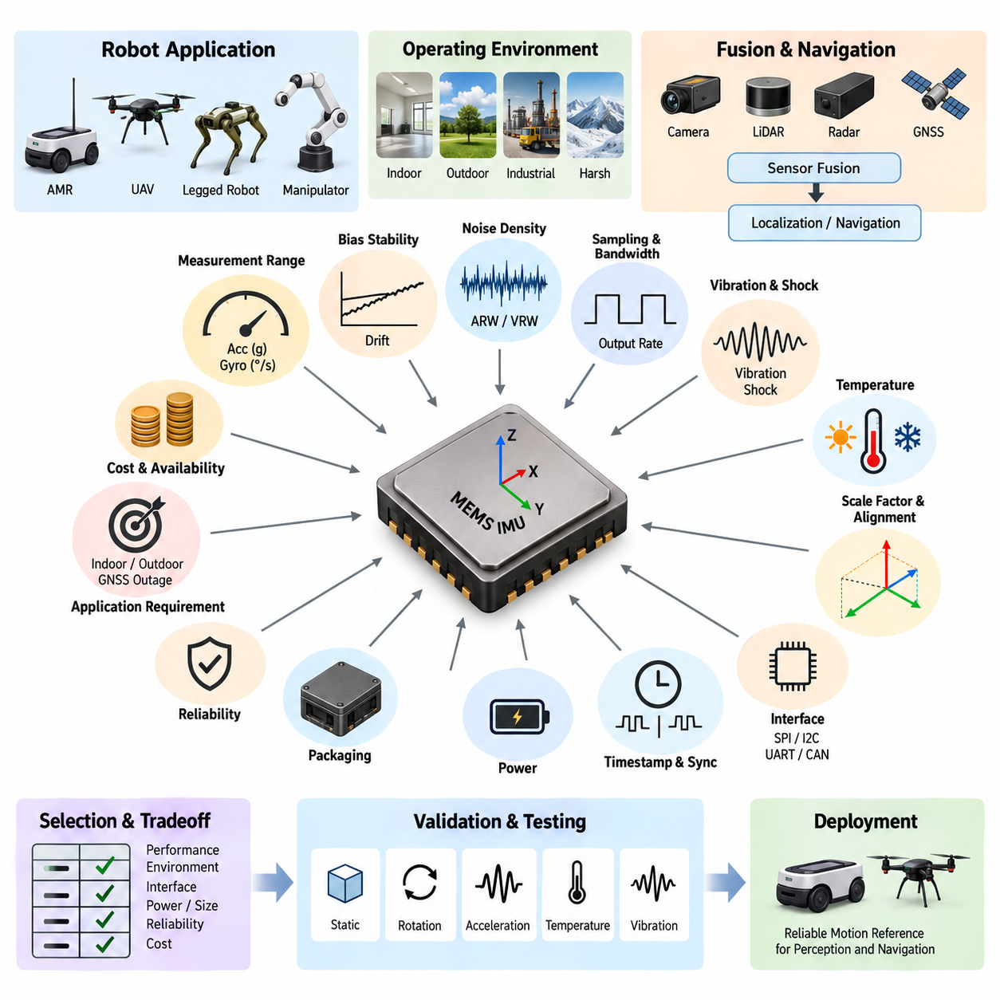
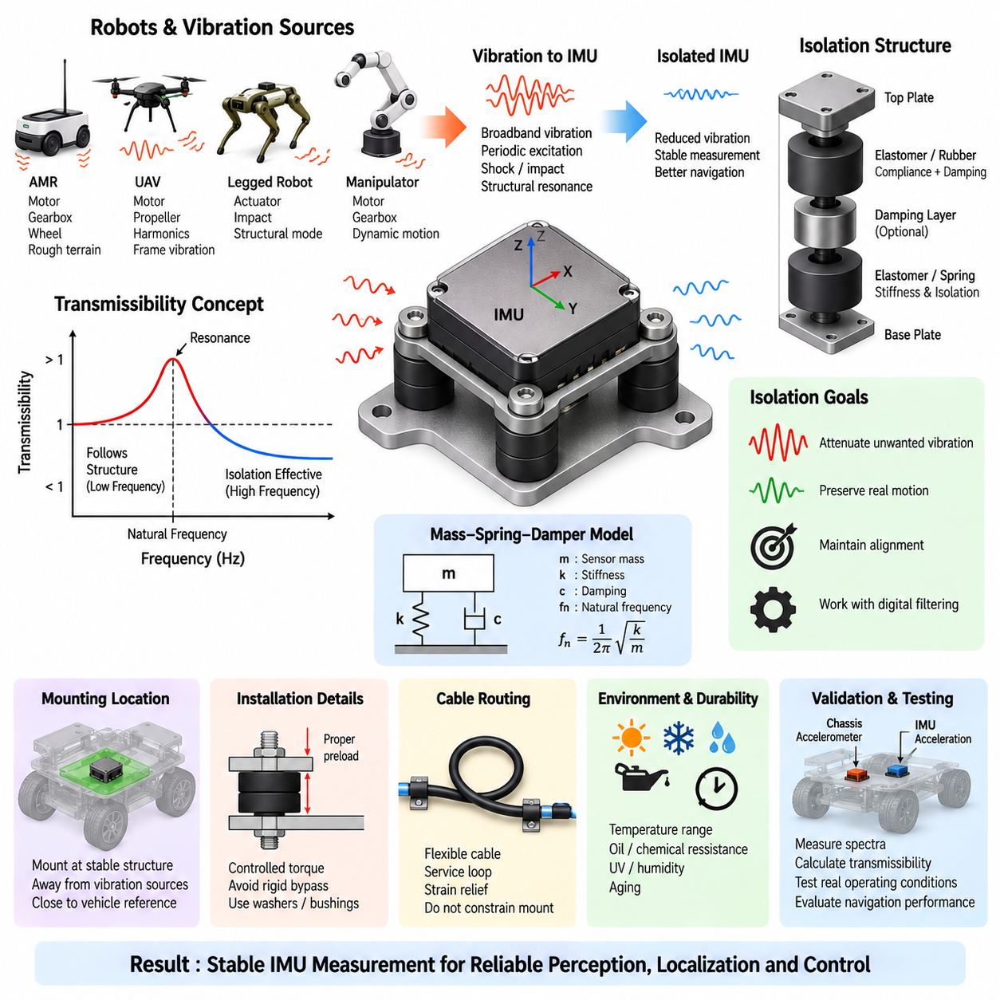
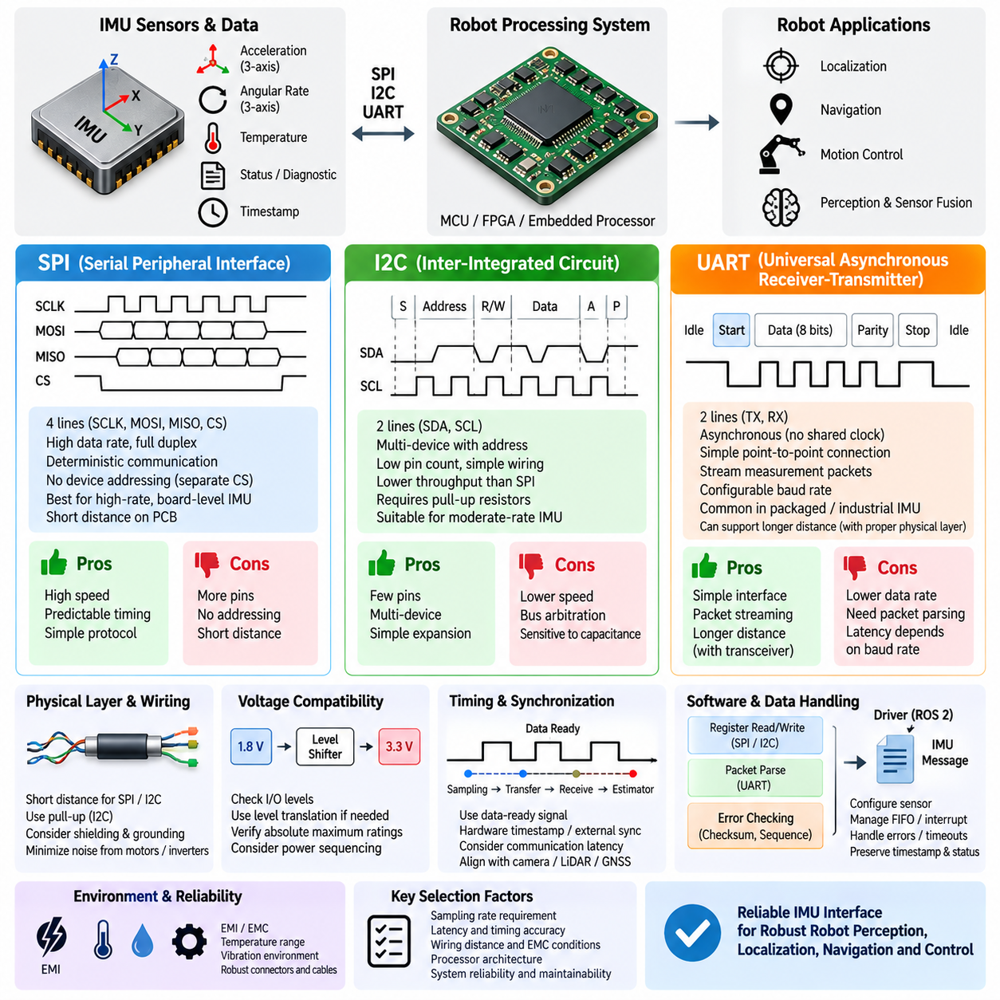
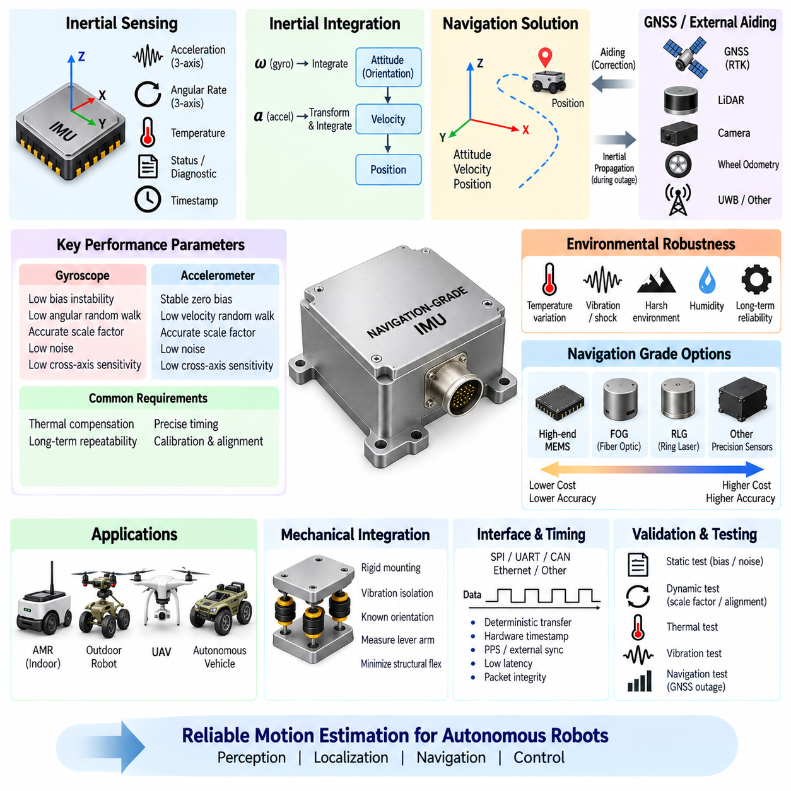
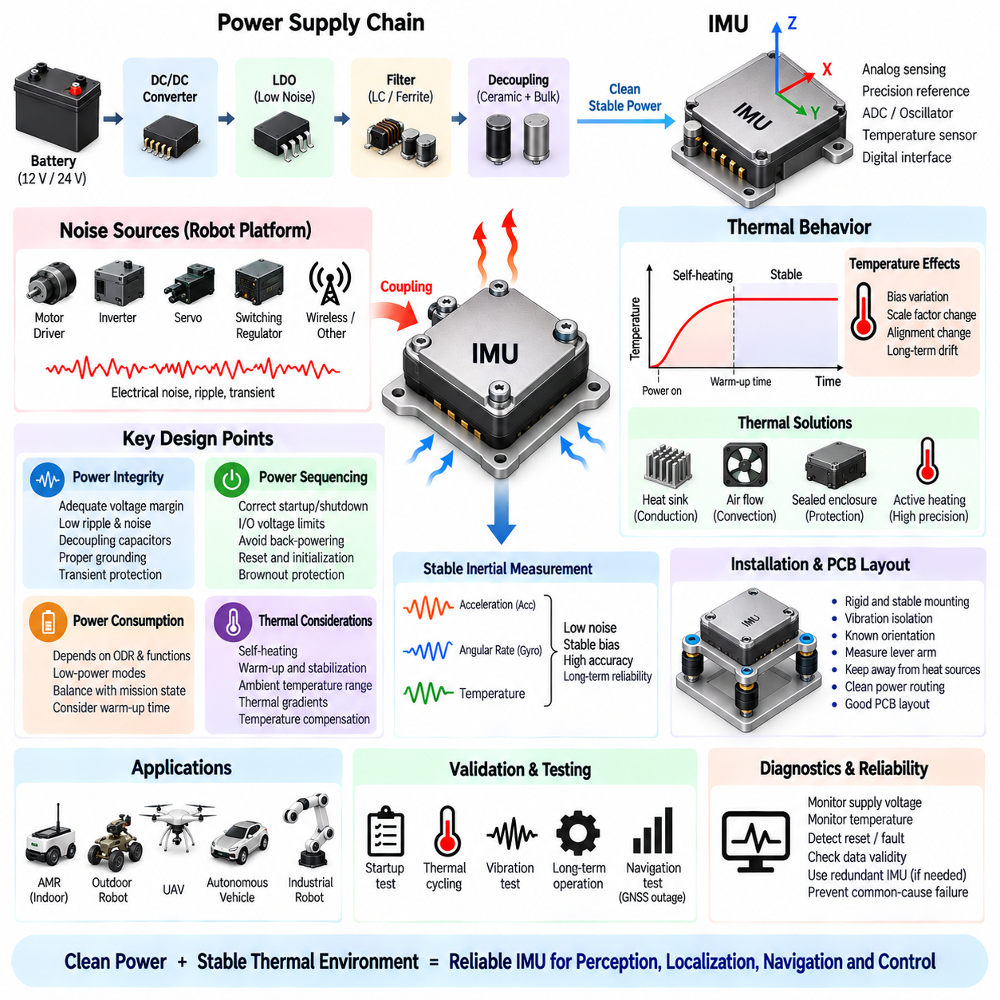

**Volume 15 Perception and Sensor Architecture**

# Chapter 08. IMU

## 08.01. MEMS IMU Selection

{width="7.268055555555556in" height="7.268055555555556in"}

로봇 인지 아키텍처(Robotic Perception Architecture)를 위한 MEMS 관성 측정 장치(MEMS Inertial Measurement Unit, MEMS IMU)의 선정은 단순히 사양표에서 가장 높은 정확도를 가진 장치를 고르는 것이 아니라, 측정해야 하는 운동 특성을 정의하는 것에서 시작한다. MEMS IMU는 일반적으로 3축 가속도계(Three-Axis Accelerometer)와 3축 자이로스코프(Three-Axis Gyroscope)를 결합하며, 일부 장치는 자기계(Magnetometer)도 통합한다. 필요한 센서 등급은 플랫폼의 동역학(Vehicle Dynamics), 항법 목표(Navigation Objectives), 운용 환경(Operating Environment), 센서 융합 아키텍처(Fusion Architecture), 허용 가능한 위치 및 자세 드리프트(Drift)에 따라 결정된다.

가속도계 측정 범위(Accelerometer Range)는 정상적인 플랫폼 운동뿐만 아니라 짧은 시간 동안 발생하는 충격까지 빈번한 포화(Saturation) 없이 측정할 수 있어야 한다. 저속으로 운행하는 실내 자율이동로봇(Indoor AMR)은 중간 수준의 가속도 범위로도 충분할 수 있지만, 실외 로봇(Outdoor Robot), 사족보행로봇(Quadruped), 매니퓰레이터(Manipulator), 무인항공기(UAV)는 훨씬 큰 순간적인 하중을 경험할 수 있다. 그러나 지나치게 넓은 측정 범위는 유효 분해능(Effective Resolution)을 낮추므로, 정상 운용 영역에서 감도를 유지하면서 충분한 기계적 여유를 제공하는 장치를 선택해야 한다.

자이로스코프 측정 범위(Gyroscope Range)는 플랫폼에서 예상되는 최대 각속도(Maximum Angular Velocity)에 따라 선정한다. 천천히 회전하는 물류용 자율이동로봇(Logistics AMR)은 민첩하게 기동하는 무인항공기(UAV)나 동적으로 움직이는 다족보행로봇(Legged Robot)보다 훨씬 낮은 각속도 측정 능력으로도 충분하다. 급격한 회전 중 발생하는 포화는 자세 추정(Attitude Estimation)과 추측 항법(Dead Reckoning)을 손상시킬 수 있지만, 불필요하게 넓은 측정 범위 역시 유효 측정 분해능을 감소시킬 수 있다. 따라서 정상 운용뿐 아니라 기계적 동특성과 비상 기동까지 함께 고려해야 한다.

바이어스 안정성(Bias Stability)은 IMU가 위치 추정(Localization)이나 항법(Navigation)을 지원할 때 가장 중요한 성능 지표 중 하나이다. 작은 자이로스코프 바이어스(Gyroscope Bias)도 적분되면서 지속적으로 증가하는 방향 오차를 발생시키며, 가속도계 바이어스(Accelerometer Bias)는 관성 적분(Inertial Integration) 과정에서 속도와 위치 오차를 빠르게 증가시킬 수 있다. 데이터시트에는 초기 바이어스(Initial Bias), 바이어스 반복성(Bias Repeatability), 운용 중 바이어스 안정성(In-Run Bias Stability), 온도 의존 바이어스(Temperature-Dependent Bias)가 별도로 표시될 수 있으므로, 후보 장치를 비교할 때 이들을 동일한 지표로 취급해서는 안 된다.

잡음 밀도(Noise Density)는 가속도계와 자이로스코프 측정값에 포함되는 단기적인 랜덤 잡음(Random Noise)을 나타내며, 추정되는 운동 상태의 품질에 직접적인 영향을 준다. 일반적으로 잡음이 낮을수록 자세, 속도 및 위치 추정 성능이 향상되며, 특히 IMU를 높은 주파수로 샘플링할 때 이러한 특성이 중요해진다. 각도 랜덤 워크(Angular Random Walk)와 속도 랜덤 워크(Velocity Random Walk)는 항법 성능 분석에 유용한 추가적인 지표이다. 따라서 IMU 선정에서는 순간적인 잡음 사양뿐만 아니라 시간에 따라 누적되는 오차 특성도 함께 고려해야 한다.

샘플링 주파수(Sampling Frequency)와 내부 대역폭(Internal Bandwidth)은 로봇의 동특성과 후단의 상태 추정 알고리즘(Estimation Algorithm)에 적합해야 한다. IMU는 일반적으로 카메라(Camera), 라이다(LiDAR), 고수준 인지 파이프라인(High-Level Perception Pipeline)보다 높은 주파수로 동작하며, 상대적으로 느린 센서의 업데이트 사이에서 고속의 관성 정보를 제공한다. 그러나 높은 출력 속도(Output Rate)는 인터페이스 대역폭, 타임스탬프(Timestamp) 품질, 프로세서 부하, 필터링(Filtering), 추정기 업데이트 주파수까지 전체 센서 아키텍처에서 일관되게 설계될 때 의미가 있다.

MEMS IMU는 진동(Vibration)의 영향을 크게 받을 수 있다. 기계적 진동 에너지가 가속도계와 자이로스코프의 감지 구조에 전달되어 측정 잡음이나 바이어스로 나타날 수 있기 때문이다. 모터(Motor), 기어박스(Gearbox), 휠(Wheel), 프로펠러(Propeller), 펌프(Pump), 구조물 공진(Structural Resonance)은 로봇 플랫폼에서 대표적인 진동 발생원이다. 따라서 장치 선정 시 진동 민감도(Vibration Sensitivity), 내부 필터링, 충격 정격(Shock Rating), 기계적 패키지 특성을 검토해야 하며, 최종 시스템에서는 별도의 장착 및 진동 절연(Vibration Isolation) 설계도 함께 수행해야 한다.

온도 성능(Temperature Performance)은 넓은 환경 온도 변화에 노출되는 실외 자율이동로봇(Outdoor AMR), 무인항공기(UAV), 산업용 로봇(Industrial Robot)에서 특히 중요하다. MEMS 센서의 바이어스, 스케일 팩터(Scale Factor), 잡음 특성은 온도에 따라 변화하며, 저가형 장치는 예열(Warm-Up) 과정이나 급격한 온도 변화에서 상당한 드리프트를 나타낼 수 있다. 적절한 IMU는 플랫폼의 운용 조건에 적합한 동작 온도 범위를 제공해야 하며, 가능하면 목표 온도 범위 전체에 대한 공장 보정(Factory Calibration) 또는 온도 보상(Temperature Compensation) 기능을 갖추는 것이 바람직하다.

스케일 팩터 오차(Scale-Factor Error)는 측정된 가속도나 각속도가 실제 물리 입력을 얼마나 정확하게 추종하는지를 나타낸다. 축간 민감도(Cross-Axis Sensitivity)는 서로 직교하는 센서 축 사이에서 발생하는 원하지 않는 결합을 의미하며, 축 정렬 오차(Axis Misalignment)는 내부 센서 축과 가정된 좌표계(Coordinate Frame) 사이의 기하학적 편차를 의미한다. 이러한 오차는 고정밀 위치 추정이 요구될수록 중요해지며, 기계적 정렬, 교정 절차(Calibration Procedure), 센서 융합 보상(Sensor-Fusion Compensation)과 함께 고려해야 한다.

인터페이스 선정(Interface Selection)은 전기적 통합뿐 아니라 타이밍 성능(Timing Performance)에도 영향을 준다. MEMS IMU는 장치 등급에 따라 일반적으로 SPI, I2C, UART, CAN 등의 인터페이스를 제공한다. SPI는 결정론적이고 비교적 빠른 통신이 가능하기 때문에 긴밀하게 통합된 임베디드 시스템(Embedded System)에 적합하며, UART나 CAN은 패키지형 산업용 IMU(Packaged Industrial IMU)의 통합을 단순화할 수 있다. 인터페이스를 선택할 때에는 케이블 길이, 전자기 환경(Electromagnetic Environment), 업데이트 속도, 지연 시간(Latency), 동기화 요구사항(Synchronization Requirements)을 함께 고려해야 한다.

다중 센서 로봇(Multi-Sensor Robot)에서는 타임스탬프 정확도(Timestamp Accuracy)가 원시 측정 정확도만큼 중요할 수 있다. 가속도 및 각속도 샘플을 카메라 프레임, 라이다 스캔, 레이더 측정, GNSS 관측값과 정확하게 시간 정렬하지 못한다면 우수한 IMU도 낮은 센서 융합 성능을 나타낼 수 있다. 따라서 센서 자체의 정밀도뿐 아니라 하드웨어 데이터 준비 신호(Hardware Data-Ready Signal), 외부 동기화 입력(External Synchronization Input), 타임스탬프 지원, 클록(Clock) 특성, 결정론적 통신 지연(Deterministic Communication Latency)을 함께 검토해야 한다.

GNSS가 보조하는 실외 항법(GNSS-Assisted Outdoor Navigation)에서 IMU는 위성 신호의 품질이 일시적으로 저하되거나 신호가 손실되는 동안에도 유용한 운동 상태 추정을 유지해야 한다. 높은 수준의 바이어스 안정성과 온도 보상 성능은 추측 항법(Dead Reckoning)을 신뢰할 수 있는 시간 구간을 연장한다. 반면 실내 자율이동로봇(Indoor AMR)에서는 IMU가 주로 라이다 또는 비전 기반 위치 추정(LiDAR or Visual Localization)에 단기적인 자세 및 운동 제약 정보를 제공한다. 따라서 필요한 IMU 등급은 예상되는 센서 손실 시간과 센서 융합 시스템에서 IMU가 담당하는 역할을 기준으로 결정해야 한다.

기계적 패키징(Mechanical Packaging)은 실제 센서 성능에 직접적인 영향을 미친다. 소형 보드 레벨 IMU(Board-Level IMU)가 우수한 사양을 제공하더라도 모터, 냉각 팬, 유연한 패널 또는 구조적 공진 지점 근처에 설치하면 실제 성능이 크게 저하될 수 있다. 패키지형 산업용 장치는 비용과 질량이 증가하는 대신 더 우수한 환경 보호, 안정적인 장착면, 커넥터(Connector), 보정된 좌표계(Calibrated Coordinate Frame)를 제공할 수 있다. 따라서 설치 위치와 기계적 아키텍처를 전기 설계 이후가 아니라 초기 선정 단계부터 고려해야 한다.

전력 소비(Power Consumption)는 일반적으로 카메라, 라이다, GPU 컴퓨터에 비해 작지만 배터리 기반 로봇과 무인항공기에서는 여전히 중요한 요소이다. 전원 아키텍처(Power Architecture)는 깨끗하고 안정적인 전원을 제공해야 하는데, 스위칭 잡음(Switching Noise)과 접지 교란(Ground Disturbance)이 민감한 관성 측정값을 저하시킬 수 있기 때문이다. 따라서 부품 선정 단계에서 공급 전압 허용 범위, 기동 특성, 절전 모드(Sleep Mode), 브라운아웃 복구(Brownout Recovery), 소비 전류, 접지(Grounding), 로컬 디커플링(Local Decoupling) 요구사항을 평가해야 한다.

신뢰성 요구사항(Reliability Requirements)은 대상 플랫폼에 따라 크게 달라진다. 산업용 자율이동로봇은 긴 운용 수명과 지속적인 진동에 대한 내성이 요구될 수 있으며, 실외 차량은 환경적 견고성(Environmental Robustness)이 중요하다. 무인항공기는 여기에 질량, 충격 내성, 이중화(Redundancy)를 추가적으로 고려해야 한다. 안전 중심 시스템에서는 두 개 또는 세 개의 독립적인 IMU를 사용하여 센서 간 불일치를 감지할 수 있으며, 이러한 아키텍처에서는 전원, 통신, 장착 및 고장 모드(Failure Mode)의 독립성이 센서 정확도만큼 중요할 수 있다.

따라서 실질적인 IMU 비교에서는 측정 범위, 분해능, 잡음 밀도, 바이어스 안정성, 랜덤 워크(Random Walk), 스케일 팩터 오차, 축간 민감도, 대역폭, 출력 속도, 온도 특성, 진동 민감도, 충격 내성, 동기화 기능, 통신 인터페이스, 전력 소비, 패키지 설계, 신뢰성, 공급 가능성(Availability), 비용을 하나의 시스템 수준 절충 관계(System-Level Tradeoff)로 평가해야 한다. 단 하나의 데이터시트 수치만으로 특정 IMU가 로봇 인지 시스템에 적합한지를 판단할 수는 없다.

최종 선정 결과는 제조업체의 사양만을 기준으로 확정하지 않고 실제 운용 환경을 대표하는 운동 프로파일(Motion Profile)을 이용하여 검증해야 한다. 후보 IMU를 동시에 기록하면서 정지 상태, 제어된 회전, 가속, 온도 변화, 진동 노출, 실제 로봇 주행 조건에서 비교할 수 있다. 앨런 편차(Allan Deviation)와 장시간 정지 측정은 확률적 오차 특성을 분석하는 데 유용하며, 신뢰할 수 있는 기준 센서(Reference Sensor)와의 비교를 통해 바이어스, 스케일 팩터, 동적 추종 오차(Dynamic Tracking Error)를 정량적으로 평가할 수 있다.

MEMS IMU의 선정은 궁극적으로 인지 및 위치 추정 스택(Perception and Localization Stack)에 제공되는 고속 운동 기준 정보(High-Rate Motion Reference)의 품질을 결정한다. 올바른 장치는 반드시 가장 비싸거나 가장 정확한 센서가 아니라, 동적 측정 범위, 안정성, 대역폭, 환경 특성, 타이밍, 인터페이스, 신뢰성이 로봇의 운용 요구사항과 가장 적절하게 일치하는 장치이다. 적절한 IMU 선정은 이후의 진동 절연(Vibration Isolation), 인터페이스 설계(Interface Design), 항법 등급 통합(Navigation-Grade Integration), 전원 설계(Power Design), 교정(Calibration), 다중 센서 융합(Multi-Sensor Fusion)을 위한 기술적 기반이 된다.

## 08.02. Vibration Isolation Mount

{width="7.268055555555556in" height="7.268055555555556in"}

관성 측정 장치(Inertial Measurement Unit, IMU)를 위한 진동 절연 마운트(Vibration Isolation Mount)는 로봇 구조물에서 발생하는 기계적 진동(Mechanical Vibration)이 민감한 가속도계(Accelerometer)와 자이로스코프(Gyroscope) 소자로 전달되는 것을 줄이기 위해 설계된다. 모터(Motor), 기어박스(Gearbox), 휠(Wheel), 트랙(Track), 프로펠러(Propeller), 냉각 팬(Cooling Fan), 펌프(Pump), 구조적 공진(Structural Resonance)은 광대역 또는 주기적인 가진(Excitation)을 발생시킬 수 있다. 적절한 절연이 없으면 이러한 교란이 잘못된 가속도, 각속도 잡음, 바이어스 변화 또는 불안정한 항법 추정값으로 나타날 수 있다.

진동 절연(Vibration Isolation)의 기본 원리는 IMU와 진동하는 구조물 사이에 유연한 기계 요소(Compliant Mechanical Element)를 배치하는 것이다. 일반적으로 엘라스토머(Elastomer), 고무(Rubber), 실리콘(Silicone), 폴리머(Polymer), 스프링(Spring) 또는 복합 감쇠 구조(Combined Damping Structure)를 사용하며, 이러한 요소는 IMU 어셈블리와 함께 질량-스프링-댐퍼 시스템(Mass-Spring-Damper System)을 형성한다. 적절하게 설계하면 센서의 물리적 방향과 위치를 유지할 수 있는 충분한 강성을 확보하면서 절연 영역 이상의 진동을 감쇠할 수 있다.

장착된 IMU의 고유진동수(Natural Frequency)는 매우 중요한 설계 파라미터이다. 이는 주로 센서 어셈블리의 유효 질량(Effective Mass)과 절연 재료의 강성(Stiffness)에 의해 결정된다. 가진 주파수(Excitation Frequency)가 마운트의 고유진동수에 가까워지면 공진(Resonance)이 발생하여 진동을 억제하는 대신 증폭할 수 있다. 따라서 모터, 휠, 기어박스 또는 프로펠러에서 발생하는 주요 진동 주파수가 마운트의 공진 주파수로부터 충분히 분리되도록 절연 시스템을 설계해야 한다.

전달률(Transmissibility)은 로봇 구조물에서 발생한 진동이 마운트를 통과하여 IMU까지 얼마나 전달되는지를 나타낸다. 낮은 가진 주파수에서는 센서가 지지 구조물의 움직임을 따라가는 경향이 있으며, 이는 실제 플랫폼 동역학을 측정하기 위해 필요하다. 공진 부근에서는 전달률이 1보다 커져 진동이 증폭될 수 있다. 반면 공진 주파수보다 충분히 높은 영역에서는 절연 마운트가 효과적으로 작동하기 시작하며 센서에 전달되는 진동을 점진적으로 감소시킨다.

감쇠(Damping)는 공진의 크기와 장착된 센서의 과도 응답(Transient Behavior)을 제어한다. 감쇠가 부족하면 큰 공진 피크(Resonance Peak)가 발생할 수 있으며, 반대로 지나치게 큰 감쇠는 고주파 영역의 진동 절연 성능을 저하시킬 수 있다. 엘라스토머 마운트(Elastomeric Mount)는 탄성과 감쇠 특성을 동시에 제공하기 때문에 로봇 시스템에 실용적이다. 재료 경도, 형상, 두께, 압축량, 온도 특성, 노화(Aging), 장착 예압(Preload)이 완성된 설치 구조의 유효 강성과 감쇠 특성을 결정한다.

진동 절연은 IMU가 측정해야 하는 실제 강체 운동(Rigid-Body Motion)을 제거해서는 안 된다. 지나치게 부드러운 마운트는 가속, 제동, 조향 또는 자세 변화 과정에서 센서가 로봇 섀시(Chassis)와 독립적으로 움직이도록 만들 수 있다. 이러한 상대 운동(Relative Motion)은 위치 추정 및 제어 알고리즘에 위상 지연(Phase Delay)과 측정 오차를 발생시킨다. 따라서 설계 목표는 플랫폼의 의미 있는 저주파 운동은 정확하게 보존하면서 불필요한 구조 진동만 선택적으로 감쇠하는 것이다.

절연 장치를 선정하기 전에 대표적인 운용 조건에서 진동원을 특성화해야 한다. 정지 운전, 가속, 최고 속도 주행, 선회, 제동, 장애물 통과, 매니퓰레이터(Manipulator) 동작 또는 무인항공기(UAV) 추진 시스템 운전 중 측정한 주파수 스펙트럼(Frequency Spectrum)을 통해 주요 가진 주파수와 구조적 공진을 파악할 수 있다. 이러한 정보는 단순히 재료의 경도만을 기준으로 절연재를 선정하는 것보다 중요하며, 실제 플랫폼의 진동 환경에 맞추어 마운트를 설계할 수 있게 한다.

휠 기반 자율이동로봇(Wheel-Driven AMR)은 모터 회전, 기어 맞물림(Gear Meshing), 타이어 변형, 휠 불균형(Wheel Imbalance), 바닥 불규칙성, 연결부 또는 장애물 충격으로 인해 진동이 발생하는 경우가 많다. 실외 자율이동로봇(Outdoor AMR)은 거친 지형, 자갈, 연석(Curb), 서스펜션(Suspension) 운동으로 인한 더 강한 충격 가진을 경험한다. 따라서 IMU는 가능한 경우 차량 기준점(Vehicle Reference Point)에 가까우면서 주요 진동원으로부터 떨어진, 구조적으로 안정된 섀시 영역에 설치해야 한다.

무인항공기(UAV)의 진동 절연은 추진 시스템이 모터와 프로펠러 회전 속도에 연관된 강한 주기적 가진을 발생시키기 때문에 다른 형태의 문제를 가진다. 고조파(Harmonics)는 넓은 주파수 영역으로 확장되며 기체 구조의 고유 모드(Structural Mode)와 상호작용할 수 있다. IMU 마운트는 자세 제어(Attitude Control)를 저하시킬 정도의 과도한 유연성을 발생시키지 않으면서 진동을 감쇠해야 한다. 따라서 프로펠러 밸런싱(Propeller Balancing), 모터 상태, 프레임 강성(Frame Stiffness), 디지털 필터링(Digital Filtering), 기계적 절연(Mechanical Isolation)을 상호 보완적인 대책으로 다루어야 한다.

장착 위치(Mounting Location)는 절연 장치 자체만큼 중요하다. IMU를 모터 브래킷(Motor Bracket), 기어박스 하우징(Gearbox Housing), 유연한 패널, 냉각 팬 또는 진동 진폭이 큰 구조적 지점에 설치하면 절연 시스템의 능력을 초과할 수 있다. 일반적으로 강성이 높은 중앙 구조물이 더 안정적인 기준을 제공한다. 항법 응용에서는 로봇 좌표계(Robot Coordinate Frame)에 대한 센서 위치도 정확하게 알고 있어야 하는데, 회전 운동 중 센서의 병진 오프셋(Translational Offset)이 측정 가능한 가속도를 발생시키기 때문이다.

절연 구조가 적용된 이후에도 IMU의 방향(Orientation)은 기계적으로 반복 가능하게 유지되어야 한다. 부드러운 마운트는 조립, 유지보수, 충격 또는 장기간 운용 과정에서 작은 회전이나 위치 이동을 허용할 수 있다. 이러한 변화는 센서 좌표계(Sensor Coordinate Frame)와 로봇 바디 좌표계(Robot Body Frame) 사이의 변환 관계를 변화시킨다. 기계적 위치 결정 구조(Mechanical Locating Feature), 제어된 체결 토크, 대칭형 장착 구조, 반복 가능한 설치 절차를 사용하면 유연 요소의 진동 절연 기능을 유지하면서 정렬 상태를 안정적으로 보존할 수 있다.

엘라스토머 선정(Elastomer Selection)에서는 진동 성능뿐만 아니라 환경 조건도 고려해야 한다. 온도 변화는 강성과 감쇠 특성을 변화시킬 수 있으며, 오일, 화학물질, 자외선(Ultraviolet), 습도, 노화는 시간이 지나면서 재료 특성을 변화시킬 수 있다. 상온에서 정상적으로 동작하는 마운트도 저온 환경에서는 상당히 단단해지거나 고온 환경에서는 지나치게 부드러워질 수 있다. 따라서 실외 로봇에서는 목표 운용 환경 범위 전체에서 검증된 절연 재료를 사용해야 한다.

기계적 예압(Mechanical Preload)은 엘라스토머 절연 장치의 특성에 상당한 영향을 준다. 과도한 압축은 강성을 증가시키고 고유진동수를 이동시키며 예상했던 절연 성능을 감소시킬 수 있다. 반대로 예압이 부족하면 움직임, 충돌 또는 기계적 구속 손실이 발생할 수 있다. 체결부가 절연 재료를 우회하는 의도하지 않은 강체 경로(Rigid Bypass)를 형성하면 진동이 센서에 직접 전달될 수 있으므로, 와셔(Washer), 부싱(Bushing), 슬리브(Sleeve), 장착 형상을 절연 시스템의 일부로 함께 설계해야 한다.

전기적 연결(Electrical Connection) 역시 기계적인 진동 전달 경로를 형성할 수 있다. 섀시와 절연된 IMU 사이에 단단하게 고정된 케이블 하니스(Cable Harness)는 마운트를 부분적으로 우회하여 센서 하우징으로 진동이나 힘을 전달할 수 있다. 따라서 유연한 케이블 구간, 적절한 서비스 루프(Service Loop), 제어된 커넥터 방향, 스트레인 릴리프(Strain Relief)를 사용하여 전원 및 통신 배선이 절연된 어셈블리의 움직임을 구속하지 않도록 해야 한다. 동시에 장기간 신뢰성을 위해 케이블 자체의 움직임도 적절하게 제어해야 한다.

기계적 절연은 디지털 신호 처리(Digital Signal Processing)와 함께 설계되어야 하며 필터링(Filtering)을 대체하는 수단으로 간주해서는 안 된다. IMU는 설정 가능한 저역통과필터(Low-Pass Filter), 앤티앨리어싱 필터(Anti-Aliasing Filter), 디지털 필터링 기능을 제공할 수 있으며, 위치 추정 시스템에서도 추가적인 추정 필터를 적용할 수 있다. 기계적 절연은 진동이 센서 소자에 도달하기 전에 감소시키고, 디지털 필터링은 샘플링 이후 측정값을 처리한다. 두 방법을 함께 사용하면 고주파 진동으로 인한 앨리어싱(Aliasing)과 비선형 센서 오차를 효과적으로 줄일 수 있다.

로봇은 연속적인 진동만으로 표현할 수 없는 충격(Shock)을 경험하기 때문에 충격 보호 역시 고려해야 한다. 휠 충격, 낙하, 충돌, 비상 정지, 착륙, 운송 과정에서는 짧은 시간 동안 매우 큰 가속도가 발생할 수 있다. 절연 마운트는 IMU에 전달되는 최대 충격을 감소시킬 수 있지만 충분한 기계적 이동 거리(Mechanical Travel)와 간극(Clearance)을 확보해야 한다. 과도한 변위를 제한하기 위해 하드 스톱(Hard Stop)을 적용할 수도 있지만 정상 운용 중 반복적인 충돌이 발생하지 않도록 설계해야 한다.

검증 과정에서는 섀시 진동과 절연된 IMU의 진동을 동시에 측정해야 한다. 지지 구조물과 센서 마운트에 가속도계를 설치하여 주파수에 따른 전달률을 계산할 수 있다. 시험에는 대표적인 운행 속도, 적재 하중(Payload), 노면, 온도, 동적 기동 조건이 포함되어야 한다. 측정된 스펙트럼을 통해 절연 시스템이 불필요한 주파수 성분을 억제하는지, 새로운 공진을 발생시키는지, 실제 차량 동역학이 존재하는 주파수 영역에서 과도한 센서 운동을 유발하는지를 확인할 수 있다.

최종 검증에서는 기계적 진동 자체뿐만 아니라 항법 및 인지 성능(Navigation and Perception Performance)도 평가해야 한다. 절연 적용 전후의 자이로스코프 잡음, 가속도계 잡음, 바이어스 특성, 자세 안정성, 위치 추정 드리프트(Localization Drift), 센서 융합 일관성(Sensor-Fusion Consistency)을 비교할 수 있다. 기계적으로 진동을 크게 감소시켰더라도 마운트가 과도한 위상 지연이나 상대 운동을 발생시킨다면 의미가 없다. 따라서 시스템 수준 성능(System-Level Performance)이 최종적인 절연 설계 승인 기준이 되어야 한다.

적절하게 설계된 진동 절연 마운트는 단순한 기계적 부속품이 아니라 IMU 측정 아키텍처(IMU Measurement Architecture)의 일부가 된다. 센서 선정, 장착 위치, 고유진동수, 감쇠, 재료 특성, 예압, 정렬, 케이블 라우팅(Cable Routing), 필터링, 환경 내구성, 검증을 하나의 시스템으로 함께 설계해야 한다. 최종 목표는 실제 로봇의 운동은 정확하게 추종하면서 인지(Perception), 위치 추정(Localization), 항법(Navigation), 제어(Control) 성능을 저하시킬 수 있는 진동과 충격은 효과적으로 제거하는 기계적으로 안정된 관성 기준(Inertial Reference)을 확보하는 것이다.

## 08.03. SPI/I2C/UART Interface

{width="7.268055555555556in" height="7.268055555555556in"}

IMU 인터페이스(IMU Interface)는 가속도, 각속도, 온도, 상태 정보, 타이밍 정보가 센서에서 로봇의 처리 시스템으로 어떻게 전달되는지를 결정한다. MEMS IMU는 일반적으로 SPI, I2C 또는 UART 인터페이스를 제공하며, 각 프로토콜은 대역폭(Bandwidth), 배선 복잡도(Wiring Complexity), 결정성(Determinism), 통신 거리, 소프트웨어 통합 측면에서 서로 다른 특성을 가진다. 따라서 인터페이스 선정은 전체 센싱 아키텍처(Sensing Architecture)에 필요한 샘플링 속도, 지연 시간, 물리적 배치, 신뢰성 요구사항을 정의하는 것에서 시작해야 한다.

직렬 주변장치 인터페이스(Serial Peripheral Interface, SPI)는 마이크로컨트롤러(MCU), FPGA 또는 임베디드 프로세서(Embedded Processor)에 직접 연결되는 보드 레벨 IMU(Board-Level IMU)에 널리 사용된다. 일반적으로 클록 라인(Clock Line), 컨트롤러-장치 데이터 라인, 장치-컨트롤러 데이터 라인, 칩 선택 신호(Chip-Select Signal)를 사용한다. 클록이 호스트에 의해 직접 제어되고 통신이 일반적으로 전이중(Full Duplex)으로 이루어지므로, SPI는 예측 가능한 데이터 전송과 비교적 높은 데이터 전송률을 제공하여 고주파 관성 데이터 수집에 적합하다.

SPI에는 I2C와 같은 프로토콜 수준의 장치 주소 지정(Device Addressing) 기능이 없기 때문에 개별 주변장치는 일반적으로 별도의 칩 선택 신호를 필요로 한다. 여러 센서가 동일한 버스를 공유하면 신호선 수가 증가하지만, 컨트롤러가 특정 시점에 어떤 장치와 통신할지를 명확하게 제어할 수 있다는 장점이 있다. 결정론적 샘플링(Deterministic Sampling)이 필요한 IMU에서는 이러한 구조가 트랜잭션 스케줄링(Transaction Scheduling)을 단순화하고 관성 측정 데이터와 다른 주변장치 트래픽 사이의 경합을 줄일 수 있다.

실제 SPI 클록 속도는 IMU 사양, 프로세서 성능, 인쇄회로기판 배선(PCB Routing), 신호 무결성(Signal Integrity), 전기적 부하에 의해 제한된다. 높은 클록 주파수가 자동으로 항법 성능을 향상시키는 것은 아니며, 실제 이점은 센서 출력 데이터 속도(Output Data Rate)와 추정기(Estimator)의 요구사항에 따라 결정된다. 지나치게 빠른 신호 에지나 긴 배선은 링잉(Ringing), 누화(Crosstalk), 전자기 간섭(Electromagnetic Interference), 타이밍 마진 문제를 발생시킬 수 있다. 따라서 SPI는 전자 어셈블리 내부의 비교적 짧은 연결에 가장 적합하다.

집적회로 간 통신(Inter-Integrated Circuit, I2C)은 직렬 데이터(Serial Data)와 직렬 클록(Serial Clock)의 두 개 주요 신호선만 사용한다. 여러 장치는 프로토콜 수준의 주소를 통해 동일한 신호선을 공유할 수 있으므로 가속도계, 자이로스코프, 자기계(Magnetometer), 온도 센서 및 기타 주변장치를 하나의 공통 버스에 연결할 수 있다. 이러한 적은 핀 수는 최대 통신 처리량보다 배선 단순성과 주변장치 확장성이 중요한 소형 임베디드 설계에 유리하다.

I2C 신호선은 장치가 두 논리 상태를 모두 능동적으로 구동하는 대신 신호를 낮은 상태로 끌어내리는 방식으로 동작하기 때문에 일반적으로 풀업 저항(Pull-Up Resistor)을 사용한다. 풀업 저항값, 버스 정전용량(Bus Capacitance), 공급 전압, 장치 수, 배선 길이, 선택된 클록 속도가 신호 상승 시간과 통신 신뢰성을 결정한다. 짧은 개발 보드에서는 정상적으로 동작하던 설계도 장치가 추가되거나 배선이 길어지면 불안정해질 수 있으므로, 전기적 버스 부하를 센서 아키텍처의 일부로 평가해야 한다.

SPI와 비교하면 I2C는 일반적으로 낮은 유효 처리량(Effective Throughput)을 제공하며 공유 버스 중재(Shared-Bus Arbitration)와 주소 지정에 따른 오버헤드가 발생한다. 이는 중간 수준의 관성 센싱, 설정 레지스터(Configuration Register), 보조 센서 또는 소형 실내 로봇 시스템에서는 충분히 허용될 수 있다. 그러나 항법이나 제어에 사용되는 고속 IMU에서는 가속도계, 자이로스코프, 온도, 상태, 타임스탬프 데이터를 읽는 작업이 과도한 버스 시간을 소비하거나 가변적인 지연을 발생시키지 않는지 주의 깊게 평가해야 한다.

범용 비동기 송수신기(Universal Asynchronous Receiver-Transmitter, UART)는 송신기와 수신기 사이에 일반적으로 공유 클록이 필요하지 않다는 점에서 SPI 및 I2C와 다르다. 양측은 전송 속도(Baud Rate), 데이터 길이, 패리티(Parity), 정지 비트(Stop Bit) 등의 통신 파라미터를 사전에 일치시킨다. 패키지형 IMU와 산업용 관성 센서(Industrial Inertial Sensor)는 단순한 지점 간 인터페이스(Point-to-Point Interface)를 제공하고 내부 레지스터만 노출하는 대신 완전한 측정 패킷을 전송할 수 있기 때문에 직렬 통신을 자주 사용한다.

UART 기반 IMU는 설정된 출력 주파수에 따라 가속도, 각속도, 자세, 온도, 타임스탬프, 진단 정보를 연속적으로 스트리밍할 수 있다. 이를 통해 호스트가 반복적으로 레지스터 읽기 트랜잭션을 시작할 필요가 줄어든다. 그러나 수신 프로세서는 패킷을 해석하고, 프레이밍 오류(Framing Error)나 체크섬 오류(Checksum Error)를 검출하며, 수신 버퍼를 관리하고, 입력되는 측정값을 로봇의 타이밍 시스템과 연계해야 한다. 따라서 패킷 구조와 오류 검출 기능이 중요한 선정 기준이 된다.

전송 속도(Baud Rate)는 UART의 최대 원시 데이터 전송 용량을 결정한다. 필요한 전송 속도는 패킷 크기, 출력 주파수, 프레이밍 오버헤드(Framing Overhead), 충분한 운용 여유를 고려하여 계산해야 한다. 큰 패킷을 높은 주파수로 전송하는 센서는 낮은 전송 속도의 연결에서 실질적인 한계에 접근할 수 있다. 이 경우 센서 또는 호스트 내부의 버퍼링(Buffering)이 명목상의 샘플링 속도에서는 명확하게 드러나지 않는 지연을 발생시킬 수 있으므로, 통신 처리량과 종단 간 타이밍(End-to-End Timing)을 함께 평가해야 한다.

물리적 통신 거리(Physical Distance)는 인터페이스 선택에 큰 영향을 준다. 보드 레벨 SPI와 I2C는 일반적으로 짧은 전기적 연결을 위해 설계되며, 배선이 길어질수록 정전용량, 잡음, 접지 전위차(Ground Difference), 전자기 간섭에 더욱 민감해진다. UART의 로직 레벨 신호도 실질적인 거리 제한을 가지지만, 필요한 경우 보다 견고한 물리 계층(Physical Layer)을 통해 UART 데이터를 전송할 수 있다. 따라서 패키지형 산업용 센서에서는 긴 로봇 하니스(Harness)에 대응하기 위해 직렬 패킷 통신과 차동 전기 인터페이스(Differential Electrical Interface)를 결합할 수 있다.

로봇 IMU에서는 통신 지연(Communication Latency)과 센서 샘플링 지연(Sensor Sampling Latency)을 구분해야 한다. 측정값은 먼저 MEMS 감지 소자에 의해 획득되고 내부 필터링을 거친 후 레지스터 또는 선입선출 버퍼(First-In First-Out, FIFO)에 저장된다. 이후 인터페이스를 통해 전송되고 프로세서가 이를 수신한 다음 최종적으로 추정기에 전달된다. 이러한 전체 경로에서 발생하는 지연이 관성 측정값과 카메라, 라이다(LiDAR), 레이더(Radar), GNSS 관측값 사이의 시간적 관계를 결정한다.

데이터 준비 신호(Data-Ready Signal)는 새로운 관성 샘플이 준비되었음을 프로세서에 알려 줌으로써 타이밍 특성을 향상시킬 수 있다. SPI 또는 I2C에서는 호스트가 이 신호에 응답하여 레지스터를 지속적으로 폴링(Polling)하는 대신 즉시 측정값을 읽을 수 있다. FIFO 기능은 여러 샘플을 저장하여 프로세서 인터럽트 부하를 줄일 수 있지만, 저장된 여러 샘플을 한 번에 읽는다고 해서 이들이 동일한 시점에 물리적으로 측정된 것은 아니므로 세심한 타임스탬프 관리가 필요하다.

IMU가 다중 센서 융합(Multi-Sensor Fusion)에 참여할 경우 시간 동기화(Time Synchronization)는 특히 중요해진다. 트랜잭션 이후 생성되는 소프트웨어 타임스탬프(Software Timestamp)에는 운영체제, 드라이버, 통신 과정에서 발생하는 예측하기 어려운 지연이 포함될 수 있다. 하드웨어 타임스탬프(Hardware Timestamp), 외부 동기화 입력(External Synchronization Input), 데이터 준비 신호 에지(Data-Ready Edge), 동기화된 클록(Synchronized Clock)은 실제 측정 시점을 더욱 정확하게 표현할 수 있다. 따라서 인터페이스 선정에서는 통신 대역폭만이 아니라 타이밍 기능도 함께 고려해야 한다.

신호 무결성은 로봇의 전자기 적합성(Electromagnetic Compatibility, EMC)과 함께 고려해야 한다. 모터 인버터(Motor Inverter), DC/DC 컨버터(DC/DC Converter), 스위칭 전원 공급장치(Switching Power Supply), 서보(Servo), 릴레이(Relay), 대전류 배터리 배선, 통신 네트워크는 IMU 연결부 주변에 전기적 교란을 발생시킬 수 있다. 짧은 배선, 적절한 접지, 제어된 리턴 경로(Return Path), 디커플링(Decoupling), 잡음 발생 배선과의 분리, 적절한 차폐(Shielding) 또는 차동 신호 방식을 적용하면 통신 오류가 간헐적인 항법 장애로 발전하는 것을 방지할 수 있다.

전압 호환성(Voltage Compatibility) 역시 기본적인 통합 요구사항이다. 프로세서와 IMU가 동일한 논리 프로토콜을 지원하더라도 서로 다른 입출력 전압 레벨(I/O Voltage Level)로 동작할 수 있다. 설계자는 절대 최대 정격(Absolute Maximum Rating), 입력 임계값, 출력 레벨, 풀업 전압, 전원 시퀀싱(Power Sequencing), 레벨 변환(Level Translation)의 필요 여부를 확인해야 한다. 인터페이스 전압을 잘못 가정하면 소프트웨어 설정이 올바르더라도 통신 불안정이나 영구적인 장치 손상이 발생할 수 있다.

소프트웨어 아키텍처(Software Architecture)도 선호되는 인터페이스에 영향을 준다. SPI 및 I2C IMU는 일반적으로 측정 범위, 대역폭, 필터, FIFO 동작, 인터럽트, 교정 파라미터를 설정하는 레지스터 수준 드라이버(Register-Level Driver)가 필요하다. UART 장치는 명령과 미리 정의된 출력 메시지를 사용하는 패킷 기반 프로토콜(Packet-Oriented Protocol)을 제공하는 경우가 많다. ROS 2 또는 다른 로봇 미들웨어(Robotic Middleware)에서는 저수준 드라이버가 이러한 트랜잭션을 일관되게 타임스탬프된 관성 메시지로 변환하면서 센서 상태와 진단 정보를 보존해야 한다.

IMU 자체는 정상적으로 동작하면서 통신 경로만 성능이 저하될 수도 있으므로 오류 처리(Error Handling)를 명시적으로 설계해야 한다. 시스템은 잘못된 패킷, 누락된 샘플, 반복 데이터, FIFO 오버플로(FIFO Overflow), 버스 타임아웃(Bus Timeout), 예상하지 못한 레지스터 값, 센서 리셋 이벤트를 검출해야 한다. 시퀀스 카운터(Sequence Counter), 체크섬(Checksum), 상태 레지스터(Status Register), 타임아웃 감시(Timeout Supervision), 타당성 검사(Plausibility Checking)를 사용하면 손상된 관성 데이터가 위치 추정, 항법 또는 제어 알고리즘으로 조용히 전달되는 것을 방지할 수 있다.

따라서 선호되는 인터페이스는 SPI, I2C, UART의 절대적인 성능 순위가 아니라 시스템 아키텍처에 따라 결정된다. SPI는 고속이며 결정론적인 보드 레벨 데이터 수집에 적합한 경우가 많고, I2C는 적은 핀 수와 공유 주변장치 연결성이 중요한 경우에 유리하다. UART는 패키지형 센서와의 패킷 기반 지점 간 통신에 편리하다. 최종 선택은 샘플링 요구사항, 타이밍 정확도, 배선 거리, EMC 환경, 프로세서 아키텍처, 유지보수성(Maintainability)을 기준으로 이루어져야 한다.

견고한 IMU 통합 설계에서는 전기적 인터페이스를 단순히 바이트(Byte)를 이동시키는 수단이 아니라 전체 측정 체인(Measurement Chain)의 일부로 다루어야 한다. 센서 대역폭, 출력 데이터 속도, 인터페이스 용량, 인터럽트 동작, FIFO 설계, 타임스탬프 생성, 신호 무결성, 전압 호환성, 드라이버 아키텍처, 고장 검출(Fault Detection)이 일관되게 동작해야 한다. 이러한 요소가 적절하게 조합되면 SPI, I2C 또는 UART를 통해 인지(Perception), 위치 추정(Localization), 항법(Navigation), 실시간 로봇 제어(Real-Time Robot Control)에 필요한 신뢰성 높은 관성 정보를 제공할 수 있다.

## 08.04. Navigation Grade IMU

{width="7.268055555555556in" height="7.268055555555556in"}

항법 등급 관성 측정 장치(Navigation-Grade Inertial Measurement Unit)는 외부 기준 정보가 사용할 수 없거나 성능이 저하되거나 일시적으로 중단된 상황에서도 정확한 자세, 속도, 위치 추정값을 유지하도록 설계된다. 소비자용 또는 기본 산업용 MEMS IMU와 달리 항법 등급 장치는 매우 낮은 바이어스 불안정성(Bias Instability), 낮은 랜덤 잡음(Random Noise), 정밀한 스케일 팩터(Scale Factor) 제어, 온도 보상(Thermal Compensation), 장기 반복성(Long-Term Repeatability)을 중시한다. 목적은 단순한 운동 감지가 아니라 가속도와 각속도의 연속적인 적분을 통해 신뢰성 높은 관성 항법(Inertial Navigation)을 지원하는 것이다.

일반적인 IMU와 항법 등급 IMU의 근본적인 차이는 관성 적분(Inertial Integration) 과정에서 명확하게 나타난다. 자이로스코프(Gyroscope) 측정값은 자세를 결정하기 위해 적분되고, 가속도 측정값은 항법 좌표계(Navigation Frame)로 변환된 후 속도와 위치를 추정하기 위해 적분된다. 매우 작은 센서 오차도 시간이 지나면서 누적되므로 바이어스 안정성, 각도 랜덤 워크(Angular Random Walk), 속도 랜덤 워크(Velocity Random Walk), 스케일 팩터 정확도, 축 정렬(Axis Alignment), 타이밍 품질이 지속적인 항법 성능을 결정하는 핵심 파라미터가 된다.

자이로스코프 바이어스(Gyroscope Bias)는 각속도 오프셋이 추정 자세를 지속적으로 변화시키기 때문에 특히 중요하다. 잘못된 자세는 중력(Gravity)이 수평 가속도 축으로 잘못 투영되도록 하여 추가적인 속도 및 위치 오차를 발생시킨다. 따라서 항법 등급 자이로스코프는 주로 운동 감지나 단기 안정화에 사용되는 센서보다 훨씬 우수한 바이어스 특성을 필요로 한다. 낮은 운용 중 바이어스 불안정성(In-Run Bias Instability)은 외부 보정 사이의 시간 동안 항법 해(Navigation Solution)의 유효성을 더 오래 유지할 수 있게 한다.

가속도계 바이어스(Accelerometer Bias)는 다른 형태이지만 동일하게 중요한 오차 메커니즘을 발생시킨다. 일정한 가속도 오프셋은 적분되어 속도 오차가 되고, 다시 적분되어 위치 오차로 증가한다. 순간 측정에서는 중요하지 않아 보이는 작은 바이어스도 GNSS 신호 단절이나 장시간 추측 항법(Dead Reckoning)에서는 지배적인 오차가 될 수 있다. 따라서 항법 등급 가속도계는 안정적인 영점 오프셋, 낮은 잡음, 정확한 스케일 팩터, 예측 가능한 온도 특성을 제공하여 이러한 누적 오차를 모델링하고 보상할 수 있어야 한다.

랜덤 잡음(Random Noise) 역시 항법 불확실성이 얼마나 빠르게 증가하는지를 결정한다. 자이로스코프의 각도 랜덤 워크는 각속도 잡음으로 발생하는 단기적인 자세 불확실성을 나타내며, 가속도계의 속도 랜덤 워크는 적분된 속도에서 발생하는 해당 불확실성을 나타낸다. 이러한 확률적 특성(Stochastic Characteristics)은 일반적으로 장시간 정지 측정과 앨런 편차 분석(Allan Deviation Analysis)을 통해 평가한다. 따라서 항법 성능은 단순한 분해능이나 명목 출력 속도만이 아니라 통계적인 오차 특성을 기준으로 평가해야 한다.

스케일 팩터 정확도(Scale-Factor Accuracy)는 플랫폼에 큰 가속도나 회전이 발생할 때 중요해진다. 자이로스코프 또는 가속도계가 실제 크기와 약간 다른 값을 출력하면 적용되는 운동이 커질수록 그에 따른 오차도 증가한다. 축간 민감도(Cross-Axis Sensitivity)와 센서 축 정렬 오차(Sensor-Axis Misalignment)는 한 축의 운동을 다른 축으로 전달할 수도 있다. 고품질 IMU는 공장 교정 행렬(Factory Calibration Matrix)과 보상 모델을 적용하여 바이어스, 스케일 팩터, 비직교성(Non-Orthogonality), 정렬 오차를 목표 운용 범위 전체에서 제어한다.

온도는 관성 센서에 가장 큰 영향을 주는 환경 요인 중 하나이다. MEMS 구조, 아날로그 전자회로, 기준 전압, 패키징 특성은 온도 변화에 따라 달라지며 바이어스와 스케일 팩터의 변화를 발생시킨다. 항법 등급 장치는 일반적으로 넓은 온도 범위에서 광범위한 공장 특성화(Factory Characterization)를 수행하고 내부에 보상 계수를 저장한다. 일부 설계에서는 기동, 실외 운용, 급격한 환경 온도 변화에서도 반복 가능한 성능을 유지하기 위해 제어된 열 특성 또는 내부 온도 모니터링(Temperature Monitoring)을 사용한다.

항법 등급 성능은 MEMS 기술만으로 정의되지 않는다. 임무 요구사항이 실질적인 MEMS 성능 한계를 초과하는 경우 고성능 관성 시스템은 광섬유 자이로스코프(Fiber-Optic Gyroscope), 링 레이저 자이로스코프(Ring-Laser Gyroscope), 공진형 장치(Resonant Device) 또는 다른 정밀 센싱 기술을 사용할 수 있다. 그러나 현대의 고성능 MEMS 장치는 크기, 중량, 전력 소비, 비용, 항법 정확도 사이의 균형이 필요한 자율주행차량, 산업용 로봇, 무인항공기(UAV), 이동 플랫폼에서 점점 더 높은 수준의 성능을 제공하고 있다.

IMU 측정값이 자세, 속도, 위치를 전파하는 항법 알고리즘을 통해 처리되면 관성 항법 시스템(Inertial Navigation System, INS)이 된다. 추정기(Estimator)는 중력, 필요한 경우 지구 관련 기준 좌표계(Earth-Related Reference Frame), 센서 바이어스, 좌표 변환(Coordinate Transformation), 누적 불확실성을 고려해야 한다. 따라서 항법 등급 하드웨어는 측정의 기반을 제공하지만 실제 항법 성능은 초기화, 교정(Calibration), 추정 알고리즘, 타이밍, 외부 보조 정보(External Aiding), 기계적 통합에 동일하게 의존한다.

GNSS와 IMU의 통합은 실외 자율주행 로봇과 차량에서 특히 중요하다. GNSS는 장기적인 절대 위치와 속도 기준을 제공하고, IMU는 GNSS 업데이트 사이에서 고속 운동 정보를 제공한다. 건물, 식생, 터널, 간섭 또는 안테나 차폐로 GNSS가 일시적으로 차단되면 관성 전파(Inertial Propagation)가 항법 해를 유지한다. GNSS가 복구되면 추정기는 외부 관측값을 이용하여 누적된 관성 오차를 보정하고 추정된 센서 바이어스를 갱신한다.

실시간 이동측위 GNSS(Real-Time Kinematic GNSS, RTK GNSS)는 양호한 조건에서 센티미터급 절대 위치 정확도를 제공할 수 있지만, 높은 위치 정확도가 고성능 IMU의 필요성을 제거하는 것은 아니다. RTK 가용성은 도심 협곡(Urban Canyon), 구조물 아래, 반사가 많은 환경 또는 보정 서비스와의 통신 단절 상황에서 저하될 수 있다. 항법 등급 IMU는 이러한 구간에서 항법 연속성을 향상시키고 자세, 속도, 운동 상태를 부드럽게 추정하도록 지원한다. 필요한 등급은 예상되는 최대 외부 기준 신호 단절 시간에 크게 좌우된다.

실내 로봇은 일반적으로 GNSS를 사용할 수 없기 때문에 항법 등급 관성 센싱을 다른 방식으로 활용한다. 라이다 동시적 위치추정 및 지도작성(LiDAR SLAM), 비주얼 오도메트리(Visual Odometry), 휠 오도메트리(Wheel Odometry), 초광대역(Ultra-Wideband, UWB) 또는 다른 위치 추정 시스템이 외부 제약 조건을 제공하고, IMU는 고주파 회전 및 병진 운동 정보를 제공한다. 빠른 선회, 특징이 부족한 환경, 일시적인 영상 품질 저하 또는 라이다 정합 불확실성 상황에서 안정적인 IMU는 추정기의 연속성을 향상시킨다. 따라서 센서 등급은 위치 보정의 예상 주기와 중단 시간에 맞추어 선정해야 한다.

무인항공기(UAV) 항법은 기체가 지속적으로 자세와 가속도를 변화시키면서 안정화를 위해 정확한 자세 추정에 의존하기 때문에 관성 센싱에 높은 성능을 요구한다. IMU는 빠른 각운동을 포화(Saturation) 없이 측정하면서 항법에 충분한 수준의 낮은 잡음과 바이어스를 유지해야 한다. 높은 등급의 시스템에서는 센서 간 불일치, 드리프트 또는 고장을 항법 오차가 비행 제어 기능으로 전파되기 전에 검출하기 위해 이중화 IMU(Redundant IMU)를 사용할 수 있다.

항법 등급 측정값은 획득 시점이 불확실하면 그 가치가 크게 감소하기 때문에 타이밍 정확도(Timing Accuracy)가 필수적이다. IMU 샘플은 GNSS 관측값, 카메라 프레임, 라이다 스캔, 레이더 측정 또는 다른 보조 센서와 정확하게 시간 정렬되어야 한다. 하드웨어 타임스탬프(Hardware Timestamp), 초당 펄스 신호(Pulse-Per-Second, PPS), 외부 동기화 입력, 정밀 클록(Precise Clock), 정밀 시간 프로토콜 기반 아키텍처(Precision Time Protocol, PTP)를 사용하면 시간 오차를 줄일 수 있다. 플랫폼이 빠르게 이동하거나 회전하는 상황에서는 타임스탬프 불확실성이 직접적인 공간 오차로 나타날 수 있다.

기계적 설치(Mechanical Installation) 역시 시스템 수준에서 항법 등급 성능을 달성할 수 있는지를 결정한다. IMU는 로봇 바디 좌표계(Robot Body Frame)에 대한 방향이 정확하게 알려진 강성이 높고 안정적인 구조물에 장착해야 한다. 정밀 항법이 필요한 경우 IMU, GNSS 안테나, 라이다, 카메라, 차량 기준점 사이의 레버 암 오프셋(Lever-Arm Offset)을 정확하게 측정해야 한다. 센서 자체의 사양이 매우 우수하더라도 진동, 구조적 휨(Structural Flex), 열 구배(Thermal Gradient), 장착 정렬 오차가 시스템 성능을 저하시킬 수 있다.

고성능 IMU에서는 진동 절연(Vibration Isolation)을 특히 신중하게 설계해야 한다. 기계적 절연은 모터, 기어박스, 휠 또는 추진 시스템에서 발생하는 진동을 억제할 수 있지만, 지나치게 유연한 마운트는 IMU와 차량 바디 사이에 상대 운동을 발생시킬 수 있다. 절연 시스템은 항법 추정기에 필요한 강체 운동(Rigid-Body Motion)을 보존하면서 불필요한 고주파 가진을 감쇠해야 한다. 따라서 기계 설계, 센서 대역폭, 디지털 필터링(Digital Filtering), 추정기 튜닝(Estimator Tuning)을 하나의 통합 시스템으로 개발해야 한다.

인터페이스 아키텍처(Interface Architecture)는 고속 관성 데이터를 결정론적이고 손실 없이 전달할 수 있어야 한다. IMU 등급에 따라 SPI, UART, CAN, 이더넷(Ethernet) 또는 전용 산업용 인터페이스가 사용될 수 있다. 항법 장치는 교정된 가속도, 각속도, 온도, 상태, 타임스탬프를 전송하며 경우에 따라 내부에서 계산한 자세 또는 항법 출력도 제공한다. 통신 대역폭, 패킷 무결성(Packet Integrity), 지연 시간, 동기화 기능, 고장 검출을 원시 센서 사양과 함께 평가해야 한다.

항법 정보가 자율주행이나 안전 관련 기능(Safety-Related Function)에 직접 사용될수록 신뢰성과 진단(Diagnostics)이 중요해진다. 항법 등급 IMU는 가능한 경우 센서 포화, 온도 한계, 내부 고장, 통신 오류, 초기화 상태, 성능 저하에 대한 상태 정보를 제공해야 한다. 이중화 센싱 아키텍처(Redundant Sensing Architecture)는 독립적인 관성 측정값을 비교하여 고장 채널을 분리할 수 있다. 그러나 이중화 설계에서는 공통 전원, 클록, 장착 구조, 열 환경, 진동으로 인한 공통 원인 고장(Common-Cause Failure)도 함께 고려해야 한다.

적절한 항법 등급을 선정하려면 임무 요구사항을 외부 기준 신호 단절 동안 허용 가능한 드리프트로 변환해야 한다. 초당 여러 번 신뢰성 높은 위치 보정을 받는 로봇은 GNSS, 라이다 또는 비전 업데이트 없이 수십 초에서 수분 동안 항법해야 하는 차량과 동일한 관성 성능을 필요로 하지 않는다. 따라서 필요한 센서 등급은 외부 기준 단절 시간, 속도, 기동 강도, 허용 위치 오차, 방위각 오차(Heading Error), 환경 조건, 크기, 중량, 전력, 비용을 기준으로 결정해야 한다.

검증(Validation)에는 정적, 동적, 열, 진동, 항법 수준 시험이 포함되어야 한다. 장시간 정지 데이터 기록을 통해 바이어스와 랜덤 잡음을 특성화할 수 있고, 제어된 회전 시험을 통해 스케일 팩터와 정렬 특성을 평가할 수 있으며, 열 시험을 통해 온도 보상 품질을 확인할 수 있다. 차량 시험에서는 의도적으로 GNSS 또는 위치 추정 신호 단절을 발생시키고 관성 전파 결과를 신뢰할 수 있는 기준 궤적(Reference Trajectory)과 비교해야 한다. 이를 통해 선정된 IMU가 실제 운용 조건에서 요구되는 항법 연속성을 제공하는지 직접 검증할 수 있다.

항법 등급 IMU는 궁극적으로 다중 센서 항법 아키텍처(Multi-Sensor Navigation Architecture)의 고속 관성 백본(High-Rate Inertial Backbone)으로 이해해야 한다. 그 가치는 안정적인 바이어스 특성, 낮은 잡음, 정확한 스케일 팩터, 온도 반복성, 정밀한 타이밍, 견고한 인터페이스, 세심한 기계적 통합, 절대 또는 상대 위치 센서와의 효과적인 융합에서 나온다. 임무 요구사항에 적절하게 선정된 항법 등급 IMU는 외부 인지 또는 위치 정보가 일시적으로 불확실해지는 상황에서도 자율 로봇, 실외 자율이동로봇(Outdoor AMR), 무인항공기(UAV), 기타 피지컬 AI 플랫폼(Physical AI Platform)이 신뢰성 높은 운동 상태 추정을 유지할 수 있도록 한다.

## 08.05. IMU Power and Thermal

{width="7.268055555555556in" height="7.268055555555556in"}

관성 측정 장치(Inertial Measurement Unit, IMU)의 전원 및 열 설계(Power and Thermal Design)는 측정 안정성, 기동 특성, 신뢰성, 장기적인 항법 정확도에 직접적인 영향을 준다. MEMS IMU는 카메라(Camera), 라이다(LiDAR), 레이더(Radar), GPU 컴퓨터보다 훨씬 적은 전력을 소비하지만, 내부의 아날로그 감지 소자(Analog Sensing Element)와 정밀 기준 회로(Precision Reference)는 전원 교란과 온도 변화에 민감하다. 따라서 전원 무결성(Power Integrity)과 열 안정성(Thermal Stability)은 부수적인 전기 문제가 아니라 관성 측정 아키텍처(Inertial Measurement Architecture)의 일부로 다루어야 한다.

IMU 전원 경로(Power Path)는 일반적으로 로봇 배터리 또는 안정화된 저전압 전력 분배망(Low-Voltage Distribution Network)에서 시작하여 하나 이상의 DC/DC 컨버터(DC/DC Converter), 저강하 레귤레이터(Low-Dropout Regulator, LDO), 필터(Filter), 로컬 디커플링 부품(Local Decoupling Component)을 거쳐 센서에 도달한다. 보드 레벨 MEMS 장치는 아날로그 및 디지털 전원 영역을 별도로 요구할 수 있으며, 패키지형 산업용 IMU는 더 넓은 입력 전압 범위를 수용하고 내부에서 전압을 조절하는 경우가 많다. 외부 아키텍처에서도 충분한 전압 여유, 과도현상 보호(Transient Protection), 잡음 억제 기능을 제공해야 한다.

전원 잡음(Supply Noise)은 IMU 내부의 아날로그 프런트엔드 회로(Analog Front-End Circuit), 기준 전압, 발진기(Oscillator), 아날로그-디지털 변환(Analog-to-Digital Conversion) 단계로 결합될 수 있다. 스위칭 레귤레이터(Switching Regulator), 모터 드라이버(Motor Driver), 인버터(Inverter), 서보(Servo), 릴레이(Relay), 대전류 부하는 로봇 플랫폼에서 대표적인 교란원이다. 멀티미터로 측정했을 때 정상적으로 보이는 전원에도 관성 측정 성능을 저하시킬 수 있는 고주파 리플(High-Frequency Ripple)이나 과도현상이 존재할 수 있으므로 실제 운용 조건에서 오실로스코프(Oscilloscope)를 이용한 평가가 중요하다.

로컬 디커플링(Local Decoupling)은 IMU 내부에서 빠른 전류 변화가 발생할 때 센서 가까이에서 낮은 임피던스(Low Impedance)의 에너지원을 제공한다. 작은 세라믹 커패시터(Ceramic Capacitor)는 일반적으로 전원 핀 가까이에 배치하여 고주파 교란을 억제하고, 더 큰 용량의 커패시터는 저주파 부하 변동을 보완할 수 있다. 부품 용량, 유전체 특성(Dielectric Characteristics), 배치, 접지, PCB 리턴 경로(Return Path)가 모두 성능에 영향을 준다. 디커플링 설계는 센서 제조업체의 권장사항과 전체 로봇의 전기적 잡음 환경을 함께 고려해야 한다.

민감한 보드 레벨 IMU에 매우 깨끗한 전원이 필요한 경우 저강하 레귤레이터(Low-Dropout Regulator, LDO)가 유용할 수 있다. 스위칭 컨버터를 이용하여 로봇 전원 전압을 중간 전압으로 효율적으로 낮춘 후 LDO를 적용하면 추가적인 리플 감쇠와 로컬 전압 안정화를 얻을 수 있다. 이러한 방식은 향상된 전원 품질을 위해 일부 변환 효율과 열 손실을 희생한다. 따라서 IMU 소비 전류, 전압 강하, 사용 가능한 열 여유, 필요한 전원 공급 제거비(Power-Supply Rejection), 전체 시스템 효율을 함께 고려해야 한다.

IMU는 전기적으로 잡음이 많은 액추에이터(Actuator)와 컴퓨팅 시스템 주변에서 매우 작은 물리 신호를 측정하므로 접지(Grounding) 역시 중요하다. 잘못된 리턴 경로 설계는 모터나 컨버터 전류가 센서 접지 기준에 전압 차이를 발생시키도록 만들 수 있다. 아날로그 및 디지털 접지 권장사항, 로컬 접지면(Local Ground Plane), 짧은 리턴 경로, 섀시 또는 시스템 접지와의 제어된 연결, 대전류 배선과의 분리를 적용하면 전원 시스템의 교란이 측정 오차로 나타나는 것을 방지할 수 있다.

IMU가 여러 전원 레일을 사용하거나 서로 다른 전원 영역에서 동작하는 프로세서와 통신하는 경우 전원 시퀀싱(Power Sequencing)을 고려해야 한다. 센서 전원이 공급되지 않은 상태에서 인터페이스 신호가 인가되면 보호 회로를 통해 의도하지 않은 전류 경로가 형성될 수 있다. 설계자는 기동 및 종료 순서, 입출력 전압 한계, 리셋 타이밍, 레귤레이터 상승 속도(Regulator Ramp Rate), 부팅 중 프로세서 동작을 확인해야 한다. 자율 시스템이 전원 중단 이후 안정적으로 복구되어야 하는 경우 반복 가능한 기동 시퀀스가 특히 중요하다.

브라운아웃(Brownout) 동작도 중요한 시스템 특성이다. 모터 기동, 가속, 조향 작동, 적재물 이동 또는 기타 대전류 동작 중에는 배터리 전압이 일시적으로 감소할 수 있다. IMU 전압이 동작 임계값 이하로 내려가면 장치가 리셋되거나 잘못된 데이터를 생성하거나 교정 상태를 일시적으로 잃을 수 있다. 충분한 전압 조정 여유, 에너지 저장, 브라운아웃 검출(Brownout Detection), 리셋 감시(Reset Supervision), 소프트웨어 복구 메커니즘을 통해 이러한 현상이 항법이나 위치 추정 데이터를 인지되지 않은 상태로 손상시키지 않도록 해야 한다.

전력 소비(Power Consumption)는 센서 아키텍처, 샘플링 속도, 활성화된 축, 내부 필터링, 통신 동작, 선택적 처리 기능에 따라 달라진다. 일부 MEMS 장치는 로봇이 비활성 상태일 때 샘플링 주파수를 낮추거나 특정 기능을 비활성화하는 저전력 모드(Low-Power Mode)를 제공한다. 이러한 기능은 배터리 기반 시스템에 유리하지만 운용 상태가 전환될 때 안정화 시간(Settling Time)이나 재교정이 필요할 수 있다. 따라서 에너지 절감 전략은 임무 상태, 추정기 초기화, 필요한 준비 시간과 연계하여 설계해야 한다.

자체 발열(Self-Heating)은 IMU 패키지와 주변 전자회로 내부에서 전력이 소모될 때 발생한다. 소비 전력이 크지 않더라도 공기 흐름이 제한된 소형 인클로저(Enclosure)에서는 센싱 소자의 온도가 주변 온도보다 상승할 수 있다. MEMS 바이어스와 스케일 팩터(Scale Factor)는 온도에 따라 달라지므로 내부 열 상태가 측정 정확도에 영향을 줄 수 있다. 지속적으로 변화하는 온도보다 일정하게 상승된 온도가 보상하기 쉬울 수 있으므로 열 과도 특성(Thermal Transient Behavior)이 중요한 설계 요소가 된다.

예열 시간(Warm-Up Time)은 전원을 인가한 이후 센서 온도, 바이어스, 발진기 특성, 내부 전자회로가 안정적인 운용 상태에 접근하는 데 필요한 시간을 의미한다. 소비자 등급 센서는 빠르게 사용 가능한 상태에 도달하더라도 이후 일정 시간 동안 미세한 드리프트가 계속될 수 있으며, 고성능 관성 장치는 더 긴 안정화 시간을 요구할 수 있다. 항법 소프트웨어는 전원 인가 직후 최대 정확도를 사용할 수 있다고 가정해서는 안 된다. 초기화 로직은 정밀 항법을 활성화하기 전에 온도, 경과 시간, 바이어스 수렴(Bias Convergence), 장치 상태를 확인할 수 있다.

주변 온도 변화(Ambient Temperature Variation)는 MEMS 감지 구조와 주변 전자회로 모두에 영향을 준다. 실외 자율이동로봇(Outdoor AMR), 무인항공기(UAV), 산업용 로봇은 저온 기동, 직사광선, 고온의 밀폐 공간, 계절 변화, 인접 컴퓨터나 전력 전자장치에서 발생하는 열에 노출될 수 있다. 장착 구조 전체의 열 구배(Thermal Gradient)도 기계적 정렬 상태를 변화시킬 수 있다. 따라서 IMU는 정확한 관성 측정에 적합한 기계적 위치를 유지하면서 불필요하게 큰 열원과 가까운 위치를 피해야 한다.

온도 보상(Temperature Compensation)은 일반적으로 정의된 온도 범위에서 센서 바이어스와 스케일 팩터를 특성화하여 구현한다. 보상 계수(Compensation Coefficient)를 IMU 내부에 저장하여 자동으로 적용하거나, 원시 온도 측정값을 호스트에 제공하여 외부에서 보정할 수 있다. 고성능 시스템에서는 가열과 냉각 과정의 특성이 동일하지 않을 수 있기 때문에 다차원 교정 모델(Multi-Dimensional Calibration Model)을 사용할 수도 있다. 공장 온도 보상은 성능을 향상시키지만 로봇에 센서를 설치한 이후에도 시스템 수준의 열 검증이 필요하다.

열 설계에서는 인클로저(Enclosure)도 고려해야 한다. 밀폐형 하우징(Sealed Housing)은 먼지, 습기, 오염에 대한 보호 성능을 향상시키지만 주변 공기로의 열 전달을 감소시킬 수 있다. 금속 인클로저는 열을 효과적으로 확산시키고 전자기 차폐(Electromagnetic Shielding)를 제공할 수 있으며, 플라스틱 하우징은 다른 열적 및 전기적 특성을 가진다. 장착면을 통한 전도(Conduction), 인클로저 내부의 대류(Convection), 복사(Radiation), 주변 부품에서 발생하는 열이 실제 IMU 운용 온도를 종합적으로 결정한다.

PCB 레이아웃(PCB Layout)은 전기적 성능과 열 성능 모두에 영향을 줄 수 있다. IMU를 고전력 프로세서, 스위칭 레귤레이터, 메모리 장치 또는 통신 트랜시버(Communication Transceiver) 가까이에 배치하면 국부적인 발열과 전기적 잡음에 노출될 수 있다. 반대로 유연한 기판의 가장자리에 배치하면 기계적 진동이나 휨이 증가할 수 있다. 적절한 위치는 기계적 강성, 균일한 열 분포, 짧고 깨끗한 전원 배선, 인터페이스 무결성, 강한 전기적·열적 교란원으로부터의 분리를 균형 있게 만족해야 한다.

발열이 항상 바람직하지 않은 것은 아니다. 정밀 관성 시스템(Precision Inertial System)에서는 주변 온도가 변화하더라도 센싱 소자를 좁은 온도 영역에서 동작시키기 위해 의도적으로 센서 온도를 제어하기도 한다. 이러한 열 안정화(Thermal Stabilization)는 온도에 따른 바이어스 변화를 줄일 수 있지만 전력 소비가 증가하며 히터 제어, 온도 센싱, 단열(Insulation), 열 모델링(Thermal Modeling)이 필요하다. 능동 열 제어(Active Thermal Control)의 적용 여부는 요구되는 항법 정확도, 환경 온도 범위, 사용 가능한 에너지, 센서 기술을 기준으로 결정해야 한다.

전원 및 열 조건은 교정 반복성(Calibration Repeatability)에도 영향을 준다. 완전한 열 안정화 이후 수행된 교정은 저온 기동 직후의 센서 특성을 정확하게 나타내지 못할 수 있다. 또한 실험실 전원 공급장치를 이용해 측정한 센서 특성은 로봇의 모터와 컨버터가 실제로 동작할 때와 다를 수 있다. 따라서 교정과 검증 과정에서는 대표적인 공급 전압, 전기 부하, 주변 온도, 예열 상태, 공기 흐름, 인클로저 구성, 진동 조건을 재현해야 한다.

IMU가 관련 진단 정보를 제공한다면 고장 모니터링(Fault Monitoring)에 전원과 온도 정보를 포함해야 한다. 공급 전압 부족, 과전압, 과도한 온도, 내부 리셋, 통신 중단, 비정상적인 기동 동작은 관성 측정값을 신뢰해서는 안 되는 상태를 나타낼 수 있다. 항법 시스템은 의심스러운 데이터를 계속 적분하는 대신 정상 측정값과 성능 저하 센서 상태(Degraded Sensor State)를 구분해야 한다. 진단 상태는 센서 드라이버에서 상위 위치 추정 및 안전 기능까지 전달되어야 한다.

이중화 IMU 아키텍처(Redundant IMU Architecture)에서는 전원 독립성(Power Independence)을 추가적으로 고려해야 한다. 두 센서가 동일한 레귤레이터, 커넥터, 접지 경로 또는 국부적인 고온 영역에 연결되어 있다면 감지 소자가 물리적으로 분리되어 있더라도 동시에 고장 나거나 드리프트할 수 있다. 안전 중심 설계에서는 전원 채널, 보호 장치, 배선 경로, 경우에 따라 물리적 위치를 분리하여 공통 원인 고장(Common-Cause Failure)을 줄일 수 있다. 인접한 센서가 거의 동일한 온도 유발 오차를 경험할 수 있으므로 열적 상관관계(Thermal Correlation)도 고려해야 한다.

검증에서는 관성 출력과 함께 전원 품질과 열 거동을 측정해야 한다. 기동, 모터 작동, 충전, 높은 컴퓨팅 부하, 저온 조건, 높은 주변 온도에서 전원 레일 전압, 리플, 소비 전류, 센서 온도, 가속도계 바이어스, 자이로스코프 바이어스, 항법 추정값을 기록할 수 있다. 전기적·열적 교란과 측정 오차 사이의 상관관계를 분석하면 그렇지 않을 경우 무작위 IMU 불안정성으로 오인될 수 있는 문제를 식별할 수 있다.

열 사이클링(Thermal Cycling)과 장시간 운용 시험(Long-Duration Operation Test)은 짧은 벤치 시험으로 발견하기 어려운 드리프트를 확인하는 데 특히 유용하다. 로봇을 저온 기동 상태에서 정상 운용 온도까지 시험한 후 반복적인 가열 및 냉각 사이클을 적용할 수 있다. 이 과정 전체에서 바이어스 반복성, 스케일 팩터 특성, 통신 안정성, 리셋 이벤트, 항법 정확도를 관찰해야 한다. 이후 환경 시험을 통해 선정된 전원 및 열 아키텍처가 목표 운용 범위 전체에서 허용 가능한 성능을 유지하는지 확인할 수 있다.

견고한 IMU 전원 및 열 아키텍처(IMU Power and Thermal Architecture)는 궁극적으로 관성 센싱 소자에 깨끗한 전기 에너지와 예측 가능한 열 환경을 제공한다. 전압 조정(Regulation), 필터링, 디커플링, 접지, 전원 시퀀싱, 브라운아웃 보호, 예열 특성, 자체 발열, 온도 보상, 인클로저 설계, 진단, 검증을 하나의 시스템으로 함께 설계해야 한다. 이러한 요소가 적절하게 제어되면 IMU는 인지(Perception), 위치 추정(Localization), 항법(Navigation), 제어(Control)를 지원하는 안정적인 가속도 및 각속도 측정값을 제공할 수 있다.
