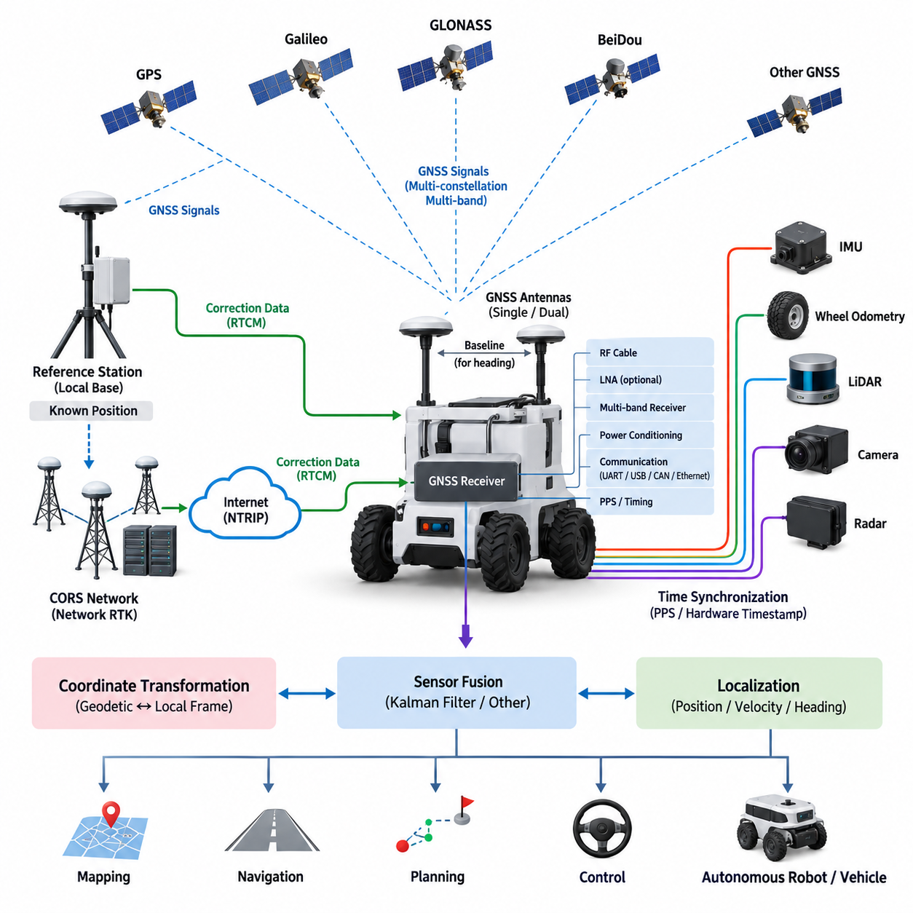
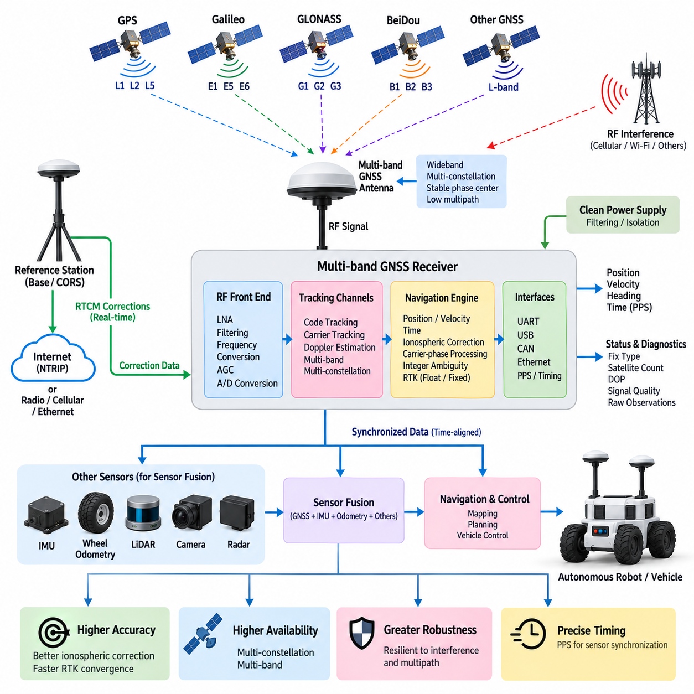
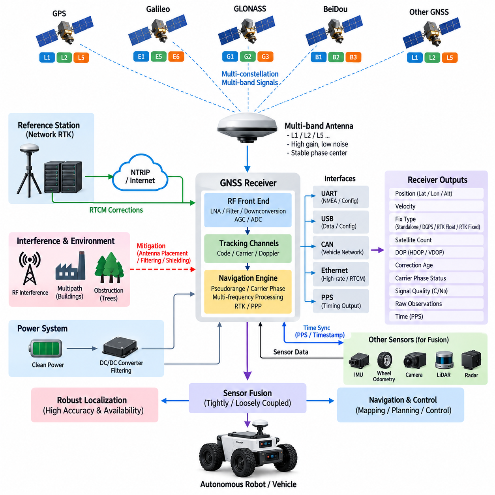
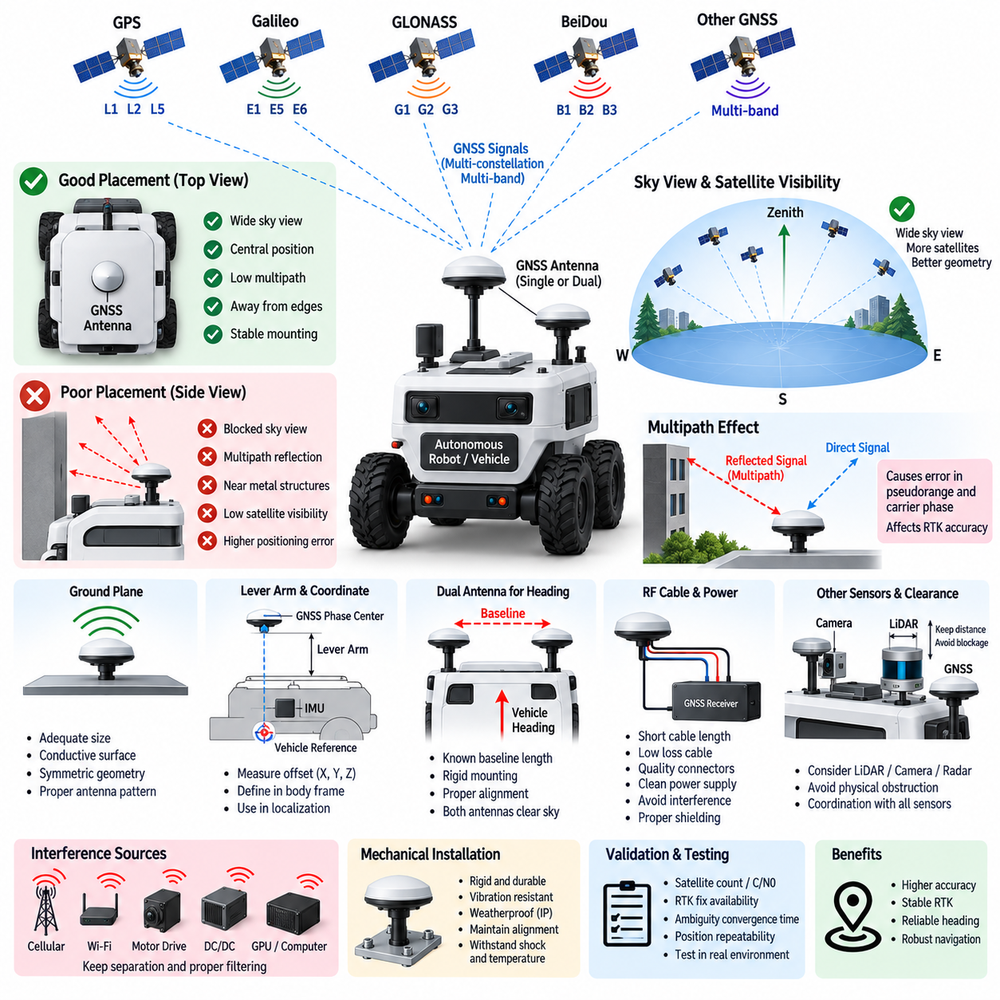
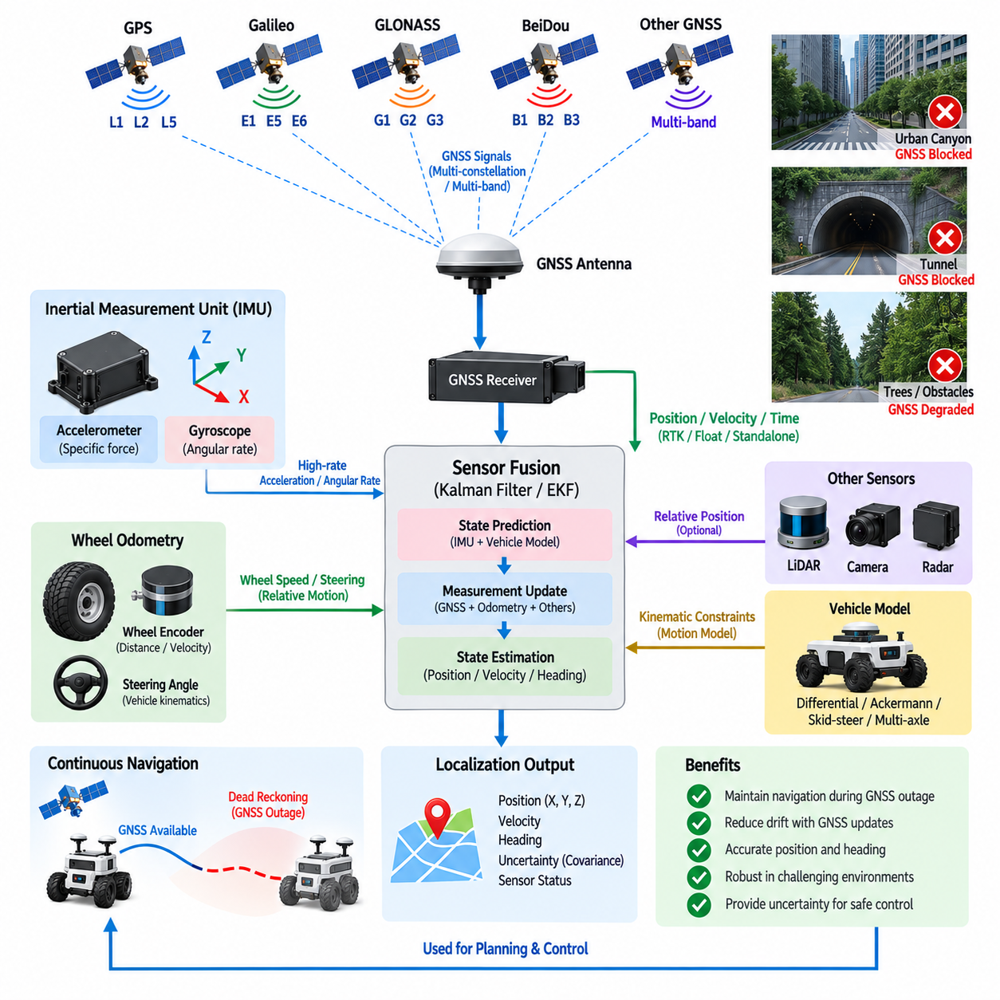
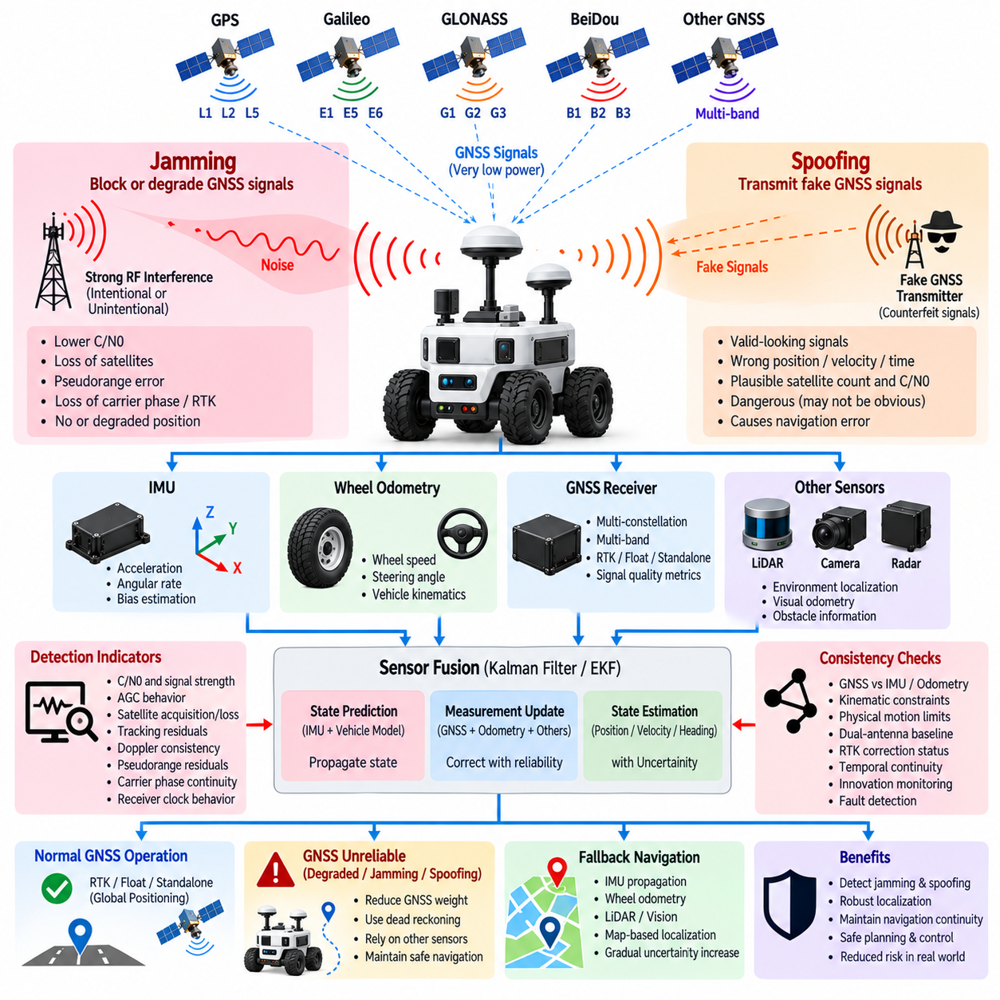

**Volume 15 Perception and Sensor Architecture**


# Chapter 09. GNSS

##  

## 09.01. RTK GNSS Architecture

{width="7.268055555555556in" height="7.268055555555556in"}

Real-Time Kinematic GNSS is a high-precision positioning architecture that improves conventional satellite navigation by estimating and removing common measurement errors. Instead of relying only on pseudorange observations, RTK uses carrier-phase measurements from multiple GNSS constellations and frequency bands. A reference station with a precisely known position observes the same satellites as the mobile receiver and provides correction information that enables centimeter-level relative positioning under favorable conditions.

An RTK GNSS architecture normally consists of GNSS satellites, a reference source, a correction communication path, and a rover receiver installed on the robot or vehicle. The reference source may be a dedicated local base station or a continuously operating reference station network. The rover combines received satellite measurements with correction data and calculates a high-accuracy navigation solution that can be supplied to localization, navigation, mapping, control, and sensor-fusion functions.

The satellite segment should be considered a multi-constellation system rather than a single GPS source. Modern receivers commonly process signals from GPS, Galileo, GLONASS, BeiDou, and regional systems where supported. Observing more satellites improves geometric diversity and availability, particularly when buildings, vegetation, terrain, or vehicle structures partially obstruct the sky. Multi-band reception further improves ionospheric error estimation and accelerates ambiguity resolution.

Carrier-phase measurement is the fundamental mechanism behind RTK accuracy. The wavelength of the GNSS carrier is much shorter than the code sequence used for ordinary positioning, allowing very precise measurement of relative phase. However, the receiver initially does not know the integer number of complete carrier cycles between the satellite and antenna. RTK processing therefore performs integer ambiguity estimation, and successful resolution of these ambiguities is required to achieve the highest positioning accuracy.

RTK operating status is commonly interpreted through solution states such as standalone, differential, float, and fixed. A float solution means that carrier ambiguities have not yet been reliably resolved to integers, so positioning accuracy remains below the final RTK capability. An RTK fixed solution indicates successful integer ambiguity resolution and normally represents the desired state for precision autonomous navigation. Robot software should therefore monitor both coordinates and solution quality rather than treating every GNSS output as equally trustworthy.

A local base station generates corrections by comparing measured satellite observations with measurements expected from its accurately surveyed location. These corrections can be transmitted directly to a rover through radio, cellular communication, Ethernet-connected infrastructure, or other suitable communication channels. The base-to-rover distance should remain within the operational limits of the correction strategy because atmospheric and satellite-related errors become less correlated as separation increases.

Network RTK extends this principle by using multiple geographically distributed reference stations. A network service estimates spatially varying GNSS errors and supplies corrections appropriate for the rover region. Correction delivery is frequently performed through Internet-based communication, allowing autonomous robots to obtain precision positioning without deploying a dedicated base station at every operating site. This architecture is especially useful for distributed outdoor AMRs, inspection vehicles, agricultural machines, and smart-city robotic fleets.

RTCM messages provide a standardized mechanism for transporting GNSS observation and correction information between reference infrastructure and rover receivers. In an Internet-connected implementation, an NTRIP client running in the GNSS receiver, edge computer, or communication gateway can obtain RTCM streams from an NTRIP caster. The communication architecture must maintain sufficient availability and predictable latency because prolonged interruption of correction data can cause degradation from fixed RTK operation toward float or standalone positioning.

The rover architecture includes more than the GNSS receiver itself. A practical robotic implementation contains one or more GNSS antennas, RF cabling, low-noise amplification where required, the multi-band receiver, correction interface, power conditioning, communication interfaces, and an edge computer. The receiver may provide position, velocity, heading-related information, timing signals, raw observations, and diagnostic data through interfaces such as UART, USB, CAN, or Ethernet depending on the selected hardware.

Antenna design has a direct influence on the achievable RTK performance. The antenna requires a sufficiently clear view of the sky while minimizing multipath caused by metallic surfaces, robot structures, nearby buildings, and other reflective objects. Ground-plane characteristics, cable loss, connector quality, antenna gain, and electromagnetic interference must therefore be treated as system-level engineering parameters. Antenna placement is consequently part of both mechanical packaging and electrical architecture.

Single-antenna RTK provides accurate position and velocity but cannot always provide reliable absolute heading while the platform is stationary. A dual-antenna GNSS configuration can estimate heading from the precisely measured baseline vector between two antennas. This is particularly valuable for outdoor AMRs, autonomous vehicles, inspection platforms, and slow-moving robots because the navigation system can obtain orientation information before sufficient vehicle motion exists to derive course from GNSS velocity.

RTK GNSS should normally operate as one component of a broader localization architecture rather than as an isolated navigation source. GNSS provides globally referenced position, while the IMU supplies high-rate angular velocity and acceleration measurements. Wheel odometry, steering information, LiDAR localization, visual odometry, radar, or other sensors can provide complementary motion constraints. Their fusion allows the localization system to continue producing stable state estimates during temporary GNSS degradation or correction outages.

The different update characteristics of these sensors make temporal alignment important. GNSS position may be generated at a relatively modest rate compared with an IMU operating at hundreds of measurements per second. Hardware timing outputs such as PPS can establish a precise time reference, while timestamped data interfaces associate observations with the correct measurement epoch. Poor synchronization can convert vehicle motion into apparent spatial error even when each individual sensor is accurate.

The coordinate architecture must also distinguish global geographic coordinates from robot-local frames. GNSS receivers naturally operate with Earth-referenced representations such as latitude, longitude, altitude, or Earth-centered coordinates, while autonomous navigation software often requires a local Cartesian map frame. A transformation layer converts the global GNSS solution into the navigation coordinate system and maintains relationships among GNSS antenna, IMU, vehicle body, LiDAR, camera, and robot base frames.

Mechanical calibration is therefore inseparable from positioning architecture. The GNSS antenna phase center is usually displaced from the vehicle reference point used by navigation and control. This lever arm must be measured and represented correctly, particularly when high-precision positioning is expected. In dual-antenna configurations, the baseline length and orientation must also be accurately characterized. Incorrect frame definitions can create systematic localization errors even when the GNSS receiver itself reports a valid RTK fixed solution.

Outdoor autonomous robots must additionally handle transitions between strong and degraded satellite environments. Open-sky operation may provide stable fixed RTK positioning, while trees, bridges, buildings, tunnels, loading areas, and urban canyons can reduce satellite visibility or introduce multipath. The localization system should evaluate satellite count, geometry, correction age, ambiguity status, receiver-reported uncertainty, and consistency with inertial or odometric motion before deciding how strongly GNSS measurements should influence the fused state.

System integrity is more important than nominal centimeter accuracy alone. Navigation software should detect abrupt coordinate jumps, stale corrections, unrealistic velocities, inconsistent heading, loss of fix, and disagreement between GNSS and independent sensors. A fault-management layer can reduce GNSS weighting, reject suspicious observations, switch localization modes, constrain robot speed, or request a controlled stop according to application requirements. Precision positioning becomes useful for autonomy only when uncertainty and failure behavior are explicitly managed.

The overall electrical architecture must protect GNSS performance from the robot itself. Switching converters, motor drives, high-current cables, GPUs, Ethernet electronics, wireless transmitters, and poorly shielded digital systems can introduce electromagnetic noise into sensitive GNSS reception paths. Careful grounding, filtering, cable routing, shielding, connector selection, power isolation, and physical separation between antennas and interference sources are therefore essential parts of RTK GNSS integration in electrically complex robotic platforms.

For outdoor AMRs and autonomous inspection vehicles, the resulting architecture forms a continuous chain from satellites and correction infrastructure to the rover receiver, synchronized sensor fusion, coordinate transformation, localization, planning, and motion control. RTK GNSS supplies the globally referenced geometric anchor, while inertial and perception sensors provide continuity and local environmental awareness. This layered approach allows centimeter-class positioning to become a dependable component of a complete autonomous navigation system rather than merely a high-accuracy coordinate output.

실시간 이동측위 위성항법시스템(Real-Time Kinematic GNSS, RTK GNSS)은 일반적인 위성항법(Satellite Navigation)에서 발생하는 공통 측정 오차를 추정하고 제거하여 위치 정확도를 크게 향상시키는 고정밀 측위(Positioning) 아키텍처이다. 단순히 의사거리(Pseudorange) 관측값에만 의존하지 않고, 여러 위성항법시스템(GNSS) 군과 주파수 대역에서 얻은 반송파 위상(Carrier Phase) 측정값을 사용한다. 정확한 위치를 알고 있는 기준국(Reference Station)은 이동 수신기와 동일한 위성을 관측하고 보정정보(Correction Information)를 제공하여, 양호한 조건에서 센티미터급(Centimeter-Level) 상대 측위를 가능하게 한다.

RTK GNSS 아키텍처는 일반적으로 위성항법시스템 위성(GNSS Satellites), 기준정보원(Reference Source), 보정 통신경로(Correction Communication Path), 그리고 로봇이나 차량에 설치되는 이동국 수신기(Rover Receiver)로 구성된다. 기준정보원은 전용 지역 기준국(Local Base Station) 또는 상시운영 기준국망(Continuously Operating Reference Station Network)이 될 수 있다. 이동국은 수신된 위성 측정값과 보정 데이터를 결합하여 고정밀 항법해(Navigation Solution)를 계산하고, 이를 위치추정(Localization), 내비게이션(Navigation), 지도작성(Mapping), 제어(Control), 센서융합(Sensor Fusion) 기능에 제공한다.

위성 구간(Satellite Segment)은 단일 위성위치확인시스템(GPS) 신호원이 아니라 다중 위성군 시스템(Multi-Constellation System)으로 고려해야 한다. 최신 수신기는 일반적으로 GPS, 갈릴레오(Galileo), 글로나스(GLONASS), 베이더우(BeiDou) 및 지원되는 지역 위성항법시스템의 신호를 함께 처리한다. 더 많은 위성을 관측하면 건물, 식생, 지형 또는 차량 구조물이 하늘을 부분적으로 가리는 환경에서도 위성 배치의 다양성과 가용성이 향상된다. 다중대역 수신(Multi-Band Reception)은 전리층 오차(Ionospheric Error) 추정을 개선하고 모호정수 결정(Ambiguity Resolution)을 가속한다.

반송파 위상 측정(Carrier-Phase Measurement)은 RTK 정확도를 구현하는 핵심 메커니즘이다. GNSS 반송파의 파장(Wavelength)은 일반적인 측위에서 사용하는 코드 시퀀스(Code Sequence)보다 훨씬 짧기 때문에 매우 정밀한 상대 위상 측정이 가능하다. 그러나 수신기는 초기 상태에서 위성과 안테나 사이에 존재하는 완전한 반송파 주기(Carrier Cycle)의 정수 개수를 알 수 없다. 따라서 RTK 처리는 정수 모호성(Integer Ambiguity)을 추정해야 하며, 최고 수준의 위치 정확도를 얻으려면 이러한 모호성을 성공적으로 결정해야 한다.

RTK 동작 상태는 일반적으로 단독측위(Standalone), 차분측위(Differential), 플로트(Float), 고정해(Fixed) 등의 해 상태(Solution State)를 통해 해석한다. 플로트 해(Float Solution)는 반송파 모호성이 아직 신뢰할 수 있는 정수값으로 결정되지 않은 상태이므로 위치 정확도가 최종 RTK 성능보다 낮다. RTK 고정해(RTK Fixed Solution)는 정수 모호성 결정이 성공했음을 의미하며 일반적으로 정밀 자율주행에서 요구되는 상태이다. 따라서 로봇 소프트웨어는 모든 GNSS 출력을 동일하게 신뢰하지 말고 좌표와 함께 측위해 품질(Solution Quality)을 지속적으로 감시해야 한다.

지역 기준국(Local Base Station)은 정확하게 측량된 자신의 위치에서 예상되는 위성 측정값과 실제 측정값을 비교하여 보정정보(Correction Data)를 생성한다. 이러한 보정정보는 무선통신(Radio), 셀룰러 통신(Cellular Communication), 이더넷 기반 인프라(Ethernet-Connected Infrastructure) 또는 기타 적절한 통신채널을 통해 이동국으로 직접 전송될 수 있다. 대기 및 위성 관련 오차의 상관성이 기준국과 이동국 사이의 거리가 증가함에 따라 감소하기 때문에 기준국-이동국 거리(Base-to-Rover Distance)는 적용되는 보정 방식의 운용 한계 내에서 관리해야 한다.

네트워크 RTK(Network RTK)는 지리적으로 분산된 여러 기준국(Reference Stations)을 사용하여 이러한 원리를 확장한다. 네트워크 서비스(Network Service)는 공간적으로 변화하는 GNSS 오차를 추정하고 이동국이 위치한 지역에 적합한 보정정보를 제공한다. 보정정보 전송은 인터넷 기반 통신을 통해 이루어지는 경우가 많으므로 모든 운용 현장에 전용 기준국을 설치하지 않고도 자율로봇이 정밀 측위를 수행할 수 있다. 이러한 아키텍처는 분산형 실외 자율이동로봇(Outdoor AMR), 점검차량(Inspection Vehicle), 농업기계(Agricultural Machine), 스마트시티 로봇 플릿(Smart-City Robotic Fleet)에 특히 유용하다.

해양무선기술위원회 보정 메시지(RTCM Messages)는 기준 인프라와 이동국 수신기 사이에서 GNSS 관측정보와 보정정보를 전달하기 위한 표준화된 메커니즘을 제공한다. 인터넷 연결형 구현에서는 GNSS 수신기, 엣지 컴퓨터(Edge Computer) 또는 통신 게이트웨이(Communication Gateway)에서 동작하는 네트워크 RTK 인터넷 프로토콜 클라이언트(NTRIP Client)가 NTRIP 캐스터(NTRIP Caster)로부터 RTCM 스트림(Stream)을 수신할 수 있다. 보정 데이터가 장시간 중단되면 고정해에서 플로트 또는 단독측위로 성능이 저하될 수 있으므로 통신 아키텍처는 충분한 가용성과 예측 가능한 지연시간(Latency)을 유지해야 한다.

이동국 아키텍처(Rover Architecture)는 GNSS 수신기 자체만으로 구성되지 않는다. 실제 로봇 시스템에는 하나 이상의 GNSS 안테나(Antenna), 무선주파수 케이블(RF Cable), 필요한 경우 저잡음 증폭기(Low-Noise Amplifier), 다중대역 수신기(Multi-Band Receiver), 보정정보 인터페이스(Correction Interface), 전원조절회로(Power Conditioning), 통신 인터페이스(Communication Interface), 엣지 컴퓨터가 포함된다. 수신기는 선택된 하드웨어에 따라 UART, USB, CAN 또는 이더넷(Ethernet) 등의 인터페이스를 통해 위치, 속도, 방향 관련 정보, 시간 신호, 원시 관측값(Raw Observation), 진단 데이터(Diagnostic Data)를 제공할 수 있다.

안테나 설계(Antenna Design)는 달성 가능한 RTK 성능에 직접적인 영향을 미친다. 안테나는 충분히 개방된 하늘 시야(Sky View)를 확보하는 동시에 금속 표면, 로봇 구조물, 주변 건물 및 기타 반사체에서 발생하는 다중경로(Multipath)를 최소화해야 한다. 따라서 접지면(Ground Plane) 특성, 케이블 손실(Cable Loss), 커넥터 품질(Connector Quality), 안테나 이득(Antenna Gain), 전자기 간섭(Electromagnetic Interference)은 시스템 수준의 엔지니어링 변수로 관리해야 한다. 안테나 배치는 기계적 패키징(Mechanical Packaging)과 전기 아키텍처(Electrical Architecture) 모두에 포함되는 설계 요소이다.

단일 안테나 RTK(Single-Antenna RTK)는 정확한 위치와 속도를 제공하지만 플랫폼이 정지한 상태에서는 신뢰할 수 있는 절대 방위각(Absolute Heading)을 항상 제공할 수 있는 것은 아니다. 이중 안테나 GNSS(Dual-Antenna GNSS) 구성은 두 안테나 사이의 정밀하게 측정된 기준선 벡터(Baseline Vector)를 이용하여 방위각을 추정할 수 있다. 이는 차량이 충분히 이동하기 전에 GNSS 속도로부터 진행방향을 계산하기 어려운 실외 AMR, 자율주행차량(Autonomous Vehicle), 점검 플랫폼(Inspection Platform), 저속 이동 로봇(Slow-Moving Robot)에 특히 유용하다.

RTK GNSS는 일반적으로 독립된 항법원(Isolated Navigation Source)이 아니라 더 광범위한 위치추정 아키텍처(Localization Architecture)의 한 구성요소로 동작해야 한다. GNSS는 전역 기준 위치(Global Referenced Position)를 제공하고 관성측정장치(IMU)는 높은 주기의 각속도(Angular Velocity)와 가속도(Acceleration)를 제공한다. 휠 오도메트리(Wheel Odometry), 조향정보(Steering Information), 라이다 위치추정(LiDAR Localization), 시각 오도메트리(Visual Odometry), 레이더(Radar) 등의 센서는 상호보완적인 운동 제약정보(Motion Constraint)를 제공할 수 있다. 이러한 정보의 융합은 일시적인 GNSS 성능 저하 또는 보정정보 단절 상황에서도 안정적인 상태추정(State Estimation)을 유지하게 한다.

각 센서의 갱신 특성(Update Characteristics)이 서로 다르기 때문에 시간 정렬(Temporal Alignment)이 중요하다. GNSS 위치정보는 초당 수백 회의 측정을 수행할 수 있는 IMU와 비교하여 상대적으로 낮은 주기로 생성될 수 있다. 초당 펄스(PPS)와 같은 하드웨어 타이밍 출력(Hardware Timing Output)은 정밀한 시간 기준을 제공하며, 타임스탬프 데이터 인터페이스(Timestamped Data Interface)는 관측값을 정확한 측정 시점과 연결한다. 동기화가 부정확하면 각각의 센서 자체가 정확하더라도 차량의 움직임이 겉보기 공간 오차(Apparent Spatial Error)로 변환될 수 있다.

좌표 아키텍처(Coordinate Architecture)는 전역 지리좌표(Global Geographic Coordinate)와 로봇 로컬 좌표계(Robot-Local Frame)를 구분해야 한다. GNSS 수신기는 본질적으로 위도(Latitude), 경도(Longitude), 고도(Altitude) 또는 지구중심 좌표(Earth-Centered Coordinate)와 같은 지구 기준 표현을 사용하지만, 자율주행 소프트웨어는 일반적으로 로컬 직교좌표 지도 프레임(Local Cartesian Map Frame)을 필요로 한다. 좌표변환 계층(Transformation Layer)은 전역 GNSS 측위해를 내비게이션 좌표계로 변환하고 GNSS 안테나, IMU, 차체(Vehicle Body), 라이다(LiDAR), 카메라(Camera), 로봇 베이스(Robot Base) 프레임 사이의 관계를 유지한다.

따라서 기계적 보정(Mechanical Calibration)은 측위 아키텍처와 분리할 수 없다. GNSS 안테나 위상중심(Antenna Phase Center)은 일반적으로 내비게이션과 제어에서 사용하는 차량 기준점(Vehicle Reference Point)과 일정 거리만큼 떨어져 있다. 고정밀 측위를 요구하는 경우 이러한 레버암(Lever Arm)을 정확하게 측정하여 시스템에 반영해야 한다. 이중 안테나 구성에서는 기준선 길이(Baseline Length)와 방향도 정확하게 정의해야 한다. 좌표 프레임 정의가 잘못되면 GNSS 수신기가 정상적인 RTK 고정해를 보고하더라도 체계적인 위치 오차(Systematic Localization Error)가 발생할 수 있다.

실외 자율로봇(Outdoor Autonomous Robot)은 양호한 위성 환경과 열화된 위성 환경 사이의 전환도 처리해야 한다. 개방된 환경(Open Sky)에서는 안정적인 RTK 고정측위가 가능하지만 나무, 교량, 건물, 터널, 하역구역 및 도심 협곡(Urban Canyon)은 위성 가시성을 감소시키거나 다중경로를 발생시킬 수 있다. 위치추정 시스템은 GNSS 측정값을 융합 상태(Fused State)에 얼마나 강하게 반영할지 결정하기 전에 위성 수, 위성 배치, 보정정보 경과시간(Correction Age), 모호성 상태(Ambiguity Status), 수신기 추정 불확실성(Receiver-Reported Uncertainty), 관성 또는 오도메트리 운동과의 일관성을 평가해야 한다.

시스템 무결성(System Integrity)은 명목상의 센티미터급 정확도 자체보다 중요하다. 내비게이션 소프트웨어는 갑작스러운 좌표 점프(Coordinate Jump), 오래된 보정정보(Stale Correction), 비현실적인 속도, 일관되지 않은 방위각, 고정해 손실(Loss of Fix), GNSS와 독립 센서 사이의 불일치를 탐지해야 한다. 결함관리 계층(Fault-Management Layer)은 응용 요구사항에 따라 GNSS 가중치를 감소시키거나 의심스러운 관측값을 제거하고, 위치추정 모드를 전환하거나 로봇 속도를 제한하며 필요하면 제어된 정지(Controlled Stop)를 요청할 수 있다.

전체 전기 아키텍처(Electrical Architecture)는 로봇 자체에서 발생하는 간섭으로부터 GNSS 성능을 보호해야 한다. 스위칭 컨버터(Switching Converter), 모터 드라이브(Motor Drive), 대전류 케이블(High-Current Cable), GPU, 이더넷 전자장치(Ethernet Electronics), 무선 송신기(Wireless Transmitter), 차폐가 불충분한 디지털 시스템은 민감한 GNSS 수신 경로에 전자기 잡음을 유입시킬 수 있다. 따라서 적절한 접지(Grounding), 필터링(Filtering), 케이블 라우팅(Cable Routing), 차폐(Shielding), 커넥터 선정(Connector Selection), 전원 절연(Power Isolation), 안테나와 간섭원 사이의 물리적 분리는 전기적으로 복잡한 로봇 플랫폼의 RTK GNSS 통합에서 필수적인 설계 요소이다.

실외 자율이동로봇(Outdoor AMR)과 자율 점검차량(Autonomous Inspection Vehicle)에서 최종 아키텍처는 위성 및 보정 인프라에서 시작하여 이동국 수신기(Rover Receiver), 동기화된 센서융합(Synchronized Sensor Fusion), 좌표변환(Coordinate Transformation), 위치추정(Localization), 경로계획(Planning), 운동제어(Motion Control)까지 이어지는 연속적인 체인을 형성한다. RTK GNSS는 전역 기준의 기하학적 기준점(Global Geometric Anchor)을 제공하고, 관성 및 인지 센서(Inertial and Perception Sensors)는 연속성과 주변환경 인식을 제공한다. 이러한 계층적 접근법(Layered Approach)을 통해 센티미터급 측위는 단순한 고정밀 좌표 출력이 아니라 완전한 자율주행 시스템(Autonomous Navigation System)을 구성하는 신뢰성 높은 핵심 요소가 된다.

##  

## 09.02. Multi Band Receiver

{width="7.268055555555556in" height="7.268055555555556in"}

{width="7.268055555555556in" height="7.268055555555556in"}

A multi-band GNSS receiver is designed to observe navigation signals transmitted on multiple carrier frequencies rather than relying on a single frequency such as GPS L1. Modern receivers can simultaneously process combinations such as L1, L2, and L5 or their corresponding frequencies from Galileo, GLONASS, BeiDou, and other constellations. This frequency diversity improves positioning accuracy, availability, convergence speed, and robustness for autonomous robotic platforms.

The receiver architecture begins at the GNSS antenna, which must support the required frequency bands with appropriate gain, polarization, impedance characteristics, and radiation patterns. Signals arriving from satellites are extremely weak, so antenna performance directly affects the quality of every downstream measurement. Multi-band antennas are therefore engineered to receive several GNSS frequency ranges while maintaining stable phase-center behavior and sufficient rejection of signals outside the intended navigation spectrum.

After the antenna, the radio-frequency front end processes the received satellite signals before digital navigation algorithms can use them. Typical functions include low-noise amplification, filtering, frequency conversion, automatic gain control, and analog-to-digital conversion. Because several GNSS bands may be processed simultaneously, the front end must maintain adequate bandwidth and isolation while preventing strong nearby radio transmitters or electronic noise generated by the robot from saturating sensitive receiver stages.

The principal advantage of multi-band reception is the ability to characterize frequency-dependent propagation errors. Ionospheric delay is dispersive, meaning that its magnitude changes according to signal frequency. By comparing measurements obtained from two or more frequencies, the receiver can estimate or eliminate a significant portion of this error. This capability is especially important for high-precision positioning because atmospheric errors that may be acceptable in ordinary navigation become significant when centimeter-level accuracy is required.

Multiple frequencies also improve carrier-phase ambiguity resolution used by real-time kinematic positioning. RTK algorithms must determine the integer number of carrier cycles between satellites and the rover antenna before a fixed high-accuracy solution can be established. Measurements from additional frequencies provide more independent constraints and useful wavelength combinations. As a result, a multi-band receiver can generally achieve faster and more reliable ambiguity resolution than a comparable single-band architecture under suitable satellite visibility.

Frequency diversity should be combined with constellation diversity. A modern receiver may simultaneously track GPS, Galileo, GLONASS, and BeiDou signals across several supported bands, substantially increasing the number of usable observations. This becomes particularly valuable for outdoor AMRs operating near buildings, industrial structures, trees, containers, or other obstacles. Even when some satellites are blocked, the receiver may retain sufficient geometry through other constellations and frequencies to maintain a usable navigation solution.

Signal availability alone does not guarantee measurement quality. Reflections from buildings, vehicle surfaces, ground structures, and nearby objects can create multipath, where delayed copies of satellite signals arrive together with the direct signal. Multi-band receivers can provide additional measurements that help navigation algorithms detect inconsistent observations, but antenna placement remains essential. The antenna should therefore be positioned with a clear sky view and appropriate separation from reflective structures and electromagnetic interference sources.

A practical multi-band receiver contains multiple tracking channels that independently acquire and follow satellite signals. Digital correlators identify the ranging codes and continuously estimate code phase, carrier phase, Doppler shift, and signal strength. These measurements are converted into pseudorange, carrier-phase, and range-rate observations. The navigation engine then combines observations from multiple satellites, frequencies, and constellations to estimate position, velocity, time, and associated quality indicators.

For RTK applications, the receiver must process both local satellite observations and correction information received from a base station or network service. RTCM correction streams may arrive through serial communication, Ethernet, cellular networking, or an NTRIP client implemented in the receiver or edge computer. The navigation processor associates these corrections with the appropriate satellite, signal, and measurement epoch before performing differential carrier-phase processing and integer ambiguity resolution.

Receiver output should expose more information than latitude, longitude, and altitude. Autonomous systems benefit from velocity, fix type, satellite count, dilution-of-precision indicators, estimated covariance, correction age, carrier-phase status, signal quality, and raw observation data. These diagnostics allow localization software to determine whether a reported position originates from standalone GNSS, differential positioning, RTK float, or RTK fixed operation and to adjust its confidence accordingly.

The electrical interface between the receiver and robotic compute platform depends on required data rate, determinism, integration complexity, and hardware configuration. UART is widely used for conventional navigation messages and configuration, while USB may simplify development platforms. CAN can integrate GNSS information into vehicle-oriented networks, and Ethernet provides greater bandwidth for raw measurements, diagnostics, network corrections, and high-rate data exchange. Interface selection should reflect the complete localization architecture rather than receiver capability alone.

Accurate timing is another important function of a multi-band GNSS receiver. GNSS satellites provide highly precise time references, allowing receivers to generate pulse-per-second signals and timestamped navigation measurements. PPS can synchronize an edge computer or establish a common time reference for IMUs, LiDARs, cameras, radars, and other perception devices. Accurate synchronization ensures that sensor measurements describing a moving robot correspond to the same physical state when they are combined by localization algorithms.

Multi-band receivers are commonly integrated with an inertial measurement unit because the two technologies provide complementary information. GNSS offers globally referenced position and velocity but can degrade when satellite signals are obstructed. An IMU provides continuous high-rate angular velocity and acceleration but accumulates error when integrated over time. Sensor-fusion algorithms combine these characteristics so that GNSS limits long-term drift while inertial measurements preserve short-term motion continuity during temporary satellite degradation.

Some receiver architectures extend this integration with wheel speed, steering angle, or vehicle odometry. Such information supports dead reckoning when GNSS availability becomes temporarily insufficient under bridges, near tall buildings, inside partially covered facilities, or during short communication interruptions. A tightly integrated navigation system may process GNSS and inertial observations within a common estimation framework, whereas a loosely coupled architecture may fuse complete GNSS position and velocity outputs at a higher software layer.

The receiver power architecture requires careful attention because GNSS signals are extremely sensitive to internally generated electrical noise. Switching regulators, motor inverters, DC/DC converters, GPUs, high-speed Ethernet interfaces, wireless modems, and digital clocks can produce conducted or radiated interference. Clean power rails, filtering, grounding, shielding, RF cable routing, and physical separation should therefore be designed together with the receiver and antenna installation rather than treated as corrective measures after integration.

RF cabling introduces another practical design constraint. Cable attenuation increases with frequency and length, reducing the signal level available at the receiver input. Active antennas or external low-noise amplifiers can compensate for cable losses, but excessive gain can also increase susceptibility to strong interfering signals. Cable type, connector insertion loss, amplifier gain, noise figure, antenna gain, and receiver input limits should therefore be evaluated as a complete RF link budget.

Multi-band reception also increases the importance of interference monitoring. Intentional or accidental radio-frequency interference may affect one band, several bands, or the entire GNSS spectrum. Receiver diagnostics can monitor carrier-to-noise density, automatic gain-control behavior, satellite tracking consistency, and abnormal signal conditions. Autonomous navigation software should use these indicators together with position innovation and sensor-fusion consistency to avoid accepting apparently precise but unreliable GNSS measurements.

For robotic system integration, receiver configuration should be controlled as part of the platform baseline. Enabled constellations, frequency bands, measurement rates, dynamic models, correction formats, elevation masks, output messages, communication speeds, timing configuration, and RTK parameters should be version-controlled. Reproducible configuration prevents different robots in the same fleet from exhibiting inconsistent positioning behavior even when nominally identical GNSS hardware is installed.

The resulting multi-band receiver architecture forms a bridge between weak multi-frequency satellite signals and the high-confidence state estimate required by autonomous navigation. Antenna and RF design preserve signal quality, multi-constellation tracking increases observation availability, multiple frequencies improve atmospheric compensation and ambiguity resolution, RTK corrections establish centimeter-class positioning, and synchronized interfaces deliver measurements to sensor fusion. Together, these elements make the multi-band GNSS receiver a central component of robust outdoor AMR and autonomous vehicle localization.

다중대역 위성항법시스템 수신기(Multi-Band GNSS Receiver)는 GPS L1과 같은 단일 주파수에만 의존하지 않고 여러 반송파 주파수(Carrier Frequency)에서 전송되는 항법 신호를 관측하도록 설계된다. 최신 수신기는 L1, L2, L5 등의 조합뿐만 아니라 갈릴레오(Galileo), 글로나스(GLONASS), 베이더우(BeiDou) 및 기타 위성군(Constellation)의 대응 주파수를 동시에 처리할 수 있다. 이러한 주파수 다양성(Frequency Diversity)은 자율 로봇 플랫폼의 측위 정확도, 가용성, 수렴 속도 및 강건성(Robustness)을 향상시킨다.

수신기 아키텍처(Receiver Architecture)는 필요한 주파수 대역을 적절한 이득(Gain), 편파(Polarization), 임피던스(Impedance) 특성 및 방사 패턴(Radiation Pattern)으로 지원해야 하는 GNSS 안테나에서 시작한다. 위성에서 도달하는 신호는 매우 미약하므로 안테나 성능은 이후 모든 측정값의 품질에 직접적인 영향을 준다. 따라서 다중대역 안테나(Multi-Band Antenna)는 안정적인 위상중심(Phase Center) 특성을 유지하고 의도된 항법 주파수 대역 외부의 신호를 충분히 억제하면서 여러 GNSS 주파수 범위를 수신하도록 설계된다.

안테나 이후에는 무선주파수 프런트엔드(RF Front End)가 수신된 위성 신호를 디지털 항법 알고리즘이 사용할 수 있도록 처리한다. 일반적인 기능에는 저잡음 증폭(Low-Noise Amplification), 필터링(Filtering), 주파수 변환(Frequency Conversion), 자동이득제어(Automatic Gain Control), 아날로그-디지털 변환(Analog-to-Digital Conversion)이 포함된다. 여러 GNSS 대역을 동시에 처리할 수 있으므로 프런트엔드는 충분한 대역폭과 채널 간 격리(Isolation)를 유지하면서 주변의 강한 무선 송신기 또는 로봇에서 발생하는 전기적 잡음이 민감한 수신단을 포화시키지 않도록 해야 한다.

다중대역 수신(Multi-Band Reception)의 주요 장점은 주파수에 따라 달라지는 전파 오차(Propagation Error)를 분석할 수 있다는 것이다. 전리층 지연(Ionospheric Delay)은 분산성(Dispersive)을 가지므로 그 크기가 신호 주파수에 따라 달라진다. 두 개 이상의 주파수에서 얻은 측정값을 비교하면 수신기는 이러한 오차의 상당 부분을 추정하거나 제거할 수 있다. 일반적인 항법에서는 허용될 수 있는 대기 오차도 센티미터급 정확도가 필요한 경우 중요한 오차가 되므로 이러한 기능은 고정밀 측위(High-Precision Positioning)에서 특히 중요하다.

다중 주파수(Multiple Frequencies)는 실시간 이동측위(Real-Time Kinematic, RTK)에서 사용하는 반송파 위상 모호정수 결정(Carrier-Phase Ambiguity Resolution)도 향상시킨다. RTK 알고리즘은 고정밀 고정해(Fixed Solution)를 확립하기 전에 위성과 이동국 안테나 사이의 반송파 주기 정수 개수를 결정해야 한다. 추가 주파수의 측정값은 더 많은 독립적인 제약조건과 유용한 파장 조합(Wavelength Combination)을 제공한다. 따라서 적절한 위성 가시성이 확보된 환경에서 다중대역 수신기는 동급의 단일대역 아키텍처보다 일반적으로 더 빠르고 신뢰성 높은 모호정수 결정을 수행할 수 있다.

주파수 다양성(Frequency Diversity)은 위성군 다양성(Constellation Diversity)과 함께 사용해야 한다. 최신 수신기는 지원되는 여러 주파수 대역에서 GPS, 갈릴레오(Galileo), 글로나스(GLONASS), 베이더우(BeiDou) 신호를 동시에 추적하여 사용 가능한 관측값의 수를 크게 증가시킬 수 있다. 이는 건물, 산업시설 구조물, 나무, 컨테이너 또는 기타 장애물 주변에서 운용되는 실외 자율이동로봇(Outdoor AMR)에 특히 중요하다. 일부 위성이 차단되더라도 다른 위성군과 주파수를 통해 충분한 위성 배치(Geometry)를 확보하여 사용 가능한 항법해(Navigation Solution)를 유지할 수 있다.

신호 가용성(Signal Availability)이 높다고 해서 반드시 측정 품질까지 보장되는 것은 아니다. 건물, 차량 표면, 지상 구조물 및 주변 물체에서 반사된 신호는 위성의 직접 신호와 지연된 복제 신호가 함께 도달하는 다중경로(Multipath)를 발생시킬 수 있다. 다중대역 수신기는 항법 알고리즘이 일관되지 않은 관측값을 탐지하는 데 도움이 되는 추가 측정정보를 제공할 수 있지만 안테나 배치는 여전히 핵심적이다. 따라서 안테나는 충분한 하늘 시야를 확보하고 반사 구조물 및 전자기 간섭원(Electromagnetic Interference Source)과 적절한 거리를 유지하도록 배치해야 한다.

실제 다중대역 수신기(Multi-Band Receiver)는 위성 신호를 독립적으로 획득하고 추적하는 다수의 추적 채널(Tracking Channel)을 포함한다. 디지털 상관기(Digital Correlator)는 거리측정 코드(Ranging Code)를 식별하고 코드 위상(Code Phase), 반송파 위상(Carrier Phase), 도플러 편이(Doppler Shift), 신호 세기(Signal Strength)를 지속적으로 추정한다. 이러한 측정값은 의사거리(Pseudorange), 반송파 위상 및 거리 변화율(Range Rate) 관측값으로 변환된다. 이후 항법 엔진(Navigation Engine)은 여러 위성, 주파수 및 위성군의 관측값을 결합하여 위치, 속도, 시간 및 관련 품질 지표를 추정한다.

RTK 응용에서는 수신기가 자체 위성 관측값뿐만 아니라 기준국(Base Station) 또는 네트워크 서비스(Network Service)에서 수신되는 보정정보도 처리해야 한다. 해양무선기술위원회 보정 스트림(RTCM Correction Stream)은 직렬통신(Serial Communication), 이더넷(Ethernet), 셀룰러 네트워크(Cellular Network), 또는 수신기나 엣지 컴퓨터(Edge Computer)에 구현된 NTRIP 클라이언트(NTRIP Client)를 통해 수신될 수 있다. 항법 프로세서(Navigation Processor)는 차분 반송파 위상 처리(Differential Carrier-Phase Processing)와 정수 모호성 결정(Integer Ambiguity Resolution)을 수행하기 전에 이러한 보정정보를 해당 위성, 신호 및 측정 시점(Measurement Epoch)과 연계한다.

수신기 출력(Receiver Output)은 위도, 경도, 고도 정보만 제공하는 수준을 넘어야 한다. 자율 시스템은 속도(Velocity), 측위 상태(Fix Type), 위성 수(Satellite Count), 정밀도 저하율(Dilution of Precision) 지표, 추정 공분산(Estimated Covariance), 보정정보 경과시간(Correction Age), 반송파 위상 상태(Carrier-Phase Status), 신호 품질(Signal Quality), 원시 관측 데이터(Raw Observation Data)를 활용할 수 있다. 이러한 진단정보를 이용하면 위치추정 소프트웨어(Localization Software)가 현재 위치가 단독 GNSS, 차분측위, RTK 플로트(Float), RTK 고정해(Fixed) 중 어느 상태에서 생성되었는지 판단하고 그에 따라 신뢰도를 조정할 수 있다.

수신기와 로봇 컴퓨팅 플랫폼(Robotic Compute Platform) 사이의 전기적 인터페이스(Electrical Interface)는 필요한 데이터 전송률, 결정성(Determinism), 통합 복잡도 및 하드웨어 구성에 따라 결정된다. UART는 일반적인 항법 메시지와 설정에 널리 사용되고 USB는 개발 플랫폼의 연결을 단순화할 수 있다. CAN은 GNSS 정보를 차량 중심 네트워크에 통합할 수 있으며, 이더넷(Ethernet)은 원시 측정값, 진단정보, 네트워크 보정정보 및 고속 데이터 교환에 더 높은 대역폭을 제공한다. 인터페이스는 수신기의 기능만이 아니라 전체 위치추정 아키텍처(Localization Architecture)를 고려하여 선정해야 한다.

정밀 시간(Accurate Timing) 제공 역시 다중대역 GNSS 수신기의 중요한 기능이다. GNSS 위성은 매우 정밀한 시간 기준을 제공하므로 수신기는 초당 펄스(Pulse Per Second, PPS) 신호와 타임스탬프가 포함된 항법 측정값(Timestamped Navigation Measurement)을 생성할 수 있다. PPS는 엣지 컴퓨터를 동기화하거나 관성측정장치(IMU), 라이다(LiDAR), 카메라(Camera), 레이더(Radar) 및 기타 인지 장치의 공통 시간 기준을 설정하는 데 사용할 수 있다. 정확한 동기화는 움직이는 로봇을 나타내는 센서 측정값이 위치추정 알고리즘에서 결합될 때 동일한 물리적 상태를 표현하도록 보장한다.

다중대역 수신기는 두 기술이 상호보완적인 정보를 제공하기 때문에 관성측정장치(Inertial Measurement Unit, IMU)와 함께 통합되는 경우가 많다. GNSS는 전역 기준 위치와 속도를 제공하지만 위성 신호가 차단되면 성능이 저하될 수 있다. IMU는 연속적인 고주기 각속도와 가속도를 제공하지만 시간이 지나면서 적분 오차가 누적된다. 센서융합 알고리즘(Sensor-Fusion Algorithm)은 이러한 특성을 결합하여 GNSS가 장기적인 드리프트(Long-Term Drift)를 제한하고 관성 측정값이 일시적인 위성 신호 저하 동안 단기적인 운동 연속성을 유지하도록 한다.

일부 수신기 아키텍처는 휠 속도(Wheel Speed), 조향각(Steering Angle) 또는 차량 오도메트리(Vehicle Odometry)를 추가로 통합한다. 이러한 정보는 교량 아래, 높은 건물 주변, 부분적으로 덮인 시설 내부 또는 짧은 통신 중단과 같이 GNSS 가용성이 일시적으로 부족한 환경에서 추측항법(Dead Reckoning)을 지원한다. 긴밀결합 항법 시스템(Tightly Integrated Navigation System)은 GNSS와 관성 관측값을 공통 추정 프레임워크에서 직접 처리할 수 있으며, 느슨한 결합 아키텍처(Loosely Coupled Architecture)는 완성된 GNSS 위치 및 속도 출력을 상위 소프트웨어 계층에서 융합할 수 있다.

GNSS 신호는 내부적으로 발생하는 전기적 잡음에 매우 민감하기 때문에 수신기 전원 아키텍처(Power Architecture)는 세심하게 설계해야 한다. 스위칭 레귤레이터(Switching Regulator), 모터 인버터(Motor Inverter), DC/DC 컨버터(DC/DC Converter), GPU, 고속 이더넷 인터페이스(High-Speed Ethernet Interface), 무선 모뎀(Wireless Modem), 디지털 클록(Digital Clock)은 전도성 또는 방사성 간섭을 발생시킬 수 있다. 따라서 깨끗한 전원 레일(Clean Power Rail), 필터링, 접지, 차폐, RF 케이블 라우팅 및 물리적 분리는 시스템 통합 이후의 보완책이 아니라 수신기 및 안테나 설치 단계부터 함께 설계해야 한다.

무선주파수 케이블링(RF Cabling)은 또 다른 실질적인 설계 제약조건을 제공한다. 케이블 감쇠(Cable Attenuation)는 주파수와 길이가 증가할수록 커지며 수신기 입력단에서 사용할 수 있는 신호 수준을 감소시킨다. 능동형 안테나(Active Antenna) 또는 외부 저잡음 증폭기(External Low-Noise Amplifier)는 케이블 손실을 보상할 수 있지만 지나친 이득은 강한 간섭 신호에 대한 민감성을 증가시킬 수 있다. 따라서 케이블 종류, 커넥터 삽입손실(Connector Insertion Loss), 증폭기 이득, 잡음지수(Noise Figure), 안테나 이득 및 수신기 입력 한계를 하나의 완전한 RF 링크 버짓(RF Link Budget)으로 평가해야 한다.

다중대역 수신은 간섭 감시(Interference Monitoring)의 중요성도 증가시킨다. 의도적 또는 비의도적인 무선주파수 간섭(Radio-Frequency Interference)은 하나의 대역, 여러 대역 또는 전체 GNSS 주파수 영역에 영향을 줄 수 있다. 수신기 진단기능은 반송파 대 잡음밀도(Carrier-to-Noise Density), 자동이득제어 동작, 위성 추적 일관성 및 비정상적인 신호 상태를 감시할 수 있다. 자율주행 소프트웨어는 외관상 정밀하지만 실제로는 신뢰할 수 없는 GNSS 측정값을 받아들이지 않도록 이러한 지표를 위치 변화량(Position Innovation) 및 센서융합 일관성과 함께 사용해야 한다.

로봇 시스템 통합(Robotic System Integration)에서는 수신기 설정(Receiver Configuration)을 플랫폼 기준설정(Platform Baseline)의 일부로 관리해야 한다. 활성화된 위성군, 주파수 대역, 측정 주기, 동역학 모델(Dynamic Model), 보정 형식, 고도각 마스크(Elevation Mask), 출력 메시지, 통신 속도, 시간 설정 및 RTK 파라미터는 버전 관리(Version Control)되어야 한다. 재현 가능한 설정(Reproducible Configuration)을 유지하면 동일한 GNSS 하드웨어가 설치되어 있더라도 동일 플릿(Fleet)의 로봇마다 서로 다른 측위 동작이 발생하는 문제를 방지할 수 있다.

최종적인 다중대역 수신기 아키텍처(Multi-Band Receiver Architecture)는 매우 미약한 다중주파수 위성 신호와 자율주행에 필요한 높은 신뢰도의 상태추정(High-Confidence State Estimate)을 연결하는 핵심 계층을 형성한다. 안테나 및 RF 설계는 신호 품질을 보존하고, 다중 위성군 추적(Multi-Constellation Tracking)은 관측 가용성을 증가시키며, 다중 주파수는 대기 오차 보상과 모호정수 결정을 향상시킨다. 여기에 RTK 보정정보가 센티미터급 측위를 구현하고 동기화된 인터페이스가 측정정보를 센서융합 시스템으로 전달함으로써, 다중대역 GNSS 수신기는 강건한 실외 자율이동로봇(Outdoor AMR) 및 자율주행차량(Autonomous Vehicle) 위치추정의 핵심 구성요소가 된다.

##  

## 09.03. Antenna Placement Design

{width="7.268055555555556in" height="7.268055555555556in"}

GNSS antenna placement is a system-level design problem that directly affects positioning accuracy, RTK availability, heading estimation, and navigation robustness. Even a high-performance multi-band receiver cannot recover information that has already been degraded at the antenna. The antenna location must therefore provide strong satellite visibility while minimizing multipath, electromagnetic interference, structural blockage, and installation-induced phase errors.

The primary placement objective is to provide the antenna with the widest practical view of the sky. GNSS satellites are distributed across the visible hemisphere, so structures above or beside the antenna can reduce the number and geometric diversity of usable satellites. For outdoor AMRs and autonomous vehicles, the antenna is generally placed on an elevated upper surface where the chassis, payload, sensors, protective covers, and other equipment obstruct as little of the sky as possible.

Satellite visibility should be considered over the complete operating environment rather than only during installation. A robot may operate beside buildings, containers, trees, walls, industrial machinery, or parked vehicles that repeatedly obscure portions of the sky. The antenna position should therefore maximize visibility across different vehicle orientations and operating scenarios. Improved visibility increases satellite availability and generally produces more favorable measurement geometry for high-precision localization.

Multipath is one of the most important antenna-placement concerns. GNSS signals can reflect from metal panels, glass surfaces, buildings, pavement, machinery, and nearby structures before reaching the antenna. These delayed signals interfere with the direct satellite signal and introduce measurement errors into pseudorange and carrier-phase observations. RTK systems are particularly sensitive because reliable carrier-phase measurements are required for fast integer ambiguity resolution and stable fixed positioning.

Antenna placement should consequently avoid locations immediately beside vertical metal surfaces, large reflective panels, rails, masts, or other structures likely to generate strong reflections. Installing the antenna near the geometric center of a sufficiently large horizontal roof can often provide a more symmetric RF environment than mounting it near an edge. However, the exact location must also consider other sensors, payload equipment, maintenance access, mechanical strength, and the vehicle reference coordinate system.

The ground plane beneath a GNSS antenna strongly influences its electromagnetic behavior. Many antennas are designed to operate above a conductive surface that helps shape the radiation pattern and suppress signals arriving from below the horizon. An inadequate or asymmetric ground plane can alter antenna gain and phase characteristics. The selected antenna datasheet and integration requirements should therefore be reviewed before determining the size, material, and geometry of the mounting surface.

Multi-band GNSS makes placement consistency even more important because the antenna must simultaneously receive signals across several frequency ranges. The antenna should maintain stable phase-center characteristics for the supported bands, such as L1, L2, and L5 or corresponding signals from other constellations. Mechanical mounting, nearby conductive structures, radomes, and cable routing should not significantly distort these characteristics, especially when centimeter-class RTK positioning is required.

The antenna phase center is the effective point from which GNSS measurements are referenced, and it does not necessarily coincide exactly with the visible mechanical center of the antenna housing. High-precision navigation therefore requires the phase-center location to be related accurately to the robot coordinate system. Mechanical drawings, calibration data, and installation measurements should define the antenna reference point so that localization software can apply the correct geometric transformation.

The displacement between the GNSS antenna phase center and the vehicle reference point is commonly represented as a lever arm. This offset becomes important whenever the robot rotates, pitches, or rolls because the antenna follows a different trajectory from the vehicle control point. The lever-arm vector should therefore be measured in the defined body coordinate frame and included in the localization configuration rather than assuming that the GNSS position directly represents the center of the robot.

For a single-antenna system, placement is often chosen near the longitudinal centerline to simplify the relationship between the GNSS measurement and vehicle body frame. Centerline placement can reduce asymmetric lever-arm effects during turning and simplify calibration. Nevertheless, the optimal position remains a compromise among sky visibility, multipath performance, mechanical packaging, RF interference, sensor installation, and the reference point required by the navigation and control architecture.

Dual-antenna GNSS introduces additional placement requirements because the vector between antennas is used to estimate absolute heading. The antennas should be mounted on a mechanically rigid structure with a precisely known baseline length and orientation. A longer baseline generally improves heading observability, but the achievable separation is constrained by vehicle dimensions and packaging. Both antennas should also experience similarly favorable satellite visibility to support reliable common observations.

The baseline should be aligned with a clearly defined vehicle axis, such as the longitudinal or lateral body axis, unless another orientation is intentionally selected and calibrated. Installation tolerances become direct heading errors if the actual baseline differs from its configured orientation. The mounting structure must therefore resist vibration, deformation, impact, and thermal movement that could alter the relative antenna geometry during operation.

Placement must also account for other roof-mounted perception sensors. LiDARs, cameras, radar units, communication antennas, warning lamps, cooling structures, and payload equipment can obstruct GNSS signals or create reflective surfaces. Sensor packaging should be treated as a coordinated architecture rather than allowing each device to occupy the most convenient local position. GNSS antennas require sufficient clearance from objects that can block low-elevation satellites or disturb their radiation pattern.

Radio-frequency interference is another major design consideration. Cellular modems, Wi-Fi radios, telemetry transmitters, high-speed digital electronics, GPU computers, switching power supplies, motor drives, and DC/DC converters can produce conducted or radiated emissions. Although these systems operate outside nominal GNSS bands, harmonics and broadband noise can raise the receiver noise floor. Antennas and RF cables should therefore be separated from strong interference sources wherever practical.

The RF cable path between antenna and receiver must be considered together with antenna location. Excessive cable length introduces attenuation, while tight bends, damaged shielding, poor connectors, and routing beside noisy power cables can degrade signal integrity. The preferred architecture usually keeps the RF path reasonably short while preserving the best antenna position. Cable loss, antenna gain, optional low-noise amplification, connector loss, and receiver input requirements should be evaluated as an RF link budget.

Active GNSS antennas require clean electrical power for their integrated low-noise amplifier. Receiver-provided antenna bias or an external supply must satisfy the required voltage and current while preventing conducted noise from entering the RF path. Protection against short circuits, electrostatic discharge, surge events, and incorrect connections may also be necessary depending on the platform. Antenna power diagnostics can help detect disconnected cables, damaged antennas, or abnormal current conditions.

Mechanical installation must withstand the vibration and environmental conditions of the target robot. Outdoor AMRs may experience continuous vibration, shocks, rain, dust, temperature variation, and occasional impact. The antenna mounting should preserve orientation and position throughout these conditions while maintaining environmental sealing. Flexible or weak mounting structures can introduce movement relative to the IMU and vehicle frame, reducing the consistency of high-precision sensor fusion.

Antenna placement and IMU placement must be geometrically related when GNSS and inertial measurements are fused. The transformation between the GNSS phase center and IMU reference frame should be measured accurately, particularly for tightly coupled navigation. Errors in this relationship can appear as position or velocity inconsistencies during rotation. Calibration data should therefore include the relevant translation and orientation relationships among GNSS, IMU, body, and navigation frames.

Installation validation should include more than checking whether the receiver reports a position. Testing should examine satellite count, signal strength, carrier-to-noise density, RTK fix availability, ambiguity convergence time, correction age, position repeatability, and behavior during vehicle rotation and motion. Comparing candidate antenna positions can reveal multipath or interference problems that may not be obvious from mechanical inspection alone.

Field validation should also represent difficult operating conditions. Tests near buildings, vegetation, industrial structures, and partially obstructed areas help determine whether antenna placement remains acceptable outside open-sky conditions. Dual-antenna systems should additionally verify heading stability while stationary, moving slowly, turning, and operating on slopes. Repeated measurements can distinguish persistent installation-related errors from temporary environmental degradation.

A robust GNSS antenna placement design ultimately connects RF engineering, mechanical packaging, coordinate calibration, EMC control, and localization architecture. Clear sky visibility preserves satellite observations, appropriate ground-plane design supports antenna performance, controlled RF routing limits signal loss, and accurate lever-arm calibration relates measurements to the robot body. Together, these measures allow multi-band RTK GNSS to provide stable global position and heading information for outdoor autonomous navigation.

GNSS 안테나 배치(GNSS Antenna Placement)는 측위 정확도(Positioning Accuracy), RTK 가용성(RTK Availability), 방위각 추정(Heading Estimation), 항법 강건성(Navigation Robustness)에 직접적인 영향을 미치는 시스템 수준 설계 문제이다. 고성능 다중대역 수신기(Multi-Band Receiver)라도 안테나 단계에서 이미 열화된 정보를 복원할 수는 없다. 따라서 안테나 위치는 충분한 위성 가시성(Satellite Visibility)을 확보하면서 다중경로(Multipath), 전자기 간섭(Electromagnetic Interference), 구조물 차폐(Structural Blockage), 설치로 인한 위상 오차(Phase Error)를 최소화해야 한다.

안테나 배치의 가장 중요한 목표는 가능한 한 넓은 하늘 시야(Sky View)를 확보하는 것이다. GNSS 위성은 가시 반구(Visible Hemisphere) 전체에 분포하므로 안테나 위쪽이나 주변에 위치한 구조물은 사용 가능한 위성의 수와 기하학적 다양성을 감소시킬 수 있다. 실외 자율이동로봇(Outdoor AMR)과 자율주행차량(Autonomous Vehicle)에서는 일반적으로 차체, 적재물, 센서, 보호 커버 및 기타 장비가 하늘을 최대한 가리지 않도록 차량 상부의 높은 위치에 안테나를 배치한다.

위성 가시성(Satellite Visibility)은 설치 시점의 조건만이 아니라 전체 운용환경을 고려하여 평가해야 한다. 로봇은 건물, 컨테이너, 나무, 벽, 산업용 기계 또는 주차된 차량 주변에서 운용되면서 하늘의 일부가 반복적으로 차폐될 수 있다. 따라서 안테나 위치는 다양한 차량 방향과 운용 시나리오에서 최대한 높은 가시성을 확보하도록 선정해야 한다. 향상된 가시성은 위성 가용성을 높이고 일반적으로 고정밀 위치추정(High-Precision Localization)에 유리한 측정 기하구조(Measurement Geometry)를 제공한다.

다중경로(Multipath)는 안테나 배치에서 가장 중요한 고려사항 중 하나이다. GNSS 신호는 안테나에 도달하기 전에 금속 패널, 유리 표면, 건물, 포장도로, 기계 및 주변 구조물에서 반사될 수 있다. 이렇게 지연된 신호는 위성에서 직접 도달한 신호와 간섭하여 의사거리(Pseudorange)와 반송파 위상(Carrier Phase) 관측값에 측정 오차를 발생시킨다. RTK 시스템은 빠른 정수 모호성 결정(Integer Ambiguity Resolution)과 안정적인 고정해(Fixed Positioning)를 위해 신뢰성 높은 반송파 위상 측정이 필요하므로 다중경로에 특히 민감하다.

따라서 안테나는 수직 금속 표면, 대형 반사 패널, 난간, 마스트(Mast) 또는 강한 반사를 발생시킬 가능성이 높은 구조물 바로 옆을 피해서 배치해야 한다. 충분히 넓은 수평 지붕의 기하학적 중심 부근에 설치하면 가장자리 부근에 설치하는 것보다 대칭적인 무선주파수 환경(RF Environment)을 확보할 수 있는 경우가 많다. 그러나 실제 위치는 다른 센서, 적재 장비, 정비 접근성, 기계적 강도 및 차량 기준 좌표계(Vehicle Reference Coordinate System)도 함께 고려하여 결정해야 한다.

GNSS 안테나 아래의 접지면(Ground Plane)은 안테나의 전자기적 동작에 큰 영향을 미친다. 많은 안테나는 방사 패턴(Radiation Pattern)을 형성하고 수평선 아래에서 유입되는 신호를 억제하는 데 도움이 되는 도전성 표면(Conductive Surface) 위에서 동작하도록 설계된다. 불충분하거나 비대칭적인 접지면은 안테나 이득(Antenna Gain)과 위상 특성을 변화시킬 수 있다. 따라서 장착면의 크기, 재질 및 형상을 결정하기 전에 선택한 안테나의 데이터시트(Datasheet)와 통합 요구사항을 검토해야 한다.

다중대역 GNSS(Multi-Band GNSS)는 안테나가 여러 주파수 범위의 신호를 동시에 수신해야 하므로 배치의 일관성을 더욱 중요하게 만든다. 안테나는 L1, L2, L5 또는 다른 위성군의 대응 신호와 같이 지원되는 여러 대역에서 안정적인 위상중심(Phase Center) 특성을 유지해야 한다. 특히 센티미터급 RTK 측위가 필요한 경우 기계적 장착, 주변 도전성 구조물, 레이돔(Radome), 케이블 배선이 이러한 특성을 크게 왜곡하지 않도록 설계해야 한다.

안테나 위상중심(Antenna Phase Center)은 GNSS 측정값이 기준으로 삼는 유효한 측정점이며, 반드시 안테나 하우징의 눈에 보이는 기계적 중심과 정확히 일치하는 것은 아니다. 따라서 고정밀 항법(High-Precision Navigation)을 위해서는 위상중심 위치와 로봇 좌표계(Robot Coordinate System) 사이의 관계를 정확하게 정의해야 한다. 기계 도면(Mechanical Drawing), 보정 데이터(Calibration Data), 설치 측정정보를 통해 안테나 기준점(Antenna Reference Point)을 정의하고 위치추정 소프트웨어가 올바른 기하학적 변환을 적용할 수 있도록 해야 한다.

GNSS 안테나 위상중심과 차량 기준점(Vehicle Reference Point) 사이의 변위는 일반적으로 레버암(Lever Arm)으로 표현한다. 로봇이 회전하거나 피치(Pitch) 또는 롤(Roll) 운동을 하면 안테나는 차량 제어 기준점과 서로 다른 궤적을 따라 움직이므로 이 오프셋이 중요해진다. 따라서 레버암 벡터(Lever-Arm Vector)는 정의된 차체 좌표계(Body Coordinate Frame)에서 측정하고, GNSS 위치가 로봇 중심을 직접 나타낸다고 가정하지 말고 위치추정 설정에 정확히 반영해야 한다.

단일 안테나 시스템(Single-Antenna System)에서는 GNSS 측정값과 차량 차체 좌표계 사이의 관계를 단순화하기 위해 종방향 중심선(Longitudinal Centerline) 부근에 안테나를 배치하는 경우가 많다. 중심선 배치는 회전 시 비대칭적인 레버암 영향을 감소시키고 보정을 단순화할 수 있다. 그러나 최적 위치는 하늘 가시성, 다중경로 성능, 기계적 패키징(Mechanical Packaging), RF 간섭, 센서 설치 및 항법·제어 아키텍처에서 요구하는 기준점을 종합적으로 고려하여 결정해야 한다.

이중 안테나 GNSS(Dual-Antenna GNSS)는 두 안테나 사이의 벡터를 이용하여 절대 방위각(Absolute Heading)을 추정하므로 추가적인 배치 요구사항이 존재한다. 두 안테나는 정확하게 알려진 기준선 길이(Baseline Length)와 방향을 유지할 수 있는 기계적으로 견고한 구조물에 설치해야 한다. 일반적으로 더 긴 기준선은 방위각 관측성(Heading Observability)을 향상시키지만 실제 확보 가능한 거리는 차량 크기와 패키징 제약을 받는다. 두 안테나 모두 신뢰성 높은 공통 위성 관측을 확보할 수 있도록 유사하게 양호한 위성 가시성을 가져야 한다.

기준선(Baseline)은 다른 방향을 의도적으로 선택하여 보정하는 경우가 아니라면 차량의 종방향 또는 횡방향 차체축(Body Axis)과 같이 명확하게 정의된 차량 축에 정렬하는 것이 바람직하다. 실제 기준선 방향과 설정된 방향 사이에 차이가 발생하면 설치 공차(Installation Tolerance)가 직접적인 방위각 오차로 나타날 수 있다. 따라서 장착 구조물은 운용 중 상대적인 안테나 형상을 변화시킬 수 있는 진동, 변형, 충격 및 열적 이동(Thermal Movement)에 충분히 견뎌야 한다.

안테나 배치는 차량 상부에 설치되는 다른 인지 센서(Perception Sensor)도 고려해야 한다. 라이다(LiDAR), 카메라(Camera), 레이더(Radar), 통신 안테나(Communication Antenna), 경고등, 냉각 구조물 및 적재 장비는 GNSS 신호를 차단하거나 반사 표면을 형성할 수 있다. 각 장치가 개별적으로 가장 편리한 위치를 차지하도록 하는 대신 전체 센서 패키징을 하나의 통합 아키텍처(Coordinated Architecture)로 다루어야 한다. GNSS 안테나는 낮은 고도각의 위성을 차폐하거나 방사 패턴을 왜곡할 수 있는 물체로부터 충분한 이격거리를 확보해야 한다.

무선주파수 간섭(Radio-Frequency Interference) 역시 중요한 설계 고려사항이다. 셀룰러 모뎀(Cellular Modem), Wi-Fi 무선장치, 텔레메트리 송신기(Telemetry Transmitter), 고속 디지털 전자장치, GPU 컴퓨터, 스위칭 전원공급장치(Switching Power Supply), 모터 드라이브(Motor Drive), DC/DC 컨버터(DC/DC Converter)는 전도성 또는 방사성 방출을 발생시킬 수 있다. 이러한 시스템이 명목상 GNSS 대역 외부에서 동작하더라도 고조파(Harmonics)와 광대역 잡음(Broadband Noise)이 수신기의 잡음 바닥(Noise Floor)을 증가시킬 수 있으므로 안테나와 RF 케이블은 가능한 한 강한 간섭원에서 분리해야 한다.

안테나와 수신기 사이의 무선주파수 케이블 경로(RF Cable Path)는 안테나 위치와 함께 고려해야 한다. 지나치게 긴 케이블은 감쇠(Attenuation)를 증가시키며, 과도하게 꺾인 케이블, 손상된 차폐, 품질이 낮은 커넥터 및 잡음이 많은 전력 케이블 주변의 배선은 신호 무결성(Signal Integrity)을 저하시킬 수 있다. 일반적으로 최적의 안테나 위치를 유지하면서 RF 경로를 합리적으로 짧게 구성하는 것이 바람직하다. 케이블 손실, 안테나 이득, 선택적 저잡음 증폭(Low-Noise Amplification), 커넥터 손실 및 수신기 입력 요구조건을 하나의 RF 링크 버짓(RF Link Budget)으로 평가해야 한다.

능동형 GNSS 안테나(Active GNSS Antenna)는 내부 저잡음 증폭기(Low-Noise Amplifier)를 위해 깨끗한 전원이 필요하다. 수신기에서 제공하는 안테나 바이어스(Antenna Bias) 또는 외부 전원은 요구되는 전압과 전류를 만족하면서 전도성 잡음이 RF 경로로 유입되지 않도록 해야 한다. 플랫폼에 따라 단락(Short Circuit), 정전기 방전(Electrostatic Discharge), 서지(Surge), 잘못된 연결에 대한 보호도 필요할 수 있다. 안테나 전원 진단(Antenna Power Diagnostics)은 케이블 단선, 안테나 손상 또는 비정상적인 전류 상태를 탐지하는 데 도움이 된다.

기계적 설치(Mechanical Installation)는 대상 로봇의 진동과 환경조건을 견딜 수 있어야 한다. 실외 자율이동로봇은 지속적인 진동, 충격, 비, 먼지, 온도 변화 및 간헐적인 외부 충격에 노출될 수 있다. 안테나 장착부는 이러한 조건에서도 방향과 위치를 유지하면서 환경 밀폐(Environmental Sealing)를 확보해야 한다. 유연하거나 강성이 부족한 장착 구조물은 IMU 및 차량 프레임에 대한 상대적인 움직임을 발생시켜 고정밀 센서융합(High-Precision Sensor Fusion)의 일관성을 저하시킬 수 있다.

GNSS와 관성 측정값을 융합할 경우 안테나 배치와 관성측정장치(IMU) 배치 사이의 기하학적 관계도 정확하게 정의해야 한다. GNSS 위상중심과 IMU 기준 프레임(IMU Reference Frame) 사이의 변환은 특히 긴밀결합 항법(Tightly Coupled Navigation)에서 정확하게 측정되어야 한다. 이 관계에 오차가 있으면 차량 회전 중 위치 또는 속도 불일치로 나타날 수 있다. 따라서 보정 데이터에는 GNSS, IMU, 차체(Body), 항법 프레임(Navigation Frame) 사이의 병진(Translation) 및 회전(Orientation) 관계가 포함되어야 한다.

설치 검증(Installation Validation)은 단순히 수신기가 위치정보를 출력하는지 확인하는 수준을 넘어야 한다. 시험에서는 위성 수, 신호 세기, 반송파 대 잡음밀도(Carrier-to-Noise Density), RTK 고정해 가용성, 모호정수 수렴시간(Ambiguity Convergence Time), 보정정보 경과시간(Correction Age), 위치 반복성(Position Repeatability), 차량 회전 및 이동 중 동작을 평가해야 한다. 여러 후보 안테나 위치를 비교하면 기계적 검사만으로는 발견하기 어려운 다중경로 또는 간섭 문제를 확인할 수 있다.

현장 검증(Field Validation)은 까다로운 실제 운용조건도 포함해야 한다. 건물, 식생, 산업 구조물 및 부분적으로 차폐된 지역 주변에서 시험하여 개방된 하늘(Open Sky) 환경 이외에서도 안테나 배치가 적절한지 확인해야 한다. 이중 안테나 시스템은 정지 상태, 저속 주행, 선회, 경사면 운행 조건에서 방위각 안정성(Heading Stability)도 추가로 검증해야 한다. 반복 측정을 수행하면 지속적인 설치 관련 오차와 일시적인 환경 성능 저하를 구분할 수 있다.

강건한 GNSS 안테나 배치 설계(GNSS Antenna Placement Design)는 궁극적으로 RF 엔지니어링(RF Engineering), 기계적 패키징, 좌표 보정(Coordinate Calibration), 전자기 적합성 제어(EMC Control), 위치추정 아키텍처를 하나의 시스템으로 연결한다. 명확한 하늘 가시성은 위성 관측정보를 보존하고, 적절한 접지면 설계는 안테나 성능을 지원하며, 제어된 RF 배선은 신호 손실을 제한한다. 여기에 정확한 레버암 보정을 통해 GNSS 측정값을 로봇 차체와 올바르게 연결함으로써 다중대역 RTK GNSS(Multi-Band RTK GNSS)가 실외 자율주행에 필요한 안정적인 전역 위치(Global Position)와 방위각 정보를 제공할 수 있다.

##  

## 09.04. Dead Reckoning Integration

{width="7.268055555555556in" height="7.268055555555556in"}

Dead reckoning is a localization method that estimates the current position and orientation of a robot by continuously integrating its measured motion from a previously known state. In outdoor autonomous systems, it complements GNSS by maintaining short-term navigation continuity when satellite positioning becomes degraded or temporarily unavailable. The architecture typically combines an IMU, wheel odometry, vehicle motion information, and a state estimator with globally referenced GNSS measurements.

GNSS and dead reckoning provide fundamentally complementary information. GNSS supplies an absolute position referenced to the Earth but depends on satellite visibility, signal quality, and correction availability. Dead reckoning operates independently of external satellite signals and can provide high-rate relative motion estimates, but its errors accumulate with time. Integrating both allows GNSS to periodically constrain drift while dead reckoning bridges temporary gaps in global positioning.

The inertial measurement unit is a central component of dead reckoning. Accelerometers measure specific force along three axes, while gyroscopes measure angular velocity around those axes. By integrating angular velocity, the navigation system estimates orientation changes, and by transforming and integrating acceleration it estimates velocity and position changes. Because even small sensor biases accumulate during integration, inertial-only navigation gradually drifts away from the true trajectory.

Wheel odometry provides an additional motion constraint for ground robots and autonomous vehicles. Wheel encoders can estimate traveled distance and longitudinal velocity from wheel rotation, while steering-angle information can help estimate vehicle curvature and yaw motion. These measurements generally exhibit less short-term longitudinal drift than low-cost accelerometer integration, making wheel odometry particularly useful for maintaining position during brief GNSS outages.

Wheel measurements are not perfect representations of vehicle motion. Tire slip, wheel spin, uneven surfaces, changes in effective tire radius, mechanical compliance, and skid-steering behavior can cause odometry errors. Outdoor AMRs operating on gravel, wet pavement, slopes, grass, or rough terrain may experience substantial differences between wheel rotation and actual displacement. Dead-reckoning integration must therefore estimate measurement uncertainty rather than treating encoder motion as an exact constraint.

Vehicle kinematic information can further improve the dead-reckoning solution. Steering angle, commanded velocity, measured wheel speeds, yaw rate, and drive configuration can be combined with a suitable vehicle model to constrain physically plausible motion. Differential-drive, Ackermann-steered, skid-steered, and multi-axle robots require different motion models. Selecting a model that reflects the actual platform prevents systematic errors from being introduced into the localization estimator.

The integration architecture commonly uses a Kalman-filter family estimator or another probabilistic state-estimation framework. The estimator maintains a state containing quantities such as position, velocity, orientation, IMU biases, and possibly wheel-related calibration parameters. High-rate inertial measurements propagate this state forward in time, while GNSS, wheel odometry, and other observations periodically correct accumulated prediction errors according to their estimated uncertainty.

An extended Kalman filter is frequently used because robot motion, coordinate transformations, and inertial dynamics are nonlinear. The prediction stage propagates the state using IMU measurements and a dynamic model, while the measurement-update stage compares predicted observations with GNSS or odometry measurements. The resulting innovation indicates how strongly the predicted state disagrees with new sensor information and provides an important signal for both correction and fault monitoring.

A loosely coupled GNSS/INS architecture uses complete GNSS position or velocity solutions as measurement updates to the inertial estimator. This approach is relatively straightforward to implement and allows the GNSS receiver to perform most satellite-processing functions internally. However, when the receiver cannot produce a valid navigation solution, the fusion layer receives little GNSS information and must rely primarily on inertial and odometric dead reckoning until positioning becomes available again.

Tightly coupled integration operates at a lower measurement level by combining GNSS pseudorange, carrier-phase, Doppler, or related satellite observations directly with inertial navigation information. This architecture can continue using individual satellite measurements even when too few satellites are visible for an independent GNSS position solution. It can therefore improve robustness in partially obstructed environments, although implementation complexity, calibration requirements, computation, and receiver access are greater.

RTK GNSS adds a high-accuracy global constraint to the integrated system. When an RTK fixed solution is available, centimeter-class position information can strongly correct accumulated dead-reckoning drift. If RTK degrades to float or standalone operation, the estimator should increase the corresponding measurement uncertainty rather than abruptly treating the degraded solution as equally accurate. Smooth confidence management helps prevent localization jumps during transitions between GNSS states.

GNSS outages should be treated as expected operating conditions rather than exceptional failures. Bridges, tunnels, urban canyons, trees, loading facilities, industrial structures, and nearby large vehicles can temporarily block or reflect satellite signals. During such intervals, the estimator continues propagating position and orientation using IMU and vehicle-motion information. Localization uncertainty should gradually increase as the duration of the outage grows because dead-reckoning error is fundamentally cumulative.

When reliable GNSS measurements return, the navigation system must carefully reconcile them with the propagated dead-reckoning state. Immediately replacing the estimated position with the new GNSS coordinate can create a discontinuity that destabilizes planning or control. A probabilistic estimator instead applies corrections according to measurement covariance and innovation consistency, allowing the state to converge toward the recovered global position while preserving dynamically reasonable behavior.

Heading estimation is especially important during GNSS interruption. Gyroscope integration provides continuous short-term yaw information but accumulates bias-related drift. Wheel and steering measurements can constrain heading changes for ground vehicles, while a dual-antenna GNSS system can provide absolute heading whenever adequate satellite observations are available. Combining these sources reduces dependence on any single heading mechanism and improves stationary or low-speed localization.

Accurate sensor calibration is essential because dead reckoning repeatedly integrates small measurement errors. IMU bias, scale factor, axis misalignment, wheel radius, steering ratio, encoder scale, and sensor mounting orientation can all generate systematic trajectory errors. Calibration parameters should therefore be established during platform integration and, where appropriate, estimated or monitored during operation. Temperature-dependent IMU behavior may also require compensation for demanding applications.

Lever-arm compensation is required when the GNSS antenna, IMU, and vehicle reference point are located at different physical positions. During rotational motion, each sensor follows a different trajectory even though all are mounted on the same rigid body. The localization system must transform measurements using accurately defined sensor extrinsics. Incorrect lever-arm values can appear as velocity or position errors during turns and may be mistaken for poor GNSS or inertial sensor performance.

Time synchronization is equally critical. An IMU may operate at hundreds of hertz, wheel encoders at another rate, and GNSS at a lower update frequency. If measurements are fused using incorrect timestamps, vehicle motion between acquisition times becomes an artificial spatial or angular error. GNSS pulse-per-second timing, hardware timestamps, synchronized clocks, or carefully characterized software timestamps should therefore establish a common temporal reference across the localization system.

Dead-reckoning integrity requires continuous observation of sensor consistency. The estimator can compare GNSS velocity with wheel speed, GNSS heading with inertial yaw, predicted position with RTK updates, and measured yaw rate with the vehicle model. Large or persistent innovations may indicate wheel slip, IMU faults, GNSS multipath, incorrect calibration, or communication delays. Fault detection should reduce the influence of suspicious measurements rather than allowing one sensor to corrupt the complete state.

Localization software should expose uncertainty together with the estimated state. Position covariance, velocity covariance, heading uncertainty, GNSS fix quality, correction age, sensor health, and dead-reckoning duration provide downstream navigation functions with information about confidence. Planning and control can then adapt behavior by reducing speed, increasing obstacle margins, restricting maneuvers, or initiating a controlled stop when localization uncertainty exceeds the operational safety threshold.

For outdoor AMRs, dead-reckoning integration ultimately creates a continuous localization chain between globally accurate but environmentally dependent GNSS and locally continuous motion sensing. RTK GNSS anchors the state to global coordinates, the IMU propagates high-rate motion, wheel and steering measurements constrain vehicle dynamics, and sensor fusion manages uncertainty and failures. This architecture allows navigation to remain stable through short GNSS disturbances while preventing accumulated relative-motion error from becoming an uncontrolled long-term drift.

추측항법(Dead Reckoning)은 이전에 알고 있는 상태(Known State)를 기준으로 로봇의 측정된 움직임을 지속적으로 적분하여 현재 위치와 자세를 추정하는 위치추정(Localization) 방법이다. 실외 자율 시스템에서는 위성 측위가 저하되거나 일시적으로 사용할 수 없을 때 단기간의 항법 연속성을 유지함으로써 GNSS를 보완한다. 일반적인 아키텍처는 관성측정장치(IMU), 휠 오도메트리(Wheel Odometry), 차량 운동정보(Vehicle Motion Information), 상태추정기(State Estimator)를 전역 기준 GNSS 측정값과 결합한다.

GNSS와 추측항법은 근본적으로 상호보완적인 정보를 제공한다. GNSS는 지구를 기준으로 하는 절대 위치(Absolute Position)를 제공하지만 위성 가시성(Satellite Visibility), 신호 품질(Signal Quality), 보정정보 가용성(Correction Availability)에 의존한다. 추측항법은 외부 위성 신호와 독립적으로 동작하여 고주기의 상대 운동(Relative Motion)을 추정할 수 있지만 시간이 지날수록 오차가 누적된다. 두 방식을 통합하면 GNSS가 주기적으로 드리프트(Drift)를 제한하고 추측항법이 전역 측위의 일시적인 공백을 연결할 수 있다.

관성측정장치(Inertial Measurement Unit, IMU)는 추측항법의 핵심 구성요소이다. 가속도계(Accelerometer)는 세 축 방향의 비력(Specific Force)을 측정하고 자이로스코프(Gyroscope)는 각 축을 중심으로 하는 각속도(Angular Velocity)를 측정한다. 항법 시스템은 각속도를 적분하여 자세 변화를 추정하고, 가속도를 좌표변환한 후 적분하여 속도와 위치 변화를 추정한다. 작은 센서 바이어스(Sensor Bias)도 적분 과정에서 누적되므로 관성항법만 사용하는 경우 실제 궤적으로부터 점진적으로 드리프트가 발생한다.

휠 오도메트리(Wheel Odometry)는 지상 로봇과 자율주행차량에 추가적인 운동 제약조건(Motion Constraint)을 제공한다. 휠 엔코더(Wheel Encoder)는 바퀴 회전으로부터 이동거리와 종방향 속도(Longitudinal Velocity)를 추정할 수 있으며, 조향각 정보(Steering-Angle Information)는 차량 곡률과 요 운동(Yaw Motion)을 추정하는 데 도움을 줄 수 있다. 이러한 측정값은 일반적으로 저가형 가속도계를 단순 적분하는 것보다 단기적인 종방향 드리프트가 작으므로 짧은 GNSS 단절 구간에서 위치를 유지하는 데 특히 유용하다.

휠 측정값이 차량의 실제 움직임을 완벽하게 나타내는 것은 아니다. 타이어 슬립(Tire Slip), 휠 스핀(Wheel Spin), 불규칙한 노면, 유효 타이어 반경 변화, 기계적 유연성(Mechanical Compliance), 스키드 조향(Skid Steering) 동작은 오도메트리 오차를 발생시킬 수 있다. 자갈, 젖은 포장도로, 경사면, 잔디 또는 험지에서 운용되는 실외 자율이동로봇(Outdoor AMR)은 바퀴 회전량과 실제 이동거리 사이에 상당한 차이가 발생할 수 있다. 따라서 추측항법 통합에서는 엔코더 움직임을 정확한 제약조건으로 간주하지 말고 측정 불확실성(Measurement Uncertainty)을 추정해야 한다.

차량 운동학 정보(Vehicle Kinematic Information)를 추가하면 추측항법 결과를 더욱 향상시킬 수 있다. 조향각(Steering Angle), 명령 속도(Commanded Velocity), 측정된 휠 속도(Wheel Speed), 요율(Yaw Rate), 구동 구성(Drive Configuration)을 적절한 차량 모델(Vehicle Model)과 결합하여 물리적으로 가능한 움직임을 제한할 수 있다. 차동구동(Differential Drive), 애커먼 조향(Ackermann Steering), 스키드 조향(Skid Steering), 다축 로봇(Multi-Axle Robot)은 서로 다른 운동 모델이 필요하다. 실제 플랫폼 특성을 반영한 모델을 선택해야 위치추정기에 체계적인 오차가 유입되는 것을 방지할 수 있다.

통합 아키텍처(Integration Architecture)는 일반적으로 칼만 필터 계열 추정기(Kalman-Filter Family Estimator) 또는 다른 확률적 상태추정 프레임워크(Probabilistic State-Estimation Framework)를 사용한다. 추정기는 위치, 속도, 자세, IMU 바이어스, 경우에 따라 휠 관련 보정 파라미터를 포함하는 상태(State)를 유지한다. 고주기 관성 측정값은 상태를 시간에 따라 전파(Propagation)하고, GNSS, 휠 오도메트리 및 기타 관측정보는 추정된 불확실성에 따라 누적된 예측 오차를 주기적으로 보정한다.

확장 칼만 필터(Extended Kalman Filter, EKF)는 로봇 운동, 좌표변환 및 관성 동역학이 비선형(Nonlinear)이기 때문에 자주 사용된다. 예측 단계(Prediction Stage)는 IMU 측정값과 동역학 모델(Dynamic Model)을 이용하여 상태를 전파하고, 측정 갱신 단계(Measurement-Update Stage)는 예측된 관측값과 GNSS 또는 오도메트리 측정값을 비교한다. 이 과정에서 발생하는 혁신값(Innovation)은 예측 상태가 새로운 센서 정보와 얼마나 불일치하는지를 나타내며 상태 보정뿐만 아니라 결함 감시(Fault Monitoring)를 위한 중요한 지표가 된다.

느슨한 결합 GNSS/INS 아키텍처(Loosely Coupled GNSS/INS Architecture)는 완성된 GNSS 위치 또는 속도 측위해를 관성 추정기의 측정 갱신값으로 사용한다. 이 방식은 비교적 구현이 간단하며 GNSS 수신기가 대부분의 위성 신호 처리 기능을 내부적으로 수행할 수 있다. 그러나 수신기가 유효한 항법해를 생성하지 못하면 융합 계층은 GNSS 정보를 거의 받을 수 없으므로 위치정보가 다시 사용 가능해질 때까지 주로 관성 및 오도메트리 기반 추측항법에 의존해야 한다.

긴밀결합 통합(Tightly Coupled Integration)은 GNSS 의사거리(Pseudorange), 반송파 위상(Carrier Phase), 도플러(Doppler) 또는 관련 위성 관측값을 관성항법 정보와 직접 결합하는 더 낮은 측정 계층에서 동작한다. 이 아키텍처는 독립적인 GNSS 위치해를 계산하기에 충분한 수의 위성이 보이지 않더라도 개별 위성 측정값을 계속 사용할 수 있다. 따라서 부분적으로 차폐된 환경에서 강건성을 향상시킬 수 있지만 구현 복잡도, 보정 요구사항, 연산량 및 수신기 내부 측정값 접근 요구가 증가한다.

실시간 이동측위 위성항법시스템(RTK GNSS)은 통합 시스템에 고정밀 전역 제약조건(High-Accuracy Global Constraint)을 추가한다. RTK 고정해(RTK Fixed Solution)를 사용할 수 있을 때 센티미터급 위치정보는 누적된 추측항법 드리프트를 강하게 보정할 수 있다. RTK가 플로트(Float) 또는 단독측위(Standalone) 상태로 저하되면 추정기는 성능이 저하된 측위해를 동일한 정확도로 취급하지 말고 해당 측정 불확실성을 증가시켜야 한다. 이러한 부드러운 신뢰도 관리(Confidence Management)는 GNSS 상태 전환 과정에서 위치추정 값이 갑자기 점프하는 현상을 방지하는 데 도움이 된다.

GNSS 단절(GNSS Outage)은 예외적인 고장이 아니라 예상되는 운용조건으로 다루어야 한다. 교량, 터널, 도심 협곡(Urban Canyon), 나무, 하역시설, 산업 구조물 및 주변의 대형 차량은 위성 신호를 일시적으로 차단하거나 반사할 수 있다. 이러한 구간에서 추정기는 IMU와 차량 운동정보를 이용하여 위치와 자세를 계속 전파한다. 추측항법 오차는 본질적으로 누적되므로 GNSS 단절 시간이 증가함에 따라 위치추정 불확실성(Localization Uncertainty)도 점진적으로 증가해야 한다.

신뢰할 수 있는 GNSS 측정값이 다시 확보되면 항법 시스템은 이를 전파된 추측항법 상태와 신중하게 조정해야 한다. 추정 위치를 새로운 GNSS 좌표로 즉시 교체하면 경로계획(Planning)이나 제어(Control)를 불안정하게 만드는 불연속(Discontinuity)이 발생할 수 있다. 확률적 추정기(Probabilistic Estimator)는 측정 공분산(Measurement Covariance)과 혁신값의 일관성(Innovation Consistency)에 따라 보정량을 적용하여 동역학적으로 합리적인 동작을 유지하면서 복구된 전역 위치로 상태가 수렴하도록 한다.

방위각 추정(Heading Estimation)은 GNSS가 중단된 동안 특히 중요하다. 자이로스코프 적분은 연속적인 단기 요(Yaw) 정보를 제공하지만 바이어스에 의한 드리프트가 누적된다. 휠 및 조향 측정값은 지상 차량의 방위각 변화를 제한할 수 있으며, 이중 안테나 GNSS(Dual-Antenna GNSS)는 충분한 위성 관측정보를 확보할 수 있을 때 절대 방위각(Absolute Heading)을 제공할 수 있다. 이러한 정보원을 결합하면 하나의 방위각 추정 방식에 대한 의존성을 낮추고 정지 상태 또는 저속에서의 위치추정 성능을 향상시킬 수 있다.

추측항법은 작은 측정 오차를 반복적으로 적분하므로 정확한 센서 보정(Sensor Calibration)이 필수적이다. IMU 바이어스, 스케일 팩터(Scale Factor), 축 정렬오차(Axis Misalignment), 휠 반경(Wheel Radius), 조향비(Steering Ratio), 엔코더 스케일(Encoder Scale), 센서 장착 방향(Sensor Mounting Orientation)은 모두 체계적인 궤적 오차를 발생시킬 수 있다. 따라서 플랫폼 통합 과정에서 보정 파라미터를 설정하고 필요한 경우 운용 중에도 이를 추정하거나 감시해야 한다. 높은 성능이 요구되는 응용에서는 온도에 따른 IMU 특성 변화도 보상해야 할 수 있다.

GNSS 안테나, IMU 및 차량 기준점(Vehicle Reference Point)이 서로 다른 물리적 위치에 설치된 경우 레버암 보상(Lever-Arm Compensation)이 필요하다. 회전 운동 중에는 동일한 강체(Rigid Body)에 장착되어 있더라도 각 센서가 서로 다른 궤적을 따라 이동한다. 위치추정 시스템은 정확하게 정의된 센서 외부 파라미터(Sensor Extrinsics)를 이용하여 측정값을 좌표변환해야 한다. 잘못된 레버암 값은 선회 중 속도 또는 위치 오차로 나타날 수 있으며 GNSS나 관성 센서의 성능 문제로 잘못 판단될 수 있다.

시간 동기화(Time Synchronization) 역시 매우 중요하다. IMU는 초당 수백 회로 동작할 수 있고 휠 엔코더는 다른 주기로 동작하며 GNSS는 상대적으로 낮은 갱신 주기를 가질 수 있다. 잘못된 타임스탬프(Timestamp)를 사용하여 측정값을 융합하면 각 측정 시점 사이에서 발생한 차량 움직임이 인위적인 공간 또는 각도 오차로 변환된다. 따라서 GNSS 초당 펄스(Pulse Per Second, PPS), 하드웨어 타임스탬프(Hardware Timestamp), 동기화된 클록(Synchronized Clock) 또는 정확하게 특성이 파악된 소프트웨어 타임스탬프를 통해 위치추정 시스템 전체에 공통 시간 기준을 설정해야 한다.

추측항법 무결성(Dead-Reckoning Integrity)을 확보하려면 센서 간 일관성을 지속적으로 감시해야 한다. 추정기는 GNSS 속도와 휠 속도, GNSS 방위각과 관성 요(Inertial Yaw), 예측 위치와 RTK 갱신값, 측정된 요율과 차량 모델을 서로 비교할 수 있다. 크거나 지속적인 혁신값은 휠 슬립, IMU 고장, GNSS 다중경로, 잘못된 보정 또는 통신 지연을 나타낼 수 있다. 결함 탐지(Fault Detection)는 하나의 센서가 전체 상태를 오염시키지 않도록 의심스러운 측정값의 영향력을 감소시켜야 한다.

위치추정 소프트웨어는 추정된 상태와 함께 불확실성(Uncertainty)도 제공해야 한다. 위치 공분산(Position Covariance), 속도 공분산(Velocity Covariance), 방위각 불확실성(Heading Uncertainty), GNSS 측위 품질(Fix Quality), 보정정보 경과시간(Correction Age), 센서 상태(Sensor Health), 추측항법 지속시간(Dead-Reckoning Duration)은 하위 항법 기능에 현재 추정값의 신뢰도 정보를 제공한다. 경로계획 및 제어 시스템은 위치추정 불확실성이 운용 안전 임계값을 초과하면 속도를 낮추고 장애물 여유거리를 증가시키거나 기동을 제한하며 제어된 정지(Controlled Stop)를 수행하도록 동작을 조정할 수 있다.

실외 자율이동로봇(Outdoor AMR)에서 추측항법 통합(Dead-Reckoning Integration)은 환경에 의존하지만 전역적으로 정확한 GNSS와 연속적인 로컬 운동 측정(Local Motion Sensing) 사이를 연결하는 끊김 없는 위치추정 체인을 형성한다. RTK GNSS는 상태를 전역 좌표에 고정하고, IMU는 고주기의 움직임을 전파하며, 휠 및 조향 측정값은 차량 동역학을 제한하고, 센서융합(Sensor Fusion)은 불확실성과 고장을 관리한다. 이러한 아키텍처를 통해 짧은 GNSS 교란 상황에서도 안정적인 항법을 유지하면서 상대 운동 오차의 누적이 제어되지 않는 장기 드리프트(Long-Term Drift)로 발전하는 것을 방지할 수 있다.

##  

## 09.05. GNSS Jamming/Spoofing

{width="7.268055555555556in" height="7.268055555555556in"}

GNSS jamming and spoofing represent two fundamentally different threats to satellite-based positioning. Jamming attempts to prevent a receiver from obtaining usable satellite signals by increasing radio-frequency interference, while spoofing attempts to make the receiver accept false navigation signals as legitimate. For autonomous robots, both conditions can compromise position, velocity, heading, timing, and therefore the integrity of localization, planning, and motion control.

GNSS signals arrive at the Earth with extremely low received power after traveling more than twenty thousand kilometers from navigation satellites. This makes the receiver inherently vulnerable to interference generated near the vehicle. A comparatively weak terrestrial transmitter can raise the local noise floor enough to prevent satellite acquisition or tracking. The resulting degradation may affect one frequency band, several bands, or multiple GNSS constellations simultaneously.

Jamming may be intentional or unintentional. Intentional interference is generated specifically to deny satellite navigation, whereas unintentional interference can originate from defective electronics, poorly designed transmitters, harmonics, switching power supplies, motor drives, communication equipment, or other electromagnetic sources. From the receiver perspective, both can produce similar symptoms, so detection should focus on measurable signal behavior rather than assuming the origin of the interference.

Typical jamming effects include decreasing carrier-to-noise density, loss of tracked satellites, increasing pseudorange uncertainty, failure of carrier-phase tracking, and transitions from RTK fixed to float or standalone positioning. Severe interference can cause complete loss of the GNSS solution. A navigation system should therefore monitor the progression of signal degradation rather than waiting until the receiver stops reporting coordinates before recognizing that positioning integrity has deteriorated.

Spoofing is different because the receiver may continue producing an apparently valid navigation solution. Counterfeit or manipulated GNSS-like signals can cause the calculated position, velocity, or time to deviate from reality while maintaining plausible satellite observations. This characteristic makes spoofing potentially more dangerous for autonomous systems than obvious signal loss, because incorrect coordinates may be accepted by localization and control functions unless independent consistency checks detect the anomaly.

A spoofing event may initially resemble normal GNSS operation. Satellite count can remain high, signal strength may appear acceptable, and the receiver may continue generating position updates. The important indication is often inconsistency between GNSS-derived motion and independently measured vehicle behavior. A robot that is stationary while GNSS reports gradual movement, or a vehicle whose GNSS trajectory disagrees with inertial and wheel measurements, should be treated as experiencing a potentially unreliable navigation condition.

Multi-constellation and multi-band receivers improve normal positioning availability but do not automatically guarantee immunity to jamming or spoofing. Frequency diversity can help identify interference concentrated in a particular band, while constellation diversity provides additional observations for consistency analysis. However, sophisticated interference may affect multiple frequencies or systems. Diversity should therefore be treated as one layer of resilience rather than as a complete security mechanism.

Receiver-level monitoring provides the first layer of detection. Useful indicators include carrier-to-noise density, automatic gain-control behavior, satellite acquisition and loss patterns, tracking residuals, Doppler consistency, pseudorange residuals, carrier-phase continuity, and sudden changes in receiver clock behavior. Abnormal patterns across many satellites at approximately the same time can indicate a common interference source rather than ordinary satellite geometry or environmental obstruction.

Signal-strength behavior is particularly informative because authentic satellite signals normally arrive within a predictable low-power range. A sudden simultaneous increase in the apparent strength of many satellite signals can be suspicious, especially when accompanied by correlated changes in navigation measurements. Conversely, jamming often reduces effective signal quality by raising the noise floor. Detection logic should evaluate trends and cross-satellite relationships rather than relying on a single fixed signal-strength threshold.

Navigation-domain consistency checking adds another protection layer. GNSS position and velocity can be compared with IMU acceleration, gyroscope yaw rate, wheel odometry, steering angle, vehicle kinematics, LiDAR localization, visual odometry, or radar-derived motion. If GNSS indicates motion that cannot be explained by independent sensors or by the physical capabilities of the vehicle, the localization system can reduce GNSS confidence or reject the measurement before it significantly alters the fused state.

An inertial measurement unit is especially valuable because it does not depend on external radio signals. During GNSS interference, the IMU can continue propagating orientation, velocity, and relative motion for a limited period. Wheel odometry and vehicle models can further constrain this propagation for ground robots. These sensors cannot provide indefinitely accurate global positioning, but they create a trusted short-term reference against which suspicious GNSS behavior can be evaluated.

RTK correction status should also be monitored during interference events. Loss of RTCM corrections caused by communication failure is different from loss of carrier-phase tracking caused by RF interference, although both may result in degradation from RTK fixed operation. Monitoring correction age, ambiguity status, satellite observations, network connectivity, and receiver signal metrics helps distinguish correction-link problems from problems affecting the GNSS radio-frequency environment.

Spoofing detection can also exploit temporal continuity. A physically realistic robot cannot instantaneously change position, velocity, acceleration, or heading beyond its dynamic limits. Sudden coordinate jumps, impossible acceleration, unexplained heading rotation, or gradually increasing disagreement with inertial navigation can therefore trigger integrity checks. Slow deviations require particular attention because they may remain within simple instantaneous thresholds while accumulating into a significant navigation error.

Dual-antenna GNSS provides another useful consistency mechanism for platforms requiring reliable heading. The baseline between two antennas is mechanically fixed, so measured baseline length and relative orientation should remain consistent with the vehicle geometry. If GNSS-derived antenna relationships become incompatible with the known rigid-body configuration, the system can identify suspicious measurements. Dual antennas nevertheless remain dependent on the same external satellite environment and cannot serve as the only defense.

A robust architecture should separate GNSS availability from GNSS trust. A receiver may technically provide a valid fix while the localization system determines that the measurement is not sufficiently trustworthy for autonomous control. The state estimator should therefore maintain measurement quality and integrity information alongside position. GNSS weighting can be reduced dynamically when interference indicators, innovation tests, or cross-sensor consistency checks suggest abnormal behavior.

When GNSS is declared unreliable, the localization architecture should transition toward dead reckoning and perception-based localization rather than immediately losing navigation capability. IMU, wheel odometry, steering information, LiDAR localization, visual odometry, and mapped environmental features can maintain a relative or locally referenced state. The permissible duration of such operation depends on sensor quality, environmental observability, accumulated uncertainty, and the safety requirements of the autonomous platform.

Uncertainty must increase appropriately while the system operates without a trusted global GNSS reference. Dead-reckoning errors accumulate, environmental localization may become ambiguous, and heading drift can eventually affect position estimates. Planning and control should receive this uncertainty information so that the robot can reduce speed, increase safety margins, restrict complex maneuvers, return to a known localization region, or perform a controlled stop before localization confidence becomes unacceptable.

Electromagnetic compatibility design reduces vulnerability to unintentional interference. GNSS antennas and RF cables should be separated from cellular transmitters, Wi-Fi antennas, high-speed computers, motor inverters, DC/DC converters, and high-current wiring. Appropriate grounding, shielding, filtering, low-noise power design, connector quality, and antenna placement help preserve the receiver noise margin. Platform-generated interference should be characterized during EMC and full-system operating tests.

Validation should deliberately examine degraded GNSS conditions rather than testing only in open-sky environments. Engineers can evaluate receiver behavior near buildings, vegetation, reflective structures, and known electromagnetic noise sources while monitoring signal quality, RTK status, localization innovations, and fallback behavior. Testing should verify that abnormal GNSS data is detected early enough that the fused localization state is not corrupted before the system changes operating mode.

System logs are important for both validation and field diagnostics. Raw or summarized GNSS observations, signal-quality indicators, fix state, RTK status, correction age, receiver alarms, IMU data, odometry, localization innovations, covariance, and fault-state transitions should be recorded with synchronized timestamps. These records allow engineers to distinguish ordinary multipath, communication outages, receiver faults, electromagnetic interference, and potentially deceptive signal behavior after an event.

For outdoor AMRs and autonomous vehicles, protection against GNSS jamming and spoofing should therefore be implemented as a layered navigation-integrity architecture. Receiver diagnostics detect abnormal RF and tracking conditions, multi-band and multi-constellation observations provide diversity, independent sensors verify physical motion, sensor fusion controls measurement trust, and dead reckoning provides temporary continuity. The objective is not merely to keep GNSS operating, but to ensure that an autonomous system never treats an untrustworthy global position as reliable navigation truth.

GNSS 재밍(GNSS Jamming)과 스푸핑(Spoofing)은 위성 기반 측위(Satellite-Based Positioning)에 대한 근본적으로 서로 다른 두 가지 위협이다. 재밍은 무선주파수 간섭(Radio-Frequency Interference)을 증가시켜 수신기가 사용 가능한 위성 신호를 획득하지 못하도록 하는 것이며, 스푸핑은 수신기가 위조된 항법 신호(False Navigation Signal)를 정상 신호로 받아들이도록 만드는 것이다. 자율로봇에서는 두 상황 모두 위치, 속도, 방위각, 시간정보를 손상시켜 위치추정(Localization), 경로계획(Planning), 운동제어(Motion Control)의 무결성(Integrity)을 위협할 수 있다.

GNSS 신호는 항법 위성에서 2만 킬로미터 이상의 거리를 이동한 후 지상에 도달하기 때문에 수신 전력이 매우 낮다. 이러한 특성으로 인해 수신기는 차량 주변에서 발생하는 간섭에 본질적으로 취약하다. 비교적 약한 지상 송신기라도 주변 잡음 바닥(Noise Floor)을 충분히 증가시켜 위성 신호의 획득(Acquisition)이나 추적(Tracking)을 방해할 수 있다. 그 결과 하나의 주파수 대역뿐만 아니라 여러 대역 또는 여러 GNSS 위성군(Constellation)이 동시에 영향을 받을 수 있다.

재밍(Jamming)은 의도적이거나 비의도적으로 발생할 수 있다. 의도적 간섭(Intentional Interference)은 위성항법 기능을 방해할 목적으로 발생하지만, 비의도적 간섭(Unintentional Interference)은 결함이 있는 전자장치, 부적절하게 설계된 송신기, 고조파(Harmonics), 스위칭 전원공급장치(Switching Power Supply), 모터 드라이브(Motor Drive), 통신장비 또는 기타 전자기 발생원에서 유입될 수 있다. 수신기 관점에서는 두 경우가 유사한 증상을 나타낼 수 있으므로 간섭의 원인을 추정하기보다 측정 가능한 신호 동작을 중심으로 탐지해야 한다.

일반적인 재밍 영향에는 반송파 대 잡음밀도(Carrier-to-Noise Density)의 감소, 추적 위성 수 감소, 의사거리 불확실성(Pseudorange Uncertainty) 증가, 반송파 위상 추적(Carrier-Phase Tracking) 실패, RTK 고정해(RTK Fixed)에서 플로트(Float) 또는 단독측위(Standalone) 상태로의 전환 등이 포함된다. 심각한 간섭에서는 GNSS 측위해 자체가 완전히 손실될 수 있다. 따라서 항법 시스템은 수신기가 좌표 출력을 완전히 중단할 때까지 기다리지 말고 신호 품질이 점진적으로 저하되는 과정을 지속적으로 감시해야 한다.

스푸핑(Spoofing)은 수신기가 겉보기에는 정상적인 항법해(Navigation Solution)를 계속 생성할 수 있다는 점에서 재밍과 다르다. 위조되거나 조작된 GNSS 유사 신호는 정상적인 위성 관측값처럼 보이면서 계산된 위치, 속도 또는 시간을 실제 값에서 벗어나게 할 수 있다. 이러한 특성 때문에 스푸핑은 명확한 신호 손실보다 자율 시스템에 더 위험할 수 있으며, 독립적인 일관성 검사(Consistency Check)가 이상을 탐지하지 못하면 잘못된 좌표가 위치추정 및 제어 기능에서 정상 정보로 받아들여질 수 있다.

스푸핑 이벤트(Spoofing Event)는 초기에는 정상적인 GNSS 동작과 유사하게 나타날 수 있다. 위성 수가 충분하고 신호 세기가 정상적으로 보이며 수신기가 지속적으로 위치정보를 생성할 수도 있다. 중요한 징후는 GNSS에서 계산한 움직임과 독립적으로 측정된 실제 차량 움직임 사이의 불일치이다. 로봇이 정지해 있는데 GNSS가 점진적인 이동을 보고하거나 GNSS 궤적이 관성 및 휠 측정값과 일치하지 않는다면 잠재적으로 신뢰할 수 없는 항법 상태로 판단해야 한다.

다중 위성군(Multi-Constellation) 및 다중대역(Multi-Band) 수신기는 정상적인 측위 가용성을 향상시키지만 재밍이나 스푸핑에 대한 완전한 면역성을 자동으로 제공하지는 않는다. 주파수 다양성(Frequency Diversity)은 특정 대역에 집중된 간섭을 식별하는 데 도움이 될 수 있고 위성군 다양성(Constellation Diversity)은 일관성 분석을 위한 추가 관측값을 제공한다. 그러나 정교한 간섭은 여러 주파수 또는 시스템에 동시에 영향을 줄 수 있으므로 다양성은 완전한 보안 메커니즘이 아니라 강건성을 높이는 하나의 계층으로 다루어야 한다.

수신기 수준 감시(Receiver-Level Monitoring)는 탐지의 첫 번째 계층을 제공한다. 유용한 지표에는 반송파 대 잡음밀도, 자동이득제어(Automatic Gain Control) 동작, 위성 획득 및 손실 패턴, 추적 잔차(Tracking Residual), 도플러 일관성(Doppler Consistency), 의사거리 잔차(Pseudorange Residual), 반송파 위상 연속성(Carrier-Phase Continuity), 수신기 클록 동작의 급격한 변화 등이 포함된다. 여러 위성에서 거의 동시에 비정상적인 패턴이 발생한다면 일반적인 위성 배치나 환경 차폐가 아니라 공통 간섭원(Common Interference Source)을 의심할 수 있다.

신호 세기 동작(Signal-Strength Behavior)은 특히 유용한 판단정보를 제공한다. 정상적인 위성 신호는 일반적으로 예측 가능한 낮은 전력 범위로 도달한다. 많은 위성 신호의 겉보기 세기가 동시에 갑자기 증가하고 항법 측정값에도 상관된 변화가 발생한다면 의심스러운 상황으로 판단할 수 있다. 반대로 재밍은 잡음 바닥을 높여 유효 신호 품질을 감소시키는 경우가 많다. 따라서 탐지 로직(Detection Logic)은 하나의 고정된 신호 세기 임계값만 사용하는 대신 시간에 따른 변화와 위성 간 상관관계를 함께 평가해야 한다.

항법 영역 일관성 검사(Navigation-Domain Consistency Checking)는 추가적인 보호 계층을 제공한다. GNSS 위치 및 속도는 IMU 가속도, 자이로스코프 요율(Gyroscope Yaw Rate), 휠 오도메트리(Wheel Odometry), 조향각(Steering Angle), 차량 운동학(Vehicle Kinematics), 라이다 위치추정(LiDAR Localization), 시각 오도메트리(Visual Odometry), 레이더 기반 운동정보(Radar-Derived Motion)와 비교할 수 있다. GNSS가 독립 센서 또는 차량의 물리적 운동 능력으로 설명할 수 없는 움직임을 나타내면 위치추정 시스템은 융합 상태를 크게 변화시키기 전에 GNSS 신뢰도를 낮추거나 해당 측정값을 거부할 수 있다.

관성측정장치(Inertial Measurement Unit, IMU)는 외부 무선 신호에 의존하지 않기 때문에 특히 중요하다. GNSS 간섭이 발생하더라도 IMU는 제한된 시간 동안 자세, 속도 및 상대 운동(Relative Motion)을 계속 전파할 수 있다. 지상 로봇에서는 휠 오도메트리와 차량 모델(Vehicle Model)을 이용하여 이러한 상태 전파를 추가로 제한할 수 있다. 이들 센서만으로 무기한 정확한 전역 위치를 제공할 수는 없지만 의심스러운 GNSS 동작을 비교하고 평가할 수 있는 신뢰성 높은 단기 기준을 제공한다.

RTK 보정 상태(RTK Correction Status) 역시 간섭 상황에서 감시해야 한다. 통신 장애로 인한 RTCM 보정정보 손실은 RF 간섭으로 인한 반송파 위상 추적 손실과 서로 다른 문제이지만 두 경우 모두 RTK 고정해에서 성능 저하를 발생시킬 수 있다. 보정정보 경과시간(Correction Age), 모호성 상태(Ambiguity Status), 위성 관측정보, 네트워크 연결상태(Network Connectivity), 수신기 신호 지표를 함께 감시하면 보정 통신링크 문제와 GNSS 무선주파수 환경 자체의 문제를 구분하는 데 도움이 된다.

스푸핑 탐지(Spoofing Detection)는 시간적 연속성(Temporal Continuity)도 활용할 수 있다. 물리적인 로봇은 자신의 동역학 한계를 넘어 위치, 속도, 가속도 또는 방위각을 순간적으로 변경할 수 없다. 따라서 갑작스러운 좌표 점프(Coordinate Jump), 불가능한 가속도, 설명되지 않는 방위각 회전 또는 관성항법과의 점진적인 불일치는 무결성 검사를 작동시키는 조건이 될 수 있다. 특히 느린 편차(Slow Deviation)는 순간적인 단순 임계값 범위 안에 머물면서도 시간이 지나 큰 항법 오차로 누적될 수 있으므로 주의해야 한다.

이중 안테나 GNSS(Dual-Antenna GNSS)는 신뢰성 높은 방위각이 필요한 플랫폼에서 추가적인 일관성 검사 수단을 제공한다. 두 안테나 사이의 기준선(Baseline)은 기계적으로 고정되어 있으므로 측정된 기준선 길이와 상대 방향은 차량의 기하학적 구조와 일치해야 한다. GNSS에서 계산된 안테나 사이의 관계가 알려진 강체 구조(Rigid-Body Configuration)와 일치하지 않으면 시스템은 의심스러운 측정값을 식별할 수 있다. 그러나 이중 안테나 역시 동일한 외부 위성 환경에 의존하므로 유일한 방어수단으로 사용할 수는 없다.

강건한 아키텍처(Robust Architecture)는 GNSS 가용성(GNSS Availability)과 GNSS 신뢰성(GNSS Trust)을 서로 구분해야 한다. 수신기가 기술적으로 유효한 측위해를 제공하더라도 위치추정 시스템은 해당 측정값이 자율제어에 사용할 만큼 충분히 신뢰할 수 없다고 판단할 수 있다. 따라서 상태추정기(State Estimator)는 위치정보와 함께 측정 품질 및 무결성 정보를 관리해야 한다. 간섭 지표, 혁신값 검사(Innovation Test), 센서 간 일관성 검사가 비정상적인 동작을 나타내면 GNSS 가중치를 동적으로 낮출 수 있어야 한다.

GNSS가 신뢰할 수 없는 상태로 판단되면 위치추정 아키텍처는 즉시 모든 항법 기능을 상실하는 대신 추측항법(Dead Reckoning)과 인지 기반 위치추정(Perception-Based Localization)으로 전환해야 한다. IMU, 휠 오도메트리, 조향정보, 라이다 위치추정, 시각 오도메트리 및 지도 기반 환경 특징(Map-Based Environmental Features)을 이용하여 상대적 또는 로컬 기준 상태를 유지할 수 있다. 이러한 운용을 허용할 수 있는 시간은 센서 품질, 환경 관측성(Environmental Observability), 누적 불확실성 및 자율 플랫폼의 안전 요구사항에 따라 결정된다.

신뢰할 수 있는 전역 GNSS 기준 없이 시스템이 동작하는 동안에는 불확실성(Uncertainty)을 적절하게 증가시켜야 한다. 추측항법 오차는 누적되고 환경 기반 위치추정은 모호해질 수 있으며 방위각 드리프트(Heading Drift)는 결국 위치 추정값에도 영향을 미칠 수 있다. 경로계획과 제어 시스템은 이러한 불확실성 정보를 전달받아 로봇의 속도를 낮추고 안전 여유거리(Safety Margin)를 증가시키거나 복잡한 기동을 제한하고, 알려진 위치추정 영역으로 복귀하거나 위치 신뢰도가 허용 수준 이하로 떨어지기 전에 제어된 정지(Controlled Stop)를 수행할 수 있어야 한다.

전자기 적합성 설계(Electromagnetic Compatibility Design)는 비의도적 간섭에 대한 취약성을 감소시킨다. GNSS 안테나와 RF 케이블은 셀룰러 송신기, Wi-Fi 안테나, 고속 컴퓨터, 모터 인버터, DC/DC 컨버터 및 대전류 배선에서 충분히 분리해야 한다. 적절한 접지(Grounding), 차폐(Shielding), 필터링(Filtering), 저잡음 전원 설계(Low-Noise Power Design), 커넥터 품질 및 안테나 배치는 수신기의 잡음 여유도(Noise Margin)를 유지하는 데 도움이 된다. 플랫폼 자체에서 발생하는 간섭은 전자기 적합성 시험(EMC Test)과 전체 시스템 운용시험에서 특성을 분석해야 한다.

검증(Validation)은 개방된 하늘 환경만 시험하는 것이 아니라 의도적으로 GNSS 성능이 저하되는 조건도 포함해야 한다. 엔지니어는 건물, 식생, 반사 구조물 및 알려진 전자기 잡음원 주변에서 수신기 동작을 평가하면서 신호 품질, RTK 상태, 위치추정 혁신값(Localization Innovation), 대체 운용 동작(Fallback Behavior)을 감시할 수 있다. 비정상적인 GNSS 데이터가 융합 위치추정 상태(Fused Localization State)를 오염시키기 전에 충분히 빠르게 탐지되고 시스템이 적절한 운용 모드로 전환되는지 검증해야 한다.

시스템 로그(System Log)는 검증과 현장 진단 모두에서 중요하다. 원시 또는 요약된 GNSS 관측정보, 신호 품질 지표, 측위 상태(Fix State), RTK 상태, 보정정보 경과시간, 수신기 경고, IMU 데이터, 오도메트리, 위치추정 혁신값, 공분산(Covariance), 결함 상태 전환(Fault-State Transition)을 동기화된 타임스탬프와 함께 기록해야 한다. 이러한 기록을 이용하면 이벤트 발생 후 일반적인 다중경로, 통신 단절, 수신기 고장, 전자기 간섭 및 잠재적인 기만 신호 동작을 서로 구분할 수 있다.

실외 자율이동로봇(Outdoor AMR)과 자율주행차량(Autonomous Vehicle)에서 GNSS 재밍 및 스푸핑에 대한 보호는 계층화된 항법 무결성 아키텍처(Layered Navigation-Integrity Architecture)로 구현해야 한다. 수신기 진단기능은 비정상적인 RF 및 추적 상태를 탐지하고, 다중대역 및 다중 위성군 관측정보는 다양성을 제공하며, 독립 센서는 실제 물리적 움직임을 검증한다. 센서융합(Sensor Fusion)은 측정정보의 신뢰도를 관리하고 추측항법은 일시적인 항법 연속성을 제공한다. 궁극적인 목표는 단순히 GNSS가 계속 동작하도록 만드는 것이 아니라 자율 시스템이 신뢰할 수 없는 전역 위치를 신뢰 가능한 항법 정보(Navigation Truth)로 받아들이지 않도록 보장하는 것이다.
