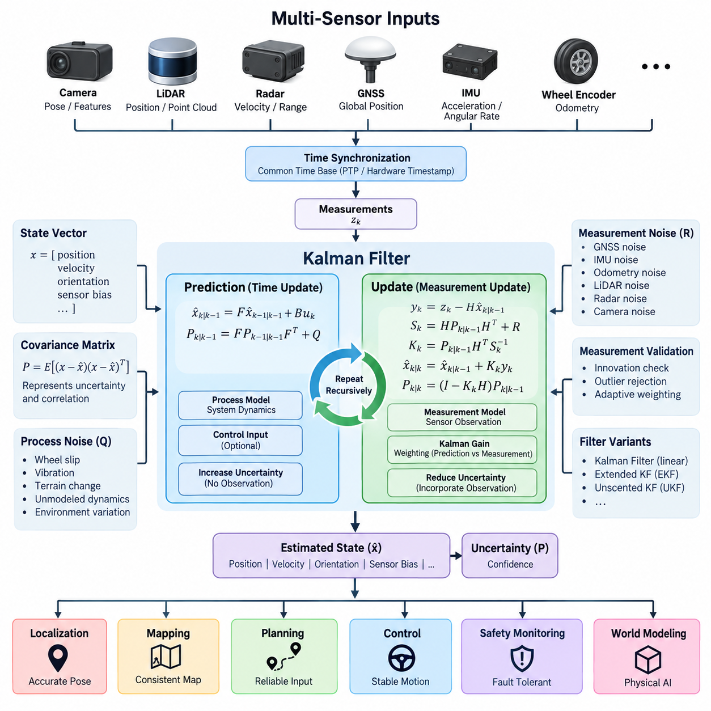
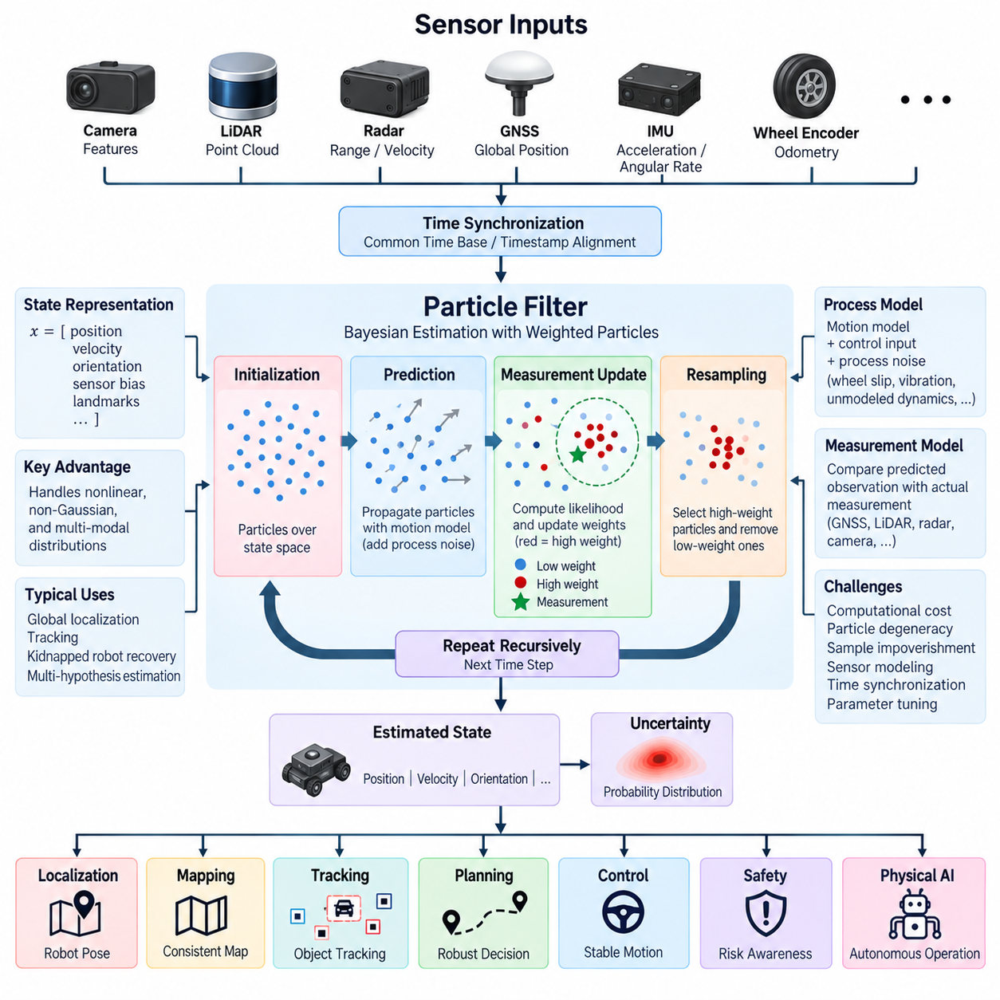
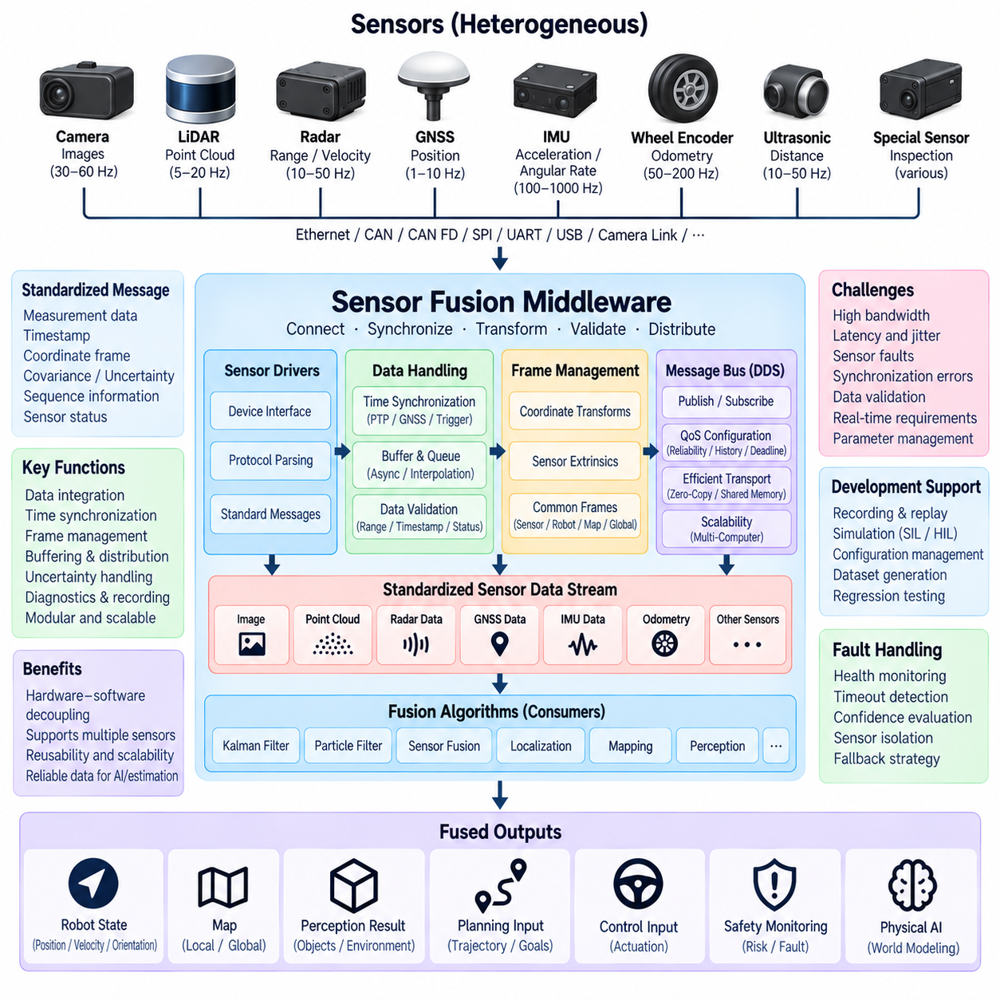
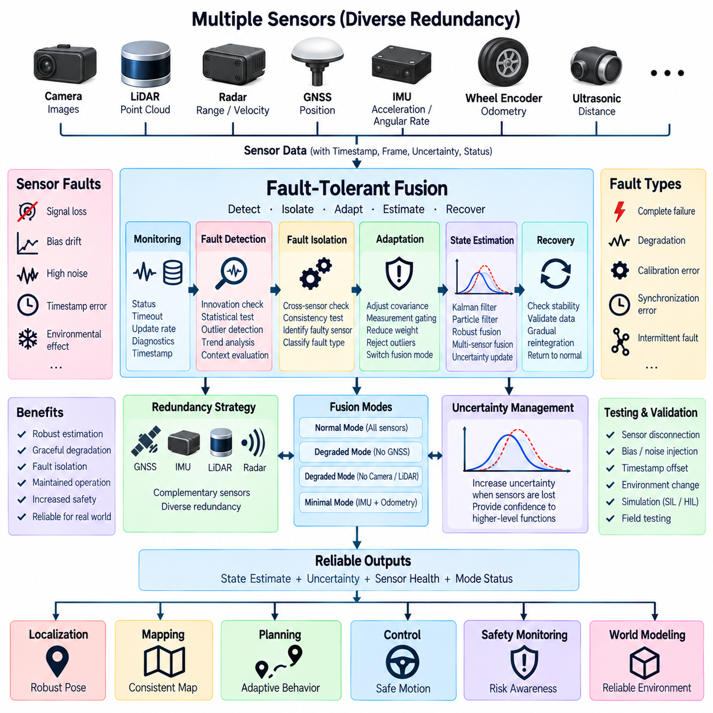
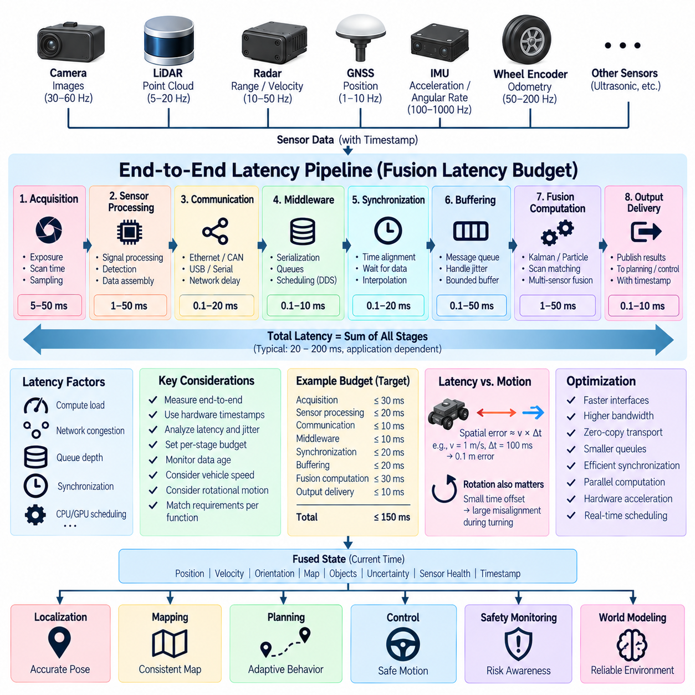

**Volume 15 Perception and Sensor Architecture**

# Chapter 10. Sensor Fusion Architecture

## 10.01. Kalman Filter Basics

{width="7.268055555555556in" height="7.268055555555556in"}

A Kalman filter is a recursive estimation method used to infer the internal state of a dynamic system from measurements that contain noise and uncertainty. In sensor fusion architecture, the state may represent position, velocity, acceleration, orientation, or sensor bias. Rather than trusting one measurement directly, the filter continuously combines a predicted state with new observations to obtain a statistically improved estimate.

The fundamental idea is to represent both the estimated state and its uncertainty. The state vector contains the variables that the system needs to estimate, while the covariance matrix describes how uncertain those estimates are and how errors between state variables are correlated. This explicit representation of uncertainty distinguishes Kalman filtering from simple averaging or deterministic correction methods and enables systematic fusion of heterogeneous sensors.

The prediction stage estimates how the state evolves between measurements. A mathematical process model propagates the previous state forward using elapsed time, system dynamics, and optional control inputs. For a mobile robot, a simple model may predict position from velocity and predict velocity from acceleration. The covariance is propagated at the same time so that uncertainty normally increases while the system operates without corrective observations.

Process noise represents uncertainty that cannot be captured perfectly by the motion model. Wheel slip, vibration, terrain irregularity, unmodeled acceleration, actuator variation, and changing environmental conditions can all cause the real system to deviate from its predicted behavior. The process-noise covariance determines how strongly the filter acknowledges these unknown dynamics. If it is configured too small, the estimator can become excessively confident in an inaccurate prediction.

The measurement stage begins when a sensor observation becomes available. A measurement model describes how the internal state should appear in the sensor domain. The difference between the actual observation and the predicted observation is called the innovation or residual. This quantity provides the information required to correct the predicted state and also serves as an important diagnostic indicator for detecting inconsistent measurements or incorrect models.

The Kalman gain determines the relative influence of prediction and measurement during correction. It is calculated from predicted state uncertainty, measurement uncertainty, and the measurement model. When the prediction is uncertain and the sensor is reliable, the gain gives greater influence to the measurement. When sensor noise is large, the estimator relies more strongly on its predicted state. This weighting is recomputed recursively as uncertainty changes.

Measurement-noise covariance describes the expected uncertainty of each sensor observation. GNSS position, IMU acceleration, wheel odometry, LiDAR localization, radar velocity, and camera-based estimates have different error characteristics and therefore should not be treated equally. Accurate covariance modeling allows the fusion algorithm to assign appropriate confidence to each information source instead of assuming that all sensor outputs have identical reliability.

The complete Kalman filtering cycle therefore consists of repeated prediction and correction. Prediction propagates the state and covariance forward in time, while correction incorporates available observations and reduces uncertainty where useful information is provided. Because the previous estimate becomes the starting point for the next cycle, the algorithm operates recursively and does not need to retain the complete history of all earlier measurements.

The classical Kalman filter assumes that system dynamics and measurement relationships can be represented by linear models and that relevant uncertainty can be approximated by Gaussian distributions. Under these assumptions, it provides an efficient minimum-error estimation framework. Many robotic systems, however, contain nonlinear motion, rotation, coordinate transformations, range measurements, and sensor models, requiring extensions of the basic formulation.

The Extended Kalman Filter, commonly called EKF, addresses nonlinear systems by linearizing nonlinear process and measurement functions around the current estimate. Jacobian matrices describe the local relationship between small changes in the state and corresponding changes in system behavior. EKF is widely used in robotics because navigation states involving orientation, inertial measurements, GNSS observations, and vehicle motion are naturally nonlinear.

For more strongly nonlinear estimation problems, alternatives such as the Unscented Kalman Filter can be considered. Instead of locally linearizing the nonlinear functions, the UKF propagates a carefully selected set of representative sigma points through those functions. This can capture nonlinear transformations more accurately in some applications, although it generally requires greater computation than a basic linear Kalman filter or a carefully optimized EKF.

In an AMR navigation architecture, an IMU can provide high-rate acceleration and angular-rate information for rapid state propagation, while GNSS RTK can periodically constrain absolute position outdoors. Wheel odometry can contribute short-term motion information, and LiDAR or camera localization can provide additional pose observations. The Kalman framework combines these measurements according to their modeled uncertainty rather than simply selecting one sensor as authoritative.

This complementary behavior is especially important because different sensors fail in different ways. GNSS may provide accurate global coordinates in open environments but degrade near buildings or under obstruction. IMU measurements remain available at high frequency but accumulate drift when integrated over time. Wheel odometry can be locally stable but becomes inaccurate during slip. Fusion allows one sensing modality to constrain errors accumulated by another.

Sensor bias must also be considered as part of the estimation architecture. Gyroscope bias and accelerometer bias can produce substantial navigation drift even when the instantaneous measurement error appears small. A practical filter can include these biases directly in the state vector and estimate them together with motion states. This transforms slowly varying sensor errors from hidden disturbances into variables that can be continuously observed and corrected.

Covariance tuning is consequently one of the most important engineering tasks in practical Kalman filtering. Process and measurement covariance values should reflect actual sensor behavior, vehicle dynamics, mounting conditions, vibration, sampling rate, and operating environment. Incorrect tuning can produce estimates that appear smooth while being physically wrong, or estimates that respond excessively to noisy measurements and become unstable or inconsistent.

Time synchronization is equally critical in multi-sensor filtering. A mathematically correct estimator can still generate large errors when measurements correspond to different physical times. GNSS, IMU, LiDAR, radar, camera, and wheel-encoder data should therefore carry reliable timestamps referenced to a common time base. Hardware timestamping, PTP synchronization, trigger signals, and carefully characterized communication latency can significantly improve fusion accuracy.

Measurement validation should normally precede state correction. Innovation magnitude can be compared with expected statistical bounds to identify observations that are inconsistent with the predicted state. Outlier rejection or adaptive weighting can prevent a temporary GNSS jump, false visual localization result, corrupted wheel measurement, or abnormal radar observation from abruptly disturbing the fused state. This makes filtering part of a broader fault-aware perception architecture.

The filter update rate should be selected according to vehicle dynamics, sensor frequencies, and compute capability. High-rate inertial prediction may operate much faster than GNSS, LiDAR, or camera corrections. A practical fusion implementation therefore needs to support asynchronous observations while maintaining consistent state propagation between timestamps. Buffering and delayed-measurement handling may be necessary when processing pipelines introduce different and variable latencies.

For Physical AI systems, the Kalman filter is best understood as an uncertainty-aware state estimation layer between raw sensing and higher-level intelligence. Perception, localization, planning, control, safety monitoring, and world modeling depend on a coherent estimate of the robot\'s physical state. The filter converts noisy and partially redundant measurements into a continuously updated representation that downstream algorithms can consume with associated confidence information.

The basic Kalman filter is therefore not merely a noise-removal algorithm. It establishes a systematic relationship among physical models, sensor observations, uncertainty, timing, and recursive correction. Understanding this relationship provides the foundation for more advanced sensor fusion architectures, including EKF-based navigation, inertial fusion, fault-tolerant estimation, and tightly synchronized multi-sensor systems used in AMRs, autonomous vehicles, and UAVs.

## 10.02. Particle Filter Basics

{width="7.268055555555556in" height="7.268055555555556in"}

A particle filter is a recursive Bayesian estimation method used to represent and track uncertain system states with a collection of discrete hypotheses called particles. Each particle represents one possible state of the system and carries an associated weight describing its probability. Unlike a Kalman filter, a particle filter does not require the state uncertainty to follow a Gaussian distribution or the system equations to be linear.

The state distribution is approximated by many particles distributed across the possible state space. A particle may contain position, velocity, orientation, sensor bias, landmark association, or other variables required by the estimation problem. Together, the particles approximate the posterior probability distribution of the system state, allowing the estimator to represent asymmetric, multimodal, or highly nonlinear uncertainty.

Particle filtering is based on the Bayesian estimation principle. The estimator maintains a belief about the current state and recursively updates that belief as the system moves and new measurements arrive. The previous posterior distribution becomes the prior information for the next estimation cycle. This recursive structure makes particle filtering suitable for continuous localization and tracking problems in autonomous robots and other dynamic systems.

The prediction stage propagates every particle through a process or motion model. For a mobile robot, the model may use commanded velocity, steering angle, wheel odometry, inertial measurements, or vehicle kinematics to estimate how each hypothetical state changes over time. Random process noise is introduced during propagation so that the particle population represents uncertainty caused by motion errors, wheel slip, terrain changes, and unmodeled dynamics.

After prediction, the particles usually spread across the state space because uncertainty accumulates during motion. The amount and direction of this spread depend on the process model and its noise distribution. A highly accurate motion model produces a relatively concentrated particle population, while uncertain motion produces wider dispersion. This mechanism allows particle filters to represent complex uncertainty without forcing it into a single covariance matrix.

When a new sensor observation becomes available, the measurement model evaluates how well each predicted particle explains that observation. Measurements may originate from GNSS, LiDAR, radar, cameras, wheel encoders, or other perception sensors. The predicted observation associated with each particle is compared with the actual measurement, and a likelihood value is calculated to express their consistency.

The likelihood becomes the basis for particle weighting. Particles that are highly consistent with the sensor measurement receive larger weights, while particles that poorly explain the observation receive smaller weights. After normalization, the weights approximate the relative probability of each hypothesis. The resulting weighted population represents the updated posterior distribution after incorporating the latest sensor information.

A fundamental operation of particle filtering is resampling. During resampling, particles with high weights are selected more frequently to form the next population, while particles with very low weights are gradually removed. This concentrates computational resources around regions of the state space that are supported by observations. The new population then becomes the starting distribution for the next prediction and measurement cycle.

Repeated resampling can create particle degeneracy or sample impoverishment. Degeneracy occurs when most particles carry negligible weights and only a few particles dominate the distribution. Sample impoverishment occurs when repeated copies of high-weight particles reduce diversity. Effective implementations therefore monitor particle quality and may use adaptive resampling, additional noise, improved proposal distributions, or other mechanisms to preserve useful hypotheses.

The effective sample size is commonly used to determine whether resampling is necessary. Instead of resampling after every measurement, the estimator can examine how concentrated the normalized particle weights have become. If many particles still contribute meaningfully, resampling can be postponed. If only a small number of particles dominate, resampling can be triggered to redistribute computational effort toward more probable state regions.

Particle count strongly influences both estimation quality and computational cost. Too few particles may fail to represent important hypotheses, particularly when the state space is large or the probability distribution contains multiple modes. Increasing the number of particles generally improves distribution coverage but requires additional processing for prediction, measurement evaluation, normalization, and resampling. Real-time systems therefore require a balance between accuracy and available compute resources.

One of the major advantages of particle filtering is its ability to maintain multiple hypotheses simultaneously. During robot localization, for example, several different positions may initially appear consistent with similar environmental features. A Gaussian estimator may struggle to represent these separated possibilities, whereas a particle filter can maintain clusters in several locations until subsequent observations provide enough evidence to eliminate incorrect hypotheses.

This property is particularly useful for global localization and kidnapped-robot recovery. When the initial robot pose is unknown, particles can be distributed over a large map rather than initialized around one assumed location. As LiDAR, camera, GNSS, or other observations arrive, inconsistent hypotheses lose weight while particles near the true pose become dominant. The estimator can therefore converge from substantial initial uncertainty.

Particle filters are also well suited to nonlinear motion and measurement models. Vehicle turning dynamics, range observations, bearing measurements, obstacle geometry, and visual perception can introduce nonlinear relationships between the physical state and sensor observations. Because particles are propagated directly through these models, explicit local linearization such as the Jacobian calculations required by an Extended Kalman Filter is generally unnecessary.

The flexibility of particle filtering comes with significant computational requirements. Every particle must be propagated and evaluated against measurements, and complex sensor models can make likelihood computation expensive. LiDAR scan matching or image-based likelihood evaluation across thousands of particles may dominate processing time. Efficient implementations therefore use reduced representations, parallel processing, hierarchical estimation, or carefully designed observation models.

Measurement modeling is critical to filter performance. A theoretically powerful particle filter can still fail if its likelihood function does not accurately represent sensor behavior. Measurement noise, environmental ambiguity, occlusion, multipath effects, false detections, map errors, and changing operating conditions should be reflected appropriately. Overly sharp likelihood models can eliminate valid hypotheses, while overly broad models may prevent convergence.

Time synchronization also remains important even though the estimator can represent complex uncertainty. Particles predicted to one timestamp should be compared with measurements corresponding to that same physical time. Delayed camera processing, LiDAR scan duration, GNSS latency, radar timestamps, and asynchronous IMU updates can otherwise produce systematic likelihood errors. Timestamp management and latency compensation are therefore integral parts of practical particle-filter architecture.

Particle filters can operate together with other estimation methods rather than replacing them completely. A system may use a particle filter for global localization while employing an Extended Kalman Filter for high-rate local motion estimation. Particle-based estimation can resolve multiple global hypotheses, after which a Gaussian estimator provides efficient continuous tracking. Such hybrid architectures exploit the complementary strengths of different probabilistic estimation techniques.

In an AMR, autonomous vehicle, or UAV architecture, particle filtering can support localization, object tracking, terrain-state estimation, fault diagnosis, and other problems involving ambiguous or non-Gaussian uncertainty. The method is particularly valuable when sensor observations produce several plausible explanations or when the system must recover from a major localization failure rather than merely correct small errors around a known state.

The output of a particle filter may be represented by the highest-weight particle, a weighted mean, a dominant particle cluster, or the complete probability distribution. The appropriate representation depends on the downstream application. Planning and control may require a single pose estimate, while safety monitoring or decision-making can benefit from information about multiple hypotheses and the uncertainty distributed among them.

For Physical AI systems, particle filtering provides a mechanism for reasoning about physical state when uncertainty cannot be adequately summarized by one mean and covariance. It enables perception and localization systems to preserve alternative explanations until sensor evidence becomes sufficiently strong. This capability is valuable in dynamic, partially observable, and ambiguous environments where premature commitment to a single hypothesis can cause incorrect decisions.

The particle filter should therefore be understood as a sampling-based Bayesian estimation framework rather than simply another noise-filtering technique. Its prediction, likelihood evaluation, weighting, normalization, and resampling stages recursively transform a population of hypotheses into an updated belief about the physical world. This foundation supports advanced sensor fusion, probabilistic localization, tracking, and robust state estimation within modern robotic perception architectures.

## 10.03. Sensor Fusion Middleware

{width="7.268055555555556in" height="7.268055555555556in"}

Sensor fusion middleware is the software layer that connects heterogeneous sensors with estimation, perception, localization, and decision-making algorithms. Rather than allowing every fusion algorithm to communicate directly with individual sensor drivers, middleware provides standardized interfaces for data transport, timestamps, coordinate frames, metadata, quality information, and system status. This separation improves modularity and allows sensing hardware or fusion algorithms to evolve independently.

A modern robotic platform may simultaneously use cameras, LiDARs, radar, GNSS, IMUs, wheel encoders, ultrasonic sensors, and specialized inspection sensors. These devices generate fundamentally different data types at different rates and resolutions. Sensor fusion middleware provides a common integration environment in which raw measurements can be received, validated, transformed, synchronized, buffered, and distributed to multiple consumers without tightly coupling application software to sensor-specific interfaces.

The middleware architecture normally separates sensor acquisition from fusion processing. Device drivers communicate with physical sensors through interfaces such as Ethernet, CAN, CAN FD, SPI, UART, USB, or dedicated camera links and convert hardware-specific messages into standardized software representations. Higher-level fusion components can then process these representations without needing detailed knowledge of the underlying electrical interface, packet structure, or manufacturer-specific communication protocol.

Standardized message definitions are essential because fusion algorithms depend on consistent interpretation of sensor data. A message should identify not only the measurement itself but also its timestamp, coordinate frame, sequence information, covariance or uncertainty when available, and relevant sensor status. For example, an IMU message may contain acceleration and angular velocity, while a GNSS message may provide position, fix quality, covariance, and timing information required for navigation fusion.

Time synchronization is one of the most important middleware responsibilities. Measurements generated by different sensors must be associated with the physical time at which they were captured rather than simply the time at which software received them. Hardware timestamps, Precision Time Protocol (PTP), GNSS-derived time, trigger signals, and synchronized system clocks can establish a common temporal reference from sensors through computing nodes.

Middleware must also handle sensors operating at very different frequencies. An IMU may produce hundreds or thousands of measurements per second, while GNSS may update at a much lower rate and cameras or LiDARs may generate larger frames at intermediate frequencies. Fusion software therefore requires asynchronous data handling, queues, timestamp-based association, interpolation, and sometimes state propagation so that observations can be combined at meaningful temporal reference points.

Coordinate-frame management provides the spatial equivalent of time synchronization. Each sensor measures the environment relative to its own physical mounting frame, while navigation and perception algorithms may operate in robot, vehicle, odometry, map, or global coordinate frames. Middleware should provide consistent transformation relationships derived from sensor extrinsic calibration so that measurements from physically separated devices can be interpreted within a common geometric reference.

In ROS 2-based robotic architectures, middleware commonly uses publish-subscribe communication to decouple data producers from consumers. Sensor drivers publish standardized messages, while localization, perception, mapping, monitoring, recording, and visualization components subscribe to the information they require. This architecture allows one sensor stream to support multiple applications simultaneously and enables components to be replaced without redesigning the complete communication path.

Data Distribution Service (DDS) provides the communication foundation for many ROS 2 deployments and supports configurable Quality of Service (QoS) policies. Reliability, history depth, durability, deadline, lifespan, and delivery behavior can be selected according to the characteristics of each sensor stream. High-bandwidth camera or LiDAR data may require different communication policies from low-bandwidth safety status, GNSS information, or control-related state estimates.

Middleware design must consider bandwidth because modern perception sensors can generate substantial data volumes. Multiple high-resolution cameras and 3D LiDARs can place significant loads on Ethernet links, memory bandwidth, CPU resources, and inter-process communication. Unnecessary serialization and copying can increase latency and processor utilization. Shared memory, zero-copy transport, hardware acceleration, and efficient message layouts can therefore become important for high-performance robotic platforms.

Buffer management is closely related to latency and synchronization. Fusion algorithms often require measurements from nearby timestamps, which means middleware must retain limited histories of sensor messages. Buffers that are too small can discard useful observations before corresponding data arrives, while excessively large queues increase memory consumption and may cause stale information to propagate through the system. Queue depth should therefore reflect sensor frequency, jitter, processing delay, and fusion requirements.

Sensor fusion middleware should preserve uncertainty information rather than transporting only nominal measurement values. Covariance matrices, confidence scores, signal quality, GNSS fix status, tracking confidence, or other sensor-specific quality indicators can help downstream estimators determine how strongly each observation should influence the fused state. This information is particularly important for Kalman filters, particle filters, probabilistic localization, and fault-aware fusion algorithms.

Validation can be performed at several middleware boundaries before data reaches the estimator. Messages can be checked for invalid timestamps, missing fields, impossible ranges, communication corruption, excessive delay, sequence discontinuities, or abnormal sensor status. Detecting these conditions early prevents malformed or stale measurements from silently entering the fusion pipeline and provides diagnostic information that can be used by monitoring and safety functions.

Fault isolation is especially important in autonomous systems because a sensor may continue transmitting syntactically valid data even when its measurements are physically incorrect. Middleware can expose health states, timeout conditions, update-rate deviations, synchronization errors, and confidence degradation to higher-level fault-tolerant fusion logic. The fusion system can then reduce the influence of a degraded sensor, reject its observations, or transition to an alternative sensing configuration.

Latency should be treated as an end-to-end architectural property rather than only as network transmission time. Sensor exposure or scanning, internal device processing, communication, driver execution, serialization, queueing, fusion computation, and scheduling all contribute to the age of information. Middleware instrumentation should therefore measure timestamps at important processing boundaries so that engineers can determine where delay and jitter are introduced.

Deterministic behavior becomes increasingly important when fused state estimates are consumed by motion control or safety-related functions. General perception pipelines may tolerate moderate timing variation, but high-speed control and safety monitoring require bounded latency and predictable execution. Real-time operating-system configuration, thread priorities, CPU affinity, deterministic networking, and carefully controlled middleware queues can improve temporal behavior when the application requires stronger guarantees.

A scalable middleware architecture should support distributed computing because sensor processing may span several compute devices. An AMR can use an embedded controller for vehicle interfaces, a Jetson-class computer for perception, and an edge PC or GPU platform for advanced AI processing. Middleware must maintain consistent message definitions, timestamps, coordinate frames, and communication behavior across these computing boundaries while avoiding unnecessary duplication of high-bandwidth data.

Recording and replay are also fundamental middleware capabilities for development and validation. Sensor streams, timestamps, transforms, system states, and diagnostic information can be recorded during real operation and replayed later through the same interfaces used by live sensors. This enables repeatable algorithm development, regression testing, fault investigation, dataset construction, and comparison of alternative fusion algorithms without requiring the physical robot for every experiment.

Simulation should use interfaces that closely resemble those of real sensors whenever practical. If simulated cameras, LiDARs, GNSS receivers, IMUs, and vehicle states publish compatible messages, the same fusion components can operate in simulation and on physical hardware with limited modification. This supports software-in-the-loop and hardware-in-the-loop workflows while reducing the architectural gap between development, verification, and deployment environments.

Configuration management is necessary because sensor fusion behavior depends on calibration parameters, coordinate transformations, noise models, update rates, network settings, and algorithm-specific parameters. Middleware should provide controlled mechanisms for loading and versioning these values. Recording configuration versions together with datasets and test results improves reproducibility and helps engineers determine whether performance changes originate from software, calibration, hardware, or parameter modifications.

For Physical AI systems, sensor fusion middleware forms the operational bridge between physical sensing and machine intelligence. It converts independently operating sensors into a temporally and spatially coherent information infrastructure from which localization, mapping, perception, planning, control, safety monitoring, and world modeling can obtain reliable inputs. Its quality directly influences whether higher-level AI receives a consistent representation of the physical environment.

Sensor fusion middleware should therefore be considered part of the perception architecture rather than merely a communication utility. Reliable transport, common timestamps, coordinate transforms, uncertainty metadata, buffering, QoS, diagnostics, recording, and fault handling collectively determine the integrity of information reaching fusion algorithms. A well-designed middleware layer allows Kalman filters, particle filters, and advanced Physical AI models to operate on synchronized, traceable, and trustworthy sensor information.

## 10.04. Fault Tolerant Fusion

{width="7.268055555555556in" height="7.268055555555556in"}

Fault-tolerant fusion is a sensor fusion architecture designed to maintain reliable state estimation when one or more sensors become inaccurate, unavailable, delayed, corrupted, or physically inconsistent. Instead of assuming that every incoming measurement is valid, the fusion system continuously evaluates sensor health and measurement credibility. Its objective is to detect abnormal information, isolate its influence, and preserve the best possible estimate using the remaining trustworthy sensing resources.

Autonomous robots depend on multiple sensors because no individual sensing technology remains reliable under every operating condition. GNSS can degrade near buildings or under obstruction, cameras can suffer from darkness or glare, LiDAR can be affected by contamination or adverse weather, radar may generate ambiguous reflections, and wheel odometry can become inaccurate during slip. Fault-tolerant fusion uses this diversity as functional redundancy rather than treating multiple sensors merely as additional data sources.

Sensor faults can appear in several forms and may develop either suddenly or gradually. Complete loss of communication is relatively easy to identify, but subtle failures are more difficult because the sensor may continue transmitting plausible-looking measurements. Bias drift, scale-factor errors, frozen values, timestamp errors, increasing noise, intermittent communication, calibration changes, and environmental degradation can all corrupt fusion results without producing an obvious hardware failure indication.

Fault detection begins by observing both sensor-level status and measurement-level consistency. Middleware can monitor communication timeouts, update rates, sequence numbers, device diagnostics, timestamps, temperature, and internal sensor status. The estimator can independently evaluate whether each observation is statistically compatible with the predicted system state. Combining these two information sources provides stronger fault detection than relying only on a sensor\'s self-reported health status.

Innovation or residual analysis is particularly useful in Kalman-filter-based fusion. The difference between a measured observation and its predicted value indicates whether the measurement agrees with the current state estimate. Residuals that repeatedly exceed statistically expected limits can indicate sensor degradation, incorrect covariance, calibration error, timing problems, or an actual fault. Normalized innovation tests allow different measurement types to be evaluated using comparable statistical criteria.

A single abnormal residual should not automatically be interpreted as a permanent sensor failure. Dynamic motion, temporary occlusion, multipath GNSS reception, unusual terrain, or imperfect models can briefly produce large discrepancies. Practical fault logic therefore considers persistence, frequency, magnitude, operating context, and agreement with other sensors. This prevents unnecessary sensor isolation while still enabling rapid response when evidence of a genuine fault becomes sufficiently strong.

Fault isolation determines which sensing source is responsible after abnormal behavior has been detected. Cross-comparison between redundant or complementary sensors can help distinguish a faulty measurement from legitimate vehicle motion. For example, disagreement between GNSS and the fused trajectory can be compared with IMU, wheel odometry, LiDAR localization, and map constraints. Agreement among several independent sources increases confidence that the inconsistent sensor should be treated as degraded.

Once a sensor is considered unreliable, the fusion system can reduce its influence rather than immediately removing it. Adaptive covariance adjustment increases the measurement uncertainty assigned to suspicious data, causing a probabilistic estimator to trust that observation less strongly. This provides graceful degradation when sensor quality deteriorates gradually. If the fault becomes severe or persistent, the measurement can eventually be rejected or the sensor can be excluded entirely.

Measurement gating provides another protection mechanism. Before an observation is accepted into the estimator, its innovation can be compared with a predefined statistical acceptance region. Measurements outside this region are rejected, delayed for additional validation, or processed with reduced confidence. Gating is especially useful for suppressing isolated GNSS jumps, incorrect object associations, false visual localization results, and other outliers that could abruptly disturb the estimated state.

Redundancy should be designed according to sensing function rather than simply by duplicating identical devices. GNSS, IMU, LiDAR, radar, cameras, and wheel odometry observe different physical properties and fail under different environmental conditions. Diverse redundancy therefore provides stronger resilience against common-cause failures. For example, combining satellite positioning with inertial and environment-relative localization can maintain navigation when one sensing principle becomes temporarily unreliable.

A fault-tolerant architecture can maintain multiple fusion modes corresponding to available sensor combinations. Normal operation may use all sensors, while degraded modes can operate without GNSS, camera localization, LiDAR localization, or wheel odometry. Each mode should define which measurements remain available, how uncertainty changes, and what operational capability can still be supported. Mode transitions should be controlled and observable rather than occurring as undocumented algorithmic side effects.

State uncertainty must increase when information sources are lost. A fusion system should never continue reporting the same confidence after an important sensor becomes unavailable unless equivalent information is provided elsewhere. Covariance growth or another explicit uncertainty representation communicates this degradation to planning, control, and safety functions. Higher-level systems can then reduce speed, increase safety margins, restrict maneuvers, or request a controlled stop when estimation quality becomes insufficient.

Fault recovery is as important as fault detection. A sensor that temporarily degraded may later return to normal operation, but immediately restoring full influence can introduce discontinuities or reintroduce an unresolved fault. Recovery logic can require a period of stable measurements, successful consistency checks, valid synchronization, and acceptable diagnostic status before reintegration. The sensor weight can then be increased gradually to produce a controlled transition back to normal fusion.

Time faults deserve special attention because otherwise accurate measurements can become dangerous when associated with the wrong physical time. Clock drift, delayed packets, timestamp corruption, synchronization loss, or excessive processing latency can make spatially correct data inconsistent with the current robot state. Fault-tolerant fusion should therefore monitor timestamp validity, message age, synchronization quality, and latency in addition to checking measurement values themselves.

Coordinate-frame and calibration faults can similarly create systematic inconsistencies. A shifted LiDAR mounting position, incorrect camera extrinsic calibration, IMU alignment error, or wrong transform configuration may cause measurements to disagree continuously even though each sensor is internally healthy. Fusion diagnostics should distinguish between device failure and transformation or calibration failure because the appropriate recovery strategy and maintenance action are different.

Fault-tolerant fusion middleware should distribute sensor-health information together with measurement data. Health states may indicate normal, degraded, unavailable, recovering, or isolated operation and can include confidence, fault codes, synchronization status, and data age. This information enables localization, perception, planning, control, safety monitoring, recording, and fleet diagnostics to share a consistent understanding of the sensing system\'s current capability.

Kalman filters can support fault tolerance through innovation monitoring, adaptive covariance, measurement gating, and dynamic sensor inclusion. Particle filters can reduce the likelihood associated with inconsistent observations or change measurement models when sensing conditions deteriorate. More advanced systems may operate parallel estimators using different sensor subsets and compare their outputs, providing additional evidence for fault detection and isolation when computational resources permit.

Graceful degradation is a central design objective. The system should not move directly from fully autonomous operation to complete failure whenever a single sensor is lost. Instead, available functionality should decrease according to the remaining sensing capability and estimation confidence. An outdoor AMR losing RTK corrections, for example, may continue temporarily using inertial, odometry, and LiDAR information while operating with reduced speed and increased uncertainty.

Safety-related decisions should be separated from the estimator\'s desire to continue producing an output. A fusion algorithm can mathematically generate a state estimate even when uncertainty has become too large for safe autonomous operation. Safety supervision must therefore evaluate estimation integrity and determine whether the resulting state remains suitable for the current mission. If required confidence cannot be maintained, the system should transition toward a defined minimal-risk behavior.

Diagnostics and recording are essential for validating fault-tolerant behavior. Sensor measurements, residuals, covariance values, health states, rejected observations, mode transitions, synchronization status, and fault decisions should be logged with consistent timestamps. These records allow engineers to reconstruct field incidents, verify whether isolation decisions were appropriate, improve thresholds, and reproduce failures through recorded-data replay or simulation.

Testing should deliberately introduce sensor faults rather than validating only normal operation. Useful scenarios include sensor disconnection, frozen measurements, bias injection, increased noise, packet delay, timestamp offsets, calibration errors, GNSS degradation, wheel slip, and intermittent communication. Simulation, software-in-the-loop, hardware-in-the-loop, and controlled field testing can verify whether faults are detected, isolated, tolerated, and recovered without unacceptable state-estimation behavior.

For Physical AI systems, fault-tolerant fusion provides an integrity layer between uncertain physical sensing and autonomous intelligence. Planning, control, world modeling, and safety functions should receive not only the estimated state but also information describing how trustworthy that estimate is and which sensors currently support it. This allows autonomous behavior to adapt to sensing capability rather than assuming that perception quality remains constant throughout operation.

Fault-tolerant fusion should therefore be understood as a continuous process of estimation, health assessment, consistency checking, isolation, adaptation, and recovery. Its effectiveness depends on sensor diversity, accurate uncertainty models, synchronized data, middleware diagnostics, robust estimation, and explicit degraded operating modes. Together, these mechanisms enable AMRs, autonomous vehicles, UAVs, and other Physical AI platforms to maintain controlled behavior when real-world sensing inevitably becomes imperfect.

## 10.05. Fusion Latency Budget

{width="7.268055555555556in" height="7.268055555555556in"}

Fusion latency budget defines the maximum allowable time between a physical event being sensed and the corresponding fused state becoming available to downstream functions. In autonomous robots, this delay directly affects localization, perception, planning, control, and safety. A fusion algorithm may produce mathematically accurate estimates, but if those estimates describe an outdated physical state, the overall system can still make incorrect or unsafe decisions.

Latency should therefore be analyzed as an end-to-end property rather than as the execution time of the fusion algorithm alone. The complete path begins when a sensor captures a physical phenomenon and includes sensing, internal processing, communication, middleware transport, synchronization, buffering, fusion computation, and output delivery. Every stage consumes part of the total latency budget and can introduce both fixed delay and timing variation.

Sensor acquisition latency begins at the physical measurement process. A camera requires exposure and frame readout, a rotating LiDAR requires time to complete part or all of a scan, radar performs waveform transmission and signal processing, and an IMU samples inertial quantities at defined intervals. The timestamp should represent the actual measurement time as accurately as possible because data arrival time alone cannot describe when the observed physical event occurred.

Internal sensor processing adds another component to the latency budget. Cameras may perform image signal processing, radar sensors execute detection and signal-processing pipelines, GNSS receivers calculate navigation solutions, and LiDAR units assemble point-cloud packets. These operations can create delays before measurements leave the device. Sensor specifications and system measurements should therefore distinguish acquisition time from internal processing and communication latency.

Communication latency occurs while measurements travel from sensors to computing nodes through Ethernet, CAN, CAN FD, USB, serial links, or specialized camera interfaces. Transmission time depends on payload size, link bandwidth, bus utilization, packet scheduling, protocol overhead, and network topology. High-bandwidth sensors such as cameras and 3D LiDARs require particular attention because congestion can increase both average delay and latency variation.

Middleware introduces latency through message reception, serialization, copying, queues, scheduling, and inter-process or inter-computer transport. In ROS 2 and DDS-based systems, Quality of Service settings influence how messages are buffered and delivered. Excessive queue depth may preserve old data at the cost of freshness, while poorly selected reliability policies can create retransmission or blocking behavior that increases the age of information reaching the fusion process.

Synchronization latency arises because fusion algorithms often require measurements from different sensors to correspond to compatible timestamps. A fast IMU stream may need to wait for slower GNSS, camera, radar, or LiDAR observations, while approximate synchronization mechanisms may hold messages until matching data becomes available. Waiting can improve temporal alignment but increases latency, creating a fundamental tradeoff between synchronization accuracy and information freshness.

Buffering is necessary when sensor streams are asynchronous or arrive with variable jitter. The fusion middleware may retain recent observations so that measurements can be associated, interpolated, or processed after delayed information arrives. However, buffering must be bounded. Large buffers can hide communication irregularities while silently increasing system latency, so buffer depth should be selected from measured sensor rates, jitter distributions, processing times, and application deadlines.

Fusion computation itself consumes part of the available budget. Kalman filtering can often be executed efficiently, but large state vectors, nonlinear EKF operations, particle filters, scan matching, visual localization, and multi-object fusion can require substantially more computation. Processing time should be measured under realistic CPU and GPU loads because an algorithm that satisfies timing requirements in isolation may violate them when perception and AI workloads execute concurrently.

Scheduling latency becomes important when several software components compete for computing resources. A fusion process may be ready to execute but remain delayed because another thread occupies the CPU, GPU, memory subsystem, or accelerator. Operating-system scheduling, thread priorities, CPU affinity, interrupt handling, and resource contention therefore contribute to the practical latency budget. Average execution time alone cannot represent these worst-case scheduling effects.

The age of information is often more meaningful than simple communication delay. A fused state delivered at the current time may contain measurements captured tens or hundreds of milliseconds earlier. The system should therefore track the relationship between measurement timestamp, processing time, and output timestamp. State propagation can compensate for some delay by projecting an estimate toward the current time, but propagation uncertainty increases as the underlying observations become older.

Different downstream functions require different latency limits. Mapping and long-term world-model updates may tolerate relatively large delays, while motion control and collision avoidance generally require much fresher information. Safety-related functions can require particularly predictable timing because delayed obstacle or localization information reduces the time available for intervention. A single universal latency requirement is therefore inappropriate for all fusion outputs.

Vehicle speed converts latency directly into spatial error. If a robot travels at velocity v and its state estimate is delayed by time Δt, the platform moves approximately vΔt before the information is consumed, even before other estimation errors are considered. This relationship becomes increasingly important for outdoor AMRs, autonomous vehicles, and UAVs because higher operating speed reduces the acceptable end-to-end latency for perception and control.

Angular motion creates similar problems for orientation-sensitive sensors. During rapid turning, even a small timestamp difference between camera, LiDAR, radar, and IMU measurements can produce substantial geometric misalignment. Motion compensation and timestamp-aware transformation can reduce these effects, but they depend on accurate synchronization and high-rate state estimates. Latency budgeting must therefore consider both translational and rotational dynamics.

A practical budget allocates portions of the total allowable delay to individual pipeline stages. Sensor acquisition, device processing, network transport, middleware handling, synchronization, fusion computation, and downstream delivery can each receive a target limit. These allocations provide engineering boundaries for component selection and optimization. If one stage exceeds its allocation, engineers can identify where architectural changes are required instead of treating latency as an unexplained system-level problem.

Latency and jitter should be evaluated separately. Latency represents the delay experienced by information, while jitter describes variation in that delay over time. A system with a stable 30 ms delay can sometimes be easier to compensate than one varying unpredictably between 10 and 80 ms. Fusion pipelines therefore need distributions, percentiles, maximum observed values, and deadline-miss statistics rather than only average latency measurements.

Timestamp quality is fundamental to accurate latency measurement. Hardware timestamps generated close to the physical acquisition event provide stronger timing information than software timestamps assigned after data reaches a driver. Precision Time Protocol, GNSS time references, hardware triggers, and synchronized clocks can establish a common time base across distributed sensors and computers. Without reliable clock synchronization, measured latency values themselves can become misleading.

Deadline monitoring allows the system to detect when sensor or fusion information becomes too old for its intended use. Middleware can compare the current time with acquisition timestamps and reject stale measurements before they enter the estimator. Fusion outputs can similarly include their reference time, processing delay, and validity status. Higher-level functions can then decide whether an estimate remains suitable for normal operation or requires degraded behavior.

Fault-tolerant fusion and latency management are closely connected because excessive delay is effectively a sensor-quality fault. A measurement can be numerically correct yet operationally invalid if it arrives too late. Sensor-health logic should therefore consider timeout, message age, synchronization error, and latency deviation together with conventional measurement consistency. Persistent timing degradation can trigger reduced weighting, sensor isolation, or a transition to another fusion mode.

Optimization should begin with measurement rather than assumption. Engineers should instrument each major pipeline boundary and record acquisition timestamps, arrival times, queue entry and exit times, fusion start and completion times, and output delivery times. This produces an observable latency chain that can reveal network congestion, queue buildup, scheduling interference, expensive algorithms, or synchronization waits that would otherwise remain hidden.

Recording latency statistics during realistic operation is particularly important because laboratory conditions may underestimate system load. Multiple cameras, LiDAR processing, neural networks, mapping, visualization, logging, and communication can execute simultaneously on an AMR compute platform. Stress testing should therefore examine normal load, peak load, sensor bursts, degraded networking, and processor contention to determine whether timing requirements remain satisfied under realistic conditions.

Latency reduction can involve faster interfaces, higher network bandwidth, reduced message copies, zero-copy transport, smaller queues, optimized synchronization, parallel computation, hardware acceleration, and better task scheduling. However, reducing delay should not compromise data integrity or synchronization. The objective is not simply the lowest possible latency but predictable delivery of sufficiently synchronized and trustworthy information within the deadline required by each function.

For Physical AI systems, fusion latency budget connects sensing architecture directly to autonomous behavior. The world representation used by planning and control must describe the physical environment closely enough to the present moment that decisions remain valid. As robots become faster and perception pipelines become more complex, timing becomes an architectural dimension equal in importance to sensor accuracy, computational performance, and probabilistic estimation quality.

Fusion latency budget should therefore be treated as a measurable engineering contract across sensors, networks, middleware, computing, and fusion algorithms. End-to-end delay, jitter, timestamp accuracy, information age, and deadline compliance must be designed and validated together. This disciplined approach allows AMRs, autonomous vehicles, UAVs, and other Physical AI platforms to deliver fused state information with the freshness and predictability required for reliable autonomous operation.
