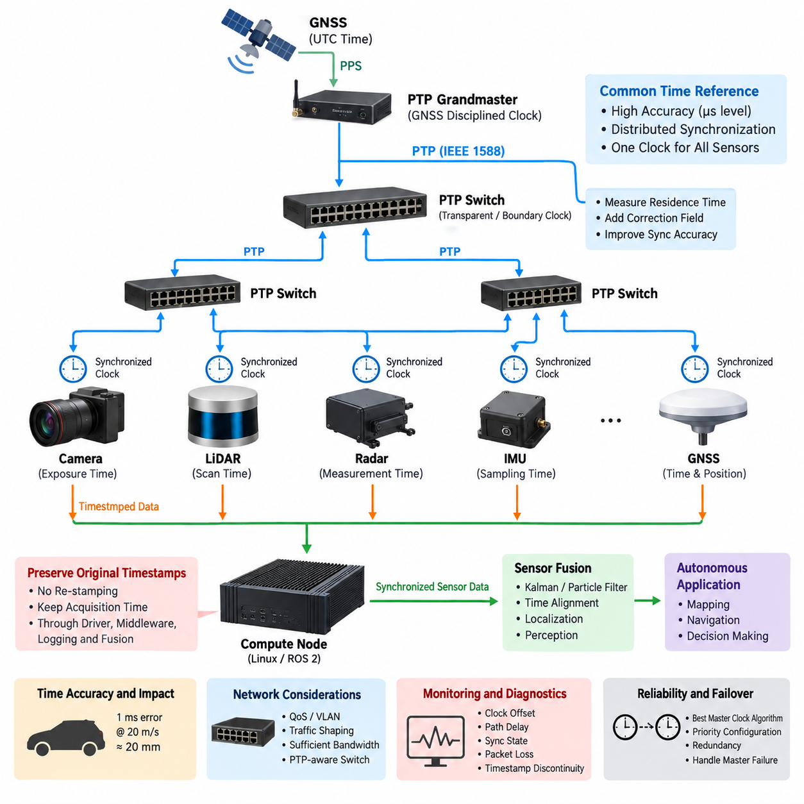
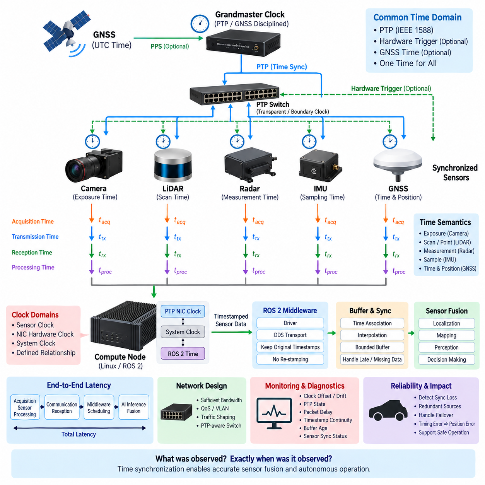
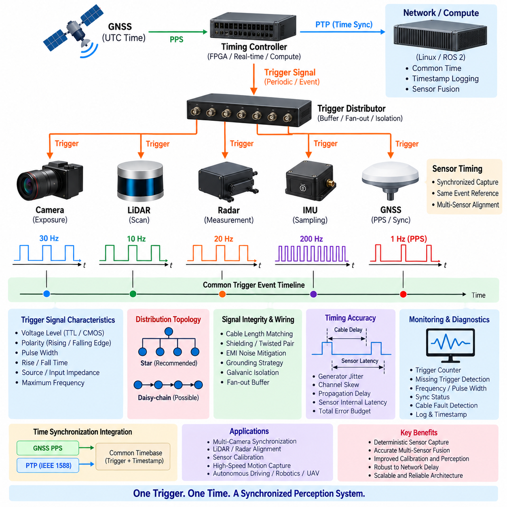
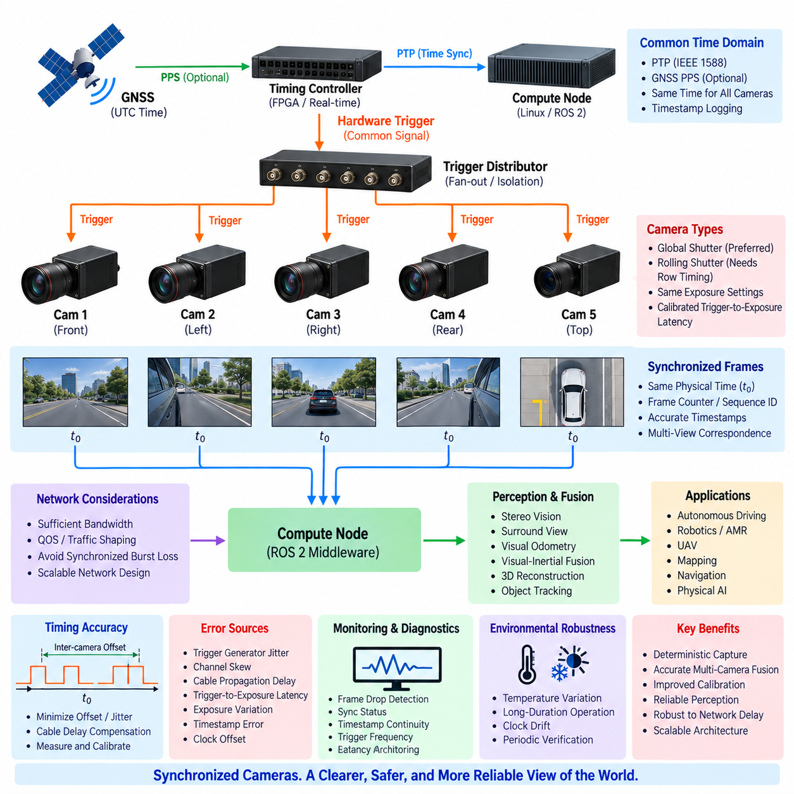
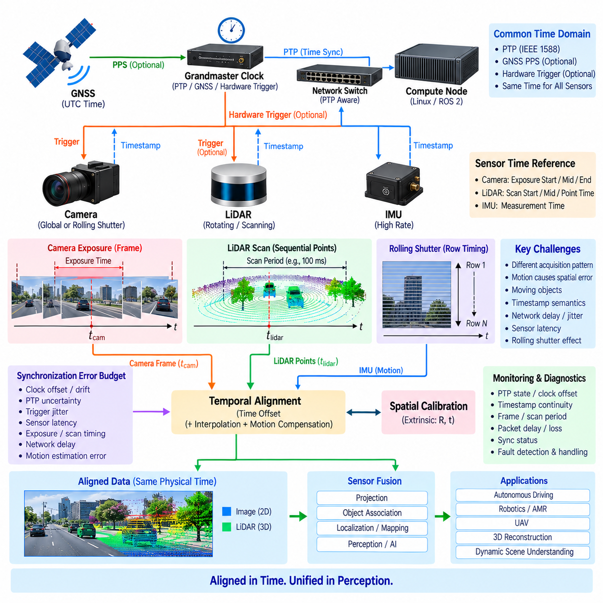

**Volume 15 Perception and Sensor Architecture**


# Chapter 11. Time Synchronization

##  

## 11.01. PTP Hardware Timestamp

{width="7.268055555555556in" height="7.268055555555556in"}

Precision Time Protocol (PTP) provides a common time reference across distributed sensors, switches, and computing nodes in a robotic perception system. In applications such as autonomous mobile robots, outdoor vehicles, and UAVs, accurate time is essential because camera images, LiDAR point clouds, radar detections, IMU measurements, and GNSS observations must represent the physical environment at consistent moments.

PTP is standardized by IEEE 1588 and synchronizes clocks through timestamped Ethernet messages exchanged between a Grandmaster Clock and participating devices. The protocol estimates clock offset and network propagation delay, then disciplines local clocks toward the common reference. Unlike simple application-level timestamping, PTP is designed specifically for distributed systems where deterministic and measurable synchronization accuracy is required.

A typical PTP domain contains a Grandmaster Clock, one or more Ethernet switches, and multiple Ordinary or Boundary Clocks. The Grandmaster establishes the reference timescale, while Sync and Follow_Up messages distribute timing information. Delay_Req and Delay_Resp exchanges estimate path delay. The resulting offset calculation allows each synchronized node to continuously correct its local clock without requiring a dedicated timing wire.

Hardware timestamping is critical when synchronization requirements reach microsecond or sub-microsecond levels. Instead of recording packet time after it has passed through the operating system and network stack, a PTP-capable Ethernet controller timestamps the frame close to the physical or MAC interface. This removes much of the nondeterministic delay caused by interrupts, driver scheduling, queues, kernel processing, and application execution.

Software timestamps may vary because CPU load, operating-system scheduling, network buffering, and driver behavior introduce unpredictable latency. A packet physically arriving at the Ethernet interface at one instant may not reach the synchronization software until considerably later. Hardware timestamps capture the event at a much more deterministic boundary, allowing the synchronization algorithm to distinguish actual network propagation delay from host-side processing latency.

A PTP-capable sensor architecture therefore depends on more than installing a PTP software daemon. The Ethernet PHY, MAC, network interface controller, switch, device driver, operating system, and sensor firmware must form a compatible timing chain. If only one portion supports hardware timestamps while another introduces uncontrolled buffering or software timestamping, end-to-end synchronization performance can be substantially worse than the nominal capability of PTP.

Transparent Clocks improve synchronization through Ethernet switches by measuring how long PTP packets remain inside each switch. This residence time is added to a correction field carried by the PTP message, allowing downstream clocks to compensate for switching latency. Boundary Clocks instead terminate one PTP timing domain and regenerate synchronization toward downstream ports, which can improve scalability and isolate timing disturbances in larger robotic networks.

The Best Master Clock Algorithm determines which eligible clock becomes the Grandmaster according to advertised clock properties and priorities. In a robot, the selected reference may originate from a dedicated timing module, GNSS-disciplined clock, industrial computer, or another high-quality source. System architects should explicitly control clock priority and failover behavior rather than assuming that the preferred clock will always become Grandmaster automatically.

GNSS can provide an absolute UTC-related reference while PTP distributes that reference through the robot\'s Ethernet network. A GNSS receiver may combine precise time information with a pulse-per-second signal, allowing a timing controller to discipline the PTP Grandmaster. Cameras, LiDARs, radar units, compute nodes, and data loggers can then share a timebase that is traceable to the external navigation timing source.

The distinction between clock synchronization and sensor measurement timing is important. A sensor may possess an accurately synchronized PTP clock while still producing measurements with internal acquisition latency. Camera exposure, LiDAR scanning, radar chirp processing, IMU sampling, buffering, compression, and packetization occur at different stages. The timestamp must therefore correspond to a clearly defined measurement event rather than merely the moment when data reaches the host computer.

For cameras, the desired timestamp may represent exposure start, exposure midpoint, or frame completion. For LiDAR, timing may be associated with an individual point, packet, firing sequence, or scan. Radar measurements can involve acquisition and processing intervals, while an IMU produces samples at much higher rates. Sensor fusion software must understand these timestamp semantics before measurements from different modalities can be aligned correctly.

PTP synchronization accuracy should therefore be translated into spatial error. If a platform travels at 20 m/s, a 1 ms timing error corresponds to approximately 20 mm of platform translation before rotational effects are considered. Fast UAV motion, steering transients, vibration, and nearby objects can amplify the consequences. Required timing accuracy should consequently be derived from motion dynamics, perception resolution, and fusion-error requirements.

Network architecture also influences PTP performance. High-bandwidth camera streams and dense LiDAR traffic can create queues in shared Ethernet switches, while burst traffic may increase packet-delay variation. Quality of Service, VLAN separation, traffic shaping, sufficient link capacity, and PTP-aware switches can protect synchronization traffic. Timing architecture should therefore be designed together with bandwidth and network-topology planning rather than treated as an independent software feature.

PTP profiles and operating modes must be selected consistently across the system. Devices may support different IEEE 1588 versions, delay mechanisms, message intervals, one-step or two-step operation, multicast behavior, and hardware timestamp capabilities. A device advertised simply as "PTP supported" is not necessarily interoperable with every sensor or switch, so engineering validation must confirm the exact profile and configuration used by all participating components.

One-step PTP inserts precise timing information directly into the synchronization message as it is transmitted, whereas two-step PTP sends a subsequent Follow_Up message containing the accurate transmission timestamp. Hardware architecture and device capability determine which mechanism is available. Both approaches can provide precise synchronization, but mixed networks require careful interoperability testing, especially when sensors and switches originate from different vendors.

Linux-based edge computers commonly expose hardware clock resources through the network interface and synchronize them with system time using appropriate PTP clock infrastructure. The important architectural concept is that the NIC hardware clock, operating-system clock, application timestamps, and sensor clocks must maintain a defined relationship. A synchronized Ethernet interface alone does not guarantee that ROS 2 nodes or perception applications are using the correct clock domain.

ROS 2 and sensor middleware should preserve original acquisition timestamps rather than replacing them with host reception time. Once sensor data enters the software pipeline, timestamps must survive drivers, middleware queues, recording systems, fusion modules, and AI processing. Re-stamping messages at intermediate stages destroys information about when the physical observation actually occurred and can produce apparently synchronized data that is temporally incorrect.

Monitoring is therefore part of the timing architecture. The system should observe Grandmaster identity, clock offset, path delay, synchronization state, clock transitions, packet loss, and timestamp discontinuities. Diagnostics should distinguish normal locked operation from degraded synchronization and complete loss of timing. Recorded datasets should also contain enough timing metadata to reconstruct synchronization quality during later debugging, calibration, or AI dataset analysis.

Grandmaster failure requires a defined strategy. Another clock may automatically become master, but the transition can introduce temporary offset changes or uncertainty. Safety-critical perception should know when timing quality has degraded and decide whether to continue normally, enter a reduced-performance mode, or reject temporally sensitive fusion. Clock redundancy is therefore not only a network feature but part of fault-tolerant perception architecture.

Validation should measure synchronization at the hardware boundaries rather than relying only on software status reports. PPS outputs, trigger signals, timestamped test packets, oscilloscopes, logic analyzers, and controlled sensor events can reveal actual clock offset and jitter. Tests should cover startup, steady operation, high network load, Grandmaster switching, cable reconnection, compute overload, temperature variation, and loss and restoration of the external time source.

A robust PTP hardware timestamp architecture ultimately creates a common temporal coordinate system for perception. Spatial calibration defines where sensors are located relative to one another, while time synchronization defines when their measurements occurred. Both are required for reliable multi-sensor fusion. Within the perception architecture, PTP therefore becomes fundamental infrastructure connecting sensor hardware, Ethernet networking, compute platforms, middleware, calibration, localization, and autonomous decision making.

정밀 시간 프로토콜(Precision Time Protocol, PTP)은 분산된 센서, 스위치 및 컴퓨팅 노드(Computing Node) 전체에 공통 시간 기준(Common Time Reference)을 제공한다. 자율이동로봇(Autonomous Mobile Robot), 실외 자율주행 차량(Outdoor Autonomous Vehicle), 무인항공기(Unmanned Aerial Vehicle, UAV)와 같은 시스템에서는 카메라 영상, 라이다(LiDAR) 포인트 클라우드(Point Cloud), 레이더(Radar) 검출 결과, 관성측정장치(Inertial Measurement Unit, IMU) 측정값 및 위성항법시스템(Global Navigation Satellite System, GNSS) 관측값이 동일한 물리적 시점을 표현해야 하므로 정확한 시간이 필수적이다.

정밀 시간 프로토콜(PTP)은 IEEE 1588에 의해 표준화되었으며, 그랜드마스터 클록(Grandmaster Clock)과 참여 장치 사이에서 타임스탬프(Timestamp)가 포함된 이더넷(Ethernet) 메시지를 교환하여 클록(Clock)을 동기화한다. 프로토콜은 클록 오프셋(Clock Offset)과 네트워크 전파 지연(Network Propagation Delay)을 추정한 후 각 로컬 클록(Local Clock)을 공통 시간 기준에 맞도록 조정한다. 단순한 애플리케이션 수준 타임스탬핑(Application-Level Timestamping)과 달리 PTP는 결정적이고 측정 가능한 동기화 정확도가 필요한 분산 시스템을 위해 설계되었다.

일반적인 PTP 도메인(PTP Domain)은 그랜드마스터 클록(Grandmaster Clock), 하나 이상의 이더넷 스위치(Ethernet Switch), 그리고 여러 개의 일반 클록(Ordinary Clock) 또는 경계 클록(Boundary Clock)으로 구성된다. 그랜드마스터는 기준 시간 척도(Reference Timescale)를 설정하고 동기화(Sync) 및 후속(Follow_Up) 메시지를 통해 시간 정보를 배포한다. 지연 요청(Delay_Req)과 지연 응답(Delay_Resp)의 교환을 통해 경로 지연(Path Delay)을 추정하며, 계산된 오프셋을 이용하여 각 동기화 노드는 전용 시간 배선 없이도 지속적으로 자체 클록을 보정할 수 있다.

동기화 요구 수준이 마이크로초(Microsecond) 또는 서브마이크로초(Sub-Microsecond)에 도달하면 하드웨어 타임스탬핑(Hardware Timestamping)이 매우 중요하다. 패킷(Packet)이 운영체제(Operating System)와 네트워크 스택(Network Stack)을 통과한 이후 시간을 기록하는 대신, PTP를 지원하는 이더넷 컨트롤러(Ethernet Controller)가 물리 계층(Physical Layer) 또는 매체 접근 제어(Media Access Control, MAC) 인터페이스에 가까운 위치에서 프레임(Frame)의 시간을 기록한다. 이를 통해 인터럽트(Interrupt), 드라이버 스케줄링(Driver Scheduling), 큐(Queue), 커널 처리(Kernel Processing), 애플리케이션 실행에서 발생하는 비결정적 지연의 상당 부분을 제거할 수 있다.

소프트웨어 타임스탬프(Software Timestamp)는 중앙처리장치(CPU) 부하, 운영체제 스케줄링, 네트워크 버퍼링(Network Buffering), 드라이버 동작으로 인해 변동할 수 있다. 패킷이 실제로 이더넷 인터페이스에 도착한 시점과 동기화 소프트웨어가 이를 처리하는 시점 사이에는 상당한 차이가 발생할 수 있다. 하드웨어 타임스탬프(Hardware Timestamp)는 훨씬 더 결정적인 경계에서 이벤트를 기록하므로 동기화 알고리즘이 실제 네트워크 전파 지연과 호스트 측 처리 지연(Host-Side Processing Latency)을 구분할 수 있게 한다.

따라서 PTP 지원 센서 아키텍처(PTP-Capable Sensor Architecture)는 단순히 PTP 소프트웨어 데몬(Software Daemon)을 설치하는 것만으로 완성되지 않는다. 이더넷 물리 계층(Ethernet PHY), 매체 접근 제어(MAC), 네트워크 인터페이스 컨트롤러(Network Interface Controller, NIC), 스위치, 장치 드라이버(Device Driver), 운영체제 및 센서 펌웨어(Sensor Firmware)가 서로 호환되는 시간 동기화 체인(Timing Chain)을 형성해야 한다. 일부 구성요소만 하드웨어 타임스탬프를 지원하고 다른 부분에서 제어되지 않는 버퍼링이나 소프트웨어 타임스탬핑이 발생하면 종단간(End-to-End) 동기화 성능은 PTP의 명목 성능보다 크게 저하될 수 있다.

투명 클록(Transparent Clock)은 각 이더넷 스위치 내부에서 PTP 패킷이 머무르는 시간을 측정하여 스위치를 통과하는 과정의 동기화 정확도를 향상시킨다. 이 체류 시간(Residence Time)은 PTP 메시지의 보정 필드(Correction Field)에 추가되며, 하위 클록이 스위칭 지연(Switching Latency)을 보정할 수 있게 한다. 반면 경계 클록(Boundary Clock)은 하나의 PTP 시간 도메인을 종료하고 하위 포트로 새로운 동기화를 생성하므로 대규모 로봇 네트워크에서 확장성을 높이고 시간 교란을 격리하는 데 유용하다.

최적 마스터 클록 알고리즘(Best Master Clock Algorithm, BMCA)은 각 클록이 광고하는 클록 특성과 우선순위에 따라 어떤 적격 클록이 그랜드마스터가 될지를 결정한다. 로봇에서는 전용 시간 모듈(Dedicated Timing Module), GNSS 동기화 클록(GNSS-Disciplined Clock), 산업용 컴퓨터(Industrial Computer) 또는 다른 고품질 시간원이 기준으로 선택될 수 있다. 시스템 설계자는 선호하는 클록이 자동으로 그랜드마스터가 될 것이라고 가정하기보다 클록 우선순위와 장애 전환(Failover) 동작을 명확하게 설계해야 한다.

위성항법시스템(GNSS)은 절대적인 협정세계시(Coordinated Universal Time, UTC) 관련 시간 기준을 제공할 수 있으며, PTP는 이 기준을 로봇의 이더넷 네트워크 전체로 배포할 수 있다. GNSS 수신기는 정밀 시간 정보와 초당 펄스(Pulse Per Second, PPS) 신호를 결합하여 PTP 그랜드마스터를 동기화할 수 있다. 이후 카메라, 라이다, 레이더, 컴퓨팅 노드 및 데이터 로거(Data Logger)는 외부 항법 시간원에 추적 가능한 공통 시간 기준을 공유할 수 있다.

클록 동기화(Clock Synchronization)와 센서 측정 시점(Sensor Measurement Timing)은 구분해야 한다. 센서가 정확하게 동기화된 PTP 클록을 가지고 있더라도 내부적인 측정 지연(Acquisition Latency)이 존재할 수 있다. 카메라 노출(Camera Exposure), 라이다 스캐닝(LiDAR Scanning), 레이더 처프 처리(Radar Chirp Processing), IMU 샘플링(Sampling), 버퍼링, 압축 및 패킷화(Packetization)는 서로 다른 단계에서 수행된다. 따라서 타임스탬프는 데이터가 호스트 컴퓨터에 도착한 시점이 아니라 명확하게 정의된 측정 이벤트(Measurement Event)에 대응해야 한다.

카메라의 경우 원하는 타임스탬프는 노출 시작(Exposure Start), 노출 중간(Exposure Midpoint) 또는 프레임 완료(Frame Completion)를 나타낼 수 있다. 라이다에서는 개별 포인트(Point), 패킷, 발광 시퀀스(Firing Sequence) 또는 스캔(Scan)에 시간이 연결될 수 있다. 레이더 측정에는 데이터 취득 및 처리 구간이 포함될 수 있으며, IMU는 훨씬 높은 주기로 샘플을 생성한다. 센서 융합 소프트웨어(Sensor Fusion Software)는 서로 다른 센서 모달리티(Modality)의 데이터를 정확하게 정렬하기 전에 이러한 타임스탬프의 의미를 이해해야 한다.

따라서 PTP 동기화 정확도는 공간 오차(Spatial Error)로 변환하여 평가해야 한다. 플랫폼이 초당 20미터(20 m/s)로 이동한다면 1밀리초(1 ms)의 시간 오차는 회전 효과를 고려하기 전에도 약 20밀리미터(20 mm)의 플랫폼 이동 오차에 해당한다. 빠르게 움직이는 UAV, 조향 과도상태(Steering Transient), 진동 및 가까운 물체는 이러한 영향을 더욱 증폭시킬 수 있다. 따라서 필요한 시간 정확도는 플랫폼의 운동 동역학(Motion Dynamics), 인지 해상도(Perception Resolution), 센서 융합 오차 요구조건(Fusion Error Requirement)으로부터 도출해야 한다.

네트워크 아키텍처(Network Architecture) 역시 PTP 성능에 영향을 준다. 고대역폭 카메라 스트림(Camera Stream)과 고밀도 라이다 트래픽(LiDAR Traffic)은 공유 이더넷 스위치에서 큐를 형성할 수 있으며, 버스트 트래픽(Burst Traffic)은 패킷 지연 변동(Packet Delay Variation)을 증가시킬 수 있다. 서비스 품질(Quality of Service, QoS), 가상 근거리 통신망(Virtual LAN, VLAN) 분리, 트래픽 셰이핑(Traffic Shaping), 충분한 링크 용량(Link Capacity), PTP 지원 스위치를 이용하면 동기화 트래픽을 보호할 수 있다. 따라서 시간 동기화 아키텍처는 독립적인 소프트웨어 기능으로 다루기보다 대역폭과 네트워크 토폴로지(Network Topology) 설계와 함께 구성해야 한다.

PTP 프로파일(PTP Profile)과 동작 모드(Operating Mode)는 시스템 전체에서 일관되게 선택되어야 한다. 장치마다 서로 다른 IEEE 1588 버전, 지연 측정 방식(Delay Mechanism), 메시지 주기(Message Interval), 원스텝(One-Step) 또는 투스텝(Two-Step) 동작, 멀티캐스트(Multicast) 방식 및 하드웨어 타임스탬프 기능을 지원할 수 있다. 단순히 "PTP 지원"으로 표시된 장치가 모든 센서나 스위치와 호환되는 것은 아니므로 모든 구성요소에서 사용하는 정확한 프로파일과 설정을 엔지니어링 검증(Engineering Validation)을 통해 확인해야 한다.

원스텝 PTP(One-Step PTP)는 동기화 메시지가 전송될 때 정밀한 시간 정보를 해당 메시지에 직접 삽입한다. 반면 투스텝 PTP(Two-Step PTP)는 정확한 송신 타임스탬프를 포함하는 후속 메시지(Follow_Up Message)를 별도로 전송한다. 어떤 방식을 사용할 수 있는지는 하드웨어 아키텍처와 장치 기능에 따라 결정된다. 두 방식 모두 정밀한 동기화를 제공할 수 있지만 서로 다른 제조업체의 센서와 스위치가 혼합된 네트워크에서는 특히 세밀한 상호운용성 시험(Interoperability Test)이 필요하다.

리눅스(Linux) 기반 엣지 컴퓨터(Edge Computer)는 일반적으로 네트워크 인터페이스를 통해 하드웨어 클록(Hardware Clock) 자원을 제공하고 적절한 PTP 클록 인프라를 이용하여 이를 시스템 시간(System Time)과 동기화한다. 중요한 아키텍처 개념은 네트워크 인터페이스 카드(Network Interface Card, NIC)의 하드웨어 클록, 운영체제 클록, 애플리케이션 타임스탬프 및 센서 클록 사이에 명확한 관계가 유지되어야 한다는 것이다. 이더넷 인터페이스 하나가 동기화되어 있다는 사실만으로 ROS 2 노드(Node)나 인지 애플리케이션(Perception Application)이 올바른 클록 도메인(Clock Domain)을 사용한다고 보장할 수는 없다.

ROS 2 및 센서 미들웨어(Sensor Middleware)는 원래의 측정 타임스탬프(Original Acquisition Timestamp)를 보존해야 하며 이를 호스트 수신 시간(Host Reception Time)으로 대체해서는 안 된다. 센서 데이터가 소프트웨어 파이프라인에 들어간 이후에도 타임스탬프는 드라이버, 미들웨어 큐(Middleware Queue), 기록 시스템(Recording System), 융합 모듈(Fusion Module), 인공지능 처리(AI Processing)를 거치는 동안 유지되어야 한다. 중간 단계에서 메시지에 새로운 시간을 부여하는 재타임스탬핑(Re-Stamping)은 실제 물리적 관측 시점 정보를 파괴하여 겉보기에는 동기화되어 있지만 시간적으로 잘못된 데이터를 생성할 수 있다.

따라서 모니터링(Monitoring)은 시간 동기화 아키텍처의 일부가 되어야 한다. 시스템은 그랜드마스터 식별 정보(Grandmaster Identity), 클록 오프셋, 경로 지연, 동기화 상태(Synchronization State), 클록 전환(Clock Transition), 패킷 손실(Packet Loss), 타임스탬프 불연속(Timestamp Discontinuity)을 관찰해야 한다. 진단 시스템(Diagnostics)은 정상적인 잠금 상태(Locked Operation), 성능이 저하된 동기화 상태, 시간 동기화의 완전한 상실을 구분해야 한다. 기록된 데이터셋(Dataset)에도 향후 디버깅, 보정(Calibration), 인공지능 데이터셋 분석 과정에서 당시의 동기화 품질을 재구성할 수 있을 만큼 충분한 시간 메타데이터(Timing Metadata)를 포함해야 한다.

그랜드마스터 장애(Grandmaster Failure)에 대해서도 명확한 전략이 필요하다. 다른 클록이 자동으로 마스터 역할을 인계할 수 있지만 전환 과정에서 일시적인 오프셋 변화나 시간 불확실성(Time Uncertainty)이 발생할 수 있다. 안전 중요 인지 시스템(Safety-Critical Perception System)은 시간 동기화 품질이 저하된 상황을 인식하고 정상 동작을 계속할지, 성능 저하 모드(Degraded-Performance Mode)로 전환할지, 또는 시간 정합성이 중요한 센서 융합 결과를 거부할지를 결정해야 한다. 따라서 클록 이중화(Clock Redundancy)는 단순한 네트워크 기능이 아니라 결함 허용 인지 아키텍처(Fault-Tolerant Perception Architecture)의 일부이다.

검증(Validation)은 소프트웨어 상태 보고에만 의존하지 않고 실제 하드웨어 경계(Hardware Boundary)에서 동기화 성능을 측정해야 한다. PPS 출력, 트리거 신호(Trigger Signal), 타임스탬프가 포함된 시험 패킷, 오실로스코프(Oscilloscope), 로직 분석기(Logic Analyzer), 제어된 센서 이벤트(Controlled Sensor Event)를 이용하면 실제 클록 오프셋과 지터(Jitter)를 확인할 수 있다. 시험에는 시스템 시작, 정상 운전, 높은 네트워크 부하, 그랜드마스터 전환, 케이블 재연결, 컴퓨팅 과부하, 온도 변화, 외부 시간원 상실 및 복구 조건이 포함되어야 한다.

견고한 PTP 하드웨어 타임스탬프 아키텍처(PTP Hardware Timestamp Architecture)는 궁극적으로 인지 시스템 전체에 공통 시간 좌표계(Common Temporal Coordinate System)를 형성한다. 공간 보정(Spatial Calibration)이 센서들이 서로 어디에 위치하는지를 정의한다면 시간 동기화(Time Synchronization)는 각 센서의 측정이 언제 발생했는지를 정의한다. 신뢰성 높은 다중 센서 융합(Multi-Sensor Fusion)을 위해서는 두 가지 모두가 필요하다. 따라서 인지 아키텍처에서 PTP는 센서 하드웨어, 이더넷 네트워크, 컴퓨팅 플랫폼, 미들웨어, 보정, 위치추정(Localization), 자율 의사결정(Autonomous Decision Making)을 시간적으로 연결하는 핵심 기반 인프라가 된다.

##  

## 11.02. Sensor Compute Sync Design

{width="7.268055555555556in" height="7.268055555555556in"}

Sensor--compute synchronization establishes a deterministic temporal relationship between physical measurements and the computing platform that processes them. In a robotic perception architecture, cameras, LiDARs, radar, IMUs, and GNSS receivers operate with different sampling rates and internal pipelines. Their measurements must therefore be referenced to a common clock before reliable localization, perception, mapping, and sensor fusion can occur.

The synchronization design begins by defining a system-wide time domain shared by sensors and compute nodes. Precision Time Protocol (PTP), hardware trigger signals, GNSS-derived time, or combinations of these mechanisms can establish this reference. The objective is not simply to make device clocks display similar values, but to ensure that every sensor measurement can be associated with an accurately known physical acquisition time.

A sensor and its host computer usually contain several independent clocks. The sensor may have an internal oscillator, the Ethernet interface may contain a PTP Hardware Clock, and the compute node maintains both a system clock and possibly a Network Interface Card hardware clock. Synchronization architecture must explicitly define how these clock domains are disciplined and how timestamps are translated without introducing ambiguity or uncontrolled offset.

Hardware timestamping provides an important bridge between sensor time and compute time. When Ethernet packets are timestamped close to the MAC or PHY boundary, variable delays introduced by drivers, operating-system scheduling, interrupt handling, and application processing can largely be excluded. The compute node can then determine when sensor information crossed a known hardware boundary instead of relying on the less deterministic moment when software received the message.

However, packet arrival time is not necessarily measurement time. A camera may capture an image and transmit it several milliseconds later, while a LiDAR may construct a scan over a finite interval before packet transmission. Radar processing can add internal latency, and an IMU may buffer several samples before sending them. Sensor--compute synchronization must therefore preserve the relationship between acquisition timestamp, transmission timestamp, reception timestamp, and processing timestamp.

For cameras, synchronization should identify whether the timestamp represents exposure start, exposure midpoint, exposure end, or frame delivery. Rolling-shutter cameras require additional consideration because different image rows are exposed at different times. If the compute pipeline treats the entire frame as a single instantaneous measurement, rapid robot motion can produce temporal errors that appear as geometric distortion or inaccurate alignment with LiDAR and IMU measurements.

LiDAR synchronization is similarly dependent on measurement semantics. A rotating LiDAR acquires points sequentially while the sensor and robot may both be moving. A single scan timestamp is therefore insufficient for high-accuracy motion compensation when individual packets or points have their own timing information. The compute system should retain the sensor-provided timing structure so that point clouds can be deskewed using synchronized IMU, odometry, or vehicle-motion estimates.

IMUs typically operate at substantially higher frequencies than cameras or LiDARs and are frequently used as the temporal backbone of state estimation. Precise sample timestamps allow measurements to be integrated between camera frames, LiDAR scans, or GNSS updates. Even small timestamp offsets can cause incorrect angular or linear motion compensation, particularly during rapid rotation, acceleration, vibration, or aggressive UAV maneuvering.

GNSS provides both navigation measurements and an external timing reference. A GNSS receiver may supply absolute time together with a pulse-per-second signal, while PTP distributes synchronized time through the Ethernet network. When the GNSS timebase, sensor clocks, and compute clocks are consistently related, recorded perception data can maintain a traceable timeline across localization, mapping, sensor fusion, and offline dataset reconstruction.

The compute architecture should distinguish the hardware clock from the operating-system system clock. A PTP-capable Network Interface Card may maintain a precise PTP Hardware Clock while Linux applications normally reference the system clock. Clock synchronization services must maintain a controlled relationship between them. Otherwise, sensor packets may carry precise PTP timestamps while ROS 2 nodes compare them against a system clock that has a different offset or drift.

ROS 2 middleware should preserve acquisition timestamps from the sensor driver through the complete perception pipeline. Replacing them with the current host time when publishing a message removes the original physical timing information. Queuing, serialization, DDS transport, callback scheduling, GPU inference, and downstream processing may introduce latency, but these delays should remain separate from the timestamp representing when the physical observation occurred.

Synchronization design must also account for sensor rates that are not integer multiples of one another. A 30 Hz camera, 10 or 20 Hz LiDAR, 100 or 200 Hz IMU, radar, and lower-rate GNSS receiver will rarely produce measurements simultaneously. Fusion software therefore requires timestamp-based association, interpolation, integration, or bounded buffering rather than assuming that measurements arriving close together belong to the same physical instant.

Buffer management becomes a fundamental part of synchronization. The compute node may temporarily retain measurements until temporally compatible data from other sensors becomes available. Buffer windows must be large enough to tolerate expected network and processing variation but small enough to avoid excessive perception latency. Late data, missing data, and out-of-order packets should be detected rather than silently fused with unrelated measurements.

End-to-end latency should be decomposed into acquisition, sensor processing, communication, host reception, middleware transport, compute scheduling, AI inference, and fusion latency. Only some of these delays affect timestamp accuracy directly, but all influence when a perception result becomes available to the controller. A system can therefore have excellent clock synchronization while still suffering unacceptable control latency if the downstream processing pipeline is too slow.

Deterministic network design improves the relationship between sensor timestamps and compute reception. Sufficient Ethernet bandwidth, Quality of Service, VLAN separation, traffic shaping, and PTP-aware switches reduce congestion and packet-delay variation. High-bandwidth camera and LiDAR streams should not be allowed to interfere unpredictably with timing messages or safety-critical communication, particularly when multiple sensors share the same network infrastructure.

Synchronization requirements should be derived from spatial and dynamic performance. A timing error becomes a position or orientation error whenever the robot moves between the actual measurement instant and the assumed measurement instant. Faster vehicles, UAVs, rotating platforms, nearby obstacles, and high-resolution perception require tighter timing tolerances. The acceptable clock offset must therefore be linked to vehicle velocity, angular rate, sensor resolution, and fusion accuracy.

Calibration and synchronization must be treated together. Extrinsic calibration determines the spatial transformation between sensors, while time calibration determines their temporal relationship. A fixed timestamp offset can sometimes resemble an incorrect extrinsic calibration during motion, making diagnosis difficult. Validation should therefore separate spatial misalignment from temporal misalignment and estimate persistent sensor-specific latency where necessary.

The system should continuously monitor synchronization quality rather than assuming that successful startup guarantees correct timing. Useful indicators include clock offset, drift, PTP state, Grandmaster identity, packet delay, trigger status, sensor timestamp continuity, buffer age, and measurement arrival latency. These metrics can be exposed through diagnostics and recorded with operational datasets for later failure analysis.

Fault handling is essential because sensors can lose synchronization independently. A disconnected Ethernet link, restarted sensor, failed Grandmaster, GNSS outage, oscillator drift, or PTP configuration mismatch can cause one device to leave the common time domain. The perception system should detect such conditions and mark affected measurements as temporally degraded instead of continuing fusion under the assumption that all timestamps remain valid.

Redundant synchronization can improve availability in safety-relevant robotic systems. PTP may provide network-wide clock synchronization while hardware triggers provide deterministic capture events for selected cameras, and GNSS PPS may discipline the master reference. These mechanisms serve different purposes and can complement one another. The architecture should define which source is authoritative and how transitions occur when the preferred source becomes unavailable.

Verification requires measurement of the complete sensor-to-compute timing chain. Controlled optical, electrical, mechanical, or PPS events can be observed simultaneously by sensors and external measurement equipment. Oscilloscopes, logic analyzers, timestamped Ethernet traffic, and software logs can then quantify offset, jitter, drift, and latency. Testing should include startup, high network load, CPU/GPU overload, sensor reconnection, clock failover, and long-duration operation.

A well-designed sensor--compute synchronization architecture ultimately allows every perception measurement to answer two questions reliably: what was observed, and exactly when was it observed. This temporal consistency enables accurate motion compensation, multi-sensor fusion, localization, mapping, dataset recording, and autonomous decision making. Time synchronization therefore forms a fundamental interface connecting sensor hardware, Ethernet communication, compute platforms, ROS 2 middleware, perception algorithms, and Physical AI execution.

센서--컴퓨트 동기화(Sensor--Compute Synchronization)는 물리적 측정과 이를 처리하는 컴퓨팅 플랫폼(Computing Platform) 사이에 결정적인 시간적 관계(Deterministic Temporal Relationship)를 설정한다. 로봇 인지 아키텍처(Robotic Perception Architecture)에서는 카메라(Camera), 라이다(LiDAR), 레이더(Radar), 관성측정장치(Inertial Measurement Unit, IMU), 위성항법시스템(Global Navigation Satellite System, GNSS) 수신기가 서로 다른 샘플링 속도와 내부 처리 파이프라인으로 동작한다. 따라서 신뢰성 높은 위치추정(Localization), 인지(Perception), 매핑(Mapping), 센서 융합(Sensor Fusion)을 수행하려면 모든 측정값이 공통 클록(Common Clock)을 기준으로 참조되어야 한다.

동기화 설계(Synchronization Design)는 센서와 컴퓨트 노드(Compute Node)가 공유하는 시스템 전체 시간 도메인(System-Wide Time Domain)을 정의하는 것에서 시작한다. 정밀 시간 프로토콜(Precision Time Protocol, PTP), 하드웨어 트리거 신호(Hardware Trigger Signal), GNSS 기반 시간(GNSS-Derived Time) 또는 이러한 메커니즘의 조합을 통해 기준 시간을 설정할 수 있다. 목적은 단순히 각 장치의 클록이 비슷한 시간을 표시하도록 하는 것이 아니라 모든 센서 측정값을 정확하게 알려진 물리적 취득 시점(Physical Acquisition Time)과 연결하는 것이다.

센서와 호스트 컴퓨터(Host Computer)는 일반적으로 여러 개의 독립적인 클록을 포함한다. 센서는 내부 오실레이터(Internal Oscillator)를 가질 수 있고, 이더넷 인터페이스(Ethernet Interface)는 PTP 하드웨어 클록(PTP Hardware Clock)을 포함할 수 있으며, 컴퓨트 노드는 시스템 클록(System Clock)과 경우에 따라 네트워크 인터페이스 카드(Network Interface Card, NIC)의 하드웨어 클록을 유지한다. 동기화 아키텍처는 이러한 클록 도메인(Clock Domain)이 어떻게 동기화되고 타임스탬프(Timestamp)가 불명확성이나 제어되지 않는 오프셋 없이 어떻게 변환되는지를 명확히 정의해야 한다.

하드웨어 타임스탬핑(Hardware Timestamping)은 센서 시간과 컴퓨트 시간 사이를 연결하는 중요한 역할을 한다. 이더넷 패킷(Ethernet Packet)이 매체 접근 제어(Media Access Control, MAC) 또는 물리 계층(Physical Layer, PHY) 경계에 가까운 위치에서 타임스탬프 처리되면 드라이버, 운영체제 스케줄링(Operating-System Scheduling), 인터럽트 처리(Interrupt Handling), 애플리케이션 처리에서 발생하는 가변 지연을 대부분 제외할 수 있다. 따라서 컴퓨트 노드는 소프트웨어가 메시지를 수신한 비결정적 시점 대신 센서 정보가 알려진 하드웨어 경계를 통과한 시점을 파악할 수 있다.

그러나 패킷 도착 시간(Packet Arrival Time)이 반드시 측정 시간(Measurement Time)을 의미하는 것은 아니다. 카메라는 영상을 촬영한 후 수 밀리초가 지나서 데이터를 전송할 수 있으며, 라이다는 일정 시간 동안 스캔을 구성한 이후 패킷을 전송할 수 있다. 레이더의 내부 처리 과정에서도 지연이 추가될 수 있고 IMU는 여러 샘플을 버퍼(Buffer)에 저장한 후 전송할 수 있다. 따라서 센서--컴퓨트 동기화는 측정 타임스탬프(Acquisition Timestamp), 송신 타임스탬프(Transmission Timestamp), 수신 타임스탬프(Reception Timestamp), 처리 타임스탬프(Processing Timestamp) 사이의 관계를 보존해야 한다.

카메라의 경우 동기화 설계는 타임스탬프가 노출 시작(Exposure Start), 노출 중간(Exposure Midpoint), 노출 종료(Exposure End), 또는 프레임 전달(Frame Delivery) 중 어느 시점을 의미하는지 식별해야 한다. 롤링 셔터 카메라(Rolling-Shutter Camera)는 영상의 각 행(Row)이 서로 다른 시점에 노출되므로 추가적인 고려가 필요하다. 컴퓨팅 파이프라인이 전체 프레임을 하나의 순간적인 측정으로 처리하면 빠른 로봇 움직임에서 시간 오차가 기하학적 왜곡이나 라이다 및 IMU와의 부정확한 정렬로 나타날 수 있다.

라이다 동기화(LiDAR Synchronization) 역시 측정 시간의 의미에 따라 달라진다. 회전형 라이다(Rotating LiDAR)는 센서와 로봇이 모두 움직이는 동안 포인트(Point)를 순차적으로 취득한다. 따라서 개별 패킷이나 포인트가 자체 시간 정보를 가지고 있다면 하나의 스캔 타임스탬프만으로는 고정밀 움직임 보정(Motion Compensation)에 충분하지 않다. 컴퓨팅 시스템은 센서가 제공하는 시간 구조를 유지하여 동기화된 IMU, 오도메트리(Odometry), 또는 차량 움직임 추정값을 이용해 포인트 클라우드(Point Cloud)의 디스큐(Deskew)를 수행할 수 있어야 한다.

IMU는 일반적으로 카메라나 라이다보다 훨씬 높은 주파수에서 동작하며 상태 추정(State Estimation)의 시간적 기준으로 자주 사용된다. 정밀한 샘플 타임스탬프를 사용하면 카메라 프레임, 라이다 스캔, GNSS 업데이트 사이에서 측정값을 적분할 수 있다. 작은 타임스탬프 오프셋도 특히 빠른 회전, 가속, 진동 또는 UAV의 급격한 기동 상황에서는 잘못된 각운동 및 선형운동 보정(Motion Compensation)을 발생시킬 수 있다.

GNSS는 항법 측정값(Navigation Measurement)뿐만 아니라 외부 시간 기준(External Timing Reference)도 제공한다. GNSS 수신기는 절대 시간(Absolute Time)과 초당 펄스(Pulse Per Second, PPS) 신호를 제공할 수 있으며, PTP는 동기화된 시간을 이더넷 네트워크 전체로 배포한다. GNSS 시간 기준, 센서 클록, 컴퓨트 클록 사이의 관계가 일관되게 유지되면 기록된 인지 데이터는 위치추정, 매핑, 센서 융합 및 오프라인 데이터셋 재구성(Offline Dataset Reconstruction) 전반에서 추적 가능한 시간축을 유지할 수 있다.

컴퓨트 아키텍처(Compute Architecture)는 하드웨어 클록(Hardware Clock)과 운영체제 시스템 클록(Operating-System System Clock)을 구분해야 한다. PTP 지원 네트워크 인터페이스 카드(Network Interface Card)는 정밀한 PTP 하드웨어 클록을 유지할 수 있지만 리눅스(Linux) 애플리케이션은 일반적으로 시스템 클록을 참조한다. 클록 동기화 서비스(Clock Synchronization Service)는 이들 사이에 제어된 관계를 유지해야 한다. 그렇지 않으면 센서 패킷이 정밀한 PTP 타임스탬프를 포함하더라도 ROS 2 노드는 서로 다른 오프셋이나 드리프트(Drift)를 가진 시스템 클록과 이를 비교할 수 있다.

ROS 2 미들웨어(ROS 2 Middleware)는 센서 드라이버에서 전체 인지 파이프라인까지 측정 타임스탬프(Acquisition Timestamp)를 보존해야 한다. 메시지를 발행할 때 이를 현재 호스트 시간(Current Host Time)으로 교체하면 원래의 물리적 측정 시간 정보가 사라진다. 큐잉(Queuing), 직렬화(Serialization), 데이터 분산 서비스(Data Distribution Service, DDS) 전송, 콜백 스케줄링(Callback Scheduling), 그래픽처리장치 추론(GPU Inference), 후속 처리는 지연을 발생시킬 수 있지만 이러한 지연은 물리적 관측 시점을 나타내는 타임스탬프와 분리되어야 한다.

동기화 설계는 센서 주파수가 서로 정수배 관계가 아닌 경우도 고려해야 한다. 30 Hz 카메라, 10 또는 20 Hz 라이다, 100 또는 200 Hz IMU, 레이더 및 더 낮은 주파수의 GNSS 수신기가 정확히 동일한 시점에 측정값을 생성하는 경우는 드물다. 따라서 센서 융합 소프트웨어는 서로 가까운 시간에 도착한 데이터가 동일한 물리적 시점에 해당한다고 가정하지 않고 타임스탬프 기반 연관(Timestamp-Based Association), 보간(Interpolation), 적분(Integration), 제한된 버퍼링(Bounded Buffering)을 사용해야 한다.

버퍼 관리(Buffer Management)는 동기화의 핵심 요소가 된다. 컴퓨트 노드는 다른 센서에서 시간적으로 호환되는 데이터가 도착할 때까지 측정값을 일시적으로 보관할 수 있다. 버퍼 윈도(Buffer Window)는 예상되는 네트워크 및 처리 변동을 허용할 만큼 충분히 커야 하지만 인지 지연(Perception Latency)이 과도하게 증가하지 않도록 제한되어야 한다. 늦게 도착한 데이터(Late Data), 누락된 데이터(Missing Data), 순서가 뒤바뀐 패킷(Out-of-Order Packet)은 관련 없는 측정값과 자동으로 융합되지 않도록 검출되어야 한다.

종단간 지연(End-to-End Latency)은 측정 취득(Acquisition), 센서 처리(Sensor Processing), 통신(Communication), 호스트 수신(Host Reception), 미들웨어 전송(Middleware Transport), 컴퓨트 스케줄링(Compute Scheduling), 인공지능 추론(AI Inference), 융합 지연(Fusion Latency)으로 분해하여 분석해야 한다. 이들 지연 중 일부만 타임스탬프 정확도에 직접 영향을 미치지만 모든 지연은 인지 결과가 제어기에 전달되는 시점에 영향을 준다. 따라서 클록 동기화가 매우 정확하더라도 후속 처리 파이프라인이 지나치게 느리면 허용할 수 없는 제어 지연(Control Latency)이 발생할 수 있다.

결정적 네트워크 설계(Deterministic Network Design)는 센서 타임스탬프와 컴퓨트 수신 사이의 관계를 개선한다. 충분한 이더넷 대역폭(Ethernet Bandwidth), 서비스 품질(Quality of Service, QoS), 가상 근거리 통신망(Virtual LAN, VLAN) 분리, 트래픽 셰이핑(Traffic Shaping), PTP 지원 스위치를 이용하면 혼잡과 패킷 지연 변동(Packet Delay Variation)을 줄일 수 있다. 특히 여러 센서가 동일한 네트워크 인프라를 공유할 경우 고대역폭 카메라와 라이다 스트림이 시간 동기화 메시지나 안전 중요 통신(Safety-Critical Communication)을 예측할 수 없게 방해하지 않도록 해야 한다.

동기화 요구조건(Synchronization Requirement)은 공간적 성능과 동적 성능으로부터 도출되어야 한다. 로봇이 실제 측정 시점과 시스템이 가정한 측정 시점 사이에 움직이면 시간 오차는 위치 또는 자세 오차(Position or Orientation Error)로 변환된다. 고속 차량, UAV, 회전 플랫폼(Rotating Platform), 근거리 장애물 및 고해상도 인지 시스템에서는 더 엄격한 시간 허용오차가 필요하다. 따라서 허용 가능한 클록 오프셋(Clock Offset)은 차량 속도, 각속도(Angular Rate), 센서 해상도 및 융합 정확도(Fusion Accuracy)와 연계하여 결정해야 한다.

보정(Calibration)과 동기화(Synchronization)는 함께 다루어야 한다. 외부 파라미터 보정(Extrinsic Calibration)은 센서 사이의 공간 변환(Spatial Transformation)을 결정하고 시간 보정(Time Calibration)은 센서 사이의 시간적 관계를 결정한다. 고정된 타임스탬프 오프셋은 움직이는 상황에서 잘못된 외부 파라미터 보정과 유사하게 나타날 수 있어 원인 진단을 어렵게 한다. 따라서 검증 과정에서는 공간적 정렬 오류와 시간적 정렬 오류를 구분하고 필요한 경우 센서별 고정 지연(Persistent Sensor-Specific Latency)을 추정해야 한다.

시스템은 시작 시 동기화에 성공했다는 이유만으로 시간이 계속 정확하다고 가정하지 않고 동기화 품질(Synchronization Quality)을 지속적으로 모니터링해야 한다. 주요 지표에는 클록 오프셋, 드리프트, PTP 상태(PTP State), 그랜드마스터 식별 정보(Grandmaster Identity), 패킷 지연, 트리거 상태(Trigger Status), 센서 타임스탬프 연속성(Timestamp Continuity), 버퍼 데이터 경과 시간(Buffer Age), 측정값 도착 지연(Measurement Arrival Latency)이 포함된다. 이러한 지표는 진단 시스템을 통해 제공하고 운용 데이터셋에도 함께 기록할 수 있다.

센서들은 서로 독립적으로 동기화를 상실할 수 있으므로 결함 처리(Fault Handling)가 필수적이다. 이더넷 링크 단절, 센서 재시작, 그랜드마스터 장애, GNSS 신호 단절, 오실레이터 드리프트(Oscillator Drift), PTP 설정 불일치로 인해 특정 장치가 공통 시간 도메인에서 이탈할 수 있다. 인지 시스템은 모든 타임스탬프가 계속 유효하다고 가정하여 센서 융합을 지속하는 대신 이러한 상태를 검출하고 영향을 받은 측정값을 시간 품질 저하(Temporally Degraded) 상태로 표시해야 한다.

이중화 동기화(Redundant Synchronization)는 안전 관련 로봇 시스템에서 가용성(Availability)을 향상시킬 수 있다. PTP는 네트워크 전체의 클록 동기화를 제공하고 하드웨어 트리거는 특정 카메라에 결정적인 촬영 이벤트를 제공하며 GNSS PPS는 마스터 시간 기준을 동기화할 수 있다. 이러한 메커니즘은 서로 다른 목적을 가지면서 상호 보완적으로 사용할 수 있다. 아키텍처에서는 어떤 시간원이 권위 기준(Authoritative Source)인지 정의하고 선호하는 시간원을 사용할 수 없을 때 어떻게 전환할 것인지 명확하게 규정해야 한다.

검증(Verification)은 전체 센서--컴퓨트 시간 체인(Sensor-to-Compute Timing Chain)을 측정하는 방식으로 수행해야 한다. 제어된 광학적, 전기적, 기계적 또는 PPS 이벤트를 센서와 외부 측정 장비에서 동시에 관찰할 수 있다. 오실로스코프(Oscilloscope), 로직 분석기(Logic Analyzer), 타임스탬프가 기록된 이더넷 트래픽, 소프트웨어 로그를 이용하면 오프셋, 지터(Jitter), 드리프트 및 지연을 정량적으로 측정할 수 있다. 시험에는 시스템 시작, 높은 네트워크 부하, CPU/GPU 과부하, 센서 재연결, 클록 장애 전환(Clock Failover), 장시간 운전(Long-Duration Operation)이 포함되어야 한다.

잘 설계된 센서--컴퓨트 동기화 아키텍처(Sensor--Compute Synchronization Architecture)는 궁극적으로 모든 인지 측정값에 대해 두 가지 질문에 신뢰성 있게 답할 수 있도록 한다. 무엇을 관측했는가와 정확히 언제 관측했는가이다. 이러한 시간적 일관성(Temporal Consistency)은 정확한 움직임 보정, 다중 센서 융합(Multi-Sensor Fusion), 위치추정, 매핑, 데이터셋 기록 및 자율 의사결정(Autonomous Decision Making)을 가능하게 한다. 따라서 시간 동기화는 센서 하드웨어, 이더넷 통신, 컴퓨팅 플랫폼, ROS 2 미들웨어, 인지 알고리즘 및 피지컬 AI(Physical AI) 실행을 연결하는 핵심 인터페이스가 된다.

##  

## 11.03. Trigger Signal Architecture

{width="7.268055555555556in" height="7.268055555555556in"}

A trigger signal architecture provides a deterministic hardware mechanism for coordinating measurement events across multiple sensors. Instead of relying only on network-distributed clock synchronization, a physical electrical signal instructs cameras, LiDARs, measurement devices, or other acquisition hardware exactly when an event should occur. This is especially valuable when simultaneous capture is required for accurate multi-sensor perception and calibration.

The fundamental concept is to generate a timing event from one authoritative trigger source and distribute it to every participating device through controlled electrical paths. The trigger may originate from a dedicated timing controller, GNSS-disciplined clock, FPGA, real-time controller, compute platform, or synchronized sensor. Each receiving device detects the defined signal edge and starts exposure, sampling, scanning, or another measurement operation.

Trigger synchronization and clock synchronization solve related but different problems. Precision Time Protocol provides participating devices with a common representation of time, whereas a hardware trigger creates a specific physical event shared among sensors. PTP can tell devices what time it is, while the trigger tells them when to perform an acquisition. High-performance robotic systems can combine both mechanisms to obtain common time and deterministic capture.

The electrical characteristics of the trigger interface must be defined before system integration. Voltage level, logic threshold, polarity, pulse width, source impedance, input impedance, rise time, fall time, and maximum repetition frequency affect reliable detection. Depending on the sensor, interfaces may use TTL, CMOS, LVTTL, differential signaling, optically isolated inputs, or vendor-specific industrial trigger circuits.

Trigger polarity determines whether a rising edge, falling edge, or signal level initiates measurement. Edge-triggered operation is generally useful for precise timing because the acquisition event can be associated with a clearly defined transition. Pulse width may still matter because some sensors require a minimum high or low duration, while others interpret pulse duration as exposure time or operating mode rather than merely as an event marker.

A single trigger output should not be connected to an unlimited number of sensor inputs without electrical analysis. Every input contributes capacitance and loading, while long cables introduce additional capacitance, resistance, reflections, and electromagnetic susceptibility. As the fan-out increases, signal edges may become slower or distorted. Dedicated trigger distribution buffers or fan-out modules can preserve electrical integrity across multiple sensor branches.

Star distribution is often preferable when precise relative timing is required. A central trigger distributor sends independent outputs toward each sensor, reducing interaction between branches and making cable delays easier to characterize. Daisy-chain distribution can simplify wiring, but each intermediate device may introduce propagation delay or jitter. The selected topology should therefore reflect synchronization accuracy, wiring complexity, serviceability, and redundancy requirements.

Cable propagation delay becomes relevant when synchronization requirements approach microsecond or nanosecond scales. Electrical signals travel through cables at a finite velocity, so sensors connected through substantially different cable lengths do not receive the same trigger edge at exactly the same time. For many robotic systems the difference is small, but high-accuracy calibration or fast-motion applications may require matched cable lengths or measured delay compensation.

Signal integrity is particularly important in mobile robots, autonomous vehicles, and UAVs because trigger wiring can run near motors, inverters, DC/DC converters, high-current power cables, radios, and switching electronics. Shielding, twisted-pair routing where appropriate, controlled grounding, physical separation, differential signaling, and filtering can reduce electromagnetic interference. Excessive filtering must be avoided because it can degrade trigger-edge timing.

Galvanic isolation can protect sensors and compute hardware when devices operate from different power domains or ground potentials. Optocouplers, digital isolators, or isolated trigger interfaces can prevent ground-loop currents and improve fault containment. Isolation components, however, introduce propagation delay and channel-to-channel skew, so their timing specifications must be included in the synchronization error budget.

Multi-camera systems are a major application of hardware trigger architecture. A common trigger can command several cameras to begin exposure nearly simultaneously, allowing corresponding frames to represent the same scene state. This is important for stereo vision, surround perception, visual odometry, 3D reconstruction, and fast-moving environments where software-started acquisition could produce significant inter-camera temporal displacement.

Camera trigger design must consider exposure behavior in addition to the trigger edge. Global-shutter cameras can expose the full image simultaneously, while rolling-shutter sensors expose rows sequentially even if frame acquisition begins from a common trigger. Consequently, identical trigger timing does not automatically imply identical pixel acquisition timing. Exposure duration, readout mode, frame rate, and shutter architecture must be included in temporal calibration.

LiDAR and radar interfaces may use synchronization inputs differently from cameras. Some sensors accept PPS, frame-sync, scan-sync, or external clock signals rather than a conventional exposure trigger. Others primarily rely on PTP and provide hardware synchronization outputs for external devices. The system architecture must therefore distinguish between event triggers, frequency references, PPS signals, clock signals, and timestamp synchronization instead of treating them as interchangeable.

GNSS PPS is particularly useful as a stable timing reference because it produces a pulse aligned with a known absolute second. A timing controller can combine PPS with GNSS time messages to associate physical trigger events with an absolute timebase. PTP may then distribute the same time reference over Ethernet, creating an architecture where hardware triggers provide deterministic events while network synchronization provides timestamp context.

The trigger generator should itself operate from a well-defined clock domain. An FPGA or timing controller can generate periodic pulses with deterministic phase and frequency, while a general-purpose operating system may introduce scheduling jitter if trigger transitions are produced directly by software. For tight synchronization requirements, hardware timers, FPGA logic, real-time I/O, or dedicated timing hardware are preferable to ordinary software-controlled GPIO.

Frequency and phase relationships must be defined when sensors operate at different rates. For example, cameras may operate at 30 Hz while another sensor operates at 10 Hz and an IMU at 200 Hz. A master timing controller can derive several synchronized trigger frequencies from one reference clock, maintaining known phase relationships. This allows fusion software to associate measurements systematically rather than depending only on asynchronous arrival times.

Trigger signals should also be timestamped whenever possible. Recording the time at which each trigger was generated creates a direct relationship between the hardware event and the common PTP or system time domain. Sensor frames can then carry trigger sequence numbers or corresponding timestamps, allowing the compute pipeline to verify that the received measurement belongs to the expected trigger event.

Sequence identification becomes important when packets are delayed, dropped, duplicated, or delivered out of order. A trigger counter associated with each acquisition cycle allows the sensor driver and fusion software to detect missing frames and maintain temporal correspondence. Without this mechanism, measurements arriving close together may appear valid even when one sensor has skipped an acquisition or delivered data from a previous trigger cycle.

Trigger-to-exposure latency should be characterized rather than assumed to be zero. A sensor may detect the trigger immediately but require internal electronics to start exposure, sampling, or scanning. This latency can contain both a fixed component and variable jitter. Fixed latency can often be calibrated, while random jitter determines the practical synchronization limit. Vendor specifications should therefore be complemented by system-level measurement.

The complete timing error budget includes trigger-generator jitter, output-channel skew, cable propagation differences, isolation delay, receiver detection uncertainty, sensor internal latency, exposure timing, and timestamp uncertainty. Evaluating only the trigger generator can therefore give an unrealistically optimistic result. End-to-end synchronization should be measured from the authoritative timing source to the actual physical acquisition event.

Fault detection should identify missing triggers, abnormal frequency, unexpected pulse width, loss of synchronization, disconnected cables, and sensors that fail to respond. A monitoring circuit or timing controller can count transmitted and returned synchronization events where supported. Software diagnostics can compare expected trigger sequence numbers with received sensor frames, providing a practical method for detecting partial synchronization failures during operation.

Redundancy may be appropriate for safety-relevant perception systems. The architecture can retain PTP synchronization if a dedicated trigger path fails, or use multiple timing references when required by system availability goals. However, automatic switching must preserve a known temporal relationship. An uncontrolled transition between trigger sources can introduce a phase discontinuity that is more damaging than temporarily operating in a clearly identified degraded mode.

Verification should include oscilloscope or logic-analyzer measurements at the trigger source and sensor inputs. Channel-to-channel skew, pulse shape, jitter, propagation delay, and voltage margins can be measured directly. Optical tests using LEDs or other controlled visual events can additionally verify actual camera exposure timing, while synchronized motion targets can reveal residual temporal offsets between cameras, LiDARs, and other perception sensors.

A robust trigger signal architecture ultimately provides a deterministic physical timing layer beneath the perception system. PTP establishes common time, hardware triggers establish coordinated acquisition events, timestamps preserve those events through the computing pipeline, and temporal calibration accounts for remaining fixed delays. Together these mechanisms allow distributed sensors to observe a dynamic environment as a temporally coherent system rather than as independent asynchronous devices.

트리거 신호 아키텍처(Trigger Signal Architecture)는 여러 센서의 측정 이벤트(Measurement Event)를 조정하기 위한 결정적 하드웨어 메커니즘(Deterministic Hardware Mechanism)을 제공한다. 네트워크를 통해 분산되는 클록 동기화(Clock Synchronization)에만 의존하는 대신 물리적인 전기 신호가 카메라, 라이다(LiDAR), 측정 장치 또는 기타 데이터 취득 하드웨어에 정확히 언제 이벤트를 수행해야 하는지를 지시한다. 이는 정확한 다중 센서 인지(Multi-Sensor Perception)와 보정(Calibration)을 위해 동시 측정이 필요한 경우 특히 중요하다.

기본 개념은 하나의 권위 있는 트리거 소스(Authoritative Trigger Source)에서 타이밍 이벤트(Timing Event)를 생성하고 제어된 전기 경로를 통해 모든 참여 장치에 이를 분배하는 것이다. 트리거는 전용 타이밍 컨트롤러(Dedicated Timing Controller), GNSS 동기화 클록(GNSS-Disciplined Clock), FPGA, 실시간 컨트롤러(Real-Time Controller), 컴퓨팅 플랫폼 또는 동기화된 센서에서 생성될 수 있다. 각 수신 장치는 정의된 신호 에지(Signal Edge)를 감지하고 노출, 샘플링, 스캐닝 또는 다른 측정 동작을 시작한다.

트리거 동기화(Trigger Synchronization)와 클록 동기화(Clock Synchronization)는 서로 관련되어 있지만 서로 다른 문제를 해결한다. 정밀 시간 프로토콜(Precision Time Protocol, PTP)은 참여 장치에 공통된 시간 표현을 제공하는 반면, 하드웨어 트리거(Hardware Trigger)는 센서들이 공유하는 특정한 물리적 이벤트를 생성한다. PTP가 장치에 현재 시간이 무엇인지를 알려준다면 트리거는 언제 측정을 수행해야 하는지를 알려준다. 고성능 로봇 시스템에서는 두 메커니즘을 결합하여 공통 시간과 결정적인 데이터 취득을 동시에 확보할 수 있다.

시스템 통합 전에 트리거 인터페이스(Trigger Interface)의 전기적 특성을 정의해야 한다. 전압 레벨(Voltage Level), 논리 임계값(Logic Threshold), 극성(Polarity), 펄스 폭(Pulse Width), 소스 임피던스(Source Impedance), 입력 임피던스(Input Impedance), 상승 시간(Rise Time), 하강 시간(Fall Time), 최대 반복 주파수(Maximum Repetition Frequency)는 신뢰성 있는 신호 검출에 영향을 미친다. 센서에 따라 TTL, CMOS, LVTTL, 차동 신호(Differential Signaling), 광절연 입력(Optically Isolated Input), 또는 제조사 전용 산업용 트리거 회로를 사용할 수 있다.

트리거 극성(Trigger Polarity)은 상승 에지(Rising Edge), 하강 에지(Falling Edge), 또는 신호 레벨 중 무엇이 측정을 시작하는지를 결정한다. 에지 트리거 방식(Edge-Triggered Operation)은 데이터 취득 이벤트를 명확하게 정의된 전환 시점과 연결할 수 있기 때문에 일반적으로 정밀 타이밍에 유용하다. 일부 센서는 최소 High 또는 Low 지속 시간을 요구하고 다른 센서는 펄스 지속 시간을 단순한 이벤트 표시가 아니라 노출 시간이나 동작 모드로 해석하므로 펄스 폭 역시 중요할 수 있다.

하나의 트리거 출력을 전기적 분석 없이 무제한의 센서 입력에 연결해서는 안 된다. 각 입력은 정전용량(Capacitance)과 부하(Loading)를 추가하며 긴 케이블은 추가적인 정전용량, 저항, 반사(Reflection), 전자기적 민감성을 발생시킨다. 팬아웃(Fan-Out)이 증가하면 신호 에지가 느려지거나 왜곡될 수 있다. 전용 트리거 분배 버퍼(Trigger Distribution Buffer) 또는 팬아웃 모듈(Fan-Out Module)을 사용하면 여러 센서 분기에서 전기적 신호 무결성(Signal Integrity)을 유지할 수 있다.

정밀한 상대적 타이밍(Relative Timing)이 필요한 경우 스타 분배(Star Distribution)가 일반적으로 유리하다. 중앙 트리거 분배기(Central Trigger Distributor)가 각 센서에 독립적인 출력을 전송하므로 분기 간 상호 영향을 줄이고 케이블 지연(Cable Delay)을 쉽게 특성화할 수 있다. 데이지 체인 분배(Daisy-Chain Distribution)는 배선을 단순화할 수 있지만 각 중간 장치에서 전파 지연(Propagation Delay)이나 지터(Jitter)가 추가될 수 있다. 따라서 동기화 정확도, 배선 복잡성, 정비성(Serviceability), 이중화(Redundancy) 요구조건을 고려하여 토폴로지(Topology)를 선택해야 한다.

동기화 요구 수준이 마이크로초(Microsecond) 또는 나노초(Nanosecond)에 가까워지면 케이블 전파 지연(Cable Propagation Delay)이 중요해진다. 전기 신호는 케이블을 통해 유한한 속도로 이동하므로 길이가 크게 다른 케이블에 연결된 센서는 정확히 동일한 시점에 트리거 에지를 수신하지 않는다. 많은 로봇 시스템에서는 이러한 차이가 작지만 고정밀 보정이나 고속 운동 애플리케이션에서는 동일한 케이블 길이(Matched Cable Length)를 사용하거나 측정된 지연을 보정해야 할 수 있다.

이동로봇(Mobile Robot), 자율주행 차량(Autonomous Vehicle), 무인항공기(Unmanned Aerial Vehicle, UAV)에서는 트리거 배선이 모터, 인버터(Inverter), DC/DC 컨버터(DC/DC Converter), 고전류 전원 케이블, 무선 통신 장치 및 스위칭 전자장치 주변을 통과할 수 있으므로 신호 무결성이 특히 중요하다. 차폐(Shielding), 적절한 트위스트 페어(Twisted Pair) 배선, 제어된 접지(Controlled Grounding), 물리적 이격, 차동 신호, 필터링(Filtering)을 통해 전자기 간섭(Electromagnetic Interference, EMI)을 줄일 수 있다. 그러나 과도한 필터링은 트리거 에지 타이밍을 저하시킬 수 있으므로 피해야 한다.

갈바닉 절연(Galvanic Isolation)은 장치들이 서로 다른 전원 도메인(Power Domain)이나 접지 전위(Ground Potential)에서 동작할 때 센서와 컴퓨팅 하드웨어를 보호할 수 있다. 옵토커플러(Optocoupler), 디지털 절연기(Digital Isolator), 절연형 트리거 인터페이스(Isolated Trigger Interface)는 접지 루프 전류(Ground-Loop Current)를 방지하고 결함 격리(Fault Containment)를 향상시킬 수 있다. 그러나 절연 부품은 전파 지연과 채널 간 스큐(Channel-to-Channel Skew)를 발생시키므로 해당 타이밍 특성을 동기화 오차 예산(Synchronization Error Budget)에 포함해야 한다.

다중 카메라 시스템(Multi-Camera System)은 하드웨어 트리거 아키텍처의 주요 적용 분야이다. 공통 트리거(Common Trigger)를 사용하면 여러 카메라가 거의 동시에 노출을 시작하도록 제어할 수 있으므로 대응하는 프레임들이 동일한 장면 상태를 표현할 수 있다. 이는 스테레오 비전(Stereo Vision), 서라운드 인지(Surround Perception), 비주얼 오도메트리(Visual Odometry), 3차원 재구성(3D Reconstruction), 빠르게 변화하는 환경에서 중요하며 소프트웨어 기반 촬영 시작에서 발생할 수 있는 카메라 간 시간 차이를 줄여준다.

카메라 트리거 설계(Camera Trigger Design)에서는 트리거 에지뿐만 아니라 노출 동작(Exposure Behavior)도 고려해야 한다. 글로벌 셔터 카메라(Global-Shutter Camera)는 전체 영상을 동시에 노출할 수 있지만 롤링 셔터 센서(Rolling-Shutter Sensor)는 공통 트리거로 프레임 취득을 시작하더라도 각 행(Row)을 순차적으로 노출한다. 따라서 동일한 트리거 타이밍이 자동으로 동일한 픽셀 취득 시간(Pixel Acquisition Timing)을 의미하지는 않는다. 노출 시간, 판독 모드(Readout Mode), 프레임 속도(Frame Rate), 셔터 아키텍처(Shutter Architecture)를 시간 보정(Temporal Calibration)에 포함해야 한다.

라이다와 레이더 인터페이스(Radar Interface)는 카메라와 다른 방식으로 동기화 입력을 사용할 수 있다. 일부 센서는 일반적인 노출 트리거 대신 초당 펄스(Pulse Per Second, PPS), 프레임 동기화(Frame-Sync), 스캔 동기화(Scan-Sync), 외부 클록 신호(External Clock Signal)를 입력으로 사용한다. 다른 센서는 주로 PTP에 의존하면서 외부 장치를 위한 하드웨어 동기화 출력을 제공할 수 있다. 따라서 시스템 아키텍처는 이벤트 트리거(Event Trigger), 주파수 기준(Frequency Reference), PPS 신호, 클록 신호, 타임스탬프 동기화(Timestamp Synchronization)를 서로 동일한 개념으로 취급하지 않고 명확히 구분해야 한다.

GNSS PPS는 알려진 절대 초(Absolute Second)에 정렬된 펄스를 생성하므로 안정적인 타이밍 기준(Timing Reference)으로 특히 유용하다. 타이밍 컨트롤러는 PPS와 GNSS 시간 메시지를 결합하여 물리적 트리거 이벤트를 절대 시간 기준(Absolute Timebase)과 연결할 수 있다. 이후 PTP를 통해 동일한 시간 기준을 이더넷 네트워크에 배포하면 하드웨어 트리거는 결정적인 이벤트를 제공하고 네트워크 동기화는 타임스탬프의 시간적 맥락을 제공하는 통합 아키텍처를 구성할 수 있다.

트리거 생성기(Trigger Generator) 자체도 명확하게 정의된 클록 도메인에서 동작해야 한다. FPGA 또는 타이밍 컨트롤러는 결정적인 위상(Phase)과 주파수(Frequency)를 갖는 주기적 펄스를 생성할 수 있지만 범용 운영체제(General-Purpose Operating System)에서 소프트웨어를 이용하여 직접 트리거 전환을 생성하면 스케줄링 지터(Scheduling Jitter)가 발생할 수 있다. 엄격한 동기화가 필요한 경우 일반적인 소프트웨어 제어 GPIO보다 하드웨어 타이머(Hardware Timer), FPGA 로직, 실시간 입출력(Real-Time I/O), 전용 타이밍 하드웨어를 사용하는 것이 적합하다.

센서가 서로 다른 속도로 동작할 때는 주파수와 위상 관계(Frequency and Phase Relationship)를 정의해야 한다. 예를 들어 카메라는 30 Hz, 다른 센서는 10 Hz, IMU는 200 Hz로 동작할 수 있다. 마스터 타이밍 컨트롤러(Master Timing Controller)는 하나의 기준 클록으로부터 여러 개의 동기화된 트리거 주파수를 생성하면서 알려진 위상 관계를 유지할 수 있다. 이를 통해 센서 융합 소프트웨어는 비동기적인 데이터 도착 시간에만 의존하지 않고 측정값을 체계적으로 연관시킬 수 있다.

가능한 경우 트리거 신호 자체에도 타임스탬프를 기록해야 한다. 각 트리거가 생성된 시간을 기록하면 하드웨어 이벤트와 공통 PTP 또는 시스템 시간 도메인 사이에 직접적인 관계를 형성할 수 있다. 센서 프레임은 트리거 시퀀스 번호(Trigger Sequence Number) 또는 이에 대응하는 타임스탬프를 포함할 수 있으며, 이를 통해 컴퓨팅 파이프라인은 수신된 측정값이 예상된 트리거 이벤트에 해당하는지 검증할 수 있다.

패킷이 지연되거나 손실되거나 중복되거나 순서가 뒤바뀌어 전달되는 경우 시퀀스 식별(Sequence Identification)이 중요해진다. 각 데이터 취득 주기와 연결된 트리거 카운터(Trigger Counter)를 사용하면 센서 드라이버와 융합 소프트웨어가 누락된 프레임을 검출하고 시간적 대응 관계를 유지할 수 있다. 이러한 메커니즘이 없으면 특정 센서가 측정을 건너뛰거나 이전 트리거 주기의 데이터를 전달하더라도 서로 가까운 시간에 도착한 측정값들이 정상적인 데이터로 잘못 판단될 수 있다.

트리거-노출 지연(Trigger-to-Exposure Latency)은 0이라고 가정하지 말고 실제로 특성화해야 한다. 센서는 트리거를 즉시 검출하더라도 내부 전자회로가 노출, 샘플링 또는 스캐닝을 시작하기까지 일정 시간이 필요할 수 있다. 이 지연에는 고정 성분(Fixed Component)과 가변 지터(Variable Jitter)가 모두 포함될 수 있다. 고정 지연은 일반적으로 보정할 수 있지만 무작위 지터(Random Jitter)는 실질적인 동기화 한계를 결정한다. 따라서 제조사 사양뿐만 아니라 시스템 수준 측정(System-Level Measurement)을 함께 수행해야 한다.

전체 타이밍 오차 예산(Timing Error Budget)에는 트리거 생성기 지터(Trigger-Generator Jitter), 출력 채널 스큐(Output-Channel Skew), 케이블 전파 차이, 절연 지연(Isolation Delay), 수신기 검출 불확실성(Receiver Detection Uncertainty), 센서 내부 지연, 노출 타이밍, 타임스탬프 불확실성이 포함된다. 따라서 트리거 생성기만 평가하면 실제보다 지나치게 낙관적인 결과를 얻을 수 있다. 종단간 동기화(End-to-End Synchronization)는 권위 있는 시간원에서 실제 물리적 데이터 취득 이벤트까지 전체 경로를 기준으로 측정해야 한다.

결함 검출(Fault Detection)은 트리거 누락(Missing Trigger), 비정상 주파수, 예상하지 못한 펄스 폭, 동기화 상실, 케이블 단절, 트리거에 응답하지 않는 센서를 식별해야 한다. 지원되는 경우 모니터링 회로(Monitoring Circuit) 또는 타이밍 컨트롤러가 송신 및 반환되는 동기화 이벤트를 계수할 수 있다. 소프트웨어 진단(Software Diagnostics)은 예상된 트리거 시퀀스 번호와 수신된 센서 프레임을 비교하여 운용 중 발생하는 부분적인 동기화 장애를 검출할 수 있다.

안전 관련 인지 시스템(Safety-Relevant Perception System)에서는 이중화(Redundancy)가 필요할 수 있다. 전용 트리거 경로에 장애가 발생했을 때 PTP 동기화를 유지하거나 시스템 가용성(System Availability) 목표에 따라 여러 시간 기준을 사용할 수 있다. 그러나 자동 전환(Automatic Switching)은 알려진 시간적 관계를 유지해야 한다. 제어되지 않은 트리거 소스 전환은 위상 불연속(Phase Discontinuity)을 발생시킬 수 있으며, 이는 명확하게 식별된 성능 저하 모드(Degraded Mode)로 일시적으로 동작하는 것보다 더 큰 문제를 일으킬 수 있다.

검증(Verification)은 트리거 소스와 센서 입력에서 오실로스코프(Oscilloscope) 또는 로직 분석기(Logic Analyzer)를 사용하여 수행해야 한다. 채널 간 스큐, 펄스 형태(Pulse Shape), 지터, 전파 지연, 전압 마진(Voltage Margin)을 직접 측정할 수 있다. 발광다이오드(Light-Emitting Diode, LED)나 기타 제어된 시각 이벤트를 사용하는 광학 시험(Optical Test)을 통해 실제 카메라 노출 타이밍을 추가로 검증할 수 있으며, 동기화된 이동 표적을 이용하면 카메라, 라이다 및 다른 인지 센서 사이에 남아 있는 시간 오프셋을 확인할 수 있다.

견고한 트리거 신호 아키텍처(Robust Trigger Signal Architecture)는 궁극적으로 인지 시스템 아래에 결정적인 물리적 타이밍 계층(Deterministic Physical Timing Layer)을 제공한다. PTP는 공통 시간을 설정하고, 하드웨어 트리거는 조정된 데이터 취득 이벤트를 생성하며, 타임스탬프는 이러한 이벤트를 컴퓨팅 파이프라인 전체에서 보존하고, 시간 보정은 남아 있는 고정 지연을 보상한다. 이러한 메커니즘을 결합하면 분산된 센서들이 서로 독립적인 비동기 장치가 아니라 동적인 환경을 시간적으로 일관되게 관측하는 하나의 통합 시스템으로 동작할 수 있다.

##  

## 11.04. Multi Camera Sync

{width="7.268055555555556in" height="7.268055555555556in"}

Multi-camera synchronization ensures that images from multiple cameras represent the environment at the same or precisely known physical time. In robotic perception systems, cameras may cover overlapping stereo views, surround fields of view, or independent observation directions. Without temporal alignment, moving objects and platform motion can cause corresponding images to describe different scene states, reducing the accuracy of perception, localization, and reconstruction.

Synchronization requirements depend strongly on the application. A slowly moving indoor AMR may tolerate larger inter-camera offsets than a high-speed outdoor vehicle or UAV. Stereo depth, visual odometry, surround-view perception, object tracking, and sensor fusion can each impose different timing constraints. The required accuracy should therefore be derived from vehicle velocity, angular motion, scene distance, camera resolution, and allowable spatial error.

Hardware triggering provides one of the most deterministic approaches to multi-camera synchronization. A master timing controller generates a common electrical trigger and distributes it to every camera. Each camera begins exposure in response to the same trigger event. Compared with independent software commands, this approach minimizes operating-system scheduling, network communication, driver, and application-level timing variations between cameras.

The trigger distribution network should preferably use a controlled star topology when high synchronization accuracy is required. A central timing or fan-out module provides separate trigger outputs to individual cameras, reducing interaction between branches. Channel-to-channel skew, cable propagation delay, electrical loading, and signal integrity must still be considered because identical trigger generation does not guarantee identical arrival time at every camera input.

Camera synchronization involves more than delivering the same trigger edge. Each camera has an internal trigger-to-exposure latency determined by sensor electronics, image sensor configuration, and readout architecture. Two cameras receiving an identical trigger may begin actual exposure at slightly different times. This fixed offset should be measured and calibrated, while variable trigger-to-exposure jitter determines the achievable synchronization precision.

Global-shutter cameras are particularly suitable for synchronized robotic perception because all pixels can integrate light over essentially the same exposure interval. When several global-shutter cameras receive coordinated triggers, their frames can closely represent a common physical scene state. This simplifies stereo correspondence, multi-view geometry, motion analysis, and fusion with other precisely timestamped perception sensors.

Rolling-shutter cameras require a more detailed temporal model. Although several cameras may receive the same frame trigger simultaneously, individual image rows are exposed sequentially. Rapid translation or rotation can therefore produce different geometric distortions within each image. Multi-camera synchronization must consider row timing, readout direction, exposure duration, and frame timing rather than treating every triggered frame as an instantaneous measurement.

Exposure settings can also affect synchronization quality. Different exposure durations may cause cameras to integrate different intervals of a dynamic scene even when exposure starts are synchronized. Automatic exposure algorithms can independently change integration times unless coordinated. For applications requiring precise multi-view correspondence, exposure duration, frame rate, gain strategy, and synchronization mode should therefore be managed consistently across cameras.

A master--slave camera architecture allows one camera or timing device to establish the acquisition cadence while other cameras follow synchronized signals. This can simplify smaller systems, but the master camera becomes an important dependency. A dedicated timing controller or FPGA can provide a more scalable architecture for larger camera arrays because timing generation is separated from individual perception sensors and can support multiple synchronized output channels.

Precision Time Protocol can complement hardware triggering by providing a common clock across Ethernet-connected cameras and compute nodes. Hardware triggers define when exposure occurs, while PTP provides the time value associated with that event. When both mechanisms reference the same timing domain, each synchronized frame can be assigned an accurate timestamp that remains meaningful throughout recording, processing, sensor fusion, and distributed computation.

Some network cameras support scheduled acquisition using synchronized PTP clocks rather than dedicated trigger wiring. In this architecture, each camera maintains a synchronized local clock and performs exposure at specified times. This reduces dedicated cabling and can improve scalability, but achievable precision depends on camera hardware, clock implementation, network architecture, and exposure scheduling. System-level validation remains necessary.

Frame identification is essential when multiple synchronized image streams enter the compute platform. Each acquisition cycle should ideally have a frame counter, trigger sequence number, or equivalent identifier. Matching only by message arrival time can fail when network congestion, buffering, retransmission, or processing causes one camera stream to arrive later than another even though the underlying exposures were correctly synchronized.

The compute node should preserve original camera acquisition timestamps instead of replacing them with host reception timestamps. Network transmission, driver processing, ROS 2 middleware, image conversion, compression, GPU transfer, and AI inference introduce additional latency after exposure. These delays determine when results become available but should not change the timestamp representing when photons were physically integrated by the image sensor.

Multi-camera systems generate substantial network bandwidth, particularly when high-resolution images, high frame rates, or many cameras are used simultaneously. Triggering all cameras at once can create synchronized traffic bursts that stress Ethernet switches and compute interfaces. Adequate link capacity, Quality of Service, traffic engineering, switch buffering, and distributed camera connections may be necessary to prevent packet loss and excessive reception jitter.

Synchronization and stereo calibration are tightly related. Stereo algorithms assume that corresponding left and right images represent approximately the same scene geometry. If the robot or observed objects move between exposures, temporal offset creates apparent disparity unrelated to depth. This can degrade correspondence matching and produce incorrect depth estimates even when intrinsic and extrinsic camera calibration is geometrically accurate.

Surround-view systems introduce another challenge because neighboring cameras may observe overlapping regions from different orientations. Temporal misalignment can create duplicated, shifted, or discontinuous moving objects when images are stitched or transformed into a common representation. Accurate synchronization therefore improves panoramic perception, bird\'s-eye-view generation, multi-camera object association, and neural-network feature fusion.

Visual odometry and visual-inertial estimation also benefit from precise camera timing. Camera frames must be related correctly to high-rate IMU measurements so that rotation and translation occurring between observations can be estimated. In multi-camera visual-inertial systems, synchronization errors can appear as inconsistent motion between cameras, increasing state-estimation error and potentially being confused with extrinsic calibration errors.

A synchronization error budget should include trigger-generator jitter, distribution-channel skew, cable-delay differences, camera input detection uncertainty, trigger-to-exposure latency, exposure variation, timestamp error, and clock offset. These contributions determine the actual inter-camera temporal error. Evaluating only the nominal trigger accuracy or PTP specification can significantly underestimate the complete system-level synchronization uncertainty.

Temperature and long-duration operation should also be considered because oscillators, electronics, cable characteristics, and camera processing behavior can change over time. A synchronization architecture that performs correctly during laboratory startup may drift during extended outdoor operation. Continuous clock discipline, timestamp monitoring, and periodic verification help maintain temporal consistency under changing environmental and operational conditions.

The system should detect missing frames and synchronization anomalies during operation. Frame counters and trigger sequence numbers can reveal dropped or duplicated frames, while timestamp comparisons can identify abnormal inter-camera offsets. Diagnostics should monitor trigger frequency, synchronization state, clock offset, frame period, timestamp continuity, and stream latency so that degraded cameras are not silently included in perception processing.

Fault handling should define what happens when one camera loses synchronization while the remaining cameras continue operating. Depending on the application, the affected camera may be excluded from stereo or multi-view fusion, marked as temporally degraded, restarted, or allowed to provide non-synchronized imagery for lower-criticality functions. The fusion system should never assume temporal validity merely because image data continues to arrive.

Verification requires measuring actual optical exposure timing rather than relying only on software timestamps. A precisely controlled flashing LED, moving target, or other optical timing source can be observed simultaneously by multiple cameras. Oscilloscope measurements of trigger outputs and exposure-active signals can then be correlated with captured images to quantify inter-camera offset, jitter, fixed latency, and frame-to-frame stability.

Testing should include startup, steady operation, high network load, CPU and GPU overload, camera reconnection, trigger interruption, PTP Grandmaster transition, different exposure settings, temperature changes, and extended operation. These conditions reveal synchronization failures that may not appear during simple bench testing and allow engineers to establish realistic temporal performance limits for the complete perception architecture.

A robust multi-camera synchronization architecture ultimately combines common time, deterministic acquisition, accurate timestamps, frame identification, controlled networking, temporal calibration, monitoring, and fault handling. When these elements operate together, distributed cameras behave as a coordinated perception array rather than independent image sources, enabling reliable stereo vision, surround perception, visual localization, multi-view fusion, and Physical AI operation.

다중 카메라 동기화(Multi-Camera Synchronization)는 여러 카메라에서 획득한 영상이 동일하거나 정확하게 알려진 물리적 시점(Physical Time)의 환경을 나타내도록 한다. 로봇 인지 시스템(Robotic Perception System)에서 카메라는 중첩되는 스테레오 시야(Stereo View), 서라운드 시야(Surround Field of View), 또는 서로 독립적인 관측 방향을 담당할 수 있다. 시간 정렬(Temporal Alignment)이 이루어지지 않으면 이동 물체와 플랫폼 움직임으로 인해 대응 영상이 서로 다른 장면 상태를 표현하여 인지, 위치추정(Localization), 재구성(Reconstruction)의 정확도가 저하될 수 있다.

동기화 요구조건(Synchronization Requirement)은 적용 분야에 따라 크게 달라진다. 저속으로 움직이는 실내 자율이동로봇(Indoor Autonomous Mobile Robot, AMR)은 고속 실외 차량이나 무인항공기(Unmanned Aerial Vehicle, UAV)보다 더 큰 카메라 간 시간 오프셋을 허용할 수 있다. 스테레오 깊이(Stereo Depth), 비주얼 오도메트리(Visual Odometry), 서라운드 뷰 인지(Surround-View Perception), 객체 추적(Object Tracking), 센서 융합(Sensor Fusion)은 각각 서로 다른 시간 제약조건을 가질 수 있다. 따라서 필요한 정확도는 차량 속도, 각운동(Angular Motion), 장면 거리, 카메라 해상도 및 허용 가능한 공간 오차로부터 도출해야 한다.

하드웨어 트리거링(Hardware Triggering)은 다중 카메라 동기화를 구현하는 가장 결정적인 방법 중 하나이다. 마스터 타이밍 컨트롤러(Master Timing Controller)가 공통 전기 트리거(Common Electrical Trigger)를 생성하여 모든 카메라에 분배한다. 각 카메라는 동일한 트리거 이벤트에 응답하여 노출(Exposure)을 시작한다. 독립적인 소프트웨어 명령과 비교하면 이 방식은 카메라 사이에서 발생하는 운영체제 스케줄링, 네트워크 통신, 드라이버 및 애플리케이션 수준의 시간 변동을 최소화할 수 있다.

높은 동기화 정확도가 필요한 경우 트리거 분배 네트워크(Trigger Distribution Network)는 제어된 스타 토폴로지(Star Topology)를 사용하는 것이 바람직하다. 중앙 타이밍 또는 팬아웃 모듈(Fan-Out Module)이 각 카메라에 개별적인 트리거 출력을 제공하여 분기 간 상호 영향을 줄인다. 그러나 채널 간 스큐(Channel-to-Channel Skew), 케이블 전파 지연(Cable Propagation Delay), 전기적 부하(Electrical Loading), 신호 무결성(Signal Integrity)은 여전히 고려해야 한다. 동일한 트리거가 생성되었다고 해서 모든 카메라 입력에 정확히 같은 시점에 도달하는 것은 아니기 때문이다.

카메라 동기화는 동일한 트리거 에지(Trigger Edge)를 전달하는 것만으로 완성되지 않는다. 각 카메라는 이미지 센서 전자회로, 이미지 센서 설정 및 판독 아키텍처(Readout Architecture)에 의해 결정되는 내부적인 트리거-노출 지연(Trigger-to-Exposure Latency)을 갖는다. 동일한 트리거를 수신한 두 카메라에서도 실제 노출 시작 시점에 작은 차이가 발생할 수 있다. 이러한 고정 오프셋(Fixed Offset)은 측정하고 보정해야 하며, 가변적인 트리거-노출 지터(Trigger-to-Exposure Jitter)는 달성 가능한 동기화 정밀도를 결정한다.

글로벌 셔터 카메라(Global-Shutter Camera)는 모든 픽셀이 사실상 동일한 노출 구간 동안 빛을 적분할 수 있기 때문에 동기화된 로봇 인지에 특히 적합하다. 여러 글로벌 셔터 카메라가 조정된 트리거(Coordinated Trigger)를 수신하면 각 프레임이 동일한 물리적 장면 상태를 매우 근접하게 표현할 수 있다. 이는 스테레오 대응(Stereo Correspondence), 다중 시점 기하학(Multi-View Geometry), 움직임 분석(Motion Analysis), 그리고 정밀한 타임스탬프를 가진 다른 인지 센서와의 융합을 단순화한다.

롤링 셔터 카메라(Rolling-Shutter Camera)는 보다 상세한 시간 모델(Temporal Model)이 필요하다. 여러 카메라가 동일한 프레임 트리거를 동시에 수신하더라도 개별 영상 행(Image Row)은 순차적으로 노출된다. 빠른 병진 운동(Translation)이나 회전 운동(Rotation)은 각 영상 내부에서 서로 다른 기하학적 왜곡을 발생시킬 수 있다. 따라서 다중 카메라 동기화에서는 모든 트리거 프레임을 순간적인 측정으로 간주하지 않고 행 타이밍(Row Timing), 판독 방향(Readout Direction), 노출 시간 및 프레임 타이밍을 함께 고려해야 한다.

노출 설정(Exposure Setting)도 동기화 품질에 영향을 줄 수 있다. 노출 시간이 서로 다르면 노출 시작 시점이 동기화되어 있더라도 각 카메라는 동적인 장면을 서로 다른 시간 구간에 걸쳐 적분하게 된다. 자동 노출 알고리즘(Automatic Exposure Algorithm)은 별도로 조정하지 않으면 각 카메라의 적분 시간을 독립적으로 변경할 수 있다. 따라서 정밀한 다중 시점 대응이 필요한 애플리케이션에서는 노출 시간, 프레임 속도(Frame Rate), 게인 전략(Gain Strategy), 동기화 모드(Synchronization Mode)를 카메라 전체에서 일관되게 관리해야 한다.

마스터--슬레이브 카메라 아키텍처(Master--Slave Camera Architecture)에서는 하나의 카메라 또는 타이밍 장치가 데이터 취득 주기(Acquisition Cadence)를 설정하고 다른 카메라가 동기화 신호를 따라 동작한다. 소규모 시스템에서는 구조를 단순화할 수 있지만 마스터 카메라가 중요한 의존 요소가 된다. 대규모 카메라 배열(Camera Array)에서는 전용 타이밍 컨트롤러 또는 FPGA를 사용하면 타이밍 생성 기능을 개별 인지 센서와 분리하면서 여러 개의 동기화 출력 채널을 지원할 수 있어 확장성이 향상된다.

정밀 시간 프로토콜(Precision Time Protocol, PTP)은 이더넷(Ethernet)으로 연결된 카메라와 컴퓨트 노드(Compute Node)에 공통 클록(Common Clock)을 제공함으로써 하드웨어 트리거를 보완할 수 있다. 하드웨어 트리거는 노출이 언제 발생하는지를 정의하고 PTP는 해당 이벤트와 연결되는 시간값을 제공한다. 두 메커니즘이 동일한 시간 도메인(Timing Domain)을 참조하면 각 동기화 프레임에 정확한 타임스탬프(Timestamp)를 부여할 수 있으며, 이 시간 정보는 기록, 처리, 센서 융합 및 분산 컴퓨팅(Distributed Computing) 전반에서 의미를 유지한다.

일부 네트워크 카메라(Network Camera)는 전용 트리거 배선 대신 동기화된 PTP 클록을 이용한 예약 데이터 취득(Scheduled Acquisition)을 지원한다. 이 아키텍처에서는 각 카메라가 동기화된 로컬 클록(Local Clock)을 유지하면서 지정된 시간에 노출을 수행한다. 전용 배선을 줄이고 확장성을 높일 수 있지만 실제 달성 가능한 정밀도는 카메라 하드웨어, 클록 구현, 네트워크 아키텍처 및 노출 스케줄링(Exposure Scheduling)에 따라 달라진다. 따라서 시스템 수준 검증(System-Level Validation)이 필요하다.

여러 개의 동기화된 영상 스트림이 컴퓨팅 플랫폼에 입력될 때는 프레임 식별(Frame Identification)이 필수적이다. 각 데이터 취득 주기에는 가능하면 프레임 카운터(Frame Counter), 트리거 시퀀스 번호(Trigger Sequence Number), 또는 이에 상응하는 식별자가 있어야 한다. 네트워크 혼잡, 버퍼링(Buffering), 재전송 또는 처리 지연으로 인해 실제 노출은 정확히 동기화되었더라도 특정 카메라 스트림이 늦게 도착할 수 있으므로 메시지 도착 시간만을 기준으로 프레임을 매칭해서는 안 된다.

컴퓨트 노드는 원래의 카메라 측정 타임스탬프(Camera Acquisition Timestamp)를 보존해야 하며 이를 호스트 수신 타임스탬프(Host Reception Timestamp)로 교체해서는 안 된다. 네트워크 전송, 드라이버 처리, ROS 2 미들웨어(ROS 2 Middleware), 영상 변환(Image Conversion), 압축, GPU 전송 및 인공지능 추론(AI Inference)은 노출 이후 추가적인 지연을 발생시킨다. 이러한 지연은 결과가 언제 사용 가능해지는지를 결정하지만 이미지 센서가 실제로 광자를 적분한 시점을 나타내는 타임스탬프를 변경해서는 안 된다.

다중 카메라 시스템은 특히 고해상도 영상, 높은 프레임 속도 또는 많은 수의 카메라를 동시에 사용할 때 상당한 네트워크 대역폭(Network Bandwidth)을 발생시킨다. 모든 카메라를 동시에 트리거하면 동기화된 트래픽 버스트(Synchronized Traffic Burst)가 발생하여 이더넷 스위치와 컴퓨트 인터페이스에 부하를 줄 수 있다. 패킷 손실과 과도한 수신 지터(Reception Jitter)를 방지하려면 충분한 링크 용량, 서비스 품질(Quality of Service, QoS), 트래픽 엔지니어링(Traffic Engineering), 스위치 버퍼링 및 분산형 카메라 연결이 필요할 수 있다.

동기화와 스테레오 보정(Stereo Calibration)은 밀접하게 연결되어 있다. 스테레오 알고리즘은 대응하는 좌우 영상이 거의 동일한 장면 기하구조(Scene Geometry)를 표현한다고 가정한다. 로봇이나 관측 대상이 두 노출 사이에 움직이면 시간 오프셋(Temporal Offset)이 실제 깊이와 무관한 겉보기 시차(Apparent Disparity)를 생성한다. 이로 인해 내부 파라미터 및 외부 파라미터 카메라 보정(Intrinsic and Extrinsic Camera Calibration)이 기하학적으로 정확하더라도 대응점 매칭(Correspondence Matching)이 저하되고 잘못된 깊이 추정값이 생성될 수 있다.

서라운드 뷰 시스템(Surround-View System)은 인접 카메라들이 서로 다른 방향에서 중첩 영역을 관측하므로 또 다른 문제를 가진다. 시간 정렬이 맞지 않으면 영상을 스티칭(Stitching)하거나 공통 표현으로 변환할 때 움직이는 객체가 중복되거나 이동하거나 불연속적으로 나타날 수 있다. 따라서 정확한 동기화는 파노라마 인지(Panoramic Perception), 조감도 생성(Bird\'s-Eye-View Generation), 다중 카메라 객체 연관(Multi-Camera Object Association), 신경망 특징 융합(Neural-Network Feature Fusion)의 품질을 향상시킨다.

비주얼 오도메트리와 시각-관성 상태 추정(Visual-Inertial Estimation) 역시 정밀한 카메라 타이밍의 이점을 얻는다. 카메라 프레임은 고주파 IMU 측정값과 정확하게 시간적으로 연결되어야 관측 사이에서 발생한 회전과 병진 운동을 추정할 수 있다. 다중 카메라 시각-관성 시스템(Multi-Camera Visual-Inertial System)에서는 동기화 오차가 카메라 간 일관되지 않은 움직임으로 나타나 상태 추정 오차(State-Estimation Error)를 증가시키고 외부 파라미터 보정 오류와 혼동될 수 있다.

동기화 오차 예산(Synchronization Error Budget)에는 트리거 생성기 지터(Trigger-Generator Jitter), 분배 채널 스큐(Distribution-Channel Skew), 케이블 지연 차이, 카메라 입력 검출 불확실성(Camera Input Detection Uncertainty), 트리거-노출 지연, 노출 변동(Exposure Variation), 타임스탬프 오차, 클록 오프셋(Clock Offset)이 포함되어야 한다. 이러한 요소가 실제 카메라 간 시간 오차를 결정한다. 따라서 명목상의 트리거 정확도나 PTP 사양만을 평가하면 전체 시스템 수준의 동기화 불확실성을 크게 과소평가할 수 있다.

온도와 장시간 운전(Long-Duration Operation)도 고려해야 한다. 오실레이터(Oscillator), 전자회로, 케이블 특성 및 카메라 처리 동작은 시간이 지나거나 온도가 변하면서 달라질 수 있다. 실험실에서 시스템을 시작할 때 정상적으로 동작했던 동기화 아키텍처도 장시간 실외 운용 중에는 드리프트(Drift)가 발생할 수 있다. 지속적인 클록 보정(Clock Discipline), 타임스탬프 모니터링 및 주기적인 검증을 통해 변화하는 환경 및 운용 조건에서도 시간적 일관성을 유지해야 한다.

시스템은 운용 중 누락 프레임(Missing Frame)과 동기화 이상(Synchronization Anomaly)을 검출해야 한다. 프레임 카운터와 트리거 시퀀스 번호를 이용하면 손실되거나 중복된 프레임을 확인할 수 있으며 타임스탬프 비교를 통해 비정상적인 카메라 간 오프셋을 식별할 수 있다. 진단 시스템(Diagnostics)은 트리거 주파수, 동기화 상태, 클록 오프셋, 프레임 주기(Frame Period), 타임스탬프 연속성(Timestamp Continuity), 스트림 지연(Stream Latency)을 모니터링하여 성능이 저하된 카메라가 인지 처리에 정상적으로 포함되는 것을 방지해야 한다.

결함 처리(Fault Handling)는 나머지 카메라가 정상적으로 동작하는 동안 하나의 카메라가 동기화를 상실했을 때 어떻게 대응할지를 정의해야 한다. 애플리케이션에 따라 해당 카메라를 스테레오 또는 다중 시점 융합에서 제외하거나, 시간 품질 저하(Temporally Degraded) 상태로 표시하거나, 재시작하거나, 중요도가 낮은 기능에 비동기 영상을 제공하도록 허용할 수 있다. 영상 데이터가 계속 도착한다는 이유만으로 센서 융합 시스템이 시간적 유효성(Temporal Validity)을 가정해서는 안 된다.

검증(Verification)은 소프트웨어 타임스탬프에만 의존하지 않고 실제 광학적 노출 타이밍(Optical Exposure Timing)을 측정해야 한다. 정밀하게 제어되는 점멸 발광다이오드(Flashing LED), 이동 표적(Moving Target), 또는 다른 광학 타이밍 소스를 여러 카메라가 동시에 관측하도록 할 수 있다. 이후 트리거 출력과 노출 활성 신호(Exposure-Active Signal)를 오실로스코프로 측정하고 촬영된 영상과 연계하면 카메라 간 오프셋, 지터, 고정 지연 및 프레임 간 안정성을 정량화할 수 있다.

시험(Testing)에는 시스템 시작, 정상 운전, 높은 네트워크 부하, CPU 및 GPU 과부하, 카메라 재연결, 트리거 중단, PTP 그랜드마스터 전환(PTP Grandmaster Transition), 다양한 노출 설정, 온도 변화 및 장시간 운전 조건이 포함되어야 한다. 이러한 조건은 단순한 벤치 시험(Bench Testing)에서는 나타나지 않을 수 있는 동기화 장애를 발견하게 하며 전체 인지 아키텍처에 대한 현실적인 시간 성능 한계를 설정할 수 있도록 한다.

견고한 다중 카메라 동기화 아키텍처(Robust Multi-Camera Synchronization Architecture)는 궁극적으로 공통 시간(Common Time), 결정적 데이터 취득(Deterministic Acquisition), 정확한 타임스탬프, 프레임 식별, 제어된 네트워킹(Controlled Networking), 시간 보정(Temporal Calibration), 모니터링 및 결함 처리를 통합한다. 이러한 요소들이 함께 동작하면 분산된 카메라들이 독립적인 영상 소스가 아니라 하나의 조정된 인지 배열(Coordinated Perception Array)로 기능하여 신뢰성 높은 스테레오 비전, 서라운드 인지, 시각 위치추정(Visual Localization), 다중 시점 융합(Multi-View Fusion), 피지컬 AI(Physical AI) 운용을 가능하게 한다.

##  

## 11.05. LiDAR Camera Time Alignment

{width="7.268055555555556in" height="7.268055555555556in"}

LiDAR--camera time alignment ensures that three-dimensional range measurements and two-dimensional image observations correspond to the same or accurately known physical time. LiDAR and cameras acquire data through fundamentally different mechanisms, so timestamps alone do not guarantee temporal correspondence. Precise alignment is essential for projection, object association, localization, mapping, calibration, and multi-modal perception.

A camera typically captures an image during a defined exposure interval, whereas a LiDAR acquires points sequentially during a scan. A rotating LiDAR may require tens of milliseconds to complete one revolution, meaning that different points in a point cloud represent different physical times. Consequently, aligning one camera timestamp with one LiDAR scan timestamp can introduce significant temporal error when either the robot or surrounding objects are moving.

The first design requirement is a common time domain shared by the LiDAR, camera, and compute platform. Precision Time Protocol, GNSS-derived timing, hardware triggers, PPS, or combinations of these mechanisms can establish this relationship. The synchronization architecture should define which clock is authoritative and how sensor-local timestamps are transformed into the common system time without introducing unknown offset or drift.

Hardware timestamping improves alignment by recording network events close to the Ethernet MAC or PHY rather than after nondeterministic software processing. This reduces uncertainty caused by operating-system scheduling, drivers, queues, and middleware. However, hardware packet timestamps still describe communication events unless the sensor explicitly relates them to acquisition time, so sensor-specific timestamp semantics must remain clearly defined.

Camera timing depends on shutter architecture and exposure configuration. A global-shutter camera can associate an entire image with a narrow common exposure interval, while a rolling-shutter camera exposes individual rows sequentially. For rolling shutter, each image row can correspond to a different physical time. Accurate LiDAR projection may therefore require row-dependent timing rather than treating the complete camera frame as an instantaneous observation.

LiDAR timing is inherently distributed across the point cloud. Individual laser firings, channels, packets, azimuth positions, or points may contain relative timing information referenced to a scan timestamp. High-accuracy systems should preserve this fine-grained timing rather than assigning every point the same scan time. Point-level or packet-level timestamps allow motion compensation and more accurate alignment with camera exposure.

A useful temporal reference must be explicitly selected for both sensors. The camera reference may be exposure start, midpoint, or end, while the LiDAR reference may be scan start, scan midpoint, packet time, or individual point time. Temporal alignment algorithms must understand these definitions before comparing timestamps. Otherwise, two numerically identical timestamps may still represent different stages of physical acquisition.

Robot motion converts temporal error directly into spatial alignment error. If the platform moves between LiDAR measurement and camera exposure, projected LiDAR points can appear shifted from their corresponding image features. Translation produces positional displacement, while rotation can create larger image-plane errors, particularly for distant image regions or during rapid steering, turning, vibration, and UAV attitude changes.

Moving objects create an additional source of misalignment even when the sensor platform itself is stationary. A pedestrian, vehicle, manipulator, or other dynamic object may occupy different positions during LiDAR sampling and camera exposure. Temporal alignment is therefore important not only for ego-motion compensation but also for object detection, 3D bounding-box association, tracking, semantic fusion, and dynamic-scene understanding.

Motion compensation, often called LiDAR deskewing, transforms points acquired at different times into a common reference time. IMU, wheel odometry, visual odometry, or state-estimation outputs can provide the motion trajectory required for this transformation. After deskewing, the point cloud better approximates the geometry that would have been observed at one instant and can be aligned more accurately with the selected camera exposure time.

IMU synchronization is therefore closely related to LiDAR--camera alignment. High-rate inertial measurements describe rotational and translational motion between LiDAR points and camera frames. If IMU timestamps themselves contain offset or drift, deskewing can introduce rather than remove errors. LiDAR, camera, IMU, and compute clocks should consequently belong to a controlled timing architecture rather than being synchronized independently.

Spatial calibration and temporal calibration must be considered together. Extrinsic calibration defines the rigid transformation between the LiDAR and camera coordinate frames, while temporal calibration determines the time offset between their measurements. During motion, a temporal offset can appear similar to an incorrect rotation or translation. Optimizing spatial calibration without accounting for timing can therefore produce parameters that compensate incorrectly for temporal error.

Hardware triggering can provide deterministic relationships where supported. A timing controller may trigger camera exposure while simultaneously generating synchronization events for other sensors or recording the trigger in the common clock domain. Many LiDARs do not accept conventional frame triggers, so PTP or PPS may establish their timebase while the camera uses hardware triggering. The architecture must then connect both mechanisms through one common temporal reference.

PTP is especially useful for Ethernet-based LiDAR and camera systems because it can synchronize device clocks without dedicated timing wiring for every connection. PTP-aware switches and hardware timestamping reduce network-related uncertainty. Nevertheless, PTP synchronization accuracy should not be confused with complete measurement alignment because internal camera exposure latency and LiDAR scan timing remain sensor-dependent and must be characterized separately.

The compute pipeline should preserve original sensor acquisition timestamps through drivers, ROS 2 middleware, recording, preprocessing, and fusion. Replacing acquisition time with host reception time destroys the information required for accurate temporal association. Network delay and processing latency determine when data becomes available, but they should remain separate from the timestamp describing when the environment was physically measured.

Temporal association software usually selects camera frames and LiDAR data according to timestamp differences within a defined tolerance. Simple nearest-neighbor matching may be sufficient for slow systems, while high-dynamic applications require interpolation, point-level correction, or trajectory-based transformation. The association window should be derived from the allowed spatial error rather than chosen only for software convenience.

The synchronization error budget should include clock offset, clock drift, PTP uncertainty, trigger jitter, camera trigger-to-exposure latency, exposure duration, rolling-shutter readout, LiDAR packet timing, point timing, network timestamp uncertainty, and motion-estimation error. These contributions interact, so the complete end-to-end temporal uncertainty can be considerably larger than the specification of any individual synchronization component.

Network architecture also affects operational alignment. High-resolution camera streams and dense LiDAR traffic can create congestion, packet-delay variation, and out-of-order delivery. Sufficient Ethernet bandwidth, Quality of Service, VLAN design, traffic shaping, and PTP-aware switching reduce these effects. Even when acquisition timestamps remain correct, excessive network delay can make temporally aligned data arrive too late for real-time autonomous control.

Alignment quality should be monitored continuously. Diagnostics can observe PTP state, clock offset, timestamp continuity, LiDAR scan period, camera frame period, packet latency, frame drops, and the measured time difference between associated sensor data. Sudden changes can indicate clock loss, sensor restart, network faults, configuration errors, or a transition to a different Grandmaster Clock.

Fault handling should prevent unsynchronized measurements from silently entering high-confidence fusion. If the LiDAR or camera leaves the common time domain, the system can mark the data as temporally degraded, increase association uncertainty, disable selected fusion functions, or enter a reduced-performance mode. Continued packet reception does not prove that the measurements remain temporally valid.

Verification should combine electrical, software, and physical observations. PTP diagnostics and packet captures can verify clock behavior, while trigger signals can be measured with oscilloscopes or logic analyzers. A moving target or controlled optical event observed simultaneously by the camera and LiDAR can expose residual temporal offset after projection, providing an end-to-end test of the complete acquisition and alignment chain.

Dynamic validation is particularly important because temporal errors may be almost invisible when the robot and environment are stationary. Tests should include straight motion, acceleration, braking, rapid rotation, vibration, moving objects, network load, sensor reconnection, PTP failover, and long-duration operation. Projection errors that systematically increase with velocity or angular rate are strong indicators of remaining temporal misalignment.

A robust LiDAR--camera time-alignment architecture ultimately combines a common clock, precise acquisition timestamps, fine-grained LiDAR timing, camera exposure semantics, motion compensation, temporal calibration, spatial calibration, controlled networking, monitoring, and fault handling. Together these mechanisms allow 3D geometry and image information to describe the same dynamic world state, enabling reliable sensor fusion and Physical AI perception.

라이다--카메라 시간 정렬(LiDAR--Camera Time Alignment)은 3차원 거리 측정값과 2차원 영상 관측값이 동일하거나 정확하게 알려진 물리적 시점(Physical Time)에 대응하도록 한다. 라이다(LiDAR)와 카메라(Camera)는 근본적으로 서로 다른 방식으로 데이터를 취득하므로 타임스탬프(Timestamp)가 존재한다는 사실만으로 시간적 대응 관계가 보장되지는 않는다. 정확한 시간 정렬은 투영(Projection), 객체 연관(Object Association), 위치추정(Localization), 매핑(Mapping), 보정(Calibration), 다중 모달 인지(Multi-Modal Perception)에 필수적이다.

카메라는 일반적으로 정의된 노출 구간(Exposure Interval) 동안 영상을 촬영하는 반면, 라이다는 하나의 스캔(Scan)이 진행되는 동안 포인트(Point)를 순차적으로 취득한다. 회전형 라이다(Rotating LiDAR)는 한 번의 회전을 완료하는 데 수십 밀리초가 필요할 수 있으므로 하나의 포인트 클라우드(Point Cloud)에 포함된 서로 다른 포인트가 서로 다른 물리적 시점을 나타낼 수 있다. 따라서 하나의 카메라 타임스탬프를 하나의 라이다 스캔 타임스탬프와 단순히 정렬하면 로봇이나 주변 객체가 움직이는 상황에서 상당한 시간 오차가 발생할 수 있다.

첫 번째 설계 요구조건은 라이다, 카메라, 컴퓨팅 플랫폼(Computing Platform)이 공유하는 공통 시간 도메인(Common Time Domain)을 구축하는 것이다. 정밀 시간 프로토콜(Precision Time Protocol, PTP), GNSS 기반 타이밍(GNSS-Derived Timing), 하드웨어 트리거(Hardware Trigger), 초당 펄스(Pulse Per Second, PPS), 또는 이러한 메커니즘의 조합을 통해 이러한 관계를 설정할 수 있다. 동기화 아키텍처는 어떤 클록(Clock)이 권위 있는 기준인지, 그리고 센서 로컬 타임스탬프가 알려지지 않은 오프셋이나 드리프트(Drift)를 발생시키지 않고 공통 시스템 시간으로 어떻게 변환되는지를 정의해야 한다.

하드웨어 타임스탬핑(Hardware Timestamping)은 비결정적인 소프트웨어 처리 이후가 아니라 이더넷(Ethernet)의 매체 접근 제어(Media Access Control, MAC) 또는 물리 계층(Physical Layer, PHY)에 가까운 위치에서 네트워크 이벤트 시간을 기록함으로써 정렬 성능을 향상시킨다. 이를 통해 운영체제 스케줄링, 드라이버, 큐(Queue), 미들웨어(Middleware)로 인한 불확실성을 줄일 수 있다. 그러나 센서가 패킷 시간을 실제 측정 시간과 명확하게 연결하지 않는다면 하드웨어 패킷 타임스탬프 역시 통신 이벤트만을 나타내므로 센서별 타임스탬프 의미(Timestamp Semantics)를 명확하게 정의해야 한다.

카메라 타이밍(Camera Timing)은 셔터 아키텍처(Shutter Architecture)와 노출 설정(Exposure Configuration)에 따라 달라진다. 글로벌 셔터 카메라(Global-Shutter Camera)는 전체 영상을 좁은 공통 노출 구간과 연결할 수 있지만 롤링 셔터 카메라(Rolling-Shutter Camera)는 개별 영상 행(Image Row)을 순차적으로 노출한다. 따라서 롤링 셔터에서는 각 영상 행이 서로 다른 물리적 시점에 대응할 수 있다. 정확한 라이다 투영을 위해서는 전체 카메라 프레임을 하나의 순간적인 관측으로 처리하지 않고 행별 타이밍(Row-Dependent Timing)을 고려해야 할 수 있다.

라이다 타이밍(LiDAR Timing)은 본질적으로 포인트 클라우드 전체에 분산되어 있다. 개별 레이저 발광(Laser Firing), 채널(Channel), 패킷(Packet), 방위각 위치(Azimuth Position), 또는 포인트는 하나의 스캔 타임스탬프를 기준으로 상대적인 시간 정보를 가질 수 있다. 고정밀 시스템에서는 모든 포인트에 동일한 스캔 시간을 부여하기보다 이러한 세분화된 시간 정보를 보존해야 한다. 포인트 수준(Point-Level) 또는 패킷 수준(Packet-Level)의 타임스탬프를 이용하면 움직임 보정(Motion Compensation)과 카메라 노출 시간과의 더욱 정확한 정렬이 가능하다.

두 센서 모두에 대해 사용할 시간 기준(Temporal Reference)을 명확하게 선택해야 한다. 카메라 기준은 노출 시작(Exposure Start), 노출 중간(Exposure Midpoint), 또는 노출 종료(Exposure End)가 될 수 있으며, 라이다 기준은 스캔 시작(Scan Start), 스캔 중간(Scan Midpoint), 패킷 시간(Packet Time), 또는 개별 포인트 시간(Point Time)이 될 수 있다. 시간 정렬 알고리즘은 타임스탬프를 비교하기 전에 이러한 정의를 이해해야 한다. 그렇지 않으면 숫자상 동일한 두 타임스탬프가 실제로는 서로 다른 물리적 데이터 취득 단계를 나타낼 수 있다.

로봇 움직임(Robot Motion)은 시간 오차를 직접적인 공간 정렬 오차(Spatial Alignment Error)로 변환한다. 라이다 측정과 카메라 노출 사이에 플랫폼이 움직이면 카메라 영상에 투영된 라이다 포인트가 실제 대응 영상 특징(Image Feature)에서 벗어나 보일 수 있다. 병진 운동(Translation)은 위치 변위를 발생시키며 회전 운동(Rotation)은 특히 빠른 조향, 회전, 진동 및 UAV 자세 변화 상황에서 더 큰 영상 평면 오차(Image-Plane Error)를 발생시킬 수 있다.

센서 플랫폼 자체가 정지해 있더라도 이동 객체(Moving Object)는 추가적인 정렬 오차를 발생시킨다. 보행자, 차량, 매니퓰레이터(Manipulator) 또는 기타 동적 객체는 라이다 샘플링과 카메라 노출 사이에 서로 다른 위치를 차지할 수 있다. 따라서 시간 정렬은 자기 움직임 보정(Ego-Motion Compensation)뿐만 아니라 객체 검출(Object Detection), 3차원 바운딩 박스 연관(3D Bounding-Box Association), 추적(Tracking), 의미론적 융합(Semantic Fusion), 동적 장면 이해(Dynamic-Scene Understanding)에서도 중요하다.

흔히 라이다 디스큐잉(LiDAR Deskewing)이라고 하는 움직임 보정은 서로 다른 시점에 취득된 포인트를 하나의 공통 기준 시점(Common Reference Time)으로 변환한다. IMU, 휠 오도메트리(Wheel Odometry), 비주얼 오도메트리(Visual Odometry), 또는 상태 추정(State Estimation) 결과를 이용하여 이러한 변환에 필요한 움직임 궤적(Motion Trajectory)을 얻을 수 있다. 디스큐잉 이후 포인트 클라우드는 하나의 순간에 관측된 기하구조를 더욱 정확하게 근사하며 선택된 카메라 노출 시점과 더욱 정밀하게 정렬할 수 있다.

따라서 IMU 동기화(IMU Synchronization)는 라이다--카메라 정렬과 밀접하게 관련되어 있다. 고주파 관성 측정(High-Rate Inertial Measurement)은 라이다 포인트와 카메라 프레임 사이에서 발생하는 회전 및 병진 운동을 설명한다. IMU 타임스탬프 자체에 오프셋이나 드리프트가 존재하면 디스큐잉 과정이 오차를 제거하기보다 오히려 추가할 수 있다. 따라서 라이다, 카메라, IMU, 컴퓨트 클록(Compute Clock)은 각각 독립적으로 동기화하기보다 제어된 하나의 타이밍 아키텍처(Timing Architecture)에 포함되어야 한다.

공간 보정(Spatial Calibration)과 시간 보정(Temporal Calibration)은 함께 고려해야 한다. 외부 파라미터 보정(Extrinsic Calibration)은 라이다와 카메라 좌표계(Coordinate Frame) 사이의 강체 변환(Rigid Transformation)을 정의하고, 시간 보정은 두 센서 측정값 사이의 시간 오프셋을 결정한다. 움직이는 상황에서는 시간 오프셋이 잘못된 회전 또는 병진 보정과 유사하게 나타날 수 있다. 따라서 시간 오차를 고려하지 않고 공간 보정만 최적화하면 시간 오차를 잘못 보상하는 외부 파라미터가 생성될 수 있다.

지원되는 경우 하드웨어 트리거링(Hardware Triggering)을 통해 결정적인 시간 관계를 구축할 수 있다. 타이밍 컨트롤러(Timing Controller)는 카메라 노출을 트리거하면서 동시에 다른 센서를 위한 동기화 이벤트를 생성하거나 해당 트리거를 공통 클록 도메인에 기록할 수 있다. 많은 라이다는 일반적인 프레임 트리거를 지원하지 않으므로 PTP 또는 PPS를 통해 시간 기준을 설정하고 카메라는 하드웨어 트리거를 사용할 수 있다. 이 경우 아키텍처는 두 메커니즘을 하나의 공통 시간 기준(Common Temporal Reference)으로 연결해야 한다.

PTP는 전용 시간 배선을 모든 연결에 추가하지 않고도 장치 클록을 동기화할 수 있으므로 이더넷 기반 라이다 및 카메라 시스템에서 특히 유용하다. PTP 지원 스위치(PTP-Aware Switch)와 하드웨어 타임스탬핑은 네트워크 관련 시간 불확실성을 줄여준다. 그러나 PTP 동기화 정확도를 완전한 측정 정렬(Measurement Alignment)과 동일하게 간주해서는 안 된다. 카메라 내부 노출 지연과 라이다 스캔 타이밍은 여전히 센서별 특성이므로 별도로 측정하고 특성화해야 한다.

컴퓨팅 파이프라인(Compute Pipeline)은 센서 드라이버, ROS 2 미들웨어(ROS 2 Middleware), 데이터 기록, 전처리(Preprocessing), 융합(Fusion)을 거치는 동안 원래의 센서 측정 타임스탬프(Sensor Acquisition Timestamp)를 보존해야 한다. 측정 시간을 호스트 수신 시간(Host Reception Time)으로 교체하면 정확한 시간 연관에 필요한 정보가 사라진다. 네트워크 지연과 처리 지연은 데이터가 언제 사용 가능한지를 결정하지만 환경이 실제로 언제 측정되었는지를 나타내는 타임스탬프와는 분리되어야 한다.

시간 연관 소프트웨어(Temporal Association Software)는 일반적으로 정의된 허용 범위 내의 타임스탬프 차이를 기준으로 카메라 프레임과 라이다 데이터를 선택한다. 저속 시스템에서는 단순한 최근접 이웃 매칭(Nearest-Neighbor Matching)으로 충분할 수 있지만 고동적 애플리케이션(High-Dynamic Application)에서는 보간(Interpolation), 포인트 수준 보정(Point-Level Correction), 또는 궤적 기반 변환(Trajectory-Based Transformation)이 필요하다. 연관 윈도(Association Window)는 단순한 소프트웨어 편의성이 아니라 허용 가능한 공간 오차로부터 도출해야 한다.

동기화 오차 예산(Synchronization Error Budget)에는 클록 오프셋(Clock Offset), 클록 드리프트(Clock Drift), PTP 불확실성(PTP Uncertainty), 트리거 지터(Trigger Jitter), 카메라 트리거-노출 지연(Camera Trigger-to-Exposure Latency), 노출 시간, 롤링 셔터 판독(Rolling-Shutter Readout), 라이다 패킷 타이밍, 포인트 타이밍, 네트워크 타임스탬프 불확실성 및 움직임 추정 오차(Motion-Estimation Error)가 포함되어야 한다. 이러한 요소들이 서로 영향을 주기 때문에 전체 종단간 시간 불확실성(End-to-End Temporal Uncertainty)은 개별 동기화 구성요소의 사양보다 상당히 커질 수 있다.

네트워크 아키텍처(Network Architecture) 역시 실제 운용 중 정렬 성능에 영향을 준다. 고해상도 카메라 스트림과 고밀도 라이다 트래픽은 네트워크 혼잡, 패킷 지연 변동(Packet-Delay Variation), 순서가 뒤바뀐 데이터 전달(Out-of-Order Delivery)을 발생시킬 수 있다. 충분한 이더넷 대역폭, 서비스 품질(Quality of Service, QoS), 가상 근거리 통신망(Virtual LAN, VLAN) 설계, 트래픽 셰이핑(Traffic Shaping), PTP 지원 스위칭을 통해 이러한 영향을 줄일 수 있다. 측정 타임스탬프가 정확하더라도 네트워크 지연이 지나치게 크면 시간 정렬된 데이터가 실시간 자율 제어에 사용하기에는 너무 늦게 도착할 수 있다.

정렬 품질(Alignment Quality)은 지속적으로 모니터링해야 한다. 진단 시스템(Diagnostics)은 PTP 상태, 클록 오프셋, 타임스탬프 연속성(Timestamp Continuity), 라이다 스캔 주기, 카메라 프레임 주기, 패킷 지연, 프레임 손실(Frame Drop), 연관된 센서 데이터 사이의 측정 시간 차이를 감시할 수 있다. 갑작스러운 변화는 클록 상실, 센서 재시작, 네트워크 장애, 설정 오류 또는 다른 그랜드마스터 클록(Grandmaster Clock)으로의 전환을 나타낼 수 있다.

결함 처리(Fault Handling)는 동기화되지 않은 측정값이 높은 신뢰도의 센서 융합에 조용히 포함되는 것을 방지해야 한다. 라이다 또는 카메라가 공통 시간 도메인에서 이탈하면 시스템은 해당 데이터를 시간 품질 저하(Temporally Degraded) 상태로 표시하거나 연관 불확실성(Association Uncertainty)을 증가시키거나 일부 융합 기능을 비활성화하거나 성능 저하 모드(Degraded-Performance Mode)로 전환할 수 있다. 패킷이 계속 수신된다는 사실만으로 측정값의 시간적 유효성이 유지된다고 판단해서는 안 된다.

검증(Verification)은 전기적 관측, 소프트웨어 관측 및 물리적 관측을 결합해야 한다. PTP 진단과 패킷 캡처(Packet Capture)를 통해 클록 동작을 검증할 수 있으며 트리거 신호는 오실로스코프(Oscilloscope) 또는 로직 분석기(Logic Analyzer)를 사용하여 측정할 수 있다. 카메라와 라이다가 동시에 관측할 수 있는 이동 표적(Moving Target)이나 제어된 광학 이벤트(Controlled Optical Event)를 사용하면 투영 이후 남아 있는 시간 오프셋을 확인할 수 있으며 전체 데이터 취득 및 정렬 체인을 종단간으로 검증할 수 있다.

동적 검증(Dynamic Validation)은 로봇과 환경이 정지된 상태에서는 시간 오차가 거의 나타나지 않을 수 있기 때문에 특히 중요하다. 시험에는 직선 주행, 가속, 제동, 빠른 회전, 진동, 이동 객체, 높은 네트워크 부하, 센서 재연결, PTP 장애 전환(PTP Failover), 장시간 운전 조건이 포함되어야 한다. 속도 또는 각속도(Angular Rate)가 증가할수록 투영 오차가 체계적으로 커지는 현상은 아직 해결되지 않은 시간 정렬 오류를 나타내는 강력한 지표가 될 수 있다.

견고한 라이다--카메라 시간 정렬 아키텍처(Robust LiDAR--Camera Time-Alignment Architecture)는 궁극적으로 공통 클록(Common Clock), 정밀한 측정 타임스탬프, 세분화된 라이다 타이밍(Fine-Grained LiDAR Timing), 카메라 노출 시간 의미(Camera Exposure Semantics), 움직임 보정, 시간 보정, 공간 보정, 제어된 네트워킹(Controlled Networking), 모니터링 및 결함 처리를 통합한다. 이러한 메커니즘이 함께 동작하면 3차원 기하 정보와 영상 정보가 동일한 동적 세계 상태(Dynamic World State)를 표현할 수 있으며, 이를 통해 신뢰성 높은 센서 융합과 피지컬 AI 인지(Physical AI Perception)가 가능해진다.
